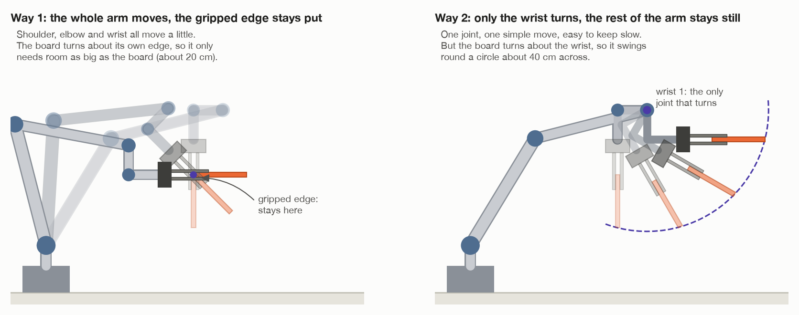
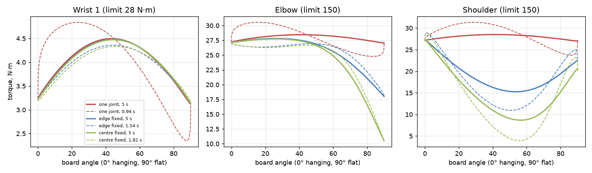
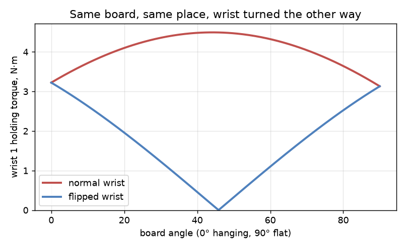

# The swing: who moves, and how heavy a top it can take

This goes with [`TOP_FROM_WALL.md`](TOP_FROM_WALL.md), way A: grip the top by
its upper edge, let it hang, and swing it flat in the air. It answers four
questions:

1. During the swing, does only the gripper move, or the whole arm?
2. Does moving one joint put more force on the arm than moving all of them?
3. What real limits does a joint have, and which way do they push the design?
4. What stops this working when the top is heavy, and how do you test that in
   Gazebo?

Numbers are v2's: its gripper, its arm, its table top. File names are v2's
too.

---

## 1. Who moves during the swing?

**The gripper cannot turn anything by itself.** It only opens and closes its
fingers. Every turn and every move comes from the arm's six joints. The last
three, the wrist joints, are the ones next to the gripper.

So the real question is: do all six joints move, or only one wrist joint?
Both work. They are different moves.



**Way 1: the whole arm moves** (this is what `TOP_FROM_WALL.md` describes).
The gripped edge stays in one place and the board turns about it. Wrist 1 does
most of the turning. But wrist 1 sits about 20 cm back from the fingers, so
turning it alone would move the fingers too. The shoulder and elbow move at the
same time to keep the fingers where they are, and because that tilts the
forearm, wrist 1 ends up turning further than the board does: about 140
degrees for the board's 90 (section 2).
You give MoveIt the list of tool poses (`move_linear()` in v2), and it works
out all six joints.

- Good: the board only needs as much empty space as its own size, about 20 cm.
- Bad: MoveIt has to follow a path in space, and that can stop short (v2's
  legs saw it stop at 96%).

**Way 2: only the wrist turns.** Wrist 1 turns 90 degrees and every other
joint stands still. It is the simplest move a robot arm can make: one joint,
from one angle to another.

- Good: nothing to work out, nothing to stop short, and easy to keep slow and
  smooth.
- Bad: the board turns about the wrist, not about its own edge. Its far edge
  swings round a circle about 40 cm across, so it needs twice the empty space.
  The board also ends up somewhere else, but that does not matter, because the
  next move carries it anyway.

**Which one?** For the grip, it makes no difference. How hard the board pulls
on the fingers depends only on its angle and how fast it turns (section 4),
not on which joints do the turning. For the joints, it makes almost no
difference either — section 2 works that out, joint by joint. So choose by
space. **Try way 2 first**, high up where nothing is within 40 cm. Use way 1
where there is less room.

**The carry round the base**, before and after the swing, is mostly the base
joint turning. The shoulder and elbow adjust how far out and how high the part
is, and wrist 3 turns the gripper about the vertical so the gripped edge ends
square to the arm.

| Stage | Joints that move most |
| --- | --- |
| Lift and pull back off the wall | shoulder, elbow |
| Straighten (about 20°) | wrist 1, plus shoulder and elbow in way 1 |
| Carry round, hanging | base, plus wrist 3 to turn the board |
| Swing flat (90°) | wrist 1, plus shoulder and elbow in way 1 |
| Carry round, flat | base, plus wrist 3 |
| Lower onto the legs | shoulder, elbow, wrist 1 |

---

## 2. One joint or many: the force on each joint

### The question

The natural hunch is this. If only wrist 1 moves, wrist 1 does all the work,
so it must strain the hardest. If all six joints move together, they share the
work, so each one strains less.

It is worth checking, because it decides whether way 2 — the simplest move
there is — is also a hard one on the arm.

For a joint that turns, the force it feels is a twist, called **torque**. It is
measured in newton-metres (N·m): a push of one newton, one metre from the
joint. The same push twice as far out is twice the torque. That is why a
spanner has a long handle.

### How it was worked out

By calculation, on v2's own robot, not by estimate. The script
[`figures/joint_torques.py`](figures/joint_torques.py) loads v2's UR5e and
gripper — the same model Gazebo runs, with Universal Robots' own masses for
every link — and a 0.48 kg board, v2's heaviest. It moves the arm through each
swing, and a physics library (PyBullet) works out the torque on all six joints
at every moment.

Three swings are compared, each taking the board from hanging to flat:

| Swing | What moves | What stays still |
| --- | --- | --- |
| **Wrist only** (way 2) | wrist 1 | every other joint |
| **Whole arm, about the edge** (way 1) | shoulder, elbow, wrist 1 | the gripped edge |
| **Whole arm, about the centre** | shoulder, elbow, wrist 1 | the middle of the board |

"Whole arm" is really three joints. The swing stays in one upright plane, so
the base and wrists 2 and 3 never need to move, and in the calculation they
don't.

The third one is new here. If anything should ease the joints, it is turning
the board about its own middle, because then the board itself hardly travels.

Each swing is run twice: at v2's pace, about 5 seconds, and flat out — as fast
as the joints are allowed to turn.

Before it prints anything, the script checks itself four ways. The robot has to
weigh what Universal Robots say it weighs. The holding torques have to match a
second, separate way of working them out. The work the joints do has to equal
the energy the arm and board gain. And the speeds have to match the exact
answer, for the swing where the exact answer is known. If any check fails, it
stops.

### Two kinds of torque

Every joint's torque has two parts, and they behave very differently.

**The holding part.** This is what it takes just to keep things from falling —
the torque the joint would need if the arm froze at that moment. It is the
weight of everything beyond the joint, times how far out that weight sits,
measured sideways from the joint. Only *where* things are matters. How they got
there does not.

**The moving part.** This is what it takes to speed things up and slow them
down. It depends on how fast the swing is, and on how far from the joint the
moving mass is.

### What came out



**At v2's pace, the three swings are almost the same.** Peak torque on each
joint, 0.48 kg board:

| Swing (v2's pace) | Base | Shoulder | Elbow | Wrist 1 | Wrist 2 | Wrist 3 |
| --- | --- | --- | --- | --- | --- | --- |
| Wrist only | 0.0 | 28.5 | 28.4 | **4.50** | 0.0 | 0.0 |
| Whole arm, about the edge | 0.1 | 27.3 | 27.8 | **4.48** | 0.0 | 0.0 |
| Whole arm, about the centre | 0.2 | 27.3 | 27.7 | **4.47** | 0.0 | 0.0 |
| *The joint's limit* | *150* | *150* | *150* | *28* | *28* | *28* |

All in N·m. Wrist 1 carries the same 4.5 N·m whichever way the board is swung.

**Why the hunch does not hold.** The joints of an arm are not a team sharing
one load. They are links in a chain, and every link carries all of the weight
hanging beyond it. Wrist 1 holds up wrist 2, wrist 3, the gripper and the
board. It has to, whatever the shoulder is doing, because nothing else is
holding them. Moving more joints does not take any of that weight off it.

What the holding torque on wrist 1 does depend on is how far out, sideways,
that weight sits. And that depends only on how the board is tilted — not on
which joints tilted it. So the holding torque on wrist 1 is identical in all
three swings, angle for angle: 4.49 N·m at its worst.

At v2's pace the moving part is tiny: at most 0.03 N·m on wrist 1, less than
one per cent of the total. Almost all of the torque is holding.

**Flat out, the hunch shows up — a little.** Going as fast as the joints allow:

| Swing (flat out) | Time | Shoulder | Elbow | Wrist 1 | of which, moving |
| --- | --- | --- | --- | --- | --- |
| Wrist only | 0.94 s | 31.3 | 30.6 | **4.84** | 0.98 |
| Whole arm, about the edge | 1.54 s | 29.0 | 27.2 | **4.36** | 0.14 |
| Whole arm, about the centre | 1.81 s | 28.9 | 27.2 | **4.33** | 0.18 |

Now wrist-only is the hardest on wrist 1, by about half a newton-metre. The
reason is the moving part. Turning only wrist 1 swings the gripper and the
board round a wide circle about it, so all the effort of speeding them up goes
through that one joint. The shoulder and elbow feel it too, because they have
to hold wrist 1 still while the board is flung round it.

The two whole-arm swings even come in a little *under* the 4.49 N·m holding
peak. They happen to be slowing down as they pass the worst angle, and when a
board is being lifted, gravity does part of the braking. That only works while
the arm keeps moving — section 3 comes back to why you cannot count on it.

But look at the times. The whole-arm swings cannot go as fast, and the reason
is a surprise: it is still wrist 1 that holds them back. As the shoulder and
elbow carry the wrist round, they tilt the forearm, and wrist 1 has to turn
further to make up for it — 142° about the edge, 162° about the centre, instead
of the 90° the board needs. Every one of the three swings finishes when wrist
1 reaches its speed limit, 180 degrees a second, so the swing where it turns
least finishes first. Moving more joints made the busiest joint *busier*.

Two more things in the numbers are worth knowing.

- **Base, wrist 2 and wrist 3 feel almost nothing.** A joint only feels the
  part of a twist that is about its own axis. In this swing the board's weight
  twists about a horizontal line, the same way the shoulder, elbow and wrist 1
  point. The other three point the other ways, so gravity cannot turn them.
- **The shoulder and elbow are mostly holding up the arm, not the board.** Of
  the shoulder's 28.5 N·m, the board is responsible for only 2.3 to 3.3 N·m.
  The rest is the arm's own weight: about 15 kg of it lies beyond the
  shoulder. The whole-arm swings ease the shoulder mid-swing (down to 9–15 N·m
  at v2's pace) because they lift the arm's own weight into an easier shape —
  which is the arm helping itself, not the joints sharing the board.

### The worst moment is halfway, not flat

A surprise in the chart: wrist 1 works hardest at about 45°, halfway through
the swing — not at the end, when the board sticks straight out.

The reason is a part of the arm that is easy to overlook. Wrist 2 does not sit
on wrist 1's line; it is 10 cm off to one side. So even when the board hangs
straight down, the whole wrist-and-gripper end of the arm hangs 10 cm out from
wrist 1, and wrist 1 is already holding 3.2 N·m. As the board swings out, its
own lever grows. Halfway through, the two levers point the same way and add
up: 4.49 N·m. By the time the board is flat, the 10 cm offset is pointing
straight down and adds nothing, so the torque falls back to 3.13 N·m.

### What actually lowers it: the arm's posture

That 10 cm offset suggests a better idea than changing how many joints move. A
UR arm can reach almost any pose in several different postures. One of them
holds the same board, in the same place, with the wrist flipped — wrist 2 on
the other side of wrist 1, 10 cm towards the base instead of away from it.

Then the two levers fight instead of adding. As the board swings out, its lever
cancels the offset's, and halfway through they balance out almost completely.



| Posture, v2's pace | Wrist 1 peak | Shoulder peak | Heaviest board before any joint's limit |
| --- | --- | --- | --- |
| Normal wrist (v2's) | 4.49 N·m | 28.5 N·m | 8.6–8.7 kg |
| Flipped wrist | **3.22 N·m** | 43–49 N·m | 9.5 kg |

Flipping the wrist cuts wrist 1's peak by 28%, and it does that for all three
swings. The shoulder picks up the difference, because the flipped posture
holds the arm further out. That is a good trade: the shoulder is five times
stronger than wrist 1, and even at 49 N·m it is using a third of its limit.

The gain is smaller for a heavy board — 8.7 kg to 9.5 kg. A heavy board's own
lever outweighs the 10 cm offset, and at the flat end the offset points
straight down in either posture, so the two are equal there.

### The answer

- **For the joints, one joint or many makes little difference.** Most of every
  joint's torque is holding, and holding depends on where things are, not on
  which joints moved them. At v2's pace the three swings are within 1.3 N·m of
  each other on every joint — under 1% of any joint's limit.
- **The hunch is right only for the moving part, and only at speed.** Flat
  out, wrist-only puts about half a newton-metre more on wrist 1. It is also the
  fastest swing: the whole-arm swings make wrist 1 turn further, and wrist 1's
  speed limit is what sets the pace of all three.
- **Posture matters more than choreography.** Starting from the flipped-wrist
  posture takes 28% off wrist 1's peak, whichever joints then move.
- **The joints are not the weak point anyway.** Even the busiest joint, wrist
  1, uses 16% of its limit, and a board would have to weigh 8.6 kg before any
  joint gave out. The grip twists loose at about 0.8 kg (section 5). So choose
  the swing on space, speed and simplicity — way 2 first — and start it from
  the flipped wrist if the space allows.

To run it yourself, see [`README.md`](README.md#the-pictures).

---

## 3. What a joint can take, and which way that pushes the design

A robot joint is an electric motor driving a gearbox. Each has limits, and
each limit points the design a different way.

**1. Its torque limit — the one that sets how much the arm can carry.** Each
joint can only twist so hard. On a UR5e that is 150 N·m for the base, shoulder
and elbow, and 28 N·m for the three wrist joints. The wrist joints are made
five times weaker on purpose: every gram at the end of the arm has to be held
up by every joint behind it, so the joints near the tip are built small and
light. That makes wrist 1, not the shoulder, the joint that runs out first.

This is the property that answers "how heavy?". Work out the holding torque on
each joint at the worst moment of the move, and compare it with the joint's
limit. The joint closest to its limit is the one that decides. Here that is
wrist 1, at about 45° through the swing.

**Which way it pushes:** keep the lever at the weak joints short. Grip the
board nearer its middle, or choose the posture where the wrist's own offset
works against the board's lever instead of with it.

**2. Holding still is harder than it looks — heat.** A motor holding a load
still is doing no work, but it is still drawing current, and current makes
heat. A joint can push to its limit for a moment, but not for minutes on end;
the torque it can keep up all day is lower. Holding torque is exactly the
kind that lasts — through the whole carry — while the moving part only lasts
for the moment the arm speeds up or slows down.

**Which way it pushes:** don't linger with the board at the worst angle. Swing
through the halfway point rather than stopping there, and carry the board
flat, where wrist 1's torque is lower.

**3. A top speed.** Every UR5e joint is limited to 180 degrees a second, and a
motor also loses torque as it nears top speed. In this swing the speed limit
bites long before the torque limit does: the whole-arm swings need 1.5 to 1.8
seconds, wrist-only 0.94. In all three it is wrist 1 that reaches the limit.

**Which way it pushes:** when time matters, choose the move that turns the
busiest joint the least. Here that is wrist-only: wrist 1 turns just the 90
degrees the board needs, where the whole-arm swings make it turn 142 or 162.

**4. The gearbox has its own limits.** A robot's gearbox is what turns a fast,
weak motor into a slow, strong joint. Its teeth have a torque they can take
through ordinary starts and stops, and a higher one they can survive only
occasionally, such as in an emergency stop. Running close to the everyday limit
wears the gearbox out sooner.

**Which way it pushes:** smooth starts and stops, like the ones used here,
rather than sudden ones. The moving part of the torque comes from how quickly
the speed changes, so a gentle start is gentle on the gears.

**5. The arm can be stopped at any moment.** A safety stop freezes the arm
where it is, and it then has to hold the board there. The fast wrist-only
swing seems to cope with a heavier board (9.1 kg) than the slow one (8.7 kg),
but only because it passes the worst angle while slowing down, with gravity
helping it brake. Stopped exactly there, it would need the full holding
torque.

**Which way it pushes:** size the design for holding the board still at the
worst point of the move. Never count on the motion itself to get through.

**6. Joints are slightly springy.** Under load a gearbox twists a little, so a
board held out on a long lever sags slightly below where the arm thinks it is.
It is a small amount, but it is exactly the kind of error that makes a top
land a few millimetres off the legs.

**Which way it pushes:** shorter levers again, and a camera check before the
top is let go — which v2 already does.

**7. A cobot's safety settings.** A collaborative robot like the UR5e is told
the weight and centre of its load, and uses that to predict the torque each
joint should need. If a joint needs noticeably more than predicted, the robot
assumes it has hit something and stops. It also limits how fast the tool may
move and how much momentum it may carry, so it is safe near people.

**Which way it pushes:** tell the robot the board's real weight — which it has
to measure first, as section 6 describes — or it will stop mid-swing for no
visible reason. And prefer moves that keep the board slow: wrist-only whips the
board's far edge round a wide circle, while turning it about its own middle
only spins it in place.

---

## 4. What the weight does

Try this with a notebook. Pinch it by one edge and let it hang: easy. Now
hold it flat, still pinched by that one edge: much harder. Try the same with
a heavy dictionary: you cannot. A person would not even try. They would use
two hands, or rest one end on the table first.

The robot has the same problem.


The board's weight asks three things of the robot:

1. **Don't let it slide out.** Hanging, the weight pulls along the fingers.
   Friction at the pads holds it. Friction can be at most the squeeze times
   the friction number (μ), on each finger.
2. **Don't let it twist out.** Held flat, the weight sits out beyond the
   fingers. Weight times that distance (the *lever*) is a twisting pull. The
   two rows of pads on each finger push back against it, and how hard they can
   push depends on the squeeze and on how far apart the rows are.
3. **Hold the arm up.** The weight and its lever also load the arm's joints,
   most of all the wrist, which is closest.

Moving adds to all three. When the arm speeds up or slows down, the board
pushes back on the fingers. Keep the swing slow and smooth. v2 carries every
part at a tenth of full speed for this reason.

The chart in `TOP_FROM_WALL.md` shows how the twist grows through the swing.
It is zero when hanging and largest when flat.

---

## 5. The numbers

With v2's gripper and arm, for a top 20 cm wide:

| Limit | What decides it | v2's value | Heaviest top it allows |
| --- | --- | --- | --- |
| Slide out, hanging | 2 fingers × μ × squeeze | 2 × 1.2 × 25 N = 60 N | about 6 kg |
| Twist out, flat | squeeze × distance between pad rows | 25 N × 2.4 cm ≈ 0.6 N·m | **about 0.8 kg** |
| Wrist 1 strength | the wrist's torque limit | 28 N·m | about 8.6 kg (9.5 kg with the wrist flipped, section 2) |
| Arm's payload | UR's rating, including the 0.9 kg gripper | 5 kg | about 4 kg |

The squeeze (25 N) and the pad friction are in `gripper.urdf.xacro`; the part's
friction (1.2) is in `world/part.sdf`; the wrist's limit is in
`ur_description/config/ur5e/joint_limits.yaml`. The twist limit is a rough
estimate: the real one also depends on how the simulator handles the contact
at each pad. The test in section 7 gives the true answer.

The arm's payload is the rating for a load close to the flange. The top's
weight sits 30 cm out, and UR's payload chart allows less there. Check that
chart before trusting the 4 kg.


What this means:

- **The twist on a flat board gives out first**, long before the arm itself
  struggles. That is the weak point of way A.
- v2's top weighs 0.25 to 0.48 kg. That uses 30 to 57% of the twist limit. It
  works, but without much to spare.
- A heavier top does not fail all at once. It slips part way through the
  swing, at the angle where the twist first gets too big:

  | Top's weight | Where in the swing it slips (0° = hanging, 90° = flat) |
  | --- | --- |
  | 0.48 kg (v2's heaviest) | does not slip |
  | 1.0 kg | at about 57° |
  | 1.5 kg | at about 34° |
  | 2.4 kg | at about 20° |

- A real table top, say 60 × 40 × 1.8 cm of MDF, weighs about 3.2 kg. Held
  flat by one edge it needs a twist of about 5.5 N·m, nine times what the
  fingers can give. **Way A is for light tops only.**

How the limit could be raised, most useful first:

1. **Let something else carry part of the weight.** Rest one edge on the legs
   and tilt it down, as a person would. See [`TILT_ON_LEGS.md`](TILT_ON_LEGS.md).
2. **Grip the middle, not the edge.** A suction cup on the middle of the face
   (way B in `TOP_FROM_WALL.md`) has almost no lever.
3. **Spread the pads further apart.** The twist limit grows in step with the
   distance between the rows: 10 cm apart instead of 2.4 is four times more.
4. **Squeeze harder.** The twist limit grows in step with the squeeze. Real
   grippers go up to about 200 N.

---

## 6. Weight in Gazebo: how the dots connect

Gazebo has no idea of "heavy". It only knows, for each object, a **mass** and
how that mass is spread out (the **inertia**). Everything else follows from
that, step by step.


On the simulator's side:

1. `world/spec.py` sets the top's density (`TOP_DENSITY = 400` kg/m³, about
   poplar plywood) and the ranges its size is drawn from.
2. `world/spawn.py` works out the mass: density × length × width × thickness.
   From the mass and the size it works out the inertia too.
3. `world/part.sdf` carries both into the world file, along with the
   friction number (μ = 1.2) and how stiff a contact is.
4. **Gazebo's physics** runs in steps of 4 ms (`world/cell.sdf`). In every
   step, gravity pulls on each mass. Where two shapes touch, Gazebo pushes
   them apart, and allows friction up to μ times that push.

On the robot's side:

5. `arm/gripper.urdf.xacro` gives each finger a limit: it pushes with at most
   25 N. The pads have μ = 1.6.
6. The UR5e's joint limits (150 N·m for the big joints, 28 N·m for the wrist
   joints) cap how hard each joint can push.
7. The robot senses what happens: joint angles and efforts (on
   `/joint_states`), the fingertip contact sensors, and the camera.

When the board needs more friction, or more twist, than the fingers can give,
Gazebo lets it slide. That is the same as in real life, only more sudden.
The fingertip contact sensors then stop feeling the board, and v2's task
stops with "the top slipped out of the gripper".

**The robot never reads the mass.** That would break the project's one rule.
If it needs to know the weight, it has to measure it. It can: read the wrist
joints' efforts just before and just after lifting the top. The difference,
divided by the lever, is the top's weight. Then it can choose: light enough,
swing it; too heavy, rest it on the legs; far too heavy, stop and say so.

---

## 7. How to make the top heavier for a test

Change `TOP_DENSITY` in `world/spec.py`. The mass goes up in step with it, and
the inertia follows by itself, because `spawn.py` works it out from the mass.
Do this in a copy for v3, not in the working v2.

For the largest top (30 × 20 × 2 cm):

| `TOP_DENSITY` (kg/m³) | Mass | What should happen with way A |
| --- | --- | --- |
| 400 (v2 now) | 0.48 kg | works |
| 700 | 0.84 kg | right at the limit: may slip near flat |
| 1000 | 1.2 kg | slips around halfway through the swing |
| 2000 | 2.4 kg | slips early, about 20° into the swing |

2000 kg/m³ is not a real wood. It is a way of testing a heavy top without
making it bigger. Making it bigger also works, but the top must still fit the
gripper (at most 6.5 cm thick) and the arm's reach.

While it runs, watch:

```
ros2 topic echo /joint_states   # wrist 1's effort peaks halfway, then eases
gz model -m table_top -p        # where the top really is, from the simulator
```

If the predictions in the table hold, the numbers in section 5 are right. If
the top slips earlier, the simulated pads hold less than the estimate, and way
A's real limit is lower still.
