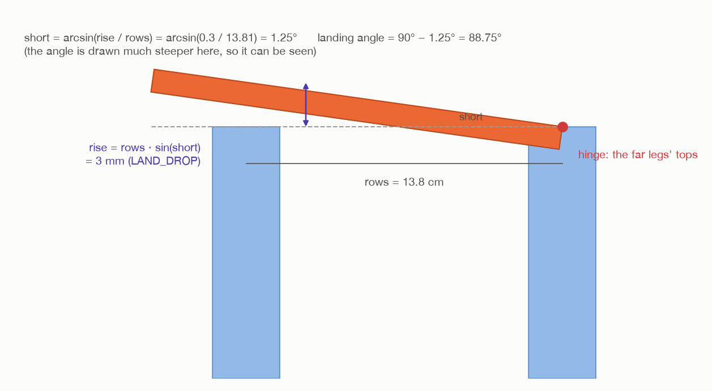

# Step 3: plan every pose before touching the top

[← step 2](02-measure-the-legs.md) · [index](README.md) · next: [step 4 →](04-grip-lift-carry.md)

## What happens

**Nothing moves.** `_plan_tilt()` in `task.py` works out every pose from the
grip to the pull-out, and follows them all on the robot's model, one after
another, the way the arm will really go through them. Only if every one works
does the arm touch the top.

The plan is worked **backwards from the finished table**:

1. **Where it ends:** lying on all four legs, from the hinge towards the arm.
2. **Just before that:** 1.25° short of flat, 3 mm above the near legs.
3. **Where the tilt starts:** leaning 20°, its lower edge on the hinge.
4. **Before that:** the same, 5 cm higher, above the legs.
5. **Before that:** leaning 20° in the air, 45 cm out from the base.
6. **Before that:** hanging straight down in the same place.
7. **And before that:** lifted out of the holders, carried round.


## What comes in

| From | Value | Seed 1 |
| --- | --- | --- |
| step 1 | the top's box, its width, the edge | 16.5 cm wide; edge 16.6 cm up |
| step 2 | `hinge`, `along`, `toward`, `rows`, the near legs | see step 2 |
| step 1 | the floor | 0.0 cm |

---

## 3a. Four things worked out once

### The tilt axis

```
axis = (0, 0, 1) × toward, made length 1         tilt_axis()
```

A level line square to `toward`, so it runs along the far row. Turning a
standing board by a **positive** angle about it tips the board's top **towards
the arm**. Seed 1: (−0.948, −0.318, 0), the same line as `along`.

### Where to lean it over in the air

```
out     = the level direction from the base to the hinge
lean_at = base + out × 0.45                     (LEAN_RADIUS)
height  = the higher of:  floor + 0.40          (TURN_HEIGHT)
                          hinge height + 0.04 + the top's width   (CARRY_CLEARANCE)
```

- **45 cm out:** close enough in for the arm to hold it hanging there, and short
  of the near legs, which the top passes over on the way out.
- **Height:** hanging from its edge, the top's lower edge must clear the leg
  tops by 4 cm. Seed 1: 16.8 + 4 + 16.5 = 37.3 cm, less than 40, so **40 cm**.

Seed 1: **lean_at = (12.4, −43.3, 40.0) cm**. The middle of the gripped edge
goes here.

### The landing angle



A full quarter turn from upright would put the top straight down on the near
legs. The arm stops just short and lets it drop the last 3 mm
(`LAND_DROP`). Driven all the way down, a near leg standing a hair taller than
measured would have the top pushed into it.

`landing_angle()` in `assembly/table.py`. The top turns about the hinge, and the
near legs are `rows` away from it. Tilted a small angle short of flat, its
underside above the near legs is `rows × sin(short)`:

```
rise    = (taller near leg's top + 3 mm) − hinge height
short   = arcsin(rise / rows)
landing = 90° − short
```

Seed 1: the legs are all 16.8 cm tall, so rise = 3 mm, and

```
short   = arcsin(0.3 / 13.81) = 1.25°
landing = 88.75°               from upright
```

### How far it leans: 20°, or 30°

`LEANS = (20°, 30°)`. **20° is tried first.** 30° only if 20° cannot be
done.

**Why lean at all?** Hanging straight down, the top's lower edge is its whole
width plus 12 cm below tool0. To put that edge on legs 76 cm out, the arm would
have to reach further out and higher than it can. Leaning, the top sticks out
ahead of the tool, so the tool does not have to go as far.

**Why as little as possible?** The more the top leans, the more its weight
twists it in the fingers: the twist grows with sin(lean). At 20° it is a third
of what it would be flat; at 30°, half. The first build leaned 30° every time,
and a 3.06 kg top twisted out during the tilt and knocked all four legs over
([step 9](09-check-the-table.md#what-leaning-30-did)).

---

## 3b. The poses, for one choice of lean, grip and wrist

For each lean, for each of the **two grips** (tool x along ±`along`), for **both
wrist sides**:

```
for leaning in (20°, 30°):
    for pick in edge_pick_poses(top):                     # two grips
        approach = pick + 8 cm up
        usual = wrist_side(approach)                      # the side the solver prefers
        for wrist in (usual, −usual):                     # both sides
            can reach the approach with this wrist?
            can reach the lifted pose (pick + width + 4 cm) with this wrist?
            H = P⁻¹ · pick
            for hanging in the two hanging poses at lean_at, least wrist 3 first:
                ... the poses below ...
                follow them all, one after another
```

**Why both wrist sides?** The wrist cannot flip with the top in hand, so the
side at the grip is the side for the whole route. On some legs, only one of the
two gets the top all the way down. (The air turns only try the usual side.)

### The hanging pose

```
hanging = down_tool_pose(lean_at + 12 cm up, ±along)       hanging_tool_poses()
```

Tool pointing straight down, tool0 12 cm above `lean_at`, the gripped edge along
the far row. Seed 1: tool0 at (12.4, −43.3, 52.0) cm.

### The edge it rests on

`resting_edge()` in `assembly/grasps.py` picks, **in the top's own frame**, the
edge that will sit on the hinge:

```
up axis = whichever of the top's two long axes points most nearly up while hanging
local[up axis]  = −(half the width), on the lower side          the lower edge
local[normal]   = ±(half the thickness), on the side facing `toward`   the arm's side of it
local[along]    = 0                                             the middle of the edge
```

Of the lower edge's two corners, it is **the one on the arm's side**: the edge a
box turns on when it is tipped over towards you. Turning about that exact line,
nothing slides on the leg tops.

Seed 1, in the top's own frame: (0, −8.2, −1.0) cm. That is 8.2 cm down its
face from the centre, and 1 cm (half the thickness) out on the arm's side.

`board_point(pose, H, local)` turns a point written in the top's own frame into
a room point, for the tool at `pose`:

```
room point = pose · H⁻¹ · (local, 1)
```

`pose · H⁻¹` is the top's pose ([the hold](../turn-by-wrist/03-grip-the-edge.md#3f-how-h-is-used-from-here-on)),
and multiplying it by a local point gives that point in the room.

### Standing on the hinge, then leaning

```
standing = hanging, shifted so that the resting edge is exactly on the hinge
touch    = standing, turned by `leaning` about the line through the hinge along `axis`
above    = touch + 5 cm up                                           (ABOVE_LEGS)
```

1. **standing**: move the whole hanging pose, without turning it, so the
   resting edge lands on the hinge. It is still hanging upright:
   ```
   standing = shifted(hanging, hinge − board_point(hanging, H, resting edge))
   ```
2. **touch**: turn that about the hinge by 20° (`turned_about()`, the same
   `c + R · (p − c)` as the whole-arm turn,
   [explained here](../turn-by-whole-arm/07-turn-about-the-edge.md#turning-a-pose-about-a-line-that-does-not-pass-through-0-0-0)).
   The resting edge is on the pivot, so it stays on the hinge, and the top now
   leans 20° towards the arm.
3. **above**: the same pose 5 cm higher, where the let-down starts.

Seed 1: touch has tool0 at (18.1, −64.8, 43.9) cm, reaching (0.11, −0.32,
−0.94): 20° from straight down.

### The lean in the air

```
lean = swing_about_edge(hanging, axis, leaning, 5°)        4 poses: 5°, 10°, 15°, 20°
```

The same function as the whole-arm turn: the top turns about **its gripped
edge**, which stays at `lean_at`. Its lower edge swings out, away from the arm.

After the lean, the top faces exactly as it will at `touch`. Both are "hanging,
turned 20° about `axis`", so the carry out needs no more turning.

### The carry out

```
out = straight_line(lean's last pose, above, 2 cm)       seed 1: 26.5 cm, 14 poses
```

`straight_line()` gives poses 2 cm apart along the straight line between the two,
all facing the same way. Spelled out like that, every 2 cm of the line is
followed and checked on its own.

### The tilt down

```
tilt = tilt_steps(touch, hinge, axis, landing − leaning, 3°)
     = 88.75° − 20° = 68.75°, in 3° steps: 23 poses
```

`tilt_steps()` is `turned_about()` at 3°, 6°, …, 68.75° about the hinge. The
resting edge is on the pivot, so it never moves. **Nothing slides on the legs.**

Seed 1, the last pose: tool0 at (11.8, −46.2, 18.3) cm, reaching almost level,
away from the arm. The top lies 1.25° short of flat, its centre at
(18.3, −65.4) cm.

### The pull back

```
pull back = the last tilt pose, moved 6 cm back along the way the tool reaches   (TOP_RETREAT)
```

`backed_off()`. Seed 1: tool0 at (9.9, −40.5, 18.5) cm.

---

## 3c. Follow them all, one after another

```python
stages = (
    ("hold it hanging where it is leaned over", [hanging]),
    ("lean it over", lean),
    ("carry it out over the far legs", out),
    ("let it down on them", [touch]),
    ("tilt it down onto the near legs", tilt),
    ("pull back out of it", [backed_off(tilt[-1], TOP_RETREAT)]),
)
why = self._first_out_of_reach(stages, wrist)
```

**1 + 4 + 14 + 1 + 23 + 1 = 44 poses.** `can_follow()` in `arm/motion.py` goes
through them in order:

- each pose is solved **starting from the joint angles of the one before**, so
  the arm keeps one shape the whole way, as it will for real;
- with the wrist on the side being tried, and the elbow bent the same way;
- nothing may be hit;
- **no joint may jump more than 30°** (`MAX_JOINT_JUMP`) between two poses. Poses
  a few degrees or centimetres apart that need a big jump mean the arm is near a
  pose it cannot move through smoothly.

This is stronger than the air turns' check. There, each turn pose was solved on
its own. Here, the whole route is followed as a path.

If a pose fails, the log says which stage and which pose, and the next choice
is tried. A line looks like this (the numbers are only an example):

```
  not leaning 20 degrees that way: the arm cannot tilt it down onto the near legs (pose 21 of 23): wrist_1_joint would have to jump 175 degrees there
```

### The carry round

Once a choice passes, the carry is planned exactly as for the air turns
([wrist step 5](../turn-by-wrist/05-carry-round.md)), from the lifted pose to
the hanging pose at `lean_at`, the top's centre at the higher of its two
heights.

## 3d. The result: a TiltRoute

```python
TiltRoute(
    route        = Route(approach, pick, lifted, carry, wrist),   # step 4
    leaning      = 20°,                                            # steps 5, 7
    lean         = 4 poses,                                        # step 5
    out          = 14 poses,                                       # step 5
    touch        = leaning, lower edge on the hinge,               # step 6
    resting_edge = (0, −8.2, −1.0) cm in the top's frame,          # step 7
    axis         = along the far row,                              # step 7
    landing      = 88.75°,                                         # step 7
)
```

If nothing passes: *"the top cannot be put on these legs however it is gripped:
…"*. The top has not been touched.

The 23 tilt poses themselves are **not** kept. Step 7 makes them again from
where the arm really is.

---

## Fixed and measured numbers in this step

| Number | Value | Kind | Where |
| --- | --- | --- | --- |
| `LEANS` | 20°, 30° | choice | `task.py` |
| `LEAN_RADIUS` | 45 cm | choice | `task.py` |
| `TURN_HEIGHT` | 40 cm | choice | `task.py` |
| `CARRY_CLEARANCE` | 4 cm | choice | `task.py` |
| `ABOVE_LEGS` | 5 cm | choice | `task.py` |
| lean step | 5° | choice | `task.py`, `SWING_STEP` |
| `LINE_STEP` | 2 cm | choice | `task.py` |
| `TILT_STEP` | 3° | choice | `task.py` |
| `LAND_DROP` | 3 mm | choice | `task.py` |
| `TOP_RETREAT` | 6 cm | choice | `task.py` |
| `MAX_JOINT_JUMP` | 30° | choice | `arm/motion.py` |
| lean_at, landing, touch, all the poses | see above | **worked out** from steps 1 and 2 | |

## What can go wrong

| Message | Why |
| --- | --- |
| `  not leaning 20 degrees that way: the arm cannot ... (pose N of M): ...` | a log line: this choice failed, the next is tried |
| `the top cannot be put on these legs however it is gripped: the arm cannot reach above the top's edge` | no grip, either wrist side |
| `... the arm cannot lift the top clear of its holders` | |
| `... the arm cannot hold it hanging where it is leaned over: ...` | |
| `... the arm cannot lean it over (pose N of 4): ...` | |
| `... the arm cannot carry it out over the far legs (pose N of 14): ...` | |
| `... the arm cannot let it down on them: ...` | |
| `... the arm cannot tilt it down onto the near legs (pose N of 23): ...` | |
| `... the arm cannot pull back out of it: ...` | |

## Where it is in the code

| What | Where |
| --- | --- |
| the plan | `task.py`: `_plan_tilt()`, `TiltRoute` |
| following the stages | `task.py`: `_first_out_of_reach()`; `arm/motion.py`: `can_follow()` |
| the landing angle | `assembly/table.py`: `landing_angle()` |
| the tilt axis, the resting edge, points on the top | `assembly/grasps.py`: `tilt_axis()`, `resting_edge()`, `board_point()` |
| the poses | `assembly/grasps.py`: `turned_about()`, `swing_about_edge()`, `straight_line()`, `tilt_steps()`, `backed_off()` |
| the tests of the geometry | `test/test_table.py` |

[← step 2](02-measure-the-legs.md) · [index](README.md) · next: [step 4 →](04-grip-lift-carry.md)
