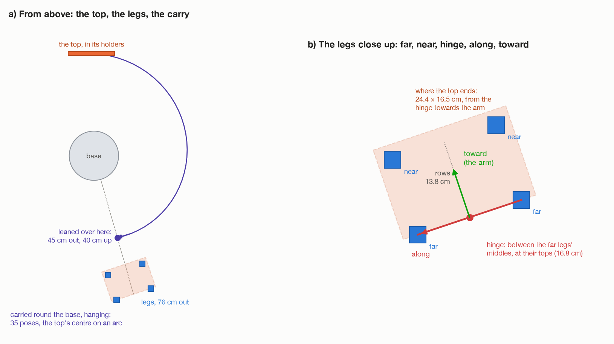

# Step 4: grip, lift out, carry round

[← step 3](03-plan-before-moving.md) · [index](README.md) · next: [step 5 →](05-lean-and-carry-out.md)

**The same code as the turns in the air**, `_pick_up()` in `task.py`. The full
explanations are in the wrist docs:
[grip](../turn-by-wrist/03-grip-the-edge.md),
[lift](../turn-by-wrist/04-lift-out.md),
[carry](../turn-by-wrist/05-carry-round.md).
Only **where the carry ends** is different.

## What happens

### Grip

1. Open the fingers to thickness + 3 cm: **4.9 cm**.
2. Free move to 8 cm above the grip, **wrist on the side step 3 chose**.
3. Take the top out of MoveIt's picture, so the fingers may touch it.
4. Straight down 8 cm. tool0 ends **12 cm above the edge**, fingertips **5 cm
   past it**, both rows of pads on the board.
5. Close to thickness − 4 mm. The fingers stop on the board and squeeze. The
   fingertip sensors must feel it.
6. Tell MoveIt the top is **attached**.

From here the hold `H = P⁻¹ · T` gives the top's pose from the tool's:
`top = tool · H⁻¹`.

### Lift

Straight up by width + 4 cm: **20.5 cm**. The robot never sees the holders, but
they must be lower than the top edge the fingers reached, so the lower edge is
lifted past where the upper edge was.

### Carry

On an arc round the base, the top's centre at one height, hanging straight
down, turning only about the vertical.

## What is different for the tilt

**Where it goes.** The air turns carry the top to the turning spot in front of
the arm. The tilt carries it to **`lean_at`**, 45 cm out on the way to the legs,
40 cm up, with the gripped edge along the far row
([step 3](03-plan-before-moving.md#where-to-lean-it-over-in-the-air)).

| | Air turns | Tilt |
| --- | --- | --- |
| where the gripped edge ends | (50, 0, 40) cm, in front | **(12.4, −43.3, 40) cm**, to the right |
| the edge runs along | wrist 1's axis | **the far row of legs** |
| round the base | about 91° | **about 165°**, from the left round the front to the right |
| the tool turns about the vertical | −104.9° | **−160.9°** |
| wrist 3 adds | about 13.6° | **about 4.5°** |
| carry poses | 22 | **35** |
| the top's centre carried at | 31.75 cm | **31.75 cm** |

The carry height is the same because both end with the gripped edge 40 cm up:
40 − 8.25 = 31.75 cm, higher than the 28.8 cm the lift leaves it at.

**The wrist side.** The air turns always grip with the wrist on the side the
solver prefers. The tilt may grip with it the other way, if step 3 found only
that side gets the top all the way down. It is then kept for the whole route.

## After the carry

The arm is at the hanging pose: tool0 at (12.4, −43.3, 52.0) cm, pointing
straight down, the top hanging below it with its lower edge 23.5 cm up. The
fingertips must still feel it: *"the top slipped out of the fingers as it was
carried round"*.

## What can go wrong

The same as the air turns' steps 3 to 5: the fingers not opening, a move not
arriving, the grip missing, the top slipping in the lift or carry.

[← step 3](03-plan-before-moving.md) · [index](README.md) · next: [step 5 →](05-lean-and-carry-out.md)
