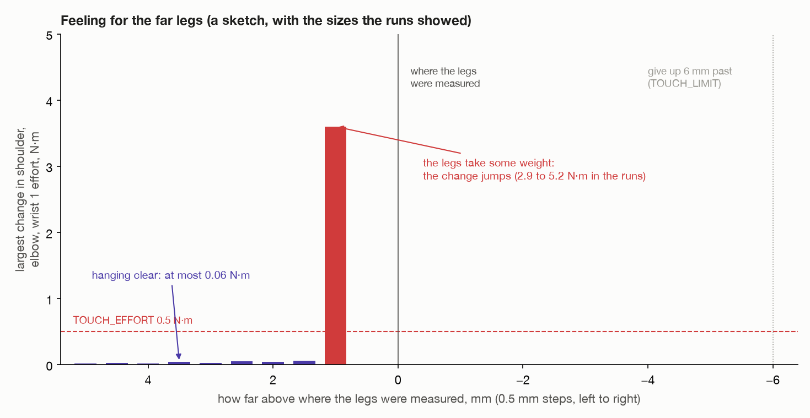

# Step 6: feel for the far legs, then loosen the grip

[← step 5](05-lean-and-carry-out.md) · [index](README.md) · next: [step 7 →](07-tilt-down.md)

## What happens

1. Go down to 5 mm above where the top should touch the far legs.
2. **Come down half a millimetre at a time.** After each step, stand still and
   read the joints' efforts.
3. **When the efforts suddenly change**, the legs have taken some of the top's
   weight. Go back up that one step.
4. **Loosen the grip** by 4 mm, so the fingers cradle the top instead of
   squeezing it.

**Joints that move:** the shoulder, the elbow and wrist 1, a fraction of a
millimetre at a time.



## What comes in

| From | Value | Seed 1 |
| --- | --- | --- |
| step 5 | the arm at `above`, the top leaning 20° | lower edge 5 cm above the hinge |
| step 3 | `plan.touch`: the pose with the lower edge exactly on the hinge, **as measured** | tool0 at (18.1, −64.8, 43.9) cm |

---

## 6a. Why feel, instead of going straight to `touch`?

`touch` puts the top's lower edge exactly on the hinge, **as the numbers say**.
Two numbers go into it, and each is good to a millimetre or two:

- **where the legs' tops are**, from the camera;
- **where the top's edge is in the fingers**, from the camera's measurement of
  the top and where the fingers closed on it. A heavy top also sags a little in
  the fingers on the way out.

Together they can be off by a few millimetres. Going straight to `touch`:

- **too high**, and the top is let go of in the air above the legs;
- **too low**, and the arm, which follows its path stiffly, **pushes the top
  down into the legs**. Anything off-centre about that push is a push from the
  side, and a leg standing loose on the floor is easily knocked over
  ([why](../approaches/tilt-onto-legs.md#legs-falling-over-the-big-one)).

So the arm feels for the legs with the only sense it has for it: **its own
joints**.

## 6b. What the joints can feel

Every joint reports its **effort**, the torque it is putting out to hold its
position ([what torque is](../turn-by-wrist/07-what-each-joint-does.md#1-two-kinds-of-torque)).

- **Hanging clear**, the shoulder, elbow and wrist 1 hold up the whole top.
  Moving down 0.5 mm changes their efforts hardly at all: in the runs, at most
  0.06 N·m, as the arm's own weight shifts a little.
- **The moment the legs take some of the top's weight**, those joints have less
  to hold up. Their efforts **jump**: 2.9 to 5.2 N·m in the runs, fifty times
  as much.

The whole of a 0.3 kg top resting on the legs takes about 1.5 N·m off the
shoulder. The threshold, **0.5 N·m** (`TOUCH_EFFORT`), sits well above the noise
and well below a real touch.

### Reading the efforts: `_still_efforts()`

A single reading bounces. So each time:

```
wait 0.3 s                 (SETTLE)   let the arm stop shaking after the move
record for 0.3 s           (AVERAGE)  every /joint_states message
average each joint's effort over those readings
```

---

## 6c. The loop: `_let_down()`

```python
ready = touch, 5 mm higher                            # TOUCH_START
move to ready (checked; unchecked if refused)
before = still efforts

depth = +5.0 mm
while depth > −6.0 mm:                                # TOUCH_LIMIT
    depth −= 0.5 mm                                   # TOUCH_STEP
    move straight to (touch, depth higher), unchecked
    change = the largest |still efforts − before|, over the shoulder, elbow and wrist 1
    log it
    if change > 0.5 N·m:                              # TOUCH_EFFORT
        log "the far legs took the top's weight at depth"
        move back up one step, to (touch, depth + 0.5 mm higher)
        return

stop: "let the top down 6 mm past where the far legs were measured and felt nothing"
```

Line by line:

- **Start 5 mm above.** Getting there is a normal checked move. MoveIt may
  refuse it, because the top is almost touching legs it knows about. Then it is
  run unchecked: it is short and straight down.
- **`before`** is read with the top hanging clear. Every later reading is
  compared with it, not with the step before. A slow creep adds up and shows.
- **The steps down are unchecked.** From here on the top is meant to touch the
  legs, and MoveIt would count that as a collision.
- **Only the shoulder, elbow and wrist 1** are compared (`[1:4]` in the code).
  They are the joints that hold the top's weight up.
- **Back up one step.** On the step it was felt, the top is already pressing on
  the legs a little. One step back up, it rests on them rather than being pushed
  into them. As it then sags in the fingers, they catch it.
- **Give up 6 mm past** where the legs were measured. The top has missed the
  legs, or they are not where they were. The arm stops before pushing anything
  over.

At most 22 steps, from +4.5 to −6.0 mm, each with 0.6 s of waiting and
reading.

The log, one line per step:

```
  +4.5 mm: the joints' efforts changed by up to 0.02 N·m
  +4.0 mm: the joints' efforts changed by up to 0.03 N·m
  ...
  +1.0 mm: the joints' efforts changed by up to 3.61 N·m
the far legs took the top's weight +1.0 mm from where they were measured
```

(The numbers are only an example, sized like the runs.)

### What the runs showed

| Top | Legs felt, from where they were measured |
| --- | --- |
| 0.31–0.39 kg | 0.5 to 2.0 mm **high**, over ten runs in four rooms |
| 2.29 kg | 2.0 mm high |
| 3.06 kg | 2.5 mm high |
| 3.82 kg | 4.5 mm high: on the very first step |

Always a little high, and higher for heavier tops, which sag more in the fingers
on the way out. That is exactly the error feeling for the legs is there to
absorb.

---

## 6d. Loosen the grip: `_loosen_grip()`

```python
before = still efforts
closed = the gap the fingers are at now           seed 1: about 1.9 cm, the top's thickness
set the fingers to  min(closed + 4 mm, 7.4 cm)    # GRIP_LOOSEN
log how much the shoulder's, elbow's and wrist 1's efforts changed
```

**Why?** Now the far legs hold up one edge of the top. If the fingers still
squeezed it, the top would be **held rigidly at both ends**: by the legs, and by
the arm. Any error in the arm's path during the tilt, a millimetre here or
there, would be forced straight into the legs.

**Just open**, the fingers only **cradle** it. The gripped edge lies on the
lower finger and turns between the two like a hinge. The arm still carries that
edge until the near legs take it, but it can no longer shove the top.

**Why 4 mm?** 2 mm each side. Enough that the fingers are clearly open, small
enough that the edge, 5 cm deep between them, can only rock a few degrees.

The log:

```
loosened the grip, fingers from 19.0 mm to 23.0 mm; the shoulder's, elbow's and wrist 1's efforts changed by +0.12, -0.05, +0.03 N·m
```

(Example numbers.) The changes show how much of the top the squeeze had been
holding.

**From here, a fingertip losing touch no longer means the top slipped.** The top
can lie on the lower finger's inner pad alone. So the fingertip check is dropped,
and the camera decides at the end.

---

## What goes out

| Value | Seed 1 | Used in |
| --- | --- | --- |
| the top resting on the far legs, leaning 20° | its lower edge on the hinge, as really found | step 7 |
| the grip loosened | fingers 4 mm wider than the top | step 7 |

## Fixed and measured numbers in this step

| Number | Value | Kind | Where |
| --- | --- | --- | --- |
| `TOUCH_START` | 5 mm | choice | `task.py` |
| `TOUCH_STEP` | 0.5 mm | choice | `task.py` |
| `TOUCH_LIMIT` | 6 mm | choice | `task.py` |
| `TOUCH_EFFORT` | 0.5 N·m | choice | `task.py` |
| `SETTLE`, `AVERAGE` | 0.3 s, 0.3 s | choice | `task.py` |
| `GRIP_LOOSEN` | 4 mm | choice | `task.py` |
| the depth the legs are felt at | 0.5 to 4.5 mm high in the runs | **measured**, by feel | |

## What can go wrong

| Message | Why |
| --- | --- |
| `...; going down the last few centimetres unchecked` | a log line: the move to 5 mm above was refused, so it is run unchecked |
| `let the top down 6 mm past where the far legs were measured and felt nothing` | the top missed the legs, or sagged so far it was never going to land on them |
| `no joint readings came in` | the efforts could not be read |

## Where it is in the code

| What | Where |
| --- | --- |
| the loop | `task.py`: `_let_down()` |
| reading the efforts | `task.py`: `_still_efforts()` |
| loosening the grip | `task.py`: `_loosen_grip()`; `arm/motion.py`: `set_gripper()` |

[← step 5](05-lean-and-carry-out.md) · [index](README.md) · next: [step 7 →](07-tilt-down.md)
