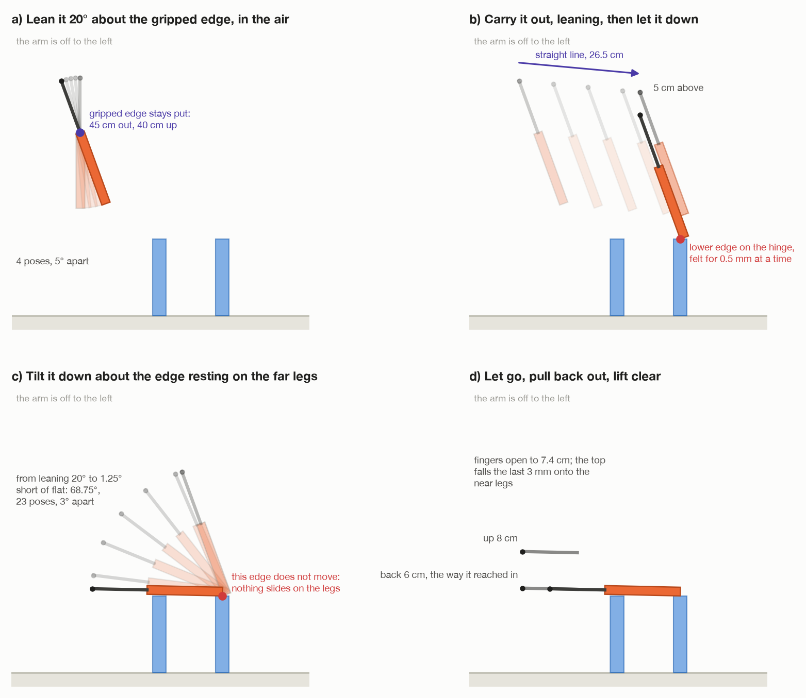

# Step 8: let go, pull back out, lift clear

[← step 7](07-tilt-down.md) · [index](README.md) · next: [step 9 →](09-check-the-table.md)

## What happens

1. **Open the fingers** wide. The top falls the last 3 mm onto the near legs.
2. **Tell MoveIt** the top is no longer in the hand, and where it now lies.
3. **Back out 6 cm**, the way the gripper reached in.
4. **Lift 8 cm** straight up, clear of the table.

**Joints that move:** all six, for the back-out and the lift.



## What comes in

| From | Value | Seed 1 |
| --- | --- | --- |
| step 7 | the arm at the last tilt pose | tool0 at about (11.8, −46.2, 18.3) cm, reaching almost level, away from the arm |
| step 4 | the hold `H` | – |

In `_put_on_legs()` in `task.py`:

```python
placed = self._arm.tool_pose()
self._log.info("letting go just above the near legs")
self._arm.set_gripper(GRIPPER_MAX_OPENING)
self._scene.detach("carried")
board = placed @ np.linalg.inv(held)
self._known["top"] = Box(board[:3, 3], board[:3, :3], top.size)
self._publish()
self._pull_out(placed)
```

---

## 8a. Let go

```
set_gripper(7.4 cm)          GRIPPER_MAX_OPENING, as wide as is safe
```

The fingers open from about 2.3 cm to 7.4 cm. The top was 3 mm above the near
legs and falls onto them.

**Why drop it 3 mm instead of putting it down?** The arm follows its path
stiffly. If a near leg stood a millimetre taller than measured, driving the top
all the way down would push it into that leg. A 3 mm drop cannot push anything
sideways.

## 8b. Tell MoveIt

```
detach("carried")                                  the top is no longer part of the arm
board = placed · H⁻¹                               where the top is now
the top = a box at that pose, the top's measured size
publish                                            MoveIt now sees it lying on the legs
```

`placed · H⁻¹` is the same rule as always: the tool is here, so the top is there
([the hold](../turn-by-wrist/03-grip-the-edge.md#3f-how-h-is-used-from-here-on)).
It is where the top was when the fingers opened, 3 mm above where it lands.

From now on MoveIt keeps the arm clear of the table.

## 8c. Pull back out

`_pull_out()` in `task.py`:

```python
away = backed_off(place, TOP_RETREAT)          # 6 cm back along the tool's own reach
try:
    self._arm.move_linear(away, avoid_collisions=False)
except MotionFailed:
    self._arm.move_to(away)

up = shifted(away, WORLD_Z * LIFT)             # 8 cm straight up
try:
    self._arm.move_linear(up)
except MotionFailed:
    self._arm.move_to(up)
```

### Back 6 cm, the way it reached in

```
backed_off(pose, d) = pose, moved by −(the tool's z axis) × d
```

The tool's z axis is the way it reaches. Backing off along it pulls the fingers
straight back out of the top's edge.

**Why straight back, and not up?** One finger is **under** the top. Lifting
would lift the top with it. Straight back, both fingers slide out from either
side of the edge.

**Why 6 cm?** The fingers reach 5 cm over the edge. 6 cm is further than that,
so they are clear.

**Why unchecked?** At the start, the fingers are either side of the top, which
MoveIt now knows about. Checked, MoveIt would refuse the very first millimetre.
If the straight line fails anyway, MoveIt plans a free move there instead.

Seed 1: tool0 from about (11.8, −46.2, 18.3) to (9.9, −40.5, 18.5) cm.

### Up 8 cm

Straight up, **checked**. The fingers are clear of the top now, so MoveIt can
check the move against the table. A free move if the line fails.

Seed 1: tool0 to (9.9, −40.5, 26.5) cm.

---

## What goes out

| Value | Seed 1 | Used in |
| --- | --- | --- |
| the top on the legs, let go of | – | step 9 |
| MoveIt's picture: the top lying on the legs | – | step 9's camera moves |
| the arm clear of the table | tool0 about 26.5 cm up | step 9 |

## Fixed and measured numbers in this step

| Number | Value | Kind | Where |
| --- | --- | --- | --- |
| `GRIPPER_MAX_OPENING` | 7.4 cm | robot fact | `arm/dimensions.py` |
| `LAND_DROP` | 3 mm, set in step 3 | choice | `task.py` |
| `TOP_RETREAT` | 6 cm | choice | `task.py` |
| `LIFT` | 8 cm | choice | `task.py` |

## What can go wrong

| Message | Why |
| --- | --- |
| `straight-line move to [...] only solved N% ...; letting the planner back away instead` | a log line: the back-out line failed, a free move is tried |
| `...; letting the planner lift clear instead` | a log line: the same, for the lift |
| `no plan found to [...]: ...` | the free move failed too |

## Where it is in the code

| What | Where |
| --- | --- |
| letting go, updating MoveIt | `task.py`: `_put_on_legs()`; `scene.py`: `detach()` |
| pulling out | `task.py`: `_pull_out()`; `assembly/grasps.py`: `backed_off()` |

[← step 7](07-tilt-down.md) · [index](README.md) · next: [step 9 →](09-check-the-table.md)
