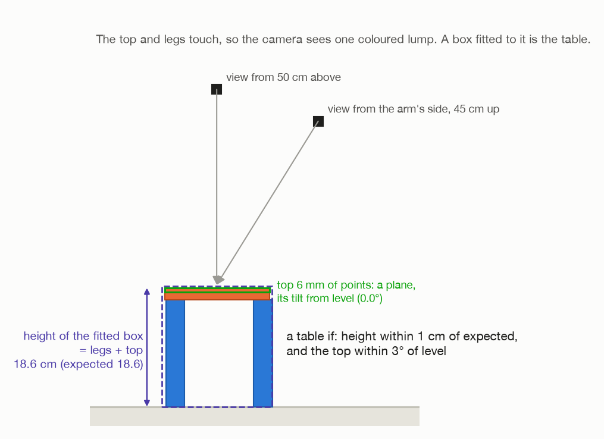

# Step 9: check the table, and report

[← step 8](08-let-go-and-pull-out.md) · [index](README.md)

## What happens

The arm **looks at what it built**. The top and the legs now touch, so the
camera sees them as one coloured lump. A box fitted to that lump **is the
table**: its footprint is the top's, its height is legs plus top. The arm checks
the height and whether the top is level, and reports.

**Joints that move:** all six, to point the camera.



## What comes in

| From | Value | Seed 1 |
| --- | --- | --- |
| step 2 | `hinge`, `toward` | (20.9, −73.2, 16.8) cm; (−0.318, 0.948, 0) |
| step 1 | the top's width and thickness | 16.5 cm, 1.9 cm |
| step 1 | the floor | 0.0 cm |
| step 7 | the joint readings during the tilt | for the report |

---

## 9a. Where the table should be

```
centre = hinge + toward × (width / 2),   at floor height
```

The top lies from the hinge towards the arm, its full width deep, so its middle
is half its width towards the arm from the hinge.

Seed 1: **(18.3, −65.4, 0.0) cm**.

## 9b. Look

`_check_table()` in `task.py`. Two views, both looking at that centre:

```
view 1: 50 cm straight above it
view 2: 15 cm towards the arm from it, 45 cm up
```

A view the arm cannot reach is skipped. If neither can be reached, the check
fails: *"could not get the camera over the table to check it"*.

For each picture, only the **coloured** pixels are kept and turned into points
([how](../turn-by-wrist/01-look-and-measure.md#1b-from-pixels-to-points)).

## 9c. Find the table among the points

```
lumps = group the points into objects                     (1.2 cm cubes, as in step 1)
keep only lumps whose average point is within 15 cm of the centre, seen from above
the table = the biggest of those
```

The top and legs touch, so they are one lump. Anything else coloured, further
away, is ignored. No lump near the centre: *"no table where the table should
be"*.

## 9d. Measure it

```
box     = fit_resting_box(lump, floor)
surface = the lump's points within 6 mm of the box's top
```

`fit_resting_box()` in `perception/fitting.py` fits a box **standing square on
the floor**:

- **height** = the highest point − the floor;
- **length and width** = the smallest rectangle that encloses all the points
  seen from above (OpenCV's `minAreaRect`).

For a table, that is exactly legs plus top, and the top's footprint.

**The top's level.** The points within 6 mm of the top surface are all on the top
face. `surface_tilt()` fits a plane through them, the same way `fit_plate()`
finds a face in step 1: the direction they spread least in is the plane's normal.
Then

```
tilt = arccos( | z part of that normal | )         0° = level
```

### What it should be

```
expected height = hinge height − floor + the top's thickness
                = 16.8 + 1.9 = about 18.7 cm       (seed 1, from the numbers above)
offset          = how far the box's centre is from where it should be, seen from above
```

## 9e. Is it a table?

```python
@property
def good(self) -> bool:
    return abs(height - expected_height) < 1 cm   and   tilt < 3°
```

| Check | Limit | Seed 1 |
| --- | --- | --- |
| height | within 1 cm of expected (`HEIGHT_TOLERANCE`) | **18.6 cm, expected 18.6** |
| level | within 3° (`TILT_TOLERANCE`) | **0.0°** |

(The run's numbers are what the arm measured, rounded. They differ from the
simulator's exact sizes above by about a millimetre.)

**Why the camera, and not the joints and `H`, like the air turns?** The grip was
loosened in step 6, and the top was let go of in step 8. Nothing ties the top to
the tool any more, so `tool · H⁻¹` says nothing about where it ended up. And a
leg knocked over would not show in the joints at all. Only looking can tell.

---

## 9f. The report

`_report()` and `_report_table()` in `main.py`:

```
finished
  table top measured at 24.4 x 16.5 x 1.9 cm
  the tilt down onto the legs took 8.6 s
  joint                   moved      net  peak N·m  holding N·m
  shoulder_pan_joint      10.7°    ...        0.72            -
  shoulder_lift_joint     33.3°    ...       42.54            -
  elbow_joint             51.5°    ...       26.73            -
  wrist_1_joint          141.0°    ...        4.71            -
  wrist_2_joint           20.6°    ...        0.88            -
  wrist_3_joint           13.9°    ...        0.51            -
  table as built: ... cm
  height 18.6 cm, expected 18.6 cm
  top 0.0 degrees off level
  centre ... mm from where it was meant to be
  verdict: a table
```

(Moved, peak and the table numbers are seed 1's from
[`../turn-results.md`](../turn-results.md). The "..." are not recorded there.)

- **The joint table covers the tilt only** (step 7), from leaning 20° to 3 mm
  above the near legs.
- **"holding" is a dash**: the top is not held still afterwards, as it is in the
  air turns, so there is nothing to average.
- The run **succeeds** (exit status 0) only if the verdict is **a table**.

---

## 9g. Results

From [`../turn-results.md`](../turn-results.md), section 5.

### Every top made a table

| Seed | `DENSITY` | Mass | Table height (expected) | Top off level | Worst leg afterwards |
| --- | --- | --- | --- | --- | --- |
| 1 | 400 | 0.31 kg | 18.6 cm (18.6) | 0.0° | moved 0.1 mm |
| 2 | 400 | 0.37 kg | 17.8 cm (17.9) | 0.0° | moved 0.1 mm |
| 3 | 400 | 0.39 kg | 18.9 cm (18.9) | 0.0° | moved 0.2 mm |
| 7 | 400 | 0.31 kg | 16.8 cm (16.9) | 0.0° | moved 1.0 mm |
| 1 | 3000 | 2.29 kg | 18.6 cm (18.6) | 0.0° | moved 2.2 mm |
| 1 | 4000 | 3.06 kg | 18.6 cm (18.6) | 0.0° | moved 1.9 mm, tipped 0.2° |
| 1 | 5000 | 3.82 kg | 18.6 cm (18.6) | 0.1° | moved 2.7 mm, tipped 0.2° |

The height and level are the arm's own check. "Worst leg" is Gazebo's view, which
the robot never gets: how far the worst of the four legs ended up from where it
started. Every leg was still standing.

**The three heavy tops are the ones that could not be turned flat in the air.**
At 2.29 kg the top twisted in the fingers near flat, and at 3.06 and 3.82 kg it
fell out. Resting on the legs, all three made a table.

### What leaning 30° did

The first build leaned the top 30° in the air, not 20°. It made the same tables
with the light top and the 2.29 kg one, but:

- **3.06 kg knocked all four legs over.** The top sagged in the fingers on the
  way out (the legs were felt 4 mm high), and about 30° into the tilt it twisted
  out of the grip, slid, and took the legs with it.
- **3.82 kg missed the legs.** It sagged about 20° back towards hanging on the
  way out, so its lower edge came down short of the far legs. The arm felt
  nothing 6 mm past where they should have been, and stopped. The legs were
  untouched.

Both showed in the efforts before anything went wrong. Coming down, the 3.82 kg
top's readings crept up step by step to 0.33 N·m with nothing touching: the top
slipping in the fingers. And the 3.06 kg top's "touch" was a change of just
0.51 N·m, barely over the 0.5 N·m that counts as one, where a top landing
squarely on the legs gives 3 to 5.

At 30° the twist on the grip is half what it is flat; at 20°, a third. That was
the difference. **The arm now leans 20° if it can reach the far legs that way,
and 30° only if it cannot.** In every room tried, it could.

### What these runs cannot tell

- **A top that sags before it reaches the legs.** The 3.82 kg top was felt on the
  very first step down, so it had sagged at least 4.5 mm. A heavier one could
  already be resting on the legs before the arm starts feeling for them, and the
  arm would not notice. Nor does the arm yet treat a weak touch or a creeping
  reading as a warning, though both showed up in the runs that went wrong.
- **Legs knocked during the tilt.** The arm does not look at the legs again until
  the table is built. A leg knocked over shows up in the table check, as a table
  too low or not level, not at the moment it happens.
- **Legs shorter than 15 cm.** At the end of the tilt the arm holds the top level
  by its near edge. With legs 13 cm tall, that is so low that the arm's wrist is
  down at the floor, and step 3 refuses before touching the top. The room's legs
  are 15 to 17 cm.

---

## Fixed and measured numbers in this step

| Number | Value | Kind | Where |
| --- | --- | --- | --- |
| check views | 50 cm above; 15 cm towards the arm, 45 cm up | choice | `task.py`, `_check_table()` |
| lump near the centre | within 15 cm | choice | `task.py` |
| top surface band | 6 mm | choice | `task.py` |
| `HEIGHT_TOLERANCE` | 1 cm | choice | `task.py` |
| `TILT_TOLERANCE` | 3° | choice | `task.py` |
| height, tilt, offset | see above | **measured** | |

## What can go wrong

| Message | Why |
| --- | --- |
| `could not get the camera over the table to check it` | neither view could be reached |
| `no table where the table should be` | no coloured lump within 15 cm of where it should be |
| `  the finished table could not be checked` | the report line for either of the above |
| `  verdict: NOT a proper table` | wrong height or not level: a leg knocked over, or the top missed |

## Where it is in the code

| What | Where |
| --- | --- |
| the check | `task.py`: `_check_table()`, `TableCheck` |
| the box and the level | `perception/fitting.py`: `cluster()`, `fit_resting_box()`, `surface_tilt()` |
| the report | `main.py`: `_report()`, `_report_table()` |
| how to repeat the runs | [`../turn-results.md`](../turn-results.md#how-to-repeat-these) |

[← step 8](08-let-go-and-pull-out.md) · [index](README.md)
