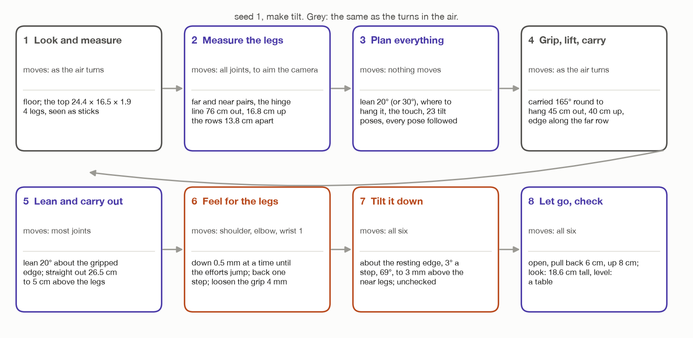

# Putting the top on the legs by tilting it: step by step

`make tilt`

These docs walk through `make tilt` one step at a time, one file per step, for
someone new to robot arms. They are laid out like the docs for the two turns in
the air, [`../turn-by-wrist/`](../turn-by-wrist/README.md) and
[`../turn-by-whole-arm/`](../turn-by-whole-arm/README.md).

**The idea.** A person does not hold a heavy board flat in the air by one edge.
They rest its far edge on the support, then lower the near edge until it lies
flat. The arm does the same: it rests the top's lower edge on the two far legs,
then tilts it down about that edge onto the two near legs. The top is never held
flat in the air, so the grip never has to fight the twist that makes a heavy top
fall out in the air turns.

## Read in this order

Step 1 and most of step 4 are the same code as the turns in the air. Their pages
are short and link to the full explanation. Everything else is new.

| File | What it covers | |
| --- | --- | --- |
| [`../turn-by-wrist/00-words-and-maths.md`](../turn-by-wrist/00-words-and-maths.md) | The room's axes, the joints, vectors, rotations, 4 × 4 poses. | shared |
| [`01-look-and-measure.md`](01-look-and-measure.md) | Step 1. The survey finds the floor, the top, and four legs. | same |
| [`02-measure-the-legs.md`](02-measure-the-legs.md) | Step 2. Look at the legs close up. Which are far and near, the hinge line, and will the top fit? | new |
| [`03-plan-before-moving.md`](03-plan-before-moving.md) | Step 3. Work back from the finished table to every pose, and follow them all on the model first. | new |
| [`04-grip-lift-carry.md`](04-grip-lift-carry.md) | Step 4. Grip, lift out, carry round to where it is leaned over. | mostly same |
| [`05-lean-and-carry-out.md`](05-lean-and-carry-out.md) | Step 5. Lean it 20° in the air, and carry it out over the far legs. | new |
| [`06-feel-for-the-legs.md`](06-feel-for-the-legs.md) | Step 6. Come down half a millimetre at a time until the joints feel the legs; loosen the grip. | new |
| [`07-tilt-down.md`](07-tilt-down.md) | Step 7. Tilt it about the edge on the far legs, to 3 mm above the near legs. | new |
| [`08-let-go-and-pull-out.md`](08-let-go-and-pull-out.md) | Step 8. Open the fingers, back out, lift clear. | new |
| [`09-check-the-table.md`](09-check-the-table.md) | Step 9. Look at what was built, report, and the results for light and heavy tops. | new |

The plan this was built from, with the physics of legs being knocked over, is
[`../approaches/tilt-onto-legs.md`](../approaches/tilt-onto-legs.md). Every run's numbers are in
[`../turn-results.md`](../turn-results.md), section 5.

## Tilting onto the legs, compared with turning in the air

| | Turning flat in the air | Tilting onto the legs |
| --- | --- | --- |
| the top is held flat by one edge | yes, at the end | **never** |
| what gives out first with a heavy top | the grip: it twists out | **nothing, up to 3.8 kg**; the risk is knocking a leg over |
| heaviest top that worked (seed 1) | 1.5 kg | **3.8 kg**, the heaviest tried |
| the top turns about | wrist 1's axis, or its gripped edge | **its lower edge, resting on the far legs** |
| joints that move in the turn | 1 or 3 | **all 6** |
| checked before the grip | the turn's poses | **every pose from the lean to the pull-out, followed one after another** |
| how the arm finds where to put it down | – | **it feels for the legs with its own joints** |
| how it knows it worked | the joints, and the fingertip sensors | **the camera looks at the table** |

## The fixed numbers only this job uses

The ones shared with the turns in the air are in the wrist docs'
[table](../turn-by-wrist/README.md#every-fixed-number-in-one-place).

| Name | Value | Kind | File | What it is for |
| --- | --- | --- | --- | --- |
| `LEANS` | 20°, then 30° | choice | `task.py` | how far the top leans when it comes down on the far legs |
| `LEAN_RADIUS` | 45 cm | choice | `task.py` | where, out from the base, it is leaned over in the air |
| `CARRY_CLEARANCE` | 4 cm | choice | `task.py` | the top's lowest point passes this far above the leg tops |
| `ABOVE_LEGS` | 5 cm | choice | `task.py` | carried out to this far above where it touches |
| `LINE_STEP` | 2 cm | choice | `task.py` | a straight line with the top in hand is checked this often |
| `TOUCH_START`, `TOUCH_STEP`, `TOUCH_LIMIT` | 5 mm, 0.5 mm, 6 mm | choice | `task.py` | feeling for the legs: start above, step down, give up past |
| `TOUCH_EFFORT` | 0.5 N·m | choice | `task.py` | this much change in a joint's effort means the legs took weight |
| `SETTLE`, `AVERAGE` | 0.3 s, 0.3 s | choice | `task.py` | wait, then average the joints' efforts |
| `GRIP_LOOSEN` | 4 mm | choice | `task.py` | open this much wider once the far legs hold one edge |
| `TILT_STEP` | 3° | choice | `task.py` | one tilt pose every 3° |
| `LAND_DROP` | 3 mm | choice | `task.py` | let go this far above the near legs |
| `TOP_RETREAT`, `LIFT` | 6 cm, 8 cm | choice | `task.py` | back out, then up |
| `HEIGHT_TOLERANCE`, `TILT_TOLERANCE` | 1 cm, 3° | choice | `task.py` | what counts as a good table |
| `FIT_MARGIN` | 5 mm | choice | `assembly/table.py` | legs must be this far inside the top's edges |
| `MAX_JOINT_JUMP` | 30° | choice | `arm/motion.py` | no joint may jump more than this between poses a step apart |

## Seed 1

Every number is for seed 1: a top 24.4 × 16.5 × 1.9 cm, 0.31 kg, and four legs
2.9 cm square and 16.7 cm tall, standing about 62 to 77 cm out to the arm's
right.

The pictures are drawn by [`figures/draw_tilt.py`](figures/draw_tilt.py). It
runs the task's own pose code on seed 1's measured top and legs, so the poses in
the pictures are the ones the robot plans.
