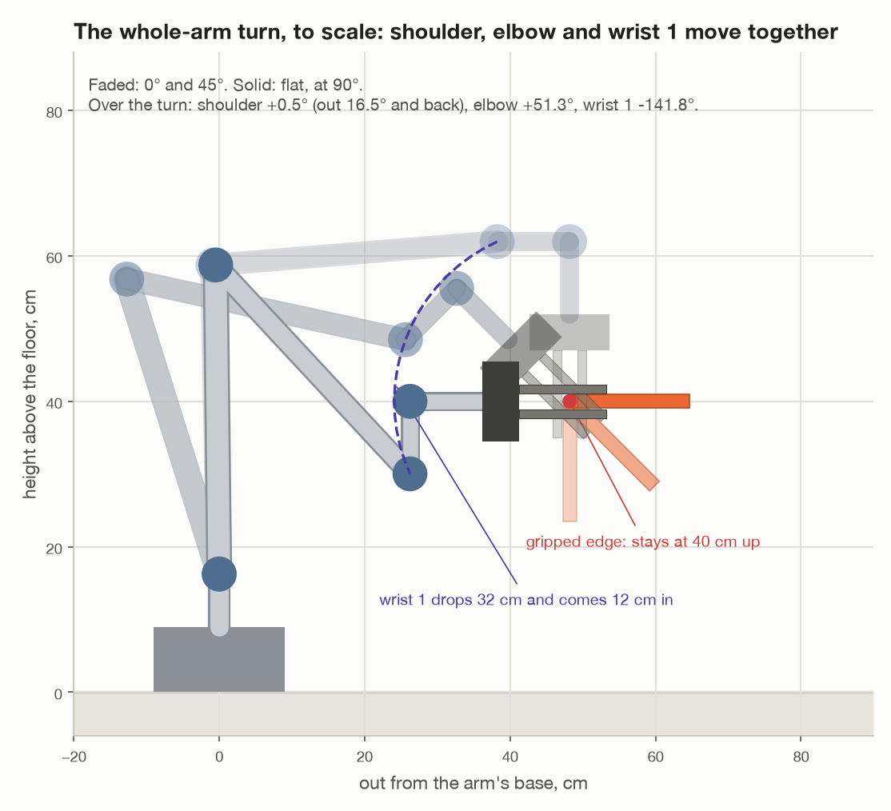
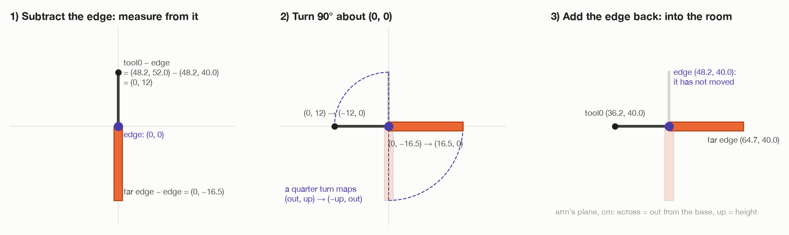
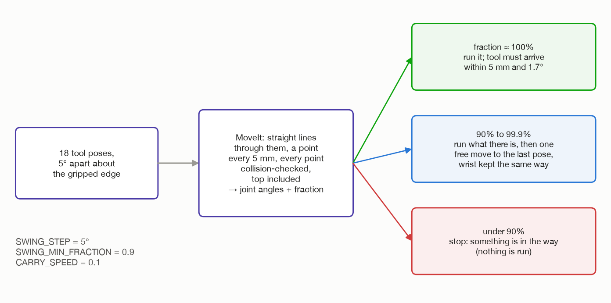

# Step 7: turn it flat, about its own edge

[← step 6](06-line-up-with-wrist-1.md) · [index](README.md) · next: [what each joint does →](07-what-each-joint-does.md)

## What happens

The top turns a quarter turn about **its own gripped edge**. The edge does not
move: it stays at (50, 0, 40) cm. The rest of the board swings up and out, away
from the arm, and ends lying flat.

The code does **not** tell MoveIt "turn the top". It works out **where the
tool must be at every 5° of the turn**, 18 poses, and asks MoveIt for a path
through them in straight lines. MoveIt chooses the joint angles. Any joint may
move.

**Joints that move:** the shoulder, the elbow and wrist 1. The base and wrists 2
and 3 could, but do not need to ([step 6](06-line-up-with-wrist-1.md)).



## What comes in

| From | Value | Seed 1 |
| --- | --- | --- |
| step 5 | the arm at the hanging pose | tool0 at (50, 0, 52) cm, pointing down |
| step 6 | the gripped edge along wrist 1's axis | (0.267, 0.964, 0) |
| step 3 | the top attached in MoveIt | – |
| step 2 | all 18 poses were reachable from the planned pose | – |

In `_turn_by_whole_arm()` in `task.py`:

```python
start = self._arm.tool_pose()
axis = start[:3, 0]
angle = flat_turn(start, axis, BASE_POSITION)
steps = swing_about_edge(start, axis, angle, SWING_STEP)
done = self._arm.move_linear(steps, speed=CARRY_SPEED, min_fraction=SWING_MIN_FRACTION)
if done < 0.999:
    self._arm.move_to(steps[-1], speed=CARRY_SPEED, any_shape=False)
```

Everything starts from `tool_pose()`, **where the tool really is now**, not
where step 2 planned it. If the carry ended a few millimetres off, the turn is
about the edge where it really is.

---

## 7a. The pivot, and the line to turn about

Two things are needed to describe a turn: **a point it turns about**, and **the
direction of the line** through that point.

```
pivot = tool0 position + tool z × 0.12      the middle of the gripped edge
axis  = tool x                              the way the edge runs
```

- **The pivot.** The tool's z axis is the way the gripper reaches. The gripped
  edge is 12 cm along it from tool0 (`EDGE_BELOW_TOOL`, from
  [step 3](../turn-by-wrist/03-grip-the-edge.md#3a-where-the-tool-goes-and-why-those-heights)).
  That is `gripped_edge()` in `assembly/grasps.py`.

  Seed 1: (0.50, 0, 0.52) + (0, 0, −1) × 0.12 = **(0.50, 0, 0.40)**.
- **The axis.** The gripped edge always runs along the tool's x
  (`down_tool_pose()`). `start[:3, 0]` is column 0 of the pose: the tool's x
  axis in room directions ([why a column is an arrow](../turn-by-wrist/00-words-and-maths.md#5-poses-where-something-is-and-which-way-it-faces)).

  Seed 1: **(0.267, 0.964, 0)**.

### Which way: +90° or −90°?

`flat_turn()` again, the same as the wrist turn
([wrist step 7a](../turn-by-wrist/07-turn-flat.md#7a-which-way-90-or-90)): of the
two quarter turns, keep the one that leaves the tool reaching **away** from the
base.

```
outward = (0.50, 0, 0)       down = (0, 0, −1)       axis k = (0.267, 0.964, 0)

+90°:   the tool would reach  k × down  = (−0.964, 0.267, 0)    score −0.48   back at the base ✗
−90°:   the tool would reach −(k × down) = (0.964, −0.267, 0)   score +0.48   away ✓
```

**−90°.** The log says:

```
turning the top -90 degrees about its gripped edge
```

---

## 7b. The 18 tool poses


`swing_about_edge()` in `assembly/grasps.py`:

```python
edge = gripped_edge(tool_pose)
count = max(1, math.ceil(abs(angle) / step))          # ceil(90° / 5°) = 18
return [turned_about(tool_pose, edge, axis, angle * k / count) for k in range(1, count + 1)]
```

So pose k is the starting pose turned by −90° × k / 18 about the edge:

| k | turned |
| --- | --- |
| 1 | −5° |
| 2 | −10° |
| … | … |
| 18 | −90° |

The starting pose itself is not in the list. The arm is already there.

### Turning a pose about a line that does not pass through (0, 0, 0)

A rotation matrix R turns things about a line through **the origin**. The edge
is not at the origin. So the turn is done in three moves:



```
p' = c + R · (p − c)
```

1. **Subtract the pivot c.** Now every point is measured from the edge, so the
   edge is at (0, 0, 0).
2. **Turn** by R about the origin. The edge, at the origin, stays put.
3. **Add c back.** Everything returns to room coordinates, and the edge is
   where it started.

Worked in the arm's own plane, in cm (out from the base, up), for the full
−90°:

| | In the room | 1. minus the edge | 2. turned | 3. plus the edge |
| --- | --- | --- | --- | --- |
| the edge | (48.2, 40.0) | (0, 0) | (0, 0) | **(48.2, 40.0)**, unmoved |
| tool0 | (48.2, 52.0) | (0, 12) | (−12, 0) | **(36.2, 40.0)** |
| the far edge | (48.2, 23.5) | (0, −16.5) | (16.5, 0) | **(64.7, 40.0)** |

A quarter turn away from the arm maps (out, up) → (−up, out). tool0 ends 12 cm
**back** towards the base, level with the edge. The board ends sticking **out**,
away from the base.

### The same thing as one 4 × 4 matrix

`turned_about()` packs those three moves into one pose:

```
M = [ R    c − R · c ]
    [ 0        1     ]
```

Multiply it out on a point p:

```
M · p = R · p + (c − R · c) = c + R · (p − c)
```

That is the three moves. The right-hand column, `c − R · c`, is what keeps the
pivot in place: `M · c = R · c + c − R · c = c`.

Then

```
pose k = M(−90° × k / 18) · starting pose
```

Multiplying a whole pose by M turns its position **and** its three axis
arrows, so the tool both moves round the edge and tilts to keep pointing at it.

R itself comes from Rodrigues' formula, `rotation_about()` in `transforms.py`
([words and maths](../turn-by-wrist/00-words-and-maths.md#turning-a-pose-about-a-line)).

### What that does to the tool, in room terms (seed 1)

| | tool0 | tool reaches |
| --- | --- | --- |
| start | (50.0, 0.0, 52.0) cm | (0, 0, −1), straight down |
| end | (38.4, 3.2, 40.0) cm | (0.964, −0.267, 0), level, away from the base |

In the room, "12 cm back towards the base" is along −(0.964, −0.267, 0),
which is why both x and y change.

### How far apart the poses are

- tool0 moves on a circle of **12 cm** radius round the edge. A quarter of it is
  0.12 × π / 2 = **18.8 cm**, so the poses are about **1.05 cm** apart.
- The tool tilts **5°** from one pose to the next.
- The top's far edge, 16.5 cm from the pivot, moves on a circle of 16.5 cm.
  Compare the wrist turn, where it swung on 40 cm.

The tests check this geometry without a simulator
(`test_turned_about_its_edge_the_board_ends_flat_and_away_from_the_arm` in
`test/test_grasps.py`). Every pose keeps the edge where it was, no step turns
more than 5°, and the last pose leaves the top flat, sticking out away from the
base, with the tool level.

---

## 7c. What MoveIt is asked for

The 18 poses go to `Arm.move_linear()` in `arm/motion.py`, which calls MoveIt's
straight-line path service, `/compute_cartesian_path`. The request says:

| Field | Value | Meaning |
| --- | --- | --- |
| start state | "where the arm is now" | |
| `group_name`, `link_name` | the arm, `tool0` | move tool0 |
| `waypoints` | the 18 poses | go through these, in order |
| `max_step` | 5 mm | put a point at least every 5 mm |
| `avoid_collisions` | true | check every point, the top included |
| speed and acceleration scaling | 0.1 | a tenth of the arm's limits |

MoveIt goes along the path point by point. For each point it finds joint angles
**starting from the previous point's**, so the arm moves smoothly and keeps its
shape. It stops at the first point it cannot reach that way, or that would hit
something.

What comes back:

- **a trajectory**: joint angles for all six joints, against time;
- **a fraction**: how much of the path it managed, from 0 to 1.

### Straight lines, not a circle

Between two poses, MoveIt moves tool0 in a **straight line**, not along the
circle. With poses 5° apart on a 12 cm circle, the line cuts the corner by

```
0.12 × (1 − cos 2.5°) = 0.00011 m = 0.1 mm
```

The middle of a chord between two points 5° apart is closer to the centre than
the circle by r · (1 − cos(half the angle)). So the gripped edge stays put to
about a tenth of a millimetre.

---

## 7d. What happens with the answer



| Fraction | What the code does | Why |
| --- | --- | --- |
| **more than 99.9%** | sends the trajectory to the arm's controller; the tool must arrive within 5 mm and 1.7° of the last pose | the normal case |
| **90% to 99.9%** | runs what there is; then **one free move** to the last pose, at the same slow speed, with `any_shape=False` so the wrist and elbow keep their shape | nearly there: a small gap at the very end is safe to plan across |
| **under 90%** | runs nothing: `move_linear()` raises *"straight-line move to [...] only solved 85% of the way"*, and the run stops | falling short that early means something is in the way |

The log for the middle case:

```
the straight-line turn stopped at 95%; finishing it with one free move
```

**This is a real difference from the wrist turn.** The wrist turn's path is
built joint by joint and checked every 2° before it starts, so it cannot fall
short part-way. Here, step 2 only checked the 18 poses one at a time. Whether
the arm can go from each to the next smoothly is first found out now.

(In `move_linear()` a line that comes back under `min_fraction` raises before
anything is sent, so "under 90%" moves nothing.)

---

## 7e. How long it takes

MoveIt times the path within the joint limits scaled by 0.1: every joint at
most **18°/s** (0.314 rad/s).

The joint that turns **furthest** sets the pace. That is wrist 1, with
**141.8°** ([why so far](07-what-each-joint-does.md#6-wrist-1-from-the-tilt-rule)).
Even at 18°/s all the way:

```
141.8° / 18 °/s = 7.9 s
```

With speeding up and slowing down, MoveIt's timing came to **8.6 to 8.7 s** in
Gazebo. The wrist turn took 7.7 s. **Moving three joints made the busiest joint
busier.**

---

## 7f. Where the top ends up

| | Before | After |
| --- | --- | --- |
| the gripped edge | (50, 0, 40) cm | **(50, 0, 40) cm**, unmoved |
| the top | hanging down, far edge 23.5 cm up | **flat at 40 cm**, far edge (65.9, −4.4, 40.0) cm |
| tool0 | 12 cm above the edge | 12 cm back from the edge, level |

Gazebo measured the top level to within 0.005°, its edge 40 cm up where it
started.

### The space it needs


Turning about its edge, the board sweeps a quarter circle of its own width,
16.5 cm, beside the edge. The wrist turn swings it round wrist 1, and its far
edge sweeps a circle of 40 cm. So this turn needs far less clear space.

---

## Fixed and measured numbers in this step

| Number | Value | Kind | Where |
| --- | --- | --- | --- |
| `SWING_STEP` | 5° | choice | `task.py` |
| `SWING_MIN_FRACTION` | 0.9 | choice | `task.py` |
| a line counts as complete above | 0.999 | choice | `task.py`, `_turn_by_whole_arm()` |
| `max_step` | 5 mm | choice | `arm/motion.py`, `move_linear()` |
| `CARRY_SPEED` | 0.1 | choice | `task.py` |
| `EDGE_BELOW_TOOL` | 12 cm | worked out | `assembly/grasps.py` |
| arrival | 5 mm, 1.7° | choice | `arm/motion.py` |
| pivot, axis, direction | (50, 0, 40) cm, (0.267, 0.964, 0), −90° | **worked out**, from where the arm is | |
| the joint angles along the path | – | **MoveIt** | |

## What can go wrong

| Message | Why |
| --- | --- |
| `the straight-line turn stopped at N%; finishing it with one free move` | a log line: 90% ≤ N < 99.9% |
| `the top was not turned flat: straight-line move to [...] only solved N% of the way (MoveIt error ...)` | N < 90%: something is in the way; nothing moved |
| `no plan found to [...]: ...` | the finishing free move found no way |
| `the arm stopped ... mm and ... degrees away from [...]` | it did not really arrive |
| `the fingertips lost the top ... degrees from hanging straight down` | the top slipped in the turn (reported in step 8) |

## Where it is in the code

| What | Where |
| --- | --- |
| the turn | `task.py`: `_turn_by_whole_arm()` |
| the pivot, the 18 poses | `assembly/grasps.py`: `gripped_edge()`, `swing_about_edge()`, `turned_about()` |
| which way | `assembly/grasps.py`: `flat_turn()` |
| the turn about a line | `transforms.py`: `rotation_about()` |
| asking MoveIt for the path, running it | `arm/motion.py`: `move_linear()`, `move_to()`, `_check_arrival()` |
| the test of the geometry | `test/test_grasps.py` |

[← step 6](06-line-up-with-wrist-1.md) · [index](README.md) · next: [what each joint does →](07-what-each-joint-does.md)
