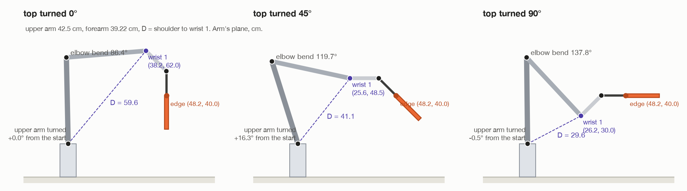

# Step 7, continued: what each joint does, by hand

[← step 7](07-turn-about-the-edge.md) · [index](README.md) · next: [step 8 →](08-hold-and-report.md)

MoveIt works the joint angles out numerically, and the code never looks at
them. But they can be worked out **by hand**, with a triangle and one rule. That
explains the surprising numbers from Gazebo: the elbow folds 51°, the shoulder
swings out 17° and comes back, and **wrist 1 turns 142°, not 90°**.

Then the torques: what each joint has to hold up, and why the shoulder and elbow
end up working less than in the wrist turn.

---

## 1. Why it can be done by hand

The gripped edge runs along wrist 1's axis ([step 6](06-line-up-with-wrist-1.md)),
so the whole turn happens **in the arm's own upright plane**. Everything below is
a flat drawing in that plane:

- **"out"**: along the plane, from the base's line;
- **"up"**: from the floor;
- in cm.

The parts, for seed 1:

| | Where, or how long | Kind |
| --- | --- | --- |
| the shoulder joint | (0, 16.25) | robot fact |
| the upper arm, shoulder to elbow | 42.5 cm | robot fact |
| the forearm, elbow to wrist 1 | 39.22 cm | robot fact |
| wrist 1, from tool0, with the tool pointing down | 10.0 cm back, 10.0 cm up | robot fact |
| the gripped edge | (48.2, 40.0), and it never moves | from the turning spot |

(48.2 and not 50: the spot is 50 cm from the base, but the arm's plane runs
13.3 cm to one side, and √(50² − 13.3²) = 48.2.)



---

## 2. Where tool0 and wrist 1 must be

**tool0** moves on a circle of 12 cm round the edge
([step 7b](07-turn-about-the-edge.md#7b-the-18-tool-poses)). At a turn of θ:

```
tool0 = edge + 12 × (−sin θ, cos θ)
```

**Wrist 1.** Wrists 2 and 3 do not move, so wrist 1 is fixed **relative to the
tool**: 10 cm back and 10 cm up when the tool points down, and turned by θ as
the tool tilts:

```
wrist 1 = tool0 + (−10, 10) turned by θ
        = tool0 + (−10 cos θ − 10 sin θ,  −10 sin θ + 10 cos θ)
```

| Top turned | tool0 | wrist 1 |
| --- | --- | --- |
| 0°, hanging | (48.2, 52.0) | (38.2, 62.0) |
| 45° | (39.7, 48.5) | (25.6, 48.5) |
| 90°, flat | (36.2, 40.0) | (26.2, 30.0) |

Wrist 1 comes **in** 12 cm and **down** 32 cm.

---

## 3. How far wrist 1 is from the shoulder

Call it D:

```
D = √( (wrist 1 out − 0)² + (wrist 1 up − 16.25)² )

start:  D = √(38.2² + (62.0 − 16.25)²) = √(1459 + 2093) = 59.6 cm
45°:    D = √(25.6² + (48.5 − 16.25)²)                  = 41.1 cm
end:    D = √(26.2² + (30.0 − 16.25)²) = √( 686 +  189) = 29.6 cm
```

D **halves**. The upper arm and forearm are fixed lengths, so the only way to
bring their ends closer together is to fold the elbow.

---

## 4. The elbow, from the law of cosines

The upper arm (42.5), the forearm (39.22) and D make a triangle. For any
triangle with sides a, b and c, where C is the angle between a and b:

```
c² = a² + b² − 2ab · cos C
```

This is Pythagoras' rule, with a correction for a corner that is not square. At
C = 90°, cos C = 0, and it is Pythagoras exactly.

The elbow's **bend** is how far it is from straight. That is 180° − C, and
cos(bend) = −cos C, so:

```
cos(bend) = (D² − 42.5² − 39.22²) / (2 × 42.5 × 39.22)
          = (D² − 1806 − 1538) / 3334

start:  cos(bend) = (3552 − 3344) / 3334 =  0.062   →   bend =  86.4°
45°:    cos(bend) = (1689 − 3344) / 3334 = −0.496   →   bend = 119.7°
end:    cos(bend) = ( 875 − 3344) / 3334 = −0.741   →   bend = 137.8°
```

**The elbow folds 137.8 − 86.4 = +51.4°.** (Gazebo: 51.3°.)

---

## 5. The shoulder, from the same triangle

The upper arm points **at wrist 1**, then **up past it** by the triangle's angle
at the shoulder, α:

```
upper arm's angle = (the angle of the line to wrist 1) + α

the angle of the line to wrist 1 = arctan( (up − 16.25) / out )
cos α = (42.5² + D² − 39.22²) / (2 × 42.5 × D)
```

| | line to wrist 1 | α | upper arm, from level |
| --- | --- | --- | --- |
| start | 50.1° | 41.1° | **91.2°** |
| 45° | 51.6° | 55.9° | **107.5°** |
| end | 27.7° | 63.0° | **90.6°** |

The upper arm **starts and ends almost upright**: net change about 0.5°.

But halfway, wrist 1 has come in (25.6 cm out) without yet coming down
(48.5 cm up). To reach a point that close and that high, the upper arm has to
**lean back**, 16.5° at its most, about 50° into the turn. So the shoulder goes
out 16.5° and comes back: **17° of travel for 0.5° of net turn**. (Gazebo:
17.0° moved, +0.5° net.)

---

## 6. Wrist 1, from the tilt rule

The shoulder, the elbow and wrist 1 turn about parallel lines, so the tool's
tilt is the sum of their turns
([words and maths](../turn-by-wrist/00-words-and-maths.md#2-the-arm)). The tool
has to tilt **−90°**:

```
Δ shoulder + Δ elbow + Δ wrist 1 = −90°
     +0.5  +  51.3   + Δ wrist 1 = −90°

Δ wrist 1 = −90 − 0.5 − 51.3 = −141.8°
```

(In the joints' own signs. Gazebo's numbers are used here.)


### Why 142° and not 90°

The top needs a 90° tilt. But the elbow folding 51° **tilts the forearm, and
everything on it, 51° the wrong way**. Wrist 1 is on the forearm, so it has to
turn the 90° the top needs **and** undo the 51° the elbow added, plus the half
degree from the shoulder.

A picture: hold your arm out and point your hand at the floor. Now fold your
elbow to bring your hand in towards your chest. Your hand points back at you
unless you bend your wrist extra to keep it pointing where you want.

### The base, wrist 2 and wrist 3

**0.0°** each. They were free to move and did not need to, because the turn
lies in the arm's plane ([step 6](06-line-up-with-wrist-1.md#why-it-matters-for-the-whole-arm-turn)).

### Summary, and Gazebo

| Joint | By hand | Gazebo, moved | Gazebo, net |
| --- | --- | --- | --- |
| base | 0° | 0.0° | – |
| shoulder | out 16.5°, back to +0.5° | 17.0° | +0.5° |
| elbow | +51.4° | 51.3° | – |
| wrist 1 | −141.8° | 141.8° | – |
| wrist 2 | 0° | 0.0° | – |
| wrist 3 | 0° | 0.0° | – |

---

## 7. The torques

A joint's torque is mostly **holding**: each mass beyond the joint, times 9.81,
times its level distance from the joint's axis, added up. How to work that out
is in [the wrist docs](../turn-by-wrist/07-what-each-joint-does.md#1-two-kinds-of-torque).


### Wrist 1: exactly as in the wrist turn

Wrist 1 holds up the wrist links, the gripper, the camera and the top. Wrists 2
and 3 do not move, so those parts are always laid out the same way relative to
wrist 1, and that layout only depends on **how far the tool has tilted**. It
does not matter which joints did the tilting. So the wrist turn's formula holds
here too:

```
τ(θ) = 3.05 · cos θ + 2.71 · sin θ     N·m
worst: 4.08 N·m at 42°         flat: 2.71 N·m
```

Gazebo: peak **4.17**, holding flat **2.71**. The wrist turn: 4.07 and 2.71.
**Moving more joints did not take any load off wrist 1.**

### The shoulder and elbow: less, because the arm pulls in

These two are different, because **the arm is in a different shape**. Their
torque is everything beyond them times its lever from their axis, and in this
turn everything beyond them comes in towards the base.

| | Shoulder, N·m | Elbow, N·m |
| --- | --- | --- |
| hanging (both turns) | 25.3 | 26.3 |
| worst, whole-arm turn | 25.3 at the start | 27.2 at 30° |
| lowest, whole-arm turn | 12.1 at about 57° | – |
| flat, whole-arm turn: worked out | 18.0 | 18.6 |
| flat, whole-arm turn: Gazebo | 18.01 | 18.54 |
| flat, wrist turn: Gazebo, for comparison | 24.93 | 25.88 |

- **Flat**, wrist 1 is 26 cm out from the base's line instead of 38. The
  forearm, the wrists, the gripper and the top all hang on shorter levers.
- **Around 57°** the shoulder's torque falls to 12.1 N·m, half what it started
  at. By then the wrist end has come in close, and the upper arm leans back, so
  its own 8 kg sits behind the shoulder and partly balances what is in front.

That is the arm easing itself by its shape, not the joints sharing the top.
All of it is far inside the limits: 150 N·m for the shoulder and elbow, 28 for
wrist 1.

### The base, wrist 2 and wrist 3

As in the wrist turn. The base turns about the vertical, and weight cannot twist
it. Wrists 2 and 3 only feel the 50 g camera 8.5 cm to one side: 0.04 N·m.

### The moving part

Tiny again. At a tenth of full speed, the model gives at most 0.05 N·m on any
joint, against 12 to 27 N·m of holding. It depends on how MoveIt times the path,
so take it as "hundredths of a newton-metre", not an exact figure.

### The load on the grip

The same as the wrist turn, because it only depends on the top's angle θ:

```
pull along the fingers = m · g · cos θ       3.0 N hanging, 0 flat
twist about the pads   = m · g · d · sin θ   0 hanging, 0.17 N·m flat   (d = 5.55 cm)
```

The motion adds even less than in the wrist turn. The edge does not move, and
the top's centre swings on a circle of only 8.25 cm round it.

---

## Where it is in the code

| What | Where |
| --- | --- |
| the joint angles in a real run | MoveIt, inside `move_linear()`; recorded by `start_recording()` |
| the worked-out numbers and pictures | [`../figures/two_turns.py`](../figures/two_turns.py) |
| the triangle picture | [`figures/draw_whole_arm.py`](figures/draw_whole_arm.py) |

[← step 7](07-turn-about-the-edge.md) · [index](README.md) · next: [step 8 →](08-hold-and-report.md)
