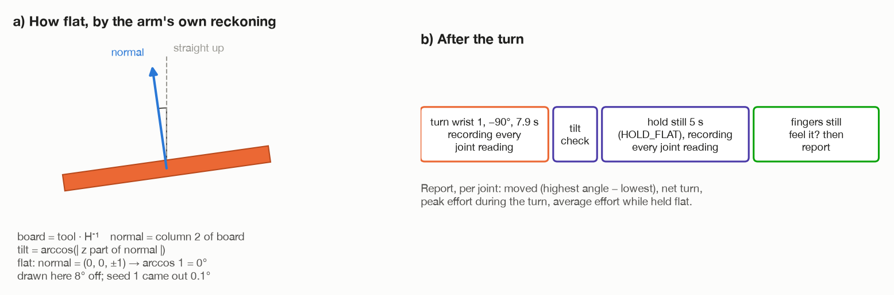

# Step 8: hold it flat, check it, report

[← step 7, continued](07-what-each-joint-does.md) · [index](README.md)

**The same code as the wrist turn**, run after a different turn. Everything the
checks do is explained in full in
[the wrist docs, step 8](../turn-by-wrist/08-hold-and-report.md). This page
recaps them and gives the whole-arm turn's results.



## What happens

1. **Did the top stay in the fingers through the turn?** If not, work out how
   far into the turn it was lost, from the last joint reading the fingertips
   still felt it, and report that.
2. **How flat is it?** Where the top is, from the tool and the hold:

   ```
   board = tool · H⁻¹
   tilt  = arccos( | z part of the board's normal | )     flat: 0°
   ```

3. **Hold it still for 5 s** (`HOLD_FLAT`), recording every joint reading.
4. **Do the fingertips still feel it?**
5. **Report**, per joint: moved (highest angle − lowest), net (last − first),
   peak effort during the turn, and mean effort during the hold.

The run succeeds only if the top was not lost in the turn **and** is still felt
after the hold.

---

## Seed 1's report, 400 kg/m³ (0.31 kg)

```
finished
  table top measured at 24.4 x 16.5 x 1.9 cm
  the turn by the whole arm took 8.7 s
  joint                   moved      net  peak N·m  holding N·m
  shoulder_pan_joint       0.0°    +0.0°      0.30         0.00
  shoulder_lift_joint     17.0°    +0.5°     25.28        18.01
  elbow_joint             51.3°   +51.3°     27.21        18.54
  wrist_1_joint          141.8°  -141.8°      4.17         2.71
  wrist_2_joint            0.0°    +0.0°      0.04         0.00
  wrist_3_joint            0.0°    +0.0°      0.04         0.04
  the arm puts the top 0.1 degrees off level
  held flat for 5 s, and the fingers still feel the top
```

(The layout is from `_report()` in `main.py`. The moved, peak and holding
numbers are from [`../../turn-results.md`](../turn-results.md). The net
turns for the elbow and wrist 1 are written from the rule below, since each
turned one way only.)

### Reading it

- **"moved" and "net" differ for the shoulder.** It went out 16.5° and back:
  17.0° of travel, +0.5° net. For the elbow and wrist 1, which only turned one
  way, the two are the same size.
- **Three joints moved, and they add up.** Shoulder + elbow + wrist 1, in net
  turns: +0.5 + 51.3 − 141.8 = **−90°**, the tool's tilt
  ([step 7, continued](07-what-each-joint-does.md#6-wrist-1-from-the-tilt-rule)).
- **Wrist 1 turned 141.8°**, more than the 90° of the wrist turn.
- **Wrist 1's torque is the same as the wrist turn's**: peak 4.17 against 4.07,
  holding flat 2.71 in both.
- **The shoulder and elbow end on 18 N·m**, where the wrist turn leaves them on
  25. The arm ends drawn in towards the base.
- **The base and wrists 2 and 3** did nothing, and feel almost nothing.

### Checked against the calculation

| Joint | Holding flat, Gazebo | Holding flat, worked out |
| --- | --- | --- |
| base | 0.00 | 0.00 |
| shoulder | 18.01 | 18.03 |
| elbow | 18.54 | 18.56 |
| wrist 1 | 2.71 | 2.71 |
| wrist 2 | 0.00 | 0.00 |
| wrist 3 | 0.04 | 0.04 |

Within 0.02 N·m on every joint.

### Where the top ended

Flat and still held, **its edge 40 cm up, where it started**. Level to within
0.005° by Gazebo, 0.1° by the arm's own reckoning. Seed 7 came out the same.

The turn took **8.7 s** (8.6 s in another run). The wrist turn: 7.7 s.

---

## Heavier tops

`DENSITY` makes the top heavier without making it bigger. The robot is not
told.

| `DENSITY` | Mass | Whole-arm turn | Wrist turn |
| --- | --- | --- | --- |
| 400 | 0.31 kg | flat and held | flat and held |
| 3000 | 2.29 kg | fingertips lost it **78°** into the turn | 82° |
| 5000 | 3.82 kg | lost **46°** in, fell to the floor | 48° |

**Both turns lose a heavy top at nearly the same angle.** The twist on the grip,
m · g · d · sin θ, depends on the top's angle θ, not on which joints turned it.
The few degrees between them are about the size of the error in placing the
moment of loss ([`../../turn-results.md`](../turn-results.md), section 4).

At 3000, the joints were fine: wrist 1 peaked at 12.6 N·m (of 28), the shoulder
at 34.7 and the elbow at 49.9 (of 150). Those peaks include the jolt of the top
twisting in the fingers. **The grip gives out first, not a joint.**

That is what part 2 of the project, `make tilt`, is for: it never holds the top
flat in the air at all ([`../approaches/tilt-onto-legs.md`](../approaches/tilt-onto-legs.md)).

---

## What can go wrong

| Message | Why |
| --- | --- |
| `the fingertips lost the top ... degrees from hanging straight down` | it slipped during the turn |
| `it has twisted in the fingers or fallen out: the sensors cannot tell which` | the line after it |
| `the fingers lost the top in the 5 s it was held flat` | it slipped during the hold |
| `no joint readings came in during the turn` | nothing was recorded |

## Where it is in the code

| What | Where |
| --- | --- |
| the checks, in order | `task.py`: `run()` |
| where it slipped | `task.py`: `_turned_when_let_go()` |
| per-joint numbers, duration | `task.py`: `_joint_reports()`, `_moving_time()` |
| the printed report | `main.py`: `_report()` |

[← step 7, continued](07-what-each-joint-does.md) · [index](README.md)
