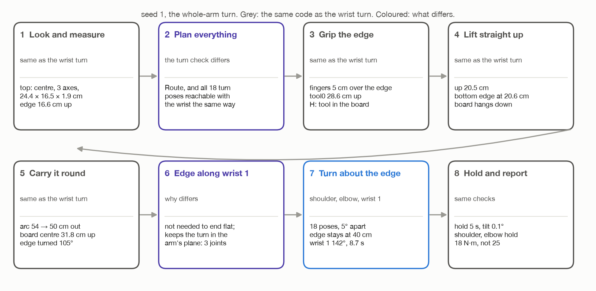
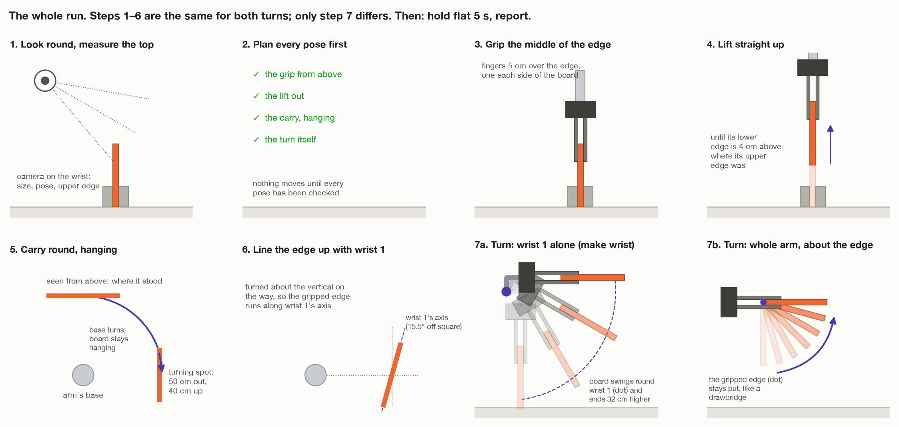

# Turning the top flat with the whole arm: step by step

`make whole-arm`

These docs walk through the whole-arm turn one step at a time, one file per
step, for someone new to robot arms. They are laid out the same way as the
wrist docs in [`../turn-by-wrist/`](../turn-by-wrist/README.md).

**The idea.** The top turns about **its own gripped edge**, like a drawbridge.
The edge stays exactly where it is, 40 cm up, and the rest of the board swings
up and out, away from the arm, until it lies flat. Any joint may move to make
that happen. It turns out only three do: the shoulder, the elbow and wrist 1.

[`../../wrist-or-whole-arm.md`](../wrist-or-whole-arm.md) puts this turn and
the wrist turn side by side.

## Read in this order

Steps 1 to 6 run **the same code** as the wrist turn. Their pages here are
short: what happens, the numbers, anything that matters differently for this
turn, and a link to the full explanation in the wrist docs. Steps 7 and 8 are
new and in full.

| File | What it covers | |
| --- | --- | --- |
| [`../turn-by-wrist/00-words-and-maths.md`](../turn-by-wrist/00-words-and-maths.md) | The room's axes, the joints, vectors, rotations, 4 × 4 poses. | shared |
| [`01-look-and-measure.md`](01-look-and-measure.md) | Step 1. The camera finds the top and measures it. | same |
| [`02-plan-before-moving.md`](02-plan-before-moving.md) | Step 2. Every pose planned and checked first. **The turn check is different.** | differs |
| [`03-grip-the-edge.md`](03-grip-the-edge.md) | Step 3. Grip the middle of the upper edge. The hold `H`. | same |
| [`04-lift-out.md`](04-lift-out.md) | Step 4. Straight up, out of the holders. | same |
| [`05-carry-round.md`](05-carry-round.md) | Step 5. Round the base to the turning spot, hanging. | same |
| [`06-line-up-with-wrist-1.md`](06-line-up-with-wrist-1.md) | Step 6. The edge along wrist 1's axis. **Why it matters is different.** | differs |
| [`07-turn-about-the-edge.md`](07-turn-about-the-edge.md) | Step 7. The 18 tool poses, what MoveIt is asked for, what happens if it falls short. | new |
| [`07-what-each-joint-does.md`](07-what-each-joint-does.md) | Step 7, continued. The joint angles worked out by hand; why wrist 1 turns 142°; the torques. | new |
| [`08-hold-and-report.md`](08-hold-and-report.md) | Step 8. Hold it flat, check, report, and the results. | new numbers |

## The whole run on one page

## Wrist turn and whole-arm turn in one table

| | Wrist turn | Whole-arm turn |
| --- | --- | --- |
| the top turns about | wrist 1's axis | **its own gripped edge** |
| the gripped edge | moves from 40 to 72 cm up | **stays at 40 cm** |
| joints that move | wrist 1 | **shoulder, elbow, wrist 1** |
| wrist 1 turns | 90° | **141.8°** |
| the path is built by | the code, joint by joint | **MoveIt**, through 18 tool poses |
| checked before the grip | 46 joint positions, every 2° | **18 tool poses**, each reachable |
| can fall short while running? | no | **yes**, and it has a fallback |
| time | 7.7 s | **8.7 s** |
| clear space it needs | about 40 cm round the spot | **about the board's own width** |
| wrist 1 torque, peak / flat | 4.07 / 2.71 N·m | **4.17 / 2.71 N·m** |
| shoulder, elbow holding flat | 24.9 / 25.9 N·m | **18.0 / 18.5 N·m** |
| a heavy top slips at | the same angle | **the same angle** |

## The fixed numbers only this turn uses

Every other fixed number is in the wrist docs'
[table](../turn-by-wrist/README.md#every-fixed-number-in-one-place).

| Name | Value | Kind | File | What it is for |
| --- | --- | --- | --- | --- |
| `SWING_STEP` | 5° | choice | `task.py` | one tool pose every 5° of the turn |
| `SWING_MIN_FRACTION` | 0.9 | choice | `task.py` | if MoveIt's path gets at least 90% of the way, finish with a free move; less, stop |
| straight-line point spacing | 5 mm | choice | `arm/motion.py`, `move_linear()` | MoveIt puts a point at least every 5 mm |
| `EDGE_BELOW_TOOL` | 12 cm | worked out | `assembly/grasps.py` | the radius tool0 moves on, round the edge |

## Seed 1

Every number is for seed 1: a top 24.4 × 16.5 × 1.9 cm, 0.31 kg. *Worked out*
numbers come from [`../figures/two_turns.py`](../figures/two_turns.py),
which runs the turn on the same robot model Gazebo uses. *Gazebo* numbers are
what the simulator reported ([`../../turn-results.md`](../turn-results.md)).

The new pictures here are drawn by
[`figures/draw_whole_arm.py`](figures/draw_whole_arm.py). The ones of the arm to
scale are in [`../figures/`](../figures/).
