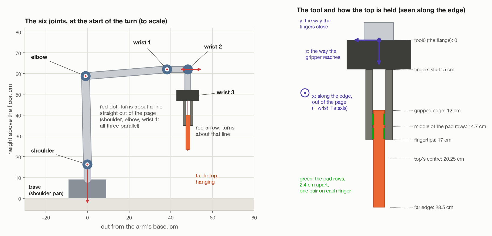

# 0. Words and maths used in every step

[← index](README.md) · next: [step 1 →](01-look-and-measure.md)

This page has the few ideas every later step leans on. Nothing here is
specific to one step. If a later page says "a pose" or "the dot product",
this is where it is explained.

---

## 1. The room's axes


Every position in the room is three numbers, **(x, y, z)**, in metres, measured
from the arm's base:

| Axis | Points | Seed 1 example |
| --- | --- | --- |
| **x** | straight out in front of the arm | the turning spot is at x = 0.50 |
| **y** | to the arm's left | the top stands at y = 0.54 |
| **z** | straight up | the top's upper edge is at z = 0.166 |

The floor is at z = 0. The base is at (0, 0, 0).

These docs often say centimetres, because they are easier to picture:
(−1.3, 54.0, 16.6) cm is the same point as (−0.013, 0.540, 0.166) m. The
code always works in metres.

---

## 2. The arm

The arm is a Universal Robots **UR5e**. It has **six joints**. Each joint is an
electric motor that turns. Nothing slides.

| # | Joint | Name in the code | What it does |
| --- | --- | --- | --- |
| 0 | base | `shoulder_pan_joint` | turns the whole arm about the vertical |
| 1 | shoulder | `shoulder_lift_joint` | lifts the upper arm |
| 2 | elbow | `elbow_joint` | bends the arm |
| 3 | wrist 1 | `wrist_1_joint` | tilts the wrist, and **turns the top flat** in step 7 |
| 4 | wrist 2 | `wrist_2_joint` | swings the wrist sideways |
| 5 | wrist 3 | `wrist_3_joint` | spins the gripper about the way it reaches |

**The fact to remember:** the shoulder, the elbow and wrist 1 turn about three
**parallel** level lines. Together they move the tool about in one upright
plane, "the arm's plane", and tilt it in that plane.



A few more words:

- **tool0**: the flange at the very end of the arm, where the gripper is
  bolted on. "Where the tool is" always means where tool0 is.
- **The gripper**: two fingers that open and close. It cannot turn anything.
  Every turn comes from the six joints.
- **The camera**: bolted to the side of the gripper, 8.5 cm off to one side.
  It moves with the arm.
- **MoveIt**: the motion planning software. The code asks it things like "find
  joint angles that put tool0 here" or "find a path there that hits nothing".
- **Gazebo**: the simulator. It plays the part of the real world.

---

## 3. Vectors

A **vector** is three numbers. It can mean two different things:

- **a point**: where something is, like the edge at (−0.013, 0.540, 0.166);
- **a direction**: which way something points, like "straight up" (0, 0, 1).

### Length

The length of a vector v = (a, b, c) is

```
|v| = √(a² + b² + c²)
```

For example, the top's centre is at (−0.013, 0.540) seen from above, so its
distance from the base is √(0.013² + 0.540²) = 0.540 m.

### Unit vector

A direction is usually kept with **length 1**. It is then called a *unit
vector*. Dividing a vector by its length makes it length 1:

```
(3, 4, 0) has length 5   →   (3, 4, 0) / 5 = (0.6, 0.8, 0)
```

A unit direction times a distance is a step of that length in that direction:
`up × 0.0825` is 8.25 cm up. Step 1's edge formula does exactly this.

### Dot product: how much two directions agree

```
a · b = a₁b₁ + a₂b₂ + a₃b₃
```

For two **unit** vectors, it is the cosine of the angle between them:

| a · b | Meaning |
| --- | --- |
| 1 | same direction |
| 0 | square to each other (90°) |
| −1 | opposite directions |

The code uses it to ask "does this point the way I want?". Step 7 uses it to
choose between turning +90° and −90°: whichever leaves the tool pointing more
**away** from the base, the larger dot product with "outward", wins.

It also picks out one part of a vector. For a direction d, `d · (0, 0, 1)` is
just d's z part, how much it points up.

### Cross product: a direction square to two others

```
a × b = (a₂b₃ − a₃b₂,  a₃b₁ − a₁b₃,  a₁b₂ − a₂b₁)
```

The answer is square to both a and b. The order matters: `b × a` points the
opposite way. A quick check: x × y = z, y × z = x, z × x = y.

The code uses it to build a third axis from two it already has. For example,
the tool's y axis is `z × x` in `down_tool_pose()`.

### Angles from numbers

| Function | Gives | Used for |
| --- | --- | --- |
| `arccos(d)` | the angle whose cosine is d | how far from flat (step 8) |
| `arcsin(d)` | the angle whose sine is d | how far the top leans (step 1) |
| `atan2(y, x)` | the angle of the point (x, y) round from the x axis, −180° to 180° | where something is round the base (step 5) |

Code angles are in **radians**. 180° = π rad = 3.1416 rad, so 90° = 1.571 rad
and 1 rad = 57.3°.

---

## 4. Rotation matrices: which way something faces

Anything solid has **its own three axes**, stuck to it. The top has three:

- **along**: along its length;
- **up**: up its face;
- **normal**: straight out of its face, through its thickness.

A **rotation matrix** R is a 3 × 3 table. **Its three columns are the thing's
own x, y and z axes, written as room directions.** For the top standing in its
holders (seed 1, rounded):

```
         along   up   normal
R  =  [   −1     0     0   ]   ← room x
      [    0     0     1   ]   ← room y
      [    0     1     0   ]   ← room z
```

Read it column by column:

- `along` = (−1, 0, 0): the length runs along the room's x axis, pointing to −x;
- `up` = (0, 0, 1): up the face is straight up;
- `normal` = (0, 1, 0): the face points along +y, away from the arm.

Two things are always true of a rotation matrix:

1. **Each column has length 1**, and **every two columns are square to each
   other**.
2. **Its inverse is its transpose.** The transpose, Rᵀ, is R with rows and
   columns swapped. Undoing a turn is as cheap as flipping the table.

Multiplying R by a direction written in the thing's own axes gives it in room
axes:

```
R · (0, 1, 0)  =  column 1  =  the thing's own y axis in the room
```

---

## 5. Poses: where something is and which way it faces

A **pose** is both at once, packed into a 4 × 4 matrix:

```
          col 0   col 1   col 2   col 3
        [   x₀      y₀      z₀   │  px  ]
pose =  [   x₁      y₁      z₁   │  py  ]
        [   x₂      y₂      z₂   │  pz  ]
        [   0       0       0    │  1   ]
          └──────── R ────────┘   └ p ┘
```

| Part | Meaning |
| --- | --- |
| columns 0, 1, 2 (top three rows) | R: the thing's own x, y, z axes, as room directions |
| column 3 (top three rows) | p: where it is, in room coordinates |
| bottom row `0 0 0 1` | always the same; it is what makes multiplying poses work |

In the code: `pose[:3, :3]` is R, and `pose[:3, 3]` is p. So `pose[2, 3]` is
the **height** of the thing, and `pose[:3, 2]` is its own **z axis**.
`frame(position, rotation)` in `transforms.py` builds one.

### Multiplying two poses chains them

```
[ R₁  p₁ ]   [ R₂  p₂ ]     [ R₁·R₂    R₁·p₂ + p₁ ]
[ 0   1  ] · [ 0   1  ]  =  [ 0        1          ]
```

The top-right part says: take the offset p₂, **turn it** the way thing 1
faces, then **add** thing 1's position.

Think of holding a cup 30 cm in front of your chest. Wherever you walk and
whichever way you turn, the cup is still "30 cm in front of your chest". To
find the cup in the room you need where you stand **and** which way you face:

```
cup in room  =  (you in room) · (cup measured from you)
```

That is one pose multiplication.

### The inverse undoes a pose

`pose⁻¹` (in code `np.linalg.inv(pose)`) is the pose that undoes it:

```
[ R  p ]⁻¹     [ Rᵀ   −Rᵀ·p ]
[ 0  1 ]    =  [ 0     1    ]
```

It rewrites room coordinates as "seen from the thing": measured from its
centre, along its own axes. Step 3 uses this to find the hold, `H = P⁻¹ · T`.

### Turning a pose about a line

To turn anything by an angle θ about a line through point c with direction k:

```
new point = c + R(k, θ) · (point − c)
```

1. Move so c is at the origin (subtract c).
2. Turn about k (multiply by R).
3. Move back (add c).

R(k, θ) comes from **Rodrigues' formula**, `rotation_about()` in
`transforms.py`:

```
R = I + sin θ · K + (1 − cos θ) · K²

where K = [  0   −k₃   k₂ ]     (so that K · v = k × v)
          [  k₃   0   −k₁ ]
          [ −k₂   k₁   0  ]
```

`turned_about()` in `grasps.py` does this to a whole pose. You do not need to
work it by hand: it is "turn by θ about k", written out.

---

## 6. Joint angles and poses: two ways to describe the arm

There are two ways to say where the arm is:

- **Six joint angles**: what the motors know.
- **tool0's pose**: what the job cares about.

Going from angles to the pose is easy and has one answer. It is called
**forward kinematics**, `Arm.forward()` in the code.

Going from a pose to angles is hard and usually has **several** answers. It is
called **inverse kinematics**, `Arm.solve()`. A UR5e can reach most poses in up
to eight ways: elbow up or down, shoulder forward or back, wrist flipped or
not. The code always wants the same shape of arm, so it starts every search
from the ready posture:

```
READY_JOINTS = (0°, −90°, 90°, −90°, −90°, 0°)
```

That is elbow up, forearm level, tool pointing at the floor, with the base
turned to face the pose. It then refuses any answer that has:

- the elbow bent the other way;
- the wrist flipped the other way from the one asked for;
- tool0 more than 1 mm from where it was sent;
- any part of the arm, or what it holds, hitting something MoveIt knows about.

"Can the arm reach this pose?" in these docs means "does `solve()` find an
answer that passes all of that?".

### Which way the wrist is flipped

`_wrist_side()` in `arm/motion.py` gives +1 or −1: the sign of sin(wrist 2's
angle), meaning which side of the arm wrist 2 bends to. To flip from one to the
other, the arm has to pass through a pose where two wrist axes line up. At that
pose some joints would have to spin very fast. With a board held only by
friction that is not allowed, so **the wrist side is fixed at the grip and
kept until the board is let go**.

---

## 7. Two kinds of move

| Move | Code | How the path is found | Used for |
| --- | --- | --- | --- |
| **Free move** | `Arm.move_to()` | MoveIt's planner (OMPL, RRTConnect) searches for any path that hits nothing | getting above the top, pointing the camera |
| **Straight line** | `Arm.move_linear()` | MoveIt moves tool0 in straight lines through the given poses, a point every 5 mm | coming down, lifting, carrying |
| **One joint** | `Arm.turn_joint()` | the code builds the path itself: one joint changes, the other five stay put | the turn in step 7 |

After every move the code checks that the arm really arrived: tool0 within
**5 mm** and **0.03 rad (1.7°)** of where it was sent (`_check_arrival()`).
The controller saying "done" is not taken on trust.

[← index](README.md) · next: [step 1 →](01-look-and-measure.md)
