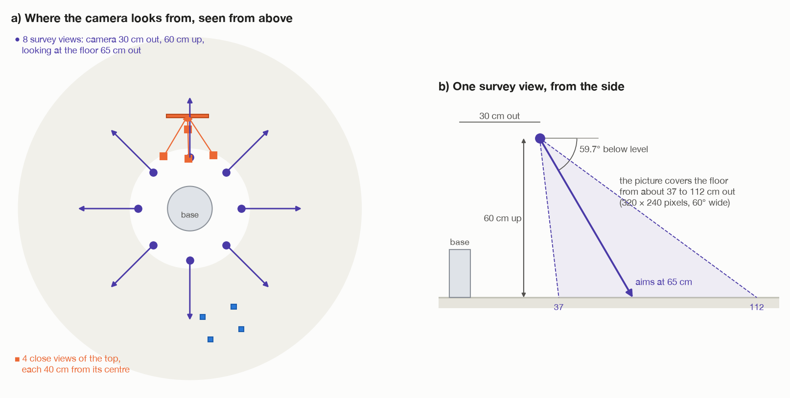
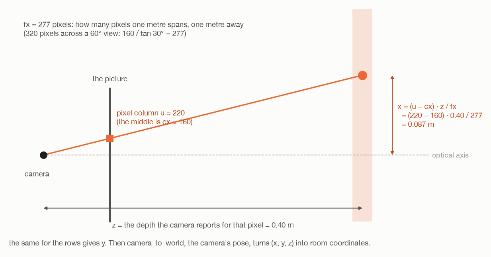
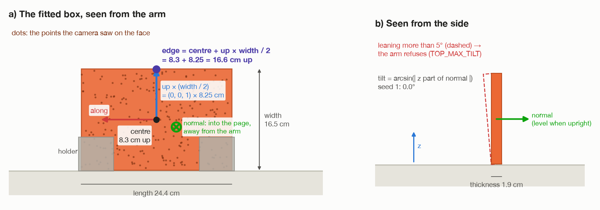

# Step 1: look round and measure the top

[← words and maths](00-words-and-maths.md) · [index](README.md) · next: [step 2 →](02-plan-before-moving.md)

## What happens

The arm starts knowing nothing about the room. It carries its camera round
and takes pictures. From them it works out:

- where the **floor** is;
- where the **table top** is, how big it is, and which way it faces;
- where anything else is that it must not hit: the **legs**, and any
  **obstacles**.

Then it goes close to the top, looks again from four sides, and measures it
properly. From that close measurement it takes the two things the rest of the
job needs: **how far the top leans**, and **where the middle of its upper edge
is**.

**Joints that move:** all six, to point the camera. Nothing is touched.

## What comes in

Nothing from the room. Only facts about the robot itself:

| Fact | Value | Why it is needed |
| --- | --- | --- |
| where the base is | (0, 0, 0) | every point is measured from here |
| where the camera sits on the tool (`CAMERA_OFFSET`) | 8.5 cm to one side, 1.5 cm along the reach | to put the camera, not tool0, where it should look from |
| the camera's picture | 320 × 240 pixels, 60° wide, depth up to 3 m | to turn pixels into points |
| the arm's own footprint (`SELF_RADIUS`) | 13 cm round the base | points inside it are the arm seeing itself |

---

## 1a. The survey: eight pictures all round



The camera is put at eight places round the base, one every 45°
(`SURVEY_AZIMUTHS_DEG`). For each one:

```
heading  = (cos a, sin a, 0)                    a = 0°, 45°, 90°, …, −45°
camera   = heading × 0.30  +  (0, 0, 0.60)      30 cm out, 60 cm up
target   = heading × 0.65                       a point on the floor 65 cm out
look along  target − camera
```

So the camera looks down and outwards, 59.7° below level. With a 60° wide
picture, each view covers the floor from about 37 to 112 cm out. Eight of them
cover a ring all the way round. The top, 54 cm out, is in the 90° view.

### Putting the camera, not the tool, at a spot

The camera is bolted 8.5 cm to one side of tool0 (`CAMERA_OFFSET`), and the
offset turns with the tool. So tool0 has to go to

```
tool0 position = camera position − R · CAMERA_OFFSET
```

where R is the tool's orientation (`_point_camera()` in `task.py`). R · offset
is "the offset, turned the way the tool faces" (see
[words and maths, section 4](00-words-and-maths.md#4-rotation-matrices-which-way-something-faces)).

Turning the camera about the way it looks spins the picture but does not
change what is in it. So six such spins are offered (`view_options()`), least
turn first, and the first one the arm can reach is used. **A view the arm
cannot reach is skipped**, with a warning. The other views make up for it.

### Why the arm is steered into one shape

Each view is reached starting from the ready posture turned towards it. Left
to pick any shape, the planner sometimes brought the elbow round underneath,
and the picture was then half full of arm.

---

## 1b. From pixels to points



Each picture has two images: **colour**, and **depth**, the distance to
whatever each pixel shows.

### Coloured or grey

`colour_masks()` in `perception/pixels.py` sorts the pixels by how colourful
they are. It converts each pixel to HSV: hue, saturation (how colourful) and
value (how bright).

| Kind | Rule | What it is |
| --- | --- | --- |
| **coloured** | saturation ≥ 90 and value ≥ 50 (out of 255) | the parts: the top and the legs |
| **grey** | everything else | the floor, the holders, anything in the way |

This is not "the top is red". The room is painted grey on purpose, and every
part in a saturated colour, so "colourful" means "a part". Which part it is
comes later, from its shape.

Two kinds of pixel are thrown away:

- **no trustworthy depth**: no reading, or more than 2 m away. At that range
  the floor is seen so flat-on that one pixel covers centimetres.
- **flying pixels**: at the edge of an object, a depth camera can report a
  distance somewhere between the object and what is behind it. That point
  would float in mid-air. A pixel whose depth differs from its own kind of
  neighbours by more than 1 cm + 1 cm per metre of range is dropped
  (`flying_pixels()`).

### The pinhole formula

`back_project()` turns each kept pixel into a point. A camera is treated as a
pinhole. The pixel at column u, row v, with depth z, is at

```
x = (u − cx) · z / fx
y = (v − cy) · z / fy
z = z
```

in the **camera's own frame**: x to the right of the picture, y down, z
straight out of the lens.

| Symbol | Meaning | This camera |
| --- | --- | --- |
| cx, cy | the pixel at the middle of the picture | 160, 120 |
| fx, fy | the focal length in pixels: how many pixels one metre spans at one metre away | 160 / tan 30° = 277 |

Worked example: a pixel 60 columns right of the middle, 0.40 m away, is
60 × 0.40 / 277 = 0.087 m to the right of the lens's line of sight. The
further away (bigger z), the more metres one pixel stands for.

Then the camera's pose, read from the arm at the moment the picture was taken,
turns the point into room coordinates:

```
point in room = R_camera · (x, y, z) + p_camera
```

That is one pose multiplication. It is why a picture is only any use together
with where the arm was when it was taken.

The survey keeps every coloured pixel but only every other row and column of
grey ones (`stride=2`). There are far more grey pixels, and the floor does not
need them all.

---

## 1c. Reading the room from the points

`read_room()` in `perception/room.py` pools the points from all eight views
and works through them in order.

### 1. Drop the arm itself

Any point within 13 cm of the base, seen from above (`SELF_RADIUS`), is the
arm's own body. It is dropped.

### 2. The floor

The floor is by far the biggest flat level thing in view. So `floor_height()`
sorts the heights of all grey points into bins 2 mm tall and finds the fullest
bin. The median height of the points within 1 cm of it is the floor.

Seed 1: the floor is at z = 0.0. **Every height from here on is measured from
it.**

### 3. Group the coloured points into objects

`cluster()` in `perception/fitting.py`:

1. Put every point into a grid of little cubes 1.2 cm on a side ("voxels").
2. Start from any filled cube and spread to every filled cube touching it,
   including at corners (26 neighbours), and from those to theirs, until
   nothing new is reached. That is one object.
3. Repeat from a cube not yet reached.
4. Throw away objects of fewer than 120 points. They are specks.

This works because the parts stand apart from each other.

### 4. Tell the objects apart by shape alone

Each object gets two box fits (1d below): as a **plate** at any angle, and as
a **box resting on the floor**. Then:

| Test | Rule | Seed 1's top |
| --- | --- | --- |
| is it a plate? | thickness < 0.25 × its shorter side (`PLATE_RATIO`) | 1.9 < 0.25 × 16.5 = 4.1 ✓ |
| **the table top** | the plate with the biggest length × width | the only plate |
| a leg | longest side > 2 × the next (`STICK_RATIO`) | the four legs |
| unknown | coloured, but neither | none |

No size or position is looked up. A leg is a leg because it is long and thin.

### 5. Obstacles: grey things standing on the floor

- Keep grey points more than 1.5 cm above the floor (`FLOOR_BAND`).
- **Drop grey points within about 3 cm of a coloured point** (`PART_HALO`).
  These are the dimly lit sides of a part.
- Group what is left, with 1.5 cm cubes and at least 150 points.
- Keep a group only if it reaches down to within 5 cm of the floor
  (`GROUNDED`). A grey group floating in mid-air is the arm catching its own
  body at the edge of a picture.
- Fit a box resting on the floor to each.

**This is why the holders are never seen.** They are grey and touch the top,
so they fall inside the 3 cm halo and are dropped as "the top's shadowed side".
Step 4 has to lift the top out without knowing how tall they are.

### 6. Tell MoveIt

The floor, the top, the legs and any obstacles go into MoveIt's picture of the
room as boxes. From now on every move is checked against them.

---

## 1d. Fitting a box to the top's points



`fit_plate()` in `perception/fitting.py` turns a cloud of points into a box: a
**centre**, **three axes** and **three sizes**. It needs no guess to start
from.

### Step 1: find the face's plane

The camera mostly sees the top's broad face, the one towards the arm. Those
points lie on a flat plane. To find the plane:

1. Take the **mean** of the points. That is a point on the plane.
2. Look at how the points spread out from it. They spread a lot along the
   board's length, a lot up its face, and hardly at all through it. The
   direction they spread **least** is the plane's **normal**.

The code finds these three directions with a singular value decomposition
(`np.linalg.svd`). This is also called principal component analysis. You can
think of it as finding the longest, the middle and the thinnest direction of
the cloud. Only the thinnest one is used here.

**Why it repeats.** The camera also sees a strip of the top's upper edge, from
above. That strip sits behind the face and pulls the plane slightly off. So
the fit is done again using only points within 6 mm of the plane, then 3 mm,
then 2 mm. Each time the edge strip drops out a little more, until only the
face is left.

### Step 2: the three axes

```
normal = the direction the face points (from the plane fit)
up     = the room's vertical, flattened onto the face:
         (0, 0, 1) − ((0, 0, 1) · normal) × normal, made length 1
along  = up × normal
```

"Flattened onto the face" means: take straight up, and remove the part of it
that points out of the face. What is left runs up the face. For an upright
board that is simply (0, 0, 1).

### Step 3: the sizes and the centre

Now every point is measured along the board's own three axes instead of x, y,
z. That is one multiplication by the rotation: `(points − mean) · R`. Then:

```
length    = furthest along  − nearest along
width     = highest up      − lowest up
thickness = the face (99th percentile of normal) − the furthest point behind it
centre    = the middle of each of those ranges, turned back into room coordinates
```

**So the centre is not the mean of the points.** The mean leans towards
wherever the camera saw the most points, and the camera sees the face much
more than the edge. The middle of the range, halfway between the two extreme
points on each axis, is the middle of the board, however unevenly it was
seen.

The thickness uses the 99th percentile rather than the very front point, so a
few stray points in front of the face do not make the board thicker.

If the width came out bigger than the length, the two are swapped, so axis 0
is always the long side.

### Seed 1's box, from the survey

| | Value |
| --- | --- |
| centre | (−1.3, 54.0, 8.3) cm |
| along | (−1.00, 0.01, 0) |
| up | (0, 0, 1) |
| normal | (0.01, 1.00, 0) |
| size | 24.4 × 16.5 × 1.9 cm |

**Which way round `along` and `normal` point can come out either way.** −along
is as good a direction as along. Nothing later depends on it: step 2 tries
gripping both ways round.

---

## 1e. Measure again, close up

The survey saw the top from over half a metre away. `_measure_top()` looks
again from 40 cm, from four directions:

```
toward = level direction from the top to the base, length 1
along  = (0, 0, 1) × toward

view directions, each made length 1:
  up + 0.8 · toward               from the arm's side, above
  up + 0.8 · toward + 0.5 · along from the side, off to one end
  up + 0.8 · toward − 0.5 · along off to the other end
  up + 0.2 · toward               nearly straight above

camera = top's centre + 0.40 × direction, looking at the centre
```

The three slanted views see the face towards the arm, which gives length and
width to about a millimetre. The one from nearly straight above sees the upper
edge, which gives the thickness. The same `read_room()` runs on these four
pictures, using the floor height already found.

**If the top is lost close up**, or its new centre is more than 8 cm from the
survey's, the survey's measurement is kept, with a warning.

The log says:

```
table top: 24.4 x 16.5 cm, 1.9 cm thick
  standing 0.0 degrees off upright
```

---

## 1f. Two checks, and the edge

### Is it too thick?

If the thickness is more than 6.5 cm (`MAX_GRASP_WIDTH`, a fact about the
gripper), the arm stops: *"the top is too thick for the gripper to close
round"*. Seed 1: 1.9 cm.

### Does it lean?

The normal of an upright board is **level**, with z part 0. The more the board
leans, the more the normal tips up or down. So `upright_tilt()` in
`assembly/grasps.py` works out

```
lean = arcsin( | z part of normal | )
```

| Board | normal | lean |
| --- | --- | --- |
| upright | (0.01, 1.00, 0.00) | arcsin 0 = 0° |
| leaning 5° | z part = sin 5° = 0.087 | 5° |

If the lean is more than **5°** (`TOP_MAX_TILT`), the arm stops: *"the top is
not standing upright, and it can only be picked up upright"*. Why: every grip
pose below assumes the edge is straight above the centre. A board leaning
more has its edge somewhere else. Seed 1: 0.0°.

The lean is only about tipping forwards or backwards. Which way the top faces
round the room does not matter here.

### The middle of the upper edge

The gripper will grab the board by the middle of its **upper edge**, from
straight above. The box gives the centre, but the centre is in the middle of
the board, where there is nothing to hold. So `upright_edge()` walks from the
centre up the face by half the width:

```
edge = centre + up × (width / 2)
```

Of the box's two long axes, "up" is **whichever points more nearly straight
up**, flipped if it points down. The fit may have labelled them either way
round, and this makes the step go to the upper edge, not the lower one. Using
the board's own `up`, not simply the room's z, puts the point on the real edge
even if the board leans a little.

Seed 1:

```
edge = (−1.3, 54.0, 8.3) + (0, 0, 1) × 8.25  =  (−1.3, 54.0, 16.6) cm
```

`upright_edge()` also hands back `along`, the way the edge runs, and the
normal. Both are needed to point the gripper in step 2.

---

## What goes out

| Value | Seed 1 | Used in |
| --- | --- | --- |
| floor height | 0.0 cm | step 2 (the turning spot's height); MoveIt's floor |
| the top's box `P`: centre, axes, size | see 1d | step 2 (grip poses, the hold `H`), step 3 (finger opening) |
| the middle of the upper edge | (−1.3, 54.0, 16.6) cm | step 2 |
| `along`, the way the edge runs | (−1.00, 0.01, 0) | step 2 |
| the legs, obstacles and unknown things | 4 legs | step 2 (is the turning spot clear?); MoveIt |

## Fixed and measured numbers in this step

| Number | Value | Kind | Where |
| --- | --- | --- | --- |
| survey views | 8, every 45° | choice | `arm/dimensions.py` |
| survey camera | 30 cm out, 60 cm up, aimed 65 cm out | choice | `arm/dimensions.py` |
| close views | 4, from 40 cm | choice | `task.py`, `_measure_top()` |
| a close view lost if the top moved more than | 8 cm | choice | `task.py` |
| coloured pixel | saturation ≥ 90, value ≥ 50 | choice | `perception/pixels.py` |
| depth kept | 0 to 2 m | choice | `perception/pixels.py` |
| flying pixel | differs by > 1 cm + 1 cm/m | choice | `perception/pixels.py` |
| the arm's footprint | 13 cm | robot fact | `arm/dimensions.py` |
| floor bins | 2 mm | choice | `perception/fitting.py` |
| cluster cube, smallest object | 1.2 cm, 120 points | choice | `perception/fitting.py` |
| plane-fit bands | 6, 3, 2 mm | choice | `perception/fitting.py` |
| plate, stick | thickness < 0.25 × width; longest > 2 × next | choice | `perception/room.py` |
| part halo, floor band, grounded | 3 cm, 1.5 cm, 5 cm | choice | `perception/room.py` |
| thickest grip | 6.5 cm | robot fact | `arm/dimensions.py` |
| most lean | 5° | choice | `task.py` |
| floor, top's box, edge, lean | see above | **measured** | every run |

## What can go wrong

| Message | Why |
| --- | --- |
| `could not get the camera to [...]; skipping that view` | a warning only: one view could not be reached |
| `could not reach any of the views` | no picture at all |
| `too few points to find the floor` | the camera saw almost nothing grey |
| `no table top in sight` | no plate-shaped coloured object |
| `lost the top close up; keeping the survey's measurement` | a warning only |
| `the top is too thick for the gripper to close round` | thicker than 6.5 cm |
| `the top is not standing upright, and it can only be picked up upright` | leaning more than 5° |

## Where it is in the code

| What | Where |
| --- | --- |
| the order: survey, report, measure, check | `task.py`: `run()` |
| the eight views, pointing the camera | `task.py`: `_survey()`, `_look()`, `_point_camera()` |
| the four close views, the lean check | `task.py`: `_measure_top()` |
| coloured or grey, flying pixels, pinhole | `perception/pixels.py`: `colour_masks()`, `flying_pixels()`, `back_project()` |
| floor, objects, obstacles | `perception/room.py`: `read_room()` |
| clusters, floor height, box fits | `perception/fitting.py`: `cluster()`, `floor_height()`, `fit_plate()`, `fit_resting_box()` |
| the lean and the edge | `assembly/grasps.py`: `upright_tilt()`, `upright_edge()` |

[← words and maths](00-words-and-maths.md) · [index](README.md) · next: [step 2 →](02-plan-before-moving.md)
