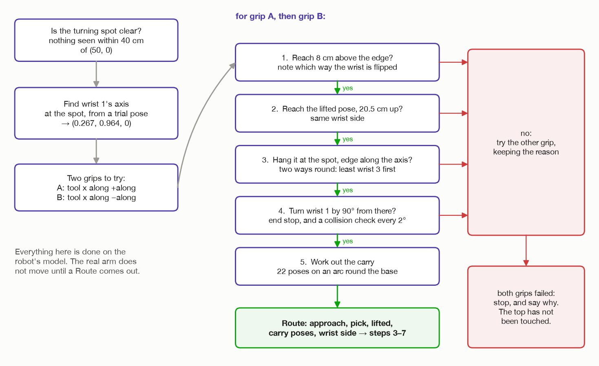
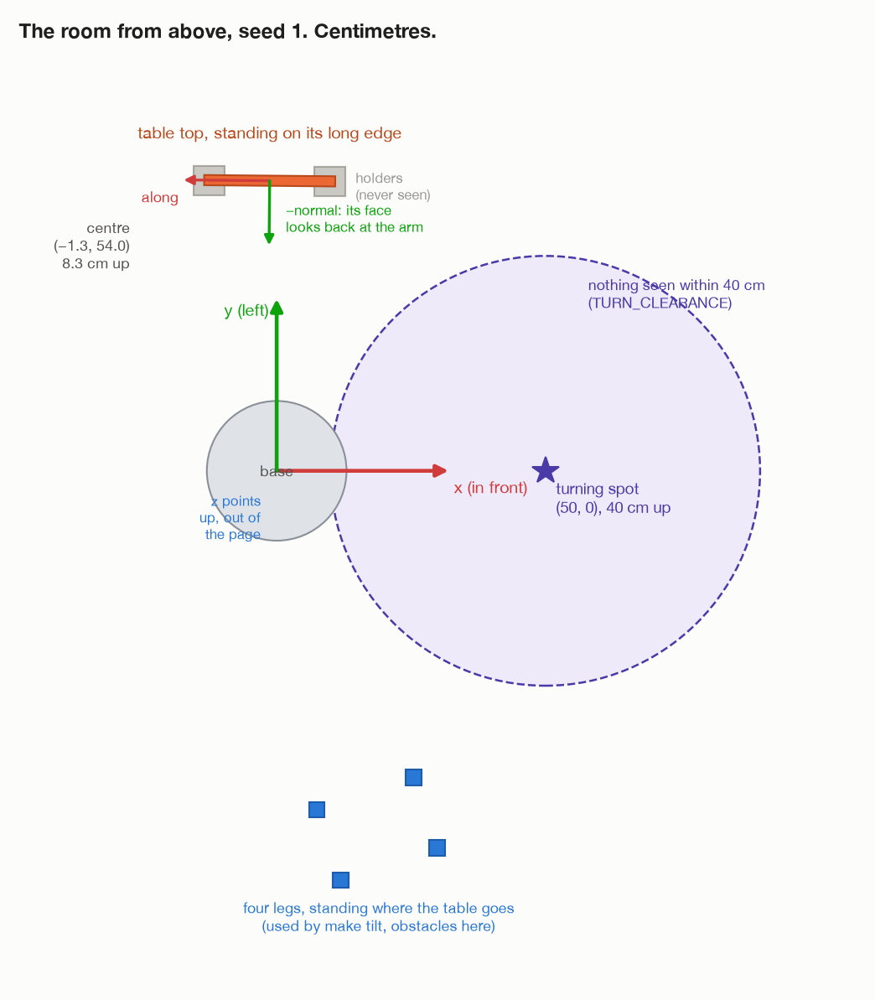
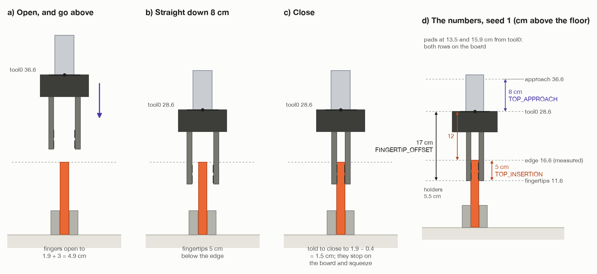

# Step 2: plan every pose before touching the top

[← step 1](01-look-and-measure.md) · [index](README.md) · next: [step 3 →](03-grip-the-edge.md)

## What happens

**Nothing moves.** The arm works out every pose of steps 3 to 7 on its own
model of itself and the room, and checks each one. Only if all of them pass
does it touch the top.

**Why bother?** Suppose it gripped the top, lifted it and carried it round,
and only then found it could not turn it. All it could do would be to carry it
back and put it down, with every chance of dropping it on the way. Checking
first costs a second or two of computing, and the top stays untouched if the
answer is no.



## What comes in

| From | Value | Seed 1 |
| --- | --- | --- |
| step 1 | the floor height | 0.0 cm |
| step 1 | the top's box `P` | centre (−1.3, 54.0, 8.3) cm, 24.4 × 16.5 × 1.9 cm |
| step 1 | the middle of the upper edge, and `along` | (−1.3, 54.0, 16.6) cm, (−1, 0.01, 0) |
| step 1 | everything else seen: legs, obstacles, unknown | 4 legs |

---

## 2a. Where the turn happens

```
turning spot = (TURN_SPOT x, TURN_SPOT y, floor + TURN_HEIGHT)
             = (0.50, 0.00, 0.00 + 0.40)
             = 50 cm straight in front of the arm, 40 cm up
```

This is where **the middle of the gripped edge** will be when the turn starts.

**It is a choice, not something measured.** The robot always turns the top at
the same place in front of itself, and that is allowed: it is a decision about
how to do the job, not a fact about the room. Only its height is tied to the
room, because it is measured from the floor.

**Why 40 cm up?** The top hangs down from the gripped edge. The widest top a
room can have is 20 cm, so hanging from 40 cm its lower edge is still 20 cm
above the floor.

**Why 50 cm out?** Close enough to reach comfortably. Far enough that the
whole-arm turn (the other way of turning, `make whole-arm`) does not have to
fold the arm up tight: that turn brings the tool 12 cm back towards the base.

## 2b. Is the space clear?



`_check_turning_spot_clear()` looks at every leg, obstacle and unknown thing
seen in step 1. For each, seen from above:

```
distance = √( (x − 0.50)² + (y − 0.00)² )      from the thing's centre to the spot
```

If any distance is less than **40 cm** (`TURN_CLEARANCE`), the arm stops:
*"the space where the top is turned is not clear: something is at [x, y]"*.

**Why 40 cm?** In step 7 the top swings round wrist 1. Its far edge moves on a
circle about 40 cm across. Anything inside that could be hit.

It compares **centres**. A big obstacle whose centre is just outside 40 cm
could still reach in. MoveIt's collision check in 2f is what catches that.

Seed 1: the nearest leg is 62 cm away, so the spot is clear. The top itself is
not in the list: it will be in the gripper.

## 2c. Wrist 1's axis at the spot

In step 7 wrist 1 turns the top about wrist 1's own axis. For the top to end
flat, the gripped edge must run **along that axis**
([step 6](06-line-up-with-wrist-1.md) explains why). So the planner needs to
know which way wrist 1's axis points when the tool is at the turning spot.

1. **A trial pose.** Tool pointing straight down, 12 cm above the spot, its x
   axis along the room's x:

   ```
   trial = down_tool_pose( (0.50, 0.00, 0.52),  (1, 0, 0) )
   ```

   `solve()` finds joint angles for it. If it cannot: *"the arm cannot reach
   the turning spot at [...]"*.
2. **Nudge wrist 1 and watch.** `joint_axis()` turns wrist 1 by 0.1 rad in the
   model and sees which way the tool turned ([step 6](06-line-up-with-wrist-1.md)).

Seed 1: **axis = (0.267, 0.964, 0)**, level and 15.5° off the room's y axis.

It is found once. The axis depends only on where the tool is, not on how the
tool is spun about the vertical: wrist 3 spins it without moving wrist 1.

## 2d. The board's height

```
height = 2 × (edge z − centre z) = 2 × (16.6 − 8.3) = 16.5 cm
```

This is the board's width, the size along `up`, worked out from the edge. It
sizes the lift in 2f.

## 2e. Two ways to grip



The gripper grabs the edge from straight above, fingers closing across the
board's thickness. `down_tool_pose()` in `assembly/grasps.py` builds that
orientation from the edge's direction:

```
x = along, with its z part removed, made length 1     the tool's x runs along the edge
z = (0, 0, −1)                                        the tool reaches straight down
y = z × x                                             square to both: the way the fingers close
position = edge + (0, 0, 0.12)                        tool0 12 cm above the edge
```

Why 12 cm: the fingertips are 17 cm below tool0, and they should reach 5 cm
past the edge. 17 − 5 = 12 ([step 3](03-grip-the-edge.md)).

The fingers do not care which way round the tool faces along the edge. So
`edge_pick_poses()` offers **two** grips:

| Grip | Tool's x | Seed 1 |
| --- | --- | --- |
| **A** | +along | (−1.00, 0.01, 0) |
| **B** | −along | (1.00, −0.01, 0) |

They differ by half a turn of wrist 3. One may suit the arm better than the
other. Both put tool0 at the same point:

```
pick = (−1.3, 54.0, 16.6 + 12) = (−1.3, 54.0, 28.6) cm
```

Grip A's pick pose as a matrix (seed 1):

```
          x       y       z     position
pick = [ −1.00    0.01    0    │ −0.013 ]
       [  0.01    1.00    0    │  0.540 ]
       [  0       0      −1    │  0.286 ]
       [  0       0       0    │  1     ]
```

Tool x along the edge; tool y (0.01, 1, 0) across the board, the way the
fingers close; tool z straight down.

## 2f. The checks, grip A first, then grip B

For each grip, in order. **The first failure ends that grip**, the reason is
kept, and the next grip is tried.

### Check 1: can the arm get above the edge?

```
approach = pick, moved up by 8 cm (TOP_APPROACH)  →  tool0 at 36.6 cm
```

`wrist_side(approach)` solves for it. No answer: *"the arm cannot reach above
the top's edge"*.

If there is an answer, it also says **which way the wrist is flipped**: +1 or
−1, from the sign of sin(wrist 2's angle). The arm cannot flip its wrist with
the top in hand (see
[words and maths, section 6](00-words-and-maths.md#which-way-the-wrist-is-flipped)),
so **every later check must use that same wrist side**.

### Check 2: can it lift the top clear of the holders?

```
lifted = pick, moved up by (height + LIFT_CLEAR) = 16.5 + 4 = 20.5 cm  →  tool0 at 49.1 cm
```

`can_reach(lifted, wrist=wrist)`. No: *"the arm cannot lift the top clear of
its holders"*.

Why height + 4 cm is explained in [step 4](04-lift-out.md). In short, the
bottom edge has to end above where the top edge was.

### The hold `H`

Before the next checks the planner needs to know where the top will be for
any tool pose. That is the hold:

```
H = P⁻¹ · pick
```

`H` is **the tool's pose measured from the board**, and it stays the same for
as long as the board is in the fingers. [Step 3](03-grip-the-edge.md#3e-the-hold-h-where-the-tool-sits-on-the-board)
explains it in full. It is worked out here, from the **planned** grip, so the
planner can use it before any grip has happened.

### Check 3: can it hang the top at the turning spot, edge along wrist 1's axis?

`hanging_tool_poses(spot, axis)` gives two poses, tool down 12 cm above the
spot, x along +axis or −axis:

```
hanging = down_tool_pose( (0.50, 0.00, 0.52),  ±(0.267, 0.964, 0) )
```

They differ by half a turn of wrist 3. The one that needs **less turn of
wrist 3 on the way from the lifted pose** is tried first (`wrist_spin()`,
[step 5](05-carry-round.md#5e-the-spin-base-and-wrist-3)):

| Grip A, hanging with tool x along | wrist 3 has to turn |
| --- | --- |
| **+axis (0.267, 0.964, 0)** | **13.6°** ← tried first |
| −axis | 166.4° |

(For grip B it is the other way round: −axis first, also 13.6°.)

`_turn_blocked(hanging, wrist)`:

- `solve(hanging, wrist=wrist)`. No answer: *"the arm cannot hold it hanging
  at the turning spot"*.

### Check 4: is the turn itself possible from there?

With the joint angles for the hanging pose:

1. Find wrist 1's axis again, at those exact angles.
2. `flat_turn()` picks +90° or −90°, whichever swings the top away from the
   arm ([step 7](07-turn-flat.md#7a-which-way-90-or-90)). Seed 1: −90°.
3. `joint_turn_blocked()` in `arm/motion.py`:
   - **End stop.** Wrist 1 can turn at most one full turn either way, ±360°.
     If where it would end is past that: *"wrist_1_joint would go past its end
     stop, to … degrees"*. Seed 1: −85.3° → −175.3°, fine.
   - **Collisions.** The arm and the gripper are put at every 2° of the turn,
     46 poses from 0° to 90°. Each is checked against everything MoveIt knows.
     Any hit: *"turning wrist_1_joint hits something … degrees in"*. The top is
     not in this check: it is not in the fingers yet, so MoveIt does not know to
     carry it. Step 7 runs the same check again just before turning, and by then
     the top is attached and included.

If the first hanging pose fails, the second one is tried before giving up on
this grip.

### Check 5: work out the carry

Not a pass-or-fail check, just the last piece of the plan.

```
centre height = the higher of:
                the board's centre with the tool lifted     (lifted · H⁻¹)[z]  = 28.8 cm
                the board's centre with the tool hanging    (hanging · H⁻¹)[z] = 31.75 cm
              = 31.75 cm

carry = carry_round(H, lifted, hanging, 31.75 cm, base)  +  [hanging]
```

`(pose · H⁻¹)` is "where the board is, for the tool at this pose". Row 2,
column 3 is its height. [Step 5](05-carry-round.md) explains `carry_round()`.

The hanging pose is added once more at the end, so the carry is sure to finish
exactly there.

## 2g. The result: a Route

The first grip that passes every check becomes the plan:

```python
Route(
    approach = 8 cm above the pick pose,             # step 3
    pick     = tool0 12 cm above the edge,           # step 3
    lifted   = pick + 20.5 cm up,                    # step 4
    carry    = 22 poses on an arc, then hanging,     # step 5
    wrist    = +1 or −1,                             # steps 3, 4, 5
)
```

If neither grip passes, the arm stops with the last reason:

```
the top cannot be turned flat however it is gripped: <reason>
```

**The top has not been touched.**

---

## What goes out

| Value | Seed 1 | Used in |
| --- | --- | --- |
| `route.approach` | tool0 at (−1.3, 54.0, 36.6) cm, pointing down | step 3 |
| `route.pick` | tool0 at (−1.3, 54.0, 28.6) cm | step 3, and `H` |
| `route.lifted` | tool0 at (−1.3, 54.0, 49.1) cm | step 4 |
| `route.carry` | 22 poses on an arc, then the hanging pose at (50, 0, 52) cm | step 5 |
| `route.wrist` | +1 or −1 | steps 3, 4, 5 |

`H` itself is not kept in the Route. After the pick-up, `run()` works it out
again the same way, from the same `P` and `pick`, and step 8 uses it.

## Fixed and measured numbers in this step

| Number | Value | Kind | Where |
| --- | --- | --- | --- |
| `TURN_SPOT` | (0.50, 0.00) m | choice | `task.py` |
| `TURN_HEIGHT` | 0.40 m above the floor | choice | `task.py` |
| `TURN_CLEARANCE` | 0.40 m | choice | `task.py` |
| `TOP_APPROACH` | 0.08 m | choice | `task.py` |
| `LIFT_CLEAR` | 0.04 m | choice | `task.py` |
| `EDGE_BELOW_TOOL` | 0.12 m | worked out: 0.17 − 0.05 | `assembly/grasps.py` |
| nudge to find an axis | 0.1 rad | choice | `arm/motion.py`, `joint_axis()` |
| wrist 1's end stop | ±360° | robot fact | `arm/motion.py` |
| collision check step | 2° | choice | `arm/motion.py`, `JOINT_CHECK_STEP` |
| the top's box, the edge, the height | from step 1 | **measured** | |
| wrist 1's axis, wrist side, `H`, which turn | see above | **worked out** | |

## What can go wrong

| Message | Why |
| --- | --- |
| `the space where the top is turned is not clear: something is at [...]` | something seen within 40 cm of the spot |
| `the arm cannot reach the turning spot at [...]` | no joint angles for the trial pose |
| `the top cannot be turned flat however it is gripped: the arm cannot reach above the top's edge` | check 1, both grips |
| `... the arm cannot lift the top clear of its holders` | check 2 |
| `... the arm cannot hold it hanging at the turning spot` | check 3 |
| `... wrist_1_joint would go past its end stop, to ... degrees` | check 4 |
| `... turning wrist_1_joint hits something ... degrees in` | check 4 |

## Where it is in the code

| What | Where |
| --- | --- |
| the turning spot, and the clear-space check | `task.py`: `_turning_edge()`, `_check_turning_spot_clear()` |
| the whole plan | `task.py`: `_plan_route()`, `Route` |
| the turn check | `task.py`: `_turn_blocked()`; `arm/motion.py`: `joint_turn_blocked()` |
| grip and hanging poses | `assembly/grasps.py`: `down_tool_pose()`, `edge_pick_poses()`, `hanging_tool_poses()` |
| the hold, the carry, the wrist 3 turn | `assembly/grasps.py`: `hold()`, `carry_round()`, `wrist_spin()` |
| which way to turn | `assembly/grasps.py`: `flat_turn()` |
| joint angles, reachability, wrist side, joint axis | `arm/motion.py`: `solve()`, `can_reach()`, `wrist_side()`, `joint_axis()` |

[← step 1](01-look-and-measure.md) · [index](README.md) · next: [step 3 →](03-grip-the-edge.md)
