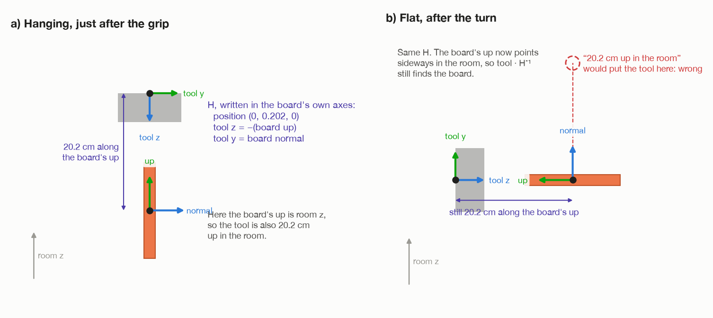

# Step 3: grip the middle of the upper edge

[← step 2](02-plan-before-moving.md) · [index](README.md) · next: [step 4 →](04-lift-out.md)

## What happens

Five moves:

1. Open the fingers a little wider than the top is thick.
2. Move freely to 8 cm above the grip.
3. Tell MoveIt it may now touch the top.
4. Go straight down 8 cm, so the fingers pass either side of the edge.
5. Close the fingers, and check they feel the top.

Then tell MoveIt the top is now part of the arm. From that moment the arm
knows where the top is from where the tool is. That is **the hold, `H`**.

**Joints that move:** all six. The free move can use any of them. The last
8 cm straight down mostly uses the shoulder, the elbow and wrist 1.


## What comes in

| From | Value | Seed 1 |
| --- | --- | --- |
| step 1 | the top's thickness | 1.9 cm |
| step 1 | the top's box `P` | centre (−1.3, 54.0, 8.3) cm |
| step 2 | `route.approach` | tool0 at 36.6 cm, pointing down |
| step 2 | `route.pick` | tool0 at 28.6 cm |
| step 2 | `route.wrist` | which way the wrist is flipped |

---

## 3a. Where the tool goes, and why those heights

Everything is measured from **tool0**, the flange at the end of the arm. The
gripper hangs below it:

| Distance below tool0 | What is there | Where the number is |
| --- | --- | --- |
| 0 to 5 cm | the gripper body | `gripper.urdf.xacro` |
| 5 to 17 cm | the fingers | `gripper.urdf.xacro` |
| 13.5 cm | the inner row of pads | `gripper.urdf.xacro` |
| 15.9 cm | the tip row of pads | `gripper.urdf.xacro` |
| **17 cm** | **the fingertips** (`FINGERTIP_OFFSET`) | `arm/dimensions.py` |

The fingers should reach **5 cm** down past the edge (`TOP_INSERTION`). So
tool0 stops

```
EDGE_BELOW_TOOL = FINGERTIP_OFFSET − TOP_INSERTION = 17 − 5 = 12 cm above the edge
```

**Why 5 cm?** Each finger touches the board through **two rows of pads**, at
13.5 and 15.9 cm from tool0. With the edge 12 cm below tool0, both rows are on
the board: 1.5 cm and 3.9 cm below the edge. Two rows matter later. Once the
top is flat (step 7), its weight tries to twist it out of the fingers. One
row of pads could not resist that. The gap between two rows can.

### The heights, seed 1

| Pose | Rule | tool0 | Fingertips |
| --- | --- | --- | --- |
| edge | **measured** in step 1 | – | – |
| approach | edge + 12 + 8 | 36.6 cm | 19.6 cm, **3 cm above the edge** |
| pick | edge + 12 | 28.6 cm | 11.6 cm, **5 cm below the edge** |

### Fixed or not?

- **The gaps never change**: 12 cm (tool0 to edge) and 8 cm (approach to pick).
  They are about the gripper, not the top.
- **The heights do change**: they start from the edge, which is measured. A
  taller top has a higher edge, and every pose moves up with it.
- **The 5 cm reach over the edge is the same for every top.** It depends on the
  pads, not the board. Every top is at least 16 cm tall, so 5 cm always fits.

**Why start 8 cm above?** The fingertips reach 5 cm below the edge when
gripping. Starting 8 cm higher puts them 3 cm **above** the board, so the free
move there cannot catch the board with a finger.

---

## 3b. The moves

`_pick_up()` in `task.py`.

### 1. Open the fingers

```
opening = min( thickness + 3 cm,  7.4 cm )
        = min( 1.9 + 3.0, 7.4 )  =  4.9 cm
```

That leaves 1.5 cm of air each side of the board. It is never more than
7.4 cm (`GRIPPER_MAX_OPENING`): a finger sent right to its end stop has been
seen to stick there.

`open_gripper()` watches both fingers. If either is more than 2 mm from where
it was sent, it stops: *"the fingers did not open: …"*. A lopsided gripper
lowered over the board would put a finger on top of the edge instead of
beside it.

### 2. Move to the approach pose

```python
self._arm.move_to(route.approach, wrist=route.wrist)
```

A **free move**. MoveIt plans any path that hits nothing it knows about,
including the top, which is still in its picture of the room as a box. The
wrist is held to the side step 2 chose.

The arm must then really be there: within 5 mm and 1.7°.

### 3. Let the fingers touch the top

```python
self._forget("top")
```

The top is taken out of MoveIt's picture of the room. Otherwise the next move
would be refused, because the fingers are about to go round something MoveIt
has been told must not be touched.

### 4. Straight down 8 cm

```python
self._down_onto(route.pick)
```

A **straight line**, tool0 going straight down, with collision checking on.

It can be refused even so. The top may have been measured a hair thick, or
something beside it may have been seen as an obstacle. In that case it is run
again **unchecked**. That is acceptable: it is short, straight down, and
starts from a pose that was reached with checking on.

### 5. Close

```
closing target = thickness − GRIP_SQUEEZE = 1.9 − 0.4 = 1.5 cm
```

The fingers are told to close to 1.5 cm. They cannot, because the board is
1.9 cm thick. So they **stop on the board and press on it**, each with up to
25 N (the finger motors' limit).

**Why squeeze by just 4 mm?** It is bounded on both sides:

- **Less than about 3 mm** is smaller than the error in the measured
  thickness. On a top measured 2 mm too thick, the fingers would stop in the
  air.
- **More than about 5 mm** asks the fingers to be where the board already is.
  They are position controlled, and the simulator settles that by firing the
  board out sideways.

Then `wait_for_contact()`: the fingertip contact sensors must report a touch
within 2 s. If they do not, the arm stops: *"the fingers felt nothing, so the
grasp missed"*.

The log shows where the fingers really stopped, a second measurement of the
thickness, next to the measured thickness. The line looks like:

```
fingers closed to 19 mm on 19 mm
```

---

## 3c. Tell MoveIt the top is in the hand

```python
self._scene.attach("carried", top, route.pick)
```

MoveIt is told the top is now **fixed to the gripper**. It stores where the
top sits relative to the gripper (`scene.py`):

```
in_tool = pick⁻¹ · P          the top, measured from the tool (= H⁻¹)
```

From now on, wherever MoveIt moves the arm in its model, the top moves with
it. Every later move and check (the lift, the carry, the 2° checks of the
turn) covers the top as well as the arm. Without this, MoveIt would plan as if
the gripper were empty, and could swing the top through a leg.

---

## 3d. The problem the hold solves



The robot can only command **the tool**: "tool0, go to this pose". It cannot
say "top, go there".

But the job is all about **the top**. Lift the top clear. Carry the top
without letting it dip. Check the top ended flat. So the robot keeps needing
answers to two questions:

- "The tool is here. Where is the top?"
- "I want the top there. Where must the tool go?"

Both need one fact: **where the tool sits on the top**. That fact is the hold,
`H`.

## 3e. The hold `H`: where the tool sits on the board

`hold()` in `assembly/grasps.py`:

```
H = P⁻¹ · T
```

| Symbol | Meaning | Size | Seed 1 |
| --- | --- | --- | --- |
| `P` | the top's pose in the room | 4 × 4 | measured in step 1 |
| `T` | the tool's pose in the room, at the grip | 4 × 4 | `route.pick` |
| `H` | **the tool's pose, measured from the top** | 4 × 4 | worked out |

`P⁻¹` means **the inverse of P**, not P minus one. All three are poses with
the same layout, `[R p; 0 1]`
([words and maths, section 5](00-words-and-maths.md#5-poses-where-something-is-and-which-way-it-faces)).

### Where the formula comes from

Chaining poses: "the tool in the room" is "the top in the room", followed by
"the tool measured from the top":

```
T = P · H
```

Multiply both sides on the left by `P⁻¹`. `P⁻¹ · P` cancels, like dividing by a
number:

```
P⁻¹ · T = P⁻¹ · P · H = H
```

### Seed 1's three matrices

**P, the top in the room.** Columns: the top's own along, up and normal axes,
then its centre.

```
        along    up    normal   centre
P = [   −1.00    0      0.01  │ −0.013 ]   ← room x
    [    0.01    0      1.00  │  0.540 ]   ← room y
    [    0       1      0     │  0.083 ]   ← room z
    [    0       0      0     │  1     ]
```

**T, the tool in the room, at the grip (grip A).** Columns: the tool's x, y, z,
then tool0's position.

```
        x        y      z       position
T = [   −1.00    0.01   0     │ −0.013 ]
    [    0.01    1.00   0     │  0.540 ]
    [    0       0     −1     │  0.286 ]
    [    0       0      0     │  1     ]
```

**H = P⁻¹ · T, the tool measured from the top.** Now **the rows are the top's
own axes**, not the room's:

```
        x      y      z       position
H = [   1      0      0     │  0      ]   ← along the top's "along"
    [   0      0     −1     │  0.202  ]   ← along the top's "up"
    [   0      1      0     │  0      ]   ← along the top's "normal"
    [   0      0      0     │  1      ]
```

Read it column by column:

| Column | Says | Meaning |
| --- | --- | --- |
| position (0, 0.202, 0) | tool0 is 20.2 cm along the top's up axis | 8.25 cm centre to edge, + 12 cm edge to tool0 |
| tool x = (1, 0, 0) | along the top's "along" | the tool's x runs along the edge |
| tool y = (0, 0, 1) | along the top's normal | the fingers close through its thickness |
| tool z = (0, −1, 0) | minus the top's up | the tool points back down at the top |

**Not one number in `H` mentions the room.** That is the whole point of it.

### Why not just remember "20.2 cm up"?

While the top hangs, "along the top's up" and "up in the room" are the same
direction. So "the tool is 20.2 cm above the top's centre" is true, **for
now**.

After the turn in step 7, the top lies flat. Its "up" axis points sideways.
"20.2 cm up in the room" would then put the tool in mid-air above the top,
which is wrong (right-hand picture above). "20.2 cm along the top's up" is
still right. Because `H` is written in the top's own axes, it stays true
however the top is moved or turned.

## 3f. How `H` is used from here on

As long as the top does not slip in the fingers, `H` never changes. Two rules
follow from `T = P · H`:

```
top  = tool · H⁻¹        "the tool is here, so the top is there"
tool = top  · H          "I want the top there, so send the tool here"
```

| Where | Step | Which rule | For |
| --- | --- | --- | --- |
| `_plan_route()`: `(lifted @ inv(held))[2, 3]` | 2 | tool → top | how high the top's centre is, for the carry height |
| `carry_round()` | 2, 5 | both | plan the arc for the top's centre; turn it back into tool poses |
| `scene.attach()` | 3 to 7 | top measured from tool | MoveIt checks the top for collisions |
| `run()`: `tool_pose() @ inv(held)` | 8 | tool → top | is the top really flat? |

The lift in step 4 is the one move that does **not** need it
([step 4](04-lift-out.md#why-the-lift-does-not-need-h)).

---

## What goes out

| Value | Seed 1 | Used in |
| --- | --- | --- |
| the top, in the fingers, 5 cm deep | – | step 4 |
| MoveIt knows the top is attached | – | steps 4 to 7 |
| `H` | tool 20.2 cm along the top's up | steps 5, 8 (it was already used in 2) |

## Fixed and measured numbers in this step

| Number | Value | Kind | Where |
| --- | --- | --- | --- |
| `FINGERTIP_OFFSET` | 17 cm | robot fact | `arm/dimensions.py` |
| pad rows | 13.5 and 15.9 cm from tool0 | robot fact | `arm/gripper.urdf.xacro` |
| `TOP_INSERTION` | 5 cm | choice | `assembly/grasps.py` |
| `EDGE_BELOW_TOOL` | 12 cm | worked out | `assembly/grasps.py` |
| `TOP_APPROACH` | 8 cm | choice | `task.py` |
| extra opening | 3 cm | choice | `task.py`, `_pick_up()` |
| `GRIPPER_MAX_OPENING` | 7.4 cm | robot fact | `arm/dimensions.py` |
| `GRIP_SQUEEZE` | 4 mm | choice | `task.py` |
| a finger counts as open within | 2 mm | choice | `arm/motion.py`, `open_gripper()` |
| waiting for contact | 2 s | choice | `arm/motion.py`, `wait_for_contact()` |
| arrival | 5 mm, 1.7° | choice | `arm/motion.py` |
| edge height, thickness, `P` | from step 1 | **measured** | |
| pick and approach heights, `H` | from step 2 | **worked out** | |

## What can go wrong

| Message | Why |
| --- | --- |
| `the fingers did not open: ... mm and ... mm out of ...` | a finger stuck |
| `no plan found to [...]: ...` | the free move to the approach pose failed |
| `the arm stopped ... mm and ... degrees away from [...]` | it did not really arrive |
| `straight-line move to [...] only solved ...% of the way` | a log line only, before the unchecked retry |
| `the fingers felt nothing, so the grasp missed` | no contact within 2 s |

## Where it is in the code

| What | Where |
| --- | --- |
| the five moves | `task.py`: `_pick_up()`, `_down_onto()`, `_grip()`, `_forget()` |
| opening and closing the fingers | `arm/motion.py`: `open_gripper()`, `set_gripper()`, `wait_for_contact()` |
| free and straight moves | `arm/motion.py`: `move_to()`, `move_linear()`, `_check_arrival()` |
| attaching the top in MoveIt | `scene.py`: `attach()` |
| the hold | `assembly/grasps.py`: `hold()` |
| the gripper's build | `arm/gripper.urdf.xacro`, `arm/dimensions.py` |

[← step 2](02-plan-before-moving.md) · [index](README.md) · next: [step 4 →](04-lift-out.md)
