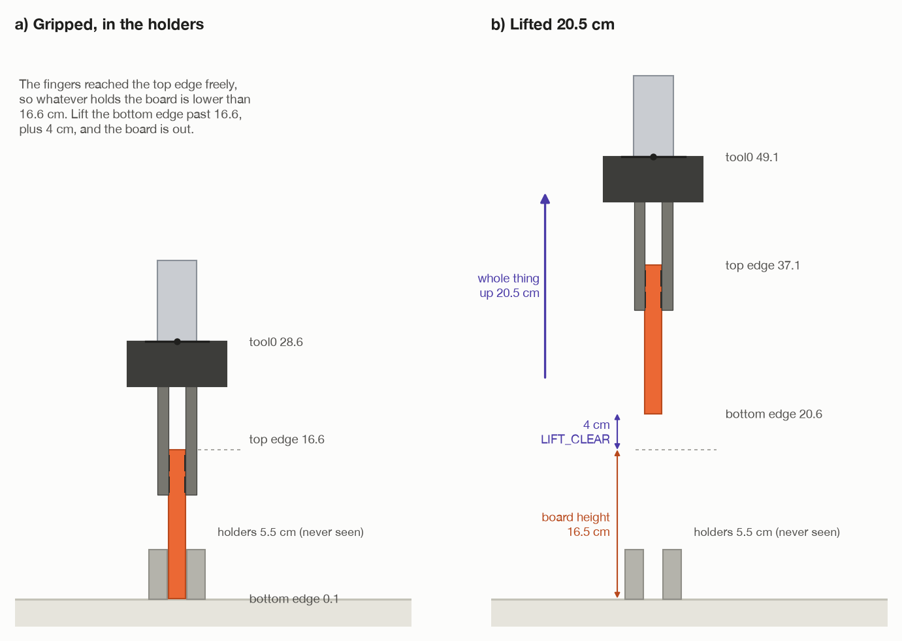

# Step 4: lift straight up, out of the holders

[← step 3](03-grip-the-edge.md) · [index](README.md) · next: [step 5 →](05-carry-round.md)

## What happens

The tool goes **straight up by 20.5 cm**, slowly, with the top in its fingers.
The top comes up out of its holders and ends hanging straight down from the
fingers.

**Joints that move:** the shoulder, the elbow and wrist 1.



## What comes in

| From | Value | Seed 1 |
| --- | --- | --- |
| step 1 | the edge height | 16.6 cm |
| step 2 | the board's height (its width) | 16.5 cm |
| step 2 | `route.lifted` | tool0 at 49.1 cm |
| step 3 | the top in the fingers, attached in MoveIt | – |

---

## 4a. How far up?

### What has to come out

The top stands on the floor with its lower part inside the holders. The
fingers are at the top. What must clear the holders is the **bottom** of the
board, not the fingers.

A common first guess is "lift 5 cm, because the fingers are 5 cm over the
edge". That only raises the bottom edge from 0 to 5 cm. If the holders were
8 cm tall, the board would still be in them.

### The robot does not know how tall the holders are

It never sees them. They are grey and touch the top, so step 1 drops them as
the top's own shadowed side (see
[step 1, 1c](01-look-and-measure.md#5-obstacles-grey-things-standing-on-the-floor)).
So the lift cannot be sized to them.

### What it does know

**Whatever holds the board up is lower than the board's top edge.** The
fingers just reached the top edge from above without hitting anything. So
nothing is up there.

So the rule is: **lift the bottom edge up past where the top edge was, with a
margin.**

```
lift = board height + LIFT_CLEAR
     = 16.5 cm      + 4 cm
     = 20.5 cm
```

In `_plan_route()`:

```python
height = 2.0 * float(edge[2] - top.centre[2])            # 2 × (16.6 − 8.3) = 16.5 cm
lifted = shifted(pick, WORLD_Z * (height + LIFT_CLEAR))  # pick, 20.5 cm higher
```

### Seed 1

| | Before | After (+20.5 cm) |
| --- | --- | --- |
| tool0 | 28.6 cm | 49.1 cm |
| the top's upper edge | 16.6 cm | 37.1 cm |
| the top's centre | 8.3 cm | 28.8 cm |
| **the top's lower edge** | **0.1 cm** | **20.6 cm** |
| the holders (unknown to the robot) | 5.5 cm | 5.5 cm |

The lower edge ends at 20.6 cm. That is 4 cm above where the upper edge was
(16.6 cm), and so above anything that could have been holding it.

### Fixed or not?

- **4 cm is fixed** (`LIFT_CLEAR`).
- **The board height is measured**, so the lift changes with the top. A top
  20 cm tall is lifted 24 cm.

---

## Why the lift does not need `H`

`shifted()` in `assembly/grasps.py` changes **only the position** of a pose. It
adds (0, 0, 0.205) to column 3 and leaves the rotation alone:

```python
def shifted(pose, offset):
    moved = pose.copy()
    moved[:3, 3] = pose[:3, 3] + offset
    return moved
```

When the tool **moves without turning**, the top moves by exactly the same
amount in the same direction. Lift your hand 20 cm and the cup in it goes up
20 cm. You do not need to know where in your hand the cup is.

In matrices: `top = tool · H⁻¹`. If the tool's rotation stays the same and its
position gains 20.5 cm of z, the top's rotation stays the same and its
position gains the same 20.5 cm of z.

`H` only becomes necessary once the tool **turns**. Then the top swings round
and does not simply follow the tool's position (step 5 onwards).

---

## 4b. The move

In `_pick_up()`:

```python
try:
    self._arm.move_linear(route.lifted, speed=CARRY_SPEED)
except MotionFailed as failure:
    self._log.info(f"{failure}; lifting it out unchecked")
    self._arm.move_linear(route.lifted, avoid_collisions=False, speed=CARRY_SPEED)
```

- **A straight line**, tool0 straight up, keeping its orientation.
- **At a tenth of full speed** (`CARRY_SPEED = 0.1`). The top is held by
  friction alone. A fast move with it is how it ends up across the room.
- **Collision checking on first.** MoveIt may refuse, because at the start the
  top is touching things it knows about: the floor it stands on, or any bit of
  the holders MoveIt was told about. Then the same line
  is run **unchecked**. That is safe enough: it is short and straight up, and
  step 2 already checked that the lifted pose itself hits nothing.

### Why only three joints move

Going straight up stays inside the arm's own upright plane. Three joints move
the tool in that plane: the shoulder, the elbow and wrist 1, which turn about
parallel level lines. They change together so tool0 rises in a straight line
and keeps pointing straight down:

```
tool tilt = shoulder + elbow + wrist 1 = −90° (pointing down), all the way up
```

The base does not need to turn, and neither do wrists 2 and 3.

### Then: is the top still there?

```python
if not self._arm.in_contact:
    raise TaskFailed("the top slipped out of the fingers as it was lifted")
```

The fingertip contact sensors must still report a touch. They count as
touching if a contact report came in during the last 0.4 s
(`CONTACT_FRESHNESS`).

The log says:

```
lifted out of the holders; carrying it round, hanging
```

---

## 4c. Why hanging is the easy way to hold it

The top now hangs straight down from its upper edge.

- **Its weight pulls straight along the fingers.** Friction between the pads
  and the board has to hold 0.31 kg × 9.81 = 3.0 N. Two fingers pressing with
  25 N each, with a friction coefficient of 1.2, can hold up to
  2 × 1.2 × 25 = 60 N.
- **Nothing twists it.** The top's centre is straight below the pads, so its
  weight has no lever to turn it in the fingers.

That is why the top is carried hanging (step 5) and only turned at the very
end (step 7), where the twist appears.

---

## What goes out

| Value | Seed 1 | Used in |
| --- | --- | --- |
| tool0 at `route.lifted` | (−1.3, 54.0, 49.1) cm, pointing down | step 5, where the carry starts |
| the top hanging, still held | lower edge at 20.6 cm | step 5 |

## Fixed and measured numbers in this step

| Number | Value | Kind | Where |
| --- | --- | --- | --- |
| `LIFT_CLEAR` | 4 cm | choice | `task.py` |
| `CARRY_SPEED` | 0.1 of the arm's limits | choice | `task.py` |
| `CONTACT_FRESHNESS` | 0.4 s | choice | `arm/motion.py` |
| board height | 16.5 cm | **measured** (step 1) | |
| lift | 20.5 cm | **worked out** | |

## What can go wrong

| Message | Why |
| --- | --- |
| `straight-line move to [...] only solved ...% of the way ...; lifting it out unchecked` | a log line only, before the retry |
| `the arm stopped ... mm and ... degrees away from [...]` | it did not really arrive |
| `the top slipped out of the fingers as it was lifted` | the fingertips no longer feel it |

## Where it is in the code

| What | Where |
| --- | --- |
| the lift size | `task.py`: `LIFT_CLEAR`, `_plan_route()` |
| the move and the check | `task.py`: `_pick_up()` |
| moving a pose without turning it | `assembly/grasps.py`: `shifted()` |
| straight lines, contact | `arm/motion.py`: `move_linear()`, `in_contact` |

[← step 3](03-grip-the-edge.md) · [index](README.md) · next: [step 5 →](05-carry-round.md)
