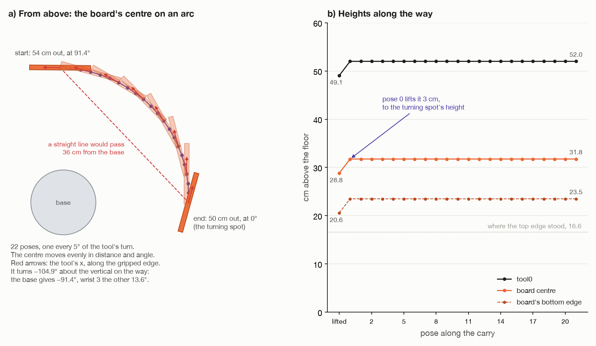

# Step 5: carry it round, hanging

[← step 4](04-lift-out.md) · [index](README.md) · next: [step 6 →](06-line-up-with-wrist-1.md)

## What happens

After the lift, the top hangs in the air **to the arm's left**, where it stood.
The turn happens **in front of the arm**, at the turning spot. So the arm
carries it about 90° round its base, still hanging.

The whole path was worked out in step 2. This step just follows it.

**Joints that move:** mostly the base. Wrist 3 turns a little, about 14°, so
the gripped edge arrives facing the right way. The shoulder, the elbow and
wrist 1 move a little: for the first 3 cm up, and because the top ends 4 cm
closer to the base than it started.



## What comes in

| From | Value | Seed 1 |
| --- | --- | --- |
| step 2 | `route.carry`: 22 poses, then the hanging pose | – |
| step 2 | the carry height for the top's centre | 31.75 cm |
| step 2 | `route.wrist` | which way the wrist is flipped |
| step 3 | the hold `H` | tool 20.2 cm along the top's up |
| step 4 | the arm at `route.lifted`, top hanging | tool0 at (−1.3, 54.0, 49.1) cm |

---

## 5a. Where it starts and ends

| | tool0 | the top's centre | the gripped edge runs along |
| --- | --- | --- | --- |
| **start**: `route.lifted` (step 4) | (−1.3, 54.0, 49.1) cm | (−1.3, 54.0, 28.8) cm | (−1, 0.01, 0), about the room's x |
| **end**: the hanging pose (step 2) | (50.0, 0.0, 52.0) cm | (50.0, 0.0, 31.75) cm | (0.267, 0.964, 0), **wrist 1's axis** |

Three things change on the way:

1. **Where it is**: from the left of the arm to in front of it.
2. **Its height**: the top's centre goes from 28.8 up to 31.75 cm.
3. **Which way its edge runs**: it turns about the vertical, so the edge ends
   up along wrist 1's axis ([step 6](06-line-up-with-wrist-1.md)).

And one thing **must not** change: **it keeps hanging straight down.**

### Why 31.75 cm?

At the turning spot, the gripped edge is 40 cm up, and the top's centre hangs
8.25 cm below it: 40 − 8.25 = 31.75 cm. That is higher than the lifted
height, 28.8 cm. The planner takes the higher of the two
([step 2, check 5](02-plan-before-moving.md#check-5-work-out-the-carry)), so the
top rises 3 cm at the very start and then never goes down towards the holders
again.

---

## 5b. The plan is made for the top, not the tool

The path matters for **the top**: it is what must stay clear of things, and
stay hanging. So `carry_round()` plans a path for **the top's centre**, then
works out where the tool must be for each point on it. That needs `H` both
ways (see [step 3](03-grip-the-edge.md#3f-how-h-is-used-from-here-on)):

```
top  = tool · H⁻¹        to find where the path starts and ends
tool = top  · H          to turn each point of the path back into a tool pose
```

---

## 5c. Distance and angle round the base

`carry_round()` does not describe the top's centre by x and y. It uses
**how far from the base** and **which way round from the base**:

```
r = √(x² + y²)            distance from the base, seen from above
a = atan2(y, x)           angle round from the room's x axis
```

This is called **polar** coordinates. Going back:

```
x = r · cos a
y = r · sin a
```

Seed 1:

| | (x, y) | r | a |
| --- | --- | --- | --- |
| start | (−1.3, 54.0) cm | 54.0 cm | 91.4° |
| end | (50.0, 0.0) cm | 50.0 cm | 0° |

```
turn = a_end − a_start = 0° − 91.4° = −91.4°      clockwise, seen from above
```

The code folds `turn` into −180° to 180°, so the arm always goes the short way
round.

### Why use distance and angle at all?

Because that is how the arm moves. **The base turning changes a**, the angle
round. **The shoulder and elbow folding or stretching change r**, the reach.
Describing the path in r and a describes it in the arm's own terms.

### Why not a straight line?

A straight line from (−1.3, 54.0) to (50.0, 0.0) is shorter. But in the middle
it passes only **36 cm** from the base (the dashed line in the picture). To get
there the arm would have to pull in and fold up, swinging a hanging board
close to its own body, then stretch out again.

Changing r and a **evenly** instead gives an arc. Here r only goes from 54 to
50 cm, so the top stays about half a metre from the base the whole way, and
the base does the carrying.

---

## 5d. The formula, pose by pose

A fraction `f` runs from 0 to 1 in equal steps. At each step:

```
distance from base    r(f) = r_start + (r_end − r_start) · f       54.0 → 50.0 cm
angle round base      a(f) = a_start + turn · f                     91.4° → 0°
height of the centre  z    = 31.75 cm                               the same all the way
the tool's spin       spin · f                                      0° → −104.9°

top's centre = ( r(f) · cos a(f),  r(f) · sin a(f),  31.75 cm )
```

`f = 0` is the start, `f = 1` the end, `f = 0.5` halfway round.

A few of them, seed 1:

| Pose | f | r | a | the top's centre |
| --- | --- | --- | --- | --- |
| 0 | 0.00 | 54.0 cm | 91.4° | (−1.3, 54.0, 31.75) cm |
| 11 | 0.52 | 51.9 cm | 43.5° | (37.6, 35.7, 31.75) cm |
| 21 | 1.00 | 50.0 cm | 0.0° | (50.0, 0.0, 31.75) cm |

### How many poses?

One pose every **5°**, counting **whichever turns more**: the base angle
`turn`, or the tool's `spin` about the vertical (5e):

```
steps = ceil( max(|turn|, |spin|) / 5° )
      = ceil( max(91.4°, 104.9°) / 5° )
      = ceil( 20.98 )
      = 21 steps   →   22 poses (f = 0, 1/21, 2/21, …, 1)
```

Then the hanging pose is added once more at the end. It is the same pose as
the last one, there to make sure the carry finishes exactly on it.

**Why 5°?** The arm moves between poses in straight lines. With poses 5°
apart, those straight bits stay very close to the arc. For the top's centre,
50 cm out, 5° is about 4.4 cm of travel.

---

## 5e. The spin: base and wrist 3

### How far the tool has to turn

The gripped edge has to face a different way at the end:

- **start:** tool x along (−1.00, 0.01, 0), the way the top stood
- **end:** tool x along (0.267, 0.964, 0), wrist 1's axis

`carry_round()` measures that as a single turn about the vertical:

```
relative = R_end · R_startᵀ                          the turn that takes the start to the end
spin     = atan2(relative[1, 0], relative[0, 0])     that turn's angle about z
         = −104.9°
```

`R_startᵀ` undoes the start orientation. `R_end` then applies the end one.
What is left is the turn between them. A turn about z looks like

```
[ cos θ   −sin θ   0 ]
[ sin θ    cos θ   0 ]
[ 0        0       1 ]
```

so row 1, column 0 is sin θ, and row 0, column 0 is cos θ. `atan2` of the two
gives θ.

At pose k the tool's orientation is

```
rotation_z(spin · f) · R_start
```

meaning the start orientation, turned by the fraction f of the spin **about
the vertical only**.

### Why it keeps the top hanging

Turning something about a vertical line cannot tip it. A board hanging
straight down stays hanging straight down, the way a sign on a string stays
hanging when you twist the string. The top's "up" axis stays (0, 0, 1) at
every one of the 22 poses.

### Who does the turning: base or wrist 3?

Two joints can turn the tool about the vertical:

- **The base.** Turning it swings the whole arm round, **and the tool turns
  with it**.
- **Wrist 3.** It spins the gripper on its own.

The base turns about 91° anyway, to carry the top round. So wrist 3 only has
to make up **the difference**. `wrist_spin()` estimates it:

```
wrist 3 ≈ spin − (change in the tool's angle round the base)
        = −104.9° − (−91.4°)
        ≈ −13.6°
```

It is an estimate. The base's real change also depends on the arm's sideways
offset, which differs a little between 54 and 50 cm out.

Step 2 used this to choose between the two hanging poses. At the turning spot
the tool's x can point along +axis or −axis. Half a turn of wrist 3 separates
them:

| Grip A, hanging with tool x along | spin | wrist 3 about |
| --- | --- | --- |
| **+axis (0.267, 0.964, 0)** | **−104.9°** | **13.6°** ✓ |
| −axis (−0.267, −0.964, 0) | +75.1° | 166.4° |

The first is tried first. For grip B it is the other way round, and wrist 3
again turns about 13.6°.

### Making each tool pose

For each point on the arc, `carried_tool_pose()` turns "the top's centre is
here, and the tool faces this way" into a tool pose:

```python
tool_rotation  = rotation_z(spin * f) @ start_rotation    # 1. the tool, spun by spin·f
board_rotation = tool_rotation @ H_rotationᵀ              # 2. so the top faces this way
tool_pose      = frame(centre, board_rotation) @ H        # 3. top's pose, then · H
```

1. Choose the tool's direction.
2. Work out the top's direction from it. `T = P · H` for rotations alone is
   `R_tool = R_top · R_H`, so `R_top = R_tool · R_Hᵀ`.
3. Build the top's pose (this centre, facing that way), and multiply by `H` to
   get the tool pose. That is `tool = top · H` again.

---

## 5f. The move

In `_pick_up()`:

```python
try:
    self._arm.move_linear(route.carry, speed=CARRY_SPEED)
except MotionFailed as failure:
    self._log.info(f"{failure}; letting the planner carry it instead")
    self._arm.move_to(route.carry[-1], speed=CARRY_SPEED, any_shape=False)
```

- **Straight lines from pose to pose**, at a tenth of full speed. MoveIt fills
  in a point every 5 mm.
- **Every bit of it is collision-checked**, the top included: it was attached
  in step 3. At least 99% of the path must come out, or the whole line is
  refused.
- **If that fails**, MoveIt's planner is asked for its own path to the last
  pose. It is still slow, and `any_shape=False` means the arm must keep its
  shape. The wrist cannot flip, and the planner cannot take a path that swings
  the whole arm over. If that fails too, the arm stops: *"no plan found to
  [...]"*.

Then:

```python
if not self._arm.in_contact:
    raise TaskFailed("the top slipped out of the fingers as it was carried round")
```

---

## What goes out

| Value | Seed 1 | Used in |
| --- | --- | --- |
| the arm at the hanging pose | tool0 at (50.0, 0.0, 52.0) cm, pointing down | step 7 |
| the gripped edge | at (50, 0, 40) cm, along wrist 1's axis | step 7 |
| the top, still held, hanging | its centre 31.75 cm up, its lower edge 23.5 cm | step 7 |

## Fixed and measured numbers in this step

| Number | Value | Kind | Where |
| --- | --- | --- | --- |
| carry step | 5° | choice | `assembly/grasps.py`, `carry_round()` |
| `CARRY_SPEED` | 0.1 | choice | `task.py` |
| straight-line point spacing | 5 mm | choice | `arm/motion.py`, `move_linear()` |
| least of a line that must come out | 99% | choice | `arm/motion.py`, `move_linear()` |
| start and end of the arc, heights | 54 → 50 cm, 91.4° → 0°, 31.75 cm | **worked out** from steps 1 and 2 | |
| spin, wrist 3 | −104.9°, about 13.6° | **worked out** | |

## What can go wrong

| Message | Why |
| --- | --- |
| `straight-line move to [...] only solved ...%; letting the planner carry it instead` | a log line only, before the planner is tried |
| `no plan found to [...]: ...` | the planner found no way there either |
| `the arm stopped ... mm and ... degrees away from [...]` | it did not really arrive |
| `the top slipped out of the fingers as it was carried round` | the fingertips no longer feel it |

## Where it is in the code

| What | Where |
| --- | --- |
| the carry poses | `assembly/grasps.py`: `carry_round()`, `carried_tool_pose()` |
| wrist 3's share | `assembly/grasps.py`: `wrist_spin()` |
| the carry height | `task.py`: `_plan_route()` |
| the move and the check | `task.py`: `_pick_up()` |

[← step 4](04-lift-out.md) · [index](README.md) · next: [step 6 →](06-line-up-with-wrist-1.md)
