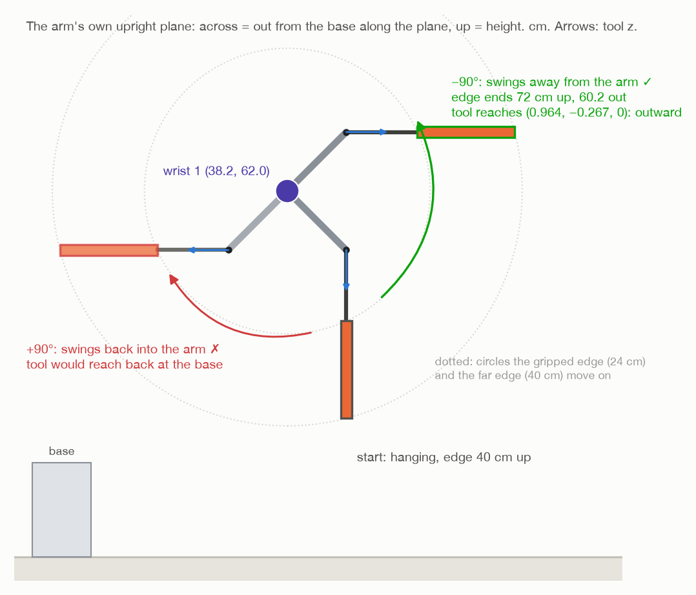

# Step 7: turn it flat, with wrist 1 alone

[← step 6](06-line-up-with-wrist-1.md) · [index](README.md) · next: [what each joint feels →](07-what-each-joint-does.md)

## What happens

Wrist 1 turns **90°**. The other five joints do not move at all. The top swings
up about wrist 1's axis and ends lying flat, 72 cm up.

The code does not ask MoveIt to plan this move. It builds the path itself,
joint angle by joint angle, so it is certain that only wrist 1 moves.

**Joints that move:** wrist 1 only.


## What comes in

| From | Value | Seed 1 |
| --- | --- | --- |
| step 5 | the arm at the hanging pose | joints (−15.5, −91.2, 86.5, −85.3, −90.0, 0.0)° |
| step 6 | the gripped edge along wrist 1's axis | axis (0.267, 0.964, 0) |
| step 2 | the turn was already checked from the planned pose | −90°, clear |

---

## 7a. Which way: +90° or −90°?



A quarter turn about wrist 1's axis can go either way. One way the top swings
**out**, away from the arm. The other way it swings **back**, into the arm's
lap, with the tool pointing back at its own base. Only the first is any good.

`flat_turn()` in `assembly/grasps.py` tries both and keeps the one that points
the tool more **outward**:

```
outward = tool0's position − base, with z set to 0     level, away from the base
down    = the tool's z axis now                         the way the tool reaches

for a in (+90°, −90°):
    reach after = R(axis, a) · down                      where the tool would reach after turning
    score       = reach after · outward                  the dot product

keep the a with the bigger score
```

The dot product is large when two directions agree
([words and maths, section 3](00-words-and-maths.md#dot-product-how-much-two-directions-agree)).
So this picks the turn that leaves the tool reaching **away** from the base.

### Seed 1, by hand

Now the tool reaches straight down, `down = (0, 0, −1)`. The tool is at
(0.50, 0, 0.52), so `outward = (0.50, 0, 0)`.

A quarter turn about a level axis k takes a direction square to k to `±k × d`
(Rodrigues' formula with sin 90° = 1, cos 90° = 0, and k · d = 0):

```
+90°:  k × down = (0.267, 0.964, 0) × (0, 0, −1)
                = (0.964 · (−1) − 0 · 0,   0 · 0 − 0.267 · (−1),   0.267 · 0 − 0.964 · 0)
                = (−0.964, 0.267, 0)
       score    = (−0.964)(0.50) + 0 + 0  =  −0.48      reaches back at the base ✗

−90°:  −(k × down) = (0.964, −0.267, 0)
       score       = (0.964)(0.50)       =  +0.48      reaches away ✓
```

**Wrist 1 turns −90°**, from −85.3° to −175.3°.

### Worked out again, just before turning

`_turn_by_wrist()` in `task.py` does not reuse step 2's answer. It asks where
the arm **really** is now, finds wrist 1's axis again from those joint angles,
and picks the direction again:

```python
axis  = self._arm.joint_axis(self._arm.joints(), WRIST_1)
angle = flat_turn(self._arm.tool_pose(), axis, BASE_POSITION)
self._arm.turn_joint(WRIST_1, angle, speed=CARRY_SPEED)
```

If the carry ended a few millimetres off the planned pose, that makes no
difference to the direction.

The log says:

```
turning wrist 1 by -90 degrees, every other joint still
```

---

## 7b. Is it safe? Checked again, from where the arm is now

`turn_joint()` first runs `joint_turn_blocked()` in `arm/motion.py`, the same
check as step 2, but from the real joint angles.

### End stop

Wrist 1 can turn at most one full turn either way.

```
end = start + angle = −85.3° + (−90°) = −175.3°
|end| ≤ 360° ?   yes
```

If not: *"wrist_1_joint would go past its end stop, to … degrees"*.

### Collisions, every 2°

```
count = ceil( |angle| / 2° ) = ceil(90 / 2) = 45

for k = 0, 1, …, 45:
    joints = start, with wrist 1 moved by angle · k / 45
    does the arm, the gripper or the top hit anything MoveIt knows?
```

That is **46 poses**, 0° to 90° in 2° steps. The top is included because it
was attached in step 3. A hit: *"turning wrist_1_joint hits something …
degrees in"*.

**Why every 2° is enough.** Only one joint moves, so the path between two
checked poses is known exactly. It is a small arc about wrist 1, not a guess.
The point furthest from wrist 1 is the top's far edge, 40 cm away. There, 2°
is 40 × 2 × π / 180 = **1.4 cm** of travel between checks.

---

## 7c. The motion: half a cosine wave


`_one_joint_trajectory()` in `arm/motion.py` builds the turn. For a turn of
Θ = 90° = 1.571 rad lasting T seconds, at time t:

```
angle          θ(t) = Θ · (1 − cos(π t / T)) / 2
speed          ω(t) = Θ · π / (2T) · sin(π t / T)
acceleration   α(t) = Θ · π² / (2T²) · cos(π t / T)
```

### What that shape means

`(1 − cos(π t / T)) / 2` goes smoothly from 0 at t = 0 to 1 at t = T:

| t | π t / T | cos | (1 − cos) / 2 | wrist 1 has turned |
| --- | --- | --- | --- | --- |
| 0 | 0 | 1 | 0 | 0° |
| T/4 | 45° | 0.71 | 0.15 | 13° |
| T/2 | 90° | 0 | 0.5 | 45° |
| 3T/4 | 135° | −0.71 | 0.85 | 77° |
| T | 180° | −1 | 1 | 90° |

- It **starts at rest and ends at rest**: the speed, a sine, is 0 at both ends.
- The **speed never jumps**. It rises smoothly to a top speed halfway through,
  then falls smoothly back.
- The **largest acceleration** is at the very start and end, where cos is ±1.

Speed is how fast the angle changes, and acceleration is how fast the speed
changes. Each formula is the one above it, differentiated.

### How long it takes

The arm's limits are 3.14 rad/s and 4.0 rad/s² (`JOINT_SPEED_LIMIT`,
`JOINT_ACCELERATION_LIMIT`, the same as `config/joint_limits.yaml`). With the
top in hand they are scaled by `CARRY_SPEED = 0.1`:

```
speed limit         0.314 rad/s    (18 °/s)
acceleration limit  0.4   rad/s²   (22.9 °/s²)
```

The top speed is Θπ/(2T), and the largest acceleration is Θπ²/(2T²). Each
must stay under its limit, and each gives a shortest time:

```
speed:         Θ·π/(2T)   ≤ 0.314   →   T ≥ π × 1.571 / (2 × 0.314)      = 7.86 s
acceleration:  Θ·π²/(2T²) ≤ 0.4     →   T ≥ √(π² × 1.571 / (2 × 0.4))    = 4.40 s
```

The turn takes the **longer**: **T = 7.86 s**. The speed limit is what sets
it. The largest acceleration is then 1.571 × π² / (2 × 7.86²) = 0.126 rad/s²
(7.2 °/s²), a third of its limit.

Gazebo reported 7.7 s. The report counts from the first joint reading that
moved to the last, and at the two ends of a cosine the joint barely moves.

### What is sent to the arm

A list of points, one every **0.02 s** (`TRAJECTORY_STEP`):

```
t = 0.02, 0.04, …, 7.84, and then 7.86          → 393 points
```

Each point gives all six joint angles and all six speeds:

- wrist 1: θ(t) added to where it started, and ω(t);
- the other five: **exactly where they already are, and speed 0**.

It goes straight to the arm's controller (the `FollowJointTrajectory` action),
the same message MoveIt itself sends at the end of every move. The controller
runs at 200 Hz and fills in between the points.

### Did it arrive?

```python
end = start.copy()
end[WRIST_1] += angle
self._check_arrival(self.forward(end))
```

Forward kinematics gives where tool0 should be with wrist 1 at −175.3°. The
real tool must be within **5 mm** and **1.7°** of that. If not: *"the arm
stopped … mm and … degrees away from [...]"*.

---

## 7d. Where the top ends up

A turn about a line through point c moves any point p to

```
p' = c + R · (p − c)
```

([words and maths, section 5](00-words-and-maths.md#turning-a-pose-about-a-line)).
For the wrist turn, c is on wrist 1's axis. It is easiest to see in the arm's
own plane, measuring "out" along the plane and "up". Seed 1, in cm:

```
wrist 1 is at                                   (38.2 out, 62.0 up)
the gripped edge starts at, from wrist 1:       (+10.0, −22.0)
a quarter turn away from the arm maps (out, up) → (−up, out):
the gripped edge ends at, from wrist 1:         (+22.0, +10.0)
so the edge ends at                             (60.2 out, 72.0 up)
```

Check the map on the top's hanging direction, straight down (0, −1). It
becomes (1, 0), pointing out, away from the arm. ✓

| | Before | After |
| --- | --- | --- |
| the gripped edge | 40 cm up | **72 cm up**, 12 cm further out |
| the top | hanging straight down | **lying flat**, sticking out away from the arm |
| wrist 1 | −85.3° | −175.3° |
| every other joint | – | unchanged |

Gazebo measured the top 72 cm up.

The top turns about **wrist 1**, not about its own edge. So the gripped edge
moves on a circle of √(10² + 22²) = **24 cm** radius, and the far edge,
16.5 cm further out, on one of √(10² + 38.5²) = **40 cm**. That is why the
turning spot needs 40 cm of clear space (step 2).

(The whole-arm turn, `make whole-arm`, moves several joints so the gripped
edge stays put and the top turns about the edge itself. See
[`../turn-by-whole-arm/`](../turn-by-whole-arm/README.md).)

---

## 7e. What the joints feel

Only wrist 1 moves, but every joint works to hold the arm and the top up.
Worked out, and matched in Gazebo:

| Joint | Moves | Peak during the turn | Holding flat | Limit |
| --- | --- | --- | --- | --- |
| base | 0° | 0.33 N·m | 0.00 | 150 |
| shoulder | 0° | 26.8 | 24.9 | 150 |
| elbow | 0° | 27.3 | 25.9 | 150 |
| **wrist 1** | **90°** | **4.07** | **2.71** | **28** |
| wrist 2 | 0° | 0.04 | 0.00 | 28 |
| wrist 3 | 0° | 0.04 | 0.04 | 28 |

Wrist 1 works hardest about **42° into the turn**, not at the end:

```
τ(θ) = 3.05 · cos θ + 2.71 · sin θ   N·m       largest at tan θ = 2.71 / 3.05, θ = 41.6°
                                              √(3.05² + 2.71²) = 4.08 N·m
```

At a tenth of full speed, the moving adds only about 0.01 N·m. Almost all of
the effort is holding weight up. The full working, part by part, is in
[the next page](07-what-each-joint-does.md).

### The grip is what fails first

As the top turns, its weight stops pulling along the fingers and starts
twisting it in them:

```
pull along the fingers = m · g · cos θ        friction holds it
twist about the pads   = m · g · d · sin θ    the two rows of pads resist it
```

d = 5.55 cm, from the middle of the two pad rows to the top's centre. For
seed 1, flat: 0.306 × 9.81 × 0.0555 = **0.17 N·m** of twist. That is fine.
A top made about 7 times heavier (`DENSITY=3000`, 2.3 kg) twists out of the
fingers about 82° into the turn, while every joint is still far below its
limit ([heavier tops](07-what-each-joint-does.md#heavier-tops)).

---

## What goes out

| Value | Seed 1 | Used in |
| --- | --- | --- |
| the arm with wrist 1 at −175.3°, the rest unchanged | – | step 8 |
| every joint reading during the turn (angles, efforts, touching) | about 7.9 s of them | step 8 |

## Fixed and measured numbers in this step

| Number | Value | Kind | Where |
| --- | --- | --- | --- |
| the turn | 90°, away from the arm | choice | `assembly/grasps.py`, `flat_turn()` |
| end stop | ±360° | robot fact | `arm/motion.py` |
| `JOINT_CHECK_STEP` | 2° | choice | `arm/motion.py` |
| `JOINT_SPEED_LIMIT`, `JOINT_ACCELERATION_LIMIT` | 3.14 rad/s, 4.0 rad/s² | robot fact | `arm/motion.py` |
| `CARRY_SPEED` | 0.1 | choice | `task.py` |
| `TRAJECTORY_STEP` | 0.02 s | choice | `arm/motion.py` |
| `ARRIVAL_TOLERANCE`, `ARRIVAL_ANGLE` | 5 mm, 0.03 rad | choice | `arm/motion.py` |
| axis, direction, duration | (0.267, 0.964, 0), −90°, 7.86 s | **worked out** | |

## What can go wrong

| Message | Why |
| --- | --- |
| `wrist_1_joint would go past its end stop, to ... degrees` | the turn would end past ±360° |
| `turning wrist_1_joint hits something ... degrees in` | a collision in the 2° check |
| `the controller did not finish the joint turn` | the controller refused or aborted |
| `the arm stopped ... mm and ... degrees away from [...]` | it did not really arrive |
| `the fingertips lost the top ... degrees from hanging straight down` | the top slipped during the turn (step 8 reports it) |

## Where it is in the code

| What | Where |
| --- | --- |
| the turn, from where the arm really is | `task.py`: `_turn_by_wrist()` |
| which way | `assembly/grasps.py`: `flat_turn()` |
| end stop and collision check | `arm/motion.py`: `joint_turn_blocked()` |
| building and sending the turn | `arm/motion.py`: `turn_joint()`, `_one_joint_trajectory()`, `_send()` |
| arrival | `arm/motion.py`: `_check_arrival()` |
| the numbers and pictures of the arm to scale | [`../figures/two_turns.py`](../figures/two_turns.py) |

[← step 6](06-line-up-with-wrist-1.md) · [index](README.md) · next: [what each joint feels →](07-what-each-joint-does.md)
