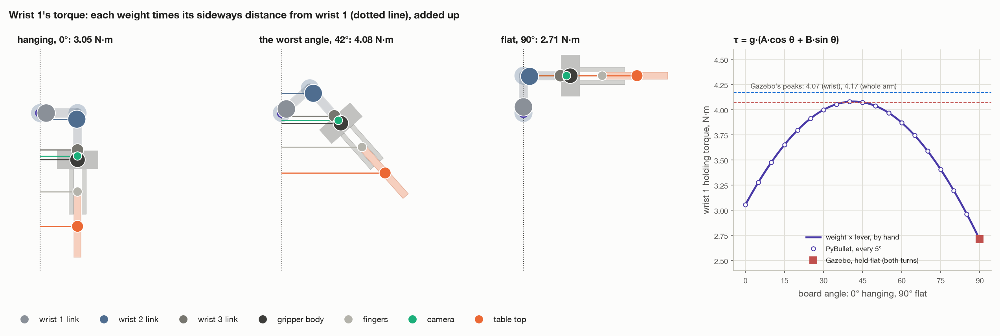

# Step 7, continued: what each joint feels in the wrist turn

[← step 7](07-turn-flat.md) · [index](README.md) · next: [step 8 →](08-hold-and-report.md)

Only wrist 1 moves in the turn, but every joint works: it has to hold up
everything beyond it. This page works out how hard each joint works, by hand,
and checks the answers against Gazebo. It also says what happens with heavier
tops, and whether MoveIt could have been asked to turn one joint.

**Torque** is a twist. A push of 1 newton, 1 metre from a joint's axis,
twists it with 1 N·m. A kilogram weighs 9.81 N.

---

## 1. Two kinds of torque

A joint's torque has two parts:

- **Holding**: what it takes to stop things falling. Add up, over everything
  the joint holds up, each mass's weight times its lever:

  ```
  holding torque = Σ  mass × 9.81 × lever
  lever = the level distance from the joint's axis to the mass's centre
  ```

  Only **where** things are counts, not how they got there.
- **Moving**: what it takes to speed things up and slow them down. At a tenth
  of full speed it is tiny (section 4).

"Level distance" matters. Weight pulls straight down, so only how far a mass
sits **sideways** from the axis makes a lever. A mass straight above or below
the axis twists it not at all.

---

## 2. Wrist 1, by hand



Wrist 1 holds up everything beyond it. Levers are measured sideways from wrist
1's axis, in the arm's plane:

| Part | Mass, kg | Lever hanging, cm | Torque hanging, N·m | Lever flat, cm | Torque flat, N·m |
| --- | --- | --- | --- | --- | --- |
| wrist 1's own link | 1.370 | 1.6 | 0.22 | 0.0 | 0.00 |
| wrist 2's link | 1.300 | 9.8 | 1.25 | 1.6 | 0.21 |
| wrist 3's link | 0.365 | 10.0 | 0.36 | 9.8 | 0.35 |
| gripper body | 0.800 | 10.0 | 0.78 | 12.5 | 0.98 |
| fingers | 0.100 | 10.0 | 0.10 | 21.0 | 0.21 |
| camera | 0.050 | 10.0 | 0.05 | 11.5 | 0.06 |
| table top | 0.306 | 10.0 | 0.30 | 30.2 | 0.91 |
| **all of it** | 4.29 | | **3.05** | | **2.71** |

(The columns add to 3.06 and 2.72 because each row is rounded.)

One row worked through: the gripper body, 0.800 kg, 10 cm to the side while
hanging:

```
0.800 × 9.81 × 0.100 = 0.78 N·m
```

**Hanging**, nearly every part has the same 10 cm lever. That is the offset
between wrist 1 and wrist 2: the whole wrist and gripper hang 10 cm out from
wrist 1's axis. **Flat**, each part's lever is how far it now sticks out, and
the top's is the longest, 30 cm.

### In between

Every part turns about wrist 1 by the same angle θ. A point that is `h` to the
side while hanging and `f` to the side when flat is, at angle θ,

```
lever(θ) = h · cos θ + f · sin θ
```

At θ = 0 this gives h. At θ = 90° it gives f. It is a turn by θ, written out
for the one coordinate that makes a lever.

Every lever has that form, so the sum does too:

```
τ(θ) = 3.05 · cos θ + 2.71 · sin θ        N·m
```

### Where it is largest

A sum like a·cos θ + b·sin θ is largest when tan θ = b/a, and then equals
√(a² + b²):

```
worst angle   θ = arctan(2.71 / 3.05) = 41.6°
worst torque  τ = √(3.05² + 2.71²)   = 4.08 N·m
```

So **wrist 1 works hardest about 42° into the turn, not at the end.** Gazebo's
peak was 4.07 N·m (4.54 in another run; peaks bounce a little), and its
holding torque flat was 2.71. Wrist 1's limit is 28 N·m, so it uses 15%.

Most of that is the wrist and gripper themselves. The top adds 0.30 N·m
hanging and 0.91 flat.

---

## 3. The other joints

### The shoulder and the elbow

They do not move, but they work hardest of all. Each holds up everything
beyond it, the forearm and the wrist included. Worked out on the robot model:

| | Hanging | Worst | Flat | Gazebo, flat | Limit |
| --- | --- | --- | --- | --- | --- |
| shoulder | 25.3 | 26.3 | 25.0 | 24.93 | 150 |
| elbow | 26.3 | 27.3 | 25.9 | 25.88 | 150 |

N·m. Under a fifth of their limits. They change only a little, because only
the wrist end moves.

### The base, wrist 2 and wrist 3

Almost nothing:

- **The base** turns about the vertical. Weight pulls straight down, so it
  cannot twist the base at all.
- **Wrists 2 and 3.** Their only load is the 50 g camera, 8.5 cm to one side
  of the tool: 0.05 × 9.81 × 0.085 = 0.04 N·m. Hanging, that twists wrist 2;
  flat, wrist 3. Gazebo reported exactly 0.04 on each.

---

## 4. The moving part

Speeding things up takes (moment of inertia) × (angular acceleration). The
moment of inertia says how hard something is to spin: mass, weighted by the
square of how far it is from the axis. About wrist 1, everything beyond it adds
up to roughly 0.08 kg·m². The largest acceleration in the turn is 0.126 rad/s²
([step 7c](07-turn-flat.md#how-long-it-takes)):

```
0.08 × 0.126 ≈ 0.01 N·m
```

The model gives the same: at most 0.01 N·m on wrist 1 and 0.04 on the
shoulder, under 1% of their holding torque. Even at the arm's full speed, a
1.4 s turn, it would be 0.33 N·m on wrist 1 and 1.3 on the shoulder.

---

## 5. The load on the grip

The top pulls on the fingers in two ways:

```
pull along the fingers = m · g · cos θ        friction has to hold it
twist about the pads   = m · g · d · sin θ    the two rows of pads have to resist it
```

d is 5.55 cm: from the middle of the two pad rows (14.7 cm from tool0) to the
top's centre (12 + 8.25 = 20.25 cm). For seed 1's top:

- **hanging:** a pull of 0.306 × 9.81 = 3.0 N along the fingers, and no twist.
  Friction can hold up to 2 fingers × 1.2 × 25 N = 60 N.
- **flat:** no pull along the fingers, and a twist of
  0.306 × 9.81 × 0.0555 = 0.17 N·m.

The motion adds almost nothing. The top's centre swings round wrist 1 on a
32 cm circle, at up to 0.10 m/s, with accelerations of at most 0.04 m/s². That
is 0.4% of gravity's 9.81.

---

## 6. Results

From the task's own report, seed 1, 400 kg/m³ (0.31 kg):

| Joint | Moved | Peak, Gazebo | Holding flat, Gazebo | Holding flat, worked out |
| --- | --- | --- | --- | --- |
| base | 0.0° | 0.33 | 0.00 | 0.00 |
| shoulder | 0.0° | 26.77 | 24.93 | 24.95 |
| elbow | 0.0° | 27.25 | 25.88 | 25.90 |
| wrist 1 | **90.0°** | **4.07** | **2.71** | **2.71** |
| wrist 2 | 0.0° | 0.04 | 0.00 | 0.00 |
| wrist 3 | 0.0° | 0.04 | 0.04 | 0.04 |

Efforts in N·m. The turn took 7.7 s.

- **Only wrist 1 moved.** Every other joint moved 0.0°.
- **The top ended flat and still held**, 72 cm up, level to within 0.005° by
  Gazebo, 0.1° by the arm's own reckoning. Seed 7, a narrower top, came out
  the same.
- **The calculation matches the simulator** to 0.02 N·m on every holding
  torque. The peaks in Gazebo are a few tenths higher: its position controller
  jitters a little, and that shows up in a peak but averages out of a holding
  value. The 0.33 on the base is the same jitter.

### Heavier tops

`DENSITY` makes the top heavier without making it bigger. The robot is not
told.

| `DENSITY` | Mass | What happened in the wrist turn |
| --- | --- | --- |
| 400 | 0.31 kg | flat and held |
| 2000 | 1.53 kg | flat and held, drooping 1° in the fingers |
| 3000 | 2.29 kg | the fingertips lost it 82° into the turn; it twisted down in the fingers and hung 45° off flat |
| 4000 | 3.06 kg | lost 87° in, fell to the floor |
| 5000 | 3.82 kg | lost 48° in, fell to the floor |

Every one of them was lifted and carried hanging without trouble. Only the
turn failed, and always at the grip: the twist m·g·d·sin θ grew too big for the
pads. The joints were never near their limits. At 3000, wrist 1 peaked at
10.5 N·m (of 28), and the shoulder and elbow at 47 and 44 N·m (of 150).

---

## 7. Could MoveIt have turned just one joint?

Yes, in several ways. The code uses none of them, but they are worth knowing.

1. **A joint goal, planned by OMPL.** Give MoveIt a goal that is today's joint
   angles with wrist 1 changed by −90°. This is how `move_to()` asks for its
   free moves. The catch: OMPL, the planner set up here, searches by trying
   random joint angles and joining them up, then smooths the path. The answer
   is usually close to "only wrist 1", but nothing makes it so, and on the way
   the other joints may drift and come back. With a top held by friction, that
   is what the code avoids.
2. **A planning group of one joint.** Add a group to the SRDF with only
   `wrist_1_joint` in it, and plan for that group. The planner can then only
   move wrist 1; the other joints are frozen but still checked for collisions.
   The catch is on the controller's side: the plan names one joint, and the
   arm's `JointTrajectoryController` rejects a goal for only some of its joints
   unless it is told `allow_partial_joints_goal: true`.
3. **Pilz's PTP planner.** Pilz is a MoveIt planner that moves every joint in a
   straight line from its start angle to its goal angle, all arriving together.
   A goal that differs only in wrist 1 moves only wrist 1, with a trapezoid
   speed profile. It is installed in this environment
   (`pilz_industrial_motion_planner`), but `config/moveit_cpp.yaml` only
   switches on OMPL.
4. **Path constraints.** Tell OMPL each other joint must stay within a hair of
   where it is (a `JointConstraint` per joint). It works, but planning with
   constraints that tight is slow and can fail to find anything.
5. **MoveIt Servo.** It moves joints live, from a stream of joint speed
   commands (`JointJog`). It is for steering an arm by hand, not for a timed,
   checked move like this one.

What the code does instead is small. It builds the path itself, one joint at a
time. It uses MoveIt's model of the robot to check it for collisions every 2°.
And it sends it to the same controller MoveIt would. The path is exact, the
speed profile is chosen here, and no config has to change. If the project later
wants MoveIt to do it, option 3 (Pilz PTP) is the closest match.

---

## Where it is in the code

| What | Where |
| --- | --- |
| the numbers and pictures on this page | [`../figures/two_turns.py`](../figures/two_turns.py) |
| the report in a real run | `task.py`: `_joint_reports()`; `main.py`: `_report()` |
| every run's numbers | [`../../turn-results.md`](../turn-results.md) |

[← step 7](07-turn-flat.md) · [index](README.md) · next: [step 8 →](08-hold-and-report.md)
