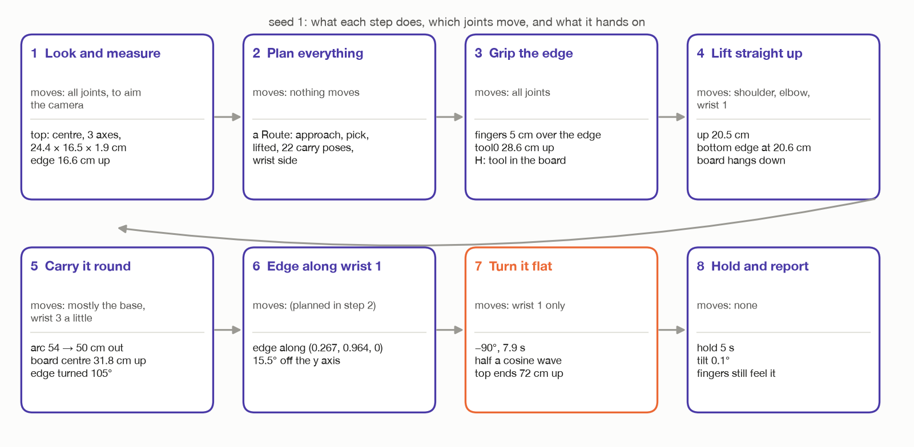

# Turning the top flat with wrist 1: step by step

`make wrist`

These docs walk through the wrist turn one step at a time, one file per
step. They are written for someone who has never worked with a robot arm and
knows only a little maths. Every step says:

- **what happens**, and why it is done that way;
- **what comes in**: the numbers it gets from earlier steps;
- **the maths**, in plain words, with seed 1's real numbers put in;
- **which numbers are fixed** (written in the code) and **which are measured
  or worked out** on every run;
- **what goes out**: the numbers later steps use;
- **what can go wrong**, and the message the arm stops with;
- **where it is in the code**.

The other way of turning the top, with the whole arm, has the same kind of
docs in [`../turn-by-whole-arm/`](../turn-by-whole-arm/README.md).
[`../../wrist-or-whole-arm.md`](../wrist-or-whole-arm.md) puts the two side
by side.

## Read in this order

| File | What it covers |
| --- | --- |
| [`00-words-and-maths.md`](00-words-and-maths.md) | The room's axes, the arm's joints, vectors, rotations and 4 × 4 poses. Read this first if matrices are new. |
| [`01-look-and-measure.md`](01-look-and-measure.md) | Step 1. The camera finds the top and measures it. |
| [`02-plan-before-moving.md`](02-plan-before-moving.md) | Step 2. Every pose is worked out and checked before the arm moves. |
| [`03-grip-the-edge.md`](03-grip-the-edge.md) | Step 3. Open, go above the edge, come down, close. The hold `H`. |
| [`04-lift-out.md`](04-lift-out.md) | Step 4. Straight up, out of the holders. |
| [`05-carry-round.md`](05-carry-round.md) | Step 5. Round the base to the turning spot, hanging. |
| [`06-line-up-with-wrist-1.md`](06-line-up-with-wrist-1.md) | Step 6. Why the gripped edge must run along wrist 1's axis, and how that axis is found. |
| [`07-turn-flat.md`](07-turn-flat.md) | Step 7. Wrist 1 turns 90°, and nothing else moves. |
| [`07-what-each-joint-does.md`](07-what-each-joint-does.md) | Step 7, continued. The torque on each joint worked out by hand, the load on the grip, heavier tops, and whether MoveIt could have turned one joint. |
| [`08-hold-and-report.md`](08-hold-and-report.md) | Step 8. Hold it flat 5 s, check, report. |

## The whole run on one page

The arm stands at the middle of the room. The table top stands upright
between two holders, about 54 cm to the arm's **left**. The arm has to lift it
out, carry it round to a spot 50 cm **in front** of itself, and turn it flat
there using wrist 1 alone.

## The one rule

**The robot is told nothing about the room.** It knows only two kinds of
thing:

1. **Facts about itself**: where its base is, how long its links are, how its
   gripper and camera are built. These live in `arm/dimensions.py` and the
   robot's model.
2. **Its own choices about how to do the job**: where to turn the top, how far
   to lift it, how slowly to move. These live next to the code that uses them,
   with the reason written beside them.

Everything else it **measures**: where the floor is, how big the top is,
where it stands, which way it faces. The holders it never even sees.

So every number in these docs is one of three kinds, and each step's table
says which:

| Kind | Example | Changes from run to run? |
| --- | --- | --- |
| **Robot fact** | fingertips are 17 cm from tool0 | no |
| **Choice** | turn the top 50 cm in front, 40 cm up | no |
| **Measured or worked out** | the top's upper edge is 16.6 cm up | yes |

## How the numbers flow from step to step

This is the thread through the whole run. Each value is made in one step and
used in later ones.

| Value | Seed 1 | Made in | Used in |
| --- | --- | --- | --- |
| floor height | 0.0 cm | 1 | 2 (turning height), MoveIt's picture of the room |
| the top's box: centre, 3 axes, size | centre (−1.3, 54.0, 8.3) cm, 24.4 × 16.5 × 1.9 cm | 1 | 2, 3 |
| the middle of the upper edge | (−1.3, 54.0, 16.6) cm | 1 | 2, 3 |
| the direction the edge runs (`along`) | (−1, 0.01, 0) | 1 | 2, 3 |
| things in the room (legs, obstacles) | 4 legs, nearest 62 cm from the spot | 1 | 2 (is the spot clear?), MoveIt |
| wrist 1's axis at the turning spot | (0.267, 0.964, 0) | 2 | 2, 6, 7 |
| which way the wrist is flipped | +1 or −1 | 2 | 3, 4, 5 |
| the pick pose (tool0 when gripping) | 28.6 cm up, above the edge | 2 | 3, 4 |
| the approach pose | 36.6 cm up | 2 | 3 |
| the lifted pose | 49.1 cm up | 2 | 4, 5 |
| the hold `H` (tool in the board) | tool 20.2 cm along the board's "up" | 2 (and 3) | 2, 5, 8, MoveIt |
| the carry poses | 22 poses on an arc | 2 | 5 |
| the hanging pose at the turning spot | tool0 at (50, 0, 52) cm | 2 | 5, 7 |
| which way to turn wrist 1 | −90° | 2, again in 7 | 7 |
| how flat it ended | 0.1° | 8 | the report |

## Every fixed number, in one place

| Name | Value | Kind | File | What it is for |
| --- | --- | --- | --- | --- |
| `BASE_POSITION` | (0, 0, 0) | robot fact | `arm/dimensions.py` | where the arm is bolted down |
| `SELF_RADIUS` | 13 cm | robot fact | `arm/dimensions.py` | points this close to the base are the arm seeing itself |
| `CAMERA_OFFSET` | (8.5, 0, 1.5) cm | robot fact | `arm/dimensions.py` | where the camera sits on the tool |
| `FINGERTIP_OFFSET` | 17 cm | robot fact | `arm/dimensions.py` | tool0 to the fingertips |
| `GRIPPER_MAX_OPENING` | 7.4 cm | robot fact | `arm/dimensions.py` | never open wider (a finger can stick at its end stop) |
| `MAX_GRASP_WIDTH` | 6.5 cm | robot fact | `arm/dimensions.py` | the thickest thing the fingers can close round |
| `SURVEY_*` | 8 views, 30 cm out, 60 cm up, aimed 65 cm out | choice | `arm/dimensions.py` | where the camera looks from first |
| `TOP_MAX_TILT` | 5° | choice | `task.py` | a top leaning more is left alone |
| `TOP_INSERTION` | 5 cm | choice | `assembly/grasps.py` | how far the fingers reach over the edge |
| `EDGE_BELOW_TOOL` | 12 cm | worked out | `assembly/grasps.py` | 17 − 5: tool0 to the gripped edge |
| `TOP_APPROACH` | 8 cm | choice | `task.py` | line up this far above the grip, then come down |
| `GRIP_SQUEEZE` | 4 mm | choice | `task.py` | close this much narrower than the top is thick |
| `LIFT_CLEAR` | 4 cm | choice | `task.py` | the bottom edge ends this far above where the top edge was |
| `CARRY_SPEED` | 0.1 | choice | `task.py` | a tenth of full speed with the top in hand |
| `TURN_SPOT`, `TURN_HEIGHT` | (50, 0) cm, 40 cm up | choice | `task.py` | where the middle of the gripped edge goes for the turn |
| `TURN_CLEARANCE` | 40 cm | choice | `task.py` | nothing may be seen this close to the turning spot |
| carry step | 5° | choice | `assembly/grasps.py` | one carry pose every 5° |
| `JOINT_CHECK_STEP` | 2° | choice | `arm/motion.py` | the turn is checked for collisions this often |
| `JOINT_SPEED_LIMIT`, `JOINT_ACCELERATION_LIMIT` | 3.14 rad/s, 4.0 rad/s² | robot fact | `arm/motion.py` | the arm's limits, scaled by `CARRY_SPEED` |
| `TRAJECTORY_STEP` | 0.02 s | choice | `arm/motion.py` | one point of the turn every 0.02 s |
| `ARRIVAL_TOLERANCE`, `ARRIVAL_ANGLE` | 5 mm, 1.7° | choice | `arm/motion.py` | how close counts as "arrived" |
| `HOLD_FLAT` | 5 s | choice | `task.py` | how long it is held flat before the last check |

## Seed 1

Every number in these docs is for seed 1, the default room (`make wrist`
with no `SEED`). Its top is 24.4 × 16.5 × 1.9 cm and weighs 0.31 kg. Another
seed moves the top, sizes it differently and gives different numbers, but
every step works the same way.

The pictures are drawn by [`figures/draw_steps.py`](figures/draw_steps.py). It
runs the task's own pose code (`assembly/grasps.py`) on seed 1's measured top,
so the poses in the pictures are the ones the robot works with. The arm itself
is sketched, not drawn to scale. The drawings of the arm to scale are in
[`../figures/`](../figures/), made by `two_turns.py`.
