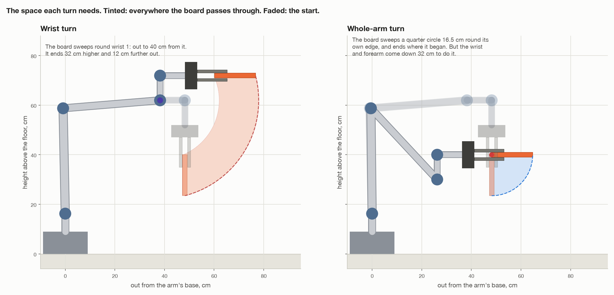
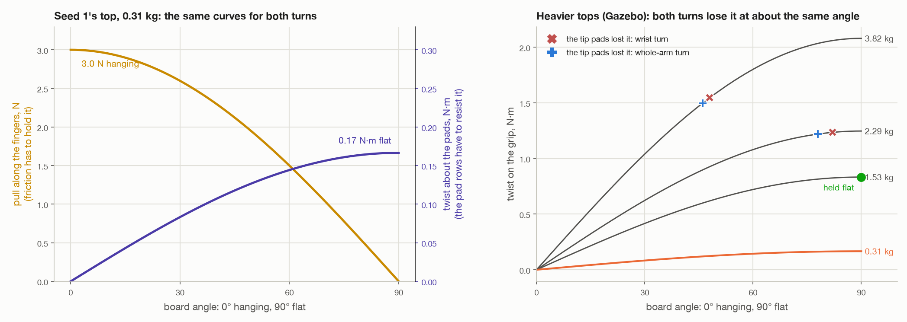

# The wrist turn or the whole-arm turn: what is different

Both turns take the table top from hanging to flat. This file puts them side
by side: the movement, the torque on each joint, the force on the grip, the
space, the time. How each one works, step by step, is in
[`docs/turn-by-wrist/`](turn-by-wrist/README.md) and
[`docs/turn-by-whole-arm/`](turn-by-whole-arm/README.md).

**The short answer.** For the joints and the grip, almost nothing is
different. Wrist 1 carries the same torque in both, angle for angle, and the
grip feels the same pull and twist, so a heavy top falls out at the same point
either way. What *is* different is the movement: which joints turn and how
far, where the top ends up, how much room it needs, how long it takes, and how
certain the path is. And the whole-arm turn is easier on the shoulder and
elbow, because it ends with the arm drawn in.

Numbers are for seed 1, a 0.31 kg top, at a tenth of full speed. *Gazebo*
numbers are from [`turn-results.md`](turn-results.md); *worked out* ones from
[`figures/two_turns.py`](figures/two_turns.py).

---

## At a glance

| | Wrist turn, `make wrist` | Whole-arm turn, `make whole-arm` |
| --- | --- | --- |
| What turns | wrist 1, nothing else | shoulder, elbow and wrist 1 together |
| The top turns about | wrist 1's axis, 24 cm from the edge | its own gripped edge |
| How far each joint turns | wrist 1: 90° | wrist 1: 141.8°, elbow: 51.3°, shoulder: out 16.5° and back |
| Who works out the path | the code, joint angle by joint angle | MoveIt's straight-line service, from 18 poses |
| Can the path stop short? | no | yes; finished with a free move if it got 90% |
| How long (Gazebo) | 7.7 s | 8.6 to 8.7 s |
| Where the gripped edge ends | 72 cm up, 12 cm further out | where it started, 40 cm up |
| Room the top sweeps | a quarter circle of 40 cm radius round wrist 1 | a quarter circle of 16.5 cm radius round its edge |
| Wrist 1: peak / held flat (Gazebo, N·m) | 4.07 / 2.71 | 4.17 / 2.71 |
| Shoulder: peak / held flat | 26.77 / 24.93 | 25.28 / 18.01 |
| Elbow: peak / held flat | 27.25 / 25.88 | 27.21 / 18.54 |
| Base, wrist 2, wrist 3 | 0.3 at most / 0.04 / 0.04 | 0.3 at most / 0.04 / 0.04 |
| Pull along the fingers, hanging | 3.0 N | 3.0 N |
| Twist on the grip, flat | 0.17 N·m | 0.17 N·m |
| A 2.29 kg top lost at | 82° | 78° |
| A 3.82 kg top lost at | 48° | 46° |

---

## 1. Force and torque, in two lines

- A **force** is a push or a pull, in newtons (N). A kilogram weighs 9.81 N.
- A **torque** is a twist, in newton-metres (N·m): a force times its distance
  from the axis it twists about. The same weight twice as far out is twice the
  torque. That distance is called the *lever*.

A joint turns, so what it feels is a torque. The grip feels both: a force
pulling the top along the fingers, and a torque trying to twist it out of
them.

---

## 2. Wrist 1: the same torque in both turns


The natural guess is that turning with one joint is harder on that joint, and
that moving three joints shares the work. It is not so, and the reason is
worth understanding.

**A joint holds up everything beyond it.** The joints of an arm are not a
team sharing one load. They are links in a chain, and each carries the whole
weight hanging past it. Wrist 1 holds up wrist 2, wrist 3, the gripper, the
camera and the top, whatever the shoulder and elbow are doing, because nothing
else is holding them.

**Its holding torque only depends on where those things are, relative to
it.** That is each weight times its level distance from wrist 1's axis. Wrists
2 and 3 do not move in either turn, so those parts are always laid out the
same way relative to wrist 1, tilted by however far the tool has tilted. So
at a given tilt θ the torque is the same, whichever joints produced the tilt:

```
τ_wrist1(θ) = 3.05 · cos θ + 2.71 · sin θ   N·m      (turn-by-wrist/07-what-each-joint-does.md)
3.05 hanging   →   4.08 at 42°   →   2.71 flat
```

In the chart, the two turns' wrist 1 lines lie exactly on top of each other.
Gazebo agrees: held flat, 2.71 N·m in both.

**The only way moving joints could matter** is the moving part of the
torque, and at a tenth of full speed it is a hundredth of a newton-metre
(section 4).

---

## 3. The shoulder and elbow: easier in the whole-arm turn

Here the two turns do differ, because the arm ends in a different shape:

- **Wrist turn.** The arm stays still. Only the wrist end swings, so the
  shoulder and elbow stay near 25 to 27 N·m throughout.
- **Whole-arm turn.** To keep the edge in place, the arm folds: wrist 1 comes
  down 32 cm and in 12 cm. Everything beyond the shoulder and elbow then sits
  on a shorter lever. They end at 18 N·m instead of 25, and mid-turn the
  shoulder drops to 12, when its upper arm leans back and partly balances the
  forearm.



That is not the joints sharing the top. It is the arm's own weight, about
15 kg beyond the shoulder, being brought in closer. The top itself adds only
1.5 to 2 N·m to the shoulder, in either turn.

None of it is anywhere near the limits: 150 N·m for the shoulder and elbow,
28 for wrist 1. The busiest joint, wrist 1, uses 15%.

---

## 4. The moving part: tiny in both

The torque to speed things up and slow them down, worked out on the model:

| Largest moving part, N·m | Wrist turn | Whole-arm turn |
| --- | --- | --- |
| at a tenth of full speed (as run) | wrist 1: 0.01, shoulder: 0.04, elbow: 0.03 | 0.05 or less on every joint |
| at full speed (not run) | wrist 1: 0.33, shoulder: 1.3, elbow: 0.8 | wrist 1: 0.07, shoulder: 2.4, elbow: 0.8 |

At the speed the project runs, it is under 1% of the holding torque in both.

At full speed a difference would show, and it lands on different joints. The
wrist turn flings the gripper and top round wrist 1, so wrist 1 feels it. The
whole-arm turn swings the upper arm and forearm, so the shoulder feels it.
(The whole-arm figure depends on how MoveIt times the path, so take it as a
rough size.)

---

## 5. The grip: the same force in both



The top pulls on the fingers in two ways, and both depend only on its angle θ:

```
pull along the fingers = m · g · cos θ        friction has to hold it
twist about the pads   = m · g · d · sin θ    the two pad rows have to resist it
                                              d = 5.55 cm, pads to the top's centre
```

For seed 1's top: 3.0 N along the fingers when hanging (friction can hold
60 N), and a twist of 0.17 N·m when flat. The motion adds under half a percent
of the weight in either turn. So the grip cannot tell which turn is being
made.

That is why heavier tops fail at the same point both ways. At 2.29 kg the
fingertips lost the top 82° into the wrist turn and 78° into the whole-arm
turn. At 3.82 kg, 48° and 46°. The gap is about the size of the error in
placing the moment of loss. In every case the grip gave out, never a joint:
at 2.29 kg wrist 1 peaked at 10.5 and 12.6 N·m, under half its 28.

So neither turn lets the arm turn a heavier top in the air. Resting it on the
legs before it goes flat does ([`tilt-onto-legs.md`](approaches/tilt-onto-legs.md)).

---

## 6. What really is different

### Which joints move, and how far


The wrist turn moves one joint 90°. The whole-arm turn moves three: the
shoulder, the elbow and wrist 1, which between them must tilt the tool 90°:

```
Δ shoulder + Δ elbow + Δ wrist 1 = −90°
   +0.5    +  51.3   −  141.8    = −90°
```

The elbow folds to bring the wrist in and down, which tilts the forearm the
wrong way, so wrist 1 turns 142° to make up for it. Moving more joints made
the busiest joint *busier*.

The base and wrists 2 and 3 stay still in both, because the edge was lined up
with wrist 1's axis before the turn. That keeps both turns in the arm's own
upright plane.

### Time

Every joint has the same speed limit, 18°/s here, and the joint that turns
furthest sets the pace. That is wrist 1 in both: 90° against 142°. So the
wrist turn is a second quicker, 7.7 s against 8.6 to 8.7 s.

### Room, and where the top ends

- **Wrist turn.** The top turns about wrist 1, which is 24 cm from the edge.
  Its far edge swings round a circle of 40 cm radius, and the top ends 32 cm
  higher and 12 cm further out. That is why the code wants 40 cm of clear
  space round the turning spot.
- **Whole-arm turn.** The top turns about its own edge. It sweeps only a
  quarter circle as big as its own width, 16.5 cm, and ends where it started.
  But the arm folds to do it: wrist 1 drops 32 cm, and the forearm comes down
  with it, so there has to be room below and behind the tool instead.

### How certain the path is

- **Wrist turn.** The path is built by the code, one joint angle at a time,
  and is known exactly before anything moves. It is checked for collisions
  every 2°. It cannot stop short. But it only leaves the top flat if the edge
  runs along wrist 1's axis: every degree off is a degree off flat.
- **Whole-arm turn.** The code gives MoveIt 18 poses and MoveIt finds the
  joint angles. The poses are checked before the grip, but MoveIt's path can
  still come back short. The code finishes a path that got 90% or more with
  one free move, and stops on anything less. It leaves the top flat whichever
  way the edge points, because it turns about the edge itself; lining the edge
  up with wrist 1 only keeps the base and wrists still.

---

## 7. Which to use

For the joints and the grip, it makes no difference. So choose by the
movement:

- **The wrist turn** is the simpler move: one joint, a path known exactly,
  never stopping short, a second quicker. Use it where there is 40 cm of clear
  space round the top, and it does not matter that the top ends higher.
- **The whole-arm turn** keeps the edge where it is and needs the least room
  round the top. Use it where space is tight, or where the edge has to stay
  put. That is the move part 2 needs: tilting the top down onto the legs is
  the same kind of turn, about the edge resting on the legs instead of the
  gripped one ([`tilt-onto-legs.md`](approaches/tilt-onto-legs.md)).

For a heavy top, neither turn helps, and resting it on the legs first does.
