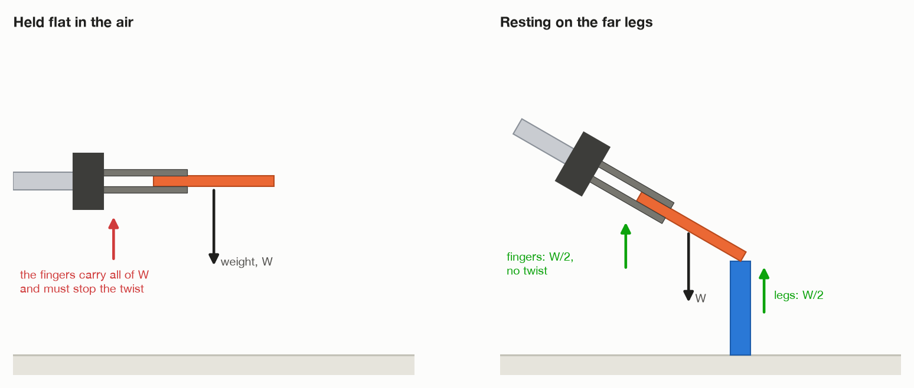
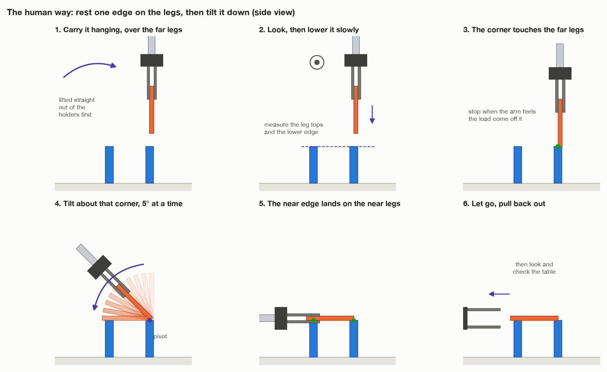
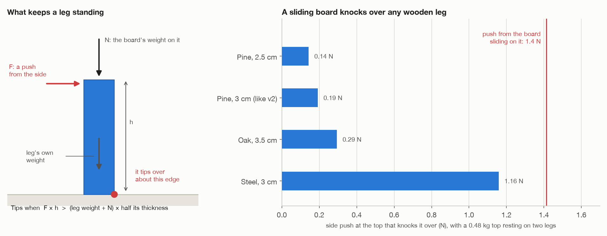
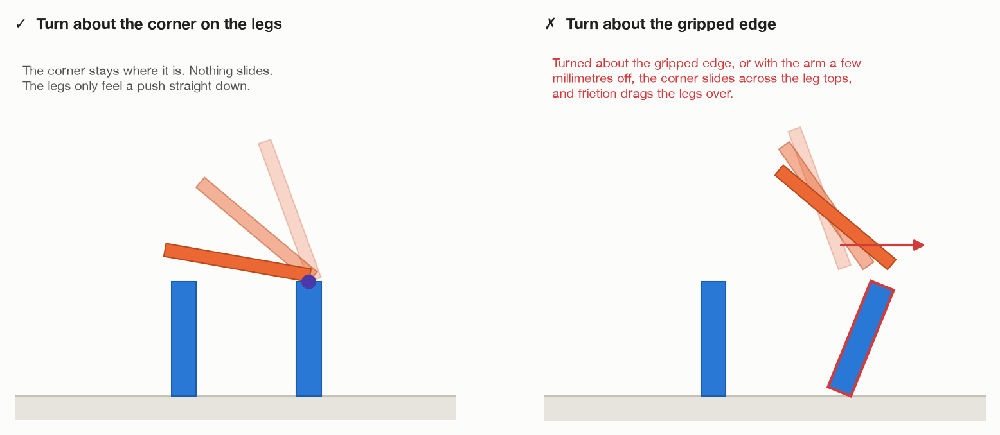

# Part 2: rest the top on two legs, then tilt it down onto four

This is part 2 of v3. It is built: `make tilt` runs it. This file is the plan
it was built from; [what was built](#what-was-built) at the end says where the
code differs from the plan, and why. The results are in
[`turn-results.md`](turn-results.md).

It is the way to get the table top from its holders onto the legs that copes
with a heavy top, and it is how a person does it. They do not hold a heavy
board flat in the air by one edge. They lift it, rest its far edge on the
support, and then lower the near edge until it lies flat. The turn and the
arm's movement happen together, and they go on until the top has touched and
settled on all four legs.

Numbers and file names are v2's, as in the other files here.

---

## 1. The problem

**At the start:**

- the table top has been lifted straight up out of its holders, and hangs
  straight down from the fingers, as in
  [`pick-up-and-place.md`](pick-up-and-place.md);
- **the four legs are already standing** where the table goes. In the full
  job, v2's leg steps put them there. This file assumes they are done.

**At the end:** the top lies flat on the four legs, and all four legs are
still standing where they were.

**Why bother:** the swing in `pick-up-and-place.md` has a hard limit. Held
flat by one edge, a top heavier than about 0.8 kg twists out of v2's fingers
(see [`one-joint-or-many.md`](one-joint-or-many.md)). This way never holds
the top flat in the air. In the air it only ever hangs, and hanging is the
easy way to hold it. By the time it is flat, the legs are carrying it.

---

## 2. Why it helps



- **Held flat in the air**, the fingers carry all of the weight, and they
  also have to stop it twisting down out of their grip. The twist is what
  fails first.
- **With the far edge resting on the legs**, the legs carry about half the
  weight and the fingers about half. There is almost no twist: the board is
  held at both ends, like a plank carried by two people.

For v2's heaviest top (0.48 kg), the twist on the fingers drops from
0.34 N·m to almost nothing. For a real 3.2 kg top, the fingers would carry
about 16 N, well under the 60 N their friction can hold, instead of a twist
nine times more than they can resist.

---

## 3. Step by step



1. **Lift it straight out of the holders.** This is the same as steps 6 to 9
   of `pick-up-and-place.md`: come in above the middle of the upper edge,
   grip, and lift straight up until it clears the holders. It is then hanging
   straight down.
2. **Carry it round, hanging, to above the far legs.** Use `carry_round()`
   as for a leg. On the way, turn it so the gripped edge runs square across
   the arm's reach (see `pick-up-and-place.md`, section 5, rule 3). Stop
   with the board's lower edge about 5 cm above the far legs.
3. **Look.** Measure where the far legs' tops are, to the millimetre if you
   can. Their tops are what the board will turn on.
4. **Lower it slowly** until its lower corner touches the far legs. Go 1 mm
   at a time near the end. The arm knows it has touched when part of the
   board's weight comes off it: the wrist joints' efforts drop.
5. **Tilt it about that corner, towards the arm, 5° at a time.** The corner
   stays where it is, on the legs. The arm moves the gripped edge down round
   a circle, with the corner at its centre and the board's width as its
   radius. This is the step that needs care (section 4).
6. **Lower the near edge onto the near legs.** The board is now flat and on
   all four.
7. **Let go and pull the fingers back out**, as v2 does. The lower finger
   passes between the two near legs, because the grip is at the middle of the
   near edge and the legs are at the corners.
8. **Look and check the table.** Also check each leg is still where it was.

**Where exactly the corner rests.** It rests on the far legs' tops, and it
stays there, so it ends up as the table's far edge. Two choices:

- **Over the middle of each far leg.** The leg is equally hard to knock over
  either way. The cost: the far legs stick out 1.5 cm past the table's far
  edge. **Start with this.**
- **Near the leg's outer side.** It looks like a normal table, but the load
  then sits right over the edge the leg would tip over, and the smallest push
  outwards knocks it over.

With the middle, the legs have to stand where this needs them: the far legs'
middles right under the top's far edge. So the plan puts the legs for this
way, not v2's way.

---

## 4. The limits

### Legs falling over: the big one

A leg standing on its own is easy to knock over. Its own weight, and the
board's weight pressing down on it, try to keep it upright. A push from the
side at its top tries to tip it over about its bottom edge.



The rule, in simple terms:

> A leg tips over when **side push × its height** is more than
> **(its own weight + the weight on it) × half its thickness**.

For v2's legs (pine, 3 cm square, 14 cm tall) with half of a 0.48 kg top
resting on two of them, a side push of about **0.19 N** at the top knocks one
over. That is the weight of 19 grams.

Pressing straight down is safe. It even makes the leg steadier. **The danger
is any push from the side.** Three things make one:

1. **The corner sliding on the leg tops.** If the board slides even a little
   while it turns, friction drags the leg top with it. Friction can push up to
   μ times the weight on the leg: 1.2 × 1.18 N ≈ 1.4 N. That is seven times
   what knocks the leg over. **A sliding board knocks over any wooden leg.**
   So the board must turn exactly about the corner that rests on the legs,
   never about the gripped edge.

   

2. **The arm being a few millimetres off.** v2 measures a leg to within about
   2 mm. The arm follows its path very stiffly. If the circle it follows is
   centred 2 mm away from the real corner, the arm does not just miss by
   2 mm. It shoves the board, and the board shoves the legs. Knowing the legs
   accurately helps, but on its own it is not enough. The arm needs some give:

   - **Feel the push and give way.** A real UR5e has a force sensor at its
     wrist. In Gazebo, add a force-torque sensor at the wrist. ROS 2's
     `admittance_controller` (in `ros2_controllers`) moves the arm to let a
     push go instead of fighting it.
   - **Or loosen the grip a little** during the tilt, so the board can turn in
     the fingers and they act like a hinge.
   - **Or softer pads**, which give a little when pushed.

3. **Touching down too hard, or off to one side.** Lower slowly (step 4), and
   land the corner over the middle of the legs.

**Heavier legs help, but they do not solve it.** The chart shows how hard a
push each leg can take. A thicker oak leg takes a bit more than v2's pine
one. A steel leg takes almost as much as a sliding board gives. So:

- stop the board sliding first (turn about the corner, and give the arm some
  give);
- then heavier or thicker legs are the safety margin for small bumps.

In a real table the legs are screwed to the top or to a frame, so they
cannot fall over. Legs standing loose on the floor are the hardest version of
this job.

To test heavier or lighter legs in Gazebo, set `LEG_DENSITY` on the command
line (`make tilt LEG_DENSITY=2000`; 500, pine, if not given), or change
`LEG_THICKNESS` in `world/spec.py`. The mass and inertia follow by
themselves, as for the top. The gripper can still lift them: even a steel leg,
about 1 kg, is well under the 6 kg its friction holds when hanging.

### The corner missing the legs

The legs are only 2.5 to 3.5 cm across. If the corner comes down more than
about 1.5 cm off the middle, it lands on the leg's edge or misses it. Step 3
(look first) is there for this. If the arm has gone 1 cm below where the leg
tops should be and still feels nothing, stop: it has missed.

### The top's weight

Much less of a problem than in the swing. In the air the top only hangs, and
hanging, v2's fingers hold about 6 kg. Once it rests on the legs they hold
half of it. The arm's payload (about 4 kg with the gripper on) becomes the
limit instead. A heavier top presses the legs down harder, which steadies
them, but it also makes the friction push from any sliding bigger, so the
rule about not sliding matters just as much.

### Seeing the legs

With the board hanging right above the far legs, the board can hide them from
the wrist camera. Look at them (step 3) from the side, before the board is
over them.

---

## 5. Compared with the swing

| | Swing in the air ([`pick-up-and-place.md`](pick-up-and-place.md)) | Rest on the legs and tilt (this file) |
| --- | --- | --- |
| Heaviest top, with v2's gripper | about 0.8 kg | about 4 kg (the arm's payload) |
| What goes wrong | the top twists out of the fingers | a leg gets knocked over |
| What it needs | a strong grip on the edge | accuracy, some give in the arm, steady legs |
| Speed | quicker | slower: touch down and tilt carefully |
| Like a person would do it | no | yes |

A robot that measures the top's weight first (see `one-joint-or-many.md`,
section 6) can use both: the swing for light tops, this way for heavy ones.

---

## 6. Pseudo code

Plain pseudo code. Names ending in `# exists` are in v2's code. The rest would
be new.

```text
procedure INSTALL_TOP_BY_TILTING(top, legs):

    # 1. Which legs are which, and what the board turns on
    near_legs, far_legs = legs split by distance from the arm's base
    pivot = the line through the middles of the far legs' tops
    TILT_STEP = 5 degrees

    # 2. Plan every pose before touching the top
    above   = tool pose: top hanging, gripped edge square across the reach,
              its lower corner 5 cm above pivot
    touch   = above, moved straight down 5 cm
    tilt    = touch turned about pivot, towards the arm, TILT_STEP at a time,
              until the top is flat
    for every pose in [pick-up poses] + [carry to above] + [above, touch] + tilt:
        if not can_reach(pose, with the top attached, same wrist side):  # exists
            stop "cannot tilt the top onto these legs from here"

    # 3. Pick it up and carry it, hanging
    LIFT_FROM_HOLDERS(top)                   # pick-up-and-place.md, steps 6 to 9
    carry_round(held, hanging, above)        # exists
    weight = MEASURE_WEIGHT()                # wrist efforts, now vs. before the grip

    # 4. Look, then correct the plan by what is really there
    far_legs = LOOK_AT(far_legs)             # _look() and read_room() exist
    pivot = the line through the middles of the far legs' tops, as seen
    recompute touch and tilt from the new pivot

    # 5. Lower until it touches
    LOWER_UNTIL_TOUCH(touch, step = 1 mm, expect = weight / 2)
        # stop as soon as the wrist efforts drop by about half the weight;
        # stop with an error if 1 cm past the expected height and no touch

    # 6. Tilt about the corner
    optional: grip a little lighter, so the board can turn in the fingers
    for pose in tilt:
        move_linear(pose, speed = CARRY_SPEED)                  # exists
        if the wrist efforts jump, or a fingertip loses touch:
            stop moving, lift clear, open, look round the room

    # 7. Finish as v2 does
    lower(last pose)                                            # exists
    release()                                                   # exists
    pull_out(last pose, TOP_RETREAT)                            # exists
    check_table()                                               # exists
    check each leg is still standing where it was
```

---

## What was built

`make tilt` does this, in `task.py` (`_put_on_legs()` and what it calls),
with the geometry in `assembly/table.py` and `assembly/grasps.py`. It follows
the plan above, with seven differences.

1. **The legs start standing where the table goes.** This file assumes they
   are already there, and the simulator puts them there: the far two where
   the top's far edge will rest on their middles, the near two 1.2 cm in from
   its near edge. The arm is not told any of that. It finds the four legs in
   its survey and measures them close up.
2. **The legs are measured before the top is picked up.** Section 4 warns
   that the top, hanging over the far legs, hides them from the camera. So
   they are looked at from above and from the arm's side first, and the whole
   route — pick-up, carry, the tilt, the pull-out — is planned from those
   measurements before the top is touched.
3. **The top comes down on the far legs leaning 20°, not upright.** Upright,
   it would hang its whole width plus 12 cm above them. For the flat top to
   end far enough out that the arm can let go and pull back without folding
   up, the far legs have to stand about 78 cm out, and the arm cannot reach
   that high that far out. So the arm leans the top 20° towards itself in the
   air first, 45 cm out, then carries it out over the far legs, leaning. At
   20° the twist on the grip is a third of what it is with the top flat. If
   the arm cannot reach the far legs leaning only 20°, it leans 30°, where
   the twist is half. It first leaned 30° every time, and a 3 kg top sagged
   in the fingers on the way, then twisted out during the tilt and knocked
   all four legs over; leaning 20°, the same top made a table.
4. **The arm feels for the far legs instead of pushing against them.**
   Section 4 suggests a force sensor and an admittance controller. The arm
   has neither, but it can read its own joints' efforts. It comes down half
   a millimetre at a time and stops when the shoulder, elbow or wrist 1
   suddenly has less to hold up, which is the legs taking some of the top's
   weight. Then it goes back up one step, so the top sits just on them rather
   than being pushed into them.
5. **It lets go just above the near legs.** The tilt stops when the top is
   3 mm above the near legs, and the top falls the rest of the way when the
   fingers open. Driven all the way down, a near leg standing a hair taller
   than measured would have the top pushed into it.
6. **The legs are 15–17 cm tall, not v2's 13–16.** At the end of the tilt
   the arm holds the top level by its near edge, a finger above and a finger
   below. With legs 13 cm tall that is 14 cm off the floor, and in every
   shape of the arm that reaches it, wrist 1 is down at the floor. The arm
   checks this before it touches the top, and says so if it cannot.
7. **The grip is loosened before the tilt.** Once the far legs hold up one
   edge, the fingers open to 4 mm wider than the top. They stop squeezing it,
   so any error in the arm's path is not forced into the legs. They still
   carry the gripped edge until the near legs take it: that edge lies on the
   lower finger and turns between the two, like a hinge. This is the "grip a
   little lighter" of step 6, and "loosen the grip a little" in section 4.
   With the grip loose, a fingertip losing touch no longer means the top
   slipped, so the camera's check of the table decides.

The top turns about the edge it rests on — the lower edge on the arm's side,
the one a box tipped over turns on — so nothing slides on the leg tops. The
tests check that that edge stays put through every step of the tilt.
