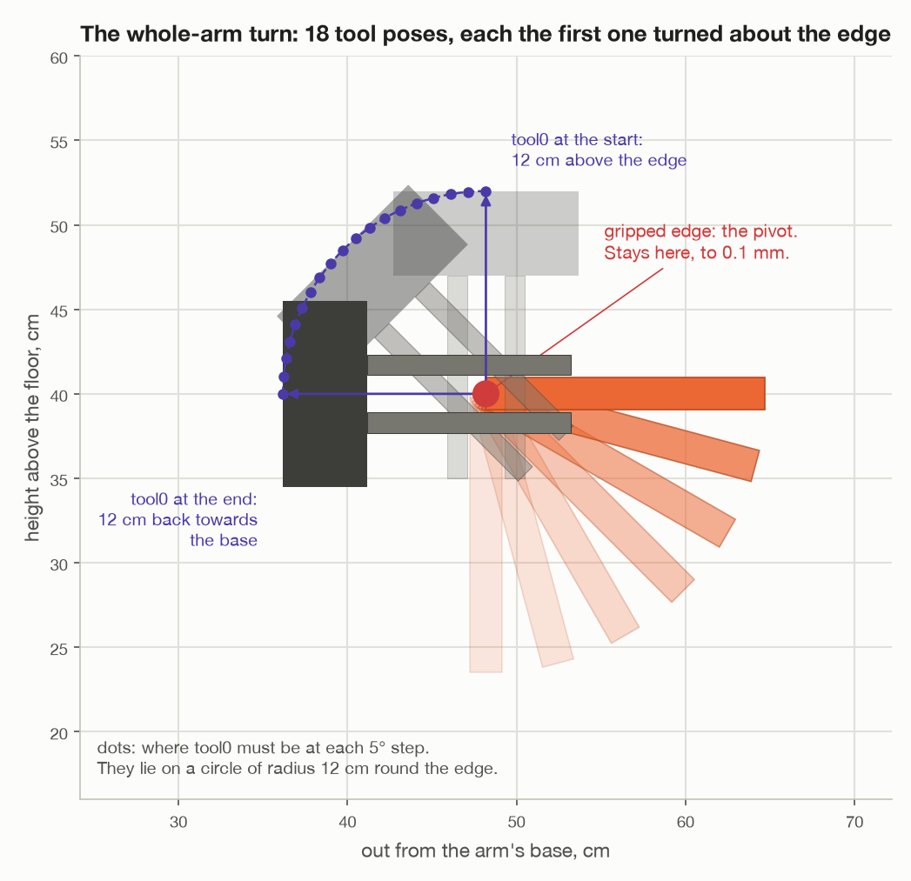
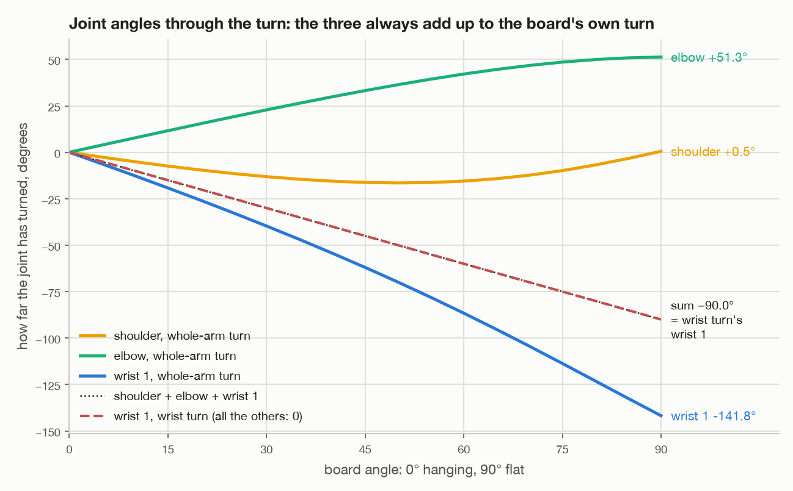
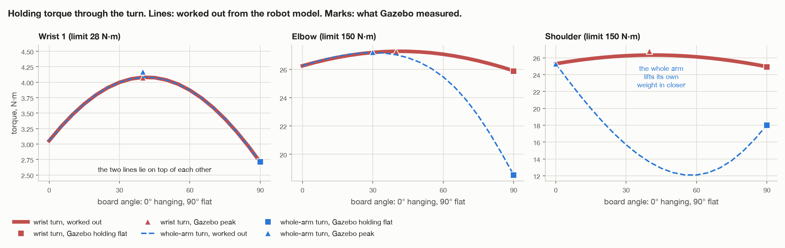

# Turning the top flat with the whole arm

`make whole-arm`

This file walks through the whole-arm turn one step at a time, with the maths
behind each step. The top turns about its own gripped edge, like a
drawbridge, and whichever joints that takes may move. The other way, wrist 1
alone, is in [`turn-by-wrist.md`](turn-by-wrist.md), and
[`wrist-or-whole-arm.md`](wrist-or-whole-arm.md) puts the two side by side.

As in the wrist file, the camera gets one paragraph, and MoveIt is treated as
a black box: this file says what the code asks MoveIt for and what comes back,
not how MoveIt works it out.

All numbers are for seed 1: a top 24.4 × 16.5 × 1.9 cm, weighing 0.31 kg.
*Worked out* numbers come from [`figures/two_turns.py`](figures/two_turns.py),
which runs the turn on the same robot model Gazebo uses. *Gazebo* numbers are
what the simulator reported ([`turn-results.md`](turn-results.md)).

If the six joints, poses, tool0 or torque are new to you, read section 0 of
[`turn-by-wrist.md`](turn-by-wrist.md) first. The one fact from it that
matters most here: **the shoulder, the elbow and wrist 1 turn about three
parallel lines**, so between them they move and tilt the tool in the arm's own
upright plane, and

```
tool tilt = shoulder + elbow + wrist 1
```

---

## 1. The whole run


| Step | What happens | Joints that move | Code, in `task.py` |
| --- | --- | --- | --- |
| 1 | Look round, measure the top | all, to aim the camera | `_survey()`, `_measure_top()` |
| 2 | Plan and check every pose | none | `_check_turning_spot_clear()`, `_plan_route()` |
| 3 | Grip the middle of the upper edge | all | `_pick_up()` |
| 4 | Lift straight up out of the holders | shoulder, elbow, wrist 1 | `_pick_up()` |
| 5 | Carry it round, hanging | mostly the base, and wrist 3 | `_pick_up()` |
| 6 | (on the way) line the edge up with wrist 1's axis | — | `_plan_route()` |
| 7 | **Turn it flat, about its own edge** | **shoulder, elbow, wrist 1** | `_turn_by_whole_arm()` |
| 8 | Hold it flat 5 s, report | none | `run()` |

---

## 2. Steps 1 to 6, in short

These are the same as for the wrist turn, and
[`turn-by-wrist.md`](turn-by-wrist.md), sections 2 to 7, works through each
one. In short:

1. **Look and measure.** The wrist camera finds the top and fits a box to it:
   24.4 × 16.5 × 1.9 cm, standing within 5° of upright. The middle of its upper
   edge is `centre + up × width / 2`.
2. **Plan.** Every pose is worked out and checked before the top is touched,
   with the wrist flipped the same way throughout. Nothing may have been seen
   within 40 cm of the turning spot, (0.50, 0.00, 0.40).
3. **Grip.** The tool points straight down, 12 cm above the middle of the edge
   (fingertips at 17 cm, reaching 5 cm over it), x along the edge. The hold
   `H = P⁻¹ · T` is stored: from now on the top is always at `tool · H⁻¹`.
4. **Lift** straight up by the top's width plus 4 cm: 20.5 cm.
5. **Carry** round the base on an arc, hanging, in 5° steps, at a fixed
   height. Only turns about the vertical, so the top keeps hanging straight.
6. **Line the edge up with wrist 1's axis.** At the turning spot that axis
   is 15.5° off square to the line of reach, because the UR5e's links step
   13.3 cm sideways (sin φ = 13.3 / 50). The code measures the axis on the
   robot's model by turning wrist 1 a little and seeing how the tool turned.

Step 6 is essential for the wrist turn: without it the top would end tilted.
The whole-arm turn would end flat anyway, since it turns about the edge
itself, whichever way the edge points. What step 6 buys it is simplicity:
with the edge along wrist 1's axis, the turn lies in the arm's own plane, so
only the three joints that work in that plane have to move (section 5).

What is different for this turn in step 2 is the check of the turn itself.
`_turn_blocked()` makes the 18 poses of section 3 from the planned hanging
pose, and asks, for each one, whether the arm can reach it with the wrist the
same way round and without hitting anything (`can_reach()`). If one fails,
the arm stops before touching the top and says how far round the turn it
could get.

At the start of the turn the joints are, in degrees:

| base | shoulder | elbow | wrist 1 | wrist 2 | wrist 3 |
| --- | --- | --- | --- | --- | --- |
| −15.5 | −91.2 | 86.5 | −85.3 | −90.0 | 0.0 |

---

## 3. Step 7a: the 18 tool poses



The code does not tell MoveIt "turn the top". It works out where the tool has
to be at every 5° of the turn, and hands MoveIt that list
(`swing_about_edge()` in `assembly/grasps.py`).

**The pivot and the line to turn about.** Both come from the tool's pose just
before the turn:

```
pivot = tool0 position + tool z × 0.12      the middle of the gripped edge
axis  = tool x                              the way the edge runs
```

**Which way.** `flat_turn()` picks +90° or −90°, whichever leaves the tool
reaching away from the base, exactly as for the wrist turn. The top swings
away from the arm.

**Every pose is the first one, turned about the edge.** A turn by an angle a
about the line through the pivot is the 4 × 4 matrix

```
M(a) = [ R(a)   pivot − R(a) · pivot ]
       [  0              1           ]
```

where R(a) is the turn about the axis (`rotation_about()`, Rodrigues'
formula). The right-hand column is what keeps the pivot where it is: M moves
the pivot to R·pivot + pivot − R·pivot = pivot. Then

```
pose k = M(90° × k / 18) · starting pose        for k = 1, 2, ..., 18
```

(`turned_about()`). That is 18 poses, 5° apart (`SWING_STEP`).

**What that does to the tool.** tool0 is 12 cm from the edge, so it moves on
a circle of 12 cm radius round the edge: from 12 cm straight above it, to
12 cm behind it, towards the base, reaching out level. The arc is
0.12 × π/2 = 18.8 cm long, about 1.05 cm between poses. The tool also tilts,
5° per pose, so it always points at the edge.

The tests check the geometry without a simulator
(`test_turned_about_its_edge_the_board_ends_flat_and_away_from_the_arm`):
every pose keeps the edge where it was, no step turns more than 5°, and the
last leaves the top flat, sticking out away from the base, with the tool
level.

---

## 4. Step 7b: what MoveIt is asked for

The list goes to MoveIt's straight-line path service
(`/compute_cartesian_path`, called by `Arm.move_linear()`). The code asks:

- start from where the arm is now;
- go through these 18 poses, in straight lines between them;
- put a point at least every 5 mm (`max_step`);
- check every point for collisions, the top in the fingers included;
- time it within the joint limits scaled by 0.1 (`CARRY_SPEED`).

What comes back is a list of joint angles against time, and a *fraction*: how
much of the path it managed. MoveIt finds the joint angles for each point
starting from the previous point's, so the arm moves smoothly and never
jumps to a different shape. The code does not choose the angles itself: any
joint is free to move.

Between two poses, tool0 goes in a straight line, not on the circle. The
line cuts the corner by 0.12 × (1 − cos 2.5°) = 0.1 mm, so the edge stays put
to about a tenth of a millimetre.

What the code does with the answer:

| Fraction | What happens |
| --- | --- |
| all of it | sent straight to the arm's controller; the tool must arrive within 5 mm and 1.7° |
| 90% to 99.9% | run what there is, then finish with one free move to the last pose, the wrist kept the same way round (`SWING_MIN_FRACTION = 0.9`) |
| under 90% | stop: something is in the way |

---

## 5. Step 7c: what the joints have to do, by hand


MoveIt works the joint angles out numerically. Here they can be worked out
by hand, because the edge lies along wrist 1's axis, so the whole turn
happens in the arm's own upright plane. Measure "out" along that plane from
the base's line, and "up" from the floor, in cm.

**1. Where wrist 1 must be.** Wrists 2 and 3 do not move, so wrist 1 is fixed
relative to the tool: 10.0 cm back and 10.0 cm up from tool0 when the tool
points down, and turned with the tool as it tilts.

| | tool0 | wrist 1 |
| --- | --- | --- |
| start (hanging) | (48.2, 52.0) | (38.2, 62.0) |
| halfway (45°) | (39.7, 48.5) | (25.6, 48.5) |
| end (flat) | (36.2, 40.0) | (26.2, 30.0) |

**2. How far wrist 1 is from the shoulder.** The shoulder is at (0, 16.25). The
upper arm is 42.5 cm long and the forearm 39.22 cm. Call the distance D:

```
start:  D = √(38.2² + (62.0 − 16.25)²) = 59.6 cm
end:    D = √(26.2² + (30.0 − 16.25)²) = 29.6 cm
```

**3. The elbow, from the law of cosines.** The upper arm, the forearm and D
make a triangle. The elbow's bend is the angle between the two arms:

```
cos(bend) = (D² − 42.5² − 39.22²) / (2 × 42.5 × 39.22)

start:  cos(bend) = (3552 − 1806 − 1538) / 3334 =  0.062  →  bend =  86.4°
end:    cos(bend) = ( 875 − 1806 − 1538) / 3334 = −0.741  →  bend = 137.8°
```

Wrist 1 comes in close to the shoulder, so the elbow has to fold: **+51.3°**.

**4. The shoulder**, from the same triangle: the upper arm points at wrist 1,
plus the triangle's angle at the shoulder, α:

```
cos α = (42.5² + D² − 39.22²) / (2 × 42.5 × D)

start:  wrist 1 is 50.1° above level from the shoulder, α = 41.1°  →  upper arm at 91.2°
end:    wrist 1 is 27.7° above level,                   α = 63.0°  →  upper arm at 90.7°
```

The upper arm starts and ends almost upright: the shoulder turns just
**+0.5°**. Halfway, though, wrist 1 has come in (25.6 cm out) without yet
coming down (48.5 cm up). To reach a point that close and that high, the upper
arm has to lean back, 16.5° at most. So the shoulder goes out 16.5° and comes
back: 17° of travel for 0.5° of net turn.

**5. Wrist 1, from the tilt rule.** The tool has to tilt 90°, and the three
parallel joints share that out:

```
Δ shoulder + Δ elbow + Δ wrist 1 = −90°
       +0.5 +  51.3  + Δ wrist 1 = −90°      →      Δ wrist 1 = −141.8°
```



That is why **wrist 1 turns 142°, not 90°**. The elbow folds 51° to bring the
wrist in and down, and that tilts the forearm the wrong way. Wrist 1 has to
turn the 90° the top needs *and* undo the 52° the shoulder and elbow added.

**6. The base, wrist 2 and wrist 3 do nothing.** They were free to move.
They did not need to, because the edge runs along wrist 1's axis and the whole
turn lies in the arm's plane. Had the edge been 15.5° off, square to the line
of reach, the base and the wrists would all have had to join in.

These hand numbers are what MoveIt found and Gazebo measured: shoulder 17.0°
of travel (net +0.5°), elbow 51.3°, wrist 1 141.8°, the rest 0.0°.

### How long it takes

Every joint has the same speed limit here, 18°/s (a tenth of 180°/s). The
joint that turns furthest sets the pace, and that is wrist 1, with 141.8°.
Even at 18°/s the whole way, it would need 141.8 / 18 = 7.9 s. With speeding
up and slowing down, MoveIt's timing came to **8.6 to 8.7 s** in Gazebo.
Moving three joints made the busiest joint busier.

---

## 6. Step 8: hold it flat, and report

The same as for the wrist turn: hold 5 s, work out the top's tilt from the
joint angles (tool · H⁻¹), report each joint's travel, peak and holding
effort, and check the fingertips still feel the top. See section 9 of
[`turn-by-wrist.md`](turn-by-wrist.md).

The top ends flat with its gripped edge exactly where it started, 40 cm up.
The rest of it sticks out 16.5 cm beyond the edge, away from the arm.

---

## 7. The torque on each joint

A joint's torque is its **holding** part, each mass's weight times its level
distance from the joint's axis (its *lever*), added up over everything the
joint holds up, plus a **moving** part for speeding things up and slowing them
down. See section 10 of [`turn-by-wrist.md`](turn-by-wrist.md) for the full
working.



### Wrist 1: exactly as in the wrist turn

Wrist 1 holds up the wrist links, the gripper, the camera and the top. Wrists
2 and 3 do not move, so those parts are always arranged the same way relative
to wrist 1, and that arrangement only depends on how far the tool has tilted.
It does not matter which joints did the tilting. So the same formula holds:

```
τ(θ) = 3.05 · cos θ + 2.71 · sin θ     N·m
worst: 4.08 N·m at 42°        flat: 2.71 N·m
```

Gazebo: peak 4.17, holding flat 2.71, against 4.07 and 2.71 for the wrist turn.
Moving more joints did not take any load off wrist 1.

### The shoulder and elbow: less, because the arm pulls in

These two are different, because the arm is in a different shape. Their
torque is everything beyond them times its lever from their axis, and in this
turn everything beyond them comes in towards the base:

| | Shoulder, N·m | Elbow, N·m |
| --- | --- | --- |
| hanging (both turns) | 25.3 | 26.3 |
| worst, whole-arm turn | 25.3 at the start | 27.2 at 30° |
| lowest, whole-arm turn | 12.1 at about 57° | — |
| flat, whole-arm turn: worked out | 18.0 | 18.6 |
| flat, whole-arm turn: Gazebo | 18.01 | 18.54 |
| flat, wrist turn: Gazebo, for comparison | 24.93 | 25.88 |

Flat, wrist 1 is 26 cm out from the base's line instead of 38, so the forearm,
wrists, gripper and top all hang on shorter levers. Around 57° into the turn
the shoulder's torque falls to 12.1 N·m, half what it started at. By then the
wrist end has come in close, and the upper arm leans back, so its own 8 kg
sits behind the shoulder and partly balances what is in front. That is the arm easing itself by its
shape, not the joints sharing the top.

All of it is far inside the limits: 150 N·m for the shoulder and elbow, 28 for
wrist 1.

### The base, wrist 2 and wrist 3

As in the wrist turn: the base cannot be twisted by weight, and wrists 2 and 3
only feel the 50 g camera 8.5 cm to one side, 0.04 N·m.

### The moving part

Tiny again: at a tenth of full speed the model gives at most 0.05 N·m on any
joint, against 12 to 27 N·m of holding. It depends on how MoveIt times the
path, so take that as "hundredths of a newton-metre", not an exact figure.

### The load on the grip

The same as the wrist turn, because it only depends on the top's angle θ:

```
pull along the fingers = m · g · cos θ       3.0 N hanging, 0 flat
twist about the pads   = m · g · d · sin θ   0 hanging, 0.17 N·m flat (d = 5.55 cm)
```

The motion adds even less than in the wrist turn. The edge does not move, and
the top's centre swings on a circle of only 8.25 cm round it.

---

## 8. Results

From the task's own report, seed 1, 400 kg/m³ (0.31 kg):

| Joint | Moved | Peak, Gazebo | Holding flat, Gazebo | Holding flat, worked out |
| --- | --- | --- | --- | --- |
| base | 0.0° | 0.30 | 0.00 | 0.00 |
| shoulder | 17.0° (net +0.5°) | 25.28 | 18.01 | 18.03 |
| elbow | 51.3° | 27.21 | 18.54 | 18.56 |
| wrist 1 | **141.8°** | **4.17** | **2.71** | **2.71** |
| wrist 2 | 0.0° | 0.04 | 0.00 | 0.00 |
| wrist 3 | 0.0° | 0.04 | 0.04 | 0.04 |

Efforts in N·m. The turn took 8.7 s (8.6 s in another run).

- **Three joints moved, not six**, and they add up: −141.8 + 51.3 + 0.5 = −90°.
- **The top ended flat and still held**, its edge 40 cm up where it started,
  level to within 0.005° by Gazebo, 0.1° by the arm's own reckoning. Seed 7
  came out the same.
- **The calculation matches the simulator** to 0.02 N·m on every holding
  torque. The shoulder and elbow end on 18 N·m, where the wrist turn leaves
  them on 25.

### Heavier tops

| `DENSITY` | Mass | What happened in the whole-arm turn |
| --- | --- | --- |
| 400 | 0.31 kg | flat and held |
| 3000 | 2.29 kg | the fingertips lost it 78° into the turn (wrist turn: 82°) |
| 5000 | 3.82 kg | lost 46° in, fell to the floor (wrist turn: 48°) |

Both turns lose a heavy top at nearly the same angle, because the twist on the
grip depends on the top's angle, not on which joints turned it. The few
degrees between them are about the size of the error in placing the moment of
loss. At 3000, the joints were fine: wrist 1 peaked at 12.6 N·m (of 28), the
shoulder at 34.7 and the elbow at 49.9 (of 150). Those peaks include the jolt
of the top twisting in the fingers.

---

## 9. What can go wrong

| What | How it shows | What the code does |
| --- | --- | --- |
| A pose of the turn cannot be reached | `_turn_blocked()`, before the grip | stops, says how far round it could get |
| MoveIt's path stops short, 90% or more | fraction under 1 | finishes with one free move, wrist the same way round |
| It stops short of 90% | fraction under 0.9 | stops: something is in the way |
| The top slips | fingertip sensors go quiet | reports how far into the turn it went |

The wrist turn cannot stop short: its path is built joint by joint and checked
before it starts. That is one of the differences
[`wrist-or-whole-arm.md`](wrist-or-whole-arm.md) goes through.

---

## 10. Where it is in the code

| What | Where |
| --- | --- |
| The order of everything | `task.py`: `run()` |
| Checking the turn before the grip | `task.py`: `_turn_blocked()` |
| The turn | `task.py`: `_turn_by_whole_arm()` |
| The 18 poses | `assembly/grasps.py`: `swing_about_edge()`, `turned_about()`, `gripped_edge()` |
| Which way to turn | `assembly/grasps.py`: `flat_turn()` |
| Asking MoveIt for the straight-line path | `arm/motion.py`: `move_linear()` |
| The tests of the geometry | `test/test_grasps.py` |
| The numbers and pictures in this file | `figures/two_turns.py` |
