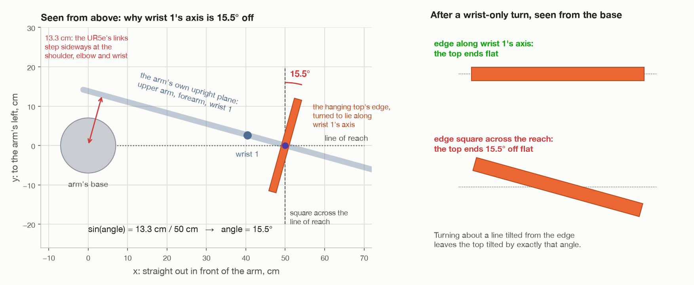
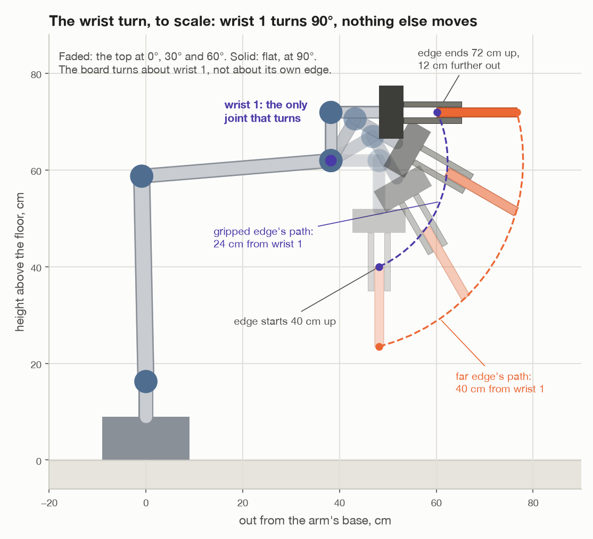
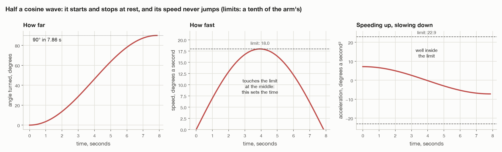

# Turning the top flat with wrist 1 alone

`make wrist`

This file walks through the wrist turn one step at a time, with the maths
behind each step. It is written for someone new to robot arms. The other way
of turning the top, with the whole arm, is in
[`turn-by-whole-arm.md`](turn-by-whole-arm.md), and
[`wrist-or-whole-arm.md`](wrist-or-whole-arm.md) puts the two side by side.

Two things are kept short on purpose:

- **The camera.** How the arm finds and measures the top gets one paragraph
  (step 1). This file is about the movement.
- **MoveIt's insides.** Where the code asks MoveIt for something, this file
  says what it asks for and what comes back, not how MoveIt works it out.

All numbers are for seed 1: a top 24.4 × 16.5 × 1.9 cm, weighing 0.31 kg.
Numbers marked *worked out* come from
[`figures/two_turns.py`](figures/two_turns.py), which runs the same turn on the
same robot model Gazebo uses. Numbers marked *Gazebo* are what the simulator
reported in a real run ([`turn-results.md`](turn-results.md)). The two agree
to within a few hundredths of a N·m.

---

## 0. The arm, and a few words


The arm is a UR5e. It has six joints. Each is an electric motor that turns.
From the base out:

| Joint | Name in the code | Turns about | What it does in this job |
| --- | --- | --- | --- |
| base | `shoulder_pan_joint` | the vertical | carries the top round the arm |
| shoulder | `shoulder_lift_joint` | a level line | lifts the upper arm |
| elbow | `elbow_joint` | a level line, parallel to the shoulder's | bends the arm |
| wrist 1 | `wrist_1_joint` | a level line, parallel to the shoulder's | **turns the top flat** |
| wrist 2 | `wrist_2_joint` | a line square to wrist 1's | stays still the whole turn |
| wrist 3 | `wrist_3_joint` | the line the gripper reaches along | spins the gripper |

The one fact to remember: **the shoulder, the elbow and wrist 1 turn about
three parallel lines.** Together they move the tool about in one upright
plane, the arm's own plane, and tilt it in that plane. So the tool's tilt in
that plane is just the three angles added up:

```
tool tilt = shoulder + elbow + wrist 1
```

The gripper cannot turn anything. It only opens and closes its fingers. Every
turn comes from the six joints.

A few words used below:

- **tool0**: the flange at the very end of the arm, where the gripper is
  bolted on. "Where the tool is" means where tool0 is.
- **Room coordinates**: x points straight out in front of the arm, y to its
  left, z up. Metres, with the arm's base at (0, 0, 0). The floor is at 0.
- **The tool's own axes**: z is the way the gripper reaches, y the way the
  fingers close, and x the third one, along the gripped edge (right-hand
  picture above).
- **Pose**: where something is *and* which way it faces. The code keeps a pose
  as a 4 × 4 matrix:

  ```
  pose = [ R  p ]     R: 3 × 3. Its three columns are the thing's own x, y and z
         [ 0  1 ]        axes, written in room coordinates.
                      p: where the thing is, in room coordinates.
  ```

  Multiplying two poses chains them: "the tool, in the board's frame" times
  "the board, in the room" gives "the tool, in the room".
- **Torque**: a twist. A push of 1 newton, 1 metre from a joint's axis, twists
  it with 1 N·m. A kilogram weighs 9.81 N.

---

## 1. The whole run


| Step | What happens | Joints that move | Code, in `task.py` |
| --- | --- | --- | --- |
| 1 | Look round, measure the top | all, to aim the camera | `_survey()`, `_measure_top()` |
| 2 | Plan and check every pose | none | `_check_turning_spot_clear()`, `_plan_route()` |
| 3 | Grip the middle of the upper edge | all | `_pick_up()` |
| 4 | Lift straight up out of the holders | shoulder, elbow, wrist 1 | `_pick_up()` |
| 5 | Carry it round, hanging | mostly the base, and wrist 3 | `_pick_up()` |
| 6 | (on the way) line the edge up with wrist 1's axis | — | `_plan_route()` |
| 7 | **Turn it flat** | **wrist 1 only** | `_turn_by_wrist()` |
| 8 | Hold it flat 5 s, report | none | `run()` |

Steps 1 to 6 are the same for the whole-arm turn. Only step 7 differs.

---

## 2. Step 1: look round and measure the top

The camera is on the wrist. The arm carries it round in eight views, then
takes four close views of the top. In each picture the coloured pixels are
the top. Each pixel's depth turns it into a point in the room, and a box is
fitted to all the points. What comes out is a `Box`: a centre, three axes and a
size. For seed 1: 24.4 × 16.5 × 1.9 cm. The floor's height comes out of the
same pictures.

Two numbers are taken from the box:

- **How far it leans.** The face normal (the box's thinnest axis) should be
  level. If it tilts more than 5° from level, the arm refuses
  (`TOP_MAX_TILT`).
- **The middle of the upper edge** (`upright_edge()` in `assembly/grasps.py`).
  Of the box's two long axes, the one closer to vertical is "up", and

  ```
  edge = centre + up × (width / 2)
  ```

  For seed 1 that is 16.6 cm above the floor.

That is all the arm knows about the top. It never reads the simulator's
numbers.

---

## 3. Step 2: plan every pose before touching the top

If the arm grips the top and only then finds it cannot turn it, all it can do
is put it back. So `_plan_route()` works out and checks every pose first,
while nothing has moved.

**The turning spot.** The middle of the gripped edge will go to

```
TURN_SPOT, TURN_HEIGHT  →  (0.50, 0.00, 0.40)
```

50 cm straight in front of the arm and 40 cm up. That is the arm's own choice
of where to work, not a fact about the room. 40 cm up, even the widest top
(20 cm) hangs 20 cm clear of the floor.

**Is it clear?** Nothing the camera saw may be within 40 cm of the spot, seen
from above (`TURN_CLEARANCE`). The far edge of the top swings round wrist 1 on
a circle of 40 cm radius (step 7), so that is the room it needs.

**Then, for each of two ways of gripping** (the tool one way round, or turned
half a circle):

1. Can the arm reach 8 cm above the edge? Note which way its wrist is flipped
   there (`wrist_side()`). The arm cannot flip its wrist with a part in hand,
   so every later pose must be reachable with the wrist the same way.
2. Can it reach the lifted pose (step 4)?
3. Find the hanging pose at the turning spot with the edge along wrist 1's
   axis (step 6).
4. Is the turn itself possible from there (step 7: end stop and collisions)?
5. Work out the carry (step 5).

The first grip that passes every check is used. If none does, the arm stops
and says which check failed. It has not touched the top.

---

## 4. Step 3: grip the middle of the upper edge

**Where the tool goes** (`edge_pick_poses()`, `down_tool_pose()`). The tool
points straight down, with its x axis along the edge:

```
x = the edge's direction, made level, length 1
z = (0, 0, −1)                  straight down
y = z × x                       square to both: the way the fingers close
position = edge + (0, 0, 0.12)  tool0 is 12 cm above the edge
```

Why 12 cm: the fingertips are 17 cm from tool0 (`FINGERTIP_OFFSET`), and they
reach 5 cm down over the edge (`TOP_INSERTION`). 17 − 5 = 12
(`EDGE_BELOW_TOOL`). Why 5 cm: each finger has two rows of pads, 13.5 and
15.9 cm from tool0. Both rows have to be on the board, because the gap between
the rows is what stops the board twisting out once it is flat.

**The moves.** Open the fingers to the board's thickness plus 3 cm. Move to
8 cm above the pick pose: a free move, planned by MoveIt. Take the top out of
MoveIt's picture of the room, so the fingers are allowed to touch it. Go
straight down the last 8 cm. Close the fingers to the thickness minus 4 mm
(`GRIP_SQUEEZE`): they stop on the board, and push on it with up to 25 N each.
Check that the fingertip sensors feel it.

**The hold** (`hold()`). At the moment of the grip, the code works out where
the tool is *in the top's own frame*:

```
H = P⁻¹ · T         P: the top's pose, as measured
                    T: the tool's pose at the grip
```

The top is now rigidly in the fingers, so H never changes while it is held.
From here on, the top's pose is always

```
top = tool · H⁻¹
```

and to put the top somewhere, send the tool to "where the top should be" · H.
MoveIt is told the top is now part of the arm (`scene.attach()`), so it plans
for it too.

---

## 5. Step 4: lift straight up

The tool goes straight up by the top's width plus 4 cm (`LIFT_CLEAR`):

```
lifted = pick pose, moved up by 0.165 + 0.04 = 0.205 m
```

The top's lower edge ends 4 cm above where its upper edge was. The lift is
not sized to the holders because the camera never sees them: grey next to a
part is taken for the part's own shadowed side. But whatever holds a board
upright holds it lower than its upper edge, which the fingers reached freely.

It is a straight-line move at a tenth of full speed (`CARRY_SPEED = 0.1`). The
code asks for it with collision checking on. If MoveIt refuses, because the
holders touch the top, it is run with checking off: it is short and straight
up. Going straight up stays inside the arm's upright plane, so only the
shoulder, the elbow and wrist 1 move.

The top now hangs straight down. That is the easiest way to hold it: its
weight pulls straight along the fingers, and does not try to turn it.

---

## 6. Step 5: carry it round, hanging

The top has to get from where it stood (to the arm's left) to the turning
spot (in front). `carry_round()` makes a list of tool poses along an arc round
the base:

```
f runs from 0 to 1 in equal steps
distance from the base   r(f) = r_start + (r_end − r_start) · f
bearing round the base   a(f) = a_start + (a_end − a_start) · f
height                   the higher of the two ends, all the way
turn about the vertical  spin · f
```

The steps are 5° apart, of whichever turns more: the base, or the tool about
the vertical. Everything turns only about the vertical, so the top keeps
hanging straight down the whole way. Its centre travels at 31.75 cm up, the
height it will have at the turning spot, so it is never lowered back towards
the holders.

The poses are followed in straight lines between them, at a tenth of full
speed. Mostly the base turns. Wrist 3 turns the gripper so the edge ends up
pointing the right way (step 6).

---

## 7. Step 6: line the edge up with wrist 1's axis



**Why it matters.** Turning wrist 1 turns the tool, and the top with it,
about wrist 1's axis. The top ends flat only if that axis runs along the
gripped edge. If the axis is at an angle φ to the edge, the top ends φ off flat
(`test_a_board_whose_edge_is_off_the_axis_does_not_end_flat` checks this: 15°
off in, 15° off flat out).

**Why the axis is not simply "square across the line of reach".** The UR5e's
upper arm, forearm and wrist do not sit on the base's centre line. Its links
step sideways, 13.3 cm in all (the `0.1333` in the robot's description). So
the arm's upright plane passes 13.3 cm to one side of the base. To reach a
point 50 cm out, that plane has to be turned by an angle φ with

```
sin φ = 13.3 cm / 50 cm = 0.267     →     φ = 15.5°
```

Wrist 1's axis is square to the arm's plane, so it too is 15.5° off square.
That is also why the base sits at −15.5° at the turning spot, not at 0°.

**How the code finds the axis** (`Arm.joint_axis()`). It does not use that
formula. It asks the robot's own model, so nothing is assumed about how the
links are laid out:

1. Work out the joint angles for a trial pose at the turning spot.
2. Turn wrist 1 by 0.1 rad in the model, and see how the tool turned:

   ```
   turn = R_after · R_beforeᵀ                       the rotation that happened
   axis = (turn₃₂ − turn₂₃, turn₁₃ − turn₃₁, turn₂₁ − turn₁₂), made length 1
   ```

   For any rotation, those three differences point along its axis (each is
   2 sin θ times one part of the axis). This is `turn_axis()` in
   `transforms.py`.

For seed 1 it gives

```
axis = (0.267, 0.964, 0.000)      angle from the y axis = arctan(0.267 / 0.964) = 15.5°
```

The formula and the model agree.

The axis only depends on where the tool is, not on how the tool is spun about
the vertical (wrist 3 spins it without moving wrist 1). So it is found once,
and then `hanging_tool_poses()` gives the two hanging poses at the spot: tool
down, 12 cm above the spot, x along +axis or −axis. The carry in step 5 ends
at whichever needs less spin of wrist 3.

At the start of the turn the joints are, in degrees:

| base | shoulder | elbow | wrist 1 | wrist 2 | wrist 3 |
| --- | --- | --- | --- | --- | --- |
| −15.5 | −91.2 | 86.5 | −85.3 | −90.0 | 0.0 |

Check the tilt rule: −91.2 + 86.5 − 85.3 = −90.0, the tool pointing straight
down.

---

## 8. Step 7: the turn



### Which way: +90° or −90°?

`flat_turn()` tries both and keeps the one that swings the top **away from
the arm**. Swung towards the arm, the top would end in the arm's lap with the
tool pointing back at its own base.

The test: after the turn, which way does the tool reach (its z axis)? Keep the
turn where it reaches away from the base, a positive dot product with the
outward direction. For seed 1, the tool reaches down, (0, 0, −1), and the
outward direction is (1, 0, 0):

```
turned +90° about (0.267, 0.964, 0):   reach → (−0.964,  0.267, 0)    back at the base ✗
turned −90°:                           reach → ( 0.964, −0.267, 0)    away from it     ✓
```

So wrist 1 turns −90°, from −85.3° to −175.3°. This is worked out again just
before the turn, from where the arm really is, so a few millimetres off the
planned pose makes no difference.

### Is it safe? (`Arm.joint_turn_blocked()`)

Two checks, both on the robot's model, before anything moves:

- **End stop.** Wrist 1 can turn at most one full turn either way. −175.3° is
  well inside ±360°.
- **Collisions.** The arm, the gripper and the top in its fingers are put at
  every 2° of the turn, 46 poses from 0° to 90°, and each is checked against
  everything MoveIt knows is in the room. Because only one joint moves, the
  path between two checks is known exactly. 2° at the top's far edge, 40 cm
  from wrist 1, is 1.4 cm of travel.

### The motion: half a cosine wave (`_one_joint_trajectory()` in `arm/motion.py`)



Wrist 1 follows this, for a turn of Θ = 90° = 1.571 rad lasting T seconds:

```
angle          θ(t) = Θ · (1 − cos(π t / T)) / 2
speed          ω(t) = Θ · π / (2T) · sin(π t / T)
acceleration   α(t) = Θ · π² / (2T²) · cos(π t / T)
```

It starts at rest and ends at rest, and its speed never jumps. The top speed,
Θπ/(2T), comes halfway through. The largest acceleration, Θπ²/(2T²), comes at
the very start and end.

**How long it takes.** The limits are those in `config/joint_limits.yaml`,
3.14 rad/s and 4.0 rad/s², times `CARRY_SPEED` 0.1: so 0.314 rad/s (18°/s) and
0.4 rad/s² (22.9°/s²). Each gives a shortest time, and the turn takes the
longer of the two:

```
speed:         Θ·π/(2T)  ≤ 0.314   →   T ≥ π × 1.571 / (2 × 0.314)     = 7.86 s
acceleration:  Θ·π²/(2T²) ≤ 0.4    →   T ≥ √(π² × 1.571 / (2 × 0.4))  = 4.40 s
                                        T = 7.86 s
```

So the speed limit sets the time. The largest acceleration is then 7.2°/s²,
a third of its limit. It does step from 0 to that value at the very start and
end, which is too small to matter here.

Gazebo reported 7.7 s. The report counts from the first joint reading that
moved to the last, and at the two ends of a cosine the joint barely moves.

**What is sent.** A list of points 0.02 s apart, 393 of them. Each point gives
all six joint angles, five of them exactly where they already are, and all six
speeds, five of them zero. It goes straight to the arm's controller (the
`FollowJointTrajectory` action), which is the same message MoveIt itself sends
at the end of every move. The controller runs at 200 Hz and fills in between
the points. Afterwards, the code checks the tool really arrived: within 5 mm
and 0.03 rad (1.7°) of where the model says it should be.

### Where the top ends up

A turn about a line through a point c moves any point p to

```
p' = c + R · (p − c)
```

where R is the turn itself (`rotation_about()`, Rodrigues' formula:
R = I + sin θ·K + (1 − cos θ)·K², with K the axis written as a cross-product
matrix). `turned_about()` in `grasps.py` does exactly this to a whole pose.

For the wrist turn, c is on wrist 1's axis. It is easiest to see in the arm's
own plane, measuring "out" along the plane and "up":

```
wrist 1 is at                                   (38.2 out, 62.0 up) cm
the gripped edge starts at, from wrist 1:       (+10.0, −22.0)
a quarter turn away from the arm maps (out, up) → (−up, out):
the gripped edge ends at, from wrist 1:         (+22.0, +10.0)
so the edge ends at                             (60.2 out, 72.0 up) cm
```

It was 40 cm up. It ends 72 cm up and 12 cm further out. Gazebo measured
72 cm. The top turns about wrist 1, not about its own edge, so the edge moves
on a circle of 24 cm radius, and the far edge on one of 40 cm. That is why the
turning spot needs 40 cm of clear space.

---

## 9. Step 8: hold it flat, and report

The arm holds the top flat for 5 s (`HOLD_FLAT`): a top slipping in the
fingers does not always go at once. Then it reports:

- **How flat, as far as the arm can tell.** Top = tool · H⁻¹, from the joint
  angles. The top's third axis is its face normal. Flat means that points
  straight up or down, so

  ```
  tilt = arccos(| z part of the face normal |)
  ```

  Seed 1: 0.1°. (Gazebo, asked directly: level to within 0.005°.)
- **What each joint did.** Every `/joint_states` reading during the turn and
  the hold is kept: angle and effort for each joint. "Moved" is its highest
  angle less its lowest. "Peak" is its largest effort during the turn.
  "Holding" is its average effort while held flat.
- **Is the top still there?** The fingertip contact sensors must still feel
  it.

---

## 10. The torque on each joint, worked out

### Two kinds of torque

A joint's torque has two parts:

- **Holding**: what it takes to stop things falling. Each mass's weight times
  its lever, added up over everything the joint holds up:

  ```
  holding torque = Σ  mass × 9.81 × lever
  lever = the level distance from the joint's axis to the mass's centre
  ```

  Only *where* things are counts, not how they got there.
- **Moving**: what it takes to speed things up and slow them down. At a tenth
  of full speed it is tiny (below).

### Wrist 1, by hand


Wrist 1 holds up everything beyond it. Levers are measured sideways from
wrist 1's axis, in the arm's plane:

| Part | Mass, kg | Lever hanging, cm | Torque hanging, N·m | Lever flat, cm | Torque flat, N·m |
| --- | --- | --- | --- | --- | --- |
| wrist 1's own link | 1.370 | 1.6 | 0.22 | 0.0 | 0.00 |
| wrist 2's link | 1.300 | 9.8 | 1.25 | 1.6 | 0.21 |
| wrist 3's link | 0.365 | 10.0 | 0.36 | 9.8 | 0.35 |
| gripper body | 0.800 | 10.0 | 0.78 | 12.5 | 0.98 |
| fingers | 0.100 | 10.0 | 0.10 | 21.0 | 0.21 |
| camera | 0.050 | 10.0 | 0.05 | 11.5 | 0.06 |
| table top | 0.306 | 10.0 | 0.30 | 30.2 | 0.91 |
| **all of it** | 4.29 | | **3.05** | | **2.71** |

(The columns add to 3.06 and 2.72 because each row is rounded.)

**Hanging**, nearly every part has the same 10 cm lever. That is the offset
between wrist 1 and wrist 2: the whole wrist and gripper hang 10 cm out from
wrist 1's axis. **Flat**, each part's lever is how far it now sticks out, and
the top's is the longest, 30 cm.

**In between**, every part turns about wrist 1 by the same angle θ, so each
lever is

```
lever(θ) = lever_hanging · cos θ + lever_flat · sin θ
```

and so is the sum:

```
τ(θ) = 3.05 · cos θ + 2.71 · sin θ        N·m
```

A sum like a·cos θ + b·sin θ is largest when tan θ = b/a, and then it is
√(a² + b²):

```
worst angle   θ = arctan(2.71 / 3.05) = 41.6°
worst torque  τ = √(3.05² + 2.71²)   = 4.08 N·m
```

So wrist 1 works hardest about 42° into the turn, not at the end. Gazebo's
peak was 4.07 N·m (4.54 in another run; peaks bounce a little), and its
holding torque flat was 2.71. Wrist 1's limit is 28 N·m, so it uses 15%.

Most of that is the wrist and gripper themselves. The top adds 0.30 N·m
hanging and 0.91 flat.

### The shoulder and the elbow

They do not move, but they still work hard: each holds up everything beyond
it, the forearm and wrist included. Worked out: the shoulder goes 25.3 → 26.3
→ 25.0 N·m through the turn, the elbow 26.3 → 27.3 → 25.9. Gazebo: 24.93 and
25.88 held flat. Their limits are 150 N·m, so they use under a fifth. They
change only a little, because only the wrist end moves.

### The base, wrist 2 and wrist 3

Almost nothing:

- **The base** turns about the vertical. Weight pulls straight down, so it
  cannot twist the base at all.
- **Wrists 2 and 3.** Their only load is the 50 g camera, 8.5 cm to one side
  of the tool: 0.05 × 9.81 × 0.085 = 0.04 N·m. Hanging, that twists wrist 2;
  flat, wrist 3. Gazebo reported exactly 0.04 on each.

### The moving part

Speeding up the parts beyond wrist 1 takes (moment of inertia) × (angular
acceleration). About wrist 1, they add up to roughly 0.08 kg·m², and the
largest acceleration is 0.126 rad/s²:

```
0.08 × 0.126 ≈ 0.01 N·m
```

The model gives the same: at most 0.01 N·m on wrist 1 and 0.04 on the
shoulder, under 1% of their holding torque. Even at the arm's full speed (a
1.4 s turn) it would be 0.33 N·m on wrist 1 and 1.3 on the shoulder.

### The load on the grip

The top pulls on the fingers in two ways:

```
pull along the fingers = m · g · cos θ      friction has to hold it
twist about the pads   = m · g · d · sin θ  the two pad rows have to resist it
```

d is 5.55 cm, from the middle of the two pad rows (14.7 cm from tool0) to the
top's centre (20.25 cm). For seed 1's top:

- hanging: a pull of 0.306 × 9.81 = 3.0 N along the fingers, and no twist.
  Friction can hold up to 2 fingers × 1.2 × 25 N = 60 N.
- flat: no pull along the fingers, and a twist of 0.306 × 9.81 × 0.0555 =
  0.17 N·m.

The motion adds almost nothing. The top's centre swings round wrist 1 on a
32 cm circle, at up to 0.10 m/s, with accelerations of at most 0.04 m/s².
That is 0.4% of gravity's 9.81.

---

## 11. Results

From the task's own report, seed 1, 400 kg/m³ (0.31 kg):

| Joint | Moved | Peak, Gazebo | Holding flat, Gazebo | Holding flat, worked out |
| --- | --- | --- | --- | --- |
| base | 0.0° | 0.33 | 0.00 | 0.00 |
| shoulder | 0.0° | 26.77 | 24.93 | 24.95 |
| elbow | 0.0° | 27.25 | 25.88 | 25.90 |
| wrist 1 | **90.0°** | **4.07** | **2.71** | **2.71** |
| wrist 2 | 0.0° | 0.04 | 0.00 | 0.00 |
| wrist 3 | 0.0° | 0.04 | 0.04 | 0.04 |

Efforts in N·m. The turn took 7.7 s.

- **Only wrist 1 moved.** Every other joint moved 0.0°.
- **The top ended flat and still held**, 72 cm up, level to within 0.005° by
  Gazebo, 0.1° by the arm's own reckoning. Seed 7, a narrower top, came out
  the same.
- **The calculation matches the simulator** to 0.02 N·m on every holding
  torque. The peaks in Gazebo are a few tenths higher: its position
  controller jitters a little, and that shows up in a peak but averages out
  of a holding value. The 0.33 on the base is the same jitter.

### Heavier tops

`DENSITY` makes the top heavier without making it bigger. The robot is not
told.

| `DENSITY` | Mass | What happened in the wrist turn |
| --- | --- | --- |
| 400 | 0.31 kg | flat and held |
| 2000 | 1.53 kg | flat and held, drooping 1° in the fingers |
| 3000 | 2.29 kg | the fingertips lost it 82° into the turn; it twisted down in the fingers and hung 45° off flat |
| 4000 | 3.06 kg | lost 87° in, fell to the floor |
| 5000 | 3.82 kg | lost 48° in, fell to the floor |

Every one of them was lifted and carried hanging without trouble. Only the
turn failed, and always at the grip: the twist m·g·d·sin θ grew too big for
the pads. The joints were never near their limits. At 3000, wrist 1 peaked at
10.5 N·m (of 28) and the shoulder and elbow at 47 and 44 N·m (of 150).

---

## 12. Could MoveIt have turned just one joint?

Yes, in several ways. The code does not use any of them, but it helps to know
them.

1. **A joint goal, planned by OMPL.** Give MoveIt a goal that is today's joint
   angles with wrist 1 changed by −90°. This is how `move_to()` asks for its
   free moves. The catch: OMPL, the planner set up here, searches by trying
   random joint angles and joining them up, then smooths the path. The answer
   is usually close to "only wrist 1", but nothing makes it so, and on the way
   the other joints may drift and come back. With a top held by friction,
   that is what the code avoids.
2. **A planning group of one joint.** Add a group to the SRDF with only
   `wrist_1_joint` in it, and plan for that group. The planner can then only
   move wrist 1; the other joints are frozen but still checked for
   collisions. The catch here is on the controller's side: the plan names one
   joint, and the arm's `JointTrajectoryController` rejects a goal for only
   some of its joints unless it is told `allow_partial_joints_goal: true`.
3. **Pilz's PTP planner.** Pilz is a MoveIt planner that moves every joint in
   a straight line from its start angle to its goal angle, all arriving
   together. A goal that differs only in wrist 1 moves only wrist 1, with a
   trapezoid speed profile. It is installed in this environment
   (`pilz_industrial_motion_planner`), but `config/moveit_cpp.yaml` only
   switches on OMPL.
4. **Path constraints.** Tell OMPL each other joint must stay within a hair of
   where it is (a `JointConstraint` per joint). It works, but planning with
   constraints that tight is slow and can fail to find anything.
5. **MoveIt Servo.** It moves joints live, from a stream of joint speed
   commands (`JointJog`). It is for steering an arm by hand, not for a timed,
   checked move like this one.

What the code does instead is small: it builds the path itself, one joint at
a time, uses MoveIt's model of the robot to check it for collisions every 2°,
and sends it to the same controller MoveIt would. The path is exact, the speed
profile is chosen here, and no config has to change. If the project later
wants MoveIt to do it, option 3 (Pilz PTP) is the closest match.

---

## 13. Where it is in the code

| What | Where |
| --- | --- |
| The order of everything | `task.py`: `run()` |
| The turning spot and its clear space | `task.py`: `TURN_SPOT`, `TURN_HEIGHT`, `TURN_CLEARANCE` |
| Planning and checking the whole route | `task.py`: `_plan_route()`, `_turn_blocked()` |
| Grip, hanging and carry poses | `assembly/grasps.py`: `edge_pick_poses()`, `hanging_tool_poses()`, `carry_round()`, `hold()` |
| Which way to turn | `assembly/grasps.py`: `flat_turn()` |
| Finding wrist 1's axis | `arm/motion.py`: `joint_axis()`; `transforms.py`: `turn_axis()` |
| Checking the turn | `arm/motion.py`: `joint_turn_blocked()` |
| Building and sending the turn | `arm/motion.py`: `turn_joint()`, `_one_joint_trajectory()` |
| The report | `task.py`: `_joint_reports()`; `main.py`: `_report()` |
| The numbers and pictures in this file | `figures/two_turns.py` |
