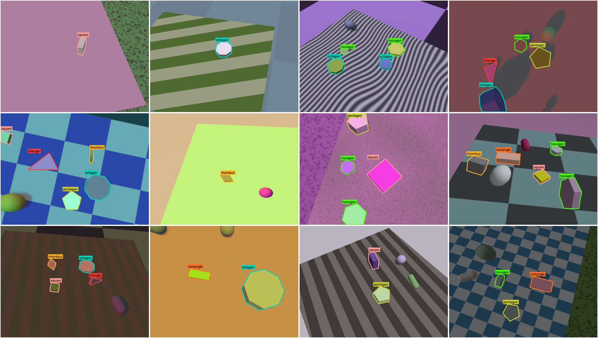
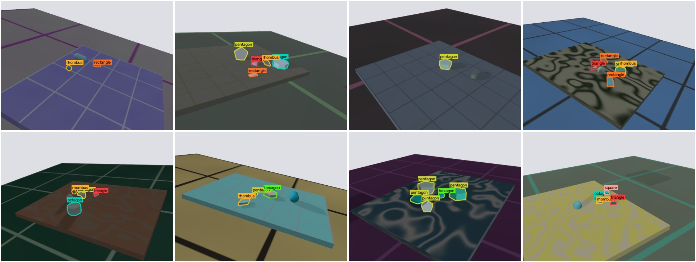
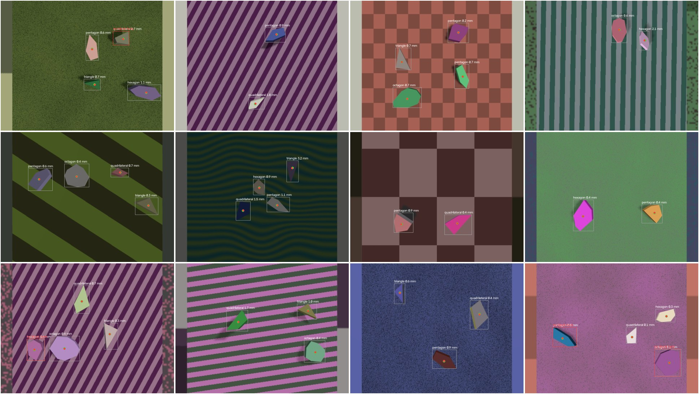

# classification-shapes

A camera looks at blocks on a table and names the shape of each one:
triangle, square, rectangle, rhombus, pentagon, hexagon or octagon. It also
says where each block is in the picture, so that later an arm can be told
"pick up the hexagon" and know where to reach.

Everything runs in simulation. The pictures are rendered in Gazebo, and the
same scripts that place the blocks also write the labels, so no picture is
ever labelled by hand.

```
make data      # render the dataset: 9,000 pictures, about 20 minutes
make preview   # draw the labels onto some pictures, to check them by eye
make train     # train YOLO26s-seg on a random 250 of them, into runs/shapes/
make evaluate  # score it on test and test-unseen, side by side
```



## The problem

Blocks lie on a table. Each block is a flat shape pushed up into a solid,
the way a biscuit cutter makes a biscuit: a hexagon block is a hexagon, some
centimetres thick. For every picture, the job is to find every block and
say which of the seven classes it is.

That sounds easy, and from straight above, on a plain table, in good light,
it is. What makes it a real problem is everything else:

- **The camera looks from an angle.** A square seen from the side is a
  squashed shape that looks like a rhombus or a rectangle. A regular hexagon
  looks irregular.
- **Many corners at a distance.** A far-away octagon is a few dozen pixels
  wide, and its eight corners blur into something like a circle, or a hexagon.
- **Neighbouring classes.** A rectangle that is nearly square, or a rhombus
  whose corners are nearly right angles, is a square to any eye.
- **A block standing on an edge.** Seen from above, a hexagon block standing
  on edge shows only a thin rectangle, its side. Only a view from the side
  shows the hexagon.
- **Everything that is not the shape.** Colour, light, shadow, the pattern on
  the table, other objects lying around. None of these say anything about the
  class, and a model has to learn to ignore all of them.

## What counts as each class

The classes are defined tightly on purpose. Where two classes blur into each
other, a gap is kept between them, so no label is wrong by design.

| Class | Outline | Kept apart from its neighbours by |
| --- | --- | --- |
| triangle | any triangle | every corner at least 35°, so none looks like a line |
| square | four equal sides, four right angles | |
| rectangle | four right angles | long side 1.4 to 2.5 times the short one |
| rhombus | four equal sides | sharp corners between 45° and 72°, never near 90° |
| pentagon | regular, five corners | |
| hexagon | regular, six corners | |
| octagon | regular, eight corners | |

**A block is always thinner than it is wide** (at most 0.6 of its narrowest
width). Without this rule a thick square block is a cuboid whose biggest
faces are rectangles, and nobody could say whether it belongs to "square" or
"rectangle". With it, the two big faces of a block are always its outline,
and the class is never in doubt.

The definitions live in [`synthetic/shapes.py`](synthetic/shapes.py), and the
tests check every one of them.

## Two ways to solve it

The project solves the problem two ways and compares them.

**1. Geometry, with no training.** Separate each block from the table, trace
its outline, simplify the outline to a polygon (OpenCV's `approxPolyDP`), and
count the corners: three is a triangle, five a pentagon, eight an octagon.
Four corners are told apart by their angles and side lengths. This takes an
afternoon to write and needs no data. It is easy to explain when it fails,
and it gives a score to beat.

It is also fragile in exactly the ways listed above. An angled view changes
the angles it measures, a far octagon loses corners, and a patterned table
or a shadow breaks the outline before corners are ever counted.

**2. A trained model: YOLO.** An Ultralytics YOLO model, starting from
pretrained weights and trained on the pictures rendered here. It finds every
block and names its class in one pass, and it learns from examples rather
than rules. So it can learn what a square looks like from 40°, which no
corner-counting rule knows.

The labels are written as outlines (YOLO's segmentation format), which
trains either kind of model:

- a **detection** model gives a box and a class for each block;
- a **segmentation** model also gives the block's outline, which is what an
  arm needs later to find the block's centre and which way it is turned.

Both methods are scored on the same test pictures. The interesting result is
not which is better overall, but *where* each one breaks.

## Training and test data

The pictures come from Gazebo with **domain randomization**: everything that
is not the shape is drawn at random for every picture: size, thickness,
colour, turn, whether the block stands on an edge, the table pattern, the
floor, the lights, the shadows, the camera's distance and angle, and objects
on the table that are not blocks at all. A model trained on this cannot use
any of those things to decide the class, because none of them stays the same
long enough to learn.

[`docs/yolo-classification/dataset.md`](docs/yolo-classification/dataset.md) explains how a picture
is made, every range that is drawn from, and why.

There are four splits:

| Split | Pictures | Drawn from | Used for |
| --- | --- | --- | --- |
| `train` | 6,000 | the normal ranges | training |
| `val` | 1,000 | the normal ranges | choosing when to stop training |
| `test` | 1,000 | the normal ranges | the score |
| `test-unseen` | 1,000 | conditions never trained on | the score that matters |

`test-unseen` uses colours, table patterns, camera distances, camera angles
and lighting that are outside anything in `train`. A model that has
memorised its training pictures does well on `test` and badly here. The gap
between the two scores measures how well it generalises. It is the nearest
thing to a real-world test that simulation can give, but it is not one.



Every picture has its own seed, so any single picture can be rendered again,
and no picture appears in two splits.

## What `make data` writes

```
data/shapes/
├── images/<split>/000123.jpg     the picture, 640 x 480
├── labels/<split>/000123.txt     one line per visible block: class, then its outline
├── masks/<split>/000123.png      which block covers each pixel; where the labels came from
├── scenes/<split>/000123.json    everything that was drawn: every block, the camera, the lights
├── textures/                     the table and floor textures
├── data.yaml                     what YOLO trains on: train, val, test
└── data-unseen.yaml              the same, with test-unseen as the test split
```

The scene files matter for the analysis. They say, for every block, how far
the camera was, from what angle, whether the block stood on an edge and how
many pixels it covered. So a mistake can be traced to its cause: "the model
confuses octagons and hexagons when they are under 400 pixels" rather than
"the model is 91% right".

`make stats` counts the labelled blocks of each class in each split.

## The steps

1. **Synthetic data.** *Done.* A generator that renders labelled pictures
   in Gazebo, with domain randomization and an unseen test set.
2. **Geometry baseline.** Corner counting on the same test pictures, scored
   per class and per condition.
3. **Train YOLO.** *Started: one run on 250 pictures.* Train YOLO26s-seg
   on `train`, or a random part of it, stop on `val`, and score on `test`
   and `test-unseen`; see [`docs/yolo-classification/training.md`](docs/yolo-classification/training.md), and
   [`docs/yolo-classification/results.md`](docs/yolo-classification/results.md) for reading the scores. Compare with
   the baseline: confusion matrices, and accuracy by camera angle, distance,
   block size and standing on an edge.
4. **The arm.** Bring the arm back: it carries the camera, runs the model,
   and turns "the hexagon is at these pixels" into a place on the table to
   reach for. When the model is unsure, as with a block standing on an edge,
   the arm can move the camera and look again.

## Centre of mass

A second task on the same simulator. Blocks are irregular shapes with 3, 4,
5, 6 or 8 sides, the camera looks straight down from a fixed spot, and each
block is labelled with where its centre of mass is. A model trained on these
pictures learns to point at the centre of mass; on the test pictures its
answer is compared with the exact one from geometry.

```
make com-data      # render 250 train, 50 val and 100 test pictures, about 5 minutes
make com-preview   # draw boxes and centre-of-mass points onto some pictures
make com-train     # train YOLO26s-pose, one keypoint per block, into runs/com/
make com-evaluate  # the error in pixels and mm, and the test pictures drawn
```

The first run is done: the model's centre of mass is **0.8 mm** from the true
one on average, against **6.0 mm** for the middle of its own box, and it found
all 298 test blocks.
[`docs/center-of-mass/dataset.md`](docs/center-of-mass/dataset.md) explains the
pictures and labels,
[`docs/center-of-mass/training.md`](docs/center-of-mass/training.md) the model
and its settings, and
[`docs/center-of-mass/results.md`](docs/center-of-mass/results.md) reads the
run number by number.



## Layout

```
v4-classification-shapes/
├── Makefile                     the one entry point
├── pixi.toml                    the environment: Gazebo, its Python bindings, OpenCV, Ultralytics
├── docs/
│   ├── yolo-classification/     finding and naming the shapes
│   │   ├── dataset.md           what the files are, where labels come from, what is randomized
│   │   ├── training.md          the model, its settings, and why
│   │   └── results.md           how to read the scores, plots and pictures a run writes
│   └── center-of-mass/
│       ├── dataset.md           irregular shapes and their centre-of-mass labels
│       ├── training.md          the pose model, its settings, and how it is scored
│       └── results.md           what the first run scored, and how to read a run
├── synthetic/                   the data generator
│   ├── shapes.py                what each class is, as an outline
│   ├── randomization.py         drawing a random scene; every range lives here
│   ├── textures.py              patterns for the table and floor
│   ├── sdf.py                   a scene written as Gazebo models
│   ├── world.sdf                the room: lights, and the two cameras
│   ├── gazebo.py                running Gazebo headless and taking pictures
│   ├── labels.py                label mask to YOLO outlines
│   ├── generate.py              one split, start to finish
│   ├── preview.py               labels drawn on pictures, to check by eye
│   └── stats.py                 how many blocks of each class
├── training/                    training and scoring the model
│   ├── settings.py              every training setting
│   ├── subset.py                a random part of each split, for a quick run
│   ├── train.py                 one training run, into runs/
│   └── evaluate.py              scores on test and test-unseen
├── center_of_mass/              the centre-of-mass dataset, rendered with synthetic/
│   ├── polygons.py              irregular outlines and their limits
│   ├── scene.py                 a random scene, the fixed camera, the projection
│   ├── generate.py              one split, start to finish
│   ├── preview.py               boxes and points drawn on pictures
│   ├── stats.py                 counts, and the points checked against the masks
│   ├── settings.py              every training setting
│   ├── train.py                 one training run, into runs/
│   ├── scoring.py               matching guesses to blocks, and the error of each
│   ├── evaluate.py              the score on test, and the pictures drawn
│   └── predict.py               the model run on any pictures
├── tests/                       tests that need no simulator
└── figures/
```

The generator talks to Gazebo directly through its Python bindings, not
through ROS. Nothing in making pictures needs ROS, and leaving it out keeps
the environment small. ROS comes back in step 4, with the arm.
