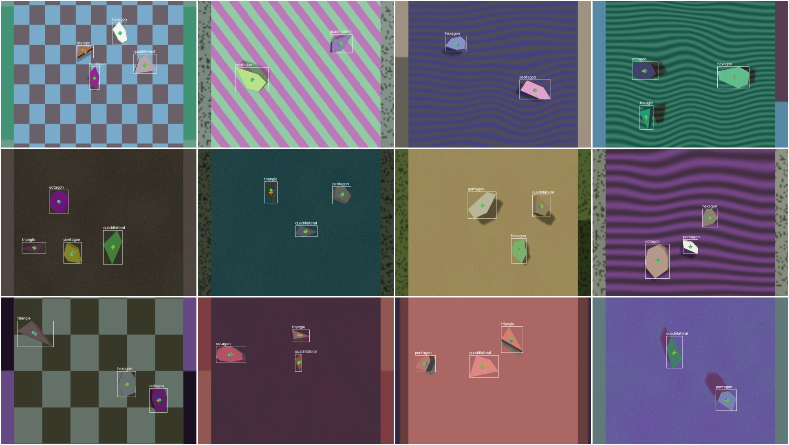
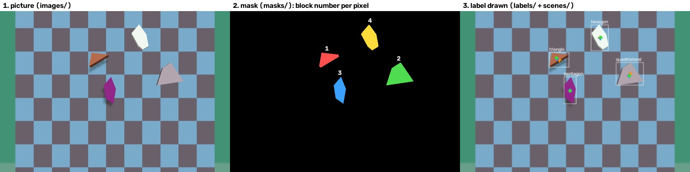

# The centre-of-mass dataset

Pictures of irregular blocks on a table, each block labelled with where its
centre of mass is. It is for training a model that looks at a picture and
points at the centre of mass of every block, with no geometry of its own.

This is a learning exercise. Geometry can already find the centre of mass
from a clean outline, exactly. The question here is how close a model gets
by learning from examples, and the test split is where the two are compared.

Short version: Gazebo renders 400 pictures from a camera straight above the
table. Each block is a random irregular shape with 3, 4, 5, 6 or 8 sides. Its
true centre of mass is worked out from the outline it was built from, and
marked as a point in the picture.

```
make com-data      # render train, val and test, then print the checks, about 5 minutes
make com-preview   # draw boxes and points onto 12 train pictures
make com-stats     # the counts and checks again
```

[`training.md`](training.md) covers the model trained on these pictures, and
[`results.md`](results.md) what it scored.

## The numbers

| Split | Pictures | Used for |
| --- | --- | --- |
| `train` | 250 | training: the model learns from these |
| `val` | 50 | checked during training, to decide when to stop |
| `test` | 100 | the result: model against geometry |

- **Blocks per picture:** 2 to 4, about 3 on average.
- **Classes:** picture n starts with class n, then n + 1, round the list. So
  each class leads 50 of the 250 train pictures, and all five turn up about
  equally often.
- **No two blocks overlap**, and every block is fully inside the picture.

## Why irregular

For a regular shape, the centre of mass is also the middle of its corners and
the middle of its bounding box. A model could find the box, point at its
middle, and look right without learning anything about mass.

For an irregular shape those three points come apart. The long side of a
lopsided pentagon pulls the centre of mass towards it. Only a model that has
learned where the area of the shape is lands on the right point.

The triangle is the exception: its centre of mass is always the middle of its
three corners, even when irregular. It is still in the set, as the easy case.
It is still not the middle of its box.

## The shapes

| Class | Sides |
| --- | --- |
| triangle | 3 |
| quadrilateral | 4 |
| pentagon | 5 |
| hexagon | 6 |
| octagon | 8 |

Every shape keeps to these limits, in
[`center_of_mass/polygons.py`](../../center_of_mass/polygons.py):

| Limit | Value | Reason |
| --- | --- | --- |
| convex | always | a shape with a dent can have its centre of mass outside the block, where no arm can hold it |
| longest side ÷ shortest | 1.6 to 3 | a long side can be three times a short one; at least 1.6, so no shape comes out nearly regular by chance |
| every corner | 30° to 160° | sharper is a spike; flatter barely shows, and a hexagon with such a corner looks like a pentagon |
| widest corner − sharpest | at least 25° | the corners are uneven too, not only the sides |
| widest distance across | 7 to 14 cm | the same meaning of size for every class, so size says nothing about the class |
| height | 1 to 6 cm, drawn on its own | not tied to the outline, so a small block can be tall and a big one flat; see below |

Seven sides are left out. An irregular heptagon and an irregular octagon are
hard to tell apart even by eye, and five classes fit 50 pictures each into
250.

A shape is made by placing its corners roughly where a regular shape's would
be, moving each by a random amount in direction and in distance from the
middle, stretching the whole shape one way by up to 2.5 times, and keeping
the result only if it passes every limit above. The stretch is what gives
long, narrow shapes; without it most shapes come out roughly round.

Octagons pass least often, about one try in a thousand, and are still the
roundest class: eight corners, none flatter than 160°, leave little room to
be lopsided while staying convex.

A block's height is drawn separately from its outline, evenly between 1 and
6 cm. In `train` the middle 80% of blocks are 1.5 to 5.4 cm tall. Height
changes the picture in two ways the model has to see past: a taller block's
top face is nearer the camera, so it looks bigger, and away from the middle
of the picture the camera sees more of its sides.

## The camera

Fixed, 70 cm straight above the middle of the table, looking down. It never
moves. The picture is 640 × 480, and a block is 55 to 115 pixels across at
its widest.

From straight above, the top face of a block is seen without any slant, so its shape in the picture is its true shape, only scaled. That is
what lets geometry work on the test split without any correction for
perspective.

## Everything else changes

Colours, table and floor patterns, the two lights and shadows are drawn from
the same ranges as the classification dataset; see
[`../yolo-classification/dataset.md`](../yolo-classification/dataset.md).
Each block is turned to a random angle and placed at a random spot. Nothing
but the blocks is on the table: no decoys.

## The label

One line per block, in YOLO's pose format:

```
<class> <box x> <box y> <box width> <box height> <point x> <point y> 2
```

Every number after the class is divided by the picture's width or height, so
it runs from 0 to 1. The final 2 means the point is visible.

**The box** comes from the segmentation camera's mask: the smallest box around
the block's pixels.

**The point** is the true centre of mass, worked out this way:

1. The outline the block was built from is a list of corners. The centroid
   of the area inside them is the centre of mass of a flat shape of even
   material (`polygon_centroid` in `synthetic/shapes.py`).
2. Every outline is built centred on that centroid. So after the block is
   turned and placed, its centre of mass is exactly at its position on the
   table, half its thickness up.
3. The point straight above it on the top face is projected through the
   camera into the picture (`project` in
   [`center_of_mass/scene.py`](../../center_of_mass/scene.py)).

The label uses the point on the top face rather than the true centre of mass
inside the block, because the top face is what the camera sees. The two are
on the same vertical line, so on the table they are the same place. In the
picture they are about 4 pixels apart on average, and up to 12 for a tall
block near the edge of the picture, where the camera sees the line at a
slant. The true point in
the table's coordinates is kept in the scene file too.

## The checks

A label can be wrong in a way no test catches: the projection could put the
point a few pixels off, or mirrored. Two checks look at the rendered
pictures themselves.

**Label against mask.** From straight above, the middle of a block's mask is
nearly the middle of its top face, so it should nearly meet the labelled
point. `make com-stats` prints the distance between them: about 3 pixels on
average in every split, and up to 10. For 99% of blocks the gap points
towards the middle of the picture, and it is biggest for tall blocks near
the edges. That is the block's sides: away from the middle the camera sees
them, and they are lower than the top face, so they pull the mask's middle
inwards. Averaged over all 740 train blocks the gap has no direction of its
own (under 0.2 pixel), so the projection is not shifted.

**Box centre against label.** How far the middle of the box is from the
centre of mass. This is how wrong a model would be that only learned to find
boxes: about 5 pixels on average, up to 19. `make com-stats` prints it too.

| Split | Pictures | Blocks | triangle | quadrilateral | pentagon | hexagon | octagon |
| --- | --- | --- | --- | --- | --- | --- | --- |
| `train` | 250 | 740 | 143 | 147 | 151 | 145 | 154 |
| `val` | 50 | 146 | 30 | 29 | 27 | 28 | 32 |
| `test` | 100 | 298 | 56 | 57 | 60 | 64 | 61 |

**By eye.** `make com-preview` draws, on each block:

- a white box, and the class name;
- a **green dot**: the labelled centre of mass;
- a **blue cross**: the middle of the mask;
- an **orange cross**: the middle of the box.

Green and blue should sit close together, a few pixels apart on tall blocks
for the reason above. Orange is often off to one side, which is the point of
irregular shapes.



## One picture, file by file

Picture `000000` of `train`, and what each of its four files holds.



**1. The picture**, `images/train/000000.jpg`. What the camera sees: four
blocks on a checked table. This is the only file the model gets as input.

**2. The mask**, `masks/train/000000.png`. A second camera in the same spot
renders the same view, but paints every pixel with a number instead of a
colour: 0 where there is no block, 1 wherever block 0 is, 2 wherever block 1
is, and so on. Opened as an ordinary picture it looks black, because 1 to 4
are almost black; the figure colours them. Counting the pixels of each
number gives how much of each block shows:

| Number in the mask | Block | Pixels |
| --- | --- | --- |
| 0 | none: table and floor | 299,602 |
| 1 | block 0, triangle | 1,266 |
| 2 | block 1, quadrilateral | 2,713 |
| 3 | block 2, pentagon | 1,598 |
| 4 | block 3, hexagon | 2,021 |

The mask is used for two things: the box around each block, and the check
that the labelled point lands on the block. It is never used to work out the
centre of mass.

**3. The label**, `labels/train/000000.txt`. One line per block, which is
what YOLO trains on:

```
0 0.430469 0.348958 0.085938 0.085417 0.418987 0.336185 2
1 0.739062 0.430208 0.118750 0.131250 0.736405 0.439788 2
2 0.478125 0.525000 0.053125 0.154167 0.478380 0.526072 2
3 0.607812 0.218750 0.075000 0.150000 0.611344 0.217467 2
```

The first line, read column by column:

| Value | Meaning | In pixels |
| --- | --- | --- |
| `0` | class 0, triangle | |
| `0.430469` | middle of the box, across | × 640 = 275.5 |
| `0.348958` | middle of the box, down | × 480 = 167.5 |
| `0.085938` | box width | × 640 = 55 |
| `0.085417` | box height | × 480 = 41 |
| `0.418987` | **centre of mass, across** | × 640 = 268.2 |
| `0.336185` | **centre of mass, down** | × 480 = 161.4 |
| `2` | the point is visible | |

The centre of mass is the last pair of numbers before the 2. Here it is 7
pixels left of and 6 pixels above the middle of the box: the triangle's area
is not where its box is centred.

**4. The scene**, `scenes/train/000000.json`. Everything that was drawn, so
the picture can be traced and rendered again. It is not used for training.
Its parts:

| Key | What it holds |
| --- | --- |
| `blocks` | every block: class, corners, height, position on the table, turn, colour, shine |
| `distractors` | always empty here |
| `table`, `floor` | pattern, texture number, colour |
| `camera` | position and angles; the same in every picture |
| `sun`, `fill` | each light's direction, colour, and whether it casts shadows |
| `visible` | the labelled blocks, in the same order as the label file |

Block 0, the triangle, as the scene records it:

```json
{"shape": "triangle",
 "outline": [[0.0394, -0.011], [-0.0049, 0.0228], [-0.0345, -0.0117]],
 "thickness": 0.048, "position": [0.0925, 0.0610], "yaw": -1.037, ...}
```

`outline` is its three corners in metres, centred on its own centre of mass,
before it is turned. `thickness` is its height: 4.8 cm, a tall block, which
is why its dark side shows in the picture. `position` is where on the table
its centre of mass is, and `yaw` how far it is turned, in radians.

And its entry in `visible`:

```json
{"block": 0, "shape": "triangle", "pixels": 1266, "box": [248, 147, 55, 41],
 "centre_of_mass": [0.0925, 0.0610, 0.0240], "point": [268.15, 161.37]}
```

`centre_of_mass` is the true centre of mass on the table in metres: the
block's position, and half its height up. `point` is the spot on the top
face straight above it, in pixels; divided by 640 and 480 it is the last
pair in the label line. `box` is x, y, width, height in pixels, from the
mask.

## The files

Everything is under `data/center-of-mass/`:

```
images/<split>/000123.jpg     the picture, 640 x 480
labels/<split>/000123.txt     one pose line per block
masks/<split>/000123.png      which block covers each pixel; where the boxes came from
scenes/<split>/000123.json    everything drawn, and for each block its true centre of mass
textures/                     the table and floor textures
data.yaml                     what YOLO trains on, with kpt_shape [1, 3]
```

In a scene file, `visible` has one entry per labelled block, in the same
order as the label file:

| Field | Meaning |
| --- | --- |
| `block` | which block in `blocks` it is |
| `shape` | its class |
| `pixels` | how many pixels its mask covers |
| `box` | x, y, width, height in pixels |
| `centre_of_mass` | x, y, z on the table in metres |
| `point` | the labelled point in pixels |

Every picture has its own seed, made from the split, `SEED` and the picture's
number, so any picture can be rendered again on its own.

## The code

| File | What it does |
| --- | --- |
| [`polygons.py`](../../center_of_mass/polygons.py) | the irregular outlines and their limits |
| [`scene.py`](../../center_of_mass/scene.py) | one random scene, the fixed camera, and the projection |
| [`generate.py`](../../center_of_mass/generate.py) | one split: render, then write pictures, labels and scene files |
| [`preview.py`](../../center_of_mass/preview.py) | boxes and points drawn on pictures |
| [`stats.py`](../../center_of_mass/stats.py) | counts per class, and the two checks |

The rendering is the classification dataset's, unchanged: `synthetic/gazebo.py`
runs the simulator, `synthetic/sdf.py` writes the models. `make test` covers
the shapes, the scenes and the projection without the simulator, in
`tests/test_center_of_mass.py`.
