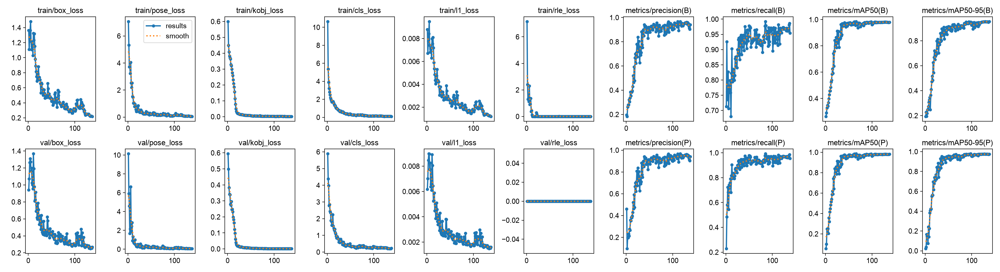
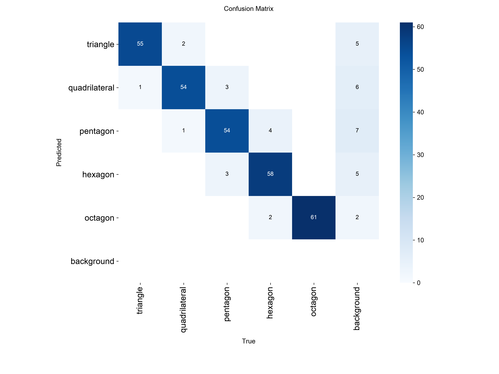

# The first run, and how to read one

What the first full training run scored, what each number means, and what is
worth looking at when the next run finishes.

The run: `make com-train` with everything at its default — YOLO26s-pose, 250
training pictures, 50 for val. It was set to 150 epochs and stopped itself at
138, because val had not improved for 40 epochs. The best epoch was 98. It
took 49 minutes on an M5 Mac. Scored with `make com-evaluate` on the 100
test pictures, 298 blocks, which the model never trained on.

## The result in one line

**The model's centre of mass is 0.8 mm from the true one on average, and the
middle of its box is 6.0 mm.**

That gap is the whole point. A model that had only learned to find blocks
would score the second number. This one is about seven times closer, so it
has learned where a block's mass is, not only where the block is.

## Every block found

| | |
| --- | --- |
| blocks in the test pictures | 298 |
| found by the model | 298 |
| named with the right class | 285 (96%) |
| guesses that matched no block | 19 |

The 19 are not blocks invented out of nothing. Every one of them sits on a
real block, overlapping it almost exactly, but a surer guess had already
taken that block. They are second names for a block the model had already
found: a pentagon also called a hexagon, for instance. The surer guess is
the one scored. Raising the confidence threshold above 0.25 would drop most
of them.

## How far off the point is

Distances from the model's point to the true centre of mass. **mm** is the
distance on the table, which is what an arm needs; **pixels** is the same
error in the picture.

| | mean | median | 90% | worst |
| --- | --- | --- | --- | --- |
| model, mm | **0.8** | 0.7 | 1.4 | 6.8 |
| model, pixels | 0.7 | 0.6 | 1.2 | 5.8 |
| box centre, mm | 6.0 | 5.4 | 11.6 | 22.0 |
| box centre, pixels | 5.0 | 4.4 | 9.8 | 19.0 |

Under one pixel on average. The blocks are 55 to 115 pixels across, so the
error is well under a fiftieth of a block.

## By shape

| Shape | Blocks | Found | Right class | mean mm | median | 90% | worst | box centre, mean mm |
| --- | --- | --- | --- | --- | --- | --- | --- | --- |
| triangle | 56 | 56 | 56 | 1.1 | 0.7 | 2.8 | 6.8 | 9.8 |
| quadrilateral | 57 | 57 | 54 | 0.9 | 0.8 | 1.7 | 2.3 | 6.0 |
| pentagon | 60 | 60 | 54 | 0.8 | 0.7 | 1.2 | 3.8 | 5.6 |
| hexagon | 64 | 64 | 60 | 0.7 | 0.6 | 1.3 | 2.3 | 4.9 |
| octagon | 61 | 61 | 61 | 0.6 | 0.6 | 1.1 | 1.7 | 3.9 |

The order is the same in both directions, and it is the order the dataset
predicts:

- **Triangles** are the most lopsided shapes, so their box centre is
  furthest from the truth (9.8 mm) and the model gains the most. They are
  also its hardest class: 1.1 mm on average, and the worst block in the
  whole test set, 6.8 mm, is a long thin triangle.
- **Octagons** are nearly round, so the box centre is already close
  (3.9 mm) and there is little for the model to learn. It still halves the
  error six times over.

The classes it confuses are pentagon and hexagon, which lose 6 and 4 blocks
to each other. That costs nothing here: the point is still scored, and the
error for those blocks is among the smallest. Naming was never the job.

## Ultralytics' own scores

| Score | Value | What it says |
| --- | --- | --- |
| box mAP50 | 0.982 | finding the blocks |
| box mAP50-95 | 0.949 | finding them with a tight box |
| pose mAP50 | 0.982 | the point, at the looser distance |
| pose mAP50-95 | 0.972 | the point, at every distance up to the strictest |

`pose mAP50-95` is the one to watch. It uses the same sigma as the loss
(0.05, see [`training.md`](training.md)), so at its strictest setting a point
a few pixels off already counts as wrong. 0.972 means almost every point is
within a pixel or two.

These scores are worth less than the millimetre table above, because they
mix finding blocks, naming them and placing the point into one number.
`evaluation.json` keeps them apart.

## The pictures

Green is the true centre of mass, red is the model's, and the label gives the
error in millimetres. At this size the two dots sit on top of each other for
most blocks. Every test picture is drawn this way in
`runs/com/test-pictures/`.

Worth doing by eye after a run: sort that folder by the errors in
`evaluation.json`, open the worst few, and see whether the red dot is off in
one direction (a bias worth fixing) or just scattered (the limit of the
model's precision).

## Training curves

Read the two keypoint lines:

- **`train/pose_loss` and `val/pose_loss`** fall together. They ended at
  0.052 and 0.055, close to each other, so the model did not memorise the
  250 training pictures.
- **`metrics/mAP50-95(P)`** rises quickly to about 0.95 by epoch 50 and then
  creeps up to 0.978 at epoch 98. The last 40 epochs added nothing, which is
  what stopped the run.

`rle_loss` drops to 0 early and stays there. That is YOLO26's extra
keypoint-uncertainty loss, which switches itself off once the model's points
are confident.

If a future run's val loss rises while the train loss keeps falling, that is
overfitting, and the answer is more pictures rather than more epochs.

## Confusion matrix

Only about naming, not about the point. The pentagon–hexagon square is the
one with anything in it.

## What this run does not tell you

- **It is the same kind of picture as training.** Colours, table patterns,
  sizes and heights all come from the ranges the training pictures came
  from. There is no unseen test set here, as there is for the
  classification task, so 0.8 mm is a best case.
- **Nothing is hidden.** No block overlaps another, and none is cut off by
  the frame. This is where a learned model was supposed to beat geometry,
  and it has not been tested.
- **The point is flat.** 0.8 mm is a distance in the picture, turned into
  millimetres with the block's true thickness from its scene record. The
  model gives no height of its own; see
  [no height](training.md#no-height).
- **It is simulation.** Gazebo's lighting and textures are not a real table.

## Where the files are

| File | What it holds |
| --- | --- |
| `runs/com/evaluation.json` | every number on this page |
| `runs/com/test-pictures/` | all 100 test pictures with both points drawn |
| `runs/com/test-samples.jpg` | the first 12 of those on one sheet |
| `runs/com/results.csv` | one row per epoch |
| `runs/com/test/` | Ultralytics' plots and confusion matrix for the test split |
| `runs/com/weights/best.pt` | the model, from epoch 98 |

The figures on this page are copies of that run's own files.
