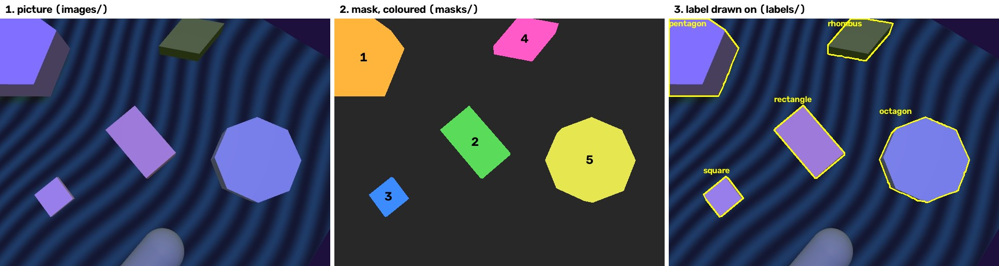

# The dataset

What the dataset holds, what each file is for, where the labels come from,
and why every picture looks different.

Short version: Gazebo takes 9,000 pictures of shape blocks on a table.
Everything except the shape changes from one picture to the next. A second
camera in the same spot records which pixels belong to which block, and that
record becomes the labels. Nobody labels anything by hand.

## The numbers

| Split | Pictures | Labelled blocks | Used for |
| --- | --- | --- | --- |
| `train` | 6,000 | 17,637 | training: the model learns from these |
| `val` | 1,000 | 2,992 | checked during training, to decide when to stop |
| `test` | 1,000 | 3,002 | the score, in the same kind of conditions as training |
| `test-unseen` | 1,000 | 3,052 | the score, in conditions training never had |
| **total** | **9,000** | **26,683** | |

- **Blocks per picture:** 1 to 5, about 3 on average. In `train`, each count
  from 1 to 5 covers about a fifth of the pictures.
- **Shapes:** all seven are about equally common, about 2,500 of each in
  `train` and about 430 in each of the other splits.
- **Standing on an edge:** 20% of the blocks, in every split.
- **Decoys:** 0, 1 or 2 per picture, about a third of pictures each.
- **Block size in the picture:** the typical block covers about 2,600 pixels
  in `train` (about 50 × 50). In `test-unseen` it is 660 pixels (about
  25 × 25), because the camera there is farther away.
- **Blocks placed but not labelled:** 142 of the 17,779 placed in `train`.
  They were hidden, outside the frame, or smaller than 40 pixels. See
  [Blocks too small to label](#blocks-too-small-to-label).

`make stats` prints the per-shape counts again from the files on disk.

## The files

Everything is under `data/shapes/`. One picture has one file in each of the
first four folders, all with the same number:

```
data/shapes/
├── images/train/000115.jpg     the picture
├── labels/train/000115.txt     the answers: shape and outline of each block
├── masks/train/000115.png      which block covers each pixel
├── scenes/train/000115.json    everything that was chosen for this picture
├── textures/                   patterns painted on the table and floor
├── data.yaml                   tells YOLO where train, val and test are
└── data-unseen.yaml            the same, with test-unseen as the test split
```

This one figure shows the first three for the same picture:



### `images/`: the picture

A 640 × 480 JPEG from the normal camera. This is the only thing the model
ever sees, in training and when it runs.

### `labels/`: the answers

A text file with one line for each block that can be seen:

```
4 0.000000 0.000000 0.000000 0.312500 0.151562 0.312500 0.165625 0.268750 ...
```

- **The first number is the shape:** 0 triangle, 1 square, 2 rectangle,
  3 rhombus, 4 pentagon, 5 hexagon, 6 octagon.
- **The rest are the corners of the block's outline** in the picture, as
  x, y pairs. They are fractions of the picture's size, so `0.5 0.25` means
  halfway across and a quarter of the way down.

This is YOLO's segmentation format. A detection model trains on the same
file: YOLO puts a box around the outline itself.

During training, YOLO reads `images/` and `labels/` and nothing else.

### `masks/`: where the labels came from

A PNG the same size as the picture. Each pixel holds a number:

- **0** for anything that is not a block: table, floor, decoys, sky.
- **1** for the first block in the scene, **2** for the second, and so on.

Open one in an image viewer and it looks all black, because 1 to 5 are
almost black on a 0 to 255 scale. The middle of the figure above shows the
same mask with each number given its own colour. The capsule at the bottom
of the picture is a decoy, so it is 0 in the mask and has no label.

The mask is not used for training. It is kept so that a label that looks
wrong can be checked against the pixels it came from.

### `scenes/`: the record of what was chosen

A JSON file with every random choice made for the picture:

- **`blocks`**: for each block, its shape, exact corners, thickness, whether
  it stands on an edge, position on the table, turn, colour and shininess.
- **`distractors`**: the decoys, with their kind, size, position and colour.
- **`table`** and **`floor`**: pattern, which texture, and colour.
- **`camera`**: where it is and which way it points.
- **`sun`** and **`fill`**: the two lights, with direction, colour and
  whether they cast shadows.
- **`visible`**: which blocks got a label, with the pixels each one covers
  and its box.

These files are not used for training either. They are for the analysis
afterwards. They let a result be split by cause: "octagons under 400 pixels
are confused with hexagons", or "accuracy drops when the camera is below
45°", instead of one overall score.

### `textures/`

300 images, 50 each of wood, checker, speckle, stripes, tiles and marble.
The generator paints them onto the table and the floor. Tiles and marble are
only used in `test-unseen`.

### `data.yaml` and `data-unseen.yaml`

Small files that tell YOLO where the picture folders are and what each shape
number is called. They are the same except for the test split:
`data.yaml` points at `test`, `data-unseen.yaml` at `test-unseen`.

## How a label is made

The labels are what the model learns from, so this part matters most.

### Two cameras in one place

The Gazebo world has one camera model carrying **two sensors**:

- **`rgb`**, a normal camera. It takes the picture.
- **`segmentation`**, which sees no colour, light or texture. It paints every
  pixel with the number of the block that covers it, or 0.

Both are on the same part of the same model, with the same lens (60° wide)
and the same 640 × 480 size. Before each picture the generator moves that
one model to a new random position, so both sensors always move together and
see exactly the same view. A pixel in the mask lines up with the same pixel
in the picture. The camera is never fixed in one place: every picture has its
own camera position.

### Numbering the blocks

When the generator puts block number `i` into Gazebo, it gives that block
the label `i + 1`. The segmentation sensor paints that number. The table,
floor and decoys get no label, so they come out as 0.

### From mask to label line

For each block in the scene, `labels.py`:

1. **Takes its shape from the scene.** The generator chose the shape when it
   made the block, so block 1 in scene 000115 is a pentagon because the
   program built a pentagon there. The shape is known, not guessed.
2. **Finds its pixels in the mask.** These are all the pixels holding the
   block's number.
3. **Skips it if it covers fewer than 40 pixels.**
4. **Traces the edge** of those pixels with OpenCV and cuts the outline down
   to its corners. The corners stay within 0.7 pixels of the true edge.
5. **Writes the line:** the shape number, then the corners as fractions of
   the picture's size.

So the **shape** comes from what the program built, and the **outline**
comes from what the camera saw.

### Why the outline is not worked out from geometry

The program knows where every block is in 3D and where the camera is, so it
could project each block's corners onto the picture itself. It does not,
because what the camera sees is not simply the block's corners:

- **A block can be partly hidden** behind another block. The mask shows only
  the part that can be seen. Projected corners would draw the whole block.
- **A block can run off the edge of the picture.** The mask cuts it at the
  edge.
- **A block is solid, not flat.** Seen from an angle its side shows too, and
  the outline the camera sees is the top plus the side. The mask has this
  already.
- **The projection has to match the renderer exactly.** Any small difference
  in the lens or in which way the camera is turned would move every label
  off its block. The mask comes from the renderer itself, so there is
  nothing to match.

### Waiting for the scene to settle

Gazebo does not apply a change at once. The generator asks for a new scene,
Gazebo says "done", and the new scene actually shows one render later. A
picture taken straight away can show the old scene while the labels
describe the new one, and no test would catch it. This happened in about
one picture in five.

So the world stays paused and the generator moves it forward one render at
a time. A picture is kept only when two renders in a row give exactly the
same mask. The first render after a change is never kept.

### Checks

- **Stray numbers.** If the mask holds a number that no block in the current
  scene has, the picture is from some other scene, and the generator stops.
- **Looking at them.** `make preview` draws the labels back onto pictures and
  saves them in `figures/`. A label that is shifted, flipped or on the wrong
  block is easy to see there, and no test would catch it.

### Blocks too small to label

A block covering fewer than 40 pixels (about 6 × 6) gets no label, even
though it may show in the picture. That happens when it is far away, mostly
hidden, or mostly outside the frame. There is too little of it to name a
shape, and a label the model cannot get right teaches it nothing.

## Domain randomization: why every picture looks different

### The idea

A model learns anything that tells the classes apart in its training
pictures, whether or not it has anything to do with the shape. If every
hexagon in training were blue, the model would learn "blue means hexagon".
It would score well on pictures made the same way and fail on the first red
hexagon.

A simulator makes this easy to get wrong, because it does exactly what it is
told: the same light, the same table, the same camera height, every time.

Domain randomization changes everything that should not matter, at random,
for every picture: colour, size, light, table, camera angle. Once all of
that keeps changing, the only thing that still tells a hexagon from an
octagon is its shape, so that is what the model has to learn.

It also helps with real photos later. A model that has seen hundreds of
tables, lights and camera angles has a better chance of treating a real
table as one more.

### What changes in every picture

All the ranges live in `Ranges` in
[`synthetic/randomization.py`](../../synthetic/randomization.py). The
"Unseen" column is only for `test-unseen`. A blank there means the same as
training.

**The blocks**

| What | Training | Unseen | Why |
| --- | --- | --- | --- |
| Shape | the 7 shapes, equally likely | | no shape is rarer to learn |
| Blocks per picture | 1 to 5 | | the arm will see several at once, some close together |
| Size (widest distance across) | 4 to 12 cm | | size must not give the shape away |
| Exact outline | triangle angles, rectangle length, rhombus angle vary within the class | | a class is a family of outlines, not one template |
| Thickness | 0.15 to 0.6 of its narrowest width | | thick blocks show tall sides from an angle |
| Turn on the table | any angle | | a square is a square at any turn |
| Standing on an edge | 1 block in 5 | | the hard case: from above, only a thin strip shows |
| Colour | any hue except teal and cyan | teal and cyan only | a model that learned colour fails on a new one |
| Colour strength | grey to full colour | | a grey block on a grey table has to be found by shape |
| Brightness | dark to bright | | dark blocks show little edge |
| Shininess | matte to fairly shiny | | highlights can hide an edge |

Blocks are placed in one area of the table, so the camera can see most of
them, with at least 1 cm between any two things. A block only stands on an
edge it would not tip over from.

**The decoys**

| What | Range | Why |
| --- | --- | --- |
| How many | 0 to 2 per picture | the model must learn that not every object is a block |
| Kind | ball, capsule, egg shape | all round, so none looks like one of the 7 shapes |

These are the round objects in the pictures. They have no label and read 0
in the mask. Without them the model could learn that anything on the table
is a block.

**The table and the floor**

| What | Training | Unseen | Why |
| --- | --- | --- | --- |
| Table | plain, wood, checker, speckle, stripes | tiles, marble | checker and stripes have straight edges and corners that are not blocks |
| Floor | plain, speckle, checker | tiles | the floor shows past the table's edge when the camera is low |
| Colour | any hue, muted | | |

Each patterned surface uses one of 50 fixed textures for its pattern. A new
texture for every picture would mean thousands of files, and Gazebo keeps
every texture it loads in memory. Each texture is seen under many lights
and from many angles, so no two pictures look alike.

**The camera**

| What | Training | Unseen | Why |
| --- | --- | --- | --- |
| Distance to the blocks | 0.3 to 0.9 m | 0.9 to 1.3 m | far blocks are small, and shapes with many corners blur |
| Height angle | 35° to 90° (90° is straight down) | 22° to 35° | the lower the camera, the more squashed a shape looks |
| Side of the table | any | | |
| Tilt | ±15° | | a camera on the arm's wrist is rarely level |
| Aim | middle of the blocks, ±6 cm | | blocks are not always centred, and some get cut off |
| Sensor noise | small | | every real camera has some |

**The lights**

There are two: a sun, and a weaker fill light that softens the dark side.

| What | Training | Unseen | Why |
| --- | --- | --- | --- |
| Sun height | 25° to 90° | 12° to 25° | low sun gives long shadows, and a shadow has an outline too |
| Sun strength | 0.5 to 1.2 | 0.3 to 0.6 | edges are weak in dim pictures |
| Sun casts shadows | 4 pictures in 5 | | shadows join blocks together and change their outline |
| Fill light strength | 0 to 0.5, no shadows | | how dark the shaded sides are |
| Light colour | warm to cool | | the same colour looks different under different light |

### What never changes

Each of these is something the model could still learn by accident, and a
way these pictures differ from real photos:

- **The lens.** Always 60° wide, 640 × 480, with no distortion.
- **Perfect blocks.** Sharp edges, flat faces, one colour each. Real blocks
  have rounded edges, grain, chips and dirt.
- **The renderer.** Gazebo is not photorealistic. There is no blur, no motion
  blur and no exposure change. YOLO's own training changes some of this.
- **The room.** Only a table and a floor, with no walls, windows or clutter.
- **How blocks lie.** Flat or on an edge, never leaning or stacked.

If a model does well on `test-unseen` and badly on real photos, look here
first.

## The unseen test set

`test-unseen` changes several things at once: new colours, new table and
floor patterns, a farther and lower camera, and dimmer, lower light. A model
that has memorised its training pictures does well on `test` and badly here.
The gap between the two scores shows how well it generalises.

It says whether the model generalises, not which change hurts it. For that,
split the score by the `scenes/` records: camera distance, height angle,
block size, light. No new pictures are needed.


## Making it again

```
make data      # every split, about 20 minutes
make split SPLIT=val COUNT=200
make preview   # draw labels onto some pictures, into figures/
make stats     # count the blocks of each shape in each split
```

Each picture has its own random seed, made from its split, `SEED` and its
number. The same picture always comes out the same, and no two splits share
a scene.

The generator runs Gazebo with no window and makes about 8 pictures a
second on an M-series Mac. Gazebo's memory grows by about 0.4 MB per picture
and is never freed, so a fresh server starts every 1,500 pictures. Once in
several thousand pictures Gazebo stops answering. The generator then tries
the same picture on a fresh server, and stops only if it fails three times
in a row.
