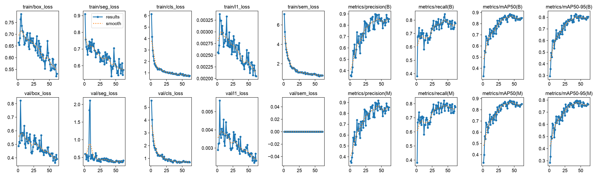
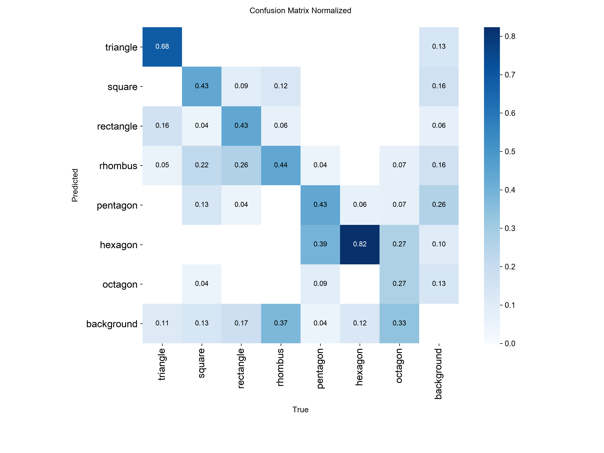
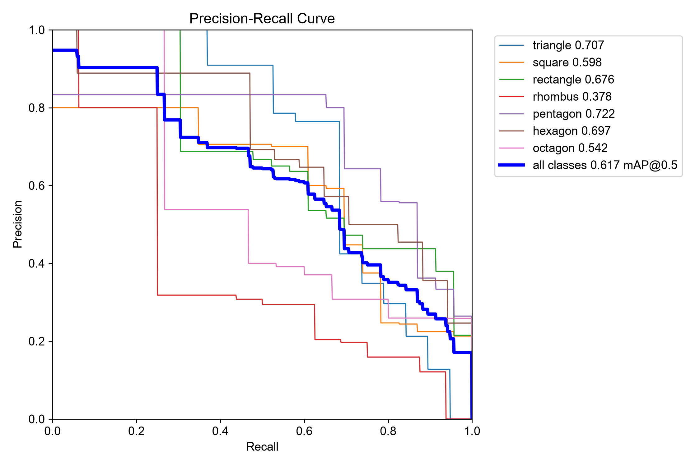
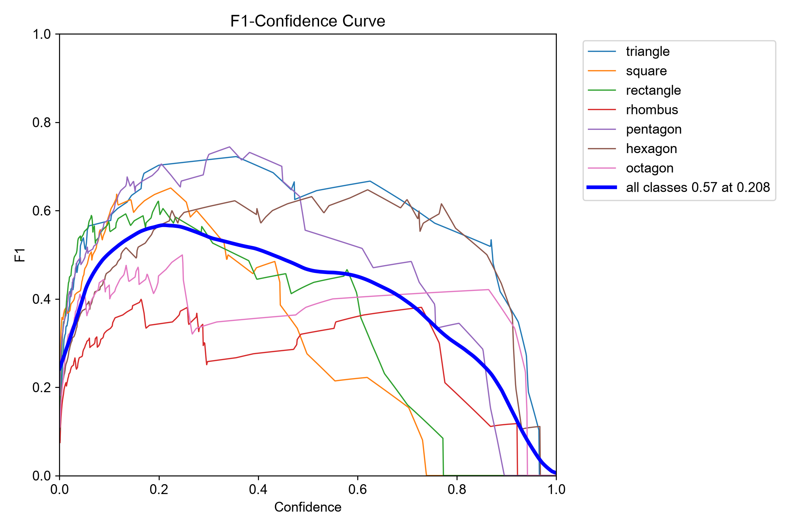
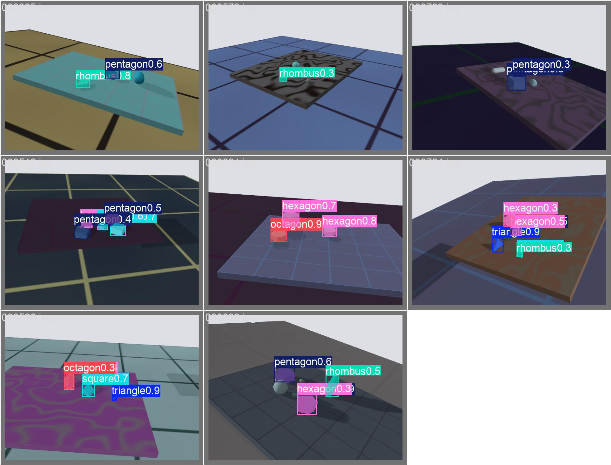

# Reading the results

A training run and `make evaluate` write many numbers, plots and pictures.
This page says what each one means, how it is worked out, and which way is
good. No machine learning background is assumed.

The examples come from the first run: 250 training pictures, scored on 42
`test` and 42 `test-unseen` pictures. The figures are copies of that run's
plots.

## Where each result comes from

| When | Scored on | Files |
| --- | --- | --- |
| `make train`, after every epoch | `val` | a row in `results.csv`, and the curves in `results.png` |
| `make train`, at the very end | `val`, using `best.pt` | the plots, confusion matrix and `val_batch*` pictures in `runs/<name>/` |
| `make evaluate` | `test`, then `test-unseen` | the same plots again, in `runs/<name>/test/` and `runs/<name>/test-unseen/`, plus `evaluation.json` |

So the plots in `runs/<name>/` itself are about `val`, and the ones in
`test/` and `test-unseen/` are about those test sets. They have the same
file names, so check which folder you are in.

## The basic ideas

Every other number is built from these.

### A guess and its confidence

For each picture the model gives a list of guesses. Each guess is a shape
name, a box, an outline, and a **confidence** from 0 to 1: how sure the
model is. In the prediction pictures it is the number after the name, as in
`hexagon0.8`.

The model makes many guesses, most of them with very low confidence. A
**confidence threshold** decides which guesses count. `predict` uses 0.25 by
default, so a guess below 0.25 is dropped.

### IoU: how well a guess fits a block

**IoU** (intersection over union) measures how much a guessed box or outline
overlaps the true one:

```
IoU = area covered by both / area covered by either
```

- 1.0 means a perfect fit.
- 0.5 means the overlap is half of everything the two cover together, a
  loose fit.
- 0 means they do not touch.

### Right and wrong guesses

A guess is compared with the true blocks in the picture:

| Name | Short | What happened |
| --- | --- | --- |
| true positive | TP | a guess with the right shape name and IoU above the threshold with a real block. **Right.** |
| false positive | FP | a guess where there is no such block: wrong name, bad fit, or nothing there at all. **A false alarm.** |
| false negative | FN | a real block with no matching guess. **Missed.** |

"Background" in the plots means "no block". Guessing a block on the
background is a false positive, and calling a real block background is a
false negative.

## The scores

All scores run from 0 to 1. **Higher is better for all of them.**

### Precision: of the guesses, how many were right?

```
precision = TP / (TP + FP)
```

Precision 0.9 means 9 in 10 guesses are real blocks with the right name.
Low precision means many false alarms.

### Recall: of the real blocks, how many were found?

```
recall = TP / (TP + FN)
```

Recall 0.8 means 8 in 10 real blocks were found and named right. Low recall
means many missed blocks.

### Precision and recall pull against each other

A high confidence threshold keeps only guesses the model is sure of:
precision goes up, and recall goes down because unsure real blocks are
dropped. A low threshold does the opposite. That is why a single precision
or recall number depends on the threshold, and why the next two scores exist.

### F1: precision and recall in one number

```
F1 = 2 × precision × recall / (precision + recall)
```

F1 is high only when both are high. A model with precision 1.0 and recall
0.1 has F1 0.18, not 0.55.

### AP: the score for one shape, at every threshold

**AP** (average precision) tries every confidence threshold, plots precision
against recall, and takes the area under that curve. A perfect model has
precision 1 at every recall, so its area, and its AP, is 1.0.

AP does not depend on any one threshold, which makes it the fairest single
number for one shape.

### mAP: the score for all shapes

**mAP** (mean average precision) is the average of the 7 shapes' APs.

It comes in two versions, which differ in how well a guess must fit to count
as right:

| Score | A guess counts as right when | What it rewards |
| --- | --- | --- |
| **mAP50** | IoU is at least 0.5 | finding and naming the block, with a loose fit |
| **mAP50-95** | worked out 10 times, at IoU 0.50, 0.55, … 0.95, and averaged | finding and naming it with a tight fit |

mAP50-95 is always lower than mAP50, because a tight fit is harder. For the
arm, mAP50-95 matters more: the arm needs the block's real edges, not a
rough area.

`best.pt` is the epoch with the highest box mAP50-95 plus mask mAP50-95 on
`val`.

### Box and Mask

Every score comes twice:

- **Box (B)**: IoU is worked out on the boxes around the blocks.
- **Mask (M)**: IoU is worked out on the outlines, pixel by pixel.

A box fits loosely around any shape, so mask scores are usually a little
lower. The mask scores say how good the outlines are, and those are what the
arm will use.

### Quick reference

| Score | Range | Better | Rough guide for this project |
| --- | --- | --- | --- |
| precision, recall, F1 | 0 to 1 | higher | 0.9 or more is good |
| mAP50 | 0 to 1 | higher | 0.9 or more is good; under 0.7 is weak |
| mAP50-95 | 0 to 1 | higher | 0.8 or more is good; always below mAP50 |
| any loss | 0 up | **lower** | should fall over the epochs; its size alone means little |
| gap, `test` minus `test-unseen` | any | **smaller** | a small gap means the model generalises |

The guide is a rough rule for 7 clean shapes in simulation, not a standard.

## The files

### The table printed at the end of training or scoring

```
Class     Images  Instances  Box(P      R   mAP50  mAP50-95)  Mask(P      R   mAP50  mAP50-95)
all           42        136  0.555  0.648   0.636     0.51    0.548   0.64   0.617     0.423
rhombus       12         16  0.263    0.5   0.378    0.301    0.263    0.5   0.378     0.226
```

- **Images**: how many pictures hold at least one block of that shape.
- **Instances**: how many blocks of that shape there are in total.
- **P and R**: precision and recall, at the one confidence threshold that
  gives the best F1 over all shapes.
- **mAP50 and mAP50-95**: as above. On a per-shape row they are that
  shape's AP.

In this example, on `test-unseen`, rhombus has precision 0.26: about 3 in 4
rhombus guesses were wrong. It also has recall 0.5: half the real rhombuses
were missed.

The `Speed` line after it is the time per picture: preparing it, running the
model, and turning the output into guesses. 9.9 ms of running the model is
about 100 pictures a second.

### `make evaluate`'s side-by-side table and `evaluation.json`

```
                                test    unseen       gap
box mAP50                      0.831     0.636     0.195
mask mAP50-95                  0.716     0.423     0.293
```

- **test**: how well the model does in conditions like its training.
- **unseen**: how well it does with new colours, tables, a farther and lower
  camera, and dimmer light.
- **gap**: test minus unseen. **Smaller is better.** A large gap means the
  model learned the training conditions more than the shapes.

`evaluation.json` holds the same numbers, for reading from code.

### `results.csv` and `results.png`: how training went

One row per epoch in the CSV, drawn as small plots in the PNG:



**The top row is training, the bottom row is `val`.**

The **losses** are what training tries to push down. **Lower is better**,
and the line should fall over the epochs:

| Loss | What it measures |
| --- | --- |
| `box_loss` | how far the guessed boxes are from the true ones |
| `seg_loss` | how far the guessed outlines are from the true ones |
| `cls_loss` | how wrong the shape names are |
| `l1_loss` | another measure of box edges, used by YOLO26 |
| `sem_loss` | an extra outline loss used only in training. It is always 0 on `val`; ignore it. |

The **metrics** plots are precision, recall, mAP50 and mAP50-95 on `val`
after each epoch. **Higher is better**, and they should rise, then level off.

What to look for:

- **Both losses falling and metrics rising**: training is working. This run
  looks like that.
- **Training loss still falling but `val` loss rising**: the model is
  memorising its training pictures instead of learning shapes. This is
  called overfitting. `patience` stops the run and keeps the best epoch.
- **Everything flat**: the model has stopped learning. More epochs will not
  help, but more pictures might.
- **Sudden spikes**, like `val/seg_loss` near epoch 8 here: usually harmless
  noise in early epochs, especially with a small `val` set.

### The confusion matrix: which shapes are mistaken for which



- **Columns are the truth**, rows are what the model said.
- **Each column adds up to 1.** A cell is the share of that true shape that
  got that answer. `confusion_matrix.png` shows counts instead of shares.
- **The diagonal is correct answers. Higher is better, and the ideal is 1.0
  on the diagonal and empty everywhere else.**
- **The bottom row, background, is missed blocks.** A real rhombus with no
  guess counts there.
- **The last column, background, is false alarms:** guesses where there was
  no block, split by the shape guessed.

Only guesses with confidence 0.25 or more count here, and a guess must
overlap its block with IoU 0.45 or more, measured on boxes.

Reading this one, from `test-unseen`:

- Hexagon is right 82% of the time.
- Pentagon is called hexagon 39% of the time, and octagon is called
  hexagon 27%. From far away, shapes with many corners blur together.
- Squares and rectangles are called rhombus 22% and 26% of the time. A low
  camera squashes right angles.
- 37% of rhombuses and 33% of octagons are missed entirely.

### The precision-recall curve (`MaskPR_curve.png`, `BoxPR_curve.png`)



One line per shape, and a thick one for all shapes. Each line shows
precision against recall as the confidence threshold moves from high (left)
to low (right).

- **Better is up and to the right.** A perfect model is a line along the
  top, reaching the top right corner.
- **The area under a line is that shape's AP**, the number in the legend.
  The thick line's number is mAP50.
- A line that drops early, like rhombus here, means that shape loses
  precision quickly as the model tries to find more of them.

### The confidence curves (`*F1_curve.png`, `*P_curve.png`, `*R_curve.png`)



Each plots one score against the confidence threshold:

- **P curve**: precision rises as the threshold rises.
- **R curve**: recall falls as the threshold rises.
- **F1 curve**: rises, peaks, then falls. **The peak is the best threshold
  to use.** The legend gives it: `all classes 0.57 at 0.208` means F1 is
  highest, 0.57, at confidence 0.21.

This is the one to check when choosing `conf` for `predict`. Here 0.21 would
suit better than the default 0.25, though with 42 pictures the peak is rough.

### `val_batch*_labels.jpg` and `val_batch*_pred.jpg`: looking at it

Pairs of the same pictures: `_labels` shows the true blocks, `_pred` shows
the model's guesses with confidence 0.25 or more.



Put each pair side by side and look for missed blocks, extra guesses, wrong
names and loose outlines. This often explains a number faster than the
plots do. Here the blocks are small and far away, which matches the scores.

### `train_batch*.jpg`

Training pictures after augmentation (mosaic, flips, zoom, blur) with their
labels. Nothing to score. Check that the outlines still sit on the blocks.
If they do not, the labels are broken, and every other number is meaningless.

### `labels.jpg`

A picture of the training labels, not of the model:

- **Top left**: how many blocks of each shape. The bars should be close to
  even.
- **Top right**: every box drawn at the same centre, to show the spread of
  sizes.
- **Bottom left**: where block centres are in the picture.
- **Bottom right**: box width against height, as fractions of the picture.
  Most blocks here are 5 to 15% of the picture wide.

### `args.yaml`

Every setting the run used. Check it when two runs give different results.

## How much to trust a number

- **Small test sets give rough scores.** With 42 pictures and about 17
  blocks of each shape, one block more or less moves a shape's AP by several
  hundredths. Compare runs on big differences, not small ones.
- **Compare like with like.** Scores from a 250-picture subset are measured
  on 42 test pictures, and scores from a full run on 1,000. Only compare
  runs scored on the same pictures.
- **Simulation is not the real world.** Even `test-unseen` is Gazebo. Only
  real photos show how the model does on a real camera.
