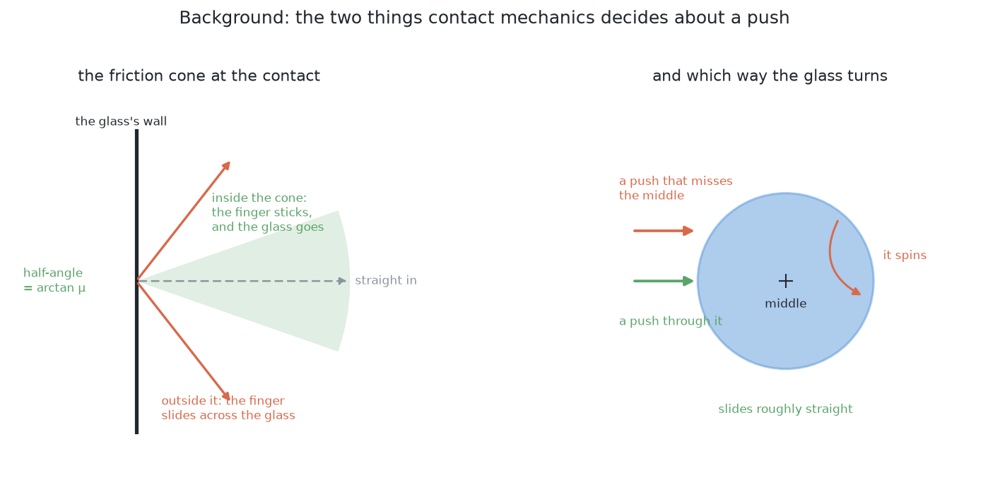

# Problem 3 — how it would be solved

## Introduction

[`problem.md`](../problem.md) says what is being asked for. This document is
the way into the eleven solution documents beside it. It gives the words they
share, the way to judge any solution that holds a trained model, a table of all
eleven, and the solution this project chose and has built.

It does not repeat the solutions. Each has a full document of its own, with its
worked example, its measurements and its verdict argued in full. Follow the
link in the table.

## Where we are

Problem 2 has finished. The arm knows where each glass stands on the table.
Some of them stand too close together for the gripper to get round one without
fouling its neighbour, so they have to be dragged apart across the table.
[`problem.md`](../problem.md) says why dragging and not lifting.

One fact about the tables comes before any rate in the eleven documents.
**Problem 2's spawner cannot produce a crowded table**: it keeps glass middles
150 mm apart, which is above every crowding threshold here. Problem 3 has its
own generator, `scene(seed)` in
[`problem-3-sim/bench.py`](../../../problem-3-sim/bench.py), where every table
has at least one glass without room. Every rate in the solution documents says
which of the two populations it was measured on. [Do not drag at
all](01-do-not-drag-at-all.md) owns that finding.

## The words

A **push** moves a glass across the table with the closed gripper, in contact
the whole way. **Dragging** and **pushing** mean the same thing here.

**Singulation** is the robotics name for this job: separating crowded objects so
that they can be picked one at a time. It is the word to search for.

**Quasi-static** means slow enough that momentum does not matter. Let go of a
glass mid-push and it stops. Everything here assumes it.

The **friction cone** is the set of directions a finger can push a surface
without sliding across it. The **centre of the footprint** is the middle of the
glass's round base: a push through it slides the glass straight, and a push
beside it spins the glass as well.

**Room** decides whether a glass is crowded. `bench.has_room` says a glass has
room when every other glass satisfies

    distance  >=  GRIP_ROOM + that other glass's width / 2

with `GRIP_ROOM` at 70 mm. It depends on the neighbour's width, so it is not
symmetric: a narrow glass beside a wide one is crowded while the wide one is
not.

**Toppling** is the failure that cannot be undone. A pushed glass slides while
the contact height is below `a / μ`, half the base width over the friction, and
tips above it. The height to check is **65 mm, not 50 mm**: the jaw's middle
rides at 50 mm but its top edge is at 65 mm, and a glass wider higher up meets
the top edge first. [Identify the contact
parameters](09-identify-the-contact-parameters.md) owns that finding.

## Three families, and what "hybrid" means

**Programmed.** Somebody states the rule and the computer applies it. No
training data and no model file. It works on objects it has never seen, and
when it fails one printed number usually says why. Its limit is that somebody
has to be able to write the rule down.

**Learned.** The behaviour is fitted to examples. It can do things nobody knows
how to state. It pays with a training set, a weights file that has to be kept in
step with the world, and an answer that cannot explain itself.

**Hybrid.** Both, arranged so that the learned part sits inside something
checkable. What matters is **where the learned part sits**, because that decides
what happens when the model is wrong.

- **Decider.** The model's answer is acted on. Nothing downstream can disagree.
- **Proposer.** Rules find candidates, the model suggests something better, and
  rules check the suggestion. A wrong suggestion is rejected.
- **Ranker.** Rules generate every candidate and veto the unsafe ones. The model
  only orders the survivors. A bad order costs one wasted attempt.
- **Verifier.** Rules act, and the model checks what happened. A wrong check
  costs one extra measurement.

In the last three, the model's mistakes are bounded by something that does not
need the model to be right. A better model narrows the failures; only the
arrangement caps them.

## Feedback: choosing what to measure next

An open-loop pipeline takes its pictures, works everything out and acts. A
closed loop looks, finds what is still unsettled, and chooses the next
measurement that would settle it. It needs three things:

1. **A measure of doubt**, so that "settled" and "not sure" can be told apart.
2. **Actions that could reduce it**: a camera pose, a touch, a push.
3. **A budget**, and a rule to stop when nothing is unclear or the budget is
   spent, reporting what is still doubtful.

The thing to economise is arm movement, not computation. Moving the arm costs
seconds; running any model here costs milliseconds.

## The rule every solution passed

A solution is here only if everything it needs can be produced by the simulator
on this machine: an Apple Silicon Mac with no NVIDIA card, no robot on a bench
and no real-world data. Problem 3 is scored in MuJoCo, not Gazebo.

1. **No artefact from outside.** Any model is trained from what the simulator
   produces.
2. **No sensor the simulator does not have.** The cell has a depth camera, pad
   contact sensors and a wrist force-torque sensor.
3. **No graphics card it has not got.** Nothing that needs CUDA.
4. **Hours, not days.** [Search a push strategy](11-search-a-push-strategy.md)
   measures what this means here.

Good answers that fail the rule are in
[`learned-with-hardware.md`](learned-with-hardware.md).

## The eleven

| # | Solution | Family | Where the model sits | Closed loop? | Verdict |
| --- | --- | --- | --- | --- | --- |
| 1 | [Do not drag at all](01-do-not-drag-at-all.md) | programmed | — | **yes** | **used — the first half of every pass** |
| 2 | [One fixed nudge](02-one-fixed-nudge.md) | programmed | — | no | build it, ship none of it |
| 3 | [Plan, feel, look again](03-plan-feel-look-again.md) | programmed | — | **yes** | built — the programmed baseline |
| 4 | [Predict the slide](04-predict-the-slide.md) | programmed | — | no | correct theory, missing inputs |
| 5 | [A learned residual on the push model](05-a-learned-residual-on-the-push-model.md) | hybrid | proposer | **yes** | cheap, and aimed at the wrong number |
| 6 | [Geometry generates, a model ranks](06-geometry-generates-a-model-ranks.md) | hybrid | ranker | partly | safe, and worth nothing measurable here |
| 7 | [A learned change-verifier](07-a-learned-change-verifier.md) | hybrid | verifier | **yes** | **the first learned thing worth adding** |
| 8 | [A learned early-abort](08-a-learned-early-abort.md) | hybrid | verifier, during the act | **yes** | the only one that can *prevent* a topple |
| 9 | [Identify the contact parameters](09-identify-the-contact-parameters.md) | learned | proposer | **yes** | the only one that improves a safety decision |
| 10 | [Learn a forward model, then plan](10-learn-a-forward-model-then-plan.md) | learned | decider | **yes** | **chosen — built, and it beats the programmed run** |
| 11 | [Search a push strategy](11-search-a-push-strategy.md) | learned | decider | partly | cheapest entry, lowest ceiling |

In one line each:

1. Rack every glass that already has room before pushing anything; a racked
   glass is nobody's neighbour.
2. Push one glass a fixed distance straight away from its neighbour.
3. List every place a glass could be pushed to, drop those that fail a test,
   push to the nearest survivor, feel the last centimetres, and look again.
4. Work out where a pushed glass goes from contact mechanics.
5. Keep solution 4's physics and learn only its error.
6. Rules list and check every push; a model only puts the safe ones in order.
7. A small model says, from before and after pictures, what a push did.
8. A small model watches the wrist force during a push and stops it when a
   glass starts to tip.
9. Estimate the table's friction from the pushes the arm makes anyway.
10. Learn what a push does from thousands of pushes, then search pushes against
    that model.
11. Search the handful of numbers inside solution 3 by running whole tables.

## The decision

**Solution 10, with solution 1 as the first half of every pass.** The arm
looks, racks every glass that already has room, and only if none has room asks
the learned model what each candidate push would do, makes the best one, and
looks again. It is built in [`problem-3-learned`](../../../problem-3-learned/).
Its [README](../../../problem-3-learned/README.md) says why it was chosen, how
it works, and how to train it, run it and draw each step.

**Why it was chosen.** Solutions 1 and 3 were built first as a programmed
baseline, in [`problem-3-programmed`](../../../problem-3-programmed/). On the
same 50 held-out tables the learned approach racks 208 glasses in 113 pushes
against 199 in 212, and neither topples anything. It is less accurate about
where one glass lands, but it predicts what the task is scored on: where every
glass ends up, and whether a push will topple something or be blocked. So it
needs far fewer pushes that only find something out.
[Learn a forward model, then plan](10-learn-a-forward-model-then-plan.md)
measures this in full.

**What it gives up.** A training set of 38,012 simulated pushes and five weights
files to keep in step with the cell, six pushes in 113 that went wrong where the
baseline had none, and refusals that cannot be checked with a ruler. Solution
10's own document argues that the programmed loop already does the job; the
project took the trade for the extra glasses and the halved push count.

### What would be added next

Each of these answers one of the failures below.

1. **More topple examples in training.** Every topple the model missed on the
   tuning tables was rated safe. Pushes made on purpose to tip glasses give it
   the cases it has not seen.
2. **The change-verifier** — [solution 7](07-a-learned-change-verifier.md).
   The simulator says exactly when a glass has fallen. A real overhead camera
   cannot tell a glass leaning at 20 degrees from one standing, and the
   model's topple labels depend on that answer.
3. **The early-abort** — [solution 8](08-a-learned-early-abort.md). A
   prediction made before a push cannot stop a topple the model did not
   foresee. Watching the wrist force during the push can.
4. **The friction estimate** — [solution 9](09-identify-the-contact-parameters.md).
   The model has learned the simulator's friction. Estimating the real table's
   friction from the pushes says when that no longer holds and the model has
   to be trained again.

### How it would be known to work

Against the simulator's own record, on the 50 held-out tables in
`problem-3-sim`. `problem-3-learned/results.json` holds the chosen approach's
score and `problem-3-programmed/results.json` the baseline's, counted the same
way: glasses racked and tables finished, pushes and repeats, landing error,
refusals by reason, and glasses toppled, which should be none. `make trace`
in `problem-3-learned` draws any one table step by step, with what the model
was given and what it said.

## Where the chosen solution can fail

- **It misses some topples, and rates them safe.** None happened on the 50
  held-out tables, but on 100 tuning tables one glass toppled. The model had
  rated every topple it missed as safe: the jaw lifting a stemmed glass under
  its bowl, the jaw's body clipping a neighbour behind, a tapered glass tipping
  on its own. A lower topple limit only refuses more.
  [The README](../../../problem-3-learned/README.md#results--50-held-out-tables-251-glasses).
- **Some pushes do what the planner did not intend.** Six of 113: four blocked
  on the way down, one that never touched the glass, one that jammed. Looking
  again catches each one. They come from being less strict about where the jaw
  fits, which is also what racks the extra glasses.
  [Solution 10](10-learn-a-forward-model-then-plan.md).
- **The landing tail is wide.** 24.8 mm at worst against the baseline's 3.9,
  and a worst case measured over 50 tables would likely grow over more. It
  becomes a safety number the day the glass zone gets tighter.
  [Solution 10](10-learn-a-forward-model-then-plan.md).
- **A refusal cannot explain itself.** 42 of the 43 refused glasses say only
  "no push the model expects to make room", and nobody can check that by hand.
  [Solution 10](10-learn-a-forward-model-then-plan.md).
- **It is silently wrong outside what it saw.** More than six glasses, a kind it
  was not trained on, or a push longer than 100 mm, and it still returns an
  answer. Dropping any prediction longer than the push is a patch, not a fix.
  [Solution 10](10-learn-a-forward-model-then-plan.md).
- **It has learned the simulator's contact, not the world's.** Friction and
  mass are inside the weights. A real table with different friction makes the
  model wrong with no warning except the next look.
  [Solution 9](09-identify-the-contact-parameters.md).
- **It plans one push at a time.** A push whose only value is what it lets the
  next push do is never chosen, so some tables end in refusals that a planned
  pair of pushes would clear. [Solution 10](10-learn-a-forward-model-then-plan.md).
- **A moved glass can block the camera's view of another**, so the number of
  pushes is not bounded by the number of crowded pairs. The loop catches it by
  looking again.

← [The problem](../problem.md) · [The ones that need more than a simulator](learned-with-hardware.md) · [Problem 4 — several kinds at once](../../problem-4) →
