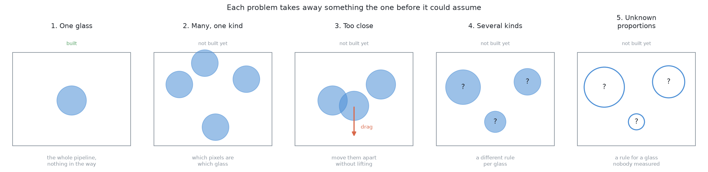

# The five problems

This project is not one task. It is five, and they get harder in a particular
way: **each one takes away something the one before it was allowed to assume.**
One folder each.

Read [`../problem-statement.md`](../problem-statement.md) first if you have
not. It says what the task is, why glasses were chosen, what the arm is allowed
to know, and what counts as done. Everything here follows from it.

| | Problem | Where it stops | State |
| --- | --- | --- | --- |
| **1** | [One glass, start to finish](problem-1/) | the glass is on the rack | **built** |
| **2** | [Many glasses of one kind](problem-2/) | a set of pixels per glass | designed, not built |
| **3** | [Glasses standing too close](problem-3/) | the glasses are far enough apart to grip | designed, not built |
| **4** | [Several kinds at once](problem-4/) | the table is clear | stated |
| **5** | [Kinds whose proportions are unknown](problem-5/) | the table is clear | stated |

## Why they are in this order

Each problem is the one before it with one assumption removed, so each answer
is something the next problem can stand on.

**Problem 1** has one glass on a bare table. Nothing hides anything, the camera
can go wherever it likes, and the glass is reachable where it stands. That
leaves the difficulties that are about the *object* rather than about the
scene: its size has to be measured, its weight cannot be seen at all, there is
usually one place it may be held, and the set-down has to be felt rather than
driven.

**Problem 2** puts several glasses of the same kind on the table. The kinds are
known, so naming is not the difficulty. Telling one glass from another is — and
worse, the arm can no longer photograph each one from whichever side it likes,
because the other glasses are in the way of the camera or of the arm.

**Problem 3** starts from problem 2's answer. Some of those glasses are close
enough together that the gripper cannot get round one without fouling its
neighbour. They have to be moved apart by **dragging them across the table**,
because lifting one is the thing that is not possible yet.

**Problem 4** joins all three up and adds the part none of them has: several
kinds at once, so the rule changes per glass and naming the kind becomes
load-bearing.

**Problem 5** takes away the proportions. The kinds are still the four shapes,
but no two glasses of a kind are alike and nothing is written down. This is the
problem the whole project exists for, and the reason every earlier problem
refuses to record a measurement.

## What is in each folder

Each problem folder has a `problem.md` that states the problem in full — what
is on the table, what the arm is not told, what makes it hard, and what "done"
means. After that they differ, because the problems do:

- **Problems 1, 4 and 5** are the whole pipeline, so they are written as the
  same six *steps*: find it, measure it, name it, choose the grip, squeeze,
  turn it over. Problem 1 gives each step a document of its own, because it is
  built. Problems 4 and 5 take the six as a section of `problem.md`, saying
  what changes at each and nothing else.
- **Problems 2 and 3** are not the whole pipeline and do not have all the
  steps. Problem 2 stops at a set of pixels per glass; problem 3 stops at
  glasses far enough apart to be gripped. Each has a `solution-overview.md`
  instead — the approaches worth considering, programmed and learned side by
  side, and which one is chosen and why.

## What does not work yet

[`known-gaps.md`](known-gaps.md) lists the failures that are known but not yet
fixed, such as the glass sizes the grip rules cannot handle. It is about the
code as it stands, which is to say about problem 1.

## The pictures

Two generators, and the difference between them matters.

[`make_images.py`](make_images.py) draws everything in the problem-1
walkthrough by importing the project's own modules and plotting what they
return. Nothing there is illustrative: if a rule changes, the picture changes
with it the next time the script is run.

[`make_problem_images.py`](make_problem_images.py) draws the diagrams in the
problem documents. Those describe problems that are not built, so there is no
function to plot. They are drawn from the geometry written beside them, and the
two have to be kept in step by hand.

## Where the techniques come from

None of the perception or the gripping here is invented for this project. Each
step is one named technique, and the places they are set out side by side are
the **object perception** and **gripping** areas of robotics-basics:
[finding and measuring](https://github.com/RobinNagpal/robotics-basics/blob/main/docs/06_object-perception/01_overview.md)
and [gripping](https://github.com/RobinNagpal/robotics-basics/blob/main/docs/07_gripping/01_overview.md).
[The problem-1 walkthrough](problem-1/README.md#where-the-techniques-come-from)
has the full map, and every document links to the sections it uses.

There is also a design document for this exact task, written before any of the
code: [standing an empty glass upside down on a drying
rack](https://github.com/RobinNagpal/robotics-basics/blob/main/docs/10_one-arm-training/07_case-study/01_place-glass.md).
