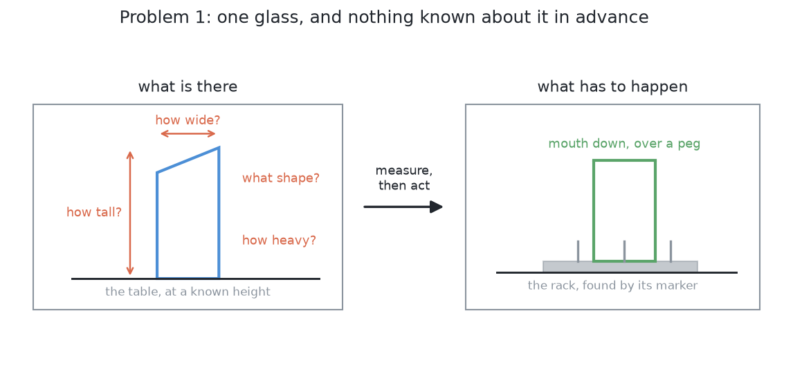

# Problem 1 — one glass, start to finish

One glass stands on the table. The arm has to find it, work out how big it is,
pick it up, turn it over, and stand it mouth-down on the drying rack. Nothing
about the glass is known before the run starts.

This is the first of [five problems](../../problem-statement.md#five-problems-in-order-of-difficulty)
and it is the only one that is built. It is worth being exact about what makes it
hard, because most of that difficulty is still there in the other four. And
about what makes it easy, because that part is what the next problems take
away.

## What is on the table

One glass, standing upright, somewhere in a rectangle of the table the arm can
reach. It is drawn fresh each run from one of four kinds — straight, tapered,
stemmed, short-stemmed — at proportions picked at random inside a plausible
range. A seed fixes the draw, so a run can be repeated exactly.

The rack is on the arm's other side. Its shape is known and its position is
not; the arm reads a printed marker on its base to find out where it is.

That is everything. There is no second glass, no clutter, and nothing standing
between the arm and what it is looking at.

## What the arm is not told

Four things, and each one is a separate difficulty:

**How tall it is.** Not written down anywhere the arm can read. A 90 mm tumbler
and a 240 mm flute are both possible.

**How wide it is, at each height.** Not the rim width, and not the base width.
The number that actually matters is the width where the fingers will close — and
that depends on where that place turns out to be.

**What kind it is.** Whether it has a stem is the question that decides where
it may be held, and no part of the setup announces the answer.

**How heavy it is.** This one cannot be seen at all, by any camera, from any
angle. Wall thickness is invisible from outside, and two glasses with the same
outline can differ in weight by a factor of three.

The arm does know the cell: where its own base is, how its gripper and camera
are built, how high the table is, and what the four kinds of glass *are* as
sentences about shape. The line between those two lists is
[what the arm knows](../../problem-statement.md#what-the-arm-knows) in the
problem statement, and it is the rule the whole project is built to keep.

## What makes this hard even with one glass

**The measurement has to come first, and everything downstream believes it.**
There is no independent check on the profile. If it is wrong, the kind is
wrong, the grip is wrong, and the fingers close in the wrong place — each step
confidently.

**The one number that matters cannot be seen.** The squeeze depends on the
weight. So the grip cannot be finished from pictures; it has to be started from
a guess and corrected once the glass is off the table.

**There is usually one place to hold it.** A glass is round and its walls are
rarely parallel, so flat pads on a sloping wall slide. On a wine glass the
place is the stem, a few millimetres across. Finding it means finding a
*feature*, not a coordinate.

**The end is a fit, not a position.** Standing a glass over a peg means the rim
has to arrive within a few millimetres of a place worked out from two measured
numbers, both of which carry error. The errors add. The last millimetres have
to be felt.

**Being wrong is expensive.** A dropped glass leaves shards and the arm keeps
moving through them. So a doubt has to end the attempt rather than be pushed
through, and a glass left standing with a reason is a correct outcome.

## What makes this the easy one

Everything to do with there being more than one glass is absent, and that is
more than it sounds:

**Nothing can hide anything.** Every picture is of one object against a bare
table. There is no question of which pixels belong to which glass, because they
all belong to the same one.

**The arm can photograph it from any side.** The side-on view this whole
pipeline rests on is always available, because there is nothing in the way of
the camera and nothing for the arm to cross over to get there. Problem 2 is
what happens when that stops being true.

**Nothing has to move before anything else can.** The glass is reachable where
it stands. Problem 3 is what happens when it is not.

**One kind per run is enough to get through.** The classifier has to be right,
but it only has to be right once per run, and a wrong answer shows up
immediately as a refused grip rather than as a mess. Problem 4 is what happens
when several kinds have to be handled in one pass.

## Done, and not done

A run is **done** when the glass is standing mouth-down over a slot peg, the
fingers are open, and the arm is clear of it.

A run is **correct but incomplete** when the arm refuses the glass and says
which step gave up and why. That is a result, not a failure. Refusing is what a
project handling fragile things has to be able to do, and
[known-gaps.md](../known-gaps.md) records how often it currently happens and on
which sizes.

A run is **wrong** if the glass is knocked over, dropped, or racked by pushing
through a doubt — the last of which counts as wrong even when nothing breaks.

## How it is solved

In six steps, each one handing the next the least it can:

→ [The walkthrough](README.md)
