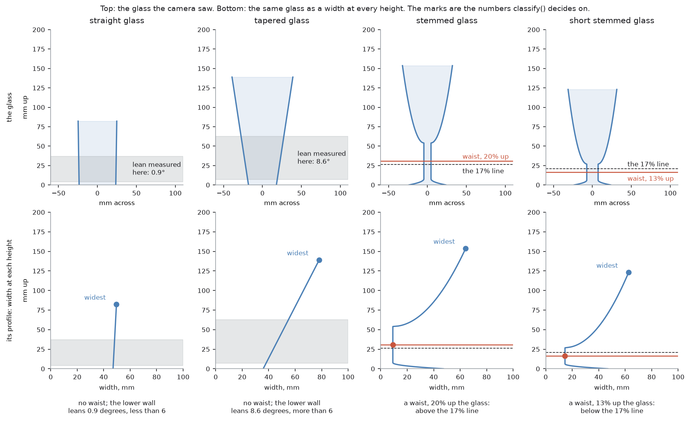
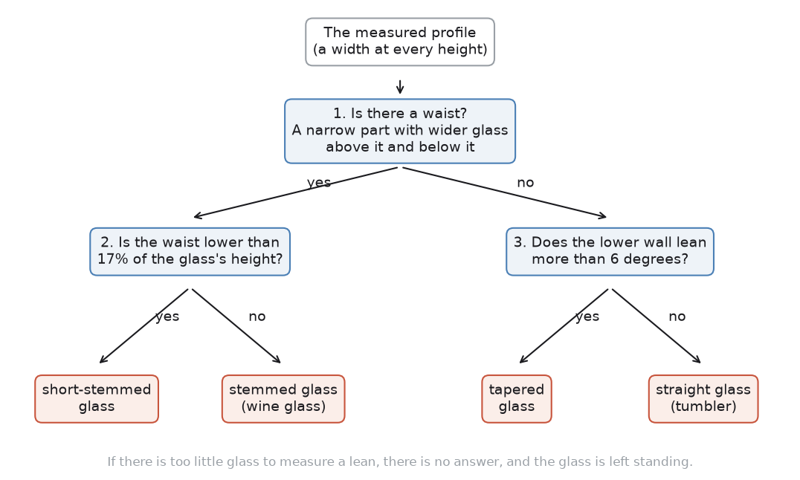

# Step 3 — what kind of glass is it

After step 2, the arm has a **profile** of the glass: its width at every height,
from the table up to the rim. Now it has to name the glass. There are four
names, the four kinds the [problem statement](../../problem-statement.md) sets
out:

- **straight glass**, like a tumbler
- **tapered glass**, a cone that is narrow at the bottom
- **stemmed glass**, like a wine glass
- **short-stemmed glass**, like an Irish coffee glass

The step can also answer "none of these". That is a real answer, not an
error.

The name matters for one reason. Each kind has its own rule for where to hold
it, and step 4 uses the name to pick the rule. A wine glass is held by the
stem. A tumbler is held low on its wall.

Code: `classify()` and `wall_lean_deg()` in `glasses/detect.py`.

Background, in robotics-basics:
[four answers, and which one you need](https://github.com/RobinNagpal/robotics-basics/blob/main/docs/06_object-perception/01_overview.md#1-four-answers-and-which-one-you-need)
is about what a vision component can be asked for, and this step is the one
that asks for a *class*. Why it needs no model is
[when a model makes things worse](https://github.com/RobinNagpal/robotics-basics/blob/main/docs/06_object-perception/01_overview.md#21-when-a-model-makes-things-worse).

What follows, in order:

- the step in pseudocode, and the libraries it uses
- what a profile looks like
- the three questions that name a glass
- the four kinds, worked through with real numbers
- a hundred and twenty glasses at once, and what the picture shows
- why "none of these" is a real answer
- what went wrong when this was first tested
- where the method can fail
- other ways it could have been done

## The step in pseudocode

Each line says who does the work: **ours** means code in this repo, and a named
library means the work is not ours.

```text
waist = the narrowest point below the widest      ours: glasses/profile.py
                                                  waist_at()

name the kind from the waist, or from the lean    ours: detect.py classify()
    a waist below 0.17 of the height              short-stemmed glass
    a waist above it                              stemmed glass
    no waist, and the wall leans over 6 deg       tapered glass
                                                  the lean is the median of
                                                  profile.py slope() from 5%
                                                  to 45% of the height:
                                                  detect.py wall_lean_deg()
    no waist, and the wall is upright             straight glass
    too few rows of profile to judge              nothing, and the glass is left
                                                  standing with a line in the report
```

### What each library gives this step

| Piece | Ours or a library | What it does here |
| --- | --- | --- |
| `classify()` in `glasses/detect.py` | ours | the three questions, and the decision to answer "none" |
| `wall_lean_deg()` in `glasses/detect.py` | ours | how far the lower wall leans off upright |
| `glasses/profile.py` | ours | `waist_at()` and `slope()`, the two measurements the questions use |
| `glasses/spec.py` | ours | what each name means once it is given: where to search for a grip, how wide the fingers may open, how hard they may squeeze |
| [NumPy](https://numpy.org/) | library | a median and a few comparisons |

This is the shortest list in the walkthrough. The step does not talk to ROS,
the camera or the simulator. It takes a profile and returns a name. That is
why all of its tests run in a fraction of a second, with no robot anywhere.

## What a profile looks like



The top row is each glass as the camera saw it from the side. The bottom row
is the same glass as the profile: go up the side of the chart to a height, and
the curve tells you how wide the glass is there.

Read that way, the four kinds look very different:

- A **straight glass** is a line that goes almost straight up. The width
  hardly changes.
- A **tapered glass** is a line that leans. It gets wider as it goes up.
- A **stemmed glass** starts wide at the foot, goes very narrow for the stem,
  then wide again for the bowl.
- A **short-stemmed glass** does the same, but the narrow part is much lower
  down and much shorter.

That is the whole idea of this step. The shape is already in the numbers.
Naming it is a matter of asking the right questions of the curve.

## The three questions



**1. Is there a waist?** A waist is a narrow part with wider glass both above
it and below it. On a drinking glass, that is a stem, and nothing else looks
like one. `waist_at()` looks for the narrowest point below the widest point,
and then checks that the glass really does widen out on both sides of it.

This question has to come first. A wine glass's bowl also leans outwards. If
the arm asked about the lean first, it would call every wine glass tapered and
hold it by the bowl.

**2. If there is a waist, how far up is it?** The answer is a fraction of the
glass's own height, so it works the same on a tall glass and a short one. A
waist lower than 0.17 of the height (17%) is a short stem. Higher than that, it
is a normal stem.

The two kinds are kept apart because they need different handling. The stem
of a wine glass is thin and fragile, so it gets a much lighter squeeze than the
thick stem of an Irish coffee glass, and step 4 searches for it in a different
part of the glass.

**3. If there is no waist, does the wall lean?** The arm measures how far the
wall leans off upright, over the lower part of the glass, from 5% to 45% of the
height. That is where a grip would go. More than 6 degrees is a tapered glass.
Less is a straight glass.

The 6 degrees is really about the gripper, not about glassware. Flat pads can
press on a wall that leans a little without sliding. Past about 6 degrees, they
start to slide. Fit softer pads and the number would change.

If the profile is too short to measure a lean at all, there is no answer, and
the glass is left standing.

## The four kinds, worked through

Here are the same four glasses from the first picture, with the numbers the
arm actually used:

| Glass | Question 1: a waist? | Question 2 or 3 | Name |
| --- | --- | --- | --- |
| first | no | the wall leans 0.9°, less than 6° | straight glass |
| second | no | the wall leans 8.6°, more than 6° | tapered glass |
| third | yes | the waist is 20% up, above the 17% line | stemmed glass |
| fourth | yes | the waist is 13% up, below the 17% line | short-stemmed glass |

No glass size appears anywhere in that table. The 17% and 6° are rules about
shape. The 0.9°, 8.6°, 20% and 13% were measured from these glasses a moment
earlier, and a different glass would give different numbers and still get the
right name.

## A hundred and twenty glasses at once


Every dot is one glass the project generated at random proportions, thirty
of each kind. Its
**shape** says what kind it was made as. Its **colour** says what
`classify()` called it. The dashed line is the 17% rule. The dotted line is the
6° rule.

- **The triangles at the top** are stemmed glasses. Their waists are all above
  17%, so they are called stemmed.
- **The diamonds in the middle** are short-stemmed glasses. Their waists are
  all below 17%, so they are called short-stemmed. They sit far to the right
  because their lower wall is the leaning bowl, but that lean is never asked
  about: they have a waist, so question 3 is skipped.
- **The row along the bottom** is glasses with no waist, so only the lean
  decides. Left of the dotted line is straight, right of it is tapered.

The empty space either side of the dashed line is what a good rule looks like:
nothing is close to it. The dotted line is more crowded. A few squares, which
were made as tapered glasses, fall left of it and are coloured as straight.
*What went wrong*, below, explains why that is not a mistake.

## "None of these" is a real answer

`classify()` can return nothing. `task.py` then leaves the glass standing and
writes the reason in the report.

The alternative would be to pick the closest kind every time. But then an
object the arm does not understand gets a grip rule made for something else,
and the fingers close somewhere nobody checked. A robot handling glass has to
be able to say "I do not know what this is".

## What went wrong

**A test that asked the wrong question.** An early test demanded that every
generated glass be called the kind it was made as. It failed, on tapered
glasses with a very shallow lean. Those are the squares on the wrong side of
the dotted line above.

The test was wrong, not the code. A tapered glass that leans 5° has walls that
are almost upright, and the straight-glass rule holds it perfectly well. Making
the classifier call it tapered would have meant bending the rules to keep a
difference the gripper does not care about. The test now asks the question that
matters:

> does every glass get a kind whose rule can actually hold it?

That is harder to cheat, because the only way to pass it is for the arm to be
able to pick the glass up.

**The short-stem line started in the wrong place.** It was first set at 30%,
which put every wine glass below it and called them all short-stemmed. It was
caught by running the classifier over a whole family of generated glasses,
which is what the picture above does.

## Where this approach can fail

**It names a shape, not an object.** Nothing here asks whether the thing is a
glass at all. A vase with a narrow neck has a waist, and would be called
stemmed. A plant pot would be called tapered. The checks in step 4 catch some
of these, but only when their measurements are outside what the gripper can
do.

**The two lines were set by eye.** 17% and 6° were chosen by looking at the
glasses this project generates and seeing where they separate. Neither comes
from a physical law. A real cupboard of glasses would sooner or later put one
right on a line, and that glass gets the wrong rule rather than a refusal.

**A reflection can invent a waist.** A bright band across the glass can cut a
notch into the camera's outline, and a notch looks like a waist. Step 2's check
for ragged outlines is meant to stop such a picture reaching this step, but it
is a threshold, not a guarantee. A tumbler called stemmed would then be held at
a stem that does not exist.

**It is never unsure.** The answer is a name or nothing. A glass that only just
cleared a line is treated exactly like one far from it. None of the tests say
how close the call was.

## Other ways to decide what kind of glass it is

Naming a thing from a picture is the textbook job for a neural network, so it
is worth saying what one would add here. The case for the rules is not that
learning is bad. It is that by the time this step runs, the input is already a
description of the shape.

| Approach | What it does | What it runs on | Suitability here |
| --- | --- | --- | --- |
| **Rules on the profile** | three questions about the measured outline | NumPy, in `glasses/detect.py` | good, and in use |
| **Classical machine learning** | learns the lines between kinds from a few numbers per glass | [scikit-learn](https://scikit-learn.org/) decision tree, SVM or random forest | would work, and explain itself less |
| **A small network on the profile** | learns the kind from the width-at-every-height curve | a 1-D CNN or MLP on [PyTorch](https://pytorch.org/) | more machinery than the problem needs |
| **An image model on the silhouette** | learns the kind from the picture directly | [Ultralytics YOLO classify](https://docs.ultralytics.com/tasks/classify/), [timm](https://github.com/huggingface/pytorch-image-models) | throws away the measurement first |
| **Zero-shot vision and language** | asks "is this a wine glass?" with no training at all | [CLIP](https://github.com/openai/CLIP) | remarkable, and cannot be held to a rule |
| **Nearest neighbour on profiles** | compares against stored example outlines | [scikit-learn](https://scikit-learn.org/), or dynamic time warping | needs the table of sizes this project refuses |
| **Fit a parametric family** | fits a bowl-stem-foot model and reads the kind off the fit | SciPy least squares | the strongest alternative |

**Classical machine learning** is the fairest comparison. It would take the
same few numbers the rules take, such as the waist height and the lean, and
learn the lines between kinds instead of having them written down. The data
would be drawn in the simulator rather than photographed —
[making the training data in a simulator](https://github.com/RobinNagpal/robotics-basics/blob/main/docs/06_object-perception/04_models-that-find.md#31-making-the-training-data-in-a-simulator)
is how, and this project already generates the glasses to do it with. A decision
tree would probably match the rules on these glasses, and it can be read
afterwards. The costs are a labelled set of glasses, and lines that fit the
sample rather than lines that are true of glassware. "The narrowest part below
the widest part is the stem" is true of every stemmed glass ever made. No
amount of data makes a learned line true in that way.

**A small network on the profile, or an image model on the picture**, would
both work, and both move further from how this project is built. The network
on the profile at least uses the measurement. The image model skips it and
learns from pixels, so the glass still has to be measured afterwards, because
step 4 needs the profile. Both need hundreds of labelled examples. Both add a
file of trained weights that has to be kept up to date with the glassware.
Neither can say why it decided anything.

**[CLIP](https://github.com/openai/CLIP)** needs no training to recognise a
wine glass in a picture, which makes it the cheapest way to get a name. It
belongs to the [open-vocabulary](https://github.com/RobinNagpal/robotics-basics/blob/main/docs/06_object-perception/04_models-that-find.md#14-open-vocabulary-models)
family, where the class is a phrase you type rather than one somebody trained,
which also makes
[the wording a variable in the system](https://github.com/RobinNagpal/robotics-basics/blob/main/docs/06_object-perception/01_overview.md#4-closed-set-open-vocabulary-and-promptable).
But a name is not what this step is for. Step 4 does not need to know the glass
is *called* a wine glass. It needs to know there is a narrow part below a wide
part, so it can hold the narrow part. A model that gives the name confidently
when the shape is different is worse than no model, and those are exactly the
glasses that get broken.

**Fitting a parametric family** would give the kind, the dimensions and a
score for how well the glass matched, which is the "how close was the call"
this step lacks. It is described in [`step2-approaches.md`](step2-approaches.md).
It was not chosen because every family has to be written out as an equation,
and a fit that goes wrong goes wrong quietly.

→ [Step 4 — where to hold it](step4-where-to-hold-it.md)
