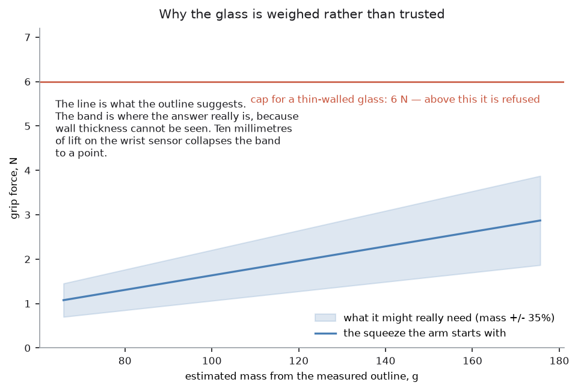
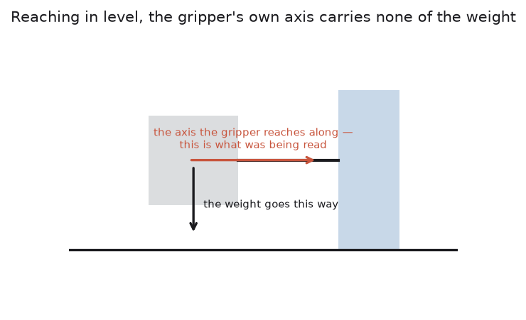

# Step 5 — how hard to squeeze

The arm knows where to hold the glass and how far apart to put the fingers.
How hard they press is a separate question, and it is the one question in this
project that no amount of looking can answer.

The reason is in the [problem statement](../../problem-statement.md). Wall
thickness is invisible from outside, so two glasses with identical outlines can
differ in weight by a factor of three. And the force needed to hold a glass
depends on what it weighs. A camera can measure everything about a glass except
the one property this step needs.

That is why the grip has stages rather than one squeeze. The arm estimates a
squeeze from the shape and closes on the glass. Then it lifts the glass ten
millimetres — far enough to weigh it on the wrist sensor, near enough that
nothing has happened yet — and corrects the squeeze before carrying it
anywhere. Too little force and the glass slides. Too much and the stem of a
wine glass becomes a lever against the pads.

Code: `glasses/force.py`, and `_pick_up()` in `task.py`.

Background, in robotics-basics: the three stages below are
[the squeeze sequence](https://github.com/RobinNagpal/robotics-basics/blob/main/docs/07_gripping/05_holding-on.md#1-the-squeeze-sequence) — estimate,
grip gently, lift a little, weigh, correct — and the arithmetic in the middle is
[how hard to squeeze, from first principles](https://github.com/RobinNagpal/robotics-basics/blob/main/docs/07_gripping/03_choosing-a-grip.md#4-how-hard-to-squeeze-from-first-principles).
[What force control a gripper actually gives you](https://github.com/RobinNagpal/robotics-basics/blob/main/docs/07_gripping/05_holding-on.md#2-what-force-control-a-gripper-actually-gives-you)
is the one to read before trusting any number on this page, and
[measuring by touch](https://github.com/RobinNagpal/robotics-basics/blob/main/docs/06_object-perception/02_sensors.md#2-measuring-by-touch)
is the sensing side of it.

What follows, in order:

- the step in pseudocode, and the libraries it uses
- the friction sum
- the part the camera cannot see
- the three stages of the grip
- why refusing is part of the design
- how the wrist is read, and how it was read wrongly
- where the method can fail
- the other ways this decision could be made

## The step in pseudocode

Each line says who does the work: **ours** means code in this repo, and a named
library means the work is not ours.

```text
guess = estimate the mass from the shape          ours: glasses/force.py
                                                  estimate_mass(): the surface swept
                                                  by the outline times a wall
                                                  thickness that comes from the kind,
                                                  plus a solid disc for the base
force = mass * g / (friction * pads), doubled     ours: force.py required_force()

stage one: close the fingers at 1 N               ros2_control: the effort
                                                  controller, in place of position
read the gap they stopped at                      ros2_control: joint states
compare with the width the camera said            ours: task.py _pick_up(). More
                                                  than 4 mm out refuses the grasp.

stage two: squeeze to the estimated force         ros2_control: effort controller
lift 10 mm in a straight line                     MoveIt 2: a Cartesian path
read the wrist force-torque sensor                Gazebo: the forcetorque system
                                                  ros2_control: the broadcaster
                                                  ours: arm/motion.py wrist_load,
                                                  into the world frame, upright part,
                                                  median of 32 samples
mass = that, less the gripper's own weight        ours: force.py mass_from_wrist()

stage three: refuse if it needs too much          ours: force.py
                                                  force_for_measured_mass(), against
                                                  this kind's force cap
re-squeeze if the guess was low                   ours: task.py _pick_up(): set it
                                                  down first, because raising the
                                                  squeeze in the air is a shock
move the grip to the weighed centre of mass       ours: task.py
                                                  _move_to_centre_of_mass(). The
                                                  weight beyond the walls is the
                                                  solid base, which moves the centre
                                                  down; straight glasses only

(the slip check is the lean at the start of step 6)
```

### What each library gives this step

| Piece | Ours or a library | What it does here |
| --- | --- | --- |
| `glasses/force.py` | ours | the mass estimate, the friction sum, the caps, and the slip test |
| `arm/motion.py` | ours | reading the wrist sensor properly: into the world frame, upright part, median over 32 samples |
| `task.py` | ours | the order of the three stages, and what to do when one refuses |
| [ros2_control](https://control.ros.org/jazzy/index.html) | library | two controllers on the same joints, one on position and one on effort, and the handover between them |
| [Gazebo Harmonic](https://gazebosim.org/docs/harmonic/) | library | the `forcetorque` sensor plugin that makes a wrist reading exist at all |
| [MoveIt 2](https://moveit.picknik.ai/main/index.html) | library | the straight 10 mm lift, as a Cartesian path rather than a free plan |
| [tf2](https://docs.ros.org/en/jazzy/Concepts/Intermediate/About-Tf2.html) | library | which way is down, in the gripper's own frame |
| [NumPy](https://numpy.org/) | library | the median over the force samples, and the volume sum |

The interesting entry is `ros2_control`. Everything else in this project could
be done with pictures and arithmetic. Commanding a *force* cannot, and the
"Commanding a force at all" section below is about why.

## The sum, when you know the weight

A held object stays held because friction beats gravity:

    force >= mass * g / (friction * number of pads)

With silicone on glass, `GRIP_FACTOR` is 0.6, and there are two pads.
`SAFETY_FACTOR` doubles the answer, because friction coefficients are
optimistic and a glass that starts sliding does not stop.

Doubling is on the generous side of what
[the safety factor](https://github.com/RobinNagpal/robotics-basics/blob/main/docs/07_gripping/03_choosing-a-grip.md#41-the-safety-factor-is-where-the-physics-stops-and-the-judgement-starts)
recommends, and that section makes a point this project has not acted on: the
safety factor is usually hiding the arm's acceleration. Put the acceleration in
the formula — `F = m * (g + a) * S / (2 * mu)` — and the factor covers only the
uncertainties. This project moves slowly enough that it has not mattered, and
it has never been measured either.

So a 300 g glass wants about 5 N. That is the whole calculation, and it is not
the hard part.

## The part the camera cannot see

The hard part is `mass`.

The profile gives the outside of the glass exactly. It says nothing about the
**wall thickness**, and wall thickness is what decides the weight. A
thin-walled 190 mm champagne flute weighs less than a squat 90 mm tumbler, and
from outside there is no way to tell which you are looking at.

`estimate_mass()` does what can be done: the glass is a shell, so the volume
that matters is the surface swept by the outline times a thickness, plus a
solid disc for the base. The thickness comes from the kind — "thin", "normal",
"thick" — which is a category, not a measurement. That is the whole method in
[estimating a mass before you can weigh it](https://github.com/RobinNagpal/robotics-basics/blob/main/docs/06_object-perception/02_sensors.md#22-estimating-a-mass-before-you-can-weigh-it),
including the part worth copying: keep the category attached to the *kind*, and
write down that it is a guess about a class rather than a measurement of an
instance.

The estimate is wrong by roughly a third in either direction.



The line is the squeeze the arm starts with. The band is where the right answer
actually is. A third is fine for a first squeeze and useless as a final one.

## So the grip has three stages

**Stage one: take up the slack.** `CONTACT_FORCE_N` is 1 N — enough to close
the fingers onto the glass, not enough to do anything to it. The moment the
fingers stop is the moment they are touching, and the gap they stopped at is
the **true width of the glass, measured by touch**.

That number is then checked against what the camera predicted:

```python
if abs(touched - grip.opening) > 0.004:
    raise MotionFailed(...)
```

Four millimetres, because the camera measurement is good to about one (see
[step 2](step2-measuring-one.md)) and a tolerance tighter than the measurement
reports noise as failure. What this catches is the grasp being in the wrong *place*. Fingers that close
at 40 mm where the stem should have been are fingers around the bowl, and that
is worth stopping for.

**Stage two: squeeze to the estimate, lift 10 mm, and weigh it.** The wrist
force sensor reads everything hanging below it, so subtracting the known weight
of the gripper leaves the glass. It is
[the only way to learn the mass of an object whose wall thickness you cannot
see](https://github.com/RobinNagpal/robotics-basics/blob/main/docs/06_object-perception/02_sensors.md#21-what-you-can-actually-do-with-it).

The ten millimetres is deliberately small. This is the last moment a mistake is
free: the glass is off the table, nothing has been turned over, and setting it
back down costs nothing.

**Stage three: correct.** If the glass is heavier than it looked, it needs a
firmer grip — and the arm **puts it down first**:

```python
self._arm.move_linear([make_pose(position, rotation)])   # back on the table
self._arm.set_gripper_force(needed)
```

Increasing the squeeze on a glass already in the air arrives as a step change
in force. A step change is what cracks a thin wall. Setting the glass down,
re-gripping and lifting again costs two seconds.

## Refusing is part of the design

Each kind has a `force_cap_n` — 6 N for thin-walled, 12 for normal, 20 for
thick. If the weight that comes back demands more than the cap,
`force_for_measured_mass()` raises `TooHeavyToHold` and the glass goes in the
refused column. That cap is the *other* bound on the squeeze, and
[for anything fragile it is the binding one](https://github.com/RobinNagpal/robotics-basics/blob/main/docs/07_gripping/03_choosing-a-grip.md#42-the-other-bound-which-is-the-one-that-actually-bites):
the lower bound comes from friction, the upper one from what the walls can
take, and clamping to the cap and lifting anyway turns a clean refusal into a
crack.

This is the case a project without a weighing step cannot even detect. A heavy
glass with thin walls looks, from outside, exactly like a light one. Without
the lift, the arm would simply squeeze harder until something gave.

## Commanding a force at all

A position controller cannot express any of this. Told to close to 9 mm on a
9 mm stem, it keeps driving towards 9 mm. What happens next then depends on the
joint's effort limit, rather than on anything the task decided.

There is a larger caveat here that this project quietly assumes away.
[The command is a torque request, not a force](https://github.com/RobinNagpal/robotics-basics/blob/main/docs/07_gripping/05_holding-on.md#21-the-command-is-a-torque-request-not-a-force):
on real hardware you cannot command a force at all. You command a position the
fingers will not reach and a current limit they will, and what arrives at the
object depends on how much the object gives way. Robotiq publish 220 N against
steel and 115 N against soft rubber for the same gripper at the same setting,
and specify force repeatability of ±10 per cent; OnRobot specify ±25 per cent
on the RG2. In Gazebo the commanded effort arrives exactly, so every number on
this page is cleaner than it would be on a bench.

So the gripper has two controllers on the same two joints —
`gripper_controller` on position, `gripper_force_controller` on effort — and
only one runs at a time. `set_gripper_force()` hands the joints over when the
pads reach the glass; `set_gripper()` takes them back to let go. Letting go is
a position command, not a force of zero: zero force leaves the fingers limp
with the glass still sitting in them.

## Watching for slip

The squeeze can still be wrong, and the way to find out is to ask the glass.

`is_slipping()` compares the finger gap now against the gap when the glass was
gripped. If the fingers have crept closed, something is wrong.

It is checked during a slow 20-degree lean, and the angle is the point. Twenty
degrees puts some of the weight on the pads sideways, which is what makes a
marginal grip fail, and a glass leaning 20 degrees can be brought back upright.
A glass at 180 degrees cannot.

**This check is weaker than it looks, and it is worth being exact about how.**
[The finger-gap check, and what it cannot
see](https://github.com/RobinNagpal/robotics-basics/blob/main/docs/07_gripping/05_holding-on.md#41-the-finger-gap-check-and-what-it-cannot-see) lists
three ways an object can move in the fingers, and the gap sees one of them.

- **Sliding straight down** is what "slip" usually means, and on a parallel
  wall it does not change the gap at all. The pads stay pressed on the same
  cross-section the whole way down. The gap changes at the moment the glass has
  gone entirely, when the fingers snap shut on nothing.
- **Rotating between the pads** changes nothing about the gap on a glass, which
  is round.
- **The fingers creeping closed** is the case the gap does see: the glass being
  squashed, or drawn into a narrower part of a tapered wall.

So on a tapered or stemmed glass this check does fire on a real slide, because
sliding moves the pads to a narrower part of the profile. On a straight glass
it does not. That is not what the name `is_slipping()` suggests, and the run
report has never disagreed with it, because a check that cannot fire never
reports anything.

The instruments that do see a slide are in
[what does see slip](https://github.com/RobinNagpal/robotics-basics/blob/main/docs/07_gripping/05_holding-on.md#42-what-does-see-slip): shear off a
tactile pad, high-frequency vibration, a second look from the wrist camera, or
the wrist *torque* rather than its force. The last of those needs no new
hardware, and this project already reads that sensor for the weighing step.

## Which way is down



For a long time every glass weighed nothing. The reason is a good example of a
reading that is not wrong so much as pointing the wrong way. The wrist sensor
reports in the gripper's own frame, and the number being read from it was the
axis the gripper reaches along. That axis points down only when the gripper
points down, and in this task it never does. A glass is gripped by reaching in
level at it, so the axis lies flat across the room and carries none of the
glass's weight. Everything above — the estimate, the correction after weighing,
the check that the rack has taken the load — was being fed a number with
nothing to do with how heavy anything was.

The reading is now turned into the room's frame first, and the upright part of
it taken. That is the number every caller was already subtracting the gripper's
own weight from. A glass came back at 267 g. Two smaller repairs came with it.

The code no longer falls back to the raw reading when it cannot work out which
way is down. That fallback looked harmless and was not. It reported every glass
as weighing nothing. A glass that weighs nothing is gripped as gently as the
estimate allows, and then slides out of the fingers during the lean described
above. A refusal to weigh is something the run can recover from. A confident
wrong weight is not.

And the weight is taken as the middle of about a third of a second of
readings, rather than from one sample. The fingers squeeze hard and sideways,
and the arm starts and stops. Either of those throws a spike through the sensor
many times the weight of a glass. One reading gave 0 g and the next 9577 g,
which is the gripper's own squeeze arriving where the weight should be. A scale
is read once it has settled, and this one is no different.

## Where this approach can fail

**The mass estimate is a category, not a measurement.** The wall thickness
comes from the kind: thin, normal, or thick. A thin-walled glass of a kind
marked normal is squeezed with the wrong first force. The weighing step is what
saves it, and the weighing step happens after the first squeeze.

**A glass whose walls are thick enough to be heavy is refused.** Each kind has
a force cap. Anything demanding more goes in the refused column. That is
deliberate, and it means a heavy glass this gripper could in fact hold gets
left standing.

**The force that is commanded is taken to be the force that arrives.** True in
Gazebo and not on hardware, for the reason under *Commanding a force at all*
above. On a real gripper the first thing to fix on this page would be to stop
treating the effort command as a force and start measuring what actually
arrives —
[knowing how much force was applied](https://github.com/RobinNagpal/robotics-basics/blob/main/docs/07_gripping/06_two-finger-gripper.md#3-knowing-how-much-force-was-applied)
lists the five routes, and points out that the commonest gripper's ROS 2 driver
exports no effort interface at all, so a great deal of published example code
reads a number nothing ever wrote.

**Weighing assumes nothing else is touching the glass.** The wrist reads
everything hanging below it. A glass still resting on the table, or caught on a
neighbour, weighs less than it is. The 10 mm lift is what is supposed to
guarantee it hangs free, and 10 mm is not much.

**Slip is only checked during the lean, and the check is the wrong instrument.**
`is_slipping()` watches the finger gap, which sees a glass being squashed and
not a glass sliding down a parallel wall — the section above is about why. On a
straight glass it cannot fire at all. Between the checks, a glass can slide
with nothing noticing. Fixing it properly means watching the wrist torque, or
taking a second look, both of which are set out in
[what does see slip](https://github.com/RobinNagpal/robotics-basics/blob/main/docs/07_gripping/05_holding-on.md#42-what-does-see-slip).

**Friction is a single number for silicone on glass.** `GRIP_FACTOR` is 0.6
everywhere, doubled by a safety factor. A wet glass — which is the entire
premise of a drying rack — has a materially lower coefficient, and nothing
measures it.

**The force sensor is noisier than the thing being measured.** A spike of
9577 g was recorded where a 267 g glass should have been. A median over 32
samples handles it now. A sensor that drifts rather than spikes would not be
caught this way. Worth remembering that in simulation the sensor is
well-behaved by construction —
[what simulation will not tell you](https://github.com/RobinNagpal/robotics-basics/blob/main/docs/06_object-perception/07_making-it-work.md#5-what-simulation-will-not-tell-you)
is blunt that nothing here tells you what force breaks a real glass, so every
cap on this page is a guess waiting to be calibrated on hardware.

## Other ways to decide how hard to squeeze

Everything on this page works out a force from a friction sum and then checks
it against a weight. There are two other families: measure the contact itself
with a better sensor, or let the hardware take the problem away.

| Approach | What it does | What it runs on | Suitability here |
| --- | --- | --- | --- |
| **Friction sum, then weigh** | works the force out, then corrects it once the weight is known | NumPy, in `glasses/force.py`, over [ros2_control](https://control.ros.org/) | good, and in use |
| **Tactile skin on the pads** | feels the contact patch, and sees a slip start | [GelSight](https://github.com/gelsightinc/gsrobotics), [DIGIT](https://digit.ml/) | the real answer, and needs hardware |
| **Learned slip detection** | learns what the moment before a slip looks like | [PyTorch](https://pytorch.org/) on tactile or force traces | needs the sensor above first |
| **Squeeze until it slips, then back off** | finds the limit by walking up to it | the sensors already in the cell | sound for a tin, reckless for glass |
| **A compliant or underactuated hand** | the hand's own springs spread the load | soft and underactuated grippers | removes the problem instead of solving it |
| **Learn the force from a picture** | predicts a squeeze from how the object looks | [PyTorch](https://pytorch.org/) | guesses the one property that cannot be seen |

**The friction sum, which is what is used here.** Its real virtue is the second
stage rather than the first. The estimate from the profile is openly a guess.
The ten-millimetre lift turns that guess into a measurement, and the force is
corrected before the glass has been anywhere. It needs no sensor the arm does
not already have. Every number in it can be traced to a property of the pads or
of the glass. And when it refuses, it can say that holding 300 g would need
more force than the wall is rated for. What it cannot do is notice a grip that
is *about* to fail for a reason the sum does not model — a wet glass, a greasy
pad, a wall thinner on one side.

**[Tactile skin on the pads](https://github.com/RobinNagpal/robotics-basics/blob/main/docs/06_object-perception/02_sensors.md#23-the-sensors)** is what a
serious version of this would use.
[GelSight](https://github.com/gelsightinc/gsrobotics) and [DIGIT](https://digit.ml/) style
sensors put a camera behind a soft pad and watch the pad deform. That gives the
contact patch, the shear, and the first millimetre of a slip directly.
`is_slipping()` has to infer a slip from the fingers creeping closed instead.
The difference matters most in exactly the case this project cares about. A
slip caught in its first millimetre is recoverable. One caught after the gap
has changed by half a millimetre may already have
scraped the glass. The cost is hardware the cell does not have, a much larger
software stack, and pads that wear out.

**Learned slip detection** sits on top of that: given a tactile or force trace
it is a small supervised problem to learn what the moment before a slip looks
like, and it works well in the literature. It is not an alternative to the
sensor, it is what you do once you have one, which is why it is listed under
the same heading rather than as a rival.

**Squeezing until it slips and then backing off** is how you would calibrate a
gripper on a tin of beans, and it is the one idea on the list that this
project's subject rules out completely. The test destroys what it is testing.
The whole reason the force has two stages is to arrive at a number *without*
ever finding the failure point.

**A compliant or underactuated hand** is the honest structural answer: a hand
whose fingers have springs and joints of their own spreads the load over a
curved surface by itself, so the exact force matters much less. The software
side of that is already standard —
[`admittance_controller` in ros2_controllers](https://github.com/RobinNagpal/robotics-basics/blob/main/docs/06_object-perception/02_sensors.md#24-the-software)
makes an ordinary arm comply with what its force sensor reads. Fruit picking
and warehouse suction are full of this idea for good reason. It would make
most of this page unnecessary, and it is a change to the robot rather than to
the code, so it belongs in a conversation about the cell — alongside the note
in the README about the arm being bolted to the middle of its own table.

**Learning the force from a picture** is the one that sounds plausible and is
not, for the reason the top of this page already gives: wall thickness is
invisible, and two glasses with identical outlines can differ in weight by a
factor of three. A model trained on pictures would learn the average glass and
be confidently wrong about the heavy one, which is the failure that ends with
a glass on the floor. The ten-millimetre lift exists precisely because no
amount of looking can answer this.

→ [Step 6 — turning it over and standing it down](step6-turning-it-over.md)
