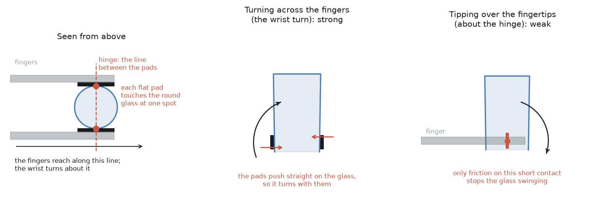
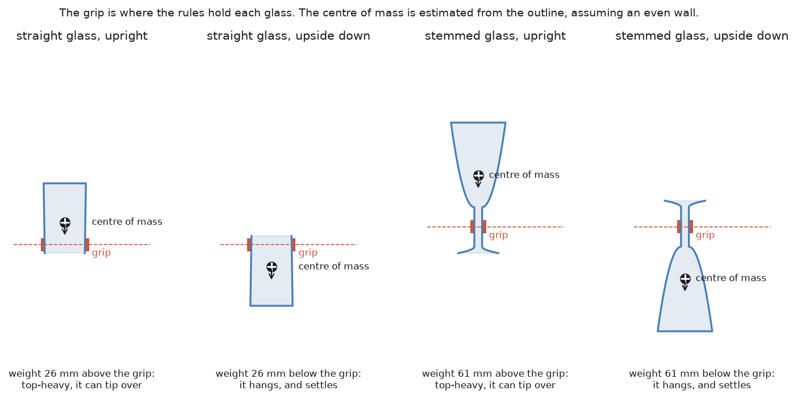
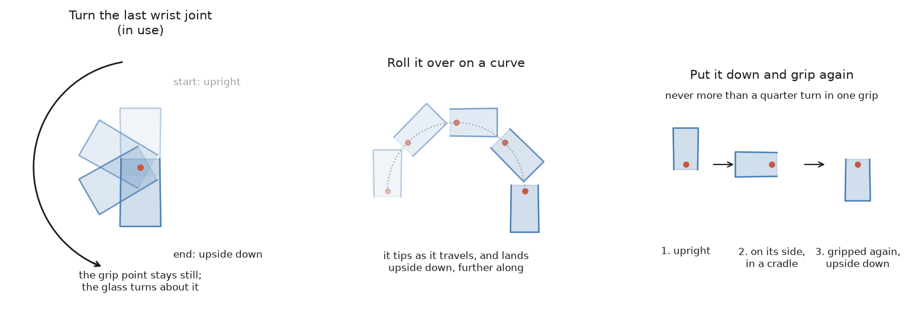
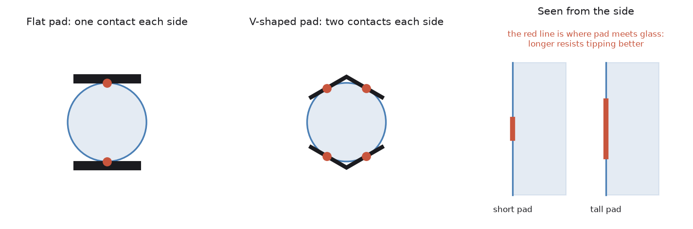

# Step 6 — other ways to turn a glass over

[`step6-turning-it-over.md`](step6-turning-it-over.md) explains how the arm
turns a glass over today. This document is about one part of that step only:
**getting the glass through half a circle while it stays still in the
fingers.** Putting it into the rack afterwards is a separate problem and is
left out here.

It starts with what has been learned about why the glass moves in the fingers,
because that decides which approaches are worth trying. Then it lists the
approaches, in plain words, and says which to try first.

## First, what goes wrong

### The hinge

The gripper has two flat pads. A glass is round. So each pad touches the glass
along one short upright line, not over an area.

That holds the glass's **weight** well. The glass cannot slide down, because
both pads press on it and friction stops it.

It does not hold the glass against **turning** well. Draw a line from one pad
to the other, straight through the glass. The glass can swing about that line,
like a door on its hinge. The only thing that stops it is friction over a
contact a few millimetres tall, which is very little.

So picture the glass hanging on a hinge between the fingertips. Anything that
pushes it round that hinge makes it swing.

The left picture is the grip seen from above: each flat pad touches the round
glass at one spot, and the dashed line through those two spots is the hinge.
The other two pictures are the two ways the glass can be turned, which the
next sections come back to.

### What pushes it round the hinge

- **Its own weight, when the weight is not on the hinge line.** The middle of a
  glass's weight — its *centre of mass* — is usually a little above where the
  arm holds it. Upright, that makes the glass top-heavy on the hinge. Upside
  down, the weight is below the hinge and hangs there, which is stable. The
  further the centre of mass is from the hinge, the harder it pushes.
- **The arm speeding up, slowing down or turning.** A quick move is a push.
- **Knocks.** Anything the glass touches on the way — a peg, the table — is a
  push.

Each glass is held where the grip rules choose, and its centre of mass is
estimated from its outline. On the straight glass the weight is 26 mm above
the grip, so upright it is top-heavy on the hinge, and upside down it hangs.
On the stemmed glass the weight is up in the bowl, more than twice as far from
the only place it can be held.

### Which way the arm turns it matters most

A turn about the line the fingers reach along — which is what the last wrist
joint does — carries the glass round with the pads pushing *straight* on it.
That is the strong direction. The glass cannot lag behind, because the pads
are in the way.

A turn about the hinge line itself tips the glass forward or back over the
fingertips. Then only friction carries the glass round. That is the weak
direction, and any approach that turns the glass this way will struggle.

In the hinge picture above, the middle one is the strong direction and the
right one is the weak direction.

**Keep this in mind for every approach below:** turning *across* the fingers is
strong, tipping *over* the fingertips is weak.

### What was found in the simulator

These came out of running `make one SEED=11` again and again with the glass's
real position recorded. Each one hid the next.

| What was wrong | What it did | Status |
| --- | --- | --- |
| The turn was a full 180° on top of the 20° slip test | the glass arrived 20° off upside down | fixed, checked |
| The glass was carried in below the peg tops | a peg knocked it round in the fingers | fixed, checked |
| The simulator had all the glass's weight at its very bottom | upside down it was top-heavy on the hinge and swung back over | fixed |
| The squeeze was sized for the weight only | the glass tipped 25° on the hinge as it was lifted | fixed, checked: held at the wall's rating now |
| The touch on the rack was read as size only, not direction | the arm pushed the glass up through the fingers | fixed, not yet tested |

With the first four fixed, the glass stayed upside down to within 1–2° all
the way from the turn to the rack. So the turn is not hopeless as it is. But
it now depends on squeezing at the most the glass is rated for, and on a
glass whose centre of mass sits close to the grip. A taller glass, a heavier
base or a thinner wall will use up that margin. Hence the approaches below.

A warning about the simulator: it models a pad touching a round glass as a
few points of contact. A real rubber pad squashes and touches over a small
area, and grips better against turning. So the simulator probably makes the
hinge weaker than it really is. A turn that works in the simulator should
work at least as well on a real arm. The reverse is not guaranteed.

## The approaches

Three of the approaches are different ways of moving the glass. This is what
they look like, side on:

The rest change the grip instead: where the glass is held, or what holds it.

| Approach | In one line | Turns the glass | What it needs | Suitability here |
| --- | --- | --- | --- | --- |
| **Turn the last wrist joint** | spin the last joint half a turn | across the fingers (strong) | nothing new | in use |
| **Turn with the whole arm** | every joint moves so the glass turns on the spot | whichever way you choose | [MoveIt 2](https://moveit.ai/), room | a fallback when the wrist has no room left |
| **Roll it over on a curve** | lift, then swing the glass up, over and down, turning it as it travels | depends on the direction of the curve | MoveIt 2 [Pilz planner](https://moveit.picknik.ai/main/doc/how_to_guides/pilz_industrial_motion_planner/pilz_industrial_motion_planner.html) arcs | good, if the curve runs across the fingers |
| **Hold it at its centre of mass** | grip where the weight is | — | the wrist force sensor | best single fix for the hinge |
| **Better pads** | V-shaped or taller pads | — | a new gripper model | strong fix, and cheap in the simulator |
| **More fingers** | a hand that wraps round the glass | — | a different gripper | strong, but a big change |
| **Suction on the base** | hold it by its flat base | — | a suction cup | strong, but the base starts on the table |
| **Put it down and grip again** | turn it in two quarter turns, setting it down in between | never more than 90° in one go | a flat place, or a holder | reliable and slow |
| **Watch it and react** | notice the glass starting to turn and slow down | — | the wrist force sensor | useful with any of the above |
| **Copy a person** | learn the turn from shown examples | whatever the examples did | [LeRobot](https://github.com/huggingface/lerobot), [ACT](https://tonyzhaozh.github.io/aloha/), [Diffusion Policy](https://diffusion-policy.cs.columbia.edu/) | possible, later |
| **Learn by trial** | reward the arm for turns that keep the glass still | whatever it finds | [MuJoCo](https://mujoco.org/), [Isaac Lab](https://isaac-sim.github.io/IsaacLab/) | poor fit for now |

## What each one does

Each approach below names the section of robotics-basics that treats it at
length. The two that cover the most ground here are
[grippers and hardware](https://github.com/RobinNagpal/robotics-basics/blob/main/docs/07_gripping/02_grippers-and-hardware.md), for the ones that
change the gripper, and [holding on](https://github.com/RobinNagpal/robotics-basics/blob/main/docs/07_gripping/05_holding-on.md), for the ones that
change what happens while the glass is held.

### Turn the last wrist joint

This is what the arm does today. The arm stops, and only the last joint
turns. That joint's axis runs along the fingers and through the glass, so the
glass turns on the spot and nothing else moves.

**Good:** the glass is turned across the fingers — the strong direction. The
move is simple, and the same every time. Nothing is planned, so nothing can
choose a strange path.

**Bad:** the last joint cannot turn freely forever. So before the fingers
close, the arm chooses which way round to hold the glass, so that the joint has
room for the half turn. And the glass has to be held with its centre of mass
close to the grip, or it swings on the hinge before and after the turn.

**Status:** in use. How well it holds is in *What was found in the simulator*,
above.

### Turn with the whole arm

The glass ends up in exactly the same place, upside down, but every joint
moves to get it there rather than just the last one.

**Good:** it does not depend on how much room the last joint has left. The arm
can choose the turning direction, so it can always turn across the fingers.

**Bad:** it needs a lot of space around the glass, because the elbow and
shoulder swing through big arcs. A planner is free to find a strange path, and
one here once swung a held glass up over the top of the arm and threw it out.
So it has to be forced along a fixed path, not planned freely.

**When to use it:** as a fallback, when the last joint has no room left to
turn.

### Roll it over on a curve

The glass is picked up and then carried along a curve instead of turned on the
spot. As it travels up, it tips. At the top of the curve it is lying on its
side. As it comes down the other side it keeps tipping, and it arrives
upside down, lower down and further along than where it started. Think of
pouring a drink and carrying on until the glass is fully over.

Two things to do first:

1. **Lift it clear, and move it away from the table.** The end of the curve is
   lower than the start, so a curve started right at the table ends in the
   table.
2. **Pick the direction of the curve with care.** This decides everything:
   - If the curve goes **sideways, across the fingers**, the glass is turned
     the strong way, like the wrist turn. This is a good approach.
   - If the curve goes **forwards, over the fingertips**, the glass is tipped
     the weak way, about the hinge. Only friction carries it round, and it
     will lag behind and swing. Avoid this.

**Good:** the motion is smooth and continuous. Gravity changes direction on
the glass slowly rather than all at once. The wrist does not have to turn a
full half circle, because the rest of the arm shares the work. And the
glass arrives already lowered, which suits the rack.

**Bad:** it needs room along the whole curve. It is harder to aim, because
the glass ends up somewhere other than where it started.

**How to build it:** MoveIt 2 includes the
[Pilz industrial motion planner](https://moveit.picknik.ai/main/doc/how_to_guides/pilz_industrial_motion_planner/pilz_industrial_motion_planner.html).
It has a `CIRC` move that follows a circle arc exactly, and a `LIN` move for
straight lines. One `LIN` to lift clear, then one `CIRC` for the roll over.
Or the curve can be written out as many small straight steps, the way the
descent onto the rack is written today.

### Hold it at its centre of mass

Longer treatment: [the centre of mass, and the torque nobody budgets
for](https://github.com/RobinNagpal/robotics-basics/blob/main/docs/07_gripping/03_choosing-a-grip.md#5-the-centre-of-mass-and-the-torque-nobody-budgets-for).
Two rules there decide this on their own: grasping *above* the centre of mass
is stable and grasping below it is an inverted pendulum in the fingers, and the
limit that matters is not the gripper's moment rating but the much smaller
torque the friction patch can resist before the glass turns. It also gives the
measurement — the wrist reads torque as well as force, so the offset is the
torque divided by the weight.

The hinge only swings if the glass's weight is to one side of it. If the pads
hold the glass right at its centre of mass, there is nothing to swing it,
whichever way up it is.

The problem is finding the centre of mass. The camera sees the outline but not
the glass inside: a thick heavy base puts the centre low, and nothing in the
picture says so. There are two ways round that:

- **Estimate it from the outline**, assuming an even wall. Quick, but it
  missed by 13 mm on the glass tested, because that glass has a solid base.
- **Feel for it.** Lift the glass a centimetre and tilt it a little. The wrist
  force sensor measures how hard the glass twists the wrist. If the centre of
  mass is off the grip, the twist changes as it tilts, and by how much says
  how far off. Put it down and grip again at the right height.

**Good:** it fixes the cause, not the symptom. It helps every approach on this
page.

**Bad:** it still has to fit the grip rules. The grip must stay below half
the glass's height, so the fingers are clear of the rack, and above the height
where the gripper body hits the table. On a stemmed glass it cannot work at
all: the only place to hold is the stem, and the weight is in the bowl above,
as the weight picture above shows.

### Better pads

Longer treatment: [soft and compliant grippers](https://github.com/RobinNagpal/robotics-basics/blob/main/docs/07_gripping/02_grippers-and-hardware.md#5-soft-and-compliant-grippers),
and [the force you command is not the force you get](https://github.com/RobinNagpal/robotics-basics/blob/main/docs/07_gripping/02_grippers-and-hardware.md#22-the-force-you-command-is-not-the-force-you-get),
which is the part that bites: a softer pad gives way, so the same setting
delivers materially less force. Robotiq publish 220 N against steel and 115 N
against soft rubber for one gripper at one setting.

The hinge is weak because each flat pad touches a round glass along one thin
line. Change the pad shape and that line becomes something wider:

- **A V-shaped pad**, a shallow groove down the middle of each pad, touches a
  round glass along two lines instead of one. Two lines apart from each other
  resist turning far better than one.
- **Taller pads** make each contact line longer, which gives more to resist the
  swing with.
- **Softer pads** squash around the glass and touch over an area. Silicone does
  this naturally.

**Good:** the biggest improvement for the least change. In the simulator it is
a change to the pad shapes in `arm/gripper.urdf.xacro`, and nothing else.

**Bad:** the pads are part of the gripper, so this is only real if the real
gripper is given the same pads. A V-groove also has to suit narrow stems as
well as wide tumblers.

### More fingers

Longer treatment: [multi-finger hands](https://github.com/RobinNagpal/robotics-basics/blob/main/docs/07_gripping/02_grippers-and-hardware.md#6-multi-finger-hands),
and [in-hand manipulation](https://github.com/RobinNagpal/robotics-basics/blob/main/docs/07_gripping/05_holding-on.md#7-in-hand-manipulation) for
what they are actually for. Worth knowing before costing one: finger gaiting,
the thing that would turn a glass in the hand, is the hard research problem and
the deployed systems are approximately none.

A gripper with three fingers, or a hand whose fingers wrap part-way around,
touches the glass in several places around its outline. There is no single
line to hinge about, so the glass cannot swing. Examples are three-finger
adaptive grippers and soft grippers that curl round what they hold.

**Good:** it removes the hinge completely.

**Bad:** it is a different gripper, which changes grasping, reach and the
simulator model. Too big a change to make just for this step.

### Suction on the base

Longer treatment: [suction](https://github.com/RobinNagpal/robotics-basics/blob/main/docs/07_gripping/02_grippers-and-hardware.md#3-suction), with
the arithmetic that turns a cup diameter into a holding force, and
[suction models](https://github.com/RobinNagpal/robotics-basics/blob/main/docs/07_gripping/04_models-that-grasp.md#6-suction-models).

A suction cup on a flat surface holds against turning in every direction. The
base of a glass is flat. The side of a glass is curved, and suction holds
poorly there.

**Good:** a very firm hold against any turn.

**Bad:** at the start the base is standing on the table, so it cannot be
reached. The glass would have to be picked up some other way first and handed
over, which adds a whole step. Suction also needs air lines and a pump.

### Put it down and grip again

Longer treatment: [regrasping](https://github.com/RobinNagpal/robotics-basics/blob/main/docs/07_gripping/05_holding-on.md#6-regrasping), which names
the hard part — not the mechanics but guaranteeing the pose the glass lands in.
An object set down settles into whichever stable pose it was nearest to, and
the industrial answer is a shaped nest that admits exactly one.

Don't do the whole half turn in one go. Turn the glass a quarter of the way,
so it is lying on its side, and lay it down on the table, or in a simple
holder that stops it rolling. Let go. Grip it again from the other side. Turn
it the last quarter.

**Good:** the glass is never held through more than a quarter turn, so the
hinge has much less chance to swing. It is also how a person with a clumsy
grip would do it.

**Bad:** it is slow, and it puts the glass down on its side, where a round
glass wants to roll. A holder, or a shallow cradle on the table, fixes that
but has to be added to the cell. Each extra grip is another chance to
knock the glass.

### Watch it and react

Longer treatment: [feedback, and what to do with it](https://github.com/RobinNagpal/robotics-basics/blob/main/docs/07_gripping/05_holding-on.md#5-feedback-and-what-to-do-with-it),
which tabulates every signal a gripper can give, what each one settles, and
what people wrongly believe it settles. Its two conclusions are worth having
before building anything here: no single signal confirms a good grasp, and the
finger-gap check
[does not see a glass sliding](https://github.com/RobinNagpal/robotics-basics/blob/main/docs/07_gripping/05_holding-on.md#41-the-finger-gap-check-and-what-it-cannot-see).

The wrist force sensor already reads the glass's weight. It can also read
twist. If the glass starts swinging on the hinge, the twist the sensor feels
changes. The arm could watch for that during the turn and slow down, or stop
and go back.

**Good:** it catches the failure as it starts, not after the glass is already
upside down in the wrong place. The project's rule is that the last
millimetres are felt, not driven. This would do the same for the turn.

**Bad:** it does not stop the swing, it only notices it. It is best added on
top of one of the approaches above, not used alone.

### Copy a person

Longer treatment: [dexterous hands, and grasping language
models](https://github.com/RobinNagpal/robotics-basics/blob/main/docs/07_gripping/04_models-that-grasp.md#7-dexterous-hands-and-grasping-language-models).

Someone drives the arm through the turn by hand, many times, in the
simulator. A small neural network learns from those examples to do the same:
what the camera sees and what the sensors feel go in, and joint moves come out.
[ACT](https://tonyzhaozh.github.io/aloha/) and
[Diffusion Policy](https://diffusion-policy.cs.columbia.edu/) are the usual
choices, and [LeRobot](https://github.com/huggingface/lerobot) packages both.
The sibling project [`v5-learn-pick-place`](../../../v5-learn-pick-place) trained
this kind of model for picking blocks.

**Good:** a person naturally does the turn that works — slowly, across the
fingers, with the weight kept close. The model can copy that without anyone
writing down why it works.

**Bad:** it needs many good examples, and it can only be as good as they are.
It cannot say why it did what it did, and this project is built on being able
to say why. It also learns the glasses it was shown. A glass of a new size or
weight is exactly where it would be least trustworthy. And until the hinge is
understood, the examples themselves will keep failing.

### Learn by trial

Put the arm in a simulator and let it try thousands of turns. Reward the turns
where the glass stays still in the fingers, and penalise the ones where it
swings or drops. Over time it finds a turning motion and a squeeze that work.
[MuJoCo](https://mujoco.org/) and [Isaac Lab](https://isaac-sim.github.io/IsaacLab/)
are the usual simulators for this.

**Good:** it may find a motion nobody thought of.

**Bad:** it learns the simulator, not the world. The simulator's hinge is
weaker than a real pad's (see the warning above), so what it learns may not
carry over. It also needs a lot of computing time and careful tuning. It is the
wrong tool while the problem can still be solved by understanding it.

## Which to try first

In order:

1. **Finish testing what is there.** The wrist turn now holds the glass to
   within 1–2°. The last fix, reading the touch on the rack with its direction,
   has not been tried yet. Run `make one SEED=11` and see whether the glass
   goes in.
2. **Better pads.** V-shaped, taller pads are the cheapest large gain against
   the hinge, and in the simulator they are a change to one file. They also
   take the pressure off squeezing at the glass's full rating.
3. **Hold it at its centre of mass,** found by feel with the wrist sensor.
   This fixes the cause for tumblers, and it slots into the grip rules as one
   more thing to aim for.
4. **Watch it and react** during the turn, so a swing is caught when it
   starts.
5. **Roll it over on a curve, across the fingers,** if the wrist turn keeps
   running out of room or the glass needs to arrive lower. Build it with the
   Pilz `CIRC` move.
6. **Put it down and grip again,** as the fallback for glasses nothing else can
   turn.
7. **Learning,** only once the above has shown what a good turn looks like.
   The examples to learn from have to exist first.

← [Step 6 — turning it over and standing it down](step6-turning-it-over.md)
