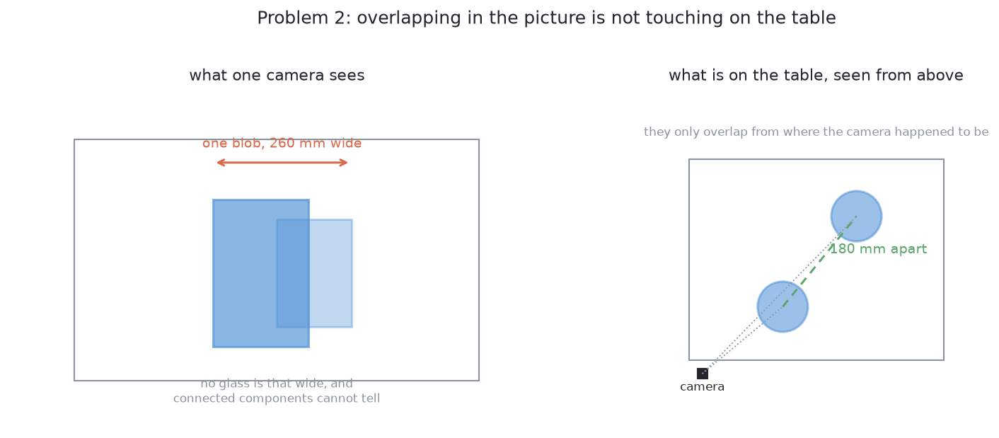
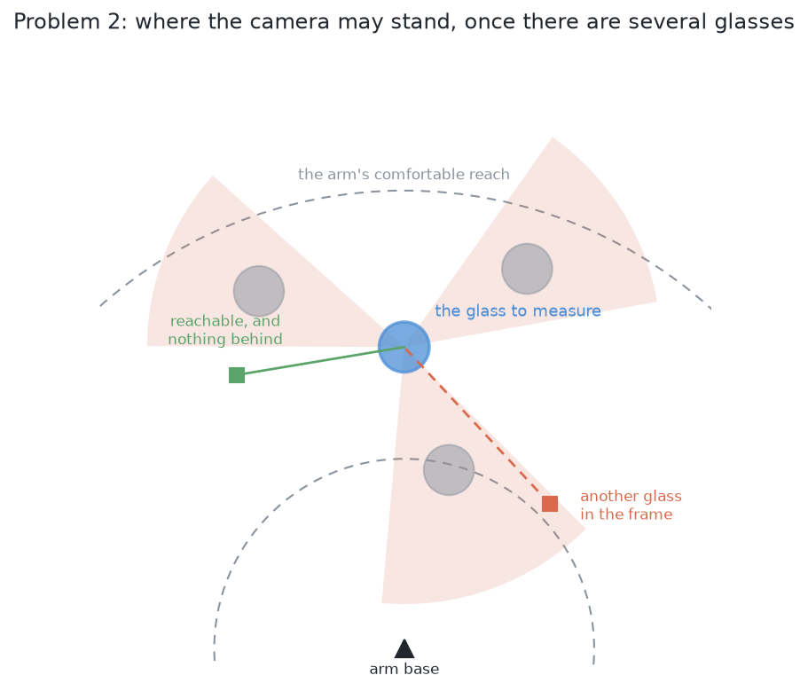

# Problem 2 — many glasses of one kind, seen from few viewpoints

Several glasses stand on the table. They are all the same kind, and the kind is
known. The arm photographs them, and has to work out **which pixels belong to
which glass**.

That is the whole problem. It does not pick anything up, and it does not
measure a profile. It ends with a set of pixels per glass, and a place on the
table for each.

## What is on the table

Four to six glasses, all of one kind, drawn at proportions picked at random
inside that kind's plausible range. They stand upright, opaque, at least 150 mm
from each other. The rack is where it always is.

Nothing else changes from [problem 1](../problem-1/problem.md). Same cell, same
camera, same table.

## What is asked for

For each glass on the table:

- a **mask** — which pixels in which picture are that glass and not another;
- a **position** on the table, in millimetres from the arm's base;
- a **rough width** of its footprint.

And one thing problem 1 never had to produce: an honest statement of **which
glasses it could not separate**, and why. A pair the arm cannot tell apart is a
result, and it is the input to [problem 3](../problem-3/problem.md).

## The two difficulties, which are not the same

### Glasses merge in the picture even when they are apart on the table

Problem 1 finds a glass by taking the pixels that stand above the table top and
grouping them with a flood fill. With one glass that is enough. With several it
is not, because **two glasses that are nowhere near each other can still land on
top of each other in a picture**, if the camera happens to be in line with both.
The flood fill then returns one blob, and one blob means one glass to everything
downstream.

The blob is 260 mm wide and no glass in the cell is, so *something* could notice.
But noticing is not separating, and the projection has thrown away the
information needed to separate them: which pixels were near and which were far.

The fix is not a better flood fill. It is to stop grouping in the picture.

### The camera can no longer stand wherever it likes

This is the difficulty the problem is really about, and it is easy to miss when
reading problem 1, because problem 1 simply does not have it.

Problem 1's step 2 measures a glass by putting the camera 380 mm from it,
looking level, and photographing its outline. It tries nine directions round the
glass and takes the first the arm can reach. With one glass on a bare table,
several always work.

With five glasses, each direction has to clear three separate things at once:

- **the line of sight.** Another glass behind the target lands in the same
  picture and the two measure as one object as wide as the table.
- **the arm.** The camera is on the wrist, so putting it somewhere means putting
  the whole arm somewhere, and the path there may cross over a glass that is in
  the way.
- **the reach.** Standing 380 mm back from a glass already near the edge of the
  working area puts the camera outside it.

Each of those alone is survivable. Together they can leave a glass with **no
usable viewpoint at all** — which is not a failure of perception but a fact
about where the glasses are standing, and the only way out of it is to move
something.

## What is deliberately not in this problem

**Naming the kind.** They are all the same kind and it is known. Problem 4 is
where that stops being true.

**Measuring a profile.** A profile needs the side-on view, and whether a side-on
view is available is exactly what this problem is about. Once problem 2 has said
which glasses can be seen from where, problem 1's step 2 does the measuring
unchanged.

**Picking anything up.** No grasp, no lift, no rack.

**Moving anything.** If two glasses cannot be separated from any reachable
viewpoint, this problem reports that and stops. Moving them apart is
[problem 3](../problem-3/problem.md).

## What "done" means

A run is **done** when every glass on the table has a mask, a position and a
rough width, and every glass that could not be separated from its neighbour is
listed with the reason.

Scored against the simulator's own record of what it spawned — which the report
may read and the arm may not — the numbers worth watching are:

- how many glasses were found, against how many were put out;
- how many were **merged**: two real glasses reported as one;
- how many were **split**: one real glass reported as two;
- for each glass found, how far its reported position is from the true one;
- how many glasses had no usable viewpoint, which is the handover to problem 3.

The one to watch hardest is *merged*, because a merged pair is the failure that
does not announce itself. A split glass looks wrong immediately. A merged pair
looks like one large glass, and everything downstream believes it.

## How it would be solved

→ [Solution overview](solutions/solution-overview.md)
