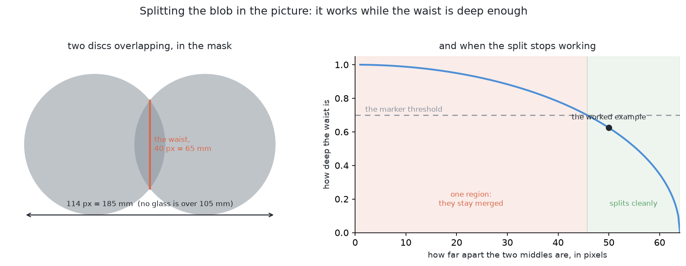

# Problem 2 — how it would be solved

[`problem.md`](problem.md) says what is being asked for. This document says how
it would be answered. It is long, because the point of it is to compare five
ways of doing the job properly rather than to announce one.

## Where we are

The arm has photographed a table with four to six glasses on it. They are all
the same kind, the kind is known, and they are opaque, so the depth camera sees
them perfectly well.

What it has to produce is one set of pixels per glass, a place on the table for
each, and an honest list of the ones it could not separate. It does not pick
anything up. It does not measure a profile. Those come later, and they depend
on this being right, which is why a wrong answer here is expensive.

Two things stand in the way, and they are different problems wearing the same
coat.

**Glasses merge in the picture even when they are far apart on the table.** If
the camera is in line with two of them, one lands on top of the other in the
photograph, and the method problem 1 uses returns them as a single object.

**The camera can no longer stand wherever it likes.** Problem 1 measures a
glass from whichever of nine directions the arm can reach, and with a bare
table several always work. With five glasses, a direction has to clear the line
of sight, the arm's own path, and the edge of its reach at the same time.

## The words, first

Five terms are used throughout, and three of them are used loosely almost
everywhere else. It is worth fixing them before the solutions start.

A **pixel** is one dot in a picture. This camera takes pictures 320 dots wide
and 240 tall.

A **mask** is a picture the same size where every pixel is just yes or no. Here,
yes means "this pixel is part of a glass".

**Connected components**, also called a flood fill, is the step that turns a
mask into separate objects. Take a yes pixel nobody has visited, spread out to
every yes pixel touching it, and call that patch one object. Repeat. It answers
exactly one question — *are these pixels joined?* — and it never asks anything
else, which is the root of the first difficulty above.

A **point cloud** is what you get when every pixel with a depth reading is
turned into a point in the room. The pixel says which direction the camera was
looking, the depth says how far along that direction to go, and the camera's
pose says where the direction starts. Problem 1 already does this.

**Segmentation** is the word that carries three different jobs, and only one of
them answers this problem.

- **Detection** puts a rectangle round each object. Two overlapping glasses get
  two overlapping rectangles, and the pixels in the overlap belong to both.
- **Semantic segmentation** labels every pixel with a class. Every glass pixel
  comes back labelled "glass", and nothing says which glass. Two overlapping
  glasses are one region — which is the merge this problem exists to prevent.
- **Instance segmentation** labels every pixel with a class *and* with which
  object it belongs to. Five glasses come back as five separate masks.

Problem 2 asks for instance segmentation. Anything that gives less than that
has not answered it.

## The five solutions, at a glance

| | Solution | What it reasons about | Programmed or learned | Verdict |
| --- | --- | --- | --- | --- |
| 1 | [Split the blob in the picture](#solution-1--split-the-blob-in-the-picture) | pixels | programmed | cheap, and treats the symptom |
| 2 | [Cluster on the table](#solution-2--cluster-on-the-table) | points in the room | programmed | **chosen** |
| 3 | [Move the camera](#solution-3--move-the-camera) | where to look next | either | **chosen, alongside 2** |
| 4 | [Prompt a segmenter](#solution-4--prompt-a-segmenter) | pixels, with a hint | learned | kept as a fallback |
| 5 | [Train an instance model](#solution-5--train-an-instance-model) | pixels | learned | the answer for real glassware |

They are in order of how much machinery they need, not in order of preference.
Each is written the same way: what it is, why anyone does it like that, how it
would work in this cell, a worked example with real numbers, what it needs, what
it is good and bad at, how it fails, and when it would be the right choice.

Two of them are chosen, because the two difficulties above are separate
problems. Solution 2 answers the first. Solution 3 answers the second. The
[decision](#the-decision) at the end says how they fit together.

---

## Solution 1 — split the blob in the picture

*Keep the mask problem 1 already builds. When one patch is too wide to be a
single glass, cut it in two, using nothing but the picture.*

### What it is

Problem 1 builds a **mask**: a picture the size of the camera's, each pixel
marked yes where the 3D point there stands above the table top. It then runs a
**flood fill**, or **connected components**: take an unvisited yes pixel, spread
to every yes pixel touching it, call that patch one object, repeat.

Connected components answers one question — *are these pixels joined?* It never
asks how wide the patch is. So two glasses whose silhouettes touch anywhere come
back as one patch, and one patch means one glass downstream.

This approach adds a step: when a patch is too wide to be one glass, cut it,
using only the picture.

### Why anyone does it this way

Splitting a clump of touching things of one colour is an old job in image
processing, and watershed was designed for it. robotics-basics sets it out under
[watershed and GrabCut](https://github.com/RobinNagpal/robotics-basics/blob/main/docs/06_object-perception/03_programmed-methods.md#15-watershed-and-grabcut),
and lists "objects that overlap" as a job
[connected components](https://github.com/RobinNagpal/robotics-basics/blob/main/docs/06_object-perception/03_programmed-methods.md#13-edges-contours-and-connected-components)
cannot do. It is also the cheapest thing on the list: no new sensor, no model
file, no training set, no graphics card.

### How it would work here

**The distance transform.** For every yes pixel, write down how far it is to the
nearest no pixel. Deep inside a blob that number is large; one pixel in from the
edge it is 1. Upside down, it is a landscape: blob middles are valleys, edges are
ridges.

**Markers.** A marker is a patch declared in advance to belong to one object.
Two ways to get them with no human. Take the **local maxima** of the distance
transform — the deepest points, one per glass. Or shave layers off the outside
until the bridge between the glasses is eaten away and two lumps are left. The
**erosion trick** is the same thing: eroding by a disc of radius *r* keeps the
pixels deeper than *r*.

**Watershed, and what flooding means.** That landscape has one basin per glass.
Punch a hole at each marker and let water rise through it at the same rate
everywhere. Each basin fills with its own colour, and where two would meet a wall
is built instead. When the flooding stops, every pixel belongs to one marker and
the walls are the cuts. Watershed is a flood fill starting from several places at
once and stopping where the floods collide.

**GrabCut, and where it fits.** GrabCut refines a rough box round one object
into a tight outline, by modelling the colours inside the box against those
outside. It does not split a clump, so it is not the tool for this job. It comes
afterwards, to tighten each half.

**The round-object version.** From above a glass is a circle, and two
overlapping circles make a blob with a **waist**, a pinch where the outlines
cross. That is the narrowest place, so the distance transform dips there, and
cutting there is the whole method, specialised. Its close relative is **Hough
circle detection**, which scores every centre and radius against the edges.

**Licence.** `cv2.distanceTransform`, `cv2.erode`, `cv2.watershed`,
`cv2.grabCut` and `cv2.HoughCircles` are OpenCV, Apache-2.0, free commercially;
the same algorithms are in scikit-image, BSD-3. Neither needs a GPU, which
matters on a Mac with no NVIDIA card.

### A worked example

At survey height, 450 mm up, one picture covers about 520 by 390 mm across 320
by 240 pixels, so one pixel is 1.6 mm.

Two glasses of the widest kind, 105 mm across, stand in line with the camera. Each
silhouette is about 65 pixels wide, and their centres land 50 pixels apart, so the
outlines overlap and the flood fill returns one blob of 114 pixels by 65 — **185
by 105 mm**. No glass 105 mm across can be 185 mm long, so it is flagged.

The distance transform peaks at 32 pixels (52 mm) at each centre and dips to 20
pixels (32 mm) at the waist. Threshold at 0.7 of the peak, 22.4 pixels: the bridge
drops out and both peaks survive. Flood from them and they collide at the waist,
leaving a cut 40 pixels long. Two pieces come out, each about 104 mm across,
inside the kind's range.

The split worked. Both positions are still silhouettes laid on the table plane,
and problem 1 measured what that costs: a glass 157 mm away reported at 244 mm.

### What it needs

The mask problem 1 already builds. One number, the largest footprint the kind
can have, which its specification holds. One tuning constant, the fraction of the
peak at which markers are cut. OpenCV, already a dependency.

### What it is good at

It is cheap: a millisecond a frame, no weights file to keep in step with the
glassware, no data to collect. Its failures are legible — find the number that was
too low and you know why. And it **needs no depth at all**. If the depth camera
fails, or the glasses become real glass, every geometric method here stops and
this one carries on, given a mask from colour.

### What it is bad at

It cannot tell a wide blob from two glasses; width is the whole of its evidence.
It gives no position better than the one it started with, since both halves are
still silhouettes on the table plane carrying the same bias. And 0.7 is not a fact
about anything. It is a number that worked on the examples it was tried on.

### How it fails

**Heavy overlap.** The same two glasses, 20 pixels apart instead of 50. The blob
is 137 mm long, still too wide to be one glass, so it is noticed. But the waist is
now 30 pixels against a 32-pixel peak, a dip of six per cent. No threshold
separates the markers without destroying them, so watershed returns one region.
The split holds only while the centres are more than about 1.43 radii apart, here
46 pixels or 74 mm. Light overlap is easy. Heavy overlap is the case that matters,
and it is the one that fails.

**Over-splitting.** A ragged mask edge puts a second dip in the distance
transform, and watershed cuts one glass in two. That at least is loud: the pieces
come out too small for the kind.

**The fundamental objection.** The blob is wide **because of where the camera
was standing**, not because of anything about the glasses. Two glasses 150 mm
apart merge from one viewpoint and separate cleanly from another 200 mm along, and
nothing in the mask records that. A method reasoning inside the picture cannot
tell a projection accident from two objects genuinely side by side, so it cuts
both the same way. The depth picture holds that answer already, and clustering on
the table reads it directly.

### When it would be the right choice

When there is no depth. On real glassware the depth picture has a glass-shaped
hole where the glass is, and every method that clusters points in the room has
nothing to cluster. A mask from colour plus a watershed split is then a working
answer rather than a worse one.

Also as a cheap second check: if a cluster's fitted circle is far too big, a
watershed on its pixels costs a millisecond and either agrees or does not.

It is the wrong separator to lead with here, because the depth is present and
already knows what the picture threw away.

---

## Solution 2 — cluster on the table

*Stop deciding which pixels go together by looking at the picture. Decide it by
looking at where they are in the room.*

### What it is

Stop deciding which pixels go together by looking at the picture. Decide it by
looking at the table.

Every pixel in a depth picture can be turned into a point in the room — the
pixel says which direction the camera was looking, the depth says how far along
that direction to go, and the camera's pose says where that direction starts.
Problem 1 already does this, to find out which points are above the table top.

Once the pixels are points, "which glass is this?" becomes a question about
distance in the room rather than about neighbouring pixels. Points that are
close together in the room are one glass. Points that are far apart are two,
**even when they were next to each other in the picture.**

Grouping points by how close they are is called **clustering**. The version
used here is the simplest one: start with a point, take everything within a few
millimetres of it, take everything within a few millimetres of those, and carry
on until nothing new is added. That clump is one object. Then start again with
a point that has not been used. It has a name — Euclidean cluster extraction —
and one parameter, the distance that counts as "close".

### Why anyone does it this way

Because it is the standard recipe for a robot arm over a table, and it has been
for twenty years. Robotics-basics sets it out as
[point clouds: remove the plane, then cluster](https://github.com/RobinNagpal/robotics-basics/blob/main/docs/06_object-perception/03_programmed-methods.md#16-point-clouds-remove-the-plane-then-cluster):
take the depth picture as a cloud of points, find the biggest flat surface and
delete it — that is the table — and group what is left into clumps. Each clump
is an object.

It is the default because of what it does *not* need. No training data. No
model file. No idea what the objects are. It works on an object the robot has
never seen, which no model trained on fixed classes does, and it gives 3-D
positions in metres directly, which is what the arm needs anyway.

This cell gets one simplification for free. The standard recipe finds the table
with RANSAC, a search that picks three points at random, makes the plane through
them, counts how many other points lie on it, and keeps the best after a few
hundred tries. Here the table is bolted to the same frame as the arm and its
height was measured at startup, so the plane is a constant and finding it is a
comparison rather than a search.

### How it would work here

Four steps, and the project already has the first.

**1. Points above the table.** Unchanged from problem 1. Every pixel with a
depth becomes a point; keep the ones more than 5 mm above the table top and
less than 260 mm above it, which is the tallest glass the cell handles.

**2. Group them by distance on the table.** Project each point straight down
onto the table and group the resulting dots. Two glasses 150 mm apart are two
groups of dots 150 mm apart, whatever the camera was doing. The grouping
distance has to be smaller than the gap between glasses and larger than the gap
between two points on one glass. At survey height one pixel is about 1.6 mm on
the table, and the glasses stand at least 150 mm apart, so anything between
about 10 mm and 100 mm works. Take 25 mm: comfortably above the noise, and far
below the smallest real gap.

Projecting down rather than clustering in full 3-D is worth doing on purpose.
A glass is a tall thin thing, and in 3-D its top and its bottom are 200 mm
apart, which is further than the gap to its neighbour. Flattened onto the table
it is a disc 75 mm across, and the ambiguity disappears.

**3. Fit a circle to each footprint.** A glass seen from above is a circle.
Fit one to each group's dots and you get a middle and a diameter, both better
than the bounding box the current code uses, because a fit uses every dot
rather than the two extreme ones.

Then check the diameter. **This is the step that makes the whole thing safe,
and it is only available because problem 2 says every glass is one known kind.**
The kind's own specification holds the range its rim can be — 45 to 105 mm
across the four kinds, and much narrower within one. A footprint outside that
range is not one glass. Try two circles instead. If two circles fit and both are
in range, there were two glasses; if they are not, say so and move on rather
than guess.

**4. Agree across stations.** The survey already visits several stations and
merges what they saw. Ask more of it: a glass should be found in about the same
place from more than one station, and a group seen from one station only should
be reported as doubtful rather than as a glass. Two glasses that merge from one
station will almost never merge from another 200 mm away.

### A worked example

Two glasses, 75 mm across, standing 180 mm apart, with the camera in line with
both.

*In the picture:* one blob. Laid down on the table its edges are 260 mm apart —
the far glass's ray lands beyond the near one. Connected components returns a
single object 260 mm wide. No glass in the cell is wider than 105 mm, so
something is wrong, but the picture cannot say what.

*On the table:* the near glass's points land in a disc round (0.42, −0.31). The
far glass's points land in a disc round (0.55, −0.19). The nearest dot of one
group is 105 mm from the nearest dot of the other. At a 25 mm grouping distance
they are two groups, not one.

*The circle fit:* 76 mm and 73 mm. Both inside the kind's 60–90 mm range. Two
glasses, at those two places, with a width each. Done.

Now the awkward case. The two glasses stand 90 mm apart, so their footprints
are 15 mm from touching. At 25 mm grouping they become one group. The circle
fit returns 165 mm, which is outside the range. Two circles are tried: 74 mm and
72 mm, 90 mm apart, both in range. Two glasses — and a pair this close is
exactly what problem 3 has to move.

### What it needs

Nothing that is not already installed. NumPy for the arithmetic. The depth
camera the cell already has. No model, no weights, no graphics card, no training
set, and no licence question.

About 25 lines of new code: the projection to the table, the grouping, and the
circle fit. Everything else exists.

### What it is good at

**It works on an object nobody has described.** The clustering knows nothing
about glasses. It groups points.

**It is fast and it is exact.** No inference, no sampling. On a 320×240 picture
this is a few milliseconds.

**It fails legibly.** Every step is a number you can print. A merged pair is a
diameter outside a range, and the report can say which range and by how much.

**The circle fit turns a guess into arithmetic.** "That is too wide to be one
glass" is a sentence with two numbers in it, and both are known.

### What it is bad at

**It cannot separate glasses that genuinely touch.** Distance separates them
only where there is distance. This is the limit that problem 3 exists to remove,
and it is a real one.

**The circle fit depends on knowing the kind.** That is what makes it strong in
problem 2 and it is exactly what problem 4 takes back. With four kinds on the
table the range is the union of four ranges, and a footprint too wide for a
tumbler is an ordinary wine glass foot.

**It needs depth.** Everything here begins with "turn the pixel into a point in
the room". Real glassware returns no depth at all, and then none of this runs.

### How it fails

**Two glasses one behind the other at almost the same distance** stay one
group, because on the table their discs overlap. The circle fit is the only
thing that notices.

**A glass at the edge of the picture** has half its points missing, and a circle
fitted to half a disc is biased towards the half you have.

**A reflection or a stray depth reading** adds dots where there is no glass. One
stray dot inside the grouping distance joins two groups into one. Dropping
groups below a minimum size handles most of this.

**The grouping distance is a chosen number.** 25 mm works for glasses 150 mm
apart. It will not work for glasses 20 mm apart, and problem 3's whole job is to
produce glasses that are further apart than that.

### When it would be the right choice

Whenever the objects are opaque, standing on a known surface, and mostly not
touching — which is to say, almost every table-top cell. It should be the first
thing tried, and the other four solutions in this document are what to reach
for when it is not enough: when the objects touch, when there is no depth, or
when the viewpoint itself is the problem.

---

## Solution 3 — move the camera

*Instead of working harder on the pictures you happen to have, go and take
better ones.*

### What it is

Every other approach here takes the pictures as given and works harder on them.
This one changes the pictures.

**Active perception** is the idea that a camera which can move is not the same
instrument as one that cannot. A fixed camera receives whatever the scene sends
it. A camera on a wrist can be *aimed*, and the aiming is part of the
measurement. The name is from Ruzena Bajcsy's *Active Perception* (Proceedings
of the IEEE, 1988), and the claim is that a problem unsolvable from one
viewpoint, however clever the maths, is often easy once the camera may move.

**Next best view**, usually NBV, is the loop that follows. Given what has been
seen, and the viewpoints the camera could reach, which one next? The term is
Connolly's, from *The Determination of Next Best Views* (ICRA, 1985).

### Why anyone does it this way

Because projection throws information away and no processing puts it back.
[`problem.md`](problem.md) says it plainly: two glasses in line with the camera
land on top of each other, and the picture no longer holds which pixels were
near and which far. A watershed on that blob is guessing. A camera 200 mm to
the left has the fact.

It is also cheap. A trained instance model wants a labelled set, weights and a
graphics card this cell has not got. An extra viewpoint costs seconds of arm
motion.

### How it would work here

An NBV loop has four parts: a **belief** about what is out there, a set of
**candidate viewpoints**, a **score** for how much each would help, and a
**cost** to reach it.

*Belief.* The survey already builds one: every cluster has a position, a
footprint circle and a confidence.

*Candidates.* Problem 1's `_standoffs()` already makes nine directions round a
glass at 380 mm, level, 120 mm above the table, and making that finer is free.

*Score.* The textbook score is **information gain**: mark the room in small
cubes as free, occupied or unknown, cast a ray per pixel from the candidate
pose, and count the unknown volume it would resolve.
[OctoMap](https://octomap.github.io/) (Hornung et al., *Autonomous Robots*,
2013; BSD licence) is the standard implementation, and MoveIt 2 keeps one
already, through its occupancy map monitor. Isler et al. (ICRA 2016) and
Delmerico et al. (*Autonomous Robots*, 2018) work the variants through, and it
is all CPU ray casting, so none of it wants CUDA.

It is also more than this cell needs. With one known kind and five glasses the
doubt is a short list of questions, mostly *is that 260 mm blob one glass or
two?* So the score becomes a heuristic: prefer the viewpoint whose wedge holds
the doubtful cluster and no other glass, then the one needing least reach.

*Cost.* The camera is on the wrist, so every viewpoint is an arm pose, and can
be unreachable or unplannable. Test reach with inverse kinematics first —
MoveIt 2's `setFromIK`, milliseconds — then call the planner on the survivors,
best first.

### A worked example

Glass A stands at x = 0.40, y = −0.30, so 500 mm from the base. Glass B is at
x = 0.52, y = −0.39: 650 mm out, 150 mm from A. The unit vector A→B is
(0.8, −0.6).

Two of the nine directions lie along that line, and both die on reach alone.
Standing 380 mm back from A on the far side from B puts the camera at
(0.096, −0.072) — **120 mm from the base**, inside the 300 mm minimum. On B's
side it lands at (0.704, −0.528) — **880 mm**, past the 780 mm limit.

The first was blocked as well. From there B is 530 mm away, and at fx = 277.1 a
105 mm footprint spans 105 × 277.1 / 530 ≈ **55 pixels** of the 320 across,
directly behind A. Two glasses, one silhouette.

Now the perpendicular direction, unit (0.6, 0.8). The camera goes to
(0.628, 0.004) — **628 mm from the base**, inside 300 to 780 — with B 90
degrees off the line of sight. At 380 mm one pixel covers 380 / 277.1 =
**1.37 mm**. That is the next best view, and arithmetic found it before the
planner was asked anything.

### What it needs

A belief to start from, which is the chicken and egg: you cannot predict what a
viewpoint would show without knowing roughly what is on the table, and that is
the job.

Two ways out. One is to score unknown volume rather than objects: at the start
everything is unknown, so a volumetric score works from nothing, which is what
exploration planners such as Bircher et al.'s open-source receding-horizon NBV
planner (ICRA 2016) do. The other is to keep the fixed opening sweep and go
adaptive afterwards, and that is the one to use here, because the sweep exists.
The three stations assume nothing, cover the 320 × 360 mm zone at 35% overlap,
and hand back a coarse map; NBV then runs on the doubtful clusters only. It is
the tail of the survey, not a replacement.

Last, a cost model. One extra look is a plan, a move, a settle and the two
pictures 120 mm apart that parallax wants — about what one more station costs,
and the figure should be timed from `_survey()` rather than guessed here. With
it goes a cap: two extra looks per cluster, stopping when the circle fit
passes.

### What it is good at

Merges caused by where the camera happened to be, which is most of them. A
merge is an accident of geometry, and geometry is what an arm can change. The
loop stops when the doubt is gone, so a run that stops early names the cluster
it stopped on.

### What it is bad at

It is heavier than the problem needs, which is why the overview marks it *the
right idea, more than is needed*: a bounded search with a fixed scoring rule
gets most of the benefit and no loop. It also spends arm time to buy certainty,
and six glasses each wanting a confirming look is six extra stations.

### How it fails

**No candidate survives.** If all nine directions round a glass are out of
reach, blocked or unplannable, the search returns nothing. That is not a
perception failure but a fact about where the glasses stand, and the only
remedy is to move one — the handover to
[problem 3](../problem-3/problem.md).

**The belief is wrong where the score cannot see it.** Occlusion is predicted
from footprint circles, so a merged pair modelled as one wide circle predicts
its own occlusions wrongly, and the loop chooses a viewpoint that is blocked.

**It thrashes.** Without the cap, a doubtful cluster pulls look after look and
the run never ends.

**Real glassware removes the belief**, which starts from depth readings that
real glass does not give.

### When it would be the right choice

When scoring a viewpoint is cheap next to moving to it, and there is a
specific, nameable doubt to settle. Here: run the fixed survey, fit circles,
then invoke the loop only on clusters that failed the fit or were seen from one
station. Full information gain earns its weight at problem 4, where several
unknown kinds mean the doubt stops being a short list.

---

## Solution 4 — prompt a segmenter

*Use a model that does not need training, by pointing it at the thing you
already suspect is there.*

### What it is

Most models that find objects were trained on a fixed list of names, and can
only ever answer with a name from that list. That is a **closed-set** model.
Ask it about something not on the list and it does not come back wrong. It
comes back empty, which a robot reads as "there is nothing there".

A **promptable** model works the other way round. You give it a picture *and a
hint*, and it returns the exact pixels around that hint. The hint is called a
**prompt**. It is not words. It is a place: a point, a rectangle, or a rough
mask. The model answers "here is the boundary of the thing you pointed at". It
never says what the thing is called, so there is no list to fall off.

A third kind sits between them. An **open-vocabulary** model takes a picture
and a phrase, and finds whatever matches. It learned pictures and words
together, so a phrase it never saw still lands somewhere sensible. It gives a
name without being trained on it.

The best-known promptable models are the **Segment Anything** family, from
Meta:

| Model | Size, roughly | Licence | Runs here? |
| --- | --- | --- | --- |
| SAM | biggest checkpoint a few GB | Apache-2.0 | yes, slowly |
| SAM 2 | several sizes, smallest a fraction of SAM's | Apache-2.0 | yes; the small one comfortably |
| MobileSAM | tiny swapped-in encoder, tens of MB | Apache-2.0 | yes, easily |
| FastSAM | built on Ultralytics YOLO | **AGPL-3.0** | yes, but the licence bites |
| EfficientSAM | small distilled encoders | Apache-2.0, as best I can tell | yes |

FastSAM's README claims Apache-2.0 while its `LICENSE` file says AGPL-3.0, and
the licence file is the one that counts. I have not read EfficientSAM's
licence file myself, so check that row.

**There is no NVIDIA GPU on this machine.** It is an Apple Silicon Mac. None
of these need CUDA to exist, but all were tuned for it, so running them here
means PyTorch's Metal backend or a Core ML conversion. Full-size SAM then
takes on the order of a second per picture; MobileSAM, EfficientSAM and small
SAM 2 take a fraction of that. Anything advertised as real-time was timed on
hardware this cell has not got.

### Why anyone does it this way

Because the boundary is the hard part, and a promptable model draws good
boundaries on objects it has never seen. A closed-set model that learned "wine
glass" falls apart on a beaker. A promptable one does not care, because nobody
asked it what the object was. And the prompt is cheap: a rough detector is
easy to build, an exact outline by hand is not.

### How it would work here

The geometric detector from problem 1 already gives, for each blob, a position
on the table and a rough width. That is a prompt, for free, in two forms. The
blob's centre, projected back into the picture, is a **point prompt**. Its
extent in the picture is a **box prompt**. Nothing new has to be written.

So: geometry finds candidates, the model draws boundaries, geometry decides
whether to believe them. The model is a **candidate generator**, never the
decider.

The crucial limit is this. **SAM gives a boundary and not a name.** Point at a
blob and it will outline it, whether the blob is a glass, the rack, the arm's
own wrist or a patch of table. So it cannot say which blob is a glass — and
here that is already answered, because every glass is one known kind and the
kind's footprint diameter is arithmetic.

Open-vocabulary detectors are the complementary half: a name with no training.
Real ones, with licences: **Grounding DINO** (Apache-2.0), **OWLv2** from
Google (Apache-2.0), **Florence-2** from Microsoft (MIT), **YOLO-World**
(GPL-3.0, awkward for a product). **Grounded-SAM** chains Grounding DINO to
SAM, so a phrase goes in and a mask comes out. One trap: Grounding DINO 1.5,
1.6 and DINO-X have no open weights — those repositories hold client code for
a paid hosted service, and the Apache licence covers the client.

Problem 2 does not need a name. It knows the name. And this half brings a real
cost: **the phrase becomes a system variable.** "Glass", "drinking glass" and
"the clear tumbler" can give three different answers from one picture, and
nothing warns you. A string in a config file now has to be version-controlled,
tested against families of glasses, and re-tuned whenever the model changes.

### A worked example

Two of five glasses line up with the camera, so the flood fill returns one
blob 260 mm across. The known kind's footprint is 45 to 105 mm, so that is
impossible for one glass. Two circles fit it poorly, so the cluster is
doubtful.

Now, and only now, the model is called. The blob's two likeliest centres
become two point prompts, and MobileSAM returns two masks. Each mask's pixels
become points in the room, and a circle is fitted to each footprint. If both
circles fall inside 45 to 105 mm and their centres are over 150 mm apart, the
pair is two glasses. If either fails, the cluster is reported as unseparated
and handed to problem 3. The model proposed. The geometry decided.

### What it needs

PyTorch with the Metal backend, or a Core ML conversion, and a version-pinned
weights file of tens to hundreds of megabytes. No labelled pictures and no
training, which is the whole appeal. A way to project a blob's table position
back into image pixels, which already exists. And a rule for choosing the
prompt, which somebody has to write and test.

### What it is good at

Boundaries. On an unfamiliar object, in clutter, it outlines more cleanly than
a per-class model trained for the job. It needs no labelled data, and a new
glass shape does not affect it, because it was never told what a glass is. It
drops straight in, because everything downstream of `standing_on_the_table()`
only ever sees a mask.

### What it is bad at

It cannot start anything: nothing in it decides where to point. It cannot name
what it outlined. Pictures here are 320 x 240, while these models were trained
on much larger images and resize internally to around 1024 across; blowing a
small picture up adds no detail, so the boundary can come back smoother than
the picture deserves. And transparent objects are the case the family handles
worst, because the boundary of clear glass is genuinely ambiguous.

### How it fails

Quietly, in three ways.

**It outlines the wrong thing.** A prompt near a glass's edge can return the
table behind it, both glasses as one region, or a highlight on the rim as its
own object. The mask looks confident either way.

**It splits one glass.** Prompt a stemmed glass at the bowl and it may return
the bowl alone. The reported footprint then belongs to nothing.

**It succeeds and is believed.** This is the failure problem 2 says to watch
hardest. A merged pair outlined cleanly looks exactly like one large glass.
That is why the geometry holds the decision.

### When it would be the right choice

When the cheap method has already failed, and not before. Clustering points on
the table separates glasses that are apart, and the circle fit catches a
footprint too wide for one glass. A model adds nothing to a cluster that
passes both.

Three cases justify it. As the fallback here, for a doubtful cluster two
circles cannot explain. In problem 4, where the kind is unknown and the
diameter range becomes the union of several ranges, so the arithmetic weakens.
And on real glassware, where there is no depth to cluster and the geometric
route does not get worse — it stops existing.

Until one of those is true, it is more machinery than the problem needs.

---

## Solution 5 — train an instance model

*Show a network a few thousand labelled pictures of glasses and let it learn to
outline each one separately.*

### What it is

A **neural network** is a program whose behaviour comes from numbers learned
from examples rather than from rules somebody wrote. The numbers are called
**weights**, and they live in a file. Three things such a network can do with a
picture of five glasses are easy to confuse.

- **Detection** returns a rectangle round each glass. Rectangles of overlapping
  glasses overlap too.
- **Semantic segmentation** labels every pixel with a class. Every glass pixel
  comes back labelled "glass". Nothing says *which* glass, so two overlapping
  glasses come back as one region — the merge this problem exists to prevent.
- **Instance segmentation** labels every pixel with a class *and* with the
  object it belongs to. Five glasses give five **masks**, a mask being a
  picture where every pixel is yes or no.

Problem 2 asks which pixels belong to which glass. That is instance
segmentation, exactly.

### Why anyone does it this way

Every other method here reasons about geometry, and all of it depends on the
glasses being opaque, so that the depth camera returns a real distance for
every glass pixel.

A real depth camera gets almost none back from real glass: nothing to cluster,
no points above the table, no circle to fit. What is left is the colour
picture, where a glass shows itself through refraction, highlights and the way
the background bends behind it. Nobody has written a rule that captures those.
A model learns them from examples.

### How it would work here

The pictures are 320 x 240, small by the standards of these models, which
usually expect 640 pixels or more. Training and inference are therefore cheap,
and the mask boundary stays coarse however good the model is.

The families worth considering, with licences read from the projects:

- **Mask R-CNN.** In `torchvision` it is BSD-3 throughout, the clean option.
  **Detectron2** has better recipes but its **weights are CC BY-SA 3.0** under
  Apache-2.0 code, and it is CUDA-shaped with no release since 2021.
- **YOLO-seg, from Ultralytics.** The easiest path by a distance, and
  **AGPL-3.0**: you must publish the source of anything you combine it with,
  including software you only run as a service and never distribute, and the
  weights carry the same terms however you got them. A commercial licence
  exists, priced by negotiation. For anything that might ship, that is a
  decision rather than a detail, and the same inheritance catches FastSAM.
- **Something smaller.** `segmentation_models_pytorch` (MIT) is semantic only,
  so it needs a separating step bolted on. Hugging Face `transformers`
  (Apache-2.0) fine-tunes Mask2Former and OneFormer, both MIT. At this size a
  Mask R-CNN on a small ResNet backbone is already small.

**Making the data.** The simulator knows every glass's outline, so it renders
labelled pictures for nothing, and the labels are perfect. Gazebo is Apache-2.0
and already running; Kubric (Apache-2.0) and BlenderProc (GPL-3.0 — the data is
yours, the tool is copyleft) render better.

**Domain randomisation** is what makes rendered data transfer. Rather than try
to make the render look real, vary everything you are *not* teaching —
lighting, textures, background, camera pose, exposure, noise, glass colour,
how many glasses and where — so widely that reality looks like one more
variation. The model then cannot latch onto anything that differs between
simulation and reality, because none of it was ever constant.

**Does it break the project's rule?** The model outputs a mask, in pixels, and
a mask holds no millimetres. Size still comes from the depth reading and the
camera geometry, measured during the run. So no: nothing is written down, and
the arm still measures every glass itself. It does put a *size-shaped prior* in
a file nobody can inspect, having been trained on one range of proportions.
That is knowledge about glass sizes held inside the project, and the report
should say so.

### A worked example

Five glasses stand on the table. Two are 300 mm apart but line up with the
camera, so their outlines touch in the picture.

Today `standing_on_the_table()` in `glasses/detect.py` returns one boolean mask
of everything above the table top, and `find_glasses()` groups it into blobs.
The lined-up pair become one blob 260 mm wide, and everything downstream
believes it is one large glass.

A trained model returns five masks, and the lined-up pair are two of them
sharing a boundary. Each mask runs through the existing code unchanged: points
in the room, circle fitted at the table, position and rough width reported.

### What it needs

**Pictures.** You fine-tune rather than train from scratch: take a model that
already knows what objects look like and teach it this one class. A few hundred
labelled pictures is enough to see it work, a few thousand to be steady, and
the simulator renders them overnight. How many are enough here has not been
measured, and I will not guess.

**A machine to train on.** This is the awkward part. The cell runs on an Apple
Silicon Mac and **there is no NVIDIA GPU**. PyTorch trains on Apple's **MPS**
backend, the Mac's own graphics processor, but some operations fall back to the
CPU, and a fine-tune of an hour on a rented NVIDIA card can take most of a day
here. It is possible; it is not something you do between two experiments.
Anything needing compiled CUDA kernels is out entirely: Detectron2's, mmcv's,
the deformable-convolution variants, TensorRT, Isaac ROS.

**Somewhere to run it.** `torchvision` Mask R-CNN runs on MPS, and Ultralytics
with `device="mps"`. At 320 x 240 that should sit inside the time an arm move
takes, but I have not measured it and will not quote a figure. One comparison
shows why guessing is unwise: MobileSAM, designed to be small, takes about 24
seconds per image on an M4 Air's CPU, while Depth Anything V2 Small runs in
24.6 ms on an M3 Max through CoreML and the Neural Engine. What matters is
whether anyone has done the CoreML work, not how small the model is.

### What it is good at

It separates glasses that overlap in the picture without needing depth. It
copes with reflections and highlights far better than any threshold. It works
on real transparent glassware, which nothing else here does without new
hardware. And it enters at one function.

### What it is bad at

It says nothing in millimetres and it cannot say why. It knows only the glasses
it was trained on; a kind outside that range is one it outlines badly, with no
warning. And here it is more machinery than the job needs, because comparing
depths separates two glasses 300 mm apart exactly, with a reason you can print.

### How it fails

**Confidently.** A merged pair comes back as one mask with a high score. A
geometric method that merges leaves evidence — a footprint 260 mm across when
the kind is 60 to 90 — and the circle fit catches it. A model that merges
leaves a number, and the number says it is sure.

**Out of date.** Add a kind, change the proportion ranges, change the lighting
in the world file, and the weights describe something that no longer exists.
Nothing in the repository says so, and the tests still pass.

**In the way.** Every other method here can be changed and re-run in a minute.
This one puts a training loop between the change and the answer, paid on every
experiment.

### When it would be the right choice

The day the glasses stop being opaque, when every geometric method here loses
its input at once. Also if the glassware becomes open-ended, because the circle
fit leans hard on knowing the kind's diameter range. Until then it is a
fallback worth knowing how to build and worth not building.

---

## The decision

**Solutions 2 and 3, together. Solution 4 kept as a fallback. Solution 5 is the
answer for a different cell.**

The reasoning is short, and it turns on what problem 2 gives away for free.

**Every glass is one known kind, and they are opaque.** So the footprint of a
glass is a circle whose diameter is inside a range the project already holds,
and the depth camera can see it. That is a strong enough prior to make the
separation arithmetic rather than inference: group the points on the table, fit
a circle, and check it against the range. A footprint too wide for one glass is
a merged pair, said in two numbers, and fitting two circles says where the two
of them are.

**But separation cannot fix a viewpoint.** No amount of cleverness applied to a
picture of a glass standing behind another glass will produce the side-on
measurement step 2 needs. That is why solution 3 is chosen as well rather than
instead: it is not a competing way to separate, it is the answer to the second
difficulty, and the two barely overlap.

**Solution 1 is turned down for a specific reason, not a general one.** It is
genuinely cheap and it is the only option on this list that would still work if
the depth camera failed. It is turned down because it reasons about the wrong
thing. The blob is wide because of where the camera was standing, not because of
anything about the glasses, and a method working inside the picture cannot know
that. Solution 2 makes the question disappear rather than answering it.

**Solution 5 is turned down for this cell and named as the answer for the next
one.** The day the glasses are real glass, there is no depth to cluster and
nothing in solutions 1 to 3 runs at all. Then a trained instance model is not an
alternative, it is the only thing left. It is worth saying that plainly here so
that nobody reads the choice as a view about learned methods in general.

**Solution 4 sits between them.** It needs no training, and the geometric
detector can hand it a prompt for nothing. It is worth having for the cluster
that fails the circle fit and cannot be resolved into two. It is a candidate
generator with the geometry deciding, and it is never the decider.

### What would be built, in order

1. **The clustering and the circle fit.** About 25 lines on top of what exists.
   This alone fixes the merged-blob failure, which is the one that does not
   announce itself.
2. **The viewpoint filter.** Reject blocked and unreachable directions before
   asking the planner, and report the glasses that have no viewpoint left.
3. **The scoring for an extra look**, which is solution 3's cheap half: one more
   pair of pictures aimed at a doubtful cluster, rather than a full
   next-best-view loop.
4. Nothing else, until a run has been scored against what the simulator spawned
   and the numbers say which failure is actually happening.

### How it would be known to work

The simulator writes down every glass it spawned — a file the report may read
and the arm may not. So the four numbers that matter are all available:

- **merged**: two real glasses reported as one. The failure to watch hardest,
  because it is the one that looks plausible downstream.
- **split**: one real glass reported as two. It looks wrong immediately, so it
  is the safe direction to be wrong in.
- **position error** per glass, against the truth.
- **no viewpoint**: glasses handed to problem 3, which is a result rather than a
  failure.

## Where the chosen solution can fail

**Glasses that genuinely touch still cluster into one.** Distance separates them
only where there is distance. The circle fit notices — a footprint too wide for
one glass and not resolvable into two — and then there is nothing more this
problem can do. That is the handover to [problem 3](../problem-3/).

**The circle fit assumes the kind, and problem 4 takes that back.** Across four
kinds the allowed diameter is the union of four ranges, wide enough that a
footprint too wide for a tumbler is an ordinary wine glass foot.

**A glass seen from one station only is reported as doubtful, and may be real.**
Safe direction, and it will sometimes mean a real glass left out of a run.

**Pairing the two pictures of a station gets harder with every glass added.** A
wrong pairing gives a confident position for a glass that is not there. The
height check catches the impossible pairings and not the plausible ones.

**None of it runs on real glassware**, for the reason the decision gives.

← [The problem](problem.md) · [Problem 3 — moving them apart](../problem-3/) →
