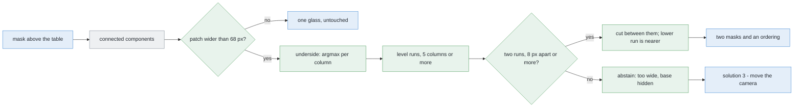

# Solution 1 — split the blob in the picture

*Programmed. Keep the mask the detector already builds. When one patch of
pixels is too wide to be a single glass, cut it in two, using nothing but the
picture.*

## In one paragraph

When two glasses line up with the camera, the near one stands in front of the
far one and the flood fill that works perfectly for one glass returns a single
patch. This solution splits that patch without depth, a model or a second
photograph. It works because the camera looks level from 120 mm above the table
top, so the table recedes to a horizon and **a glass standing further away has
its base drawn higher up the picture**. Find the level stretches along the
underside of the patch: one glass makes one, two glasses at different distances
make two at different heights, and the lower stretch is the nearer glass. It
costs a fraction of a millisecond, it never splits a single glass, and it says
nothing at all when the far glass's base is hidden.

## The problem this solves

Problem 1 turns each photograph into a mask — every pixel marked glass or not
glass — and then groups the marked pixels by whether they touch. That grouping
is **connected components**, and it answers exactly one question: *are these
pixels joined to each other?*

For one glass on a bare table that question is the right one. For several it is
not, because two glasses that are nowhere near each other on the table can still
be joined in a photograph. But *where* that happens is worth getting right,
because the obvious answer is wrong.


**It does not happen in the survey.** The survey looks straight down from
450 mm. Two solid glasses cannot interpenetrate on the table, and problem 2
guarantees they stand at least 150 mm apart centre to centre, so their
footprints are never closer than about 45 mm. Looking straight down at them,
their silhouettes do not touch either. Over 4320 legal arrangements — four
kinds, six sizes each, every separation from 150 to 300 mm, every angle — with
both glasses wholly inside one 320×240 frame, **not one produced a merged
patch**.

The reason is that the frame shrinks as you go up.


One survey picture holds 520 mm of table, but only 358 mm at the height of this
kind's rim, because the rim is 140 mm nearer the lens than the table is. Two
glasses far enough apart to be legal are therefore either both inside the frame
and comfortably separate, or one of them is falling off the edge — and a glass
half out of the picture is a different problem, which the survey already solves
by overlapping its stations so that anything cut off at one is well inside
another.

**It happens in the level view.** When the arm stands the camera 380 mm from a
glass and looks level — the geometry problem 1's step 2 uses to measure a
profile, and the one [solution 3](03-move-the-camera.md) sends the camera to —
a glass 180 mm further back is genuinely behind the near one. There, merging is
the normal case rather than a rarity: of 168 in-line pairs across the four
kinds, 132 came back as one patch.

So this document is about the level view, and only the level view.

### A glass is a circle in one place only

Worth fixing now, because it is the assumption that produced an earlier version
of this page, which drew two footprint circles overlapping — a picture of
something that cannot happen.


A glass is a circle in its **footprint**. No camera in this cell sees the
footprint straight on. From above, the rim is wider than the base *and* 140 mm
nearer the lens, so it images larger and lands further out: the silhouette is a
teardrop leaning away from the point under the camera, and a 42 mm footprint
comes back 156 mm wide. From the side, the silhouette is the glass's profile —
a tall tapered shape. Neither is a circle of the footprint's size, and any
method that assumes one is solving a different problem.

## How it works, end to end

### The setup

A table top at a known height, level and rigid with the arm, with four to six
glasses standing on it at least 150 mm apart. Every glass is the same kind and
the kind is known, so its specification — its widest diameter among other
things — is available before the run starts. What is *not* known is how many
glasses are in any one picture, or where they stand.

The camera is on the wrist. It goes where the arm goes, which is why the
viewpoint is a resource to be spent rather than a given.

### The pictures

**One picture.** This is the whole point of the method: it needs no second
viewpoint, no baseline and no stereo pair, unlike
[solution 3](03-move-the-camera.md), which exists precisely to buy one.

That picture is the level view problem 1 already takes to measure a profile.
The arm stands the camera **380 mm** from the near glass, pointing horizontally,
**120 mm above the table top** (`MEASURE_VIEW_HEIGHT` in
`arm/dimensions.py`). It looks level because that is what creates a horizon: a
level camera puts the vanishing line of the table plane at a fixed image row,
and every base in the picture sits below it by an amount that depends only on
distance.

The arm records the pose it used, so the standoff is known rather than measured.
That matters, because the standoff is what converts millimetres to pixels.

### What each picture captures

The wrist camera returns a **320×240** depth frame and a colour frame of the
same size, from a 1.047 rad lens, giving **fx = 277.1 px**. At 380 mm that is
**1.37 mm per pixel**.

Problem 1's detector turns the depth frame plus the recorded pose into a
**mask**: yes wherever the point behind that pixel stands above the table top.
Connected components then groups the yes pixels that touch.

This method uses the mask and the recorded standoff, and nothing else. It never
reads a depth value — which is why it still works when the depth image is the
glass-shaped hole real glassware produces.

### What is interpreted, and how

Stand a glass on a table and photograph it from a camera that is above the
table but pointing level. The table stretches away to a horizon. A glass close
to you has its base low in the picture; a glass further away has its base higher
up, nearer the horizon — the same effect that puts the far kerb higher in the
frame than the near one in a photograph of a street.


With numbers: a camera at height *h* looking level puts an object at distance
*Z* exactly `f·h / Z` pixels below the horizon. A glass 380 mm away has its base
**87 pixels** below the horizon; one 560 mm away, **59 pixels**. The difference
is **28 pixels**.

Notice the second line on that plot. The two glasses' *rims* differ by only 5
pixels, because a rim sits nearly at the camera's own height and therefore
nearly on the horizon. The top of the blob says almost nothing about distance.
All the information is in the underside.

Four operations, in order.

**1. The width check.** The trigger is the one number taken from outside the
picture: the widest the known kind can be, converted to pixels at the standoff
the arm chose.


At 380 mm this kind's 90 mm rim occupies 66 pixels. Add two, because a drawn
edge rounds outward and a rasterised silhouette is a pixel wider than the
arithmetic says on each side. Anything up to 68 pixels is left alone; the pair
measures 86 and is flagged. That margin is not a fudge to be tuned away — leave
it out and the method fires on every single glass it sees.

**2. The underside.** For every lit column of the patch, the lowest lit row.
One `argmax` per column over the reversed mask.

**3. The level runs.** One pass along that sequence, collecting maximal runs of
columns whose row stays constant to within a pixel. Runs shorter than five
columns are dropped: those are the near-vertical sides, where the underside is
the wall of the glass rather than a contact line. Each surviving run is a place
where something stands on the table.


**4. The gap test.** Two runs at least eight pixels apart in row means two
glasses. The cut goes between them, and **which is nearer comes free**: the
lower run is the nearer glass.

Eight pixels is the one threshold, and it is derived rather than chosen. The
smallest depth difference worth calling two glasses is the 150 mm problem 2
guarantees between centres, which at these distances is about 22 pixels. Eight
is comfortably below that and comfortably above the pixel or two of noise in a
rasterised edge.

It counts *level stretches* and not *steps*, and that choice is the difference
between working and not. The obvious test — is there a step in the underside? —
catches 93 per cent of merged pairs.


Then run it on one glass. A stemmed glass's bowl hangs out over its foot: the
columns under the foot report the foot's base, the columns beyond it but still
under the bowl report the bowl's underside, much higher. That is a step of
**96 pixels** in a single, solitary glass, and counting steps splits 69 per cent
of single glasses. Counting level stretches is immune, because however odd a
glass's shape it rests on the table in exactly one place. Across 120 single
glasses of all four kinds at four distances, this test split **none**.

### What comes out

Two masks in the same 320×240 frame, plus an ordering — which is nearer — or
one mask untouched, or an abstention. No millimetres: both pieces are still
silhouettes, and a silhouette does not sit where its glass does.

The masks go to problem 1's step 2, which measures each glass's profile from a
level view of it. The abstention goes to the report and to
[move the camera](03-move-the-camera.md).

## The sequence

The normal path: one level picture, a patch that is too wide, two contact runs,
two masks.


The abstention path: the far glass stands almost directly behind the near one,
its base never reaches the camera, and the patch has only one contact run.


## In pseudocode



Legend: **green** is new code written for this solution, **blue** is code the
project already has, **grey** is a third-party library.

Everything green below is about thirty lines of NumPy. There is no new import.

```text
pose = arm.stand_off(target, 0.380, level, MEASURE_VIEW_HEIGHT)  # have · work_cell.task
depth = camera.frame()                                           # have · work_cell.task
mask = detect.standing_on_the_table(depth, lens, pose, table_z)  # have · work_cell.glasses.detect
patch = biggest_component(mask)                                  # have · cv2.connectedComponentsWithStats

mm_per_px = 0.380 / lens.fx                                      # NEW  · 1.37 mm at this standoff
limit_px = spec.widest(kind) / mm_per_px + 2                     # NEW  · +2 for the rasterised edge
if patch.width <= limit_px:                                      # NEW  · one glass; nothing to do
    return [patch]

underside = rows - 1 - patch[::-1].argmax(axis=0)                # NEW  · numpy, one argmax per column
lit = patch.any(axis=0)                                          # NEW  · numpy
runs = level_runs(underside, lit, flat=1, least=5)               # NEW  · ~20 lines, numpy only

if len(runs) < 2 or runs[1].row - runs[0].row < 8:               # NEW  · 8 px, derived above
    report.too_wide(patch, patch.width, limit_px)                # have · work_cell.report
    return [patch]                                               #      · hand to solution 3

cut = midway(runs[0].columns, runs[1].columns)                   # NEW  · numpy
near, far = patch[:, :cut], patch[:, cut:]                       # NEW  · numpy, lower run is nearer
report.split(near, far)                                          # have · work_cell.report
return [near, far]
```

The libraries, and what each is for.

| Library | Used for | In the pixi environment? | Licence |
|---|---|---|---|
| NumPy | the whole method: `argmax`, the run pass, the slice | **yes** | BSD-3-Clause |
| OpenCV | connected components, upstream of this method | **yes** | Apache-2.0 |
| Matplotlib | the diagrams on this page only, not the run | **yes** | Matplotlib (BSD-style) |

Nothing else. No SciPy, no scikit-learn, no PyTorch — which, given that
everything from
[solution 4](04-learned-doubt-steers-the-next-picture.md) onward starts by
adding one of them, is worth saying. No model, no weights file, no graphics
card, no training set and no licence question.

## A worked example

Two glasses of a kind whose rim is 90 mm and whose base is 43 mm, standing
140 mm tall. The camera is level, 120 mm above the table. Glass A is 380 mm
away; glass B is 180 mm further back and 60 mm to one side.

**What comes back.** One patch, 86 pixels wide. At 1.37 mm a pixel that is
118 mm, against the 68-pixel limit the kind allows. Flagged.

**The underside.** 86 columns of lowest-lit rows. Two level runs survive:

| | columns | row | what it is |
|---|---|---|---|
| lower | 18 – 49 | 148 | glass A's base, 87 px below the horizon |
| higher | 55 – 74 | 119 | glass B's base, 59 px below the horizon |

**29 pixels apart** — the arithmetic above predicted 28, and the extra pixel is
the rasterised edge. Comfortably over the eight-pixel threshold.

**The answer.** Two glasses. The cut goes at column 52. The lower run is the
nearer one, so the left-hand piece is glass A at roughly 380 mm and the
right-hand piece is glass B, further off. Two masks, and an ordering, from one
photograph and about a third of a millisecond.

**What it has not produced.** Any position in millimetres.

## Where it comes from

Splitting a binary patch into objects is old ground, and the standard tool is
**watershed on the distance transform** — treat the patch as a landscape whose
depth is each pixel's distance from the outside, find the deepest points, and
flood outwards from each until the floods collide. It is one call in OpenCV,
and for touching cells in a microscope image or coins on a scanner it is the
right answer. It is not the right answer here, and the reason is structural
rather than a matter of tuning.


In a squat, round object the deepest point is a single peak at the middle. Two
such objects give two peaks, and the wall between the floods lands neatly at the
waist. A standing glass seen from the side is about four times taller than it is
wide, and its distance from the outside is capped by its half-width all the way
up. The deepest set is not a point but a **line running up the middle**. Two
overlapping ridges merge into one ridge, one marker survives the threshold, and
there is nothing to flood from. Measured across the four kinds: of 122 merged
pairs, watershed split **four**. No choice of threshold rescues it.

The method above replaces it, and it is not novel either. It is the
**ground-plane constraint**: if a camera's height above a flat support surface
is known, the image row at which an object meets that surface gives the object's
distance directly. The contact point is the *foot point* in pedestrian
detection, and mapping the image onto the plane this way is **inverse
perspective mapping** (Mallot et al., *Biological Cybernetics*, 1991). The
canonical statement of why it is worth so much is Hoiem, Efros and Hebert's
[Putting Objects in Perspective](https://doi.org/10.1007/s11263-008-0137-5)
(CVPR 2006, extended in *IJCV* 2008): a ground plane plus a camera height turns
a picture into a measurement.

What is slightly unusual here is the *use*. That constraint is normally spent on
estimating distance or pruning detections by scale. Using it to **separate** two
objects — two contact rows in one patch means two objects — is the same
arithmetic put to a different job. The cell has an unusually clean version of
it: a flat, level table at a known height, rigid with the arm, and objects that
all stand on it.

**GrabCut** is the other obvious candidate, and it answers a different question.
Given a rough box round an object it separates foreground from background by
modelling their colours and smoothing the result, which is genuinely useful
where a threshold leaves a ragged edge. It never decides how many objects there
are: given a box round two merged glasses it returns a tidier outline of the
same merged pair. It belongs downstream of this method, not instead of it.

> Robotics-basics has nothing on this. Its perception documents cover sensors,
> programmed methods, and models that find and measure, but not the
> ground-plane family — which is a real gap, because it is the cheapest
> monocular depth cue there is and it needs no model at all.

## The feedback loop

It has none. This method looks at one picture and returns an answer or an
abstention. It cannot ask for another photograph and it accumulates nothing
between frames.

What it does produce is a **clean handover**: two runs far enough apart means
two glasses with an ordering; one run and a patch within the kind's width means
one glass, untouched; one run and a patch too wide means *there is more here
than one glass and I cannot see the second one's base from where I am
standing*. That third outcome is the useful one, because it tells
[move the camera](03-move-the-camera.md) what the new viewpoint has to achieve.

## Where it is strong and where it breaks

- **Free.** A third of a millisecond on a 320×240 patch; thirty lines; no new
  dependency.
- **It never invents a glass.** Zero false splits across 120 single glasses;
  firing on one would turn a right answer into two wrong ones.
- **Ordering and depth-independence come free.** The lower run is the nearer
  glass, and everything is read off the mask, so it survives the glass-shaped
  hole real glassware leaves in depth.


- **A hidden base defeats it.** Of 122 merged pairs it split 76: 74 of 74 from
  40 mm of lateral offset, 2 of 48 below it. No middle ground to tune. It
  fails to the too-wide flag, not a wrong answer.
- **It gives no position.** Both pieces are silhouettes carrying problem 1's
  bias — a glass 157 mm away reported at 244 mm. Where depth exists,
  [clustering](02-cluster-on-the-table.md) gives millimetres; without it, this
  is what is left.


- **It assumes a flat, level table at a known height.** 5 mm out of level moves
  a contact row a pixel; a slope would not be tolerable.
- **Three things confuse it:** anything else resting on the table makes a level
  stretch too, guarded by solution 2's circle fit; a patch at the frame edge is
  narrower than its glass, so the width check never fires; three in a line leave
  the middle base likeliest hidden.
- **Level view only:** the survey has nothing to split.

## The general methods behind this

Nothing in this solution was invented for glassware. It is four standard ideas,
three of which are in every image-processing textbook and one of which is the
oldest trick in monocular vision. Each is worth knowing on its own account.

### Connected-component labelling — grouping pixels that touch

Sweep a binary image, give every set of mutually touching marked pixels one
label. It answers *are these pixels joined?* and nothing else: it has no notion
of size, shape or how many objects a blob ought to contain. It is the step this
solution exists to repair.

- **Mostly used for** counting and isolating well-separated blobs — cells on a
  slide, characters on a scanned page, blobs after background subtraction in a
  fixed camera.
- **Rarely right for** anything where objects touch or overlap in the image.
  There, it silently merges, and merging is the one error it cannot report.
- **More:** [connected-component labelling](https://en.wikipedia.org/wiki/Connected-component_labeling);
  `cv2.connectedComponentsWithStats` in OpenCV.

### The ground-plane constraint — where an object meets the floor is how far away it is

If the camera's height above a flat surface is known, the image row at which an
object touches that surface gives its distance: a camera at height *h* looking
level puts an object at distance *Z* exactly `f·h / Z` pixels below the horizon.
One row, one division, and a metric depth. The contact point is called the
*foot point*; mapping a whole image onto the plane this way is *inverse
perspective mapping*.

- **Mostly used for** driving and surveillance, where everything of interest
  stands on a road or a floor: estimating how far away a pedestrian or car is
  from a single camera, rejecting detections whose size and contact row
  disagree, and building bird's-eye-view images for lane following.
- **Rarely right for** objects that are not resting on the plane — anything
  held, stacked, flying, or on a shelf — and for scenes where the plane's pose
  is unknown or not flat. It also degrades badly if the contact point is
  occluded, which is exactly this solution's failure case.
- **More:** Hoiem, Efros and Hebert,
  [Putting Objects in Perspective](https://doi.org/10.1007/s11263-008-0137-5)
  (CVPR 2006, extended in *IJCV* 2008);
  [3D projection](https://en.wikipedia.org/wiki/3D_projection) for the
  underlying arithmetic.

### Watershed on the distance transform — the method this one replaces

Treat a blob as a landscape whose height is each pixel's distance from the
outside, flood from the deepest points, and build a wall where two floods meet.
The [distance transform](https://en.wikipedia.org/wiki/Distance_transform)
supplies the landscape; the
[watershed](https://en.wikipedia.org/wiki/Watershed_%28image_processing%29)
(Vincent and Soille, *PAMI*, 1991) does the flooding.

- **Mostly used for** separating touching *round, squat* things of similar
  size: cells, coins, grains, pills, nuclei in microscopy. On those it is close
  to unbeatable for the price.
- **Rarely right for** long, thin or highly elongated objects, because their
  distance transform has a ridge rather than a peak and the markers merge. That
  is why it splits three per cent of this cell's pairs, and why no threshold
  rescues it.
- **More:** `cv2.distanceTransform` and `cv2.watershed` in OpenCV;
  `skimage.segmentation.watershed` in scikit-image.

### GrabCut — tightening an outline you already roughly have

Given a rough box around one object, model the colours inside against those
outside and cut the boundary where the two disagree, smoothing the result
([GrabCut](https://en.wikipedia.org/wiki/GrabCut), Rother, Kolmogorov and Blake,
SIGGRAPH 2004).

- **Mostly used for** interactive photo editing and for cleaning up the last
  pixel or two of a mask whose threshold was approximately right.
- **Rarely right for** deciding *how many* objects are present. It refines one
  boundary; given two merged objects it returns a tidier merged pair.
- **More:** `cv2.grabCut` in OpenCV.

← [Solution overview](solution-overview.md) ·
→ [Solution 2 — cluster on the table](02-cluster-on-the-table.md)
