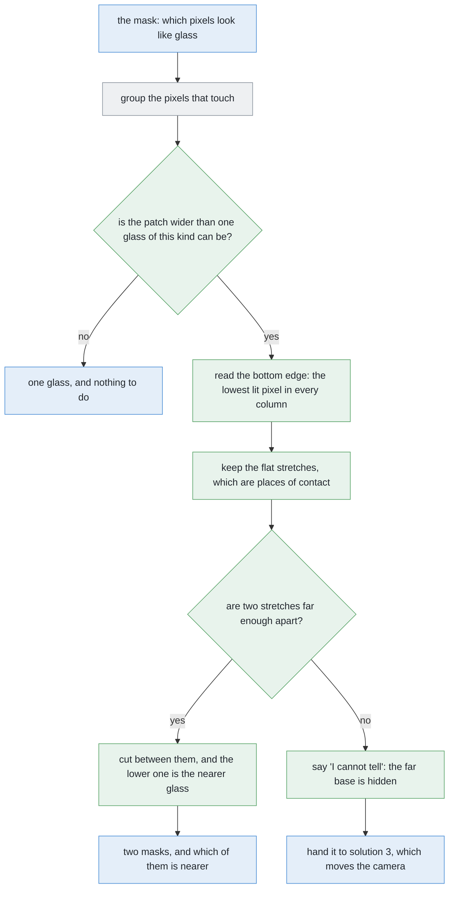

# Solution 1 — split the blob in the picture

*Programmed. Use the picture the camera already took. When one group of pixels
is too wide to be a single glass, cut it into two.*

> **The cell is described once, in [the cell](../../the-cell.md)** — the layout,
> the two places the camera works from, from the top and from the side, all four
> sensors, and the words this project uses them with. What follows is only what
> is specific to this solution.

## Introduction

This document explains one way to tell two glasses apart after the camera has
already photographed them as a single shape. The problem exists because a camera
flattens the world, so two glasses that stand well apart on the table can still
overlap in the photograph, and the step that groups touching pixels together
then reports them as one object. By the end of this document you will understand
why that happens, why it happens from one camera position but never from the
other, and how the bottom edge of a shape in a photograph can be read as a
measurement of distance. That last idea is the whole method, and it is older
than computer vision.

## The problem this solves

Before we can describe the problem, we need two words that this document uses
again and again.

The first word is **mask**. A mask is a picture the same size as the camera's
picture, in which every pixel holds only yes or no. Here, yes means that the
robot believes this pixel is part of a glass, and no means that it does not. The
earlier work in this project already produces this mask, so we can take it as
given.

The second word is **connected components**. This is a standard step that reads
the mask and finds groups of yes pixels that touch each other. Each group is
called a **patch**. The important thing about connected components is how little
it asks: it answers only the question *are these pixels joined to each other?*
It never asks how large a group is, or whether a group is the right size to be
one object.

For a single glass on an empty table, that one question is enough, because
whatever is joined together is the glass. For several glasses it is no longer
enough, because two glasses can stand far apart on the table and still touch
each other in the photograph. This happens when one of them hides part of the
other, and it happens for a reason that has nothing to do with how far apart
they really are.

So the mask is correct and the grouping step is correct, and the answer is still
wrong. This is worth stating plainly, because it tells us where to look for a
fix. We do not need a better mask, and we do not need a better grouping rule. We
need a way to notice that one patch holds two glasses, and a way to decide where
to cut it.

## Where the problem happens, and where it does not

The next question is *when* two glasses overlap in a photograph, and the first
answer most people give is wrong. It matters a great deal, because the answer
tells us which camera position this method belongs to.

The camera in this cell works from two quite different positions, and this
project names them **from the top** and **from the side**. From the top, the arm
lifts the camera high above the table and points it straight down at the
glasses. From the side, the arm brings the camera down low, stands it back from
one glass, and points it level, straight at that glass rather than down at the
table.

### From the top it happens too, and it happens worse

There is a tempting argument that says overlap cannot happen when the camera
looks straight down, and it is worth following, because seeing where it breaks
is the quickest way into this problem. The argument goes like this. Two solid
glasses cannot pass through each other, and the problem guarantees a smallest
gap between their centres, so there is always a strip of bare table between
them, and seen from straight above that strip must be visible.

The hidden assumption in it is that the glasses are all of a similar size.
Inside this kind they are not, and here is what that does.

From the top, a glass's outline is not drawn over the glass. The rim is nearer
the lens than the table is, so it is drawn larger and further out from the
middle of the picture, and the outline leans outwards. This project calls that
**splay**, and the crucial property is that **the taller the glass, the further
out it is thrown**.

So put a tall glass near the middle of the picture and a short one beyond it.
The tall one's outline sweeps outwards; the short one's barely moves. The sweep
can reach the short glass and pass over it — and if it passes over all of it,
the short glass contributes no pixels at all.

That is not a merge, and the difference matters more than anything else on this
page. A merge leaves a patch that is too wide, which something can notice. This
leaves **one patch of a perfectly legal width**, belonging to the tall glass,
which nothing can notice.

There is a second effect with the same cause, and in practice the two arrive
together. The camera sees through a cone spreading out from the lens, so the
higher up you measure that cone, the narrower the slice of the world it covers.
Splay throws a tall glass outwards, and past a certain distance from the middle
of the picture it is thrown clean past the edge of the frame. So a glass can be
absent because something covered it, or because splay carried it out of frame,
and usually because of a little of both.

Either way the honest question is not "was it hidden?" but **"could I have seen
it at all?"** — and answering that question is the business of [solution
2](02-cluster-on-the-table.md), not of this page, because it needs the positions
and heights of the glasses that *were* found.

What this page has to take from it is narrower, and it changes one step of the
method. **A patch of legal width can still hold two glasses.** So the width
check cannot be the only thing that starts the test below.

### It happens from the side, and it happens often

From the side, everything changes, because now a glass standing behind another
glass really is behind it in the plain everyday sense. The near one hides the
far one, exactly as a person standing in front of you hides someone behind them.
The strip of bare table that kept the two apart from above runs *away* from the
camera, so it cannot be seen at all.

This is not a rare corner case. Of all the pairs we deliberately stood in line
with the camera, the large majority came back as a single patch.

The wide range of sizes inside one kind bites here as well, and in the same two
ways. A large glass standing in front of a small one hides far more of it than a
glass of its own size would, so more pairs merge. And a large glass can hide a
small one **completely**, in which case there is no seam to find and no second
base to stand on, which is the case this method has to refuse rather than
answer.

So the rest of this document is about the camera at the side, and about nothing
else.

### A glass looks like a circle in one place only

Before we go on, one tempting picture has to be put aside, because a lot of
reasoning about this problem is built on it. The picture shows two round
footprints overlapping each other. No camera in this cell ever sees such a
thing.

A glass is a circle only when you look straight at the ring it makes on the
table, and no camera here ever gets that view. From the top, the rim is already
wider than the base, and the rim is also nearer the lens, because it has climbed
most of the way up towards the camera. Both of those effects make the rim look
larger, and being nearer also throws it further out from the middle of the
picture. So the shape that comes back is neither a circle nor even centred on
the glass. It looks more like a teardrop, leaning away from the point directly
under the camera, and a glass with a small base can come back several times
wider than that base. From the side, the shape is simply the glass's side view,
which is tall and narrower at the bottom.

Neither of those shapes is a circle the size of the base. Any method that
assumes a circle is therefore answering some other question, and not this one.

## The main idea: the bottom edge is a measurement of distance

Now we can describe the idea the whole method rests on, and it comes from one
choice about how the camera is held.

The camera at the side is held **level**, which means that it looks straight
ahead rather than tilted down at the table. Holding it level puts a **horizon**
in the picture. The horizon is the row where the table would appear to vanish if
the table went on for ever. It is not a thing in the room, and nothing in the
cell is placed there. It is purely a consequence of the camera being level, and
because of that it sits exactly halfway up the picture, always.

Every glass base is then drawn somewhere below that horizon row. This is the key
step, so it is worth saying slowly: how far below the horizon a base is drawn
depends on one thing only, which is how far away that glass is. Nothing else
enters into it.

You already know this effect from photographs of roads. The near edge of a road
sits low in the picture and the far edge sits higher up, closer to the horizon,
even though both edges are on the same flat ground. A glass base behaves in
exactly the same way, because it is also on that same flat ground.

The relationship itself is one line of arithmetic, and it is easier to remember
as a shape than as a formula. **The gap between a base and the horizon goes as
one divided by the distance.** A curve of that shape is steep close up and
nearly flat far away, which has two consequences worth understanding.

The first consequence is good news. Near the camera, moving a glass back by a
small amount shifts its base a long way up the picture, so the method is at its
sharpest exactly where the glasses this cell cares about are standing. The
second consequence sounds like bad news but is not. Far from the camera, the
same move shifts the base hardly at all, so the method goes blunt in the
distance. That does not matter here, because nothing that far away is going to
be picked up.

There is a second lesson in the same picture, and it explains why this method
looks only at the bottom of a shape. Move a glass further away and its base
climbs noticeably, but its **rim** barely moves. The reason is that the camera
is low, at roughly the height of a glass's rim, so a rim already sits almost on
the horizon, and no change in its distance moves it much further. So the top of
a shape tells us almost nothing about distance, while the bottom tells us
everything. That is why the whole method reads the bottom edge.

## The four ideas that make the method

We now have the main idea, so we can put the method together. It is four smaller
ideas used in order, and each one depends on the one before it.

### Checking the width tells us that something is wrong

The first idea is the cheapest, and its only job is to notice trouble.

Because this problem tells us which kind of glass is on the table, we know
before the run even starts the widest that any single glass of that kind can
possibly be. That is a limit on a *kind*, and not the size of any particular
glass, which is why the project is allowed to hold it. Turning that limit into a
width in pixels needs one other thing, which is how much of the world one pixel
covers at the glass, and the arm knows that because it chose how far back to
stand.

So the check is simple. If a patch is wider than the widest single glass of this
kind could ever draw, then the patch holds more than one thing. Our merged pair
is comfortably past that limit, so it is flagged.

**But this check must not be used as the gate.** Because the range of sizes
inside one kind is wide, a large glass standing in front of a small one produces
a patch of the large glass's width, which is entirely legal. The width check
says nothing, and the two glasses are still there.

So the width check has exactly one job, which is to *notice* trouble, and it
must not be given the other one of deciding whether to *start* the test. The
bottom-edge test in the next three sections now runs on **every** patch, not
only on the over-wide ones. That costs almost nothing — it is one pass along the
bottom of a shape — and the two checks then fail independently, which is what
you want from two checks. A patch can be flagged by being too wide, or by
holding two places of contact, or by both.

One detail here is easy to mistake for a fudge, so it is worth explaining. The
limit has a small amount of slack added to it, of a pixel or two. The reason is
that the edge of any shape drawn on a grid of square pixels always rounds
*outward*, so every real outline comes back slightly wider than the arithmetic
predicts. The slack is therefore correcting a known effect rather than hiding an
unknown one. Remove it, and the method flags every single glass it ever sees,
because every single glass is a little wider than its own arithmetic says.

Notice what this first idea can and cannot do. It can tell us that a patch is
wrong. It cannot tell us *where* to cut it, because a width is one number and a
cut needs a position.

### The bottom edge turns the picture into a set of distances

The second idea puts the main idea to work. For every column of the patch that
holds any yes pixel, we take the lowest yes pixel in that column. Doing that for
every column traces out the bottom edge of the shape.

Because of the horizon relationship, that bottom edge is no longer just a shape.
Every point along it is a distance, read off the picture.

### Flat stretches are the places where something touches the table

The third idea is the one that separates the glasses, and it follows from a
physical fact rather than from image processing.

Walk along the bottom edge and collect the longest stretches where the row stays
the same, give or take a pixel. Each such flat stretch is a place where
something is standing on the table, because contact with a flat table at a fixed
distance draws a flat line at a fixed height in the picture.

Short stretches are thrown away. They are the steep sides of a glass, where the
lowest yes pixel is really a piece of the side wall rather than the place where
the glass meets the table, and keeping them would mean mistaking a wall for
contact.

### Two stretches far enough apart means two glasses

The fourth idea is the answer. If two surviving stretches sit far enough apart
up the picture, there are two glasses, and we cut between them. We also get
something for free that the method was not designed to give: the **order**. The
lower stretch is the nearer glass, because lower means closer to the camera.

The remaining question is what "far enough apart" means, and the answer is the
same shape of answer that appears in several of these solutions. The threshold
is not tuned by trying values until the tests pass. It is pinned between two
limits that are both known before the run starts, and it is placed in the gap
between them. This is the same reasoning an engineer uses when choosing a
measurement tolerance, where the tolerance has to be larger than the
instrument's noise and smaller than the smallest real difference that must not
be missed.

The upper limit is the smallest real difference the method must never miss. This
problem promises a smallest gap between the centres of two glasses, and the
horizon relationship turns that gap into a difference in rows. The threshold
must sit below that, or a legal pair would be missed.

The lower limit is noise. An edge drawn on a grid of square pixels wobbles by
about a pixel from column to column, so two stretches differing by only that
much are not two glasses but one glass and some rounding. The threshold must sit
above that.

The useful part is that these two limits are far apart, because the real
difference is many times the noise. So the threshold is not a delicate knob. It
sits comfortably in the middle of a wide window, and both ends of that window
are reported when the method runs, so a wrong answer can be read and understood
rather than guessed at.

Put in order, the four ideas make one flow of decisions.

Green marks the parts this solution adds, blue marks work the project already
does, and grey marks a standard library step.

## Why we read flat stretches, and not steps

There is an obvious alternative to the third idea, and we tried it first. It
failed, and understanding why it failed explains why the method is built the way
it is.

The obvious test asks whether the bottom edge has a **step** in it. If the edge
jumps up suddenly, call that jump the place where the near glass ends and the
far one begins. On merged pairs this works nearly every time, which is exactly
why it is tempting.

Then run the same test on one glass standing entirely alone. Take a wine glass,
whose bowl is wider than its foot, so the bowl hangs out over the foot on both
sides. In the columns above the foot, the lowest yes pixel is the foot, down
near the table. In the columns just outside the foot, the lowest yes pixel is
the underside of the bowl, which is much higher up. So the bottom edge jumps,
and it jumps by far more than two real glasses would ever differ by, and there
is only one glass there. Counting steps therefore cuts most of the single
glasses it is shown into two.

Counting flat stretches does not have this problem, and the reason is physical
rather than statistical. A glass may be any shape it likes, but it rests on the
table in exactly one place, so its bottom edge holds exactly one flat stretch.
We tried this on single glasses of all four kinds at a range of distances, and
it cut none of them.

This asymmetry is deliberate, and it is the most important design decision on
this page. If the method cuts one glass into two, we get two wrong answers in
place of one right one, and nobody later in the chain can tell that anything
went wrong. If instead the method says "I cannot tell", the next step knows
there is a problem and can go and take another picture. So the method is built
to refuse rather than to guess.

## What comes out, and what does not

When the method succeeds, it hands back two masks cut out of the one picture,
together with which of the two is nearer. When the bottom edge holds one flat
stretch and the patch is no wider than this kind allows, it hands back the
single mask untouched. When the patch is too wide but only one flat stretch can
be found, it hands back a refusal.

It is equally important to be clear about what does **not** come out, because
believing otherwise is how a wrong answer travels downstream. No position on the
table comes out of this method. Both pieces are still flat shapes inside a
picture, and a shape in a picture does not sit where its glass really stands.

The two masks go on to the step that measures each glass's shape from the side.
The refusal goes into the run report and to the solution that moves the camera.

### The refusal is the useful output

This method has no feedback loop at all. It reads one picture, and it either
answers or refuses. It cannot ask for another photograph, and it remembers
nothing between pictures.

What it does give is a clean handover, because its refusal is specific rather
than vague. There are exactly four outcomes.

Two stretches far enough apart means two glasses, and which of them is nearer.

One stretch, in a patch no wider than this kind allows, means one glass that
needs nothing done to it — with one caveat added below.

One stretch in a patch that is too wide means something quite precise, which is:
*there is more than one glass here, and I cannot see the second one's base from
where I am standing.* That is the valuable outcome, because it names what a new
viewpoint has to achieve, where a vague failure would leave the next solution
guessing.

And the fourth outcome is the one the wide size range adds, and it is the honest
limit of this page. **A large glass can hide a small one so completely that
neither the width nor the bottom edge shows anything at all.** The patch is one
glass wide and has one place of contact, so this method returns one glass and is
right about everything it was asked. It was simply not asked the right question.
Nothing inside one picture can be asked that question, which is why [solution
2](02-cluster-on-the-table.md) has to work out where a glass could have been
hiding, from the positions and heights of the glasses that were found.

## A worked example

Here is the method on one case, described in terms of what happens rather than
what is measured.

Two glasses of one kind stand on the table, of a tumbler shape whose rim is
wider than its base. The camera is at the side, low down and level, standing
back from the nearer glass at the usual measuring distance. The second glass is
further back along the same line of sight and slightly off to one side, and that
small sideways offset is the only reason any part of its base is visible at all.

What comes back is one patch. Measured across, it is clearly wider than the
widest glass of this kind could draw from this distance, so the width check
flags it.

The bottom edge is then read, one lowest yes pixel per column. Most of the short
stretches are discarded as side walls, and two flat stretches survive. One of
them lies to the left and sits lower in the picture, and the other lies to the
right and sits higher up. By the horizon relationship, lower means nearer, so
the left stretch is the nearer glass's base and the right stretch is the further
glass's base.

The two stretches are separated by many times the wobble in the edge, so they
are comfortably past the threshold. More useful than that, the separation
matches what the horizon relationship predicts for those two distances. That
agreement is the real check, because it shows the two stretches are not merely
different, but different by the amount the geometry says they should be.

So the answer is two glasses. The cut goes between the two stretches, the left
piece is the nearer glass and the right piece is the further one, and the whole
thing takes the time needed to walk a small array twice. What the method has
still not produced is any position on the table.

## Where the idea comes from

Nothing here was invented for glassware, and it helps to know which older ideas
are being used, because that tells you when the method will and will not travel
to another problem.

### The method this one replaces

Splitting one patch into separate objects is an old problem, and the standard
tool for it is **watershed on the distance transform**. The idea is to treat the
patch as a landscape. For every yes pixel, work out how far it is from the
nearest no pixel, which makes the middle of a blob deep and its edges shallow.
Then find the deepest points, flood outwards from each one as if pouring water,
and build a wall where two floods meet. For touching cells under a microscope,
or coins on a scanner, this is the right answer.

Here it is the wrong answer, and it fails for a structural reason rather than
because some number needs adjusting.

In a short, round object, the deepest point is a single peak in the middle. Two
such objects give two peaks, and the wall lands neatly between them. A standing
glass seen from the side is several times taller than it is wide, and its
distance from the outside is limited by its half-width, and by that same
half-width all the way up. So its deepest part is not a peak at all. It is a
**ridge**, like the line along the top of a roof. When two such ridges overlap
they join into one ridge, only one starting point survives, and there is nothing
left to flood from.

We measured this across all four kinds on every merged pair we could produce.
Watershed split only a handful of them and left the rest joined. No choice of
threshold repairs that, because the problem is the shape of the landscape and
not where the water line is put.

### The idea this method uses instead

The method on this page is not new either. It is the **ground-plane
constraint**, which says that if you know how high the camera is above a flat
surface, then the row where an object meets that surface tells you how far away
the object is. In work on detecting pedestrians, the place where a person meets
the ground is called the *foot point*. Mapping a whole picture onto the ground
in this way is called **inverse perspective mapping** (Mallot and colleagues,
*Biological Cybernetics*, 1991). The best-known explanation of why this is so
useful is Hoiem, Efros and Hebert's [Putting Objects in
Perspective](https://doi.org/10.1007/s11263-008-0137-5) (CVPR 2006, extended in
*IJCV* 2008), whose argument is that a known ground plane plus a known camera
height turns a picture into a measurement.

What is a little unusual here is the job we give it. Normally people use it to
work out how far away something is, or to throw away a detection whose apparent
size does not match its distance. We use it to **separate** two objects instead,
on the grounds that two contact rows inside one patch mean two glasses. It is
the same arithmetic doing a different job. This cell also happens to be an easy
case for it, because the table is flat and level, its height is known, it is
fixed to the same frame as the arm, and everything of interest stands on it.

### A third tool, which belongs elsewhere in the order

**GrabCut** is the other tool people often reach for, and it answers a different
question from this one. Given a rough box around an object, it separates object
from background by modelling the colours of each, and then smooths the result.
It is genuinely useful when a threshold has left a ragged edge. But it never
decides *how many* objects are present. Give it a box around two merged glasses
and it returns a tidier outline of the same merged pair. So it belongs after
this method, and not instead of it.

> The companion robotics-basics notes have nothing on the ground-plane family.
> That is a real gap, because it is the cheapest way to get depth out of one
> camera and it needs no trained model at all.

## Where it is strong and where it breaks

The strengths of this method all follow from how little it needs.

It is effectively free. The work is a small amount of array arithmetic, it adds
no new library, and against the seconds that every movement of the arm costs,
its own cost never appears in the accounts at all. It never invents a glass,
because across every single glass we tested it on, of all four kinds and at a
range of distances, it produced no wrong split. It hands back the order of the
two glasses as well as the split, which is a genuine extra, because the nearer
glass is the one worth measuring first. Every step it takes can be printed as a
number, so a wrong answer is something you can read rather than a mystery. And
it needs no depth readings at all, which matters more than it first appears: on
real glassware a depth camera returns a glass-shaped hole rather than a reading,
because the beam passes through the glass instead of bouncing back, so every
method that groups points in three dimensions stops working while this one
carries on.

The weaknesses divide into one real limit and several assumptions.

The real limit is that the method cannot see a base that is hidden. It split
somewhat over half of the merged pairs we gave it, and the pattern of successes
is a cliff rather than a slope. Once the further glass is offset sideways by
more than a small amount, roughly half a glass's width, it split every merged
pair without exception, and below that offset it split almost none. There is
nothing in the middle to tune, because the underlying question is not a matter
of degree: either some part of the far glass's base is visible, or none of it
is.

That limit cannot be closed by better processing. When the far glass stands
almost exactly behind the near one, its base is hidden, and no amount of work on
this one picture will bring it back. Such a pair has to go to the solution that
moves the camera.

The wide range of sizes inside one kind makes that limit bite harder, and in a
way worth stating separately, because it is the difference between an incomplete
answer and a wrong one. When two glasses are of similar size, the far one's base
usually peeks out somewhere, so the method either splits the pair or refuses.
When a large glass stands in front of a much smaller one, there may be nothing
peeking out at all, and then the method does not refuse. It reports one glass,
confidently, because one glass is all the evidence shows. **Its refusal protects
you only when something is visibly wrong**, and complete hiding is the case
where nothing is.

The assumptions are worth stating because they are true in this cell and are
still assumptions rather than facts about the world. The method assumes the
table is flat, level, and at a known height. A table a few millimetres out of
level moves the horizon by about a pixel, which sits inside the noise and is
harmless, but a genuinely sloping table would not be harmless at all, because
then the horizon would no longer be a single row. The method also only works
with the camera at the side, looking level, and that is a real restriction
rather than a formality, because a tall glass can cover a short one from the top
as well. This method cannot help there, because from the top there is no horizon
and so no relationship between a place of contact and a distance.

Two failure modes are worth knowing in advance. A glass cut off by the edge of
the picture has a bottom edge that simply stops at the boundary. The
flat-stretch test survives that, but the width check does not, because a cut-off
shape is narrower than its glass, so a patch touching the edge should be
reported as cut off rather than measured. And anything else standing inside the
same patch is counted, because the method finds places of contact rather than
glasses, so the foot of the drying rack inside the same patch would read as one
more place of contact. The circle fit in [solution
2](02-cluster-on-the-table.md) is the guard against that.

Finally, the method gives no position, and this is a limit rather than an
oversight. Both pieces are still flat shapes in a picture. Seen from the top,
the leaning-outward effect makes a glass appear to stand much further out than
it really does, and the earlier work measured that error as overstating the
distance by more than half. A mask is not a place.

## Where it sits among the other solutions

The right way to think of this method is as a **first pass for the camera at the
side**, and not as a rival to [cluster on the
table](02-cluster-on-the-table.md). The two answer different questions. This one
says how many glasses are inside a patch and which of them is nearer. Clustering
says where each glass is on the table. Where depth readings work, clustering is
the answer and this method is a cheap cross-check; where depth readings do not
work, this method is what remains.

Its natural partner is [move the camera](03-move-the-camera.md), which supplies
the one thing this method cannot get for itself, namely a place to stand from
which the hidden base is no longer hidden. So when this solution cannot split a
pair, that is not a complaint. It is a clear and specific request: stand
somewhere else and look again.

The best time to use it is first, whenever the camera is at the side, because it
is free and it separates most of the pairs that line up. It is also the right
choice whenever there is no depth to work with, as on real glass. And it is
worth keeping as a second opinion even where clustering works, because it fails
in different situations from the methods that reason about distance, and two
methods that fail differently agreeing with each other is worth more than either
of them alone.

← [Solution overview](solution-overview.md) ·
→ [Solution 2 — cluster on the table](02-cluster-on-the-table.md)
