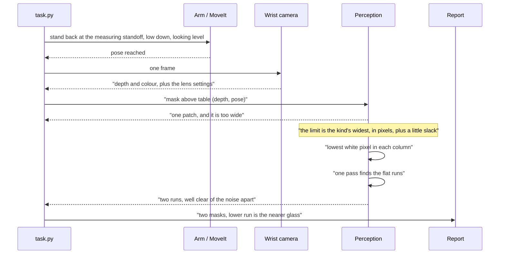
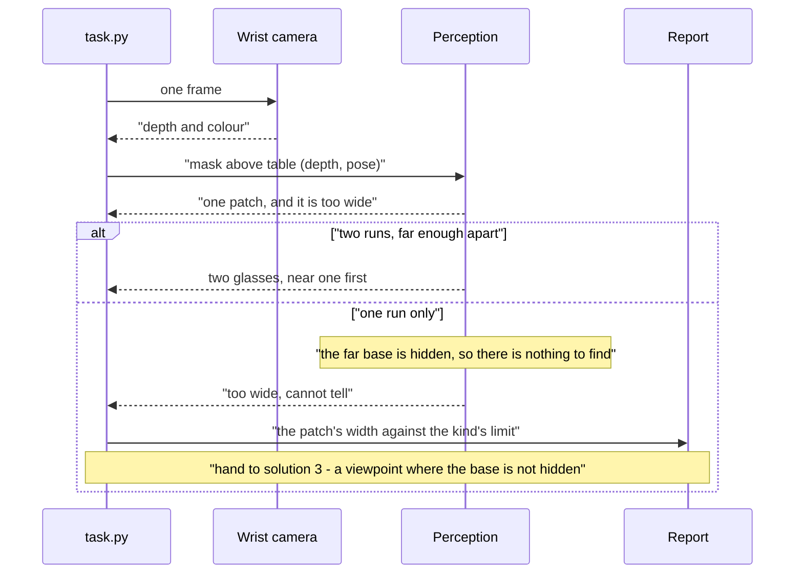
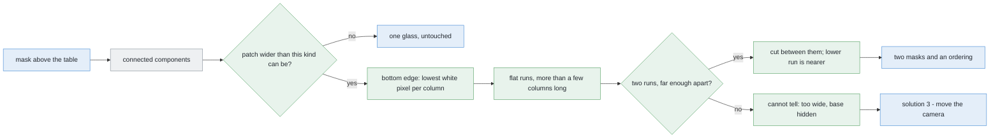

# Solution 1 — split the blob in the picture

*Programmed. Use the picture the camera already took. When one group of pixels
is too wide to be a single glass, cut it into two.*

> **The cell is described once, in [the cell](../../the-cell.md)** — the layout,
> the two places the camera works from, from the top and from the side, all four
> sensors, and the words this project uses them with. What follows is only what
> is specific to this solution.

## In one paragraph

Sometimes two glasses line up with the camera. The near one stands in front of
the far one, so in the picture they touch and look like one object. This
solution separates them. It does not need depth, a trained model, or a second
photograph. It works because of where the camera is standing: **from the side**,
low down near the table, looking straight ahead rather than down. The table then
stretches away from the lens to a horizon, and **a glass that is further away
has its base drawn higher up in the picture**. So we look along the bottom edge
of the shape and find the flat parts. One glass gives one flat part. Two glasses
at different distances give two flat parts at different heights. The lower one
is the nearer glass. The method is fast enough that its cost never shows up next
to the arm's, it never cuts a single glass in two by mistake, and it says "I
cannot tell" when the far glass's base is hidden.

## The problem this solves

First, some words we will use.

A **mask** is a black-and-white picture the same size as the camera's picture. A
pixel is white if the robot thinks there is glass there, and black if not.
Problem 1 already builds this mask.

**Connected components** is a standard step that looks at the mask and finds
groups of white pixels that touch each other. Each group is called a **patch**
(or a **blob**). It answers one question only: *are these pixels joined?* It
never asks how big the group is.

For one glass on an empty table, that question is enough. For several glasses it
is not. Two glasses can be far apart on the table and still touch in the
picture, because one hides part of the other.

*Where* this happens matters. And the first answer most people give is wrong.


**It does not happen with the camera on top.** That is the survey: the arm lifts
the camera high above the table and points it straight down. Two solid glasses
cannot pass through each other, and problem 2 promises a smallest gap between
their centres that is wider than any glass the cell handles. So there is always
bare table between them, and seen from straight above their outlines never
touch.

We tested this rather than assuming it. We generated every arrangement the
cell's own scene generator can legally produce — thousands of them, all four
kinds, a range of sizes of each, every spacing the cell allows, and every angle.
In every case where both glasses were fully inside one picture, **not one pair
merged**.

The reason is that the picture covers less table the higher up you measure it.


The camera's view spreads out from the lens like a cone, so it covers a wide
piece of table down at table level and a much narrower one up at the height of a
glass's rim — because the rim has climbed a good part of the way from the table
towards the lens. Two glasses standing far enough apart to be legal are
therefore either both inside the picture and plainly separate, or one of them is
falling off the edge of it. A glass half outside the picture is a different
problem, and the survey already handles that one: the camera takes its pictures
from several places and they overlap, so a glass cut off at the edge of one
picture sits well inside another.

**It happens with the camera at the side.** Here the arm brings the camera down
low, stands it back from a glass, and points it level, straight at the glass
rather than down at the table. This is the view problem 1 uses to measure a
glass's shape, and the view [solution 3](03-move-the-camera.md) sends the camera
to. From here a glass standing behind another one really *is* behind it, in the
plain everyday sense, and it is hidden. Now merging is not a rare corner case,
it is the normal outcome: of all the pairs we stood in line with the camera, the
large majority came back as a single patch.

So this page is about the camera at the side, and only about that.

### A glass looks like a circle in one place only

We write this down because an earlier version of this page got it wrong. That
version had a drawing of two round footprints overlapping. No camera in this
cell ever sees that.


A glass is a circle when you look at the ring it makes on the table. No camera
in this cell ever sees that ring face-on.

From the top, the rim is wider than the base to begin with, and it is also
nearer the lens, because it has climbed most of the way from the table up
towards the camera. Both of those make it look bigger, and being nearer also
throws it further out from the middle of the picture. So the shape that comes
back is not a circle and not even centred on the glass: it is something like a
teardrop, leaning away from the point directly under the camera. A glass with a
small base can come back several times wider than that base.

From the side, the shape is the glass's side view: tall, and narrower at the
bottom. Neither shape is a circle the size of the base. A method that assumes a
circle is answering some other question, not this one.

## How it works, end to end

### The setup

A table at a known height. It is level, and it is bolted to the same frame as
the arm, so it never moves. Four to six glasses stand on it, never closer than
the smallest gap problem 2 promises between their centres. Every glass is the
same kind, and we know which kind, so we know the widest any of them can
possibly be before the run even starts. We do **not** know how many glasses are
in any one picture, or where they stand.

The camera is bolted to the wrist, so it goes wherever the arm goes and nowhere
else. That has a consequence worth keeping in mind for the whole page: choosing
a new place to look from is not free, it costs an arm movement, and an arm
movement costs seconds. Computation, by comparison, costs nothing.

### The pictures

**One picture.** That is the point of this method. It does not need a second
place to stand, and it does not need a pair of pictures.
[Solution 3](03-move-the-camera.md) exists to get exactly those, and it pays in
arm movement for them.

The picture is the one problem 1 already takes from the side. The arm stands the
camera back from the near glass by the measuring standoff (`MEASURE_STANDOFF` in
`arm/dimensions.py`), low down (`MEASURE_VIEW_HEIGHT`), and points it level.

Why level, and not tilted down a little? Because a level camera puts a
**horizon** in the picture. The horizon is the row where the table would appear
to vanish if the table went on for ever. It is not a thing in the room; it is a
consequence of the camera being level, and it sits exactly halfway up the
picture. Every glass base is drawn somewhere below that row, and how far below
depends on one thing only: how far away the glass is. That is the single fact
the whole method rests on. Tilt the camera and the horizon slides off the middle
of the picture, and the relationship needs the tilt angle to untangle it.

The arm records the pose it actually reached. So the standoff is a number we
know rather than one we have to work out from the picture — and it is that
number that lets a size in pixels be turned into a size on the table.

### What each picture captures

The wrist camera returns a depth picture and a colour picture of the same size,
both small — a few hundred pixels across. The lens spreads a fixed angle over
those pixels, which is all the geometry below needs: it fixes the **focal length
in pixels**, the one conversion factor between a direction in the room and a
position in the picture. Together with the standoff, that tells you how much
table one pixel covers at the glass. Here it is a millimetre or so — coarse next
to a ruler, but a glass is tens of pixels wide, which is plenty.

Problem 1's detector turns the depth picture and the recorded pose into the
mask: white wherever the point behind that pixel is above the table top.
Connected components then groups the touching white pixels.

This method uses only two things: the mask, and how far back the camera stood.
It never reads a single depth value, and that is not an accident — it is the
whole reason this solution is worth having. On real glassware a depth camera
returns a glass-shaped hole rather than a reading, because the beam goes through
the glass instead of bouncing back. Every method that groups 3-D points stops
there. This one carries on.

### What is interpreted, and how

Imagine standing at a table and photographing it with the camera held level. The
table stretches away from you to a horizon. A glass near you has its base low in
the picture. A glass further away has its base higher up, closer to the horizon.
It is the same effect that makes the far edge of a road sit higher in a
photograph than the near edge.


Now the arithmetic, which is one line. If the camera sits at height *h* above
the table and looks level, a glass standing at distance *Z* has its base drawn
`f·h / Z` pixels below the horizon, where *f* is the focal length in pixels.

Read that as a shape rather than as a number. It is a *divide by distance*: the
further the glass, the smaller the gap between its base and the horizon. Near
the camera, moving a glass back by a hand's width shifts its base a long way up
the picture. Far from the camera, the same move shifts it hardly at all. So the
method is at its sharpest exactly where the glasses this cell cares about stand,
and it goes blunt in the distance — which does not matter, because nothing that
far away is going to be picked up.

Look at the second line on that graph too. Move a glass back by a good distance
and its base climbs noticeably, but its **rim** barely moves at all. The reason
is that the camera is low, at about the height of a glass's rim, so a rim sits
almost on the horizon to begin with, and nothing you do to its distance moves it
much further. So the top of the shape tells you almost nothing about how far
away the glass is. Everything useful is along the bottom edge, and that is where
the whole method looks.

Four steps, in order.

**1. Check the width.** This is the one number we take from outside the picture:
the widest this kind of glass can be. We turn it into pixels using the standoff
the arm chose.


The widest this kind of glass can be is a limit that lives in `glasses/spec.py`.
Divide it by how much table one pixel covers at the standoff, and you have the
widest patch a single glass of this kind could possibly draw. Then add a pixel
or two of slack. The reason for the slack is that the edge of a shape drawn on a
grid of square pixels always rounds *outward*, so a real silhouette comes back
about a pixel wider on each side than the arithmetic predicts. Anything up to
that limit is left alone. Our merged pair is comfortably past it, so it is
flagged.

That slack is not a number we picked to make the answer come out right. Take it
away and the method flags every single glass it ever sees, because every single
glass is a pixel or two wider than its own arithmetic says it should be.

**2. Find the bottom edge.** For every column of the patch that has any white
pixel, find the lowest white pixel. In code this is one `argmax` per column.

**3. Find the flat runs.** Walk along that bottom edge. Collect the longest
stretches where the row stays the same, give or take a pixel. Throw away any
stretch that is only a few columns long. Those short stretches are the steep
sides of the glass, where the lowest white pixel is really a bit of the side
wall and not the place where the glass meets the table, and they would otherwise
be mistaken for contact.

Each surviving stretch is a place where something is standing on the table.


**4. Compare the two runs.** If two runs sit far enough apart up the picture,
there are two glasses. Cut between them. And **you get the order for free**: the
lower run is the nearer glass.

What counts as "far enough"? Like the grouping distance in [solution
2](02-cluster-on-the-table.md), it is pinned between two things that are both
known before the run starts, and it sits in the gap between them.

The **top end** is the smallest real difference the method must never miss.
Problem 2 promises a smallest gap between the centres of two glasses; turn that
gap into a difference in rows using the one-line formula above, and that is how
far apart the two runs will be in the hardest legal case. The threshold has to
be below it, or a legal pair gets missed.

The **bottom end** is noise. An edge drawn on a grid of square pixels wobbles by
a pixel or so from column to column, and two runs that differ by only that much
are not two glasses, they are one glass and some rounding. The threshold has to
be above that.

The gap between those two is wide — the real difference is many times the noise
— so the threshold is not a knob anybody has to tune. It sits in the middle, and
both ends of the window are printed in the report, so a wrong answer is a pair
of numbers you can read rather than a mystery.

### Why we look for flat runs, and not for steps

We tried the other test first and it failed, so it is worth writing down why.

The other test is easy to think of: *does the bottom edge have a step in it?* If
the edge suddenly jumps up, call that the place where the near glass ends and
the far one begins. On merged pairs it works nearly every time.


Then run it on one glass standing alone. Take a wine glass. Its bowl is wider
than its foot, so the bowl hangs out over the foot on both sides. In the columns
over the foot, the lowest white pixel is the foot, down near the table. In the
columns just outside the foot, the lowest white pixel is the underside of the
bowl, which is much higher up. So the bottom edge jumps — by a long way, much
more than any two real glasses would differ by — and there is only one glass
there. Counting steps cuts most of the single glasses it is shown into two.

Flat runs do not have this problem. A glass can be any shape it likes, but it
stands on the table in one place only, so its bottom edge has one flat run only.
We tried this on single glasses of all four kinds, at a range of distances. It
cut none of them.

We want the mistakes to go this way round, and not the other way. If the method
cuts one glass into two, we get two wrong answers in place of one right one, and
nobody later in the chain can tell that anything went wrong. If the method says
"I cannot tell", the next step knows there is a problem and can go and take
another picture.

### What comes out

Two masks cut out of the one picture, plus which of them is nearer. Or one mask,
untouched. Or a refusal to answer.

What does **not** come out is a position in millimetres. Both pieces are still
flat shapes in a picture, and a shape in a picture is not where the glass really
stands.

The masks go to problem 1's step 2, which measures each glass's shape from the
side. The refusal goes to the report and to
[move the camera](03-move-the-camera.md).

## The sequence

The normal path: one level picture, a patch that is too wide, two flat runs, two
masks.



The other path: the far glass stands almost directly behind the near one. Its
base never reaches the camera, so the patch has only one flat run.



## In pseudocode



Legend: **green** is new code written for this solution, **blue** is code the
project already has, **grey** is a third-party library.

Everything green below is a few dozen lines of NumPy. There is no new import.

```text
pose = arm.stand_off(target, MEASURE_STANDOFF, MEASURE_VIEW_HEIGHT)  # have · work_cell.task
depth = camera.frame()                                           # have · work_cell.task
mask = detect.standing_on_the_table(depth, lens, pose, table_z)  # have · work_cell.glasses.detect
patch = biggest_component(mask)                                  # have · cv2.connectedComponentsWithStats

mm_per_px = pose.standoff / lens.fx                              # NEW  · how much table one pixel covers
limit_px = spec.widest(kind) / mm_per_px + GRID_SLACK            # NEW  · slack for the pixel grid
if patch.width <= limit_px:                                      # NEW  · one glass; nothing to do
    return [patch]

underside = rows - 1 - patch[::-1].argmax(axis=0)                # NEW  · numpy, lowest white pixel
lit = patch.any(axis=0)                                          # NEW  · numpy
runs = level_runs(underside, lit, flat=1, least=SHORTEST_RUN)    # NEW  · ~20 lines, numpy only

if len(runs) < 2 or runs[1].row - runs[0].row < ROWS_APART:      # NEW  · the window worked out above
    report.too_wide(patch, patch.width, limit_px)                # have · work_cell.report
    return [patch]                                               #      · hand to solution 3

cut = midway(runs[0].columns, runs[1].columns)                   # NEW  · numpy
near, far = patch[:, :cut], patch[:, cut:]                       # NEW  · numpy, lower run is nearer
report.split(near, far)                                          # have · work_cell.report
return [near, far]
```

The libraries, and what each is for.

| Library | Used for | In the pixi environment? | Licence |
|---|---|---|---|
| NumPy | the whole method: `argmax`, the run pass, the slice | **yes** | BSD-3-Clause |
| OpenCV | connected components, before this method runs | **yes** | Apache-2.0 |
| Matplotlib | the diagrams on this page only, not the run | **yes** | Matplotlib (BSD-style) |

Nothing else. No SciPy, no scikit-learn, no PyTorch. We say this because
[solution 4](04-learned-doubt-steers-the-next-picture.md) and every solution
after it begins by adding one of them. Here there is no model, no weights file,
no graphics card, no training data, and no licence to check.

## A worked example

Two glasses of one kind, whose rim is wider than its base — a tumbler shape, not
a wine glass. The camera is at the side, low down and level, standing back at
the measuring standoff from glass A. Glass B is further back along the same line
of sight, and slightly off to one side, which is the only reason any part of its
base is visible at all.

**What comes back.** One patch. Measured across, it is clearly wider than the
widest glass of this kind could draw at this standoff — about half again as
wide. So it is flagged.

**The bottom edge.** One lowest white pixel per column of the patch. Most of the
short stretches are thrown away as side walls, and two flat runs survive:

| | where along the patch | how high up | what it is |
|---|---|---|---|
| lower | the left part | lower | glass A's base, nearer the camera |
| higher | the right part | higher | glass B's base, further away |

The two runs are separated by many times the wobble in the edge, and comfortably
more than the threshold needs — and the separation matches what the one-line
formula predicts for those two distances, to within a pixel. That last point is
the real check: the runs are not just different, they are different by the
amount the geometry says they should be.

**The answer.** Two glasses. The cut goes between the two runs. The lower run is
the nearer one, so the left piece is glass A, standing at the standoff, and the
right piece is glass B, further away. Two masks and an ordering, from one
photograph, in the time it takes NumPy to walk a small array twice.

**What it has not produced.** Any position in millimetres.

## Where it comes from

Splitting one patch into objects is an old problem, and the standard tool is
**watershed on the distance transform**. The idea is this. For every white
pixel, work out how far it is from the nearest black pixel. That gives a kind of
landscape, where the middle of a blob is deep and the edges are shallow. Find
the deepest points, then flood outwards from each one, and build a wall where
two floods meet. It is one call in OpenCV. For touching cells under a microscope
or coins on a scanner, it is the right answer.

Here it is the wrong answer. Not because some number needs tuning — because of
the shape of a glass.


In a short, round object the deepest point is a single peak in the middle. Two
such objects give two peaks, and the wall lands neatly between them.

A standing glass seen from the side is about four times taller than it is wide.
Its distance from the outside is limited by its half-width, and by the same
half-width all the way up. So the deepest part is not a point. It is a **line
running up the middle**, like a ridge. Two overlapping ridges join into one
ridge. Only one starting point survives, and there is nothing to flood from.

We measured it across all four kinds, on every merged pair we could produce.
Watershed split a **handful** of them and left the rest as one. No choice of
threshold fixes that, because the problem is the shape of the landscape and not
where the water line is put.

The method on this page replaces it, and it is not new either. It is the
**ground-plane constraint**. If you know how high the camera is above a flat
surface, then the row where an object meets that surface tells you how far away
it is. In pedestrian detection the contact point is called the *foot point*.
Mapping a whole picture onto the ground this way is called **inverse perspective
mapping** (Mallot et al., *Biological Cybernetics*, 1991). The best-known
write-up of why this is so useful is Hoiem, Efros and Hebert's
[Putting Objects in Perspective](https://doi.org/10.1007/s11263-008-0137-5)
(CVPR 2006, extended in *IJCV* 2008): a known ground plane plus a known camera
height turns a picture into a measurement.

What is a little different here is the job we give it. Usually people use it to
work out how far away something is, or to throw away a detection whose size does
not match its distance. We use it to **separate** two objects instead: two
contact rows in one patch means two glasses. Same arithmetic, different job. And
this cell is an easy case for it — a flat, level table at a known height, fixed
to the same frame as the arm, with everything standing on it.

**GrabCut** is the other tool people reach for, and it answers a different
question. Given a rough box around an object, it separates object from
background by modelling their colours, then smooths the result. It is useful
when a threshold leaves a ragged edge. But it never decides *how many* objects
there are. Give it a box around two merged glasses and it returns a tidier
outline of the same merged pair. It belongs after this method, not instead of
it.

> Robotics-basics has nothing on this. Its perception documents cover sensors,
> programmed methods, and models that find and measure, but not the
> ground-plane family. That is a real gap, because it is the cheapest way to get
> depth from one camera and it needs no model at all.

## The feedback loop

There is none. This method looks at one picture and either answers or refuses.
It cannot ask for another photograph, and it remembers nothing between pictures.

What it does give is a **clean handover**. Three outcomes:

- two runs far enough apart — two glasses, and which is nearer;
- one run, and the patch is within the kind's width — one glass, left alone;
- one run, and the patch is too wide — *there is more than one glass here, and I
  cannot see the second one's base from where I am standing.*

The third outcome is the useful one. It is specific, so it tells
[move the camera](03-move-the-camera.md) exactly what the new viewpoint has to
achieve.

## Where it is strong and where it breaks

- **Free.** A fraction of a millisecond on a patch this size, a few dozen lines
  of code, and no new library. Against seconds for every move of the arm, its
  cost does not appear in the accounts at all.
- **It never invents a glass.** Not one wrong split across every single glass we
  tested it on, of all four kinds and at a range of distances. The method is
  built around that one property, and the next bullet is the price paid for it.
- **It gives the order for free.** Not just two masks, but which glass is
  nearer. The near one is the one worth measuring first.
- **Every step can be printed.** Two run positions and a row difference. A wrong
  answer is a number you can read.
- **It needs no depth.** Everything comes from the mask. On real glass, where
  the depth camera returns a hole, every method that groups 3-D points stops
  working and this one carries on.
- **It cannot see a hidden base.** It split somewhat over half of the merged
  pairs we gave it. Broken down by how far the far glass stood off to one side,
  the pattern is not a gentle slope but a cliff: once the far glass is offset by
  more than a small amount — roughly half a glass's width — it split **every**
  merged pair without exception. Below that it split almost none. There is
  nothing in the middle to tune, because the question is not a matter of degree.
  Either some of the far glass's base is visible or none of it is.
- **It gives no position.** Both pieces are still flat shapes in a picture, and
  they carry the whole error problem 1 already measured. Seen from the top,
  splay reports a glass as standing much further out than it really does — in
  problem 1 it overstated the distance by more than half. A mask is not a place.
- **It assumes the table is flat, level and at a known height.** All three are
  true in this cell, and all three are still assumptions rather than facts about
  the world. A table a few millimetres out of level moves the horizon by about a
  pixel, which is inside the noise and harmless. A genuinely sloping table would
  not be harmless at all, because the horizon would no longer be one row.
- **It only works with the camera at the side**, looking level. That is not much
  of a restriction, because with the camera on top there is nothing to split.
- **When the base is hidden there is nothing to find**, and the method would say
  nothing at all about it. The width check is what notices. So what comes out is
  a flag, not a wrong answer.
- **A glass cut off by the edge of the picture** has a bottom edge that stops at
  the boundary. The flat-run test survives this, but the width check does not,
  because a cut-off shape is narrower than its glass. A patch touching the edge
  should be reported as cut off rather than measured.
- **Anything else standing in the patch** is counted, because the method finds
  flat runs, not glasses. The rack's foot inside the same patch is a flat run.
  The circle fit in [solution 2](02-cluster-on-the-table.md) is the guard.


This gap is not something tuning can close. When the far glass stands almost
exactly behind the near one, its base is hidden, and no amount of work on this
one picture will bring it back. That pair goes to solution 3, which moves the
camera.


**When to use it.** First, whenever the camera is at the side, because it is
free and it separates most of the pairs that line up. Whenever there is no depth
to work with, as on real glass. And as a second opinion, because it fails in
different situations from the methods that reason about distance, and two
methods that fail differently agreeing with each other is worth more than either
of them alone. Not with the camera on top, because from up there the problem
does not arise.

## The general methods behind this

Nothing here was invented for glassware. It is four standard ideas. Three are in
every image-processing textbook, and one is the oldest trick for getting depth
out of a single camera.

### Connected-component labelling — grouping pixels that touch

Go through a black-and-white picture and give every group of touching white
pixels one label. It answers *are these pixels joined?* and nothing else. It has
no idea about size, shape, or how many objects a group should hold. It is the
step this solution exists to repair.

- **Mostly used for** counting and separating blobs that are already well apart:
  cells on a slide, letters on a scanned page, moving objects seen by a fixed
  camera.
- **Rarely right for** anything where objects touch or overlap in the picture.
  There it joins them silently, and that is the one mistake it cannot report.
- **More:** [connected-component labelling](https://en.wikipedia.org/wiki/Connected-component_labeling);
  `cv2.connectedComponentsWithStats` in OpenCV.

### The ground-plane constraint — where a thing meets the floor tells you how far away it is

If you know the camera's height above a flat surface, the row where an object
touches that surface gives its distance. A camera at height *h* looking level
puts an object at distance *Z* exactly `f·h / Z` pixels below the horizon. One
row, one division, and you have a distance in millimetres. The contact point is
called the *foot point*. Mapping a whole picture onto the ground this way is
called *inverse perspective mapping*.

- **Mostly used for** driving and surveillance, where everything of interest
  stands on a road or a floor. It is used to judge how far away a person or a car
  is from a single camera, to reject detections whose size and position disagree,
  and to build the bird's-eye views used for lane following.
- **Rarely right for** objects that are not resting on the surface: anything
  held, stacked, flying, or on a shelf. It also needs the surface's position to
  be known and the surface to be flat. And it breaks when the contact point is
  hidden, which is exactly this solution's weak spot.
- **More:** Hoiem, Efros and Hebert,
  [Putting Objects in Perspective](https://doi.org/10.1007/s11263-008-0137-5)
  (CVPR 2006, extended in *IJCV* 2008);
  [3D projection](https://en.wikipedia.org/wiki/3D_projection) for the
  arithmetic.

### Watershed on the distance transform — the method this one replaces

Treat a blob as a landscape. The height at each pixel is its distance from the
outside. Flood from the deepest points, and build a wall where two floods meet.
The [distance transform](https://en.wikipedia.org/wiki/Distance_transform) makes
the landscape. The
[watershed](https://en.wikipedia.org/wiki/Watershed_%28image_processing%29)
(Vincent and Soille, *PAMI*, 1991) does the flooding.

- **Mostly used for** separating touching objects that are *round and squat* and
  roughly the same size: cells, coins, grains, tablets. For those, nothing this
  cheap does better.
- **Rarely right for** long, thin objects, because their landscape has a ridge
  instead of a peak, so the starting points merge. That is why it splits almost
  none of this cell's pairs, and why no threshold saves it.
- **More:** `cv2.distanceTransform` and `cv2.watershed` in OpenCV;
  `skimage.segmentation.watershed` in scikit-image.

### GrabCut — tidying an outline you already roughly have

Given a rough box around one object, model the colours inside against the colours
outside, cut the boundary where the two disagree, and smooth the result
([GrabCut](https://en.wikipedia.org/wiki/GrabCut), Rother, Kolmogorov and Blake,
SIGGRAPH 2004).

- **Mostly used for** photo editing, and for cleaning up the last pixel or two
  of a mask whose threshold was roughly right.
- **Rarely right for** deciding *how many* objects are there. It improves one
  boundary. Give it two merged objects and it returns a tidier merged pair.
- **More:** `cv2.grabCut` in OpenCV.

---

## Where it sits

It is a **first pass for the camera at the side**, not a rival to [cluster on
the table](02-cluster-on-the-table.md). The two do different jobs. This one says
how many glasses are in a patch and which is nearer. Clustering says where they
are in millimetres. Where depth works, clustering is the answer and this is a
cheap cross-check. Where depth does not work, this is what is left.

Its natural partner is [move the camera](03-move-the-camera.md), which gives the
one thing this method cannot get for itself: a place to stand from where the
hidden base is not hidden. When this solution cannot split a pair, that is not a
complaint. It is a clear request — stand somewhere else and look again.

← [Solution overview](solution-overview.md) ·
→ [Solution 2 — cluster on the table](02-cluster-on-the-table.md)
