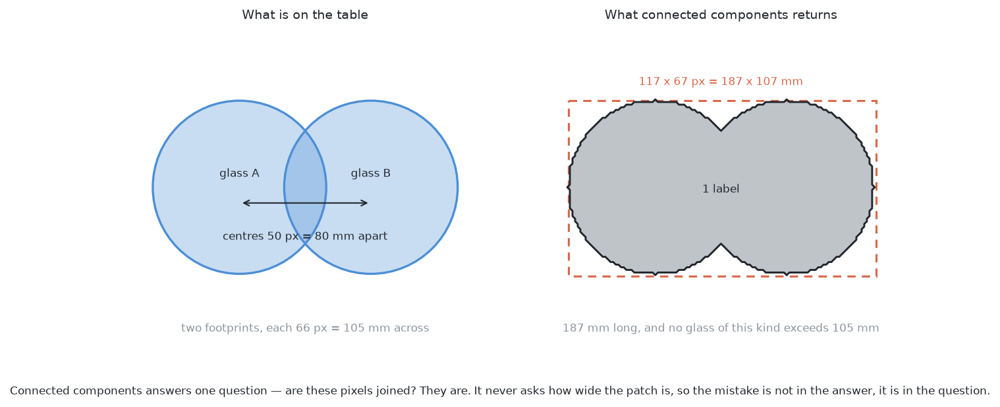
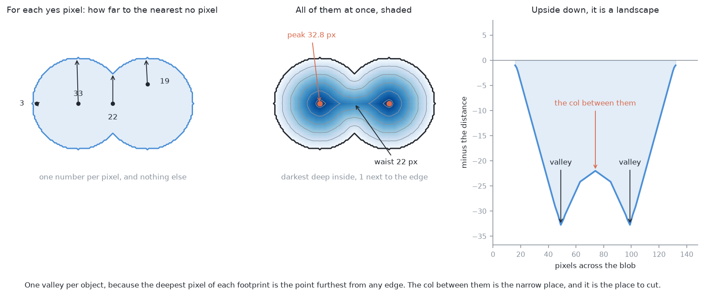
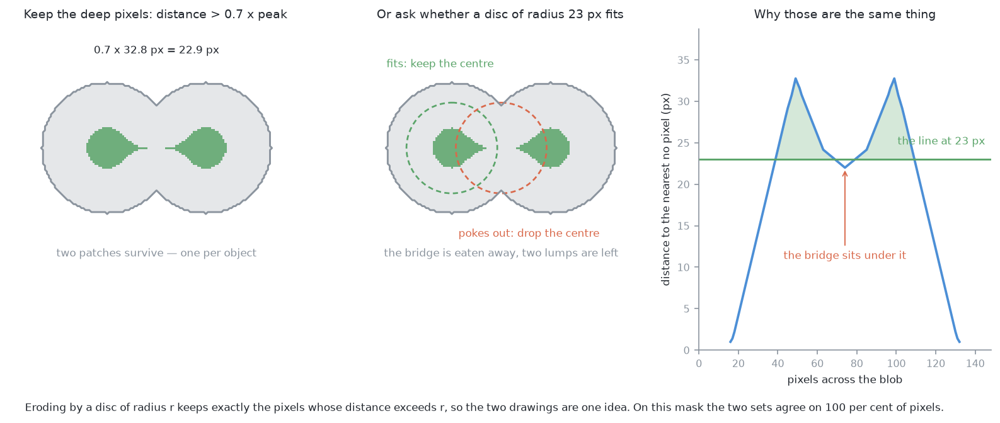
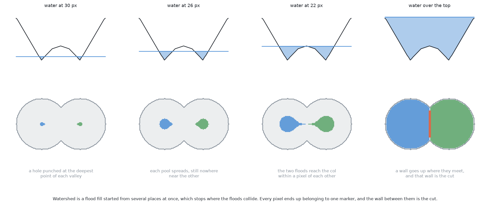
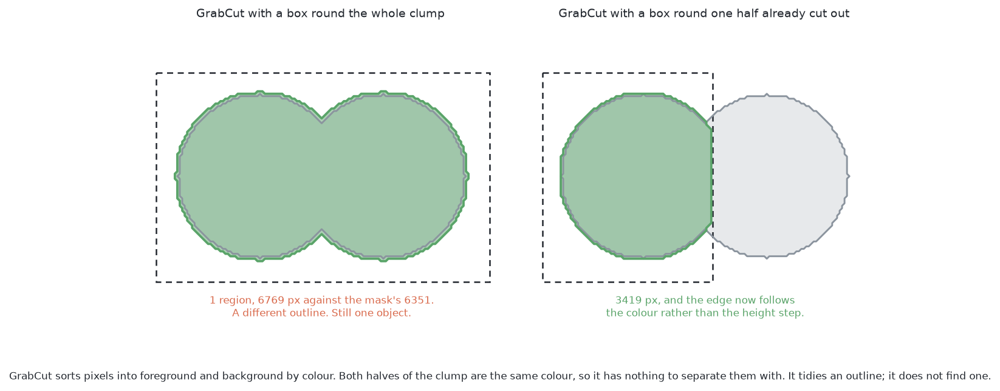
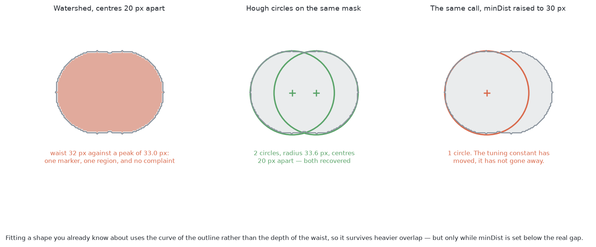
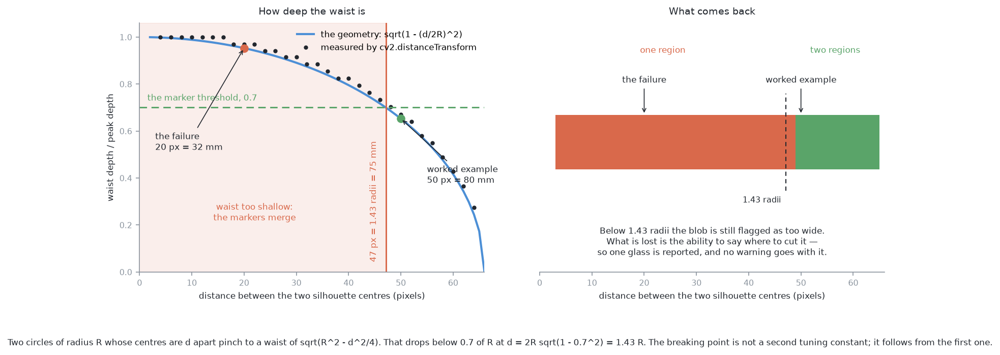
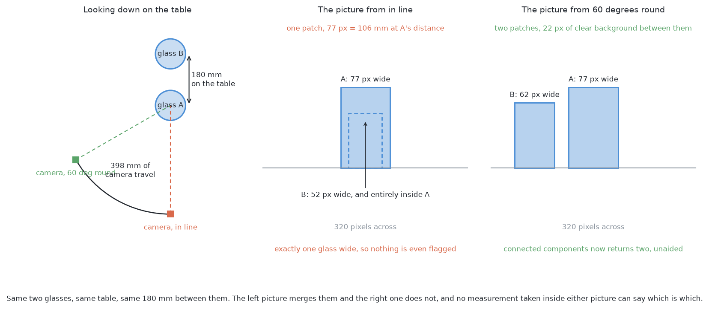

# Solution 1 — split the blob in the picture

*Programmed. Keep the mask the geometric detector already builds. When one
patch of pixels is too wide to be a single object, cut it in two, using nothing
but the picture.*

## In one paragraph

Problem 1 turns each photograph into a mask and groups the marked pixels by
whether they touch, so two glasses that overlap in the picture come back as one
patch. This solution adds a step: when a patch is wider than the known kind
allows, measure how deep inside it every pixel sits, take the two deepest
points, and flood outwards from both until the floods meet. Where they meet is
the cut. It costs a third of a millisecond and needs no depth and no training,
and it fails silently once the centres come closer than 1.43 radii.

## The problem this solves

The arm photographs a table with four to six glasses on it. They are all of one
kind, that kind is known, and they stand at least 150 mm apart. For each glass
the arm has to produce a **mask** — the set of pixels in a given picture that
belong to that glass and no other — together with a position on the table and a
rough width.

A **mask** is a picture the same size as the camera's, 320 by 240 here, in
which every pixel carries one bit: yes or no. In problem 1 "yes" means the 3D
point at that pixel stands above the table top. Building that mask is easy. The
depth camera gives a distance for every pixel, the table's plane is known, and
anything more than a few millimetres above it is marked.

Turning a mask into separate objects is done by **connected components**, also
called a flood fill. Pick a yes pixel nobody has visited. Spread out to every
yes pixel touching it, and to every yes pixel touching those, until nothing new
is reachable. Call that patch one object. Repeat with the next unvisited yes
pixel. It is a complete, exact answer to one question: *are these pixels
joined?*

It asks nothing else. It does not ask how wide the patch is, how round it is,
or whether anything of the known kind could ever look like that. So two glasses
whose silhouettes overlap anywhere at all come back as a single patch, and one
patch means one glass to every step downstream.

On the left is what is on the table: two footprints, each 105 mm across, whose
centres land 80 mm apart in the picture. On the right is what connected
components returns — one label, 187 mm long, when the kind's specification
allows nothing wider than 105 mm. The answer is not wrong; the question was.

## The idea, in plain words

Look at the right-hand picture again. A person has no trouble saying where to
cut it. The blob has a **waist**: a pinch in the middle, where it is narrower
than it is anywhere else. Two round things pushed together always make that
shape, and the waist is where the two outlines cross.

So the method is: find the waist, and cut there.

The whole of the rest of this document is about how to say "find the waist" to
a computer without ever using the word. The machinery has three pieces and they
come in order:

1. For every pixel, work out **how deep inside the blob it is**.
2. Use that to find **one starting point per object** — the deepest point of
   each half.
3. **Grow both starting points outwards at the same rate** until they run into
   each other, and put the cut where they meet.

Each of those is a standard operation with a standard name, and each is one
call to a library that is already a dependency of this project.

## Where it comes from

This is an old job. Long before robots, people were counting cells down a
microscope and grains in a photograph of an alloy, and the cells and the grains
touch. Every one of those problems is the same shape: a picture in which the
things you want are all the same colour, they are convex and roughly round, and
they overlap.

The answer the image-processing community settled on is called **watershed**,
and it was introduced by Serge Beucher and Christian Lantuéjoul in 1979 as part
of mathematical morphology — the branch of image processing that treats a
picture as a set of pixels and reasons about it with shapes rather than with
arithmetic. The version that everybody actually runs is the immersion algorithm
published by Luc Vincent and Pierre Soille in 1991, which is what makes it fast
enough to be free.

**GrabCut**, which appears later in this document, comes from somewhere else
entirely: Carsten Rother, Vladimir Kolmogorov and Andrew Blake published it at
SIGGRAPH in 2004 as an *interactive* tool. A person drags a rectangle round an
object in a photograph and the computer works out the exact outline. It
tidies an outline; it does not decide how many objects there are, and saying
so plainly is part of the job here.

The **Hough transform** is older still — Paul Hough patented the idea in 1962
for finding tracks in bubble-chamber photographs, and Richard Duda and Peter
Hart generalised it to curves in 1972. Its circle version turns out to matter
here, for reasons the last part of the mechanism section gives.

This project's own background notes set watershed and GrabCut out together,
under [watershed and
GrabCut](https://github.com/RobinNagpal/robotics-basics/blob/main/docs/06_object-perception/03_programmed-methods.md#15-watershed-and-grabcut),
and list "objects that overlap" as the job that [connected
components](https://github.com/RobinNagpal/robotics-basics/blob/main/docs/06_object-perception/03_programmed-methods.md#13-edges-contours-and-connected-components)
cannot do.

The reason anyone reaches for this first is cost. There is no new sensor, no
file of weights, no training set, no graphics card, and no second photograph.
The mask is already there. Everything below is arithmetic on it.

## How it works, step by step

### The distance transform

Take the mask. For **one** yes pixel, ask a single question: how far is it to
the nearest no pixel? Walk outwards from that pixel in every direction until
you leave the blob, and write down the shortest such walk. A pixel one step in
from the edge scores 1. A pixel in the very middle of a 66-pixel-wide footprint
scores about 33.

Now do that for every yes pixel in the picture. The result is a second picture,
the same size, holding a number instead of a bit. That is the **distance
transform**. It is one call, `cv2.distanceTransform`, and on a 320 by 240 mask
it takes 0.074 ms on this machine.

The left panel is the definition, applied to four pixels: the arrow goes to the
nearest background pixel and the number is its length. The middle panel is
every pixel at once, shaded — dark deep inside, pale near the edge — with the
two peaks marked at 32.8 pixels and the waist at 22. The right panel is the
same data with a minus sign in front of it, drawn as a cross-section.

That minus sign is the point. Negate the distance transform and the picture
becomes a **landscape**: deep inside the blob is low ground, near the edge is
high ground. Each object contributes one basin, because the deepest pixel of
each footprint is the point furthest from any edge, and there is exactly one of
those per footprint. Between the two basins is a **col** — a saddle, the low
point of the ridge that separates them. The col sits at the waist, because the
waist is where the blob is narrowest and therefore where the deepest available
pixel is shallowest.

So "find the waist" has become "find the col between two basins", which is a
question about numbers rather than about shapes.

### Markers

Watershed does not find the basins for you. It has to be told where they are.
A **marker** is a patch of pixels declared in advance to belong to one object —
a seed. Watershed's job is to grow the seeds, not to invent them.

A person could point at two places with a mouse. There is no person here, so
the markers have to come out of the picture itself. There are two standard ways
of doing it, and they turn out to be the same way.

**Local maxima of the distance transform.** The deepest pixel of each footprint
is a local maximum of the distance field. Take every pixel deeper than some
fraction of the deepest pixel in the whole blob — 0.7 is the usual starting
value — and what survives is two patches, one round each peak. The bridge
between them is shallower than either peak, so it drops out.

**The erosion trick.** Erosion is a morphological operation: slide a disc of
radius *r* around, and keep only those pixels at which the whole disc fits
inside the mask. Shave enough off the outside and the narrow bridge between the
two footprints disappears, leaving two separate lumps.

The left panel takes every pixel deeper than 0.7 × 32.8 = 22.9. The middle
panel erodes by a disc of radius 23, with one disc drawn where it fits and one
drawn at the waist where it pokes out top and bottom. The right panel is the
cross-section with the line at 23 drawn across it, and the green shading is
what survives.

The two are the same statement. "The whole disc of radius *r* fits inside the
mask when centred here" and "this pixel is more than *r* away from the nearest
background pixel" are the same sentence written twice. Running both on this
mask and comparing pixel by pixel gives 100 per cent agreement, which is not a
coincidence and not a measurement — it is the definition.

Which one you write in the code is a matter of taste. The distance transform
version is easier to tune, because the threshold can be a fraction of the
observed peak rather than a fixed radius in pixels, and a fraction adapts
itself to glasses of different sizes.

### Watershed, and what "flooding" means

Now the landscape has two basins and a marked starting point at the bottom of
each. Punch a hole through the bottom of each basin and let water rise through
both holes at the same rate.

At first each hole produces a small pool of its own. As the water rises, each
pool spreads across its own basin. Eventually the level reaches the col, and
the two pools are about to become one body of water. At that instant, instead
of letting them merge, build a wall along the line where they touch. Keep
raising the water. When the whole landscape is under water, every pixel belongs
to exactly one of the two pools, and the wall marks where one object stops and
the other starts.

That is the whole algorithm. **Watershed is a flood fill started from several
places at once, which stops where the floods collide.** Ordinary connected
components is the same process with one starting point and nothing to collide
with, which is exactly why it cannot separate anything.

The top row is the landscape in cross-section with the water level drawn in;
the bottom row is which pixels each flood has claimed by then. Follow the
right-hand panel: the wall, in orange, is the cut, and it falls at the waist
without anybody having mentioned a waist.

One call, `cv2.watershed`, does all of it. Note what it is given: the mask, and
an integer picture holding 0 where nothing is known yet, 1 for background, and
2 and 3 for the two markers. It returns the same picture with every 0 replaced
by a label, and −1 along the walls.

The whole chain — distance transform, markers, watershed — measures 0.30 ms on
a 320 by 240 mask on this machine.

### GrabCut, and why it is not the answer

GrabCut is the other name that comes up whenever anyone says "separate the
objects in this picture", so it is worth being clear about what it does.

Give GrabCut a rectangle. It assumes everything outside the rectangle is
background and everything inside is *probably* foreground. It then builds a
statistical model of the colours in each group, re-labels every pixel with
whichever model fits it better, rebuilds the models, and repeats. What comes
out is a tight outline in place of a rough rectangle.

It is very good at that. It is not what this problem needs, because **the two
halves of the clump are the same colour**. They are two glasses of one kind
under one light. GrabCut has nothing to tell them apart with, and it will
happily return the whole clump as one clean foreground region.

Left: a box round the whole clump gives one region of 6769 pixels against the
mask's 6351 — a different outline, still one object. Right: a box round one
half *after* watershed has already cut it gives 3419 pixels with an edge that
follows the colour rather than the height step.

So GrabCut belongs after the split, not instead of it. It is worth having,
because the mask problem 1 builds comes from a height threshold, and a height
threshold gets the last pixel or two wrong wherever the glass meets the table.
GrabCut cleans that up. It never decides how many objects there are.

### The round-object special case

Everything above works on any shape. Here the shape is known: from above, a
glass is a circle. Two overlapping circles of radius *R* whose centres are *d*
apart make a blob with a waist, the waist sits on the line joining the centres,
and its depth is exactly

    waist = sqrt(R² − d²/4)

That is the whole method, specialised, and in a moment it will give the exact
point at which the method stops working.

There is a second way to use the same knowledge, and it is a different
algorithm rather than a special case of this one. **Hough circle detection**
asks every edge pixel to vote. An edge pixel with a known gradient direction
votes for every circle centre that would explain it — a line of candidate
centres running inwards along the gradient — and this is repeated for every
edge pixel and every radius in a given range. Centres that collect many votes
are circles that are really there. `cv2.HoughCircles` does this.

The difference matters. Watershed reads the *depth of the waist*. Hough reads
the *curvature of the outline*. Two circles that overlap heavily have almost no
waist left, but they still have two arcs of outline with two different centres.

Left: with the centres only 20 pixels apart, the waist is 32 pixels against a
peak of 33, the markers merge, and watershed returns one region with no
complaint. Middle: `cv2.HoughCircles` on the same mask recovers both centres,
20 pixels apart, at radius 33.6. Right: the identical call with `minDist`
raised from 15 to 30 returns one circle. The tuning constant has moved; it has
not gone away.

That last panel is the honest part. Hough does better here, but it does better
because `minDist` was set below the true gap, and `minRadius`/`maxRadius` were
set around the true radius. It has traded a threshold on waist depth for a
threshold on centre spacing. Set `minDist` too low and one glass with a ragged
outline turns into two.

## How it works here

The numbers of this cell decide what any of this is worth.

At survey height the camera sits 450 mm above the table and one picture covers
about 520 by 390 mm across 320 by 240 pixels. That is **1.6 mm per pixel**. The
kind's specification allows footprints from 45 to 105 mm across, so a single
glass occupies somewhere between 28 and 66 pixels of width.

That fixes every constant in the method:

- **When to intervene.** Only when a patch's width exceeds the widest footprint
  the kind allows, which is 105 mm, or 66 pixels. Anything narrower is left
  alone. This is the one number the method takes from outside the picture, and
  the kind's specification already holds it.
- **The marker threshold.** 0.7 of the observed peak. Expressed as a fraction
  rather than a radius, so it scales itself to whichever kind is on the table.
- **How many objects to expect.** The method does not need to be told. Whatever
  number of markers survives the threshold is the number of pieces watershed
  returns.

The step slots into problem 1's pipeline without disturbing anything. The
detector builds its mask and runs connected components exactly as before. Each
resulting patch is measured. Patches inside the kind's range go straight
through untouched. Only an over-wide patch takes the extra path, and the extra
path costs 0.3 ms.

It is worth saying what does **not** improve. Both halves come out as
silhouettes laid down on the table plane, which is what problem 1 already does,
and that carries a known bias: from overhead the camera sees the widest part of
the glass, some way above the table, and following that ray down to the table
lands it further out than the glass really is. Problem 1 measured the effect —
[a glass 157 mm from the camera was reported at 244
mm](../../problem-1/step1-finding-the-glasses.md). Splitting a blob does not touch
that. It gives two wrong positions where there was one.

## A worked example

Two glasses of the widest kind the specification allows, 105 mm across, stand
in line with the camera at survey height. 105 mm at 1.6 mm per pixel is 66
pixels, so each silhouette is a circle of radius 33 pixels. Their centres land
50 pixels apart in the picture.

**What connected components returns.** The two circles overlap, so it returns
one patch. Its bounding box is 117 by 67 pixels. At 1.6 mm per pixel that is
187 by 107 mm. 187 mm is more than the 105 mm the kind allows, so the patch is
flagged and the extra path is taken.

**The distance transform.** `cv2.distanceTransform` returns a peak of 32.8
pixels, which is 52 mm — one radius, as it should be, since the deepest point
of each footprint is its centre and the nearest background from there is one
radius away. At the waist it returns 22.0 pixels, or 35 mm. The geometry above
predicts sqrt(33² − 25²) = 21.5 pixels, and the rasterised mask gives 22.0. The
half-pixel is the jagged edge of a circle drawn on a square grid.

**Markers.** The threshold is 0.7 × 32.8 = 22.9 pixels. The waist, at 22.0,
falls below it, so the bridge drops out. The two peaks, at 32.8, are well above
it, so both survive. `cv2.connectedComponents` on the thresholded field returns
2. The margin is 0.9 pixels — about 1.5 mm — and that thinness is what **How
it fails** is about.

**Flooding.** `cv2.watershed` grows both markers and builds a wall where they
meet. Two regions come out, 3013 pixels each.

**What the two halves measure.** This is easy to get wrong, so it is worth
doing slowly. Each half's **bounding box** is 57 pixels wide, which is 91 mm —
14 mm narrower than the glasses really are. That is not a bug. The wall runs
down the middle of the overlap, so neither half is given back the part of
itself that was hidden behind the other. If instead you **fit a circle** to
each half — `cv2.minEnclosingCircle` on its contour — you get 64.0 pixels
across, or 102 mm, within 3 mm of the truth, because the outer arc of each
half is undamaged and an arc is enough to fix a circle.

So the rule for this cell is: split with watershed, then fit a circle to each
piece, and report the fitted diameter as the rough width. Reporting the
bounding box would systematically under-report every glass that was ever part
of a clump, and under-reporting a width is how a gripper ends up closing on
something wider than it expected.

**Cost.** 0.30 ms for the whole chain on a 320 by 240 mask, against the tens of
milliseconds the camera takes to produce the picture and the seconds the arm
takes to move anywhere.

## The feedback loop

**There is not one, and that is the central thing to understand about this
solution.**

Every measurement it uses was taken before it started. It reads one mask, from
one picture, taken from one viewpoint, and it produces its answer from that. It
cannot ask for another picture, because it has no way of knowing that another
picture would help. It cannot say how sure it is, because its evidence — how
wide a patch of pixels is — is either over the limit or it is not.

What that costs is specific. The whole of the next section is really one
consequence of it: the blob is wide because of where the camera was standing,
and a method reasoning inside the picture has no access to where the camera was
standing. It cannot tell a projection accident from two objects genuinely side
by side, so it cuts both the same way — and when it cannot cut, it says
nothing.

Compare that with the thing problem 2 actually asks for: "an honest statement
of which glasses it could not separate, and why". This solution can produce
half of that. It can say "this patch was over-wide and I could not find a place
to cut it", which is a real and useful report. What it cannot say is "this
patch looked like one glass and I have no way of knowing whether it was two",
which is the failure that matters, because that is the one that does not
announce itself.

A closed loop would go back for a second look. **Move the camera** does exactly
that, and it is a separate solution for that reason.

## What it needs

**Libraries.** OpenCV, which is already a dependency of this project
(`py-opencv >=4.9` in `pixi.toml`). The five calls used here are
`cv2.distanceTransform`, `cv2.erode`, `cv2.watershed`, `cv2.grabCut` and
`cv2.HoughCircles`. OpenCV is Apache License 2.0 from version 4.5.0 onwards,
which permits commercial use: <https://github.com/opencv/opencv> and the
reference documentation at <https://docs.opencv.org/4.x/>.

The same algorithms exist in scikit-image under the 3-clause BSD licence, which
is also permissive: `skimage.segmentation.watershed`,
`skimage.morphology.erosion` and `skimage.transform.hough_circle`, at
<https://scikit-image.org/> and <https://github.com/scikit-image/scikit-image>.
Either would do. OpenCV is already here, so it is the one to use.

**Hardware.** None beyond what the cell has. Neither library needs a graphics
card, which is the condition that rules several other solutions out on this
machine — an Apple Silicon Mac with no NVIDIA card.

**Data.** None. No training set, no labels, no weights file to keep in step
with the glassware.

**Inputs from the rest of the system.** The mask problem 1 already builds, and
one number: the widest footprint the known kind allows, which the kind's
specification holds.

**Tuning.** One constant, the fraction of the peak at which markers are cut,
set to 0.7. Plus `minDist`, `minRadius` and `maxRadius` if the Hough variant is
used as well.

**Time to build.** Hours. It is well under a hundred lines against an
existing detector, and every one of them can be tested on a drawn mask
without starting the simulator — which is exactly what `glasses/` not
importing ROS is for.

## What it is good at

**It is cheap, in every sense.** 0.3 ms of compute. No second viewpoint, so no
arm motion, and arm motion is the expensive resource in this cell — a picture
costs milliseconds and a viewpoint costs seconds.

**Its failures are legible.** Every intermediate value is a picture you can
look at. When it goes wrong you can print the peak, print the waist, print the
threshold, and see which of the three was not what you assumed. Not many of
the nine solutions have that property to the same degree.

**It needs no depth at all.** This is the argument that keeps it in the list.
Every other programmed solution here works by turning pixels into points in the
room and grouping the points, and every one of them needs a depth reading for
each pixel. Real glass does not give one: an infrared depth camera sees through
it, and the depth picture has a glass-shaped hole where the glass is. Give this
method a mask from colour instead and it carries on unchanged.

**It generalises across kinds without being told anything.** The threshold is a
fraction of the observed peak, not a radius, so a wide tumbler and a narrow
flute are handled by the same line of code.

## What it is bad at

**Width is the whole of its evidence.** It cannot distinguish "a wide blob"
from "two glasses". It infers the second from the first, and that inference is
only as good as the assumption that nothing else could make a blob that wide.

**It improves no position.** Both halves are still silhouettes laid on the
table plane, carrying the full projection bias problem 1 measured. Two wrong
positions in place of one.

**0.7 is not a fact about anything.** It is a number that worked on the
examples it was tried on. The next section works out exactly what it buys, and
the answer is less than it looks.

**It gives the *number* of objects away to a threshold.** Whatever count comes
out of the marker step is the count watershed returns. If the threshold merges
two markers, one glass is reported where there were two; if it splits one
marker, two are reported where there was one. Neither is flagged.

## How it fails

### The breaking point, exactly

Take the formula from the round-object section. Two circles of radius *R* whose
centres are *d* apart have

    waist / peak = sqrt(R² − d²/4) / R = sqrt(1 − (d / 2R)²)

The markers separate only while that ratio is below the threshold, 0.7. Set the
two equal and solve:

    sqrt(1 − (d / 2R)²) < 0.7
    1 − (d / 2R)²       < 0.49
    (d / 2R)²           > 0.51
    d                   > 2R × 0.714 = 1.43 R

**1.43 radii.** That is where the method gives out, and notice where it came
from: not from experiment, not from tuning, but from the one constant the
method has. Pick a different fraction and you get a different breaking point
from the same line of algebra. The breaking point is not a second thing to
tune; it is the first thing to tune, restated.

The blue curve is the formula and the black dots are what
`cv2.distanceTransform` actually measures on rasterised masks — they agree.
The shaded region is where the waist is too shallow for a 0.7 threshold to cut
it. The right-hand panel is what comes back: one region below the line, two
above it. On these masks the measured flip happens at 49 pixels against the
geometry's 47, the difference being the jaggedness of a circle drawn on a
grid.

For this cell, with R = 33 pixels, 1.43 R is 47 pixels, which is **75 mm** of
apparent separation in the picture. Closer than that and the split fails.

### Heavy overlap, which is the case that matters

Take the same two glasses with their centres 20 pixels apart instead of 50.

The blob is 87 by 67 pixels, or 139 by 107 mm. 139 mm still exceeds the 105 mm
the kind allows, so it is still flagged — the method knows something is wrong.
The distance transform peaks at 33.0 pixels and dips to 32.0 at the waist. That
is a dip of three per cent. No threshold in the world separates those two
markers without destroying both of them, and a threshold that destroys both
leaves nothing to flood from.

Watershed returns one region. Nothing is raised. The flag that the patch was
over-wide is available, but there is no cut to go with it, and a patch that is
known to be over-wide and cannot be cut is the input to problem 3 rather than
an answer to problem 2.

Light overlap is easy and heavy overlap is the case that matters, and heavy
overlap is the one that fails. That is the wrong way round.

### Over-splitting

The opposite failure needs a broken mask rather than a close pair. A solid
footprint with a ragged edge does not over-split: a dent in the outline moves
the peak a little and does not create a second one. What does over-split is a
**gap** in the mask — a specular highlight, a depth dropout, a shadow where the
height threshold failed. Put a 7-pixel gap across a single 66-pixel footprint
and the marker step returns two markers, and watershed dutifully cuts one glass
in half.

That failure at least announces itself. The peak collapses from 32.8 pixels to
14.2, which is 23 mm, and 23 mm is below the 45 mm minimum footprint the kind
allows. Checking each piece against the *lower* end of the kind's range catches
it. A merged pair has no equivalent check, which is why problem 2 says to watch
merges hardest.

### The fundamental objection

Everything above is a limitation of the mechanism. This one is a limitation of
the idea.

**The blob is wide because of where the camera was standing, not because of
anything about the glasses.**

The left panel is the table from above: glass A, glass B 180 mm behind it, and
two places the camera could be. The middle panel is the picture from in line
with both — A's silhouette is 77 pixels wide, B's is 52, and B's sits *entirely
inside* A's. The right panel is the picture from 60 degrees round, which is 398
mm of camera travel, and the two are 22 pixels apart with clear background
between them.

Work through the middle panel, because it is worse than the case the rest of
this document has been discussing. With the camera 380 mm from A and looking
level — the geometry problem 1's step 2 uses for its side-on measurement — A's
silhouette subtends 77 pixels and B, at 560 mm, subtends 52. The blob they make
together is 77 pixels wide, which at A's distance is 106 mm. That is **exactly
one glass wide**. The width test never fires. The method is never even invoked,
and two glasses are reported as one with no flag of any kind.

The split is available from the other viewpoint for free — connected components
alone returns two there, with no distance transform and no watershed. But
nothing in either mask records which viewpoint produced it. A method reasoning
inside one picture cannot tell a projection accident from two objects genuinely
side by side, so it treats both the same way.

There is a hint available, and it is worth naming because of where it leads.
Step the camera 120 mm round the pair — which the survey already does, two
pictures per station 120 mm apart — and B's silhouette slides about 28 pixels
across A's while A's does not move at all. That differential shift is the depth
difference announcing itself. It is not enough to separate them; it would take
about 45 degrees, roughly 300 mm of travel, to do that. But it is information,
and it lives *between* two pictures rather than inside either one. No amount of
work on a single mask can recover it.

## When it would be the right choice

**When there is no depth.** This is the real case for it. The cell simulates
opaque glasses and the depth camera sees them perfectly, but real glassware is
transparent, and an infrared depth camera looks straight through it. The depth
picture then has a glass-shaped hole where the glass is, and the other
programmed solutions, which all group 3D points, have nothing left to group. A
mask from colour plus a watershed split is then not a worse answer than
clustering on the table; it is the only one of the two that runs at all.

**As a cheap second opinion.** When another method has produced a cluster and
fitted a circle to it, and that circle comes out far wider than the kind
allows, running a watershed over the cluster's pixels costs 0.3 ms and either
agrees or does not. A disagreement is a reason to go and look again. The value
here is not that watershed is right; it is that it is wrong in *different
circumstances*, so the two agreeing is worth something.

**When the overlap is known to be light.** If the geometry of the cell
guarantees the silhouette centres are always more than 1.43 radii apart, the
method is exact and free. Nothing here guarantees that, because the glasses'
positions are not under anyone's control, but a cell with a fixture or a
conveyor might.

**It is the wrong thing to lead with here**, for one reason: the depth picture
is present, it is reliable on these objects, and it holds the very thing the
projection threw away — which pixels were near and which were far. Reasoning
inside the picture means voluntarily discarding the answer and then trying to
guess it.

## Where it sits

It competes with **cluster on the table**, and loses to it whenever depth is
available, because clustering reads the near-and-far information directly
instead of inferring it from the shape of a shadow. It is the sensible fallback
for when depth is not available, which real glass will eventually make true.

It leans on nothing, and nothing leans on it. Its one genuine dependency is the
mask problem 1's detector already builds, and its natural companion is **move
the camera**, which supplies the answer to the objection above by going and
taking the second picture this method cannot ask for.
