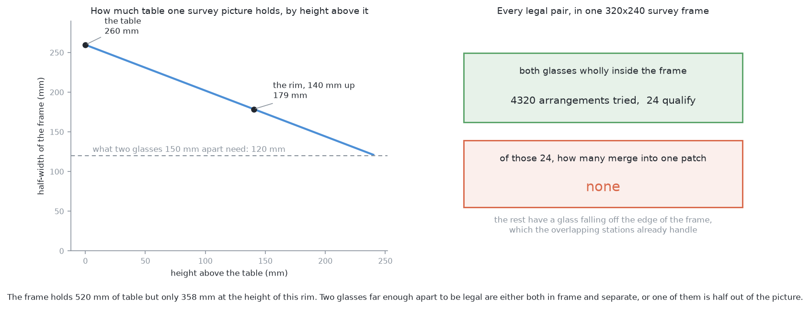
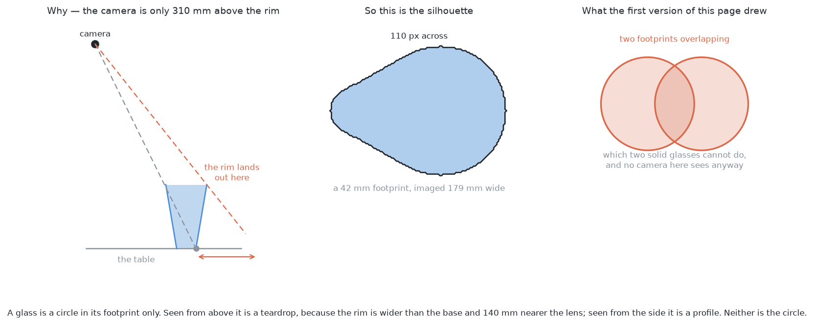
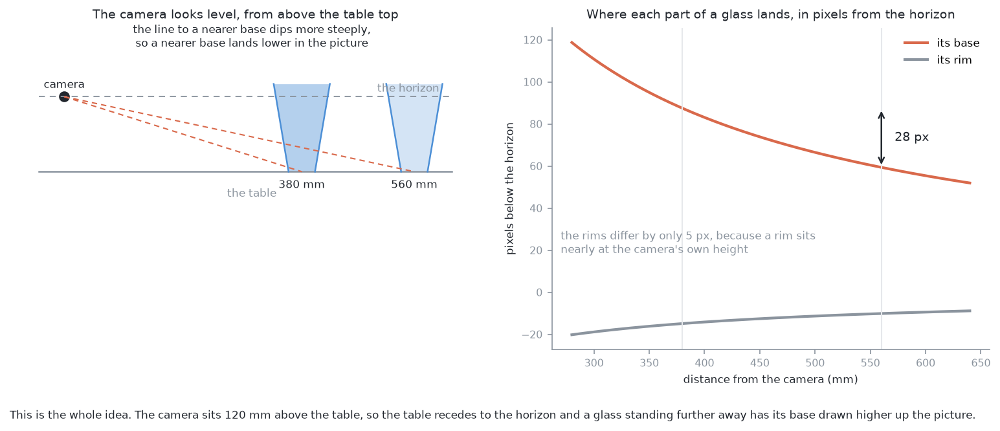
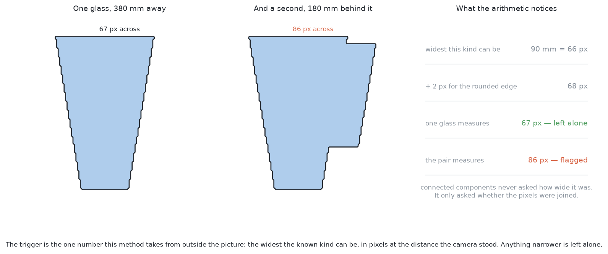
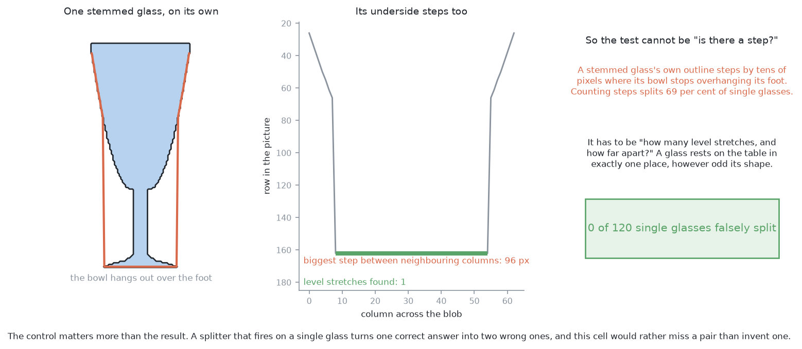
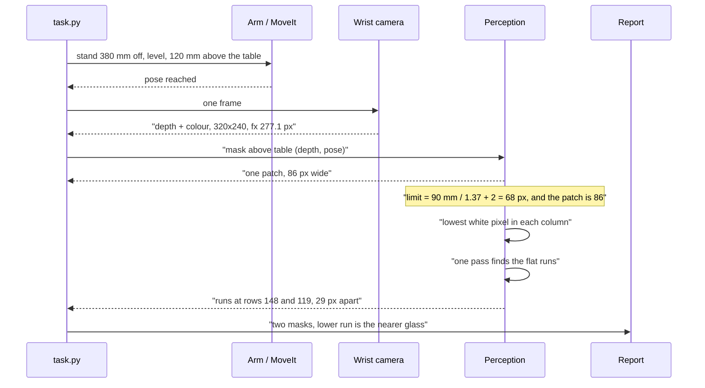
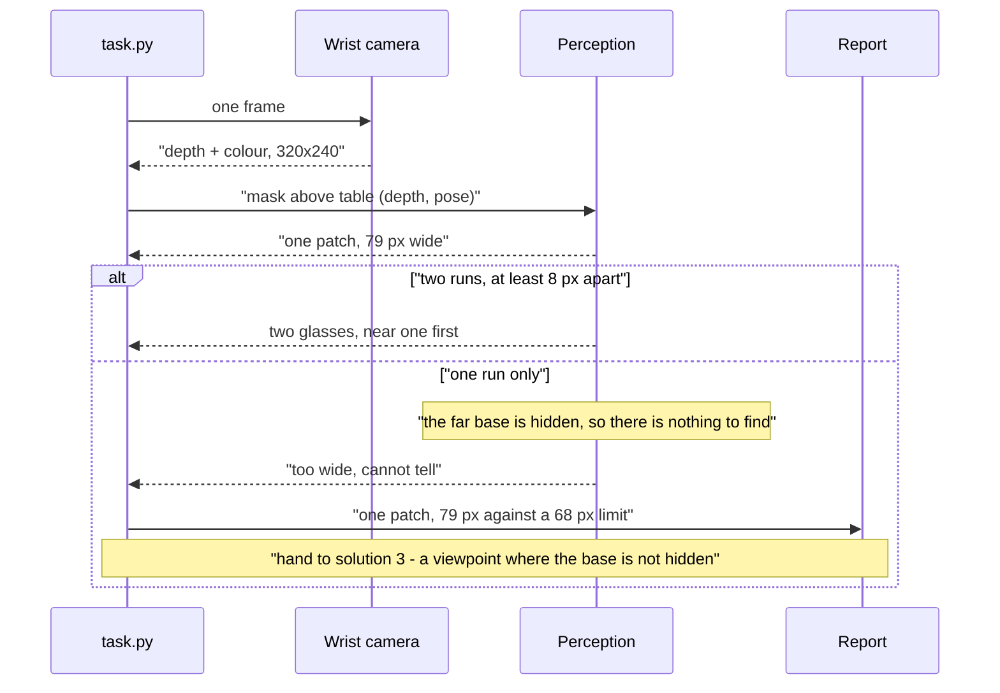
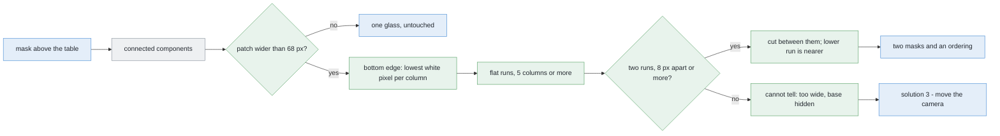
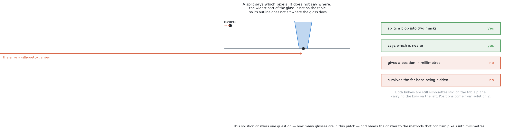

# Solution 1 — split the blob in the picture

*Programmed. Use the picture the camera already took. When one group of pixels
is too wide to be a single glass, cut it into two.*

> **The cell is described once, in [the cell](../../the-cell.md)** — the layout,
> the two places the camera works from, from the top and from the side, all four
> sensors, and the words this project uses them with. What follows is only what
> is specific to this solution.

## In one paragraph

Sometimes two glasses line up with the camera. The near one stands in front of
the far one, so in the picture they touch and look like one object. This
solution separates them. It does not need depth, a trained model, or a second
photograph. It works because the camera looks straight ahead from 120 mm above
the table. The table then stretches away to a horizon, and **a glass that is
further away has its base drawn higher up in the picture**. So we look along the
bottom edge of the shape and find the flat parts. One glass gives one flat part.
Two glasses at different distances give two flat parts at different heights. The
lower one is the nearer glass. The method takes less than a millisecond, it
never cuts a single glass in two by mistake, and it says "I cannot tell" when
the far glass's base is hidden.

## The problem this solves

First, some words we will use.

A **mask** is a black-and-white picture the same size as the camera's picture. A
pixel is white if the robot thinks there is glass there, and black if not.
Problem 1 already builds this mask.

**Connected components** is a standard step that looks at the mask and finds
groups of white pixels that touch each other. Each group is called a **patch**
(or a **blob**). It answers one question only: *are these pixels joined?* It
never asks how big the group is.

For one glass on an empty table, that question is enough. For several glasses it
is not. Two glasses can be far apart on the table and still touch in the
picture, because one hides part of the other.

*Where* this happens matters. And the first answer most people give is wrong.


**It does not happen in the survey.** In the survey the camera looks straight
down from 450 mm above the table. Two solid glasses cannot pass through each
other, and problem 2 promises they stand at least 150 mm apart, centre to
centre. So the nearest their outlines can ever come is about 45 mm. Seen from
straight above, they never touch.

We tested this rather than assuming it. We tried 4320 legal arrangements: four
kinds of glass, six sizes of each, every spacing from 150 to 300 mm, and every
angle. In every case where both glasses were fully inside one 320×240 picture,
**not one pair merged**.

The reason is that the picture covers less table as you go higher up.



At table level one survey picture covers 520 mm of table. At the height of this
kind's rim it covers only 358 mm, because the rim is 140 mm closer to the lens
than the table is. So two glasses far enough apart to be legal are either both
inside the picture and clearly separate, or one of them is falling off the edge.
A glass half outside the picture is a different problem, and the survey already
handles it: the camera takes pictures from several places, and they overlap, so
a glass cut off in one picture is well inside another.

**It happens in the level view.** Here the arm puts the camera 380 mm from a
glass and points it horizontally. This is the view problem 1 uses to measure a
glass's shape, and the view [solution 3](03-move-the-camera.md) sends the camera
to. In this view a glass 180 mm further back really is behind the near one. Now
merging is normal, not rare: out of 168 pairs standing in line, 132 came back as
a single patch.

So this page is about the level view, and only the level view.

### A glass looks like a circle in one place only

We write this down because an earlier version of this page got it wrong. That
version had a drawing of two round footprints overlapping. No camera in this
cell ever sees that.



A glass is a circle when you look at the ring it makes on the table. No camera
in this cell ever sees that ring face-on.

From above, the rim is wider than the base, and it is also 140 mm nearer the
lens. So the rim looks bigger and lands further out in the picture. The shape
that comes back is like a teardrop, leaning away from the point directly under
the camera. A base 42 mm wide can come back 156 mm wide.

From the side, the shape is the glass's side view: tall, and narrower at the
bottom. Neither shape is a circle the size of the base. A method that assumes a
circle is answering some other question, not this one.

## How it works, end to end

### The setup

A table at a known height. It is level, and it is fixed to the same frame as the
arm, so it does not move. Four to six glasses stand on it, at least 150 mm
apart. Every glass is the same kind, and we know which kind, so we know the
widest it can be before the run starts. We do **not** know how many glasses are
in any one picture, or where they stand.

The camera is mounted on the wrist. It goes wherever the arm goes. So a
viewpoint costs arm movement, which costs seconds.

### The pictures

**One picture.** That is the point of this method. It does not need a second
place to stand, and it does not need a pair of pictures.
[Solution 3](03-move-the-camera.md) exists to get exactly those, and it pays in
arm movement for them.

The picture is the level view that problem 1 already takes. The arm puts the
camera **380 mm** from the near glass, pointing horizontally, **120 mm above the
table** (`MEASURE_VIEW_HEIGHT` in `arm/dimensions.py`).

Why level? Because a level camera creates a **horizon** in the picture. The
horizon is the row where the table would seem to disappear if it went on for
ever. Every glass base sits below that row, and how far below depends only on
how far away the glass is. That is the fact the whole method uses.

The arm records the pose it used. So we know the 380 mm rather than having to
measure it, and that number is what turns millimetres into pixels.

### What each picture captures

The wrist camera returns a **320×240** depth picture and a colour picture of the
same size. The lens is 1.047 radians wide, which gives a focal length of
**fx = 277.1 pixels**. At 380 mm, one pixel covers **1.37 mm**.

Problem 1's detector turns the depth picture and the recorded pose into the
mask: white wherever the point behind that pixel is above the table top.
Connected components then groups the touching white pixels.

This method uses only two things: the mask, and the distance the camera stood
off. It never reads a single depth value. That is why it still works on real
glass, where a depth camera returns a glass-shaped hole instead of a reading.

### What is interpreted, and how

Imagine standing at a table and photographing it with the camera held level. The
table stretches away from you to a horizon. A glass near you has its base low in
the picture. A glass further away has its base higher up, closer to the horizon.
It is the same effect that makes the far edge of a road sit higher in a
photograph than the near edge.



Now the arithmetic. If the camera is at height *h* and looks level, an object at
distance *Z* has its base exactly `f·h / Z` pixels below the horizon. Here *f*
is the focal length in pixels.

- A glass 380 mm away: base **87 pixels** below the horizon.
- A glass 560 mm away: base **59 pixels** below the horizon.
- The difference is **28 pixels**, which is a lot.

Look at the second line on that graph too. The two glasses' *rims* differ by only
5 pixels. A rim sits almost at the camera's own height, so it lands almost on the
horizon, and moving it further away barely shifts it. So the top of the shape
tells you almost nothing about distance. All the useful information is along the
bottom.

Four steps, in order.

**1. Check the width.** This is the one number we take from outside the picture:
the widest this kind of glass can be. We turn it into pixels using the standoff
the arm chose.



At 380 mm, this kind's 90 mm rim covers 66 pixels. We add 2 pixels. The reason is
that the edge of a shape drawn on a grid of square pixels always rounds outward,
so a real silhouette comes out about a pixel wider on each side than the
arithmetic says. So anything up to 68 pixels wide is left alone. Our pair
measures 86 pixels, so it is flagged.

Those 2 pixels are not a number we chose to make the answer come out right. Take
them away and the method flags every single glass it ever sees.

**2. Find the bottom edge.** For every column of the patch that has any white
pixel, find the lowest white pixel. In code this is one `argmax` per column.

**3. Find the flat runs.** Walk along that bottom edge. Collect the longest
stretches where the row stays the same, give or take one pixel. Throw away any
stretch shorter than five columns, because those are the steep sides of the
glass, where the bottom edge is really the side wall and not a contact line.

Each surviving stretch is a place where something is standing on the table.


**4. Compare the two runs.** If two runs sit at least eight pixels apart
vertically, there are two glasses. Cut between them. And **you get the order for
free**: the lower run is the nearer glass.

Where does eight come from? We worked it out, we did not guess it. The smallest
gap in depth we ever have to call two glasses is 150 mm, because problem 2
promises that much between centres. At these distances 150 mm is about 22
pixels. Eight is well below 22, so we will not miss a real pair. And eight is
well above the one or two pixels of noise in an edge drawn on a grid, so noise
will not make a pair out of one glass.

### Why we look for flat runs, and not for steps

We tried the other test first and it failed, so it is worth writing down why.

The other test is easy to think of: *does the bottom edge have a step in it?* If
the edge suddenly jumps up, call that the place where the near glass ends and
the far one begins. On merged pairs it works 93 times out of 100.



Then run it on one glass standing alone. Take a wine glass. Its bowl is wider
than its foot, so the bowl hangs out over the foot on both sides. In the columns
over the foot, the lowest white pixel is the foot, near the table. In the
columns just outside the foot, the lowest white pixel is the underside of the
bowl, which is much higher up. So the bottom edge has a jump of **96 pixels** in
it, and there is only one glass there. Counting steps cuts 69 out of every 100
single glasses into two.

Flat runs do not have this problem. A glass can be any shape it likes, but it
stands on the table in one place only, so its bottom edge has one flat run only.
We tried this on 120 single glasses — four kinds, four distances. It cut none of
them.

We want the mistakes to go this way round, and not the other way. If the method
cuts one glass into two, we get two wrong answers in place of one right one, and
nobody later in the chain can tell that anything went wrong. If the method says
"I cannot tell", the next step knows there is a problem and can go and take
another picture.

### What comes out

Two masks in the same 320×240 picture, plus which one is nearer. Or one mask,
untouched. Or a refusal to answer.

What does **not** come out is a position in millimetres. Both pieces are still
flat shapes in a picture, and a shape in a picture is not where the glass really
stands.

The masks go to problem 1's step 2, which measures each glass's shape from a
level view. The refusal goes to the report and to
[move the camera](03-move-the-camera.md).

## The sequence

The normal path: one level picture, a patch that is too wide, two flat runs, two
masks.



The other path: the far glass stands almost directly behind the near one. Its
base never reaches the camera, so the patch has only one flat run.



## In pseudocode



Legend: **green** is new code written for this solution, **blue** is code the
project already has, **grey** is a third-party library.

Everything green below is about thirty lines of NumPy. There is no new import.

```text
pose = arm.stand_off(target, 0.380, level, MEASURE_VIEW_HEIGHT)  # have · work_cell.task
depth = camera.frame()                                           # have · work_cell.task
mask = detect.standing_on_the_table(depth, lens, pose, table_z)  # have · work_cell.glasses.detect
patch = biggest_component(mask)                                  # have · cv2.connectedComponentsWithStats

mm_per_px = 0.380 / lens.fx                                      # NEW  · 1.37 mm at this standoff
limit_px = spec.widest(kind) / mm_per_px + 2                     # NEW  · +2 for the pixel grid
if patch.width <= limit_px:                                      # NEW  · one glass; nothing to do
    return [patch]

underside = rows - 1 - patch[::-1].argmax(axis=0)                # NEW  · numpy, lowest white pixel
lit = patch.any(axis=0)                                          # NEW  · numpy
runs = level_runs(underside, lit, flat=1, least=5)               # NEW  · ~20 lines, numpy only

if len(runs) < 2 or runs[1].row - runs[0].row < 8:               # NEW  · 8 px, worked out above
    report.too_wide(patch, patch.width, limit_px)                # have · work_cell.report
    return [patch]                                               #      · hand to solution 3

cut = midway(runs[0].columns, runs[1].columns)                   # NEW  · numpy
near, far = patch[:, :cut], patch[:, cut:]                       # NEW  · numpy, lower run is nearer
report.split(near, far)                                          # have · work_cell.report
return [near, far]
```

The libraries, and what each is for.

| Library | Used for | In the pixi environment? | Licence |
|---|---|---|---|
| NumPy | the whole method: `argmax`, the run pass, the slice | **yes** | BSD-3-Clause |
| OpenCV | connected components, before this method runs | **yes** | Apache-2.0 |
| Matplotlib | the diagrams on this page only, not the run | **yes** | Matplotlib (BSD-style) |

Nothing else. No SciPy, no scikit-learn, no PyTorch. We say this because
[solution 4](04-learned-doubt-steers-the-next-picture.md) and every solution
after it begins by adding one of them. Here there is no model, no weights file,
no graphics card, no training data, and no licence to check.

## A worked example

Two glasses of a kind whose rim is 90 mm and whose base is 43 mm. They stand
140 mm tall. The camera is level, 120 mm above the table. Glass A is 380 mm away.
Glass B is 180 mm further back and 60 mm to one side.

**What comes back.** One patch, 86 pixels wide. At 1.37 mm per pixel that is
118 mm. The kind's limit is 68 pixels. So it is flagged.

**The bottom edge.** 86 columns, each with its lowest white pixel. Two flat runs
survive:

| | columns | row | what it is |
|---|---|---|---|
| lower | 18 – 49 | 148 | glass A's base, 87 px below the horizon |
| higher | 55 – 74 | 119 | glass B's base, 59 px below the horizon |

They are **29 pixels apart**. The arithmetic above predicted 28. The extra pixel
comes from the pixel grid. Either way it is well over the eight-pixel threshold.

**The answer.** Two glasses. The cut goes at column 52. The lower run is the
nearer one, so the left piece is glass A at about 380 mm, and the right piece is
glass B, further away. Two masks and an ordering, from one photograph, in about a
third of a millisecond.

**What it has not produced.** Any position in millimetres.

## Where it comes from

Splitting one patch into objects is an old problem, and the standard tool is
**watershed on the distance transform**. The idea is this. For every white pixel,
work out how far it is from the nearest black pixel. That gives a kind of
landscape, where the middle of a blob is deep and the edges are shallow. Find the
deepest points, then flood outwards from each one, and build a wall where two
floods meet. It is one call in OpenCV. For touching cells under a microscope or
coins on a scanner, it is the right answer.

Here it is the wrong answer. Not because some number needs tuning — because of
the shape of a glass.


In a short, round object the deepest point is a single peak in the middle. Two
such objects give two peaks, and the wall lands neatly between them.

A standing glass seen from the side is about four times taller than it is wide.
Its distance from the outside is limited by its half-width, and by the same
half-width all the way up. So the deepest part is not a point. It is a **line
running up the middle**, like a ridge. Two overlapping ridges join into one
ridge. Only one starting point survives, and there is nothing to flood from.

We measured it across the four kinds: out of 122 merged pairs, watershed split
**four**. No choice of threshold fixes that.

The method on this page replaces it, and it is not new either. It is the
**ground-plane constraint**. If you know how high the camera is above a flat
surface, then the row where an object meets that surface tells you how far away
it is. In pedestrian detection the contact point is called the *foot point*.
Mapping a whole picture onto the ground this way is called **inverse perspective
mapping** (Mallot et al., *Biological Cybernetics*, 1991). The best-known
write-up of why this is so useful is Hoiem, Efros and Hebert's
[Putting Objects in Perspective](https://doi.org/10.1007/s11263-008-0137-5)
(CVPR 2006, extended in *IJCV* 2008): a known ground plane plus a known camera
height turns a picture into a measurement.

What is a little different here is the job we give it. Usually people use it to
work out how far away something is, or to throw away a detection whose size does
not match its distance. We use it to **separate** two objects instead: two
contact rows in one patch means two glasses. Same arithmetic, different job. And
this cell is an easy case for it — a flat, level table at a known height, fixed
to the same frame as the arm, with everything standing on it.

**GrabCut** is the other tool people reach for, and it answers a different
question. Given a rough box around an object, it separates object from background
by modelling their colours, then smooths the result. It is useful when a
threshold leaves a ragged edge. But it never decides *how many* objects there
are. Give it a box around two merged glasses and it returns a tidier outline of
the same merged pair. It belongs after this method, not instead of it.

> Robotics-basics has nothing on this. Its perception documents cover sensors,
> programmed methods, and models that find and measure, but not the
> ground-plane family. That is a real gap, because it is the cheapest way to get
> depth from one camera and it needs no model at all.

## The feedback loop

There is none. This method looks at one picture and either answers or refuses. It
cannot ask for another photograph, and it remembers nothing between pictures.

What it does give is a **clean handover**. Three outcomes:

- two runs far enough apart — two glasses, and which is nearer;
- one run, and the patch is within the kind's width — one glass, left alone;
- one run, and the patch is too wide — *there is more than one glass here, and I
  cannot see the second one's base from where I am standing.*

The third outcome is the useful one. It is specific, so it tells
[move the camera](03-move-the-camera.md) exactly what the new viewpoint has to
achieve.

## Where it is strong and where it breaks

- **Free.** A third of a millisecond on a 320×240 patch. Thirty lines of code.
  No new library.
- **It never invents a glass.** Zero wrong splits across 120 single glasses. The
  method is built around that.
- **It gives the order for free.** Not just two masks, but which glass is nearer.
  The near one is the one worth measuring first.
- **Every step can be printed.** Two run positions and a row difference. A wrong
  answer is a number you can read.
- **It needs no depth.** Everything comes from the mask. On real glass, where the
  depth camera returns a hole, every method that groups 3-D points stops working
  and this one carries on.
- **It cannot see a hidden base.** Out of 122 merged pairs it split 76. Broken
  down by how far the far glass stood to one side, the pattern is sharp: from
  40 mm of sideways offset onward it split **every** merged pair, 74 out of 74.
  Below that it split 2 out of 48. There is no middle ground to tune, because the
  question is simply whether any of the far glass's base can be seen.
- **It gives no position.** Both pieces are still flat shapes in a picture,
  carrying the error problem 1 already measured: a glass 157 mm from the camera
  was reported at 244 mm.
- **It assumes the table is flat, level and at a known height.** All three are
  true here, and all three are still assumptions. Five millimetres out of level
  costs about one pixel at this standoff, which is fine. A sloping table would
  not be.
- **It only works from a level camera**, which is consistent, because from the
  survey view there is nothing to split.
- **When the base is hidden there is nothing to find**, and the method would say
  nothing at all about it. The width check is what notices. So what comes out is
  a flag, not a wrong answer.
- **A glass cut off by the edge of the picture** has a bottom edge that stops at
  the boundary. The flat-run test survives this, but the width check does not,
  because a cut-off shape is narrower than its glass. A patch touching the edge
  should be reported as cut off rather than measured.
- **Anything else standing in the patch** is counted, because the method finds
  flat runs, not glasses. The rack's foot inside the same patch is a flat run.
  The circle fit in [solution 2](02-cluster-on-the-table.md) is the guard.


This gap is not something tuning can close. When the far glass stands almost
exactly behind the near one, its base is hidden, and no amount of work on this
one picture will bring it back. That pair goes to solution 3, which moves the
camera.



**When to use it.** First, in the level view, because it is free and it resolves
most in-line pairs. Whenever there is no depth, as on real glass. And as a second
opinion, because it fails in different situations from the geometric methods, and
two independent methods agreeing is worth more than either alone. Not in the
survey, because there the problem does not arise.

## The general methods behind this

Nothing here was invented for glassware. It is four standard ideas. Three are in
every image-processing textbook, and one is the oldest trick for getting depth
out of a single camera.

### Connected-component labelling — grouping pixels that touch

Go through a black-and-white picture and give every group of touching white
pixels one label. It answers *are these pixels joined?* and nothing else. It has
no idea about size, shape, or how many objects a group should hold. It is the
step this solution exists to repair.

- **Mostly used for** counting and separating blobs that are already well apart:
  cells on a slide, letters on a scanned page, moving objects seen by a fixed
  camera.
- **Rarely right for** anything where objects touch or overlap in the picture.
  There it joins them silently, and that is the one mistake it cannot report.
- **More:** [connected-component labelling](https://en.wikipedia.org/wiki/Connected-component_labeling);
  `cv2.connectedComponentsWithStats` in OpenCV.

### The ground-plane constraint — where a thing meets the floor tells you how far away it is

If you know the camera's height above a flat surface, the row where an object
touches that surface gives its distance. A camera at height *h* looking level
puts an object at distance *Z* exactly `f·h / Z` pixels below the horizon. One
row, one division, and you have a distance in millimetres. The contact point is
called the *foot point*. Mapping a whole picture onto the ground this way is
called *inverse perspective mapping*.

- **Mostly used for** driving and surveillance, where everything of interest
  stands on a road or a floor. It is used to judge how far away a person or a car
  is from a single camera, to reject detections whose size and position disagree,
  and to build the bird's-eye views used for lane following.
- **Rarely right for** objects that are not resting on the surface: anything
  held, stacked, flying, or on a shelf. It also needs the surface's position to
  be known and the surface to be flat. And it breaks when the contact point is
  hidden, which is exactly this solution's weak spot.
- **More:** Hoiem, Efros and Hebert,
  [Putting Objects in Perspective](https://doi.org/10.1007/s11263-008-0137-5)
  (CVPR 2006, extended in *IJCV* 2008);
  [3D projection](https://en.wikipedia.org/wiki/3D_projection) for the
  arithmetic.

### Watershed on the distance transform — the method this one replaces

Treat a blob as a landscape. The height at each pixel is its distance from the
outside. Flood from the deepest points, and build a wall where two floods meet.
The [distance transform](https://en.wikipedia.org/wiki/Distance_transform) makes
the landscape. The
[watershed](https://en.wikipedia.org/wiki/Watershed_%28image_processing%29)
(Vincent and Soille, *PAMI*, 1991) does the flooding.

- **Mostly used for** separating touching objects that are *round and squat* and
  roughly the same size: cells, coins, grains, tablets. For those, nothing this
  cheap does better.
- **Rarely right for** long, thin objects, because their landscape has a ridge
  instead of a peak, so the starting points merge. That is why it splits only
  three per cent of this cell's pairs, and why no threshold saves it.
- **More:** `cv2.distanceTransform` and `cv2.watershed` in OpenCV;
  `skimage.segmentation.watershed` in scikit-image.

### GrabCut — tidying an outline you already roughly have

Given a rough box around one object, model the colours inside against the colours
outside, cut the boundary where the two disagree, and smooth the result
([GrabCut](https://en.wikipedia.org/wiki/GrabCut), Rother, Kolmogorov and Blake,
SIGGRAPH 2004).

- **Mostly used for** photo editing, and for cleaning up the last pixel or two of
  a mask whose threshold was roughly right.
- **Rarely right for** deciding *how many* objects are there. It improves one
  boundary. Give it two merged objects and it returns a tidier merged pair.
- **More:** `cv2.grabCut` in OpenCV.

---

## Where it sits

It is a **first pass in the level view**, not a rival to
[cluster on the table](02-cluster-on-the-table.md). The two do different jobs.
This one says how many glasses are in a patch and which is nearer. Clustering
says where they are in millimetres. Where depth works, clustering is the answer
and this is a cheap cross-check. Where depth does not work, this is what is left.

Its natural partner is [move the camera](03-move-the-camera.md), which gives the
one thing this method cannot get for itself: a place to stand from where the
hidden base is not hidden. When this solution cannot split a pair, that is not a
complaint. It is a clear request — stand somewhere else and look again.

← [Solution overview](solution-overview.md) ·
→ [Solution 2 — cluster on the table](02-cluster-on-the-table.md)
