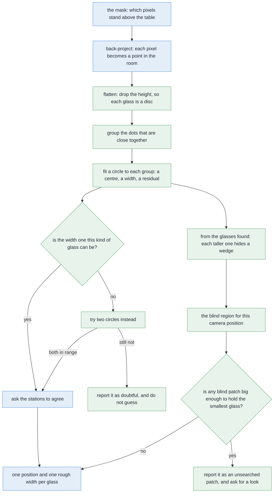

# Solution 2 — cluster on the table

*Programmed. Stop deciding which pixels belong together by looking at the
picture. Decide it by looking at where they are in the room.*

> **The cell is described once, in [the cell](../../the-cell.md)** — the layout,
> the two places the camera works from, from the top and from the side, all four
> sensors, and the words this project uses them with. What follows is only what
> is specific to this solution.

## Introduction

This document explains the method this project actually relies on to tell
several glasses apart. The problem it solves is that a photograph can join two
glasses into one shape even when they stand well apart on the table, so any
decision made inside the picture starts from information that has already been
lost. The idea here is to stop deciding in the picture altogether, and to decide
on the table instead. By the end you will understand how a pixel with a distance
reading becomes a point in the room, why throwing away the height of those
points makes the problem easy rather than harder, how points are grouped by
nothing more than how close together they are, and why fitting a circle to each
group is what keeps the whole method honest.

There is a second half to this document, and it exists because of one property
of the glasses in this problem. Because a single kind spans a small tapered
glass at one end and a large one at the other, a tall glass can cover a short
one completely when seen from above — and a glass that produced no pixels cannot
be found by any method that looks at pixels. So the last part of this document
is about a different question: **not what was seen, but what could not have
been.**

## The problem this solves

To describe the problem we need to be clear about the situation and about two
words.

The situation is this. Four to six drinking glasses stand on a table. They are
all of the same kind, and we know which kind. They are solid and they stand
upright. They stand inside a rectangle of table that is a little wider than it
is deep, which this project calls the **glass zone**. The camera sits on the
arm's wrist, and in this solution it works **from the top**, which means that
the arm lifts it high above the table, well clear of the tallest glass, and
points it straight down. The job is to say which pixels belong to which glass,
where each glass stands, and roughly how wide it is — and to say honestly which
glasses could not be told apart.

The phrase "stand well apart" has a definite meaning here, and the whole method
depends on it. This problem promises a smallest gap between the centres of any
two glasses, and that gap is wider than any glass of any kind the cell handles.
Because of that promise, two glasses can never be touching, and there is always
a strip of bare table between them. Everything below rests on that strip
existing.

The first word we need is **mask**. A mask is a picture the same size as the
camera's picture, in which every pixel holds only yes or no, where yes means
that the robot believes this pixel shows something standing on the table.

The second word is **flood fill**, which is the method the project already uses
for a single glass. A flood fill picks a yes pixel that nobody has visited yet,
spreads out to every neighbouring pixel that is also yes, and calls everything
it reached one object. With one glass on an empty table that is enough, because
whatever is joined together is the glass. With five glasses it is not enough.

On the left of that picture, two outlines touch each other, so the flood fill
hands back one patch. On the right, the same two glasses are drawn where they
really stand, with a clear strip of bare table between them. The camera did not
move them closer together. What it did was throw away the one piece of
information that would have kept them apart, which is **which pixels were near
the camera and which were far**.

### Why a photograph from above joins them, and can lose them

The reason this happens is worth understanding properly, because it is the
reason the fix has to work outside the picture — and because the same mechanism
causes a second, worse failure.

A photograph of a tall object is not a photograph of its base. The camera is
looking from the top, so the table is the furthest thing from the lens, and a
glass's rim is the nearest thing, because the rim has climbed most of the way
from the table up towards the camera. Nearer things look larger, and they also
land further out from the middle of the picture. So the rim of a glass is drawn
as though the glass stood further out from the point directly below the camera
than it really does, and **the taller the glass, the further out it is thrown**.
This project calls that effect **splay**, and [the cell](../../the-cell.md)
explains it in full.

The practical result is that a tall glass's outline leans outwards, away from
the point below the camera, and it can come to rest on top of whatever is
standing in that direction.

Whether that matters depends entirely on how much the heights inside the kind
differ, and in this problem they differ a great deal: the tall end of the
tapered kind is more than twice the height of the short end. A tall glass is
therefore thrown outwards a long way while a short glass standing beyond it is
barely thrown at all, so the tall glass's outline can reach the short one and
pass right over it.

That gives two failures rather than one, and they are not equally dangerous.

**The merge is the loud one.** If the tall glass's outline reaches the short one
without covering it, the two touch and come back as a single patch. That patch
is wider than any glass of this kind can be, so something downstream can notice.

**The complete cover is the quiet one.** If the tall glass's outline covers the
short one entirely, the short glass contributes no pixels at all. What comes
back is one patch, of one perfectly legal width, with a clean outline. **Nothing
about it is wrong.** The picture simply holds one glass fewer than the table
does.

The second failure cannot be answered by grouping pixels better, because the
pixels are not there to group. It is answered instead by a piece of arithmetic
that never looks at the picture's contents at all, and that arithmetic has its
own section below.

So the fix is not a better flood fill, however carefully it is written. The fix
is to stop grouping in the picture.

## The main idea

The main idea is a change of place rather than a change of algorithm.

A depth camera gives a distance for every pixel, and that is enough to turn each
pixel into a point in the room. The pixel tells you which direction the camera
was looking, the depth tells you how far along that direction to travel, and the
camera's own pose tells you where that direction starts. Once every pixel has
become a point in the room, the question "which glass is this?" is no longer a
question about the picture. It becomes a question about distance on the table.

That change matters because the strip of bare table between two glasses, which
the photograph could not show us, is simply there once the points are in the
room. Two glasses that touch each other in a photograph are still standing well
apart on the table, and on the table is where we do the deciding.

Those four panels are the whole method in order: the depth picture, then the
points that stand above the table, then those points flattened onto the table
and grouped by how close together they are, and finally one circle fitted to
each group. The sections below take one concept at a time, in that order.

## Turning a pixel into a point in the room

The first concept is the one everything else is built on, and it has a name:
**back-projection**. Projection is what a camera does when it turns a place in
the room into a place in a picture. Back-projection is that step run in reverse.

On the left of that picture is what the camera actually hands over, which is a
grid of numbers. On the right is what one of those numbers means in the room.
Follow the line: it starts at the camera, passes through the highlighted pixel,
and stops where the depth reading says a surface is. The lesson is that a pixel
on its own is not a thing. **A pixel is a direction with a distance written on
it.**

Turning that into a point needs three inputs and no guessing. The pixel's column
and row, measured out from the middle of the picture, give the direction. The
depth reading gives how far along that direction to travel. And the camera's
pose says where the ray begins and which way it is facing. Scaling the sideways
offsets by the depth, and then moving the result into the frame the arm works
in, gives one point in the room.

Two details about the depth reading are worth knowing, because both catch people
out.

The first is that the depth is measured straight out along the lens axis, and
not along the slanted line from the lens to that particular pixel. So a pixel
near the corner of the picture is genuinely further from the lens than its depth
reading says. This is exactly why the sideways offsets are needed and why you
cannot simply treat the depth as the distance.

The second is that some pixels come back with no reading at all. Those are
dropped rather than guessed, because a pixel with no distance cannot be placed
anywhere in the room.

There is one more thing the camera hands over that is easy to misread, which is
the **focal length**. Despite its name, the focal length used here is not a
length in millimetres. It is a conversion factor between directions and pixels,
and it follows from how wide an angle the lens covers and how many pixels it
spreads that angle across. A wider lens over the same number of pixels gives a
smaller focal length. The only thing this document needs from it is a
consequence: because the lens spreads a fixed angle over a fixed number of
pixels, **how much of the world one pixel covers depends only on how far away
that world is**.

That consequence explains the choice of camera height. From high above the
table, one pixel covers a millimetre or two of table top. That is coarse
compared with a ruler, but it is fine compared with a glass, which is tens of
pixels across. The ratio between those two is why the method works at all.

Doing this for every pixel the mask kept gives a **point cloud**, which is
simply a list of positions in the room. It has no grid, no neighbours and no
order. That loss of structure sounds like a step backwards, and it is in fact
the point: neighbouring in the picture was the misleading idea we are trying to
escape.

## Flattening: why the height is thrown away

The second concept is the one that surprises people, because it throws
information away on purpose. Every point is dropped straight down onto the
table, so a point in three dimensions becomes a dot in two.

To see why that helps, first look at what the cloud of points actually looks
like. On the left of that picture are two glasses as points in full three
dimensions. Notice the shaded band. There are plenty of points on the tops of
the glasses, a few near their bases, and almost nothing in between. The reason
is that a camera looking down from the top sees the side wall of a glass
edge-on, and an edge-on wall catches almost no pixels. So the cloud is not
shaped like a glass at all. It is more like a lid with a ring of crumbs
underneath it.

That shape is fatal if you try to group the points in three dimensions, and the
argument is worth following slowly, because it is the heart of this step.

In three dimensions, the top of a glass and the base of the **same** glass are
separated by the glass's whole height, with a hole in between where the wall
should have been. Meanwhile the nearest points of two **different** glasses are
separated only by the strip of bare table between them, and that strip is
narrower than a glass is tall. So the gap *inside* one object is larger than the
gap *between* two objects.

Once that is true, no grouping distance can possibly work. Any distance small
enough to keep the two glasses apart also cuts each glass into a top and a
bottom. Any distance large enough to hold one glass together also reaches across
to its neighbour. There is no value in between to choose, because the two
requirements have crossed over.

Flattening removes the problem completely. Each glass becomes a small solid
disc, no taller than the paper it is drawn on, while the strip of bare table
between two discs is exactly as wide as it was, because flattening moves nothing
sideways. Now the gap inside one object is zero and the gap between two objects
is the whole strip, so there is a wide range of grouping distances that work.

The short way to remember this is that **height is the dimension that varies
most and tells you least**.

One caveat belongs here, so that nobody reads more into the disc than it holds.
The flattened disc is not the glass's base. It is the outline of the glass's
widest horizontal slice, because that slice is what hides everything underneath
it from a camera looking down. For a tumbler, the rim and the base are nearly
the same width and the difference does not matter. For a wine glass, whose bowl
is wider than its foot, the disc is the bowl. This problem asks only for a
*rough* width, and the widest slice is the honest answer to that question. The
exact shape is measured later, with the camera brought down and round to look at
the glass **from the side**.

## Grouping the dots by how close they are

The third concept is the grouping rule itself, and it fits in one sentence.

> Start from a dot nobody has visited. Take every dot within a chosen distance
> of it. Then take every dot within that distance of those. Keep going until
> nothing new is added, and call that clump one glass. Then start again from a
> dot that has not been used.

This rule has a name, **Euclidean cluster extraction**, and its most important
property is how little it is told. The only setting is the one distance. Nobody
tells it how many groups to find, or how large they should be, or what shape
they should have. That matters a great deal here, because a method that is told
to find five groups cannot ever report that there were four or six, and
reporting that honestly is the whole point of this problem.

The rule also **chains**, which means that if A joins B and B joins C, then all
three are one group, even if A and C are right across the table from each other.
Chaining is what lets the rule hold a long, thin scatter of dots together
without being told anything about shape. However, chaining is also the rule's
one weakness, because a single stray dot sitting in the strip between two
glasses is enough to link them into one group.

### Choosing the one setting

Because there is only one setting, it is worth being careful about how it is
chosen, and the good news is that it is not chosen by trial and error. It is
pinned between two limits that are both known before the run starts, and then
placed in the gap between them. This is the same reasoning used when choosing a
measurement tolerance, which must be larger than the instrument's noise and
smaller than the smallest real difference that must not be missed.

The **lower limit** is set by how far apart the dots on one glass are.
Neighbouring pixels land on neighbouring pieces of table, so the dots arrive in
a mesh whose spacing is roughly what one pixel covers. Two things change that
spacing. The top of a glass is nearer the lens than the table is, which actually
tightens the mesh there. But a surface seen at a slant, such as the shoulder of
a glass or the outer curve of a bowl, spreads its dots out, because one pixel
now covers a longer piece of surface. If the chosen distance is smaller than the
widest stretch anywhere in that mesh, the chain breaks in the middle of a single
glass, and one glass comes back as two or three groups.

The **upper limit** is set by the strip of bare table between two glasses, and
there is a trap here that is worth naming. This problem promises a smallest gap
between glass **centres**, but the grouping rule measures **edge to edge**. So
the worst case is that smallest centre gap with the two widest glasses of the
kind standing in it. Take half of each glass off the centre gap, and what is
left is the narrowest strip the method will ever be shown. If the chosen
distance is larger than that strip, the chain hops across it and two glasses
come back as one.

How much room is there between those two limits? The worst case for the ceiling
is the guaranteed centre gap with the two **widest** glasses of the kind
standing in it, and that strip is comfortably wider than the widest stretch in
the dot mesh. So there is a broad window, and almost any sensible value inside
it works.

That is a reason to derive the value rather than to relax about it. The window
is wide today because of two numbers that live in two different files, the
widest rim this kind allows and the guaranteed gap between centres, and neither
of them is this solution's to choose. So the grouping distance should be
**computed** from those two and **checked from the other side as well**, against
how far apart the measured dots actually fall, and the run should print both
ends. A value that is derived stays correct when somebody widens a kind or moves
the glasses closer together; a value that was typed in once goes quietly wrong
on that day and takes a while to find.

Inside that window the value is placed deliberately **low** rather than in the
middle, because the two mistakes are not equally bad. A glass split into two
groups announces itself loudly, because both halves then fail the width check
described next, since half a footprint is far too narrow to be a glass of this
kind. Two glasses merged into one group are much quieter. So the setting leans
towards splitting, which is the mistake that gets caught.

There is also a practical point about running the rule, and it is a useful habit
rather than a detail of this problem. Comparing every dot with every other dot
means a number of comparisons that grows with the square of the number of dots,
which becomes hopeless quickly. Sorting the dots into square bins whose side is
the grouping distance fixes it, because two dots within that distance of each
other must lie either in the same bin or in one of the bins touching it, so each
dot is only ever compared with a handful of others. The same idea under a
grander name is a k-d tree.

## Fitting a circle, and checking it against the kind

The fourth concept is what keeps the method honest, and it is the reason this
solution can be trusted with a moving arm.

A glass seen from above is a circle, so each group of dots should be a filled
disc. Fitting a circle to that disc gives back a centre and a width, and it also
gives back a third number that turns out to be very useful, the **residual**,
which is how far the dots sit from the fitted circle on average.

The fit itself has a pleasant property worth knowing. Written in the obvious
way, the equation of a circle is not linear in its centre and its radius, which
would normally mean an iterative search with a starting guess. But if you
multiply that equation out and treat certain combinations of the unknowns as the
unknowns instead, it becomes linear. That means the fit has a direct solution:
no iteration, no starting guess, and the radius recovered at the end.

A fit is better than the bounding box the earlier code used, and the reason is
about noise rather than elegance. A bounding box is decided by exactly two dots,
the two extreme ones, and those are precisely the two dots most likely to be
noise. A fit uses every dot, so the many ordinary dots outvote the few odd ones.

Now the check. On the left of that picture, one circle fitted to a merged group
comes out several times wider than any glass of this kind can be, so it is
rejected straight away. In the middle, two circles are tried instead, and both
land inside the range. On the right is the ruler they are measured against,
which is the range of widths this kind of glass is allowed and nothing else.

That ruler deserves attention, because it is stronger here than it looks. Across
all four kinds the cell handles, the range of possible widths is broad, since a
narrow flute and a wide tumbler are very different objects. Within a *single*
kind the range is much narrower, and this problem tells us which kind is on the
table. So the check available here is far tighter than a general-purpose test
asking only "is this object-sized?" would be.

The check has four possible outcomes. If one circle fits and its width is inside
the range, that is one glass and it is accepted. If the width is outside the
range, the group is not one glass of this kind, so two circles are tried
instead. If two circles both land inside the range and together account for all
the dots, that is two glasses and both are reported. And if the group still
fails, it is reported as doubtful, with the measured width and the range it
failed, rather than guessed at.

Splitting a group in two is done by a simple and well-known method called
k-means with two centres. Drop two seeds anywhere in the group, give each dot to
whichever seed is nearer, move each seed to the middle of the dots it was given,
and repeat until nothing moves. Then fit a circle to each half.

What makes this check worth having is that it is **arithmetic rather than
judgement**. The statement "this is too wide to be one glass" contains two
numbers, both of which were known before the run started, and both of which can
be printed in the report.

## Asking the stations to agree

The fifth and last concept is the cheapest of all, because the survey already
does most of it.

The camera does not photograph the whole zone from one place. It visits several
**stations**, spread out over the zone and overlapping each other so that
nothing ends up only at the edge of one picture, where the view of it is worst.
There is a subtlety in how many stations are needed, which is that the area a
station can be trusted for is smaller than the area one picture covers. Two
things shrink it: the camera slides a short way sideways between the station's
two pictures, so only the part both pictures see counts, and the gripper's own
fingers, opened wide, eat into the edges of the frame. Held against the shape of
the glass zone, what remains works out to a single column of three stations, one
behind the other, marching away from the arm.

The grey patches in that picture are the pieces of table each glass hides from
that station. In the left panel, one glass sits well out towards the corner of
the frame, so splay throws its top outwards past the edge of the picture and
only the near part of its footprint comes back. In the right panel, that same
glass is nearly straight below the camera, where splay throws it almost nowhere,
so its footprint is complete — and now a *different* glass is the awkward one.

That swap is the whole point of this step. **Which glass is seen badly depends
on where the camera is standing**, so moving the camera changes which glass is
the problem.

Three rules follow from it. A group found in about the same place from more than
one station is a real glass. Its width is taken from the station that saw it
nearest to straight down, because that is the station whose view of its
footprint is least bitten into. And a group found from one station only is
reported as doubtful rather than as a glass, not because it is probably wrong,
but because it has been seen once.

That third rule is **the load-bearing part of the whole method**, and the
measurements in the next section are what make it so. A sizeable share of
glasses are invisible from at least one of the three stations, so a single
station's view of the table is routinely incomplete — and a smaller share are
seen from only one station, which means the position comes from an arc rather
than from a whole footprint. Those are precisely the glasses whose fitted circle
is wrong in a way that looks plausible, so the flag that marks them is the
difference between an honest answer and a confident one.

## Working out what you could not have seen

Everything so far places the glasses the pictures contain. This section is about
the glasses they do not, and it is the half of the method that the wide range of
sizes inside this kind makes necessary.

The problem is stated plainly enough. A tall glass's splayed outline can cover a
short one completely, and then the short glass contributes no pixels, so there
is no group, no fitted circle, no residual, and no flag. **Every check described
above is a check on something that was found.** None of them can fire for
something that was not.

So the question has to be turned round. Instead of asking "did I miss a glass?",
which nothing in the picture can answer, ask **"where could a glass have been
hiding?"** — and that question has an exact answer, because splay is arithmetic
and the glasses that *were* found have known positions, widths and heights.

### Splay is a radial scaling, and that is what makes it computable

One property of splay does all the work here, and it is worth stating on its own
because it is not obvious.

Take a horizontal slice of a glass at some height, which is a circle. Seen from
above, that circle is drawn as a circle again — moved outwards from the point
below the camera, and enlarged, both by the same factor. The factor depends only
on how high the slice is: the higher the slice, the larger the factor. So splay
is a **radial scaling about the point below the camera**.

Two consequences follow, and the second is the useful one.

The first is that a whole glass images as the union of those scaled circles, one
per slice, which for a tapered glass is a teardrop shape leaning away from the
camera. That is the shape the earlier sections kept describing.

The second is that **splay does not change a glass's angular width about the
point below the camera at all.** Scaling a circle's centre distance and its
radius by the same factor leaves the ratio between them unchanged, and that
ratio is what fixes the angle the circle subtends. So a glass covers the same
wedge of directions whatever its height. Height only decides **how far out along
that wedge** its outline is thrown.

That is why the hidden region is computable in closed form rather than by
drawing the scene and looking: **the region a glass hides is a wedge, and the
only question is where along that wedge it starts and stops.**

### Only taller glasses can hide a shorter one

The second idea cuts the work down, and it comes free with the first.

Because the scaling factor grows with height, a taller glass is always thrown
further out than a shorter one standing at the same distance. So for any glass,
the only things that can be covering it are the glasses **taller than it**.
Shorter neighbours cannot reach it, however close they stand.

That gives a cheap ordering. Sort the glasses found by height, tallest first,
and each glass only has to be tested against the ones above it in the list. It
is the same trick as drawing a scene back to front, and it turns a test over
every pair into a test over about half of them.

### A blind patch only matters if something could stand in it

The third idea is what makes the output finite and useful.

Put the two ideas above together and, for one camera position, you can mark out
every piece of table that could not have been seen. Each taller glass
contributes a wedge, clipped between the radius where its outline starts and the
radius where it ends, and the frame edge contributes a ring outside everything.
The union of all that is the **blind region** for that camera position.

As it stands that is a shape, not an answer, because a blind region always
exists and most of it is harmless. The test that turns it into an answer uses
the one thing this problem guarantees about sizes: **the smallest glass of this
kind has a known smallest footprint.** So a blind patch matters only if it is
large enough to hold that footprint. Anything narrower cannot be hiding a glass,
whatever else it is hiding.

What comes out is therefore a short list of **suspect patches**: places on the
table, each big enough to hold the smallest glass of this kind, that this camera
position could not have seen. That is a finite list, it is computed from
arithmetic alone, and it can be printed.

### What this actually buys, measured

It is worth being exact about how much this is worth in this cell, because it is
easy to oversell and the honest answer is more interesting.

We swept several hundred legal arrangements of four to six glasses of the
widened kind, at the guaranteed gap, and asked of every glass how many of the
survey's three stations could see it at all. Three results came back.

**About two glasses in five are invisible from at least one station.** That is
far more often than anybody would guess, and it settles one thing immediately:
**a single station's count is worthless.** Nothing in the run may ever conclude
"there are four glasses here" from one picture.

**No glass was invisible from all three stations.** Not one, in any arrangement,
even with several taller glasses contributing wedges at once. The reason is that
the stations stand well apart, and moving the camera moves the point below it,
which swings every wedge. So the union of the survey does find every glass, and
the wide size range does not lose glasses outright in this cell.

**About one glass in twenty-five is seen from only one station**, and almost all
of those are the shorter glass of a pair. Those are the dangerous ones, and they
are dangerous for a reason the earlier sections already documented: a glass seen
from one viewpoint only is fitted from an arc rather than a whole footprint, and
an arc fits a circle that is too small and in the wrong place, with a plausible
width and a small residual.

So the honest summary is this. **The blind-region arithmetic is not what finds
the glasses in this cell — the spread of the stations already does that.** What
it does is let the run *prove* that its answer is complete, instead of hoping
so. And it is what would catch the problem the day somebody moves the stations,
drops one of them, widens the zone, or puts a glass on a coaster. A method that
relies on three stations happening to be enough should be able to say so out
loud.

### Where the suspect patches go

A suspect patch is not a failure. It is a request, and it goes to the same place
the doubtful groups go: the solution that [moves the
camera](03-move-the-camera.md).

There is one difference worth noticing, and it changes that solution's job. A
doubtful group has a position, so the viewpoints worth trying are the ones round
*it*. A suspect patch has no object in it — that is the point — so what is
wanted is a viewpoint from which the patch itself is visible. That turns
choosing the next place to stand from a question about one object into a
question about **covering a set of regions**, which is where solution 3 picks it
up.

## How the concepts fit together

Put in order, the concepts make one flow with **two branches that run side by
side**, and the second branch is the one the wide size range added. The left
branch places what was seen. The right branch works out what could not have been
seen. They meet only at the report.

Notice that the right-hand branch takes its input from the **fitted circles**
rather than from the pixels. It needs the positions, widths and heights of the
glasses that were found, and nothing else. That is why it can say something
about glasses that produced no pixels at all: it reasons about what those
glasses would have been behind.

Green marks what this solution adds, and blue marks work the project already
does.

There is one saving in that flow worth pointing out, because the textbook
version of this recipe does more work. The standard recipe finds the table by
searching for the largest flat surface in the point cloud. Here the table's
height is a constant the code can look up, because the table is bolted to the
same frame as the arm, so finding the table becomes a comparison rather than a
search. That is a real saving, but it is worth understanding rather than copying
blindly: if the table were moved or the arm remounted, the constant would be
wrong in a way that a search would not be.

## What comes out, and what does not

For each glass the method reports four things. The first is **which pixels**
belong to it, carried back from the group's dots to the mask they came from. The
second is **a position** on the table, measured from the arm's base. The third
is **a rough width**, which is the fitted diameter. The fourth is **doubt, where
there is any**, as one of several named flags, each carrying the measurement
that raised it.

And there is now a fifth thing, which does not belong to any glass: **a list of
unsearched patches**, each one a place on the table that no picture could have
seen and that is large enough to hold the smallest glass of this kind.

That fifth output is the one worth insisting on, because it is the only part of
the report that says anything about what is *not* in it. The four per-glass
outputs describe what was found. The list of unsearched patches is the
difference between "we found four glasses" and "we found four glasses, and here
is everywhere a fifth could have been standing".

All of it comes out in the same form the existing survey already produces, so
nothing downstream has to change. The positions drive the rest of the run, the
report prints the positions and widths, any pair that could not be separated is
the handover to [problem 3](../../problem-3/problem.md), and the unsearched
patches go to the solution that moves the camera.

It is worth being clear about the cost, because it is easy to worry about the
wrong thing. Back-projection is arithmetic the project already does. The rest is
a comparison, dropping one column of numbers, a flood fill over a grid of bins,
and a direct least-squares solve. We have not timed it on this machine yet, but
the shape of the answer is not in doubt: this is the kind of work a processor
finishes while the arm is still deciding to move, and every small movement of
the arm costs seconds. So computation is not the thing to economise on here, and
any argument of the form "that would be too slow to compute" should be checked
against that before it is believed.

### Why there is no feedback loop

This solution has no feedback loop, and that is a deliberate limit rather than
an oversight. A feedback loop, in the sense the other solutions use the term,
needs three things: a measure of doubt, a set of actions that might reduce it,
and a budget so that it stops. This method has the first and neither of the
others. It runs on whatever pictures the survey gave it and produces an answer,
so if a glass was seen badly, it stays seen badly.

What it does produce is good doubt, in five named forms, each of them a
measurement rather than a feeling. A group's fitted width may be outside the
kind's range. A group's two-circle split may also have failed the range. A group
may have been found from one station only. A group may hold fewer dots than a
glass of that size should give, which usually means most of it was hidden. And
there may be an unsearched patch large enough to hold the smallest glass of the
kind.

That fifth form is different from the other four in a way worth noticing. **The
first four are doubts about a thing that was found. The fifth is a doubt about a
place.** It is the only one that can fire when the pictures contain nothing
wrong at all, and it is the only one that could ever point at a glass nobody has
seen.

All five are the input that [move the
camera](03-move-the-camera.md) consumes. For the
first four, that solution's job is to take a doubtful group, work out where the
camera would have to stand for it to become clear, check that the arm can get
there, go and look, and run the grouping again on the better picture. For the
fifth, the job changes shape: there is no group to stand round, only a region to
get a view of.

The cost of having no loop is specific. A pair that merges from every station
the survey happens to visit is reported as one wide object with a flag saying
its width is out of range, and nothing more. That is not a wrong answer, because
it is flagged, but it is an incomplete one, and closing that gap is what the arm
has to move for.

## A worked example

This example follows one scene through the whole method. It is described in
terms of what happens rather than what is measured.

Six glasses of one kind stand in the zone, with sizes spread right across the
range the kind allows. Call them G1 to G6.

| | where it stands | how big, as this kind goes |
| --- | --- | --- |
| G1 | middle of the zone, a little to the near side | large: tall and wide |
| G2 | the far corner of the zone, diagonally out past G1 | middling |
| G3 | the near corner on the other side | middling |
| G4 | out along the far edge, away from G2 | middling |
| G5 | the near corner on G1's side | middling |
| G6 | on the same diagonal as G1, beyond it | **the smallest glass the kind allows** |

Two relations matter, and neither is accidental. Both are worst cases, chosen on
purpose.

The first is that **G1 and G2 are the closest pair, and they are only just
legally apart**, so their centres are barely further apart than the smallest gap
this problem promises. They are also lined up with each other along the diagonal
running away from the middle of the zone, which is the direction splay throws
things.

The second is that **G6 is the smallest glass of the kind and it stands beyond
the largest one, on the same diagonal.** G1 is tall, so splay throws its outline
a long way out along that diagonal. G6 is short, so splay barely moves it at
all. That is the new case, and it is the one the last part of this example is
about.

The camera goes to the middle station, lifted to the survey height and looking
straight down at the centre of the zone, so the whole zone is inside the frame
and nothing is missing for an uninteresting reason.

### What grouping in the picture returns

G1 stands a short way out from the point directly below the camera, on the
diagonal towards the far corner. Splay throws its rim outwards along that
diagonal, so in the picture G1's outline does not sit over G1. It leans out past
it, towards G2.

G2 stands much further out along the same diagonal, so splay throws its rim
outwards too, and by more, because the further a glass stands from the point
below the camera, the further splay pushes it. That is where the trouble comes
from. G2's outline is pushed so far out that part of it runs off the edge of the
picture, and only the near part of it comes back. G1's outline, leaning
outwards, reaches the near edge of what is left of G2's. The two outlines touch,
so the flood fill hands back one patch where there are two glasses, and the
picture shows four blobs for five glasses.

It is worth being careful about *why* this pair merges, because two outlines can
meet by either of two routes and they are worth keeping apart.

The first needs the frame edge. When two glasses of similar height stand along
the same diagonal from the point below the camera, splay pushes both outwards
and pushes the further one more, so the gap between them in the picture
**grows** rather than closes, and they meet only when one of them is half out of
frame.

The second does not need the frame edge at all. If the nearer glass is much
taller than the further one, splay pushes the near one's outline out by a large
factor and the far one's by a small factor, so the gap between them in the
picture **closes**. Whether two outlines meet is therefore a question about the
difference in their heights as much as about where they stand.

The merged patch runs from G1's near edge all the way to the corner of the
frame, and it is several times wider than any glass of this kind could be. So
the picture *can* tell that something is wrong. What it cannot tell is *what* is
wrong, whether one impossibly wide object or two glasses or three, because the
one thing that would separate them was thrown away the moment the scene became
pixels.

### What grouping on the table returns

On the table, G1 and G2 are still nowhere near touching. Take their
centre-to-centre gap, subtract half of each glass, and what is left is a strip
of bare table several times wider than the grouping distance. The chain cannot
cross a strip of nothing, so G1 and G2 come back as two separate groups. Every
other pair in the scene stands further apart than that pair, so they are
separate too. Five groups come out of the one picture that gave four blobs.

| | fitted width | inside the kind's range? | dots |
| --- | --- | --- | --- |
| G1 | close to its true width | yes | full footprint |
| G2 | close to its true width | yes | **partial** — its top ran off the edge |
| G3 | close to its true width | yes | full footprint |
| G4 | close to its true width | yes | full footprint |
| G5 | close to its true width | yes | full footprint |

Every fit lands very close to the real width. That accuracy is not luck, and it
is not the sensor being unusually good. It is what fitting a circle to *every*
dot buys you over taking the two extreme dots as a bounding box, because the
extreme dots are exactly the two most likely to be noise and the many ordinary
dots outvote them.

G2 still needs its footnote. Part of it is simply not in the picture, so its
group is short of dots, and its fitted circle is pulled towards the part that is
present. The width it reports is perfectly plausible, and **that is precisely
the danger**. So it is not trusted, and the report says why.

The other stations do not rescue G2, and the reason is worth following. They sit
along the same line, one behind the other, so moving to the next station brings
G2 closer to being straight below the camera, which is an improvement, but not a
large enough one. G2 stands in the far corner of the glass zone, so from every
station this survey visits, splay still throws its top past the edge of the
frame. G2 is simply the glass this survey sees worst. Its width therefore keeps
the partial-footprint flag, and that flag is exactly what this problem asked
for: a number, together with an honest statement that the number has not been
checked.

So the result is five glasses, five positions, five widths, no merges, and one
width flagged as measured from a partial footprint — out of the very pictures in
which the older method saw four objects and reported nothing wrong.

### And the glass that is not in the list at all

Count the rows of that table again. There are five, and six glasses are standing
on the table.

G6 is missing, and nothing above noticed. G1 is tall and wide and stands nearer
the point below the camera; G6 is a small glass standing further out along the
same diagonal. Splay throws G1's outline a long way out along that diagonal and
barely moves G6's, so G1's outline sweeps over G6 and covers it completely. G6
contributes no pixels, so there is no group, no fitted circle, no residual, and
no flag.

Look at what the checks had to work with. The range check compares a fitted
width against the kind's limits, and there is no fitted width. The residual
measures how well a circle explains a group's dots, and there are no dots. The
station-agreement rule asks how many stations saw a group, and no group exists
to ask about. **Every check is a check on something that was found.**

Now run the other branch of the method, the one that never looks at the pixels.
G1 was found, so its position, its width and its height are all known. Its wedge
of hidden directions can be computed, and so can the stretch of that wedge its
outline covers. G6's position falls inside that stretch. The arithmetic does not
know that G6 is there — it cannot — but it does know that **a patch of table the
size of the kind's smallest glass could be standing in that wedge and would have
left no trace.** So the patch is reported as unsearched.

The second station then settles it. From there the point below the camera has
moved, so G1's wedge has swung away, and G6 is plainly visible. The union of the
two stations holds all six glasses, and the unsearched patch from the first
station is closed by the second.

That is what the arithmetic bought, and it is worth being precise about it. It
did not find G6. **It made the difference between a run that reports five
glasses and a run that reports five glasses and one place it had not looked.**
The first of those is wrong and silent. The second is incomplete and says so.

### The case the method cannot answer

The cell's scene generator will never produce the next case, because it always
keeps the glasses a legal distance apart. The method still has to behave
sensibly in it, because problem 3 is about exactly this.

There are three scenes in that picture, in order of difficulty. The first is the
case above. The second is recoverable, but not by distance. The third is not
recoverable at all.

In the second scene, two glasses stand much closer together than the cell
allows, so the strip of bare table between them is narrower than the grouping
distance. Now the chain does cross the strip, and they come back as one group.
This is where the circle fit earns its place. The circle fitted to that group is
about twice as wide as a glass of this kind can be, so the group is rejected as
one glass and split in two. Two circles are fitted to the halves, both come out
inside the kind's range, and between them they account for every dot. So the
answer is two glasses, recovered not by distance, which had already failed, but
by the check on the width.

In the third scene the two glasses are actually touching. Now there is no strip
of bare table at all, at any grouping distance, so distance has nothing left to
say. It is one group, always. The width check can still *suspect* two, because
the group is too wide to be one glass, but suspecting is all it can do, since
there is no gap to measure and no distance reasoning left. And with three
glasses in a row, the fit cannot even say how many there are, only that there
are too many. That case is the handover to problem 3, and it is the honest edge
of this method.

## Where the idea comes from

None of this was invented for glassware. It is the standard recipe for a robot
arm working over a table, and has been for about twenty years. The companion
notes write it up as [point clouds: remove the plane, then
cluster](https://github.com/RobinNagpal/robotics-basics/blob/main/docs/06_object-perception/03_programmed-methods.md#16-point-clouds-remove-the-plane-then-cluster):
treat the depth picture as a cloud of points, find the largest flat surface and
delete it, because that is the table, and group whatever is left into clumps,
where each clump is one object.

It became the default because of what it does *not* need. It needs no training
data, no model file, and no idea what the objects are, so it works on an object
the robot has never seen. And it gives positions in real distances straight
away, which is what the arm needs anyway.

Five general ideas sit underneath it, and each is worth knowing separately,
because four of the five appear in almost every robot that looks at objects on a
surface.

### The pinhole camera model — turning a pixel and a depth into a point

A pixel, plus a depth reading, plus the camera's pose, is a point in the room.
The pixel gives a direction, the depth says how far along it to travel, and the
pose says where the ray starts. Reversing the projection in this way is called
*back-projection*, and it is the bridge between everything measured in pixels
and everything the arm does in real distances.

It is used in anything with a depth camera, for building point clouds, for
turning a detection into a pose the gripper can go to, and for lining scans up
with each other. It is rarely right for surfaces a depth sensor reads badly,
such as glass, polished metal, black plastic, or anything shiny or see-through,
because there the depth is missing or wrong and back-projection then produces
confident nonsense.

For more, see the [pinhole camera
model](https://en.wikipedia.org/wiki/Pinhole_camera_model), and Hartley and
Zisserman's [Multiple View Geometry](https://www.robots.ox.ac.uk/~vgg/hzbook/).

### Plane segmentation with RANSAC — finding and deleting the table

**RANSAC**, which stands for random sample consensus, fits a model to data that
is full of stray readings by guessing repeatedly from small samples (Fischler
and Bolles, *CACM*, 1981). For a table, that means picking three points at
random, making the plane through them, counting how many other points lie on
that plane, and keeping the best plane after a few hundred tries. Removing the
biggest plane is how a table-top scene becomes "just the objects".

It is used wherever most of the data does not belong to the model you want:
finding the ground, fitting lines and circles, stitching pictures together, and
lining up point clouds. It is rarely right for scenes with no dominant shape, or
where the thing you want *is* the minority and several models fit equally well.
It also does not give the same answer twice, which matters if you need
repeatable results.

**This cell skips it**, because the table is fixed to the arm's frame and
measured at startup, so the plane is a constant and finding it is a comparison
rather than a search. For more, see
[RANSAC](https://en.wikipedia.org/wiki/Random_sample_consensus).

### Euclidean cluster extraction — grouping points by how close they are

Start from a point, take everything within a chosen distance, take everything
within that distance of those, and repeat until nothing new joins. There is one
setting and no assumption about what the objects are. Its density-aware cousin
is **DBSCAN**, which adds a minimum-neighbours rule so that scattered noise
cannot form clusters of its own (Ester and colleagues, KDD 1996).

It is used for table-top work and bin picking, where objects are separated in
space and nobody wants to say in advance what they look like, and it is the
first thing to try on any depth picture of a scene. It is rarely right for
objects that genuinely touch, because distance can only separate things that
have distance between them. It is also poor when the right grouping distance
differs across the scene, since one number has to serve everywhere.

For more, see [DBSCAN](https://en.wikipedia.org/wiki/DBSCAN) and [cluster
analysis](https://en.wikipedia.org/wiki/Cluster_analysis) for the wider family.

### Least-squares shape fitting — turning a cloud of dots into a number

Fit a shape to a set of points by minimising an error that can be written as a
linear equation, which then has a direct solution and needs no iteration. A fit
uses every point rather than the two extreme ones, so one stray dot moves it far
less than it moves a bounding box. And its **residual**, meaning how far the
points sit from the fitted shape on average, is a free measure of how well the
shape really explains the data.

It is used for measuring manufactured parts, which are mostly made of circles,
lines and planes, so it appears throughout metrology and inspection and anywhere
the object's geometry is known in advance. It is rarely right for shapes the
model does not describe, because then it returns a confident number together
with a large residual that nobody checks. The residual is the guard, and
ignoring it is the classic mistake.

For more, the geometry is in [circular
segment](https://en.wikipedia.org/wiki/Circular_segment), and Kåsa's algebraic
fit with the Pratt and Taubin refinements are the three standard versions.

### Visibility reasoning — knowing where you could not have looked

The fifth idea is the one this document gained, and it is the least familiar of
the five, although it is old and standard in its own field.

The idea is that a sensor's view of a scene divides space into three parts
rather than two: the part it can see and found something in, the part it can see
and found nothing in, and **the part it could not have seen at all**. Treating
the third part as if it were the second is the mistake, and it is an easy one,
because both of them look like absence in the data.

Mobile robots meet this constantly and have a standard machinery for it. They
keep a map in which every cell is marked free, occupied or **unknown**, and the
unknown cells are what exploration is for: a robot that treats unknown as free
drives into walls, and one that treats it as occupied never moves. The same
three-way distinction is what turns "I found nothing there" into the two quite
different statements "there is nothing there" and "I have not looked there".

It is used for exploration and mapping, for planning under occlusion, and for
any inspection task where saying "clear" carries a cost if it is wrong. It is
rarely done **analytically**, as it is here, because most scenes are too
irregular for the hidden region to have a closed form, so the usual approach is
to divide space into cells and trace rays through them. This cell is the lucky
case: the objects are upright solids of revolution on a known plane, and the
camera looks straight down, so the hidden region is a union of wedges and can be
computed exactly and cheaply.

For more, the general form is [occupancy grid
mapping](https://en.wikipedia.org/wiki/Occupancy_grid_mapping), where the
three-way marking is the whole point.

## Where it is strong and where it breaks

The strengths of this method come from how little it assumes.

It needs no training data, no model file and no graphics card, because it does
nothing more than group points that are close together, so it works on an object
nobody has described to it. It is exact and repeatable, and every step prints
something you can read: how many points were kept, how many groups came out, how
many dots each group held, each fitted width and each residual. When the answer
is wrong, one of those goes wrong first, and you can see which. The range check
is arithmetic rather than judgement, because it compares a measured width
against the kind's own limits, both known before the run, instead of against a
threshold somebody tuned until the tests passed. And it answers in real
distances from the arm's base, which is what the arm needs anyway. It gets three
gifts here that make that easy: the table's height is known, the glasses stand
upright so they flatten to neat discs, and there is only one kind of glass on
the table at a time.

There is one more strength, and it is the one the second half of this document
added. **It can say where it has not looked.** Almost no perception method can,
because almost none of them has a way to distinguish "nothing there" from "could
not have seen". This one does, from arithmetic it was already doing, and that
turns the most dangerous failure in this problem from an invisible one into a
reported one.

The weaknesses divide into one real limit, one that arrives with a later
problem, and several assumptions.

The real limit is that touching glasses leave no strip of bare table to find,
and [problem 3](../../problem-3/problem.md) exists to remove that case. A
related limit is that two glasses one behind the other, at the same distance
from the camera, stay one group, because distance cannot separate things that
are not apart in the direction being measured. There, only the fitted width
notices.

The second real limit belongs to the blind-region arithmetic rather than to the
clustering, and it is worth stating plainly so that nobody expects too much of
it. **It reasons from the glasses it found, so a glass hidden behind a glass
that was itself hidden is outside its reach.** In this cell that does not arise,
because no glass is hidden from every station, but it is the failure to watch
for the day the station layout changes. The arithmetic is also only as good as
the fitted widths and heights it is given, so a badly measured glass casts a
badly computed wedge — the same weakness the line-of-sight test in solution 3
has, and for the same reason.

The limit that arrives later is that allowing all four kinds of glass at once
widens the acceptable range of widths and weakens the check by exactly as much,
since a group that would be impossible for a flute is ordinary for a tumbler.
That is problem 4.

The assumptions are worth listing because each of them is true in this cell and
is still an assumption. The method assumes a round footprint, so given a jug it
would be the residual that complained. It needs depth readings, and real
glassware gives none, because the beam passes through the glass instead of
bouncing off it — the cell gets away with this only because the simulator
renders the glasses as solid objects. The grouping distance is justified rather
than tuned, which is much better, but it still rests on the assumption that
things stand apart. One stray dot in the wrong place chains two groups into one,
and a table height set a few millimetres too low turns the whole table top into
one enormous group; the guards against both are a minimum number of dots per
group and DBSCAN's minimum-neighbours rule, which throws away dots with nothing
around them. Finally, points above the tallest allowed glass are dropped without
comment, and although nothing legal is cut, the report ought to say how many
points were dropped at each end, because a sudden change there means something
is wrong that nothing else will catch.

## Where it sits among the other solutions

This solution stands on the earlier work, because the pixel-to-point arithmetic
and the measured table height are already there, and what this adds is the steps
that come after them.

It replaces [split the blob in the
picture](01-split-the-blob-in-the-picture.md), which
attacks the same merges with a cut through the mask and so treats the symptom of
a projection that has already lost the information.

It hands two quite different things to [move the
camera](03-move-the-camera.md), which is the feedback
loop this solution does not have. The first is a **doubtful group**, which is an
object whose measurement cannot be trusted, and the viewpoints worth trying are
the ones round it. The second is an **unsearched patch**, which is a place with
no object in it at all, and there the question is not which direction to view an
object from but simply how to get a view of the region. Those two requests want
different things from solution 3.

And where this solution stops, with two glasses touching, is where [problem
3](../../problem-3/problem.md) starts.

One last point about how to read this document, because it is the honest summary
of what this solution is. It has **two halves that share nothing but their
inputs**. The first half places what was photographed. The second half reasons
about what could not have been photographed, and it looks at no pixels at all.
Neither half can do the other's job, and a run that has only the first half will
be confidently wrong on exactly the case this problem says to watch hardest.
