# Solution 2 — cluster on the table

*Programmed. Stop deciding which pixels go together by looking at the picture.
Decide it by looking at where they are in the room.*

> **The cell is described once, in [the cell](../../the-cell.md)** — the layout,
> the two camera poses, all four sensors, and the words this project uses them
> with. What follows is only what is specific to this solution.

## In one paragraph

Every pixel in a depth picture can be turned into a point in the room: the
pixel gives a direction, the depth gives how far along it, and the camera's
pose says where it starts. Once the pixels are points, "which object is this?"
becomes a question about distance on the table rather than about the picture.
Flatten the points onto the table, group them by distance, fit a circle to each
group, and check that circle against what the kind can be. Two objects that
overlap in a photograph are still 150 mm apart in the room.

## The problem this solves

Four to six drinking glasses stand on a table. They are all the same kind, the
kind is known, they are opaque and upright, and they stand at least 150 mm from
each other in a zone 320 mm by 360 mm. A camera on the arm's wrist photographs
them from about 450 mm above the table top. The job is to say **which pixels
belong to which glass**, where each glass is, and roughly how wide it is — and
to say honestly which glasses could not be told apart.

The method the project already has for one glass does not survive several. It
takes the pixels that stand above the table top and runs a **flood fill**: pick
a pixel nobody has visited, spread out to every neighbouring pixel that is also
above the table, and call that patch one object. With one glass on a bare table
that is enough. With five it is not.

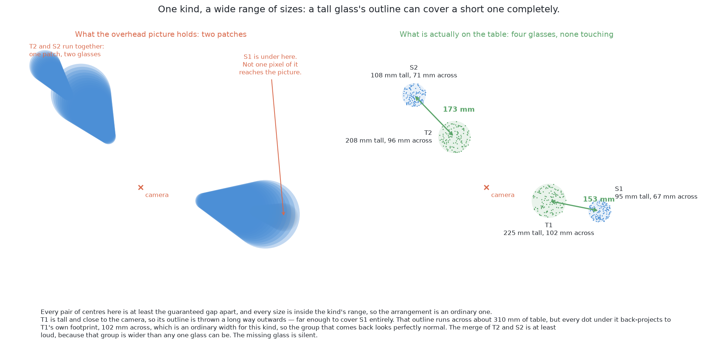

On the left, two silhouettes touch, so the flood fill returns one patch. On the
right, the same two objects on the table, with 102 mm of empty table between
their footprints. The projection did not move them closer together. It threw
away the one thing that would have kept them apart: which pixels were near the
camera and which were far.

A photograph of a tall object is not a photograph of its footprint. An object
205 mm tall, seen from 450 mm up, has its top imaged as though it stood
450 / (450 − 205) = 1.84 times further from the point straight below the camera
than it really is. So a tall object's silhouette reaches outwards and lands on
whatever is standing in that direction, and one blob means one glass to
everything downstream. The same splay pushes every position the survey reports
too far out, which is why the current code takes two pictures per station and
solves for the error rather than measuring it.

The fix is not a better flood fill. It is to stop grouping in the picture.

## Where it comes from

This is the standard recipe for a robot arm working over a table, and has been
for about twenty years. Robotics-basics writes it up as
[point clouds: remove the plane, then cluster](https://github.com/RobinNagpal/robotics-basics/blob/main/docs/06_object-perception/03_programmed-methods.md#16-point-clouds-remove-the-plane-then-cluster):
take the depth picture as a cloud of points, find the largest flat surface and
delete it — that is the table — and group whatever is left into clumps. Each
clump is an object.

It became the default because of what it does *not* need. No training data, no
model file, no idea what the objects are. It works on an object the robot has
never seen, and it gives positions in metres directly, which is what the arm
needs anyway. It was built into the Point Cloud Library —
[pointclouds.org](https://pointclouds.org/), BSD 3-Clause — as
`pcl::EuclideanClusterExtraction`, and that implementation is why so much
tabletop code from the 2010s looks the same.

Three older ideas sit underneath it, and each is worth a sentence.

**The pinhole camera model** says a camera turns a direction in the room into a
position in a picture by dividing by distance. Run it backwards and a position
in a picture gives you a direction. It is the arithmetic of the next section,
and it is the foundation of everything here. The standard reference is Hartley
and Zisserman's *Multiple View Geometry in Computer Vision*.

**RANSAC** — random sample consensus, from Fischler and Bolles, 1981 — is how
the plane is usually found: pick three points at random, make the plane through
them, count how many other points lie on it, keep the best plane after a few
hundred tries. This cell does not need it, for a reason given below.

**Density clustering.** Grouping points by how close they are to each other,
rather than by fitting a shape to them, was set out for databases as DBSCAN by
Ester, Kriegel, Sander and Xu in 1996. Euclidean cluster extraction is the
simplest member of that family: DBSCAN with the "how many neighbours count as
dense" parameter set to one, which leaves a single parameter behind.

## How it works, end to end

### The setup

The table top is at 750 mm and every height in this project is measured from it
(`table/layout.py`). The arm is bolted to the same frame at the near edge and
reaches out along +x, so "where the table is" is a constant rather than
something to be found. The glasses stand in a zone 320 mm by 360 mm —
`GLASS_ZONE = (0.32, 0.64, −0.44, −0.08)`. Four to six of them, all one kind,
upright, opaque, at least 150 mm apart centre to centre. The rack stands across
the table, far enough away that a survey picture of the glasses does not have it
in the back.

The camera is on the wrist, 85 mm to one side of the tool centre and 15 mm above
it (`CAMERA_OFFSET` in `arm/dimensions.py`), so pointing the tool at something is
not the same as pointing the camera at it. Every step below uses the camera's
own measured pose, not the pose the arm was sent to.

**Known before the run:** the table top's height, the camera's lens parameters,
which kind of glass is on the table, the range that kind's widest section may
take, and the grouping distance. **Not known:** how many glasses there are,
where they stand, how tall they are, or how wide.

### The pictures

Every picture in this solution is a survey picture: the wrist camera 450 mm
above the table top (`SURVEY_HEIGHT`), looking straight down. That height is
chosen twice over — it clears the tallest glass the cell handles, 230 mm, with
room for the arm above it, and it is high enough to cover the zone in a handful
of pictures rather than a dozen.

At 450 mm the lens — 320 by 240 pixels over a 60 degree horizontal field — covers

    450 × 320 / 277.1 = 520 mm across   and   450 × 240 / 277.1 = 390 mm down

of table, so **one pixel is 1.6 mm** there.

`survey_stations()` in `arm/dimensions.py` spreads the stations over the zone
from that footprint, with `SURVEY_OVERLAP` = 35 per cent, so that nothing lands
only on an edge of one picture. The part of the footprint both pictures of a
pair share is smaller than the footprint: the sideways slide costs the baseline
off one axis, and the widest opening the gripper has costs 95 mm off both,
leaving 425 by 175 mm. Against a zone 320 by 360 mm that comes out as **one
column of three stations, 92.5 mm apart** along y.

Each station takes **two pictures 120 mm apart** (`SURVEY_BASELINE`), sliding
sideways between them. That pair exists because the current method has to work
out each glass's height from how far it appears to shift — see
`where_they_stand()`. This method does not need the pair for that, because depth
gives the height outright. It keeps the pair anyway, because two views of the
same footprint from 120 mm apart are what the agreement rule at the end is built
on. Six pictures in all.

### What each picture captures

The camera hands over four things, at the moment of capture:

- **Colour**, 320 by 240 by 3. Used for the report's pictures, not for the
  method.
- **Depth**, 320 by 240, one distance per pixel in metres. It is measured along
  the lens axis, not along the slanted ray, which matters to the arithmetic
  below. A pixel the sensor got no distance for is dropped, because a pixel with
  no distance cannot be placed anywhere.
- **The lens parameters**, from `CameraInfo`: fx = fy = 277.1 pixels and
  cx = 160, cy = 120. The focal length is not a length in millimetres but a
  conversion factor, and it comes straight from the field of view —
  160 / tan(30°) = 277.1 for a camera 320 pixels wide covering 60 degrees.
- **The pose**, a 4 by 4 matrix taking the camera's own frame to the arm's,
  read from tf2 for the optical frame.

From those, `standing_on_the_table()` in `glasses/detect.py` builds **the mask**:
the pixels whose points sit more than 5 mm above the table top
(`STANDING_CLEARANCE` — below that is noise on the table itself) and less than
260 mm above it (`TALLEST_GLASS`). Everything the mask keeps is standing on the
table.

### What is interpreted, and how

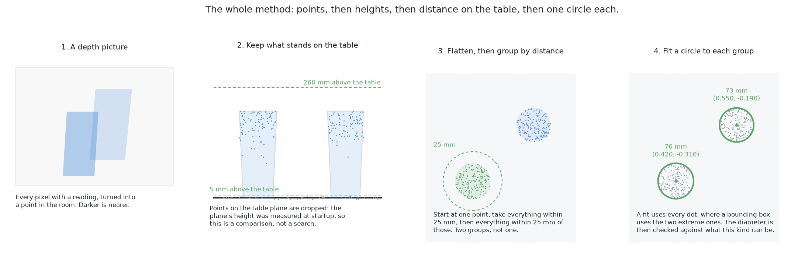

The four panels are the pipeline: the depth picture, the points that stand above
the table, the flattened dots grouped at 25 mm, and one circle per group. Six
operations get from one to the other.

How much data that is: the zone is 320 mm by 360 mm and one pixel covers 1.6 mm,
so the zone fills about 200 by 225 pixels — around 45 000 of the picture's
76 800. Five glasses with their silhouettes take up a quarter to a third of that,
so a picture yields of the order of **ten thousand points** above the table.

**1. Threshold** — the mask above. The standard recipe spends RANSAC here,
hunting for the largest plane; here the plane is a constant and the test is a
comparison. That is a saving worth knowing about rather than copying blindly: if
the table were moved or the arm remounted, the constant would be wrong in a way
that RANSAC would not be.

**2. Back-projection** — every masked pixel becomes a point in the room.

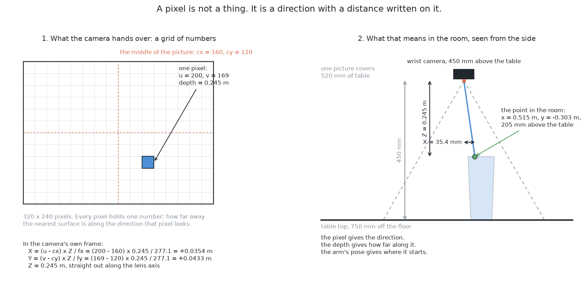

On the left, what the camera actually hands over; on the right, what one of
those numbers means in the room. Follow the blue line: it starts at the camera,
passes through the highlighted pixel, and stops where the depth says the surface
is. A pixel on its own is not a thing — it is a direction with a distance
written on it. For a pixel at column u and row v with depth Z:

    X = (u − cx) × Z / fx
    Y = (v − cy) × Z / fy
    Z = Z

X, Y and Z are in the camera's own frame: X to the right of the lens axis, Y
down, Z out along it. One 4 by 4 multiply by the pose turns them into three
numbers in the arm's frame, which is the frame everything else in this project
speaks. Doing that for every masked pixel gives a **point cloud**: a list of
positions, with no grid and no neighbours.

**3. Flatten** — drop the height. A point at (x, y, z) becomes a dot at (x, y).

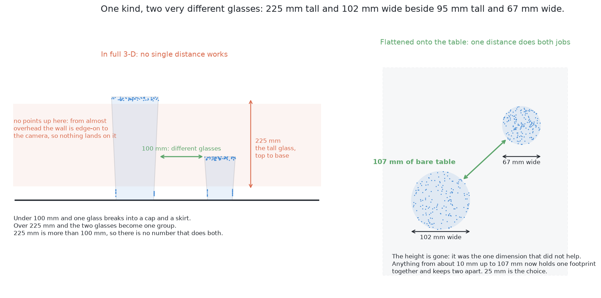

On the left, two objects as points in full 3-D. Notice the shaded band: there
are points on the tops and a few near the bases and almost nothing in between,
because a camera looking nearly straight down sees a vertical wall edge-on. On
the right, the same points flattened.

The numbers are what make the case. In 3-D, the top of one object and the base
of the same object are 205 mm apart with a hole between them, while the nearest
points of two *different* objects are 102 mm apart. No single grouping distance
works: under 102 mm splits one object into a cap and a skirt, over 205 mm joins
the two objects. 205 is more than 102, and no number lives in an empty window.
Flattened, the same object is a disc 76 mm across and the gap to its neighbour is
still 102 mm — a wide window, and any sensible number sits in it. **Height is the
dimension that varies most and discriminates least.**

One caveat. The flattened disc is not the object's base. It is the outline of
its **widest horizontal section**, because that is what hides everything under it
from a camera looking down. For a tumbler the rim and the base are nearly the
same width and it does not matter; for a glass with a bowl wider than its foot
the disc is the bowl. Problem 2 asks for a *rough width*, and the widest section
is the honest answer to that. The exact profile is problem 1's side-on
measurement.

**4. Cluster by distance.** The rule is one sentence:

> Start from a dot nobody has visited. Take every dot within *d* of it. Take
> every dot within *d* of those. Keep going until nothing new is added. That
> clump is one object. Then start again from a dot that has not been used.

That is **Euclidean cluster extraction**. The only parameter is *d*. Nothing else
is chosen: not the number of groups, not their size, not their shape — and that
matters, because a method told to find five groups cannot report that there were
four or six, which is the whole point of problem 2. The rule is also
**transitive**: if A joins B and B joins C, all three are one group even if A and
C are 300 mm apart. That is what keeps a long thin scatter together, and it is
why a single stray dot in a gap can bridge two objects.

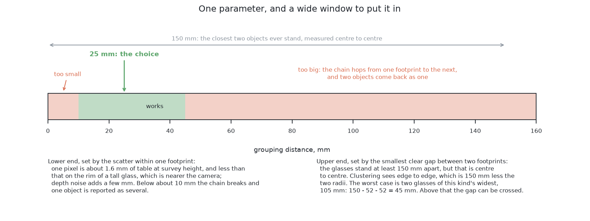

The shaded ends are the two ways of getting it wrong and the band between them is
everything that works. Note where 150 mm sits: it is centre-to-centre spacing,
not the gap.

*The lower end* is the largest gap between neighbouring dots on one object's own
footprint. On the table top the dots are 1.6 mm apart; on the top of a 205 mm
object the camera is 245 mm away rather than 450, so 1.6 × 245 / 450 ≈ 0.9 mm;
on a wall seen at a slant the spacing stretches by roughly one over the cosine of
the angle, but stays within a few millimetres. Below about **10 mm** the chain
starts breaking and one object comes back as several.

*The upper end* is the smallest clear gap between two different objects'
footprints. They stand 150 mm apart centre to centre, and clustering sees edge to
edge, so the gap is 150 mm minus the two radii: for the widest glasses of this
kind, 90 mm across, 150 − 45 − 45 = **60 mm**. Above that the chain can hop.

So the window is about 10 mm to 60 mm, and **25 mm** is the choice — comfortably
above the noise, comfortably below the smallest real gap, and low in the window
on purpose, because a split object announces itself and a merged pair does not.

The naive way to run the rule compares every dot with every other. Ten thousand
dots is a hundred million comparisons, hopeless in Python. Binning the dots into
squares of side *d* first fixes it: two dots within *d* must be in the same bin or
one of the eight touching it, so each dot is compared with a handful. The same
trick under a different name is a k-d tree, which is what `scipy.spatial.cKDTree`
builds.

**5. Fit a circle, and check it.** A glass seen from above is a circle, so each
group is a filled disc and fitting a circle gives a middle and a diameter. The
awkward form (x − a)² + (y − b)² = r² is not linear in a, b and r, but multiplied
out,

    x² + y² = 2a·x + 2b·y + (r² − a² − b²)

is linear in the three unknowns 2a, 2b and (r² − a² − b²). So it is ordinary
least squares — one call to `numpy.linalg.lstsq` — with the radius recovered at
the end. No iteration, no starting guess. A fit beats the bounding box the
current code uses because it uses every dot; a bounding box uses two, the extreme
ones, which are exactly the dots most likely to be noise.

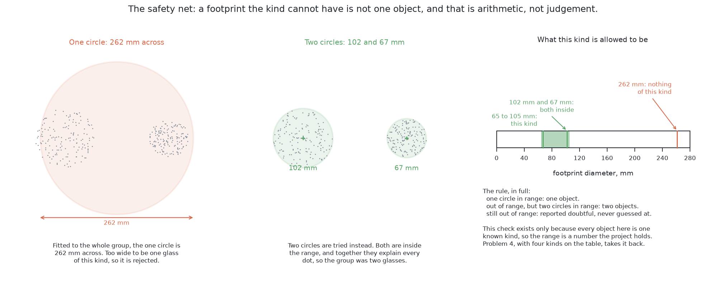

Left: one circle fitted to the whole group comes out at 260 mm, which nothing of
this kind can be, so it is rejected. Middle: two circles are tried instead, at 76
and 73 mm. Right: the ruler both are measured against — the kind's own range,
which across the four kinds the cell handles is 45 to 105 mm and within a single
kind much narrower, 60 to 90 mm for the kind used in the examples here. Four
outcomes:

- **One circle, diameter in range** — one object. Take it.
- **Out of range** — not one object of this kind. Try two circles.
- **Two circles, both in range, together explaining all the dots** — two
  objects. Report both.
- **Still out of range** — report the group as doubtful, with its measured width
  and the range it failed, and do not guess.

Splitting the group means k-means with k = 2: drop two seeds, assign each dot to
the nearer, move each seed to the middle of what it was given, repeat until
nothing moves. Then fit a circle to each half. A millisecond on a few hundred
dots, and no model. What makes the check worth having is that it is
**arithmetic, not judgement** — "too wide to be one glass" is a sentence with two
numbers in it, both known before the run starts, and the report can print them.

**6. Agree across stations.** The survey already visits several stations and
merges what they saw, so this costs nothing.

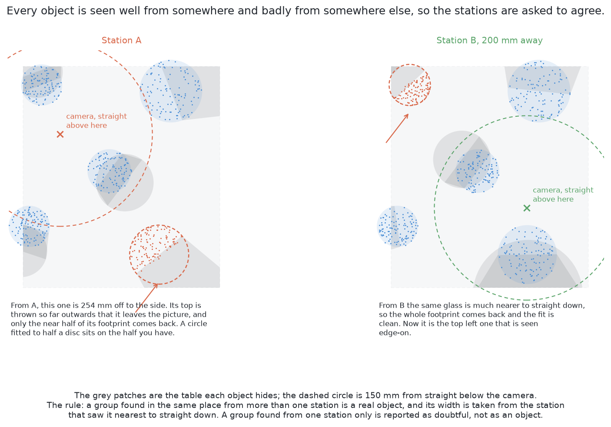

The grey patches are the table each object hides from that station. In the left
panel one object sits 254 mm off to the side, so its top is thrown outwards past
the edge of the frame and only the near half of its footprint comes back; in the
right panel that same object is nearly straight below the camera and its
footprint is complete, while a different one is now the awkward one. Three rules
fall out:

1. A group found in about the same place from more than one station is a real
   object.
2. Its width is taken from the station that saw it nearest to straight down,
   because that is the station whose view of its footprint is least bitten into.
3. A group found from one station only is **reported as doubtful**, not as an
   object. It may well be real. It has been seen once.

### What comes out

For each glass, three things and a flag:

- **the pixels** — which pixels of which picture, carried back from the group's
  dots to the mask they came from;
- **a position** — x and y in metres from the arm's base, on the table top;
- **a rough width** — the fitted diameter, in metres, which the report prints in
  millimetres;
- **doubt, if any** — one of four named flags, each with the number that raised
  it.

They come out as the same `Detection` records the survey already produces, so
the receivers are unchanged: `task.py`'s step 2 drives the camera to
`MEASURE_STANDOFF` for the side-on measurement of each glass, the run report
prints the positions and widths, and any pair that could not be separated is the
handover to [problem 3](../../problem-3/problem.md).

**What it costs.** Back-projection is arithmetic the project already does. The
rest is a comparison, a column drop, a binned flood fill and a least-squares
solve — about **25 lines of NumPy**. Timings on this machine are uncertain until
measured, but the shape of the answer is not: milliseconds to tens of
milliseconds, against seconds for every centimetre the arm moves. Computation is
not the thing to economise on here.

## The sequence

The normal path: three stations, two pictures each, and one entry per glass at
the end.

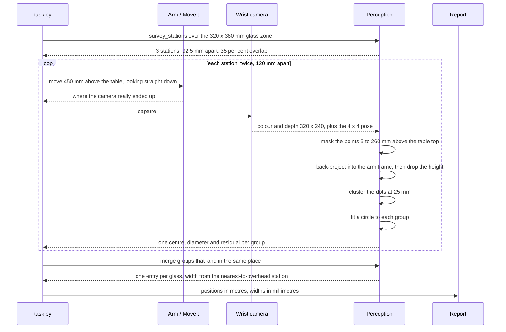

The interesting path: what happens when a fitted circle is too wide to be one
glass of this kind. There is no feedback loop here, so this ends in a split or in
an abstention.

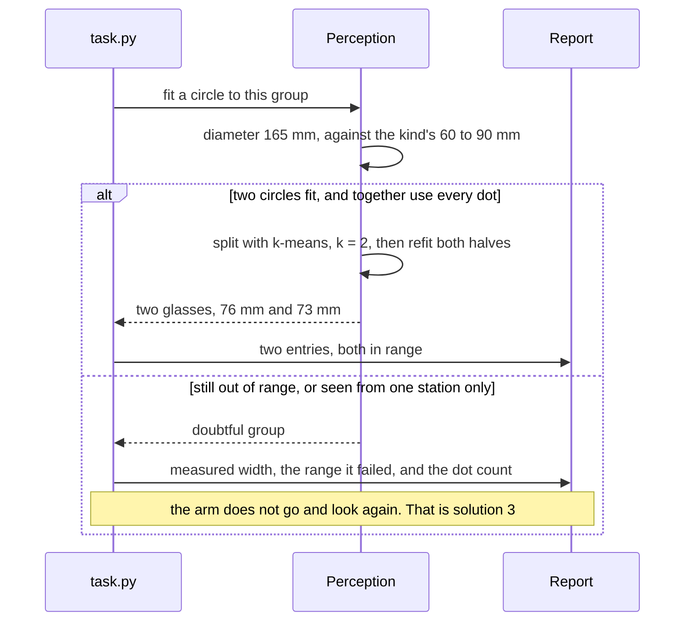

## In pseudocode

Most of this pipeline already exists. The coloured boxes say which parts.

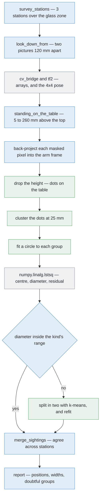

**Legend.** Green — new code written for this solution. Blue — code the project
already has. Grey — a third-party library.

Four green boxes out of thirteen, and they are the whole of the new work:

```text
stations = survey_stations(GLASS_ZONE, footprint)        # have  · work_cell.arm.dimensions
for station in stations:                                 # have  · work_cell.task
    for eye in station.pair(SURVEY_BASELINE):            # have  · work_cell.task
        view = arm.look_down_from(eye, SURVEY_HEIGHT)    # have  · work_cell.task
        mask = standing_on_the_table(view.depth, pose)   # have  · work_cell.glasses.detect
        points = backproject(view.depth, mask, pose, K)  # have  · work_cell.glasses.perception

        # ---- the new work starts here: three functions, ~25 lines ----
        flat = points[:, :2]                             # NEW   · numpy, 1 line
        groups = cluster_by_distance(flat, 0.025)        # NEW   · ~15 lines, numpy only
        for group in groups:
            centre, width, rms = fit_circle(group)       # NEW   · ~8 lines, numpy.linalg.lstsq
            if kind.accepts(width):                      # have  · work_cell.glasses.spec
                seen.append(sighting(centre, width))     # have  · work_cell.glasses.detect
                continue
            a, b = split_in_two(group)                   # NEW   · ~4 lines, k-means, numpy
            if kind.accepts_both(a, b) and no_dots_left: # have  · work_cell.glasses.spec
                seen += [sighting(*fit_circle(a)),
                         sighting(*fit_circle(b))]
            else:
                report.doubtful(group, width)            # have  · work_cell.report

glasses = merge_sightings(seen)                          # have  · work_cell.glasses.detect
for glass in glasses:                                    # have  · work_cell.task
    if glass.stations == 1:                              # NEW   · one extra field
        report.doubtful(glass, "seen once")              # have  · work_cell.report
```

`cluster_by_distance`, `fit_circle` and `split_in_two` are the 25 lines. Two
existing files gain a little: `glasses/spec.py` gains the kind's width range —
which is a limit, not a glass's size, so it belongs there — and `Detection` gains
a count of how many stations saw it.

The libraries this needs:

| Library | What it is used for here | Licence | In the pixi environment? |
| --- | --- | --- | --- |
| [NumPy](https://numpy.org/) | the back-projection, the bin grid, the least-squares circle fit, the k-means split | BSD 3-Clause | **yes** |
| [ROS 2 Jazzy](https://docs.ros.org/) | `sensor_msgs/Image` and `cv_bridge` to get the depth picture into an array; tf2 for the camera pose | Apache 2.0 | **yes** |
| [OpenCV](https://opencv.org/) | nothing in this method — it is where the existing mask code lives | Apache 2.0 | **yes**, as `py-opencv` |
| [SciPy](https://scipy.org/) | optional. `spatial.cKDTree` in place of a hand-rolled bin grid, if the timing ever asks for it | BSD 3-Clause | **no** — a one-line addition to `pixi.toml` |
| [scikit-learn](https://scikit-learn.org/) | optional. `cluster.DBSCAN` does the same grouping with a different parameter set | BSD 3-Clause | **no** |
| [Point Cloud Library](https://pointclouds.org/) | the reference implementation, `pcl::EuclideanClusterExtraction`. Read, not used | BSD 3-Clause | **no**, and it is not a Python dependency |

Neither optional entry is needed. The algorithm is a flood fill over a bin grid,
and writing it directly keeps the dependency list short and the debugging simple.

## A worked example

Five glasses of one kind, each about 205 mm tall, footprints between 60 and
90 mm. Their true positions, in metres from the arm's base:

| | x | y | width |
| --- | --- | --- | --- |
| G1 | 0.533 | −0.320 | 85 mm |
| G2 | 0.636 | −0.436 | 68 mm |
| G3 | 0.360 | −0.120 | 76 mm |
| G4 | 0.580 | −0.140 | 73 mm |
| G5 | 0.360 | −0.330 | 81 mm |

The closest pair is G1 and G2, 155 mm apart, which satisfies the cell's 150 mm
rule with 5 mm to spare. Station A puts the camera 450 mm above the table,
straight above (0.48, −0.26), which is the middle of the zone. Its picture
covers 520 by 390 mm, so the whole zone is in frame.

### One pixel

Take the pixel at column 200, row 169, whose depth reads 0.245 m.

    X = (200 − 160) × 0.245 / 277.1 = +0.0354 m
    Y = (169 − 120) × 0.245 / 277.1 = +0.0433 m
    Z =  0.245 m

The ray to that point is √(0.0354² + 0.0433² + 0.245²) = 0.2513 m long, about
2.5% longer than the depth reading — which is the difference between "along the
lens axis" and "along the ray", and the reason the two sideways terms are
needed rather than the distance alone.

The camera looks straight down and its picture is lined up with the table, so
moving right in the picture is +x and moving down the picture is −y. The pose
turns those three numbers into a point at

    x = 0.480 + 0.0354 = 0.515      y = −0.260 − 0.0433 = −0.303

standing 450 − 245 = 205 mm above the table top. That is a point on the top of
G1, 25 mm in from its centre. One pixel down, 76 799 to go.

### What grouping in the picture returns

G1 stands 80 mm from the point straight below the camera, in the direction of
the zone's far corner. Its rim, 205 mm up, is imaged as though it stood 1.84
times further out — and so is its radius. Its silhouette therefore reaches
1.84 × (80 + 42.5) = 225 mm out from the point below the camera.

G2 stands 235 mm out in the same direction. Its own near edge is at
235 − 34 = 201 mm. Since 225 is more than 201, **the two silhouettes overlap**,
and the flood fill returns them as one patch: four blobs for five glasses.

The merged blob runs from G1's near edge at 80 − 42.5 = 37 mm out to the corner
of the frame at 325 mm. That is about 180 pixels; at the table's scale of
1.6 mm per pixel, roughly 290 mm. No glass of this kind is wider than 90 mm, so
the picture can tell that something is wrong. It cannot tell what, because the
thing that would separate them — which pixels were near and which were far —
went out of the picture when the picture was taken.

### What grouping on the table returns

G1 and G2 are 155 mm apart, centre to centre. Take off their two radii, 42.5
and 34, and there is **78 mm of clear table** between their footprints. At a
25 mm grouping distance the chain cannot cross 78 mm of nothing, so they are
two groups. Every other pair is further apart than that, so five groups come
out of one picture:

| | fitted diameter | true width | in range 60–90? | dots |
| --- | --- | --- | --- | --- |
| G1 | 84 mm | 85 mm | yes | full footprint |
| G2 | 69 mm | 68 mm | yes | **partial** — its top is out of frame |
| G3 | 76 mm | 76 mm | yes | full footprint |
| G4 | 74 mm | 73 mm | yes | full footprint |
| G5 | 81 mm | 81 mm | yes | full footprint |

The fits land within a millimetre or two of the truth, which is what using every
dot rather than the two extreme ones buys.

G2 needs the footnote. It stands 235 mm from the point below the camera, so its
imaged top would sit 1.84 × 235 = 432 mm out — past the corner of the frame at
325 mm. Part of it is simply not in the picture, its group is short of dots, and
its fitted circle is pulled towards the part that is present. The value is
plausible and it is not trusted.

The other stations do not rescue it. They sit 92.5 mm along y from station A, and
the nearest of them puts G2 158 mm from the point below the camera instead of
235 — better, but its top is still imaged 1.84 × 158 = 291 mm out, past the
260 mm the frame reaches sideways. G2 stands in the far corner of the zone and it
is the glass this survey sees worst. Its width keeps the partial-footprint flag,
and that flag is the answer problem 2 asks for: a number, and a statement that
the number has not been checked.

**Result:** five glasses, five positions, five widths, no merges, and one width
flagged as measured from a partial footprint — from pictures in which the old
method saw four objects.

### Now the awkward case

This one the problem's scene generator will not produce, because it keeps
glasses 150 mm apart. The method still has to behave sensibly in it, because
problem 3 is about exactly this.

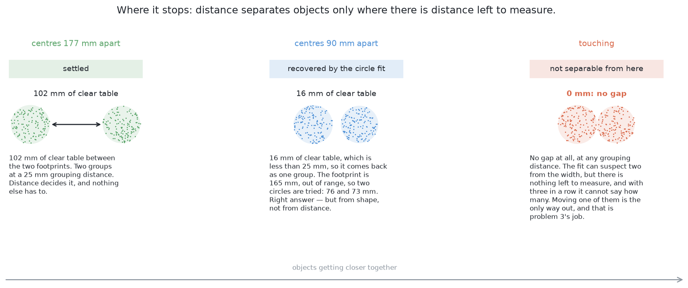

Three scenes, in order of difficulty. The first is the case above. The second
is recoverable, but not by distance. The third is not recoverable at all.

Two glasses 76 and 73 mm wide standing 90 mm apart have
90 − 38 − 36.5 = 15.5 mm of clear table between them. That is less than 25 mm,
so the chain crosses and they come back as one group. The circle fitted to that
group is 165 mm across, well outside 60 to 90, so the group is split and two
circles are tried: 76 mm and 73 mm, both in range, and together they account
for every dot. Two glasses — and a pair standing this close is precisely what
problem 3 exists to move apart.

Two glasses actually touching have no gap at any grouping distance. One group,
always. The fit can suspect two from the width, but there is nothing left to
measure and no distance reasoning left to do. With three in a row it cannot even
say how many. That case is the handover.

## The feedback loop

**This solution does not have one, and that is a deliberate limitation rather
than an oversight.**

A feedback loop, in the sense the other solutions in this folder use the term,
needs three things: a measure of doubt, a set of actions that might reduce it,
and a budget to stop it running forever. Cluster-on-the-table has the first and
none of the others. It runs on whatever pictures the survey gave it and produces
an answer. If a glass was seen badly it stays seen badly.

What it does produce is good doubt, in four named forms, each a number rather
than a feeling:

- a group whose fitted diameter is outside the kind's range;
- a group whose two-circle split also failed the range;
- a group found from one station only;
- a group with fewer dots than an object of that size should give, which usually
  means most of it was hidden.

Those four flags are exactly the input that [move the camera](solution-overview.md#solution-3--move-the-camera)
consumes: that solution's whole job is to take a doubtful group, work out where
the camera would have to stand for it to become clear, check that the arm can
get there, go and look, and run the clustering again on the better picture.
[Learned doubt steers the next picture](solution-overview.md#solution-4--learned-doubt-steers-the-next-picture)
and [learn which viewpoints pay off](solution-overview.md#solution-6--learn-which-viewpoints-pay-off)
are richer versions of the same loop, and
[a learned verifier over the clusters](solution-overview.md#solution-5--a-learned-verifier-over-the-clusters)
adds a fifth flag by looking at each group and saying whether it looks like one
object or two.

The cost of having no loop: a pair that merges from every station the survey
happens to visit is reported as one wide object with a "width out of range" flag
and nothing more. That is not a wrong answer — it is flagged — but it is an
incomplete one, and closing that gap is what the arm has to move for.

## What it needs

**Data.** None. No training set, no labels, no weights, no model file, no licence
question about what a model was trained on.

**Hardware.** The depth camera the cell already has, and the CPU. No graphics
card. It runs unchanged on an Apple Silicon Mac.

**Numbers it needs to be told.** Three already exist in the project: the table
top's height, from `table/layout.py`; the camera's lens parameters, from the
camera description; and the kind's width range, which belongs in
`glasses/spec.py` with the other limits. The grouping distance, 25 mm, is new and
belongs with the perception code that uses it.

**Time.** Around 25 lines of new code, plus the tests. There is no training step,
so there is no day of waiting to find out whether it worked.

## Where it is strong and where it breaks

**Strong**

- No training data, no model file, no graphics card. It groups points that are
  close together, so it works on an object nobody has described.
- Exact and repeatable; every step prints a number: points kept, groups,
  dots per group, diameter, residual. One always goes wrong first.
- The range check is arithmetic, not judgement: the kind's own limits, not a
  tuned threshold.
- It answers in metres from the arm's base, and gets three gifts here: a known
  table height, upright glasses that flatten to discs, one known kind.

**Breaks**

- Touching glasses have no gap to find. That is the real limit, and
  [problem 3](../../problem-3/problem.md) exists to remove it.
- Two glasses one behind the other at the same distance stay one group; only
  the fitted width notices.
- Four kinds widen the range to 45–105 mm and weaken the check in proportion —
  problem 4.
- It assumes a round footprint; the fit's residual would notice a jug.
- It needs depth. Real glassware returns none; the cell is fine only because the
  simulator renders glasses opaque.
- 25 mm is justified rather than tuned, but still assumes things stand apart.
- One stray dot bridges two groups; a table 3 mm too low bridges everything into
  one. Guards: a minimum dot count and DBSCAN's minimum-neighbours rule.
- Points above 260 mm are dropped in silence. The tallest glass is 230 mm, so
  nothing in specification is cut; report the counts dropped at each end.

## The general methods behind this

This is the standard table-top perception recipe, and every part of it is
generic. It is worth seeing the pieces separately, because three of the four
appear in almost every robot that looks at objects on a surface.

### The pinhole camera model — turning a pixel and a depth into a point

A pixel plus a depth reading plus the camera's pose is a point in the room: the
pixel gives a direction, the depth says how far along it to travel, the pose
says where the ray starts. Reversing the projection this way is
*back-projection*, and it is the bridge between everything measured in pixels
and everything the arm does in millimetres.

- **Mostly used for** anything with a depth camera: building point clouds,
  turning a detection into a grasp pose, registering scans.
- **Rarely right for** surfaces the depth sensor reads badly — glass, polished
  metal, black plastic, anything specular or transparent — where the depth is
  missing or wrong and back-projection produces confident nonsense.
- **More:** [pinhole camera model](https://en.wikipedia.org/wiki/Pinhole_camera_model);
  Hartley and Zisserman, [Multiple View Geometry](https://www.robots.ox.ac.uk/~vgg/hzbook/).

### Plane segmentation with RANSAC — finding and deleting the table

Pick three points at random, make the plane through them, count how many other
points lie on it, keep the best after a few hundred tries. **RANSAC** fits a
model to data full of outliers by repeatedly guessing from small samples
(Fischler and Bolles, *CACM*, 1981). Removing the dominant plane is how a
table-top scene becomes "just the objects".

- **Mostly used for** fitting a model when most of the data does not belong to
  it: ground-plane extraction, line and circle fitting, image stitching,
  point-cloud registration.
- **Rarely right for** scenes with no dominant structure, or where the thing you
  want *is* the minority and several competing models fit equally well. It is
  also non-deterministic, which matters if you need the same answer twice.
- **More:** [RANSAC](https://en.wikipedia.org/wiki/Random_sample_consensus);
  [PCL's planar segmentation tutorial](https://pcl.readthedocs.io/projects/tutorials/en/latest/planar_segmentation.html).
  *This cell skips it:* the table is bolted to the arm's frame and measured at
  startup, so the plane is a constant and finding it is a comparison rather than
  a search.

### Euclidean cluster extraction — grouping points by how close they are

Start from a point, take everything within a chosen distance, take everything
within that distance of those, repeat until nothing new joins. One parameter,
and no assumption about what the objects are. Its density-aware cousin is
**DBSCAN**, which adds a minimum-neighbours rule so that sparse noise does not
form clusters of its own (Ester et al., KDD 1996).

- **Mostly used for** table-top and bin picking, where objects are separated in
  space and nobody wants to say in advance what they look like. It is the
  default first thing to try on any depth image of a scene.
- **Rarely right for** objects that genuinely touch — distance separates only
  where there is distance — and for scenes where the right grouping distance
  differs across the image, since a single threshold has to serve everywhere.
- **More:** [PCL's cluster extraction tutorial](https://pcl.readthedocs.io/projects/tutorials/en/latest/cluster_extraction.html);
  [DBSCAN](https://en.wikipedia.org/wiki/DBSCAN) and
  [`sklearn.cluster.DBSCAN`](https://scikit-learn.org/stable/modules/generated/sklearn.cluster.DBSCAN.html);
  [cluster analysis](https://en.wikipedia.org/wiki/Cluster_analysis) for the
  wider family.

### Least-squares shape fitting — turning a cloud of dots into a number

Fit a circle to a set of points by minimising an algebraic error, which has a
closed-form solution and costs no iteration. A fit uses every point rather than
the two extreme ones, so it is far less sensitive to a single stray dot than a
bounding box, and its **residual** is a free measure of how well the shape
actually explains the data.

- **Mostly used for** measuring manufactured parts, which are mostly made of
  circles, lines and planes — metrology, inspection, and any case where the
  object's geometry is known in advance.
- **Rarely right for** shapes the model does not describe, where it returns a
  confident number with a large residual nobody checks. The residual is the
  guard, and ignoring it is the classic mistake.
- **More:** [circular segment](https://en.wikipedia.org/wiki/Circular_segment)
  for the geometry; Kåsa's algebraic fit and the Pratt and Taubin refinements
  are the standard three.

## Where it sits

It stands on problem 1's work: the pixel-to-point arithmetic and the measured
table height are already there, and this solution is the steps that come after
them. It replaces [split the blob in the picture](solution-overview.md#solution-1--split-the-blob-in-the-picture),
which attacks the same merges with a cut through the mask and so treats the
symptom of a projection that has already lost the information. It hands its doubt
to [move the camera](solution-overview.md#solution-3--move-the-camera), which is
the loop this solution has not got, and its groups are the input that
[a learned verifier over the clusters](solution-overview.md#solution-5--a-learned-verifier-over-the-clusters)
would check. Where it stops — two glasses touching — is where
[problem 3](../../problem-3/problem.md) starts.
