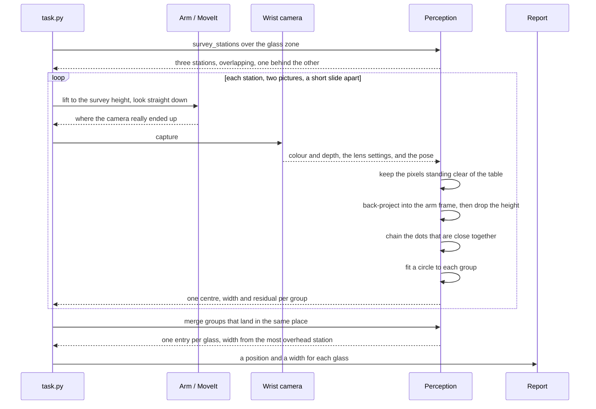
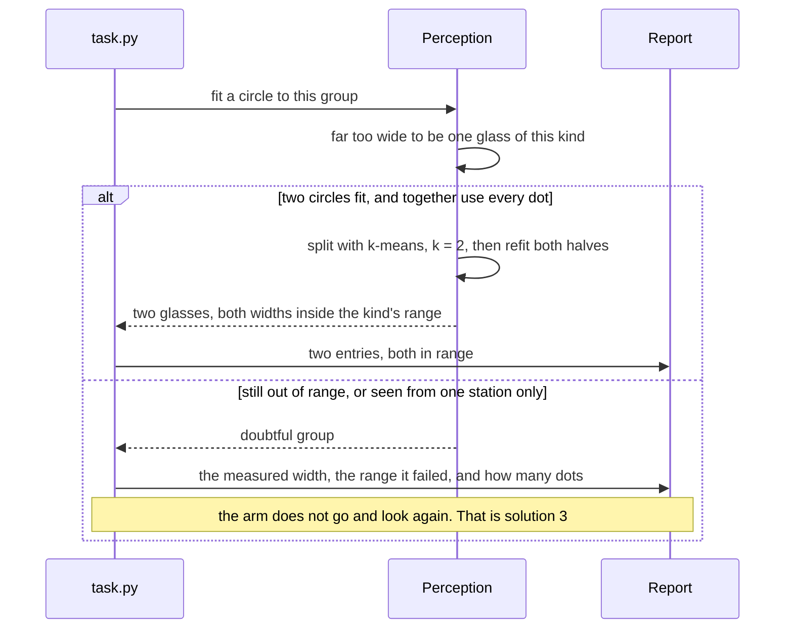
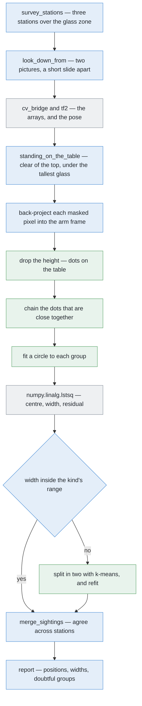

# Solution 2 — cluster on the table

*Programmed. Stop deciding which pixels belong together by looking at the
picture. Decide it by looking at where they are in the room.*

> **The cell is described once, in [the cell](../../the-cell.md)** — the layout,
> the two places the camera works from, from the top and from the side, all four
> sensors, and the words this project uses them with. What follows is only what
> is specific to this solution.

## In one paragraph

A depth camera gives a distance for every pixel. That is enough to turn each
pixel into a point in the room: the pixel tells you the direction, the depth
tells you how far along that direction to go, and the camera's pose tells you
where the direction starts. Once the pixels are points, the question "which
glass is this?" stops being about the picture and becomes about distance on the
table. So we flatten the points down onto the table, group the ones that are
close together, fit a circle to each group, and check that circle against the
sizes this kind of glass can be. Two glasses that touch each other in a
photograph are still standing well apart on the table, and on the table is where
we do the deciding.

## The problem this solves

Four to six drinking glasses stand on a table. They are all the same kind, we
know which kind, they are solid and upright, and they stand well apart from each
other inside a patch of table that is a little wider than it is deep — the glass
zone. The camera sits on the arm's wrist, and here it works **from the top**:
the arm lifts it high above the table, well clear of the tallest glass, and
points it straight down. The job is to say **which pixels belong to which
glass**, where each glass is, and roughly how wide it is. And to say honestly
which glasses could not be told apart.

"Well apart" has a definite meaning in this cell. Problem 2 promises a smallest
gap between the centres of any two glasses, and that gap is wider than any glass
of any kind the cell handles. So no two glasses can ever be touching, and there
is always a strip of bare table between them. The whole of this solution rests
on that strip.

The method the project already has for one glass does not survive several. It
takes the pixels that sit above the table top and runs a **flood fill**: pick a
pixel nobody has visited, spread out to every neighbouring pixel that is also
above the table, and call that patch one object. With one glass on an empty
table that is enough. With five it is not.


On the left, two outlines touch, so the flood fill returns one patch. On the
right, the same two glasses on the table, with a clear strip of bare table
between them. The camera did not move them closer together. It threw away the
one thing that would have kept them apart: which pixels were near the camera and
which were far.

Why does this happen? Because a photograph of a tall object is not a photograph
of its base. The camera is looking from the top, so the table is the furthest
thing from the lens and a glass's rim is the nearest — the rim has climbed most
of the way from the table towards the camera. Nearer things look bigger and land
further out from the middle of the picture. So the rim of a glass is drawn as
though the glass stood further out from the point directly below the camera than
it really does, and the taller the glass, the further out it is thrown. We call
this **splay**, and [the cell](../../the-cell.md) explains it in full. A tall
glass's outline leans outwards, away from the camera, and it can land on top of
whatever is standing in that direction.

One point worth being exact about, because it is easy to get wrong. Splay does
**not** merge two glasses that are both fully inside one picture. We tried this
against every legal arrangement the cell's own scene generator can make —
thousands of them, across all four kinds, every spacing and every angle — and
not one of those pairs merged. What splay does is push a glass's outline
outwards until part of it falls off the edge of the frame, and *that* is when
what is left of it can land on a neighbour. The worked example below is exactly
this case, and it says so.

The fix is not a better flood fill. It is to stop grouping in the picture.

## Where it comes from

This is the standard recipe for a robot arm working over a table, and it has
been for about twenty years. Robotics-basics writes it up as
[point clouds: remove the plane, then cluster](https://github.com/RobinNagpal/robotics-basics/blob/main/docs/06_object-perception/03_programmed-methods.md#16-point-clouds-remove-the-plane-then-cluster):
treat the depth picture as a cloud of points, find the largest flat surface and
delete it — that is the table — and group whatever is left into clumps. Each
clump is one object.

It became the default because of what it does *not* need. No training data, no
model file, no idea what the objects are. It works on an object the robot has
never seen. And it gives positions in metres straight away, which is what the
arm needs anyway. It was built into the Point Cloud Library —
[pointclouds.org](https://pointclouds.org/), BSD 3-Clause — as
`pcl::EuclideanClusterExtraction`, which is why so much tabletop code from the
2010s looks the same.

Three older ideas sit underneath it.

**The pinhole camera model.** A camera turns a direction in the room into a
position in a picture, by dividing by distance. Run that backwards and a
position in a picture gives you a direction. That is the arithmetic of the next
section. The standard reference is Hartley and Zisserman's *Multiple View
Geometry in Computer Vision*.

**RANSAC** (random sample consensus, Fischler and Bolles, 1981) is how the table
plane is usually found. Pick three points at random, make the plane through
them, count how many other points lie on it, and keep the best plane after a few
hundred tries. This cell does not need it, for a reason given below.

**Density clustering.** Grouping points by how close they are to each other,
rather than by fitting a shape to them, was written up for databases as DBSCAN
by Ester, Kriegel, Sander and Xu in 1996. Euclidean cluster extraction is the
simplest member of that family. It is DBSCAN with the "how many neighbours count
as dense" setting turned down to one, which leaves just a single number to
choose.

## How it works, end to end

### The setup

The table top's height is written down once, in `table/layout.py`, and every
height in this project is measured up from it. The arm is bolted to the same
frame, at the near edge, and reaches out across the table. So "where the table
is" is a constant the code can look up, not something that has to be found in
the picture. That single fact saves a whole step later on.

The glasses stand inside the **glass zone** (`GLASS_ZONE` in `table/layout.py`)
— a rectangle of table a little wider than it is deep, well within the arm's
reach. Four to six glasses, all one kind, upright, solid, and never closer than
the smallest centre-to-centre gap problem 2 promises. The rack stands across the
table, far enough away that it is never behind a glass when the camera looks
down at the zone.

The camera is bolted to the wrist, a little to one side of the tool centre and a
little above it (`CAMERA_OFFSET` in `arm/dimensions.py`). That offset is small
but it is not nothing: pointing the *tool* at something is not the same as
pointing the *camera* at it. So every step below uses the camera's own measured
pose, read back from the joint angles, and never the pose the arm was told to go
to.

**Known before the run:** the table top's height, the camera's lens settings,
which kind of glass is on the table, the range of widths that kind can be, and
the grouping distance. **Not known:** how many glasses there are, where they
stand, how tall they are, or how wide.

### The pictures

Every picture this solution uses is taken **from the top**. The arm lifts the
camera to the survey height (`SURVEY_HEIGHT` in `arm/dimensions.py`) and turns
it to look straight down at the table. That height was chosen for two reasons.
It clears the tallest glass the cell is allowed to be given, with room for the
wrist above it, so the arm can travel across the zone without knocking anything
over. And it is high enough that one picture covers a useful piece of table, so
the zone can be covered in a handful of pictures rather than dozens.

How much table one picture covers follows from the lens and nothing else. The
camera's picture is a fixed number of pixels wide, and the lens spreads a fixed
angle across them, so the higher the camera goes, the more table each pixel
covers. High above the table like this, each pixel covers a millimetre or two of
table top — coarse compared to a ruler, but fine compared to a glass, which is
tens of pixels across. That ratio is the reason this works at all.

`survey_stations()` in `arm/dimensions.py` spreads the stations out over the
zone, overlapping them (`SURVEY_OVERLAP`) so that nothing ends up only on the
edge of one picture, where the view of it is worst. There is a subtlety here.
The area a *station* can be trusted for is smaller than the area one picture
covers, for two reasons: the camera slides sideways between the station's two
pictures, so only the part both pictures see counts; and the gripper's own
fingers, opened wide, eat into the frame at the edges. What is left after both
of those is a band noticeably shorter front-to-back than the full picture. Held
against the shape of the glass zone, that works out to a single column of
**three stations**, one behind the other, marching away from the arm.

Each station takes **two pictures**, sliding the camera a short way sideways
between them (`SURVEY_BASELINE`). The existing survey needs that pair because it
has no depth to work with, and has to get each glass's height from how far the
glass appears to shift between the two — see `where_they_stand()`. This solution
does not need the pair for that; depth gives it the height directly. It keeps
the pair anyway, because two views of the same patch of table from slightly
different places are exactly what the agreement rule at the end of the method is
built on. Three stations, two pictures each.

### What each picture captures

The camera hands over four things at the moment of capture.

- **A colour picture.** Used for the pictures in the run report, not for the
  method itself.
- **A depth picture**, the same size, with one distance per pixel. Two things
  about it matter later. The distance is measured straight out along the lens
  axis, not along the slanted line from the lens to that particular pixel — so a
  pixel near the corner of the picture is genuinely further away than its depth
  reading says, and the arithmetic below has to account for that. And some
  pixels come back with no distance at all; those are dropped, because a pixel
  with no distance cannot be placed anywhere in the room.
- **The lens settings**, which arrive with the picture in a `CameraInfo`
  message: the focal length, and the pixel the lens axis passes through, which
  is the middle of the picture. The focal length here is not a length in
  millimetres, and reading it that way is a common confusion. It is a conversion
  factor between directions and pixels, and it falls straight out of how wide an
  angle the lens covers and how many pixels it covers it with. A wider lens over
  the same number of pixels gives a smaller focal length.
- **The pose** — where the camera was, and which way it was facing, at the
  moment of the shutter, read from tf2.

From those, `standing_on_the_table()` in `glasses/detect.py` builds **the
mask**. A pixel is kept if the point behind it sits clear of the table top by
more than a small margin (`STANDING_CLEARANCE`, which exists because a depth
reading of the bare table is never exactly the table) and below the height of
the tallest glass the cell accepts (`TALLEST_GLASS`). Everything the mask keeps
is something standing on the table.

### What is interpreted, and how


The four panels are the pipeline: the depth picture, the points that stand above
the table, the flattened dots grouped by how close together they are, and one
circle per group. Six steps get from the first to the last.

First, a sense of how much data this is. Looking down from the survey height,
the glass zone fills most of the picture, and the glasses standing in it take up
something like a quarter to a third of that. So one picture leaves **thousands
of points** above the table — enough that every group has plenty of dots to fit
a circle to, and few enough that a plain loop in Python can handle them. The
exact count is printed in the report, and it is worth watching, because a count
far below normal means most of the zone was hidden or out of frame.

**1. Threshold.** That is the mask above. The standard recipe spends RANSAC
here, hunting for the largest plane. Here the plane is a constant, so the test
is just a comparison. That is a saving worth understanding rather than copying
blindly: if the table were moved or the arm remounted, the constant would be
wrong in a way that RANSAC would not be.

**2. Back-projection.** Every masked pixel becomes a point in the room.


On the left is what the camera actually hands over. On the right is what one of
those numbers means in the room. Follow the blue line: it starts at the camera,
passes through the highlighted pixel, and stops where the depth says the surface
is. A pixel on its own is not a thing. It is a direction with a distance written
on it.

For a pixel at column u and row v with depth Z:

    X = (u − cx) × Z / fx
    Y = (v − cy) × Z / fy
    Z = Z

X, Y and Z are still measured from the camera itself: X to the right of the lens
axis, Y down, Z straight out along it. Multiplying them by the camera's pose
moves them into the arm's frame, which is the one frame everything else in this
project speaks. From here on, a point is a place in the room, not a place in a
picture.

Do that for every masked pixel and you get a **point cloud**: just a list of
positions in the room. No grid, no neighbours, no order.

**3. Flatten.** Throw away the height. A point at (x, y, z) becomes a dot at
(x, y).


On the left, two glasses as points in full 3-D. Notice the shaded band: there
are points on the tops, a few near the bases, and almost nothing in between.
That is because a camera looking down from the top sees the side wall of a glass
edge-on, and an edge-on wall catches almost no pixels. So the cloud is not a
glass. It is a lid with a ring of crumbs under it.

That is fatal if you try to group the points in 3-D, and the reason is worth
following, because it is the heart of this step. In 3-D, the top of a glass and
the base of the **same** glass are separated by the glass's whole height, with a
hole in between where the wall should be. The nearest points of two
**different** glasses are separated by the strip of bare table between them,
which is smaller than a glass is tall. So the gap inside one object is *bigger*
than the gap between two objects, and there is no grouping distance that can
work: any distance small enough to keep the two glasses apart also cuts each
glass into a top and a bottom, and any distance big enough to hold one glass
together also reaches across to its neighbour.

Flatten the height away and the problem disappears. Each glass becomes a small
solid disc, no taller than the paper it is drawn on, and the strip of bare table
between two discs is unchanged — because flattening does not move anything
sideways. Now the gap inside one object is zero and the gap between two objects
is the whole strip. Any sensible grouping distance sits between those, with room
to spare on both sides.

In short: **height is the dimension that varies most and tells you least.**

One caveat. The flattened disc is not the glass's base. It is the outline of its
**widest horizontal slice**, because that is what hides everything underneath it
from a camera looking down. For a tumbler the rim and the base are nearly the
same width and it does not matter. For a wine glass, whose bowl is wider than
its foot, the disc is the bowl. Problem 2 asks for a *rough width*, and the
widest slice is the honest answer to that. The exact shape is what problem 1
gets later, with the camera brought down and round to look at the glass **from
the side**.

**4. Cluster by distance.** The rule is one sentence:

> Start from a dot nobody has visited. Take every dot within *d* of it. Take
> every dot within *d* of those. Keep going until nothing new is added. That
> clump is one glass. Then start again from a dot that has not been used.

That is **Euclidean cluster extraction**. The only setting is *d*. Nothing else
is chosen: not the number of groups, not their size, not their shape. That
matters, because a method that is told to find five groups cannot report that
there were four or six — which is the whole point of problem 2.

The rule also chains: if A joins B and B joins C, then all three are one group,
even if A and C are right across the table from each other. That is what keeps a
long thin scatter together, and it is why the method needs no idea of a group's
size or shape. It is also the rule's one weakness — a single stray dot sitting
in the strip between two glasses is enough to chain them into one group.


So how is *d* chosen? It is pinned between two things, and the useful part is
that both of them are known before the run starts. The shaded ends of the
picture are the two ways of getting it wrong, and the band between them is
everything that works.

*The bottom end is set by how far apart the dots on one glass are.* Neighbouring
pixels land on neighbouring bits of table, so the dots come out in a mesh whose
spacing is roughly what one pixel covers. Two things stretch that mesh. The top
of a glass is nearer the lens than the table is, which actually *tightens* the
mesh there. But a surface seen at a slant — the shoulder of a glass, the outer
curve of a bowl — spreads its dots out, because the same pixel now covers a
longer piece of surface. Choose *d* smaller than the widest stretch in that mesh
and the chain breaks in the middle of a single glass, which comes back as two or
three groups.

*The top end is set by the strip of bare table between two glasses.* Problem 2
promises a smallest gap between centres, and clustering measures edge to edge,
so the worst case is that smallest centre gap with the two widest glasses of
this kind standing in it — take half of each glass off the gap and what is left
is the narrowest strip the method will ever be shown. Choose *d* bigger than
that strip and the chain hops across it, and two glasses come back as one.

The good news is that there is a lot of daylight between those two limits: the
narrowest strip is several times the widest stretch in the mesh. So *d* is not a
knob that has to be tuned. It is a constant sitting in the middle of a wide
window, and the picture above shows how wide.

It is deliberately placed **low** in that window rather than in the exact
middle. The reason is that the two mistakes are not equally bad. A glass split
into two groups announces itself loudly: both halves fail the width check
further down, because half a footprint is far too narrow to be a glass of this
kind. Two glasses merged into one group are much quieter. So we lean towards
splitting.

One practical note on running the rule. The obvious way compares every dot with
every other dot, and with thousands of dots that is millions of comparisons,
which is hopeless in Python. Sorting the dots into square bins whose side is *d*
fixes it: two dots within *d* of each other must be in the same bin or in one of
the eight bins touching it, so each dot is only ever compared with a handful of
others. The same trick, under a grander name, is a k-d tree, which is what
`scipy.spatial.cKDTree` builds.

**5. Fit a circle, and check it.** A glass seen from above is a circle, so each
group is a filled disc. Fitting a circle to it gives a centre and a diameter.

The obvious equation, (x − a)² + (y − b)² = r², is not linear in a, b and r. But
multiply it out:

    x² + y² = 2a·x + 2b·y + (r² − a² − b²)

and it *is* linear in the three unknowns 2a, 2b and (r² − a² − b²). So it is
ordinary least squares — one call to `numpy.linalg.lstsq` — and the radius is
recovered at the end. No iteration, no starting guess.

A fit beats the bounding box the current code uses because it uses every dot. A
bounding box uses two, the extreme ones, which are exactly the dots most likely
to be noise.


Left: one circle fitted to the whole group comes out around three times as wide
as any glass of this kind can be, so it is rejected out of hand. Middle: two
circles are tried instead, and both land inside the range. Right: the ruler they
are measured against, which is the kind's own range of widths and nothing else.

That ruler matters more than it looks. Across all four kinds the cell handles,
the range of possible widths is broad — a narrow flute and a wide tumbler are
very different objects. Within a *single* kind it is much narrower, and problem
2 tells us which kind is on the table. So the check available here is far
tighter than a general-purpose "is this object-sized?" test would be.

Four outcomes:

- **One circle, diameter in range** — one glass. Take it.
- **Out of range** — not one glass of this kind. Try two circles.
- **Two circles, both in range, together using all the dots** — two glasses.
  Report both.
- **Still out of range** — report the group as doubtful, with its measured width
  and the range it failed, and do not guess.

Splitting the group means k-means with k = 2. Drop two seeds anywhere in the
group, give each dot to whichever seed is nearer, move each seed to the middle
of the dots it was given, and repeat until nothing moves any more. Then fit a
circle to each half. On a group this size it finishes in the blink of an eye,
and it needs no model of anything.

What makes this check worth having is that it is **arithmetic, not judgement**.
"Too wide to be one glass" is a sentence with two numbers in it, both known
before the run starts, and the report can print them both.

**6. Agree across stations.** The survey already visits several stations and
merges what they saw, so this costs nothing extra.


The grey patches are the table that each glass hides from that station. In the
left panel one glass sits well out towards the corner of the frame, so splay
throws its top outwards past the edge of the picture and only the near part of
its footprint comes back. In the right panel that same glass is nearly straight
below the camera, where splay throws it almost nowhere, so its footprint is
complete — and now a *different* glass is the awkward one. That swap is the
whole point: which glass is seen badly depends on where the camera is standing,
so moving the camera changes which glass is the problem.

Three rules follow:

1. A group found in about the same place from more than one station is a real
   glass.
2. Its width is taken from the station that saw it nearest to straight down,
   because that is the station whose view of its footprint is least bitten into.
3. A group found from one station only is **reported as doubtful**, not as a
   glass. It may well be real. It has been seen once.

### What comes out

For each glass, three things and a flag:

- **the pixels** — which pixels of which picture, carried back from the group's
  dots to the mask they came from;
- **a position** — x and y in metres from the arm's base, on the table top;
- **a rough width** — the fitted diameter, in metres, which the report prints in
  millimetres;
- **doubt, if any** — one of four named flags, each with the number that raised
  it.

They come out as the same `Detection` records the survey already produces, so
nothing downstream changes. `task.py`'s step 2 drives the camera to
`MEASURE_STANDOFF` to look at each glass from the side, the run report
prints the positions and widths, and any pair that could not be separated is the
handover to [problem 3](../../problem-3/problem.md).

**What it costs.** Back-projection is arithmetic the project already does. The
rest is a comparison, a column drop, a binned flood fill and a least-squares
solve — a couple of dozen lines of NumPy. We have not timed it on this machine
yet, but the shape of the answer is not in doubt: this is the kind of work a CPU
finishes while the arm is still deciding to move. Every small move of the arm
costs seconds. So computation is not the thing to economise on here, and any
argument of the form "that would be too slow to compute" should be checked
against that before it is believed.

## The sequence

The normal path: three stations, two pictures each, and one entry per glass at
the end.



The interesting path: what happens when a fitted circle is too wide to be one
glass of this kind. There is no feedback loop here, so this ends either in a
split or in a refusal to answer.



## In pseudocode

Most of this pipeline already exists. The coloured boxes say which parts.



**Legend.** Green — new code written for this solution. Blue — code the project
already has. Grey — a third-party library.

Four green boxes out of thirteen, and they are the whole of the new work:

```text
stations = survey_stations(GLASS_ZONE, footprint)        # have  · work_cell.arm.dimensions
for station in stations:                                 # have  · work_cell.task
    for eye in station.pair(SURVEY_BASELINE):            # have  · work_cell.task
        view = arm.look_down_from(eye, SURVEY_HEIGHT)    # have  · work_cell.task
        mask = standing_on_the_table(view.depth, pose)   # have  · work_cell.glasses.detect
        points = backproject(view.depth, mask, pose, K)  # have  · work_cell.glasses.perception

        # ---- the new work starts here: three functions, ~25 lines ----
        flat = points[:, :2]                             # NEW   · numpy, 1 line
        groups = cluster_by_distance(flat, GROUP_GAP)    # NEW   · ~15 lines, numpy only
        for group in groups:
            centre, width, rms = fit_circle(group)       # NEW   · ~8 lines, numpy.linalg.lstsq
            if kind.accepts(width):                      # have  · work_cell.glasses.spec
                seen.append(sighting(centre, width))     # have  · work_cell.glasses.detect
                continue
            a, b = split_in_two(group)                   # NEW   · ~4 lines, k-means, numpy
            if kind.accepts_both(a, b) and no_dots_left: # have  · work_cell.glasses.spec
                seen += [sighting(*fit_circle(a)),
                         sighting(*fit_circle(b))]
            else:
                report.doubtful(group, width)            # have  · work_cell.report

glasses = merge_sightings(seen)                          # have  · work_cell.glasses.detect
for glass in glasses:                                    # have  · work_cell.task
    if glass.stations == 1:                              # NEW   · one extra field
        report.doubtful(glass, "seen once")              # have  · work_cell.report
```

`cluster_by_distance`, `fit_circle` and `split_in_two` are all the new code
there is. Two existing files gain a little. `glasses/spec.py` gains the range of
widths this kind of glass can be — which is a limit on a *kind*, not the size of
any one glass, so it is allowed to live in the project and it belongs there with
the other limits. And `Detection` gains a count of how many stations saw it,
which is what the agreement rule needs.

The libraries this needs:

| Library | What it is used for here | Licence | In the pixi environment? |
| --- | --- | --- | --- |
| [NumPy](https://numpy.org/) | the back-projection, the bin grid, the least-squares circle fit, the k-means split | BSD 3-Clause | **yes** |
| [ROS 2 Jazzy](https://docs.ros.org/) | `sensor_msgs/Image` and `cv_bridge` to get the depth picture into an array; tf2 for the camera pose | Apache 2.0 | **yes** |
| [OpenCV](https://opencv.org/) | nothing in this method — it is where the existing mask code lives | Apache 2.0 | **yes**, as `py-opencv` |
| [SciPy](https://scipy.org/) | optional. `spatial.cKDTree` in place of a hand-written bin grid, if the timing ever asks for it | BSD 3-Clause | **no** — a one-line addition to `pixi.toml` |
| [scikit-learn](https://scikit-learn.org/) | optional. `cluster.DBSCAN` does the same grouping with a different set of settings | BSD 3-Clause | **no** |
| [Point Cloud Library](https://pointclouds.org/) | the reference implementation, `pcl::EuclideanClusterExtraction`. Read, not used | BSD 3-Clause | **no**, and it is not a Python dependency |

Neither optional entry is needed. The algorithm is a flood fill over a grid of
bins, and writing it directly keeps the dependency list short and the debugging
simple.

## A worked example

Five glasses, all of one kind, all tall for their kind, with footprints spread
across the range that kind allows. Call them G1 to G5.

| | where it stands | how wide, as kinds go |
| --- | --- | --- |
| G1 | middle of the zone, a little to the near side | near the top of the range |
| G2 | the far corner of the zone, diagonally out past G1 | near the bottom |
| G3 | the near corner on the other side | middle |
| G4 | out along the far edge, away from G2 | middle |
| G5 | the near corner on G1's side | upper middle |

The important relation is this: **G1 and G2 are the closest pair, and they are
only just legally apart** — their centres are barely further apart than problem
2's smallest gap. They are also lined up with each other along the diagonal
running away from the middle of the zone, which is the direction splay throws
things. That is not an accident in this example. It is the worst case, chosen on
purpose.

The camera goes to the middle station, lifted to the survey height and looking
straight down at the centre of the zone. From there the whole zone is inside the
frame, so nothing is missing for a boring reason.

### One pixel

Start with a single pixel, because everything after this is the same arithmetic
done thousands of times.

Take a pixel some way out from the middle of the picture, whose depth reading is
clearly shorter than the camera's height above the table. A short reading means
the surface behind that pixel is not the table — it is something standing on it.

Three things come out of that one pixel. Its column and row, measured from the
middle of the picture, give a **direction** — how far off the lens axis the ray
points, sideways and up-and-down. The depth gives **how far** along that
direction to travel. And the camera's pose says **where the ray starts**. Put
them together and the pixel becomes one point in the room:

    X = (column − middle column) × depth / focal length
    Y = (row    − middle row   ) × depth / focal length
    Z = depth

There is a detail hidden in there that catches people out. The straight-line
distance from the lens to that point is *longer* than the depth reading, because
the depth is measured along the lens axis and the point is off to one side. For
a pixel near the middle the difference is nothing; for a pixel out near the
corner it is a few per cent. This is exactly why the two sideways terms above
are needed and why you cannot just take the depth as the distance.

Because the camera is looking straight down and its picture is squared up with
the table, the last step is easy to picture: moving right in the picture means
moving one way across the table, moving down the picture means moving the other
way, and the depth turns into a **height above the table** — the camera's own
height minus the depth. Do it for our pixel and the point lands on the top
surface of G1, in from its edge, standing up at the height of G1's rim.

One pixel done. Tens of thousands to go, and NumPy does them all at once.

### What grouping in the picture returns

G1 stands a short way out from the point directly below the camera, on the
diagonal towards the far corner. Splay throws its rim outwards along that
diagonal, so in the picture G1's outline does not sit over G1 — it leans out
past it, towards G2.

G2 stands much further out along the same diagonal. Splay throws *its* rim
outwards too, and by more, because the further a glass stands from the point
below the camera, the further splay pushes it. That is the trouble: G2's outline
is pushed so far out that part of it runs off the edge of the picture, and only
the near part of it comes back. G1's outline, leaning outwards, reaches the near
edge of what is left of G2's. **The two outlines touch**, so the flood fill
hands back one patch where there are two glasses. Four blobs for five glasses.

It is worth being careful about *why* this one merges, because it is the
exception and not the rule. The two outlines meet only because G2 is half out of
frame. Had G2 been fully inside the picture, splay would have pushed *both*
outlines outwards along the same diagonal, and pushed the far one more than the
near one, so the gap between them in the picture would have grown rather than
closed. That is the result the thousands of test arrangements confirm: two
glasses both fully inside one frame never merge. The dangerous glass is always
the one falling off the edge.

The merged patch runs from G1's near edge all the way to the corner of the
frame. It is several times wider than any glass of this kind could possibly be,
so the picture *can* tell that something is wrong. What it cannot tell is *what*
is wrong — one impossibly wide object, two glasses, or three — because the one
thing that would separate them, which pixels were near the camera and which were
far, was thrown away the moment the picture was flattened into pixels.

### What grouping on the table returns

G1 and G2 are the closest pair in the scene, and they are still nowhere near
touching. Take their centre-to-centre gap, subtract half of each glass, and what
is left is a strip of bare table several times wider than the grouping distance.
The chain cannot cross a strip of nothing, so G1 and G2 come back as two
separate groups. Every other pair in the scene stands further apart than that
pair, so they are separate too. Five groups come out of the one picture that
gave four blobs.

| | fitted width | in the kind's range? | dots |
| --- | --- | --- | --- |
| G1 | close to its true width | yes | full footprint |
| G2 | close to its true width | yes | **partial** — its top ran off the edge |
| G3 | close to its true width | yes | full footprint |
| G4 | close to its true width | yes | full footprint |
| G5 | close to its true width | yes | full footprint |

Every fit lands within a millimetre or two of the real width. That accuracy is
not luck, and it is not the sensor being good — it is what fitting a circle to
*every* dot buys you over taking the two extreme dots as a bounding box. The
extreme dots are exactly the two most likely to be noise; the other few hundred
outvote them.

G2 still needs its footnote. Part of it is simply not in the picture, so its
group is short of dots, and its fitted circle is pulled towards the part that is
there. The width it reports is perfectly plausible, and that is the danger. So
it is not trusted, and the report says why.

The other stations do not rescue it, and it is worth saying why not. They sit
along the same line, one behind the other, so moving to the next one brings G2
closer to being straight below the camera — an improvement — but not close
enough. G2 is in the far corner of the glass zone, and from every station this
survey visits, splay still throws its top past the edge of the frame. G2 is
simply the glass this survey sees worst. Its width keeps the partial-footprint
flag, and that flag is exactly what problem 2 asked for: a number, together with
an honest statement that the number has not been checked.

**Result:** five glasses, five positions, five widths, no merges, and one width
flagged as measured from a partial footprint — from the very pictures in which
the old method saw four objects and said nothing was wrong.

### Now the awkward case

The cell's scene generator will never produce this one, because it always keeps
the glasses a legal distance apart. The method still has to behave sensibly in
it, because problem 3 is about exactly this case.


Three scenes, in order of difficulty. The first is the case above. The second is
recoverable, but not by distance. The third is not recoverable at all.

**Scene two: standing close, but not touching.** Move two glasses much closer
than the cell allows, so that the strip of bare table between them is narrower
than the grouping distance. Now the chain *does* cross the strip, and they come
back as one group. This is where the circle fit earns its place. The circle
fitted to that group is about twice as wide as a glass of this kind can be, so
the group is rejected as one glass and split in two. Two circles are fitted to
the halves, both come out inside the kind's range, and between them they account
for every dot in the group. So the answer is two glasses — recovered not by
distance, which had already failed, but by the check on the width. And a pair
standing this close is precisely what problem 3 exists to move apart.

**Scene three: actually touching.** Now there is no strip of bare table at all,
at any grouping distance, so distance has nothing left to say. It is one group,
always. The width check can still *suspect* two, because the group is too wide
to be one glass, but suspecting is all it can do: there is no gap to measure and
no distance reasoning left to do. And with three glasses in a row the fit cannot
even say how many there are, only that there are too many. That case is the
handover, and it is the honest edge of this method.

## The feedback loop

**This solution does not have one, and that is a deliberate limit rather than an
oversight.**

A feedback loop, in the sense the other solutions here use the term, needs three
things: a measure of doubt, a set of actions that might reduce it, and a budget
to stop it running forever. Cluster-on-the-table has the first and neither of
the others. It runs on whatever pictures the survey gave it and produces an
answer. If a glass was seen badly, it stays seen badly.

What it does produce is good doubt, in four named forms, each a number rather
than a feeling:

- a group whose fitted diameter is outside the kind's range;
- a group whose two-circle split also failed the range;
- a group found from one station only;
- a group with fewer dots than a glass of that size should give, which usually
  means most of it was hidden.

Those four flags are exactly the input that [move the
camera](solution-overview.md#solution-3--move-the-camera) consumes. That
solution's whole job is to take a doubtful group, work out where the camera
would have to stand for it to become clear, check that the arm can get there, go
and look, and run the clustering again on the better picture. [Learned doubt
steers the next
picture](solution-overview.md#solution-4--learned-doubt-steers-the-next-picture)
and [learn which viewpoints pay
off](solution-overview.md#solution-6--learn-which-viewpoints-pay-off) are richer
versions of the same loop, and [a learned verifier over the
clusters](solution-overview.md#solution-5--a-learned-verifier-over-the-clusters)
adds a fifth flag by looking at each group and saying whether it looks like one
glass or two.

The cost of having no loop: a pair that merges from every station the survey
happens to visit is reported as one wide object with a "width out of range" flag
and nothing more. That is not a wrong answer — it is flagged — but it is an
incomplete one, and closing that gap is what the arm has to move for.

## What it needs

**Data.** None. No training set, no labels, no weights, no model file, and no
licence question about what a model was trained on.

**Hardware.** The depth camera the cell already has, and the CPU. No graphics
card. It runs unchanged on an Apple Silicon Mac.

**Numbers it needs to be told.** Three already exist in the project: the table
top's height, from `table/layout.py`; the camera's lens settings, which arrive
with every picture; and the range of widths this kind of glass can be, which
belongs in `glasses/spec.py` with the other limits. Only the grouping distance
is new, and it belongs with the perception code that uses it.

**Time.** A couple of dozen lines of new code, plus the tests. There is no
training step, so there is no day of waiting to find out whether it worked.

## Where it is strong and where it breaks

**Strong**

- No training data, no model file, no graphics card. It groups points that are
  close together, so it works on an object nobody has described.
- Exact and repeatable. Every step prints something you can read: how many
  points were kept, how many groups came out, how many dots each group had, each
  fitted width, each residual. When the answer is wrong, one of those goes wrong
  first, and you can see which.
- The range check is arithmetic, not judgement. It compares a measured width
  against the kind's own limits, both of which are known before the run — not
  against a threshold somebody tuned until the tests passed.
- It answers in real distances from the arm's base, which is what the arm needs
  anyway. It gets three gifts here that make that easy: the table's height is
  known, the glasses are upright so they flatten to neat discs, and there is
  only one kind of glass on the table at a time.

**Breaks**

- Touching glasses have no strip of bare table to find. That is the real limit,
  and [problem 3](../../problem-3/problem.md) exists to remove it.
- Two glasses one behind the other, the same distance from the camera, stay one
  group. Distance cannot separate them because they are not apart in the
  direction being measured. Only the fitted width notices.
- Allowing all four kinds at once widens the acceptable range of widths, and
  weakens the check by exactly as much. A group that would be impossible for a
  flute is ordinary for a tumbler. That is problem 4.
- It assumes a round footprint. Give it a jug and the fit's residual would be
  the thing that complains.
- It needs depth, and real glassware gives none — the beam goes through the
  glass instead of bouncing off it. The cell gets away with this only because
  the simulator renders the glasses as solid objects.
- The grouping distance is justified rather than tuned, which is much better,
  but it still rests on the assumption that things stand apart.
- One stray dot in the wrong place chains two groups into one, and a table
  constant a few millimetres too low turns the whole table top into one enormous
  group. The guards are a minimum number of dots per group, and DBSCAN's
  minimum-neighbours rule, which throws away dots with nothing around them.
- Points above the tallest allowed glass are dropped without comment. Nothing
  legal is cut, because the limit is set above the tallest glass the cell
  accepts — but the report ought to say how many points were dropped at each
  end, because a sudden change there means something is wrong that nothing else
  will catch.

## The general methods behind this

This is the standard table-top perception recipe, and every part of it is
generic. It is worth seeing the pieces separately, because three of the four
appear in almost every robot that looks at objects on a surface.

### The pinhole camera model — turning a pixel and a depth into a point

A pixel, plus a depth reading, plus the camera's pose, is a point in the room.
The pixel gives a direction, the depth says how far along it to travel, and the
pose says where the ray starts. Reversing the projection this way is called
*back-projection*. It is the bridge between everything measured in pixels and
everything the arm does in millimetres.

- **Mostly used for** anything with a depth camera: building point clouds,
  turning a detection into a grasp pose, lining up scans with each other.
- **Rarely right for** surfaces a depth sensor reads badly — glass, polished
  metal, black plastic, anything shiny or see-through. There the depth is missing
  or wrong, and back-projection produces confident nonsense.
- **More:** [pinhole camera model](https://en.wikipedia.org/wiki/Pinhole_camera_model);
  Hartley and Zisserman, [Multiple View Geometry](https://www.robots.ox.ac.uk/~vgg/hzbook/).

### Plane segmentation with RANSAC — finding and deleting the table

Pick three points at random, make the plane through them, count how many other
points lie on it, and keep the best after a few hundred tries. **RANSAC** fits a
model to data that is full of stray readings, by guessing repeatedly from small
samples (Fischler and Bolles, *CACM*, 1981). Removing the biggest plane is how a
table-top scene becomes "just the objects".

- **Mostly used for** fitting a model when most of the data does not belong to
  it: finding the ground, fitting lines and circles, stitching images, lining up
  point clouds.
- **Rarely right for** scenes with no dominant shape, or where the thing you want
  *is* the minority and several models fit equally well. It also does not give
  the same answer twice, which matters if you need repeatable results.
- **More:** [RANSAC](https://en.wikipedia.org/wiki/Random_sample_consensus);
  [PCL's planar segmentation tutorial](https://pcl.readthedocs.io/projects/tutorials/en/latest/planar_segmentation.html).
  *This cell skips it:* the table is fixed to the arm's frame and measured at
  startup, so the plane is a constant and finding it is a comparison rather than
  a search.

### Euclidean cluster extraction — grouping points by how close they are

Start from a point, take everything within a chosen distance, take everything
within that distance of those, and repeat until nothing new joins. One setting,
and no assumption about what the objects are. Its density-aware cousin is
**DBSCAN**, which adds a minimum-neighbours rule so that scattered noise does
not form clusters of its own (Ester et al., KDD 1996).

- **Mostly used for** table-top work and bin picking, where objects are separated
  in space and nobody wants to say in advance what they look like. It is the
  first thing to try on any depth picture of a scene.
- **Rarely right for** objects that genuinely touch, because distance can only
  separate things that have distance between them. Also poor when the right
  grouping distance differs across the scene, since one number has to serve
  everywhere.
- **More:** [PCL's cluster extraction tutorial](https://pcl.readthedocs.io/projects/tutorials/en/latest/cluster_extraction.html);
  [DBSCAN](https://en.wikipedia.org/wiki/DBSCAN) and
  [`sklearn.cluster.DBSCAN`](https://scikit-learn.org/stable/modules/generated/sklearn.cluster.DBSCAN.html);
  [cluster analysis](https://en.wikipedia.org/wiki/Cluster_analysis) for the
  wider family.

### Least-squares shape fitting — turning a cloud of dots into a number

Fit a circle to a set of points by minimising an error that can be written as a
linear equation. That has a direct solution and needs no iteration. A fit uses
every point rather than the two extreme ones, so one stray dot moves it far less
than it moves a bounding box. And its **residual** — how far the points sit from
the fitted circle on average — is a free measure of how well the shape really
explains the data.

- **Mostly used for** measuring manufactured parts, which are mostly made of
  circles, lines and planes: metrology, inspection, and any case where the
  object's geometry is known in advance.
- **Rarely right for** shapes the model does not describe, where it returns a
  confident number with a large residual that nobody checks. The residual is the
  guard, and ignoring it is the classic mistake.
- **More:** [circular segment](https://en.wikipedia.org/wiki/Circular_segment)
  for the geometry; Kåsa's algebraic fit and the Pratt and Taubin refinements are
  the standard three.

## Where it sits

It stands on problem 1's work. The pixel-to-point arithmetic and the measured
table height are already there, and this solution is the steps that come after
them.

It replaces [split the blob in the
picture](solution-overview.md#solution-1--split-the-blob-in-the-picture), which
attacks the same merges with a cut through the mask, and so treats the symptom
of a projection that has already lost the information. It hands its doubt to
[move the camera](solution-overview.md#solution-3--move-the-camera), which is
the loop this solution has not got. Its groups are the input that [a learned
verifier over the
clusters](solution-overview.md#solution-5--a-learned-verifier-over-the-clusters)
would check. And where it stops — two glasses touching — is where [problem
3](../../problem-3/problem.md) starts.
