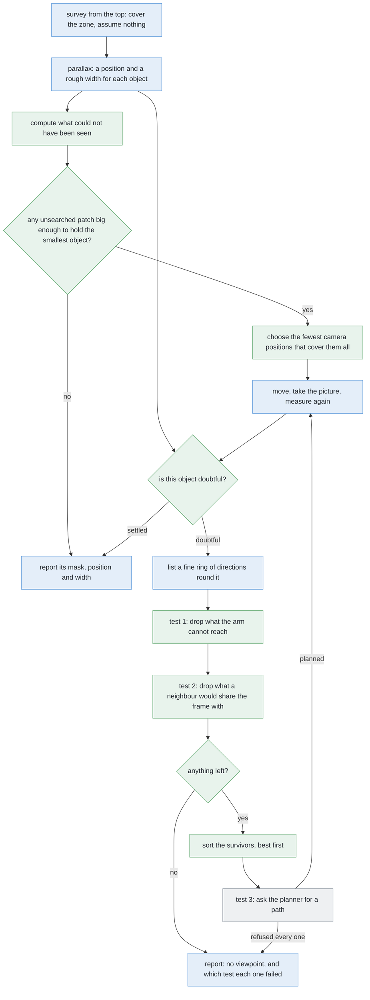

# Solution 3 — move the camera

*Programmed, and a loop. Instead of working harder on the pictures you happen to
have, go and take better ones. Choose where to stand with a rule you can print.*

> **The cell is described once, in [the cell](../../the-cell.md)** — the layout,
> the two places the camera works from, from the top and from the side, all four
> sensors, and the words this project uses them with. What follows is only what
> is specific to this solution.

## Introduction

This document explains what to do when no amount of processing can answer the
question, because the picture never contained the answer in the first place.
That happens whenever one object stands behind another, since the hidden part of
the far object was simply never measured. The fix is to move the camera and take
a better picture, and the interesting work is in choosing where to move it to.
By the end you will understand why finding a viewpoint is a different problem
from separating objects, how three cheap tests can decide where the camera may
stand before the expensive motion planner is asked anything, why deciding
whether one object blocks another turns out to be pure geometry rather than
image processing, and why the order in which those tests run is what makes the
whole method work.

There is a second kind of request this solution now has to serve, and it arrives
from a different difficulty. Sometimes there is no object to go and look at,
only a **place that could not have been seen** — and serving that request turns
the choice of where to stand into a covering problem rather than a scoring one.

Throughout this document we say "object" rather than "glass", because nothing in
this solution depends on the objects being glasses. We say "glass" only where
the cell itself is meant.

## The problem this solves

The problem statement asks for one set of pixels per object, a place on the
table for each of them, and an honest list of the ones that could not be
separated. It names two difficulties, and the point worth pressing is that these
really are **two** difficulties, and not one problem wearing two hats.

### The first difficulty is the merge

The first difficulty is that a camera standing in line with two objects sees
their outlines overlap, so the step that groups touching pixels hands back one
patch where there are two objects.

[Solution 2](solution-overview.md#solution-2--cluster-on-the-table) answers that
difficulty. It throws the pixels back onto the table as points, groups them
there, and two objects a legal distance apart then come apart cleanly.

Where the merge happens used to be a tidy story, and it is worth saying how it
changed. It used to be that **with the camera on top** it did not happen at all,
tested across thousands of arrangements. That claim rested on the objects being
roughly the same size. In this problem one kind spans a tapered shot glass at
one end and a large tapered glass at the other, and once the heights differ
several times over, a tall object's outline is thrown outwards far enough to
reach a short one standing well beyond it. So merging happens from the top as
well now.

The merge is still worst **from the side**, which means down low, standing back
from the object, looking level — the position the shape measurement needs
anyway, and from where most in-line pairs come back as one patch. But it is no
longer confined there.

### The second difficulty is that an object can be absent altogether

This difficulty is new, and it is the one that changes what this solution has to
do.

Take the mechanism above and push it one step further. If a tall object's
outline reaches a short one it merges with it, which is loud, because the patch
is then wider than any object of the kind can be. But if the outline covers the
short one **entirely**, the short object contributes no pixels at all. What
comes back is one patch of one entirely legal width, and nothing about it is
wrong.

That is not a merge and it is not a doubtful measurement. It is a **missing
object**, and it has a property neither of the other difficulties has: **there
is nothing in the data to flag.** Every check in this project tests something
that was found — a fitted width against a range, a residual, a count of stations
— and none of them can fire for something that produced no pixels.

Solution 2 answers this as far as it can be answered from arithmetic. Because
splay is exact and the objects that *were* found have known positions, widths
and heights, the region of table that could not have been seen is computable,
and any patch of it large enough to hold the smallest object of the kind is
reported as **unsearched**.

What that leaves is a request this solution has to serve, and it is a different
request from the one it was built for. A doubtful object has a position, so the
viewpoints worth trying are the ones round it. **An unsearched patch has no
object in it at all** — that is the entire point — so what is wanted is any
viewpoint from which the patch itself can be seen. Serving that request turns
out to change the shape of the problem, and the section [covering the places
nobody could see](#covering-the-places-nobody-could-see) is about how.

### The third difficulty is that there may be nowhere to stand

The third difficulty is the one this solution was originally built for: **an
object can have no clear viewpoint at all.**

With the coarse ring of directions the cell tries today, which offers only a
handful of widely spaced spokes around each object, getting on for half of all
objects have no usable viewpoint. Refine that ring to a fine one and the figure
drops to a small fraction. We counted this over hundreds of drawn arrangements,
at the widest footprint the cell handles, which is the hardest case.

The important part of that result is *why* most of the failures happen. The ring
is too coarse, and simply has no spoke pointing at the gap. Only a minority of
objects are genuinely boxed in by their neighbours. So most of the loss is a
choice the cell made, and not a fact about the world. Later in this document we
will see exactly that happen to one object.

### Why the three difficulties need different fixes

Nothing you do to a picture fixes the second or the third difficulty, and that
is why this solution is a separate thing from solution 2. The difference is
worth stating carefully, because it is the reason the project needs both.

Separating objects in a picture is a question about **labelling**, which means
deciding which pixel belongs to which thing. The information needed for that is
often still in the picture, hiding in the depth readings, in the shading, or in
the width of the patch. Clustering on the table recovers it, because the depth
reading survives being photographed.

Finding a viewpoint is a question about **what got measured at all**. The shape
measurement reads an object's outline against the background, row by row, and
turns rows into heights. If a second object stands in the same part of the
frame, then the outline is the outline of two objects stuck together, and no
cleverness afterwards can recover where one stopped and the other started,
because that measurement was never taken. The only fix is to take a different
measurement.

So separation is about interpreting a measurement, while viewpoint is about
making a good one. The two barely overlap, and a cell that answers only the
first has answered part of the problem.

The second difficulty is a third thing again, and placing it correctly matters.
Separation asks *which object is this?* Viewpoint asks *can I measure this
object?* The missing object asks **is there an object at all?** — and that
question cannot be asked of the data, because the data is exactly what is
absent. It can only be asked of the geometry.

## The main idea

The main idea is the one you would use yourself. If you cannot see something
from where you are standing, walk round until you can.

All the work is in choosing where to walk to, and the useful surprise is that
most of that choosing is arithmetic rather than image processing. The sections
below build up to it one concept at a time: first the belief about the table
that this method starts from, then where the camera stands when it looks from
the side, then the three tests that decide which places to stand are allowed,
and finally why the order of those tests matters more than any of them
individually.

## The belief this method starts from

Before the arm can decide where to look next, it has to have some idea of what
is on the table, and that creates a chicken-and-egg problem: you cannot predict
what a viewpoint would show without knowing roughly what is there, and knowing
what is there is the job.

The fixed survey solves it, and this is the one real prerequisite of the whole
method. The survey assumes nothing, covers the whole zone, and hands back a
coarse map of what is standing where. This solution then runs only on the
doubtful entries in that map. So it is the tail of the survey rather than a
replacement for it.

The survey works from the top. The camera works out from its own lens how much
table one picture covers at the height it is flying at, and then as few stations
as will cover the zone are spread out over it, with overlap to spare. For this
cell that comes out as three stations in a line, marching away from the arm.

The useful part of a station is not the whole picture. It is the strip that both
of the station's pictures share, and that strip is a good deal shorter from
front to back than the picture is. The stations are then placed close enough
together that each strip overlaps the next by roughly half, so that nothing ever
lands only on an edge, where the view of it is worst.

### Why each station takes two pictures

Each station takes two pictures rather than one, with the camera sliding a short
way sideways between them, and the reason is worth following because it is a
good example of getting depth without a depth sensor.

One picture from the top cannot say how far away anything is. All it can do is
lay each outline down flat on the table. But an object stands *above* the table,
so the laid-down point gets pushed outwards, away from the point directly below
the camera.

Now slide the camera sideways and take a second picture. The laid-down point
moves, and **how far it moves depends on how tall the object is**, because a
tall object's top is nearer the lens and therefore swings further than a short
one's. So comparing the two pictures measures the height, and once the height is
known the true position follows.

This effect is called **parallax**, and you have seen it from a moving train,
where the near fence races past the window while the far hills barely move at
all.

## Where the camera stands when it looks from the side

The extra look this solution adds is taken from the side. The arm brings the
camera down low, stands it back from the object, points it level at the object,
and approaches from a direction the three tests below have cleared.

How far back it stands is called the **standoff**, and it is worth knowing that
this is not a number somebody typed in. It is worked out, and following the
reasoning explains why the camera ends up where it does.

The camera is low down, at about the height of a rim, and it is looking level.
So the frame has to reach **downwards** far enough to catch the object's foot,
and **upwards** far enough to catch the rim of the tallest object the cell will
accept. Both of those requirements are angles rather than distances, because a
lens sees angles. So the question becomes: how far back must the camera stand
for the larger of those two requirements to fit inside half a frame? A little
margin is then taken off as well, because the arm does not arrive exactly where
it was sent.

Nothing in that chain is tuned. Change the lens and the standoff changes with
it, automatically, which is what you want from a derived number rather than a
guessed one.

Two details of this cell catch people out, and both are worth knowing before
anything is built.

The first is that **the camera is not the tool**. If you send the tool centre to
the place where you want the camera, the camera ends up somewhere else, because
it is bolted to one side of the tool. Worse, that offset turns as the wrist
turns, so it is not even a fixed correction that could be applied once and
forgotten.

The second is that **the roll has to be pinned**. The shape measurement reads
the object row by row, and a row means a height, so the camera must be level
about its own viewing axis. Looking level along the table, the usual way of
deciding which way is up gives a different roll depending on which side of the
object the arm stands on — and which side the arm stands on is exactly the thing
this solution varies.

## The three tests

Now we can describe the heart of the method. A ring of candidate directions is
listed round the doubtful object, each direction being a place the camera could
stand at the standoff, low down, looking level. The ring is spread evenly all
the way round, and it begins from the direction that points back towards the
arm's own base, because that is the direction the arm reaches most easily.

Every candidate then has to pass three tests, and **a viewpoint that passes two
of them is worth nothing**. The tests differ enormously in what they cost, which
is why the next section is about their order.

### Test one: can the arm reach it?

The arm works comfortably only inside a band of distances from its own base.
Nearer than that band, the arm has to fold over itself to get there. Further
than it, the arm is stretched straight out with nothing left over for the wrist
to point with.

So the first test drops every candidate whose standing place falls outside that
band, measured flat on the table. It costs one square root per candidate, which
is to say nothing at all.

### Test two: would another object share the frame?

This is the test people expect to be difficult, and it is not, because of one
gift this problem hands over free: **every object's footprint is a circle of
known size, standing on a known plane.**

From a camera at a given place, each object fills a certain angle of the frame,
and that angle grows with the object's width and shrinks with its distance. Two
objects share the frame when the angle between their centres, measured at the
camera, is smaller than the sum of their two half-angles. That is a handful of
arithmetic operations per pair of objects, and **no picture is involved at
all**.

Judging this as an *angle at the camera*, rather than as a distance from the
line of sight, matters more than it appears to. An object well off to one side
but twice as far away fills the same part of the frame as one standing just
beside the target, so a test based on sideways distance would wave it through.

It is also worth noticing what the test deliberately does **not** check, which
is whether the other object is *nearer* than the target. The shape measurement
reads an outline against the background, so an object standing behind the target
ruins that outline exactly as thoroughly as one standing in front of it.

#### The wedge: why the answer does not depend on distance

There is a lovely simplification hiding in that test, and it is the most useful
idea on this page. Ask the test not about one camera place but about every
direction at once, and **the distance drops out**.

Here is the argument. Stand a long way from a pair of objects, at some angle off
the line joining them. As you move further away, the angle between the two
objects measured at your eye shrinks in proportion to one over your distance.
But their combined angular width shrinks in exactly the same proportion. So when
you compare the two, your distance cancels, and what is left is a statement
about **direction alone**: the pair overlap when the sine of the angle you have
turned away from their joining line is smaller than their combined width divided
by the gap between their centres.

That has a pleasing geometric picture. Each neighbour casts a **wedge** of
blocked directions, centred on the line joining the two objects, and pointing
both ways along it. Standing anywhere inside that wedge means the neighbour is
in your frame, whatever your distance. Standing outside it means the neighbour
is not, again whatever your distance.

Now put the worst legal case into that picture. Two objects at the closest
spacing the problem allows, both with the widest footprint the cell handles,
have a combined width almost as large as the gap between their centres. The
fraction is then close to one, so the wedge's half-angle is close to a right
angle. Counting both sides of the joining line, **one neighbour alone blocks
something like a quarter of the whole circle of directions.**

Put four neighbours round an object, each casting a wedge of its own, add the
reach limit on top, and running out of viewpoints stops being a freak event and
becomes something to plan for. That is the arithmetic behind the earlier claim
that getting on for half of all objects have no usable viewpoint on a coarse
ring.

### Test three: can the arm fly there?

The third test asks the motion planner whether a path exists that gets the arm
to the pose without hitting anything, and the objects the survey found are put
into the planner's world as cylinders so that a path sweeping an elbow through
one is refused.

This test costs far more than the other two, and it is also the only one that
can fail for reasons no formula predicts, which is why it goes last.

## Why the order of the tests matters

The order of those three tests is not a detail of the implementation. It is the
design.

On the left of that picture is the order this solution uses. List every
candidate, drop the ones out of reach, drop the ones whose view is blocked, sort
what is left, and only then call the motion planner. The list shrinks at every
step, so by the time the planner is asked anything, it is being asked only about
poses genuinely worth flying to — a handful of questions instead of a long queue
of them.

On the right is the tempting alternative: sort the whole list by how good each
pose looks, and let the planner sort out the rest. The obvious cost of that is
speed, because the expensive call is now made many times instead of a few. But
the cost that matters is a different one.

**The planner has no opinion about lines of sight.** It will refuse a path that
would sweep an elbow through a cylinder, because that is its job. But a camera
pose that looks straight through one object at another is a perfectly good pose
as far as the planner is concerned. It plans to it, reports success, and the arm
takes a picture with two objects in it, measures them as one, and hands a
confident wrong answer downstream. A large share of the candidates are like
that.

So the failure mode of scoring first and rejecting afterwards is **slow, and
quietly wrong, with nothing ever erroring**, which is the worst combination
available.

The general rule behind the fix is worth remembering beyond this cell. **Order
the tests by what they cost, cheapest first, and let each one shrink the set the
next has to look at.** Arithmetic is free. Asking whether any set of joint
angles puts the hand at a given pose is nearly free. The planner is not free.
And the arm itself is the most expensive thing in the building.

There is a second benefit, and it is the more valuable one. Because the filter
is nearly free, **you can afford to list far more candidate directions than you
would otherwise dare to.** A fine ring costs the filter almost nothing and costs
the planner nothing at all, because the filter throws away all but a few before
the planner ever sees them. And a fine ring is exactly what turns "getting on
for half of all objects have no viewpoint" into "only a small fraction do". So
the ordering of the tests is not merely a speed trick. It is what makes the
method work.

## What is left to score

Once the filter has run, everything that survives is safe to visit, so scoring
only decides the order in which the survivors are tried. That bounds what a bad
score can cost: one wasted move, and never a wrong measurement.

For this cell the score is a rule rather than a model. Prefer the viewpoint
whose frame holds the doubtful object and nothing else — although after the
filter every survivor already satisfies that, so in practice it only breaks
ties. Then prefer the least turn away from the line back to the arm's base,
because standing between the object and the base is the direction with the least
reach to spare.

The textbook alternative is called **information gain**. You carve the room into
small cubes, mark each one as free, occupied or unknown, cast a ray for every
pixel from each candidate pose, and count how much unknown volume that picture
would resolve. It is all ordinary processor work, so it needs no graphics card,
and the standard implementation of the map is already kept by the motion
planner.

It is more than this cell needs, and the reason is the shape of the doubt.
Information gain is the right score when you do not know what you are looking
for. Here the doubt is a short list of named questions, such as *is that one
impossibly wide patch really one object, or is it two?* — and a score that
answers a named question beats one that measures unknown volume in general.

## Covering the places nobody could see

Everything up to here answers one shape of question: *an object needs measuring,
so where should the camera stand to see it?* This section is about the other
shape, the one the missing object created: *a place could not have been seen, so
where should the camera stand to see the place?*

The difference sounds small and is not, because it changes what a good answer
looks like.

### Why a ring of directions is the wrong tool

The ring of candidate directions exists because an object has a position, so
"somewhere round it, at the right distance, looking at it" is a sensible family
of poses to search. An unsearched patch has no object in it. There is nothing to
look *at* and nothing to stand *round*.

Worse, a patch is not a point. It has extent, and a viewpoint either sees all of
it, or part of it, or none of it. So the test that matters is not "is the line
of sight clear?" but **"is this patch inside this camera position's visible
region?"** — which is the same arithmetic solution 2 used to find the patch in
the first place, run forwards instead of backwards.

That arithmetic is already available and cheap. For a candidate camera position,
the wedges the known objects hide are computable, and so is the part of the
frame that falls outside the picture. What is left is the visible region for
that position, and testing a patch against it is a containment test.

### Which turns the choice into a covering problem

Now put several patches together, which is the normal case, and the shape of the
problem appears.

Each candidate camera position sees **some subset** of the unsearched patches.
The run wants every patch seen, and every camera position costs seconds. So the
question is: *what is the smallest set of camera positions whose visible regions
between them cover every patch?*

That is a classical problem, and knowing its name is worth more than solving it
well. It is **set cover**: given a collection of sets and a target to cover,
choose as few of the sets as possible. It is known to be hard to solve exactly,
and — this is the useful part — it has a simple approximate method that is
provably close to the best possible. **Take the candidate that covers the most
patches not yet covered. Repeat until everything is covered.** That is called
the greedy method, and for set cover it is about as good as any simple method
can be.

So the procedure for the new kind of request is short.

First, for every candidate camera position that survives the existing three
tests, compute which unsearched patches it would see. Second, take the candidate
that covers the most patches, and mark those as covered. Third, repeat until no
patches remain, or until the budget of extra looks runs out. Whatever is still
uncovered at the end is reported as **unsearched**, which is an honest statement
about the run rather than a failure of it.

### Why this is better than looping over patches

It is tempting to treat each patch separately: pick a patch, find a viewpoint,
go, repeat. That is the loop the rest of this document describes, and for
patches it is the wrong shape, for one reason that is worth seeing.

**Patches are cheap to cover together and expensive to cover apart.** A single
well-chosen camera position often sees several patches at once, because the
patches are wedges behind objects and one move can swing several wedges out of
the way. A per-patch loop would pay for one arm movement per patch and get the
same information for several times the cost.

That is the general lesson, and it applies whenever the thing being requested
has extent rather than position: **batch the requests before choosing the
actions, and choose the action that serves the most requests.** A loop that
takes requests one at a time cannot see that two of them share an answer.

### What it costs, and what it is worth

The cost is arithmetic and nothing else. Computing a candidate's visible region
is the same wedge arithmetic already used twice, and the greedy choice is a
count and a maximum over a short list.

What it is worth is worth being honest about, and solution 2 measured it. In
this cell the three survey stations already see every object between them, so
the covering step usually finds nothing left to cover and costs no arm movements
at all. Its value here is that it **proves** the survey was complete rather than
assuming it. Its value changes the day somebody drops a station, moves the zone,
or lets the objects stand closer — at which point the run starts asking for
looks it can justify, instead of silently reporting fewer objects than are on
the table.

## How the concepts fit together

Put in order, the concepts make one loop, and the loop only ever runs on objects
the survey could not settle.

Green marks what this solution adds, blue marks work the project already does,
and grey marks the motion planner.

Notice that there are **two paths into the arm movement**, and they arrive from
different places. The lower path starts from an object whose measurement cannot
be trusted, and asks which direction to view it from. The upper path starts from
a place nothing could have seen, and never looks at an object at all. Both end
at the same movement, which is why they belong in one solution rather than in
two.

Notice also the step that decides whether an object is doubtful, because it is
what keeps the arm from wandering round the table for no reason. An object whose
fitted footprint comes out wider than any single object of this kind can
possibly be, or an object that only one station ever saw, is marked doubtful.
Everything inside the allowed range is settled, and settled objects never enter
the loop at all.

## The loop, and why it must have a budget

This solution has a real feedback loop, which is what separates it from
solutions 1 and 2. It takes a measurement, works out what is still unclear,
decides where it would have to look for that to become clear, goes and looks,
and repeats.

A loop needs three things, and something with only two of them is not a loop. It
needs something to be unsure about, which the width check from solution 2
provides. It needs somewhere to go that might help, which the filtered candidate
directions provide — and if the filter returns nothing at all, then that fact is
itself the answer. And it needs a **budget**, because otherwise it never stops.

The budget is easier to reason about with the right unit, and the natural unit
here is one **station-equivalent**: one plan, one move, one settle, and the pair
of pictures the parallax needs. That is about what one more survey station
costs, which saves us having to invent a number for what a movement costs. The
survey from the top is three of these units, and each extra look is one more.

What a unit costs in seconds is the one thing on this page that has to be
**measured** rather than argued about. The right panel of that picture shows why
it does not much matter which of the plausible values it turns out to be.
Whatever ceiling the whole perception step has to fit under, dividing that
ceiling by the cost of a unit gives the number of units we can afford — and
across the whole plausible range of unit costs, that number stays in the same
neighbourhood.

Set the options against it and the choice makes itself. The survey on its own
fits comfortably, however expensive a unit turns out to be. The survey plus a
small cap of extra looks is a little over twice the survey alone, and still fits
at every plausible unit cost. A slightly larger cap fits only if a unit turns
out to be cheap. And letting every object have its full allowance of looks
breaks the ceiling at every unit cost, so it is never an option.

So the run-wide cap is set at the largest budget that fits *whatever* a unit
turns out to cost. Going one step higher would be a bet on the timing
measurement coming out at the cheap end, and there is a good reason not to place
that bet: the objects that most want a second look are the crowded ones, and
crowding is exactly what removes their viewpoints. So the extra budget is the
part most likely to be spent on looks that get refused before the camera even
moves.

Alongside the run-wide cap goes a **per-object cap**, so that one object cannot
eat the whole budget by itself. Without it, one stubborn cluster pulls look
after look and the run never ends. And a cluster is usually stubborn because of
where its neighbours are standing, which no number of looks will change.

The loop stops when nothing is doubtful, or when the budget is spent. Whatever
is still doubtful then is **reported as doubtful**, and not guessed at. A report
that says "these two could not be separated, and here is why" is a result. A
report that guesses is a failure that looks like a result.

One measurement is worth recording from the very first version: **how many extra
looks were spent, and how many of them changed the answer.** A loop whose extra
looks never change anything is a loop worth deleting, and you cannot know which
kind you have built until you count.

## A worked example

This example follows two objects through the method, one that has a viewpoint
and one that has none. It is described in terms of what happens rather than what
is measured.

Five objects stand in the zone, arranged at the closest spacing the problem
allows, so that the method is shown its hardest legal case rather than a
comfortable one.

| | where it stands | how far out from the base |
| --- | --- | --- |
| A | middle of the zone, on the near side | middle of the arm's reach |
| B | between A and the far corner | comfortably out |
| C | the near corner, closest to the arm | near the inner edge of the reach |
| D | out along the far edge, away from B | comfortably out |
| E | the far corner of the zone | near the outer edge of the reach |

A and B stand at the smallest legal gap, and so do B and E, while every other
pair is a little further apart. Every footprint is taken at the widest the cell
handles, because a wide footprint casts a wider wedge of blocked directions,
which again is the hardest case.

### Object A, which has a viewpoint

The ring in the left panel is every direction round A, each one a place the
camera could stand at the standoff, coloured by what it fails. Grey marks the
directions where the standing place falls outside the arm's comfortable reach.
Red marks the directions where another object would share the picture. Green
marks the directions that pass both. The crosses, circles and stars on the ring
are the directions the cell actually tries on its coarse ring.

**Some candidates fail on reach alone.** The direction that would put the camera
*between* A and the arm's own base is the obvious casualty, because it lands
close in to the base, well inside the inner edge of the comfortable band, where
the arm would have to fold over itself. At the other extreme, the directions
that would put the camera on the far side of A, out past B, land beyond the
outer edge, where the arm is stretched straight and has nothing left over to
point the wrist with. None of these ever reach the line-of-sight test, which is
exactly the point of the ordering: the cheapest test spends the least and
removes a good share of the candidates.

**Most of what remains is blocked.** Standing one way, both B and C land in the
frame. Swing round and it is B and E instead. Swing further and D appears.
Further still and C is back. Each neighbour is casting its own wedge, and the
wedges overlap.

**A couple of candidates survive.** They are sorted by how far the arm has to
turn away from the line back to its own base, because that line is where the arm
has the most reach in hand, so the planner is asked about the better of the two
first. If it plans, the arm flies there, takes the picture, and we are done. If
it refuses, say because an elbow would sweep through B, the planner is asked
about the other one. If that fails too, then A has no viewpoint, and A is
**reported** rather than guessed at.

Follow the same arithmetic through for all five objects and it gives the pattern
in the bound-then-score picture above: a long list of candidates, roughly half
removed by reach, most of the rest removed by line of sight, and only a few left
for the planner. The planner is the expensive test, and it is asked the fewest
questions.

One detail is worth noticing, because it is the first hint of the real problem.
The direction exactly square to the line joining A and B — the one you would
reach for by hand, because it looks at A with B safely off to the side — is
**not one of the directions the coarse ring offers**. The nearest one it does
offer is some way off it, and happens to work. This time. So it is the ring, and
not the geometry, that decided the outcome.

### Object E, which has none

The left panel is object E. Some of its directions fall outside the arm's reach,
the rest are blocked by neighbours, and none survives. So on the coarse ring the
cell uses today, E is handed to problem 3.

But look at the ring itself. There *is* a stretch of green on it, which is a
narrow arc of directions from which E could be seen perfectly well. The coarse
ring simply has no spoke pointing into that arc, and steps straight over it. **E
is stranded by the ring, and not by the geometry.**

That is not an isolated accident, and it is the important result on this page.
Measure the clear arc for each of the five objects and the arcs vary enormously.
One of them is so wide that any ring would hit it, while others are only a few
degrees across. A coarse ring is guaranteed to find the wide arc and finds the
narrow ones only by luck, depending on where its spokes happen to fall.

The fix is free, and it is the second benefit of bounding before scoring.
Because the filter is pure arithmetic, the ring can be made as fine as you like,
with dozens of directions instead of a handful, and the planner still only ever
sees the few survivors.

The right panel counts what that buys, over hundreds of arrangements of four to
six objects drawn in the zone under the problem's own spacing rule. Refining the
ring from coarse to fine cuts the share of objects with no usable viewpoint down
to a small fraction of what it was. And the narrower the footprints, the more
completely the problem disappears, because a slim object casts a narrow wedge.

Two things follow from that. **Most of the loss is the ring, and refining the
ring costs nothing but arithmetic**, which makes it the single cheapest
improvement available here and the first thing to do.

And it never reaches zero. In the middle panel, object S stands well out from
the base with four neighbours round it, and its ring has **no clear direction at
all**, at any fineness whatsoever. No ring helps, because the wedges its
neighbours cast cover the whole circle between them. Something has to move.

That is the handover to [problem 3](../../problem-3/problem.md), and it is a
result rather than an error. The right output is the object, the reason, and a
stop, and never an attempt made anyway. This is the rule the whole project runs
on: a refused object is a result, and a fallback that has the arm try regardless
is how neighbours get knocked over.

## Where the idea comes from

This solution is an example of a named research programme rather than a trick.
The idea that a camera should be *moved on purpose* rather than read passively
has forty years of literature behind it, and the five ideas below are the
standard vocabulary.

### Active perception — treating the sensor's pose as something to choose

Classical vision takes a picture as given and asks what can be recovered from
it. **Active perception** (Bajcsy, *Proceedings of the IEEE*, 1988) and **active
vision** (Aloimonos, Weiss and Bandyopadhyay, *IJCV*, 1988) turn that round, so
that the observer controls the sensor and the question becomes *where should I
look next?* Problems that cannot be answered from one viewpoint are often easy
from two.

It is used for robots with the sensor on a movable body, such as arms, mobile
bases, drones and pan-tilt heads, and for inspection, where an object has to be
checked from several sides anyway. It is rarely right for fixed installations
where moving is impossible, or where moving is slow compared with the value of
the answer, such as a conveyor line running at speed or a static security
camera.

For more, see [active
perception](https://en.wikipedia.org/wiki/Active_perception).

### Next-best-view planning — scoring viewpoints before visiting them

List candidate poses, predict what each would reveal, take the best one, and
repeat until the gain stops being worth the movement. The first version of this
is Connolly's *The Determination of Next Best Views* (ICRA, 1985), and the field
has run on variations of it since.

It is used for three-dimensional reconstruction and inspection, where coverage
is the goal and the object is unknown, such as scanning a part, mapping a room,
or exploring with a drone. It is rarely right for scenes small and known enough
that a fixed sweep covers everything anyway, because planning a viewpoint costs
thought while visiting three fixed ones may cost less. **This cell sits on that
line**, which is why the score here is a printed rule rather than a calculation
of information.

### Occupancy mapping and ray casting — reasoning about what is hidden

Divide space into cells, mark each one free, occupied or unknown, and trace rays
from a candidate camera to see which unknown cells it would resolve. **OctoMap**
(Hornung and colleagues, *Autonomous Robots*, 2013) is the standard
implementation, using a tree structure that keeps the memory use tolerable.

It is used for mobile robots and drones, where "what have I not seen yet" is the
whole task, and it is the layer underneath most next-best-view scoring. It is
rarely right for a small scene of a few known objects, where a handful of
geometric tests answer the same question exactly and far more cheaply. A grid
fine enough to be useful over this cell's zone runs to millions of cells, all to
decide what one wedge test per neighbour already settles exactly.

For more, see [occupancy grid
mapping](https://en.wikipedia.org/wiki/Occupancy_grid_mapping) and
[OctoMap](https://octomap.github.io/).

### Set cover — choosing the fewest actions that between them do everything

This is the idea the covering section rests on, and it is worth knowing by name
because it turns up constantly once you start batching requests.

The problem is stated like this: you have a target made of many pieces, and a
collection of actions where each action covers some of the pieces, and you want
the fewest actions that between them cover every piece. That is **set cover**.
Here the pieces are the unsearched patches and the actions are the camera
positions, but the same shape appears in choosing which tests to run, which
sensors to install, and which items to stock.

Two facts about it are the useful ones. It is **hard to solve exactly**, so
nobody should spend effort trying on a problem this small. And the obvious
greedy method — repeatedly take whatever covers the most pieces still uncovered
— is **provably close to the best possible**, which is an unusually comfortable
position to be in: the easy method is also the right one.

It is used for facility placement, test selection, sensor placement and camera
placement, which is this case exactly. It is rarely right when the actions
interact, meaning when taking one changes what another would cover, because then
the sets are not fixed and the greedy argument stops applying. Here they do not
interact, because the objects do not move between looks.

For more, see [set cover](https://en.wikipedia.org/wiki/Set_cover_problem).

### Bounding a search by feasibility before scoring it

The last idea is not a vision method at all but a structural pattern, and it is
the one most often got wrong: put the hard constraints **inside** the search
rather than filtering afterwards. Listing viewpoints, ranking them by how much
they would reveal, and only then discovering that the arm cannot reach them is
how a cell becomes slow and unreliable with nothing ever erroring.

## Where it is strong and where it breaks

The strengths of this method follow from the fact that moving the camera is
cheap and safe.

It fixes merges that were caused by where the camera happened to be standing,
and changing where it stands costs seconds while carrying no risk at all to the
glassware. It can be audited completely, because a refusal names which of the
three tests each candidate direction failed, so "no viewpoint" is a statement
you can check rather than a shrug. And it costs nothing when it is not needed,
because settled objects never enter the loop, so a scene with no doubt in it
runs exactly as it did before.

It has also become the only place in the project that can act on a **place**
rather than an object, which is what the missing-object difficulty requires.
That is worth listing as a strength rather than as an extra job, because the
alternative is a run that quietly reports fewer objects than are on the table.

The weaknesses divide into what it spends, what it assumes, and where it stops.

What it spends is arm time, which is the cell's dearest resource. Give every
object its full allowance of looks and the extra travel dwarfs the original
survey, which is why the budget exists. It is also heavier than it strictly
needs to be, since the filter on its own gets most of the benefit, and the loop
around it wants a better measure of doubt than a width check.

What it assumes is that the survey's footprints are right, and this is the
subtlest weakness on the page. The line-of-sight test predicts what is hidden
from the **survey's own** footprint circles. So if the survey measured a
footprint badly, then the prediction is wrong, and the arm is confidently sent
to a viewpoint that turns out not to be clear after all.

The covering step inherits exactly the same weakness, and one worse than it. It
works out the unsearched patches from the objects that **were found**, so an
object hidden behind an object that was itself hidden lies outside its reasoning
altogether. In this cell that does not arise, because no object is hidden from
every station, but it is the thing to watch the day the station layout changes.

It also assumes depth readings work, and real glassware reads badly on a depth
camera, so with no depth there is no belief about the table for any of this to
reason about.

Where it stops is at three places. Without the per-object cap it thrashes on one
stubborn object. The planner can refuse every survivor, in which case all the
cheap arithmetic was for nothing. And some objects have no clear direction at
any ring fineness at all, which is problem 3's business and a result rather than
an error.

This method is the right choice when a viewpoint is cheap to score and expensive
to visit, and when the doubt has a name you can state. Both of those stop being
true at [problem 4](../../problem-4/problem.md), where a score based on unknown
volume starts to earn its weight. The order to build it in is the filter first,
with a fine ring, because that is a page of arithmetic and it captures most of
the benefit, and then the loop afterwards.

## Where it sits among the other solutions

This solution answers different difficulties from **cluster on the table**, so
the two are partners rather than rivals. Clustering says which pixels belong to
which object and where each one stands, and works out which places it could not
have seen. This solution supplies the two things clustering cannot get for
itself: a better picture of a doubtful object, and a view of a place nothing has
looked at.

Those two together are why the recommended answer to this problem is a
**combination** rather than a choice. Clustering alone is confidently wrong on a
hidden object. This solution alone has nothing to reason from, because it needs
the footprints and heights clustering produces. Neither is a solution to problem
2 on its own.

This document is also the baseline underneath the solutions that replace only
its score. Solutions 4 and 6 keep this structure — generate candidates, filter
them with arithmetic, then order what survives — and change only how the
ordering is decided. So understanding this document is what makes those two
short.
