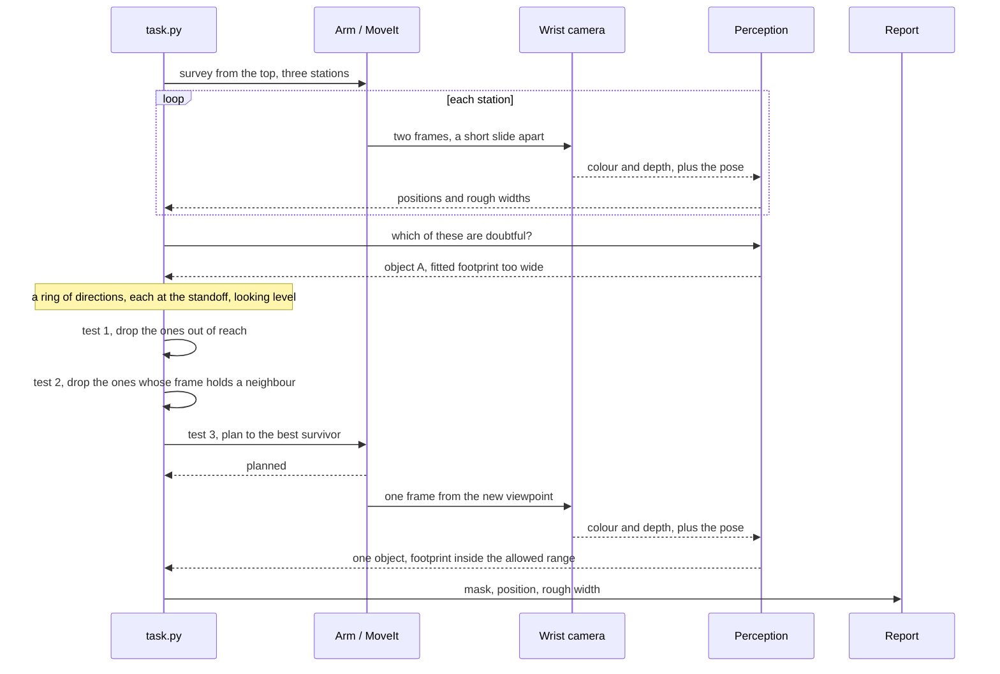
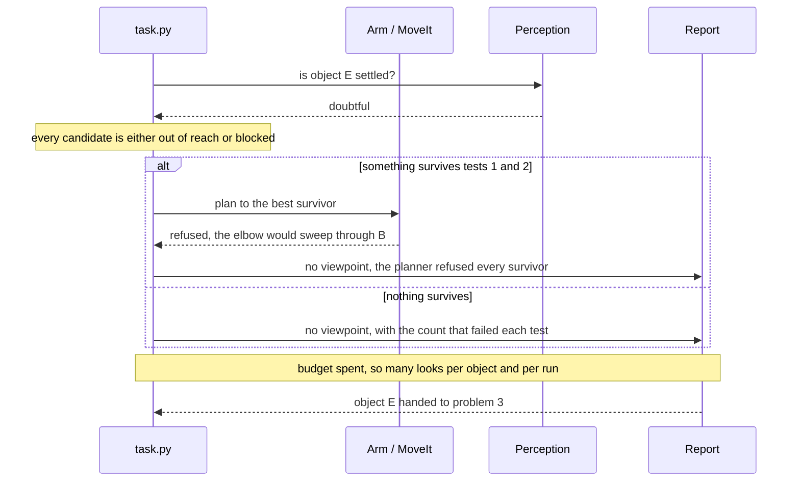
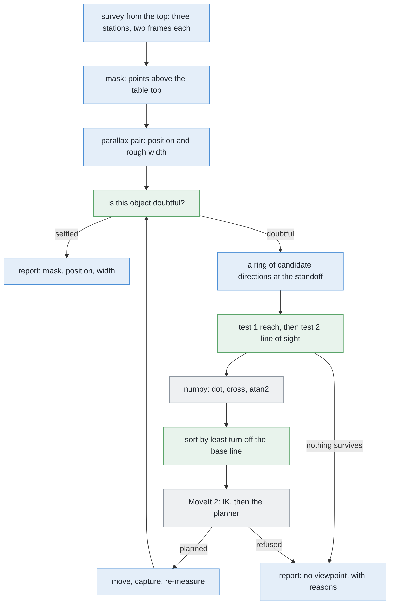

# Solution 3 — move the camera

*Programmed, and a loop. Instead of working harder on the pictures you happen to
have, go and take better ones. Choose where to stand with a rule you can print.*

> **The cell is described once, in [the cell](../../the-cell.md)** — the layout,
> the two places the camera works from, from the top and from the side, all four
> sensors, and the words this project uses them with. What follows is only what
> is specific to this solution.

## In one paragraph

A camera that can move is a different instrument from one that cannot, and this
solution treats it that way. Separating objects and finding a viewpoint are two
different problems. If one object stands behind another, no amount of processing
will produce the outline from the side that the next step needs. The information
was never captured. So the arm goes and stands somewhere better. Three separate
tests decide where: a clear line of sight, a place to stand inside the arm's
comfortable working reach, and a path the arm can actually fly. The first two
are arithmetic, so they run before the motion planner is asked anything at all.
An object with no viewpoint left is not an error. It is the handover to problem
3.

## The problem this solves

[`problem.md`](../problem.md) asks for one set of pixels per object, a place on
the table for each, and an honest list of the ones that could not be separated.
The objects in this cell are drinking glasses, but nothing in this solution
depends on that, so we say "object" except where the cell itself is meant.

The problem statement names two difficulties. The point worth pressing is that
they really are **two**, not one problem wearing two hats.


**The first difficulty is the merge.** A camera in line with two objects sees
their outlines overlap, and the flood fill returns one patch.
[Solution 2](solution-overview.md#solution-2--cluster-on-the-table) answers it:
throw the pixels back onto the table as points, group them there, and two
objects a legal distance apart come apart cleanly.

Where the merge happens is not where people expect, and we measured it rather
than assuming. **With the camera on top**, high up and looking straight down, it
does not happen at all. We tried every arrangement the cell's scene generator
can legally produce — thousands of them, all four kinds, a range of sizes, every
spacing the cell allows, every angle — and wherever both objects were wholly
inside one frame, **none merged**. The reason is that a picture from the top
covers a wide piece of table down at table level and a much narrower one up at
the height of a rim, so a legal pair is either plainly separate or one of the
two is falling off the edge of the frame. The merge belongs to **the camera at
the side** — down low, standing back at the measuring standoff, looking level,
which is the pose the profile measurement needs anyway. From there, most in-line
pairs come back as one patch.

**The second difficulty is the one this solution exists for, and it is the
bigger of the two: an object can have no clear viewpoint at all.** With the
coarse ring of directions the cell tries today — nine of them, spaced widely
round the object — getting on for half of all objects have no usable viewpoint.
Refine that ring to a fine one and the figure drops to a small fraction. We
counted this over hundreds of drawn arrangements, at the widest footprint the
cell handles, which is the hardest case. The important part of that result is
*why* most of the failures happen: the ring is too coarse and simply has no
spoke pointing at the gap. Only a minority of objects are genuinely boxed in by
their neighbours. So most of the loss is a choice the cell made, not a fact
about the world.

**Nothing you do to the picture fixes that**, and that is why this solution is a
separate thing from solution 2. The difference is worth stating carefully.

Separating objects in a picture is a question about *labelling*: which pixel
belongs to which thing. The information needed is often still in the picture —
in the depth channel, in the shading, in the width of the patch. Clustering on
the table recovers it, because the depth reading survives being photographed.

Finding a viewpoint is a question about *what got measured at all*. The profile
step reads an object's outline against the background, row by row, and turns
rows into heights. If a second object stands in the same part of the frame, the
outline is the outline of two objects stuck together. No cleverness recovers
where one stopped and the other started, because that measurement was never
taken. The only fix is to take a different one.

So: separation is about interpreting a measurement. Viewpoint is about making a
good one. The two barely overlap, and a cell that answers only the first has
answered half the problem.

## How it works, end to end

If you cannot see something from where you are standing, walk round. That is the
whole idea. The work is in choosing where to walk to, and the useful surprise is
that most of the choosing is arithmetic rather than image processing.

### The setup

The table top's height is a constant in `table/layout.py`, and it is the plane
every height in the cell is measured up from. The arm is bolted to the near edge
and reaches out across the table. The objects stand inside the **object zone**
(`GLASS_ZONE`), a rectangle of table a little wider than it is deep. The drying
rack is on the far side of the table, far enough away that it is never behind
the objects when the camera looks down at the zone.

Four to six objects stand in that zone. All one known kind, upright, solid, and
never closer than the smallest gap problem 2 promises between their centres.
They vary in width and they vary a great deal in height — but **the cell is not
told any of that**, and it may not be. Sizes are measured during the run. The
only size written into the project is an upper limit on how tall an object may
be, which the frames and the masks are sized against; it is a limit on what the
cell will accept, not the size of any particular object.

The camera is an RGB-D camera bolted to the wrist, a little to one side of the
tool centre and a little above it, looking the way the fingers point. Because it
rides on the wrist, putting the camera somewhere means putting the whole arm
somewhere.

**Known in advance:** the table height, the lens, the band of distances from the
base that the arm works comfortably in (`COMFORTABLE_REACH`), and the kind of
object. **Not known:** how many objects there are, where they stand, how wide
they are, how tall.

Every object the survey finds also goes into the MoveIt 2 planning scene as a
cylinder, so a path that would sweep an elbow through one is refused.

### The pictures

Two kinds of picture are taken. This solution only adds the second kind.


**The survey**, taken **from the top**, which runs first and is not this
solution's. The camera works out from its own lens how much table one picture
covers at the survey height. Then `survey_stations()` in `arm/dimensions.py`
spreads as few stations as will cover the object zone with overlap to spare. For
this cell that comes out as three stations, in a line, marching away from the
arm.

The useful part of a station is not the whole picture. It is the strip that both
of the station's pictures share, and that strip is a good deal shorter
front-to-back than the picture is. The stations are then placed close enough
together that each strip overlaps the next by roughly half, so nothing ever
lands only on an edge, where the view of it is worst.

Each station takes **two** pictures, a short slide apart, not one. Here is why.
One picture from the top cannot say how far away anything is. It can only lay
each outline down flat on the table — and an object stands *above* the table, so
the laid-down point gets pushed outwards, away from the point below the camera.
Now slide the camera sideways and take a second picture. The laid-down point
moves, and **how far it moves depends on how tall the object is**: a tall
object's top, being nearer the lens, swings much further than a short one's. So
comparing the two pictures measures the height, and once the height is known the
true position follows. This is parallax, the same effect you see when you look
out of a moving train and the near fence races past while the far hills barely
move.

So: six pictures, from three places, before any of this solution runs.

**The extra look**, which is this solution's, is taken **from the side**. For
one doubtful object, the arm brings the camera down low, stands it back at the
measuring standoff, points it level at the object, and approaches from a
direction the three tests below have cleared.

That standoff is not a constant somebody typed in. It is worked out, and the
reasoning is worth following because it explains why the camera stands where it
does. The camera is low down, at about rim height, and it is looking level. So
the frame has to reach **downwards** far enough to catch the object's foot, and
**upwards** far enough to catch the rim of the tallest object the cell will
accept. Both of those are angles, not distances, because a lens sees angles. So
the question becomes: how far back must the camera stand for the taller of those
two requirements to fit inside half a frame? A little margin is taken off as
well, because the arm does not arrive exactly where it was sent. Out of that
comes the standoff, and `MEASURE_STANDOFF` in `arm/dimensions.py` is the floor
it is never allowed below. Nothing here is a tuned number: change the lens and
the standoff changes with it, automatically.

Two details of this cell bite, and both are easy to get wrong.

**The camera is not the tool.** Send the tool centre to the place you want the
camera and the camera ends up somewhere else, because it is bolted to one side
of the tool — and that offset turns as the wrist turns, so it is not even a
fixed correction. So `_measure_from()` commands the tool to `eye - rotation @
CAMERA_OFFSET` rather than to `eye`.

**The roll has to be pinned.** The profile is measured row by row, and a row
means a height. Looking level along the table, the default "up" hint gives a
different roll depending on which side of the object the arm stands on — which
is exactly the thing that varies here.

### What each picture captures

The sensor returns a colour frame and a depth frame of the same size, both
small, through the same lens, several times a second. The depth has a near limit
and a far limit: anything closer than the near limit or further than the far
limit comes back as nothing.

The cell keeps three things from each capture.

- **The depth frame**, which is what everything else is built from. Colour is
  only used for the pictures in the report.
- **The mask.** `standing_on_the_table()` marks a pixel yes where the point
  behind it is above the table top and below the tallest object the cell
  accepts. That second limit does a job people often miss: it is also what keeps
  the arm's own fingers out of its own pictures. For a look from the side the
  mask is banded in depth as well, keeping only a slab of room around the
  standoff distance, which throws away the rack and anything standing well
  behind the target.
- **The pose** — where the camera really was, which is what lets a pixel be
  turned into a place in the room. It is read from where the camera actually
  ended up, not from where the tool was sent, because otherwise the camera's
  offset from the tool would be added to every single position the cell reports.

### What is interpreted, and how

The chain runs in this order.

1. **Mask, then connected components.** `find_glasses()` groups the yes pixels
   that touch, one patch per candidate object, and lays each patch's widest part
   down on the table.
2. **Parallax, per station.** `where_they_stand()` compares the station's pair
   of pictures. When the camera slides sideways by some amount, a laid-down
   point slides by *more* than that, and the ratio between the two depends only
   on the object's height as a fraction of the camera's height. So the apparent
   movement measures the height, and the height gives back the true position and
   the true width. An object caught in only one of the two pictures cannot be
   placed at all, and is left for another station.
3. **Doubt.** An object whose fitted footprint comes out wider than any single
   object of this kind can possibly be, or that only one station ever saw, is
   marked doubtful. Anything inside the allowed range is settled, and settled
   objects get no extra look — this is the step that keeps the arm from
   wandering round the table for no reason.
4. **Candidates.** `_standoffs()` in `task.py` lists places to stand round the
   doubtful object, each one putting the camera at the measuring standoff, low
   down, looking level at it. They are spread evenly round the object in a ring,
   and the ring starts from the direction that points back at the arm's own
   base, because that is the one the arm reaches most easily.
5. **Test 1 — reach.** Drop the candidates whose standing place falls outside
   the band of distances the arm works comfortably in, measured flat on the
   table. Nearer than the band and the arm has to fold over itself; further and
   it is stretched straight out with nothing left over for the wrist to point
   with. Cost: one square root per candidate.
6. **Test 2 — line of sight.** Drop the candidates where another object would
   share the frame. Cost: a handful of arithmetic operations per pair.
7. **Test 3 — the path.** Ask MoveIt 2, best first, and take the first that
   plans. Cost: far more than the other two, and it is the only test that can
   fail for reasons no formula predicts.
8. **Move, capture, re-measure**, and merge the new sighting into what the
   survey already had. If nothing survives tests 1 and 2, report the object with
   its reason and stop.

A viewpoint has to pass all three tests. Passing two is worth nothing.

#### Why the line-of-sight test is arithmetic


This is the test people expect to be hard, and it is not, because of one fact
this problem hands over free: **every object's footprint is a circle of known
size, standing on a known plane.**

From a camera at a given point, each object fills a certain angle of the frame.
Half of that angle is `atan(r / d)`, where `r` is the radius and `d` is how far
away it is. Two objects share the frame when the angle between their centres,
measured at the camera, is smaller than the sum of their two half-angles.

That is one cross product, one dot product and three arctangents. No picture is
involved. `_blocked()` in `task.py` already computes it.

Judging it as an *angle at the camera*, rather than as a distance from the line
of sight, matters more than it looks. An object well off to one side but twice
as far away fills the same part of the frame as one just beside the target. A
sideways-distance test would wave it through.

Note also what the test deliberately does *not* check: whether the other object
is **nearer** than the target. The profile measurement reads an outline against
the background, so an object behind the target ruins the outline exactly as
thoroughly as one in front of it.

Now ask the same test of every direction at once, and something nice happens:
the distance drops out. Sit a long way `D` from a pair of objects `d` apart, at
an angle `θ` off the line joining them. The angle between them at your eye
shrinks like `d·sin(θ)/D`, while their combined angular width shrinks like `(rA
+ rB)/D`. `D` cancels. What is left is a statement about direction alone:

    the pair overlap when   sin(θ) < (rA + rB) / d

So each neighbour casts a **wedge** of blocked directions, of half-angle
`asin((rA + rB) / d)`, along the line joining the two objects and along its
opposite. With the equal footprints of one known kind that is `asin(2r/d)`.

Now take the worst legal case: two objects at the closest spacing the problem
allows, both with the widest footprint the cell handles. Then `2r` is almost as
big as `d`, the fraction inside the `asin` is close to one, and the half-angle
comes out close to a right angle. Counting both sides of the line, **one
neighbour alone blocks something like a quarter of the whole circle**. Put four
neighbours round an object, each blocking a wedge of its own, add the reach
limit on top, and running out of viewpoints stops being a freak event and
becomes something to plan for. That is the arithmetic behind the earlier claim
that getting on for half of all objects have no usable viewpoint on a coarse
ring.

#### Why the tests run in that order


Two orderings of the same work, with the counts from the five-object arrangement
used later in this document.

On the left: list every candidate, drop the ones out of reach, drop the ones
whose view is blocked, sort what is left, and only then call the motion planner.
The list shrinks at every step, and by the time the planner is asked anything,
it is being asked only about poses that are genuinely worth flying to — a
handful of questions instead of a long queue of them.

On the right: sort the whole list and let the planner sort it out. The obvious
cost is speed, because the expensive call is now made many times instead of a
few. But the cost that matters is the other one.

**The planner has no opinion about lines of sight.** It will refuse a path that
would sweep an elbow through a cylinder, because that is its job. But a camera
pose that looks straight through object B at object A is a perfectly good pose
as far as it is concerned. It plans to it, reports success, and the arm takes a
picture with two objects in it, measures them as one, and hands a confident
wrong answer downstream. A large share of the candidates are like that.

So the failure mode of score-then-reject is **slow, and quietly wrong, with
nothing erroring** — the worst combination available.

The general rule behind the fix: **order the tests by what they cost, cheapest
first, and let each one shrink the set the next has to look at.** Arithmetic is
free. Inverse kinematics — working out whether a set of joint angles exists that
puts the hand at a given pose — is nearly free. The planner is not free. The arm
is the most expensive thing in the building.

There is a second benefit, and it is the more valuable one. Because the filter
is nearly free, you can afford to *list far more candidate directions than you
would otherwise dare to*. A fine ring of directions costs the filter almost
nothing and costs the planner nothing at all, because the filter throws away all
but a few before the planner ever sees them. And a fine ring is exactly what
turns "getting on for half of all objects have no viewpoint" into "only a small
fraction do". So the ordering of the tests is not just a speed trick. It is what
makes the method work.

#### What is left to score

Once the filter has run, whatever survives is safe to visit, and scoring only
decides the order. That bounds what a bad score can cost: one wasted move, not a
wrong measurement.

For this cell the score is a rule, not a model. Prefer the viewpoint whose frame
holds the doubtful object and nothing else — after the filter every survivor
already satisfies this, so in practice it breaks ties. Then prefer the least
turn away from the line back to the arm's base, because standing between the
object and the base is the direction with the least reach in it.

The textbook alternative is **information gain**. Carve the room into small
cubes, mark each free, occupied or unknown, cast a ray per pixel from each
candidate pose, and count how much unknown volume the picture would resolve.
[OctoMap](https://octomap.github.io/) (Hornung et al., *Autonomous Robots*, 2013)
is the standard implementation of the map, and MoveIt 2 already keeps one. Isler
et al. (ICRA 2016) and Delmerico et al. (*Autonomous Robots*, 2018) work through
the variants. It is all CPU ray casting, so it needs no graphics card.

It is more than this cell needs, and the reason is the shape of the doubt.
Information gain is the right score when you do not know what you are looking
for. Here the doubt is a short list of named questions — *is that one impossibly
wide patch really one object, or is it two?* — and a score that answers a named
question beats one that measures unknown volume in general.

### What comes out

For every object the run placed: a **mask** saying which pixels in which picture
are that object, a **position** on the table measured from the arm's base, and a
**rough footprint width**. For every object it could not place: the object, and
which of the three tests each candidate direction failed, with the measurements
that decided it, so the refusal can be read rather than guessed at.

Three consumers take it. Problem 1's step 2 takes the cleared viewpoint and
measures the profile from it, unchanged. [Problem 3](../../problem-3/problem.md)
takes the objects with no viewpoint, because moving something is the only
remaining fix. `report.py` writes both lists into the run folder, with the
pictures they came from.

## The sequence

The normal path: the fixed sweep, one doubtful object, one extra look that
settles it.



The interesting path: an object with nothing left to try. The budget caps the
loop at two looks per object and four per run, and an object with no viewpoint
is reported rather than guessed at.



## In pseudocode

The pipeline, coloured by who owns the code.



Legend: **green** is new code written for this solution, **blue** is code the
project already has, **grey** is a third-party library.

The method, as code that does not compile:

```text
found = task.survey(GLASS_ZONE)                      # have  · work_cell.task._survey
doubtful = [d for d in found if not settled(d)]      # NEW   · ~10 lines, numpy

for target in doubtful[:FOUR_PER_RUN]:               # NEW   · the run-wide budget
    others = [d for d in found if d is not target]   # NEW   · plain python
    eyes = standoffs(target, others, step=FINE_RING) # have  · work_cell.task._standoffs
    eyes = [e for e in eyes if in_reach(e)]          # have  · work_cell.arm.dimensions
    eyes = [e for e in eyes if unblocked(e)]         # have  · work_cell.task._blocked
    eyes = sorted(eyes, key=turn_off_the_base_line)  # NEW   · numpy

    if not eyes:                                     # NEW   · nothing left to try
        report.no_viewpoint(target, why=reasons)     # have  · work_cell.report
        continue                                     #       · handed to problem 3

    for eye, turn in eyes[:TWO_PER_TARGET]:          # NEW   · the per-object budget
        if not arm.move_to(eye - turn @ CAM_OFFSET): # have  · work_cell.arm.motion
            continue                                 #       · the planner refused it
        view = camera.capture()                      # have  · work_cell.arm.camera
        mask = standing_up(view, near=STANDOFF)      # have  · work_cell.glasses.detect
        seen = find_glasses(mask, view.to_world)     # have  · work_cell.glasses.detect
        found = merge_sightings(found + seen)        # have  · work_cell.glasses.detect
        break                                        #       · one look is enough

report.write(found, still_doubtful(found))           # have  · work_cell.report
```

Everything new is arithmetic. `_standoffs()` already does the reach test and the
ordering, so the one change it needs is to its step: the ring of directions goes
from coarse to fine, which is free because the filter is free. The budgets, the
doubt test and the refusal are a few dozen lines of NumPy on top of what
`task.py` already has.

| Library | What it does here | Already in the pixi environment? | Licence |
| --- | --- | --- | --- |
| [NumPy](https://numpy.org/) | the three tests, the sort, the circle fit | **yes** | BSD 3-Clause |
| [OpenCV](https://opencv.org/) | drawing the mask and the marks onto the report's pictures — not the labelling, which `detect.py` does in NumPy on purpose | **yes** | Apache 2.0 |
| [MoveIt 2](https://moveit.ai/) ([source](https://github.com/moveit/moveit2)) | inverse kinematics in milliseconds, then the motion planner; holds the planning scene the objects go into as cylinders | **yes** | BSD 3-Clause |
| [ROS 2 Jazzy](https://docs.ros.org/en/jazzy/) | the plumbing between the camera, the arm and `task.py` | **yes** | Apache 2.0 |
| [Gazebo](https://gazebosim.org/) (Harmonic) | the simulator | **yes** | Apache 2.0 |
| [OctoMap](https://octomap.github.io/) ([source](https://github.com/OctoMap/octomap)) | only if the score were ever upgraded to information gain | **no** | BSD for the library; the `octovis` viewer beside it is GPL |
| [nbvplanner](https://github.com/ethz-asl/nbvplanner) | reference next-best-view planner, Bircher et al., ICRA 2016 | **no** | uncertain — read the repository before depending on it |

No PyTorch, no SciPy, no scikit-learn. Nothing in the built version of this
solution is outside what the cell already installs.

## A worked example

Five objects in the zone, arranged at the closest spacing the problem allows, so
that the method is shown its hardest legal case rather than a comfortable one:

| | where it stands | how far out from the base |
| --- | --- | --- |
| A | middle of the zone, on the near side | middle of the arm's reach |
| B | between A and the far corner | comfortably out |
| C | the near corner, closest to the arm | near the inner edge of the reach |
| D | out along the far edge, away from B | comfortably out |
| E | the far corner of the zone | near the outer edge of the reach |

A and B stand at the smallest legal gap. So do B and E. Every other pair is a
little further apart. Every footprint is taken at the widest the cell handles,
because a wide footprint blocks a wider wedge of directions, which again is the
hardest case.

### Object A, which has a viewpoint


The ring in the left panel is every direction round A, each one a place the
camera could stand at the measuring standoff, coloured by what it fails.
**Grey** where the standing place falls outside the arm's comfortable reach.
**Red** where another object would share the picture. **Green** where it passes
both. The crosses, circles and stars on the ring are the directions the cell
actually tries on its coarse ring. The table on the right writes the same set
out.

**Some fail on reach alone.** The direction that would put the camera *between*
A and the arm's own base is the obvious casualty: it lands close in to the base,
well inside the inner edge of the comfortable band, where the arm would have to
fold over itself to get there. At the other extreme, the directions that would
put the camera on the far side of A, out past B, land beyond the outer edge,
where the arm is stretched straight and has nothing left over to point the wrist
with. None of these ever reach the line-of-sight test. That is the point of the
ordering: the cheapest test spends the least and removes a good share of the
candidates.

**Most of what remains is blocked.** Standing one way, both B and C land in the
frame. Swing round and it is B and E. Swing further and D appears. Further still
and C is back. Each neighbour is casting its own wedge, and the wedges overlap.

**A couple survive.** They are sorted by how far the arm has to turn away from
the line back to its own base, because that line is where the arm has the most
reach in hand. So the planner is asked about the better of the two first. If it
plans, the arm flies there and takes the picture, and we are done. If it refuses
— an elbow over B, say — the planner is asked about the other one. If that fails
too, then A has no viewpoint, and A is **reported** rather than guessed at.

Follow that through for all five objects and the same arithmetic gives the
pattern in the bound-then-score picture above: a long list of candidates,
roughly half removed by reach, most of the rest removed by line of sight, and
only a few left for the planner. The planner is the expensive one, and it is
asked the fewest questions.

One detail worth noticing, because it is the first hint of the real problem. The
direction exactly perpendicular to the A-to-B line — the one you would reach for
by hand, because it looks at A with B safely off to the side — is **not one of
the directions the coarse ring offers**. The nearest one it does offer is some
way off it, and happens to work. This time. It is the ring, and not the
geometry, that decided that.

### Object E, which has none


The left panel is object E. Some of its directions fall outside the arm's reach,
the rest are blocked by neighbours, and none survives. So on the coarse ring the
cell uses today, E is handed to problem 3.

But look at the ring itself. There *is* a stretch of green on it — a narrow arc
of directions from which E could be seen perfectly well. The coarse ring simply
has no spoke pointing into that arc. It steps straight over it. **E is stranded
by the ring, not by the geometry.**

That is not an isolated accident, and this is the important result on the page.
Measure the clear arc for each of the five objects and they vary enormously: one
of them has a clear arc so wide that any ring would hit it, while others have
arcs only a few degrees across. A coarse ring is guaranteed to find the wide arc
and finds the narrow ones only by luck, depending on where its spokes happen to
fall.

The fix is free, and it is the second benefit of bounding before scoring. The
filter is pure arithmetic, so the ring can be made as fine as you like — dozens
of directions instead of a handful — and the planner still only ever sees the
few survivors.

The right panel counts what that buys, over hundreds of arrangements of four to
six objects drawn in the zone under the problem's own spacing rule. Refining the
ring from coarse to fine cuts the share of objects with no usable viewpoint down
to a small fraction of what it was. And the narrower the footprints, the more
completely the problem disappears — with slim objects it is essentially gone
even at a moderately fine ring, because a slim object blocks a narrow wedge.

Two things follow. **Most of the loss is the ring, and refining the ring costs
nothing but arithmetic.** That is the single cheapest improvement available
here, and it is the first thing to do.

And it never reaches zero. In the middle panel, object S stands well out from
the base with four neighbours round it, and its ring has **no clear direction at
all**, at any fineness whatsoever. No ring helps, because the wedges its
neighbours cast cover the whole circle between them. Something has to move.

That is the handover to [problem 3](../../problem-3/problem.md), and it is a
result rather than an error. The right output is the object, the reason, and a
stop — never an attempt made anyway. This is the rule the whole project runs on:
a refused object is a result, and a fallback that has the arm try regardless is
how neighbours get knocked over.

## The feedback loop

This solution has a real loop, which is what separates it from [solution
1](solution-overview.md#solution-1--split-the-blob-in-the-picture) and [solution
2](solution-overview.md#solution-2--cluster-on-the-table). It takes a
measurement, works out what is still unclear, decides where it would have to
look for that to become clear, goes and looks, and repeats.

A loop needs three things, and a solution with only two of them is not a loop.

- **Something to be unsure about.** The circle fit from solution 2 provides it.
- **Somewhere to go that would help.** The candidate poses, filtered by the
  three tests. And if the filter returns nothing, that fact is itself the
  answer.
- **A budget**, because the loop has to stop.


The unit on the left panel's axis is a **station-equivalent**: one plan, one
move, one settle, and the pair of pictures the parallax needs. That is about
what one more survey station costs, which makes it the natural unit to count in
and saves us having to invent a number for what a move costs. The sweep from the
top is three of these units. Each extra look is one more.

What a unit costs in seconds is the one thing here that has to be **measured**
rather than argued about, and it should be timed from `_survey()`. The right
panel shows why it does not much matter which of the plausible values it turns
out to be. Whatever the ceiling on the whole perception step is, dividing it by
the cost of a unit gives the number of units we can afford — and across the
whole plausible range of unit costs, that number stays in the same
neighbourhood.

Against that:

- **the sweep on its own** is three units, and it fits comfortably however
  expensive a unit turns out to be;
- **the sweep plus a small cap of extra looks** is a little over twice the sweep
  alone, and still fits at every plausible unit cost;
- **a slightly larger cap** fits only if a unit turns out to be cheap;
- **letting every object have its full allowance of looks** breaks the ceiling
  at every unit cost, so it is never an option.

So the run-wide cap is set at the largest budget that fits *whatever* a unit
turns out to cost. Going one step higher would be a bet on the timing
measurement coming out at the cheap end, and there is a good reason not to place
that bet. The objects that most want a second look are the crowded ones — and
crowding is exactly what removes their viewpoints. So the extra budget is the
part most likely to be spent on looks that get refused before the camera even
moves.

Alongside the run-wide cap goes a **per-object cap**, so that one object cannot
eat the whole budget by itself. Without it, one stubborn cluster pulls look
after look and the run never ends. And a cluster is usually stubborn because of
where its neighbours are standing, which no number of looks will change.

The loop stops when nothing is doubtful, or when the budget is spent. Whatever
is still doubtful then is **reported as doubtful**, not guessed at. A report
that says "these two could not be separated, here is why" is a result. A report
that guesses is a failure that looks like a result.

One number is worth logging from the start: **how many extra looks were spent,
and how many changed the answer.** A loop whose extra looks never change
anything is a loop worth deleting, and you will not know which you have until
you count.

## What it needs

**Data.** None. There is nothing to train and no weights to keep in step with
the world. Every number in this document comes out of the cell's own dimensions.

**Hardware.** The depth camera and the arm. No graphics card. Everything here
runs on an Apple Silicon Mac with no NVIDIA card, which is the rule the whole
overview is written under.

**A belief to start from.** This is the one real prerequisite, and it is a
chicken-and-egg problem. You cannot predict what a viewpoint would show without
knowing roughly what is on the table, and knowing what is on the table is the
job. The fixed sweep supplies it. It assumes nothing, covers the zone, and hands
back a coarse map, and this solution runs only on the doubtful entries in that
map. It is the tail of the survey, not a replacement for it.

(The other way out is to score unknown volume rather than named objects, which
works from nothing, because at the start everything is unknown. That is what
exploration planners do, and it is the right answer where there is no opening
sweep to build on.)

**Time.** Seconds of arm motion per extra look, capped by the run-wide budget.
Microseconds of arithmetic per candidate direction. The arithmetic is free and
the arm is not, and that single imbalance is the whole reason the tests run in
the order they do.

## Where it is strong and where it breaks

**Strong**

- It fixes merges that were caused by where the camera happened to be standing,
  and changing where it stands costs seconds and carries no risk to the
  glassware.
- You can audit it completely. A refusal names which of the three tests each
  candidate direction failed, so "no viewpoint" is a statement you can check
  rather than a shrug.
- It costs nothing at all when it is not needed, because settled objects never
  enter the loop. And it never invents an answer.

**Breaks**

- It spends arm time, which is the cell's dearest resource. Give every object
  its full allowance of looks and the extra travel dwarfs the original sweep.
- It is heavier than it needs to be. The filter on its own gets most of the
  benefit, and the loop around it wants a better measure of doubt than a width
  check — [solution
  5](solution-overview.md#solution-5--a-learned-verifier-over-the-clusters).
- The line-of-sight test predicts what is hidden from the *survey's* footprint
  circles. So if the survey measured a footprint badly, the prediction is wrong
  and the arm is sent to a viewpoint that turns out not to be clear after all.
- Without the per-object cap it thrashes on one stubborn object.
- The planner can refuse every survivor, and then all the cheap arithmetic was
  for nothing.
- Some objects have no clear direction at any ring fineness at all. That is
  problem 3's business, and it is a result, not an error.
- It assumes depth works. Real glassware reads badly on a depth camera, and with
  no depth there is no belief about the table for any of this to reason about.

**Right when** a viewpoint is cheap to score and expensive to visit, and the
doubt has a name you can state. Both of those stop being true at [problem
4](../../problem-4/problem.md), where a score based on unknown volume starts to
earn its weight. Build the filter first, with a fine ring — it is a page of
arithmetic. Add the loop afterwards. This solution answers a different
difficulty from **cluster on the table**, and it is the baseline underneath the
three solutions that replace only its score.

## The general methods behind this

This solution is an example of a named research programme, not a trick. The idea
that a camera should be *moved on purpose* rather than read passively has forty
years of literature behind it, and the pieces below are the standard vocabulary.

### Active perception — treating the sensor's pose as something to choose

Classical vision takes a picture as given and asks what can be recovered from
it. **Active perception** (Bajcsy, *Proceedings of the IEEE*, 1988) and **active
vision** (Aloimonos, Weiss and Bandyopadhyay, *IJCV*, 1988) turn that round: the
observer controls the sensor, so the question becomes *where should I look
next?* Problems that cannot be answered from one viewpoint are often easy from
two.

- **Mostly used for** robots with the sensor on a movable body — arms, mobile
  bases, drones, pan-tilt heads — and for inspection, where an object has to be
  checked from several sides anyway.
- **Rarely right for** fixed installations where moving is impossible, or slow
  compared with the value of the answer: a conveyor line at speed, a static
  security camera, or any case where an extra viewpoint costs more than being
  wrong occasionally.
- **More:** [active perception](https://en.wikipedia.org/wiki/Active_perception).

### Next-best-view planning — scoring viewpoints before visiting them

List candidate poses, predict what each would reveal, take the best, and repeat
until the gain stops being worth the move. The first version of this is
Connolly's *The Determination of Next Best Views* (ICRA, 1985), and the field
has run on variations of it since.

- **Mostly used for** 3D reconstruction and inspection, where coverage is the
  goal and the object is unknown: scanning a part, mapping a room, exploring with
  a drone.
- **Rarely right for** scenes small and known enough that a fixed sweep covers
  everything anyway. Planning a viewpoint costs thought; visiting three fixed
  ones may cost less. *This cell sits on that line*, which is why the score here
  is a printed rule rather than a calculation of information.
- **More:** [nbvplanner](https://github.com/ethz-asl/nbvplanner), an
  implementation for aerial exploration.

### Occupancy mapping and ray casting — reasoning about what is hidden

Divide space into cells, mark each free, occupied or unknown, and trace rays
from a candidate camera to see which unknown cells it would resolve. **OctoMap**
(Hornung et al., *Autonomous Robots*, 2013) is the standard implementation: a
tree structure that keeps the memory use tolerable.

- **Mostly used for** mobile robots and drones, where "what have I not seen yet"
  is the whole task, and as the layer underneath most next-best-view scoring.
- **Rarely right for** a small scene of a few known objects, where a handful of
  geometric tests answer the same question exactly and far more cheaply. A grid
  fine enough to be useful over this cell's zone runs to millions of cells, all
  to decide what one circle-versus-wedge test per neighbour already settles.
- **More:** [occupancy grid mapping](https://en.wikipedia.org/wiki/Occupancy_grid_mapping);
  [OctoMap](https://octomap.github.io/).

### Bounding a search by feasibility before scoring it

Not a vision method but a structural pattern, and the one most often got wrong:
put the hard constraints *inside* the search rather than filtering afterwards.
Listing viewpoints, ranking them by how much they would reveal, and only then
discovering the arm cannot reach them is how a cell becomes slow and unreliable
with nothing ever erroring.

- **Mostly used for** any pipeline where candidates are cheap to generate and
  expensive to execute: grasp planning, motion planning, view planning.
- **Rarely wrong**, which is why it is worth stating. The only cost is that the
  feasibility test must itself be cheap — here inverse kinematics at
  milliseconds, before the motion planner at tens of milliseconds.

---

← [The problem](../problem.md) · [Solution overview](solution-overview.md) ·
[Problem 3 — moving them apart](../../problem-3) →
