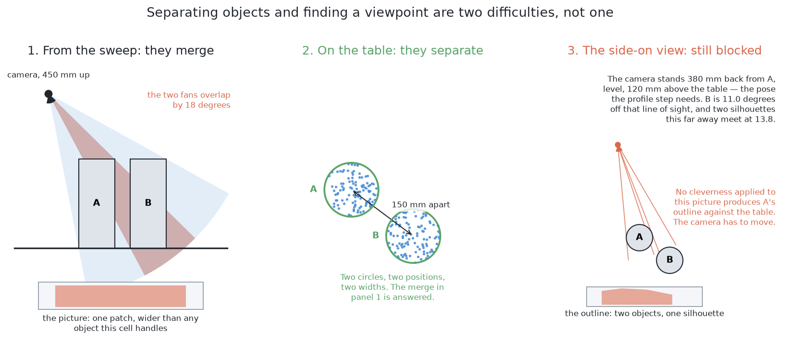
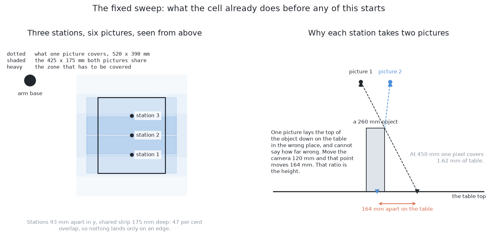
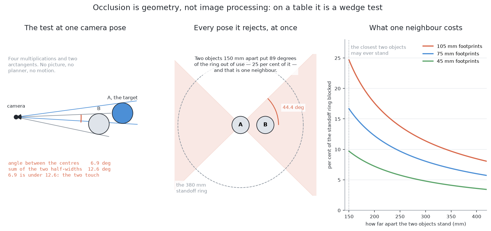
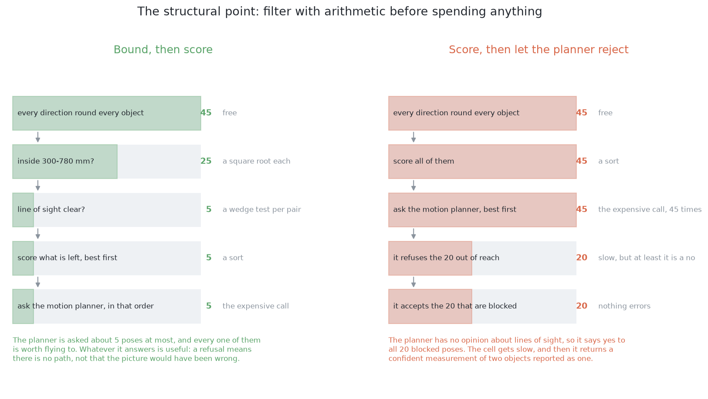
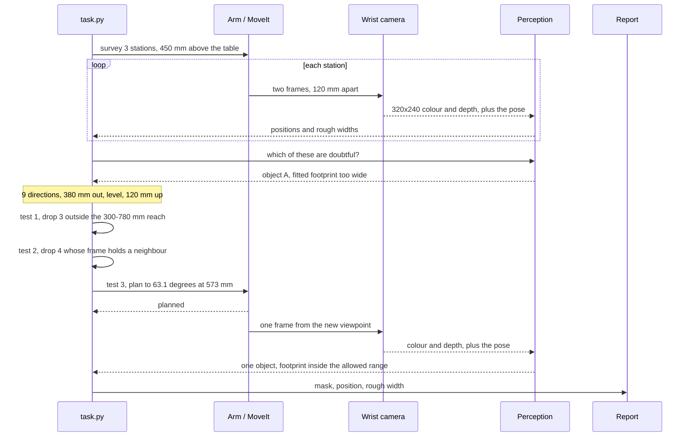
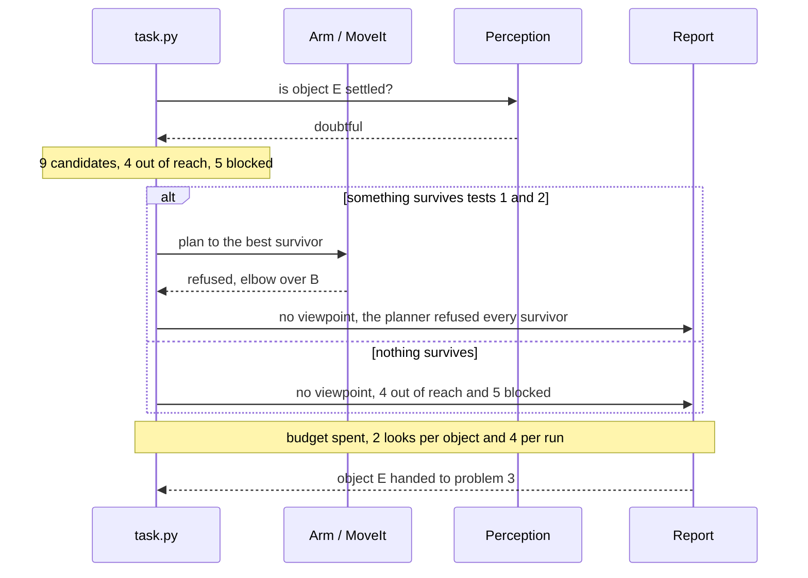
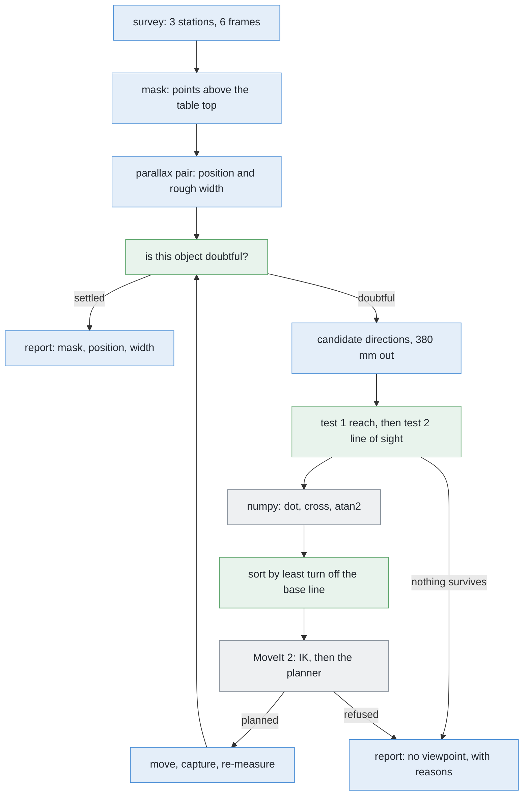
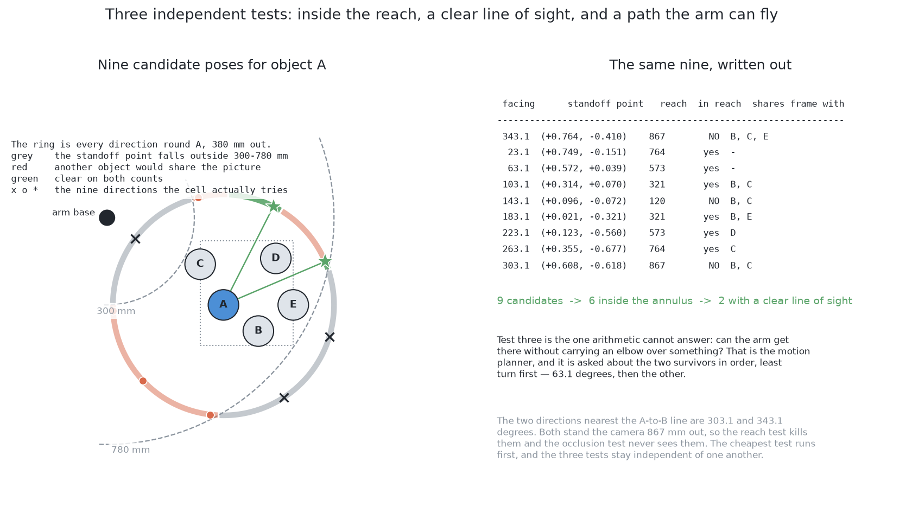
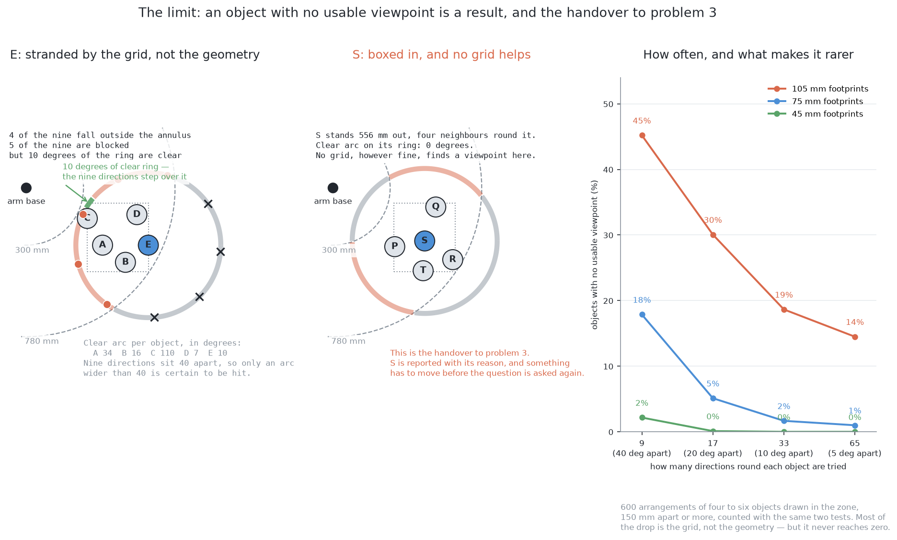
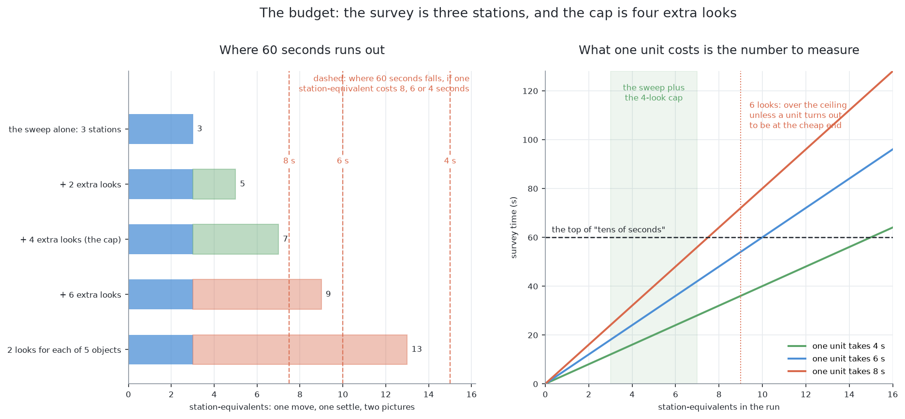

# Solution 3 — move the camera

*Programmed, and a loop. Instead of working harder on the pictures you happen to
have, go and take better ones. Choose where to stand with a rule you can print.*

> **The cell is described once, in [the cell](../../the-cell.md)** — the layout,
> the two camera poses, all four sensors, and the words this project uses them
> with. What follows is only what is specific to this solution.

## In one paragraph

A camera that can move is a different instrument from one that cannot, and this
solution treats it that way. Separating objects and finding a viewpoint are two
different problems. If one object stands behind another, no amount of processing
will produce the side-on outline the next step needs. The information was never
captured. So the arm goes and stands somewhere better. Three separate tests
decide where: a clear line of sight, a standoff point inside the arm's 300 to
780 mm working reach, and a path the arm can actually fly. The first two are
arithmetic, so they run before the motion planner is asked anything. An object
with no viewpoint left is not an error. It is the handover to problem 3.

## The problem this solves

[`problem.md`](../problem.md) asks for one set of pixels per object, a place on
the table for each, and an honest list of the ones that could not be separated.
The objects in this cell are drinking glasses, but nothing in this solution
depends on that, so we say "object" except where the cell itself is meant.

The problem statement names two difficulties. The point worth pressing is that
they really are **two**, not one problem wearing two hats.



**The first difficulty is the merge.** A camera in line with two objects sees
their outlines overlap, and the flood fill returns one patch.
[Solution 2](solution-overview.md#solution-2--cluster-on-the-table) answers it:
throw the pixels back onto the table as points, group them there, and two
objects 150 mm apart come apart cleanly.

Where the merge happens is not where people expect, and we measured it rather
than assuming. Looking straight down from the 450 mm survey height it does not
happen at all. Across 4320 legal arrangements — four kinds, six sizes each,
spacings from 150 to 300 mm, every angle — with both objects wholly inside one
320 × 240 frame, **none merged**. A survey frame holds 520 mm of table, but only
about 358 mm at the height of a rim. So a legal pair is either clearly separate,
or one of the two is falling off the edge of the frame. The merge belongs to the
**level view** — 380 mm back, level, 120 mm above the table, which is the pose
the profile measurement needs. There, 132 of 168 in-line pairs come back as one
patch.

**The second difficulty is the one this solution exists for, and it is the
bigger of the two: an object can have no clear viewpoint at all.** On the nine
directions, 40 degrees apart, that the cell tries today, **45 per cent of
objects have no usable viewpoint**. At 5 degrees it is 14 per cent. That is
counted over 600 drawn arrangements at the widest footprint the cell handles.
Most of that 45 per cent is the grid running out, not the geometry. The rest is
objects genuinely boxed in by their neighbours.

**Nothing you do to the picture fixes that**, and that is why this solution is a
separate thing from solution 2. The difference is worth stating carefully.

Separating objects in a picture is a question about *labelling*: which pixel
belongs to which thing. The information needed is often still in the picture —
in the depth channel, in the shading, in the width of the patch. Clustering on
the table recovers it, because the depth reading survives being photographed.

Finding a viewpoint is a question about *what got measured at all*. The profile
step reads an object's outline against the background, row by row, and turns
rows into heights. If a second object stands in the same part of the frame, the
outline is the outline of two objects stuck together. No cleverness recovers
where one stopped and the other started, because that measurement was never
taken. The only fix is to take a different one.

So: separation is about interpreting a measurement. Viewpoint is about making a
good one. The two barely overlap, and a cell that answers only the first has
answered half the problem.

## How it works, end to end

If you cannot see something from where you are standing, walk round. That is the
whole idea. The work is in choosing where to walk to, and the useful surprise is
that most of the choosing is arithmetic rather than image processing.

### The setup

The table top is at 750 mm, and it is the plane every height in the cell is
measured from. The arm is fixed to the near edge and reaches out along +x. The
objects stand in a zone 320 mm by 360 mm, at x from 320 to 640 mm and y from
−440 to −80 mm. The drying rack is on the other side of the table, far enough
away that it is never behind a survey picture.

Four to six objects stand in that zone. All one known kind, upright, solid, at
least 150 mm apart. Their footprints run up to 105 mm across and they are 65 to
230 mm tall — but the cell is not told any of that. Sizes are measured during the
run. The only size written down is the 260 mm tallest that the frames are sized
against.

The camera is an RGB-D camera fixed to the wrist, 85 mm to one side of `tool0`
and 15 mm up, looking the way the fingers point. Because it rides on the wrist,
putting the camera somewhere means putting the whole arm somewhere.

**Known in advance:** the table height, the lens, the arm's comfortable working
reach of 300 to 780 mm measured flat on the table, and the kind of object.
**Not known:** how many objects, where they stand, how wide they are, how tall.

Every object the survey finds also goes into the MoveIt 2 planning scene as a
cylinder, so a path that would sweep an elbow through one is refused.

### The pictures

Two kinds of picture are taken. This solution only adds the second kind.



**The survey**, which runs first and is not this solution's. The camera works
out from its own lens how much table one picture covers at the 450 mm survey
height — 520 by 390 mm, which is 1.62 mm per pixel. Then `survey_stations()` in
`arm/dimensions.py` spreads as few stations as will cover the object zone with
overlap to spare. For this cell that is three, in a line at x = 480 mm, 93 mm
apart in y.

The useful part of a station is not the whole picture. It is the strip that both
of its pictures share, 425 by 175 mm. With 93 mm between stations, 47 per cent of
that strip is shared with the next station, so nothing lands only on an edge.

Each station takes **two** pictures, 120 mm apart, not one. Here is why. One
picture from above cannot say how far away anything is. It can only lay each
outline down flat on the table — and an object stands *above* the table, so the
laid-down point gets pushed outwards. Now move the camera 120 mm sideways. The
top of a 260 mm object lays down 164 mm away from where it did in the first
picture. The ratio between those two numbers gives the height, and the height is
what fixes the position.

So: six pictures, from three places, before any of this solution runs.

**The extra look**, which is this solution's. For one doubtful object, the camera
goes 380 mm from it, level, 120 mm above the table, facing it from a direction
the three tests below have cleared.

The 380 mm is not a constant. The camera looks level from 120 mm up, so the frame
has to reach 120 mm down to catch the foot, and 140 mm up to catch the rim of the
260 mm tallest object the cell allows for. Both of those are angles, so how far
back that puts the camera is a fact about the lens. Half a frame is
120 / 277.1 = 0.4331 of a radian. Take 85 per cent of that, as a margin for the
arm not arriving exactly where it was sent. Then 140 / (0.4331 × 0.85) comes to
**380 mm**. One pixel there covers 380 / 277.1 = 1.37 mm of the object.

Two details of this cell bite, and both are easy to get wrong.

**The camera is not the tool.** Sending `tool0` to the standoff point puts the
camera 85 mm away from it, and the offset turns with the tool. So
`_measure_from()` commands `eye - rotation @ CAMERA_OFFSET` rather than `eye`.

**The roll has to be pinned.** The profile is measured row by row, and a row
means a height. Looking level along the table, the default "up" hint gives a
different roll depending on which side of the object the arm stands on — which is
exactly the thing that varies here.

### What each picture captures

The sensor returns a 320 by 240 colour frame and a 320 by 240 depth frame at
15 Hz, through the same lens: a 60-degree field of view, so fx = fy = 277.1
pixels, with the depth clipped at 50 mm near and 3 m far.

The cell keeps three things from each capture.

- **The depth frame**, which is what everything else is built from. Colour is
  only used for the pictures in the report.
- **The mask.** `standing_on_the_table()` marks a pixel yes where the point there
  is above the table top and no taller than 260 mm. That is also what keeps the
  arm's own fingers out of its own pictures. For a side-on look the mask is
  banded as well, to within 120 mm either side of the standoff, which drops the
  rack and anything standing behind the target.
- **The pose** — the 4 × 4 transform that puts a pixel in the room. It is taken
  from where the camera really was, not where `tool0` was sent, because the 85 mm
  offset would otherwise go straight into every reported position.

### What is interpreted, and how

The chain runs in this order.

1. **Mask, then connected components.** `find_glasses()` groups the yes pixels
   that touch, one patch per candidate object, and lays each patch's widest part
   down on the table.
2. **Parallax, per station.** `where_they_stand()` compares the pair of pictures.
   A laid-down point moves by `d / k` when the camera moves by `d`, where
   `k = (H − h) / H`. So the apparent movement measures the height `h`, and the
   height gives back the true position and the true width. An object caught in
   only one of the two pictures cannot be placed, and is left for another
   station.
3. **Doubt.** An object whose fitted footprint is wider than any single object of
   this kind can be, or that only one station ever saw, is doubtful. Anything
   inside the allowed range is settled and gets no extra look.
4. **Candidates.** `_standoffs()` in `task.py` lists directions round the
   doubtful object, each one putting the camera 380 mm from it, level, 120 mm up.
   Today that is nine directions 40 degrees apart, centred on the line back to
   the arm's base.
5. **Test 1 — reach.** Drop the candidates whose standoff point falls outside 300
   to 780 mm from the base, measured flat on the table. Closer and the arm is
   folded over itself. Further and it is stretched straight out with nothing left
   for the wrist. Cost: one square root.
6. **Test 2 — line of sight.** Drop the candidates where another object would
   share the frame. Cost: a handful of arithmetic operations per pair.
7. **Test 3 — the path.** Ask MoveIt 2, best first, and take the first that
   plans. Cost: far more than the other two, and it is the only test that can
   fail for reasons no formula predicts.
8. **Move, capture, re-measure**, and merge the new sighting into what the survey
   already had. If nothing survives tests 1 and 2, report the object with its
   reason and stop.

A viewpoint has to pass all three tests. Passing two is worth nothing.

#### Why the line-of-sight test is arithmetic



This is the test people expect to be hard, and it is not, because of one fact
this problem hands over free: **every object's footprint is a circle of known
size, standing on a known plane.**

From a camera at a given point, each object fills a certain angle of the frame.
Half of that angle is `atan(r / d)`, where `r` is the radius and `d` is how far
away it is. Two objects share the frame when the angle between their centres,
measured at the camera, is smaller than the sum of their two half-angles.

That is one cross product, one dot product and three arctangents. No picture is
involved. `_blocked()` in `task.py` already computes it.

Judging it as an *angle at the camera*, rather than as a distance from the line
of sight, matters more than it looks. An object well off to one side but twice as
far away fills the same part of the frame as one just beside the target. A
sideways-distance test would wave it through.

Note also what the test deliberately does *not* check: whether the other object
is **nearer** than the target. The profile measurement reads an outline against
the background, so an object behind the target ruins the outline exactly as
thoroughly as one in front of it.

Now ask the same test of every direction at once, and something nice happens: the
distance drops out. Sit a long way `D` from a pair of objects `d` apart, at an
angle `θ` off the line joining them. The angle between them at your eye shrinks
like `d·sin(θ)/D`, while their combined angular width shrinks like `(rA + rB)/D`.
`D` cancels. What is left is a statement about direction alone:

    the pair overlap when   sin(θ) < (rA + rB) / d

So each neighbour casts a **wedge** of blocked directions, of half-angle
`asin((rA + rB) / d)`, along the line joining the two objects and along its
opposite. With the equal footprints of one known kind that is `asin(2r/d)`.

Put numbers in. Two objects at the closest spacing the problem allows, 150 mm,
with the widest footprint the cell handles, 105 mm, give a half-angle of 44.4
degrees. That is 89 degrees of blocked directions — a quarter of the circle —
**from one neighbour**. With four neighbours and a reach limit as well, running
out of viewpoints is something to plan for, not a freak event.

#### Why the tests run in that order



Two orderings of the same work, with the counts from the five-object arrangement
used later in this document.

On the left: list every candidate, drop the unreachable, drop the blocked, sort
what is left, and only then call the motion planner. Forty-five candidates become
twenty-five, become five, and the planner is asked at most five questions — every
one about a pose worth flying to.

On the right: sort all forty-five and let the planner sort it out. The obvious
cost is speed: the expensive call is now made up to forty-five times instead of
five. But the cost that matters is the other one.

**The planner has no opinion about lines of sight.** It refuses a path that would
sweep an elbow through a cylinder. But a camera pose that looks straight through
object B at object A is a perfectly good pose as far as it is concerned. It plans
to it, reports success, and the arm takes a picture with two objects in it,
measures them as one, and hands a confident wrong answer downstream. Twenty of
the forty-five candidates are like that.

So the failure mode of score-then-reject is **slow, and quietly wrong, with
nothing erroring** — the worst combination available.

The general rule behind the fix: **order the tests by what they cost, cheapest
first, and let each one shrink the set the next has to look at.** Arithmetic is
free. Inverse kinematics — working out whether a set of joint angles exists that
puts the hand at a given pose — is nearly free. The planner is not free. The arm
is the most expensive thing in the building.

There is a second benefit that is not obvious until you have the numbers. Because
the filter is nearly free, you can afford a much finer set of candidate
directions than you would otherwise dare to list. That is where most of the 45
per cent goes.

#### What is left to score

Once the filter has run, whatever survives is safe to visit, and scoring only
decides the order. That bounds what a bad score can cost: one wasted move, not a
wrong measurement.

For this cell the score is a rule, not a model. Prefer the viewpoint whose frame
holds the doubtful object and nothing else — after the filter every survivor
already satisfies this, so in practice it breaks ties. Then prefer the least turn
away from the line back to the arm's base, because standing between the object
and the base is the direction with the least reach in it.

The textbook alternative is **information gain**. Carve the room into small
cubes, mark each free, occupied or unknown, cast a ray per pixel from each
candidate pose, and count how much unknown volume the picture would resolve.
[OctoMap](https://octomap.github.io/) (Hornung et al., *Autonomous Robots*, 2013)
is the standard implementation of the map, and MoveIt 2 already keeps one. Isler
et al. (ICRA 2016) and Delmerico et al. (*Autonomous Robots*, 2018) work through
the variants. It is all CPU ray casting, so it needs no graphics card.

It is more than this cell needs, and the reason is the shape of the doubt.
Information gain is the right score when you do not know what you are looking
for. Here the doubt is a short list of named questions — *is that 260 mm patch
one object or two?* — and a score that answers a named question beats one that
measures unknown volume in general.

### What comes out

For every object the run placed: a **mask** saying which pixels in which picture
are that object, a **position** in millimetres from the arm's base, and a **rough
footprint width** in millimetres. For every object it could not place: the
object, and which of the three tests each candidate failed, with the numbers.

Three consumers take it. Problem 1's step 2 takes the cleared viewpoint and
measures the profile from it, unchanged.
[Problem 3](../../problem-3/problem.md) takes the objects with no viewpoint,
because moving something is the only remaining fix. `report.py` writes both lists
into the run folder, with the pictures they came from.

## The sequence

The normal path: the fixed sweep, one doubtful object, one extra look that
settles it.



The interesting path: an object with nothing left to try. The budget caps the
loop at two looks per object and four per run, and an object with no viewpoint is
reported rather than guessed at.



## In pseudocode

The pipeline, coloured by who owns the code.



Legend: **green** is new code written for this solution, **blue** is code the
project already has, **grey** is a third-party library.

The method, as code that does not compile:

```text
found = task.survey(GLASS_ZONE)                      # have  · work_cell.task._survey
doubtful = [d for d in found if not settled(d)]      # NEW   · ~10 lines, numpy

for target in doubtful[:FOUR_PER_RUN]:               # NEW   · the run-wide budget
    others = [d for d in found if d is not target]   # NEW   · plain python
    eyes = standoffs(target, others, step_deg=5.0)   # have  · work_cell.task._standoffs
    eyes = [e for e in eyes if in_reach(e)]          # have  · work_cell.arm.dimensions
    eyes = [e for e in eyes if unblocked(e)]         # have  · work_cell.task._blocked
    eyes = sorted(eyes, key=turn_off_the_base_line)  # NEW   · numpy

    if not eyes:                                     # NEW   · nothing left to try
        report.no_viewpoint(target, why=reasons)     # have  · work_cell.report
        continue                                     #       · handed to problem 3

    for eye, turn in eyes[:TWO_PER_TARGET]:          # NEW   · the per-object budget
        if not arm.move_to(eye - turn @ CAM_OFFSET): # have  · work_cell.arm.motion
            continue                                 #       · the planner refused it
        view = camera.capture()                      # have  · work_cell.arm.camera
        mask = standing_up(view, near=0.38)          # have  · work_cell.glasses.detect
        seen = find_glasses(mask, view.to_world)     # have  · work_cell.glasses.detect
        found = merge_sightings(found + seen)        # have  · work_cell.glasses.detect
        break                                        #       · one look is enough

report.write(found, still_doubtful(found))           # have  · work_cell.report
```

Everything new is arithmetic. `_standoffs()` already does the reach test and the
ordering. The only change to it is `step_deg`, from 40 down to 5. The budgets,
the doubt test and the refusal are a few dozen lines of NumPy on top of what
`task.py` already has.

| Library | What it does here | Already in the pixi environment? | Licence |
| --- | --- | --- | --- |
| [NumPy](https://numpy.org/) | the three tests, the sort, the circle fit | **yes** | BSD 3-Clause |
| [OpenCV](https://opencv.org/) | drawing the mask and the marks onto the report's pictures — not the labelling, which `detect.py` does in NumPy on purpose | **yes** | Apache 2.0 |
| [MoveIt 2](https://moveit.ai/) ([source](https://github.com/moveit/moveit2)) | inverse kinematics in milliseconds, then the motion planner; holds the planning scene the objects go into as cylinders | **yes** | BSD 3-Clause |
| [ROS 2 Jazzy](https://docs.ros.org/en/jazzy/) | the plumbing between the camera, the arm and `task.py` | **yes** | Apache 2.0 |
| [Gazebo](https://gazebosim.org/) (Harmonic) | the simulator | **yes** | Apache 2.0 |
| [OctoMap](https://octomap.github.io/) ([source](https://github.com/OctoMap/octomap)) | only if the score were ever upgraded to information gain | **no** | BSD for the library; the `octovis` viewer beside it is GPL |
| [nbvplanner](https://github.com/ethz-asl/nbvplanner) | reference next-best-view planner, Bircher et al., ICRA 2016 | **no** | uncertain — read the repository before depending on it |

No PyTorch, no SciPy, no scikit-learn. Nothing in the built version of this
solution is outside what the cell already installs.

## A worked example

Five objects in the zone, none nearer than 150 mm to another, which is the
closest the problem allows:

| | x (m) | y (m) | from the base |
| --- | --- | --- | --- |
| A | 0.40 | −0.30 | 500 mm |
| B | 0.52 | −0.39 | 650 mm |
| C | 0.32 | −0.16 | 358 mm |
| D | 0.58 | −0.14 | 597 mm |
| E | 0.64 | −0.30 | 707 mm |

A and B are 150 mm apart. B and E are 150 mm apart. Nothing else is closer than
160 mm. All five footprints are taken at 105 mm, the widest the cell handles,
which is the hardest case.

### Object A, which has a viewpoint



The ring in the left panel is every direction round A at 380 mm, coloured by what
it fails. Grey where the standoff point falls outside the 300 to 780 mm ring. Red
where another object would share the picture. Green where it passes both. The
nine crosses, circles and stars are the nine directions the cell actually tries.
The table on the right is the same nine written out.

**Three fail on reach alone.** Standing between A and the base, facing 143.1
degrees, puts the camera at (0.096, −0.072), which is **120 mm** from the base.
That is well inside the 300 mm minimum, so the arm would be folded over itself.
The two directions nearest the A-to-B line, at 303.1 and 343.1 degrees, both put
it **867 mm** out, past the 780 mm limit. Those three never reach the occlusion
test at all: the cheapest test spends the least and removes a third of the
candidates.

**Four of the six that remain are blocked.** Facing 103.1 degrees, at 321 mm,
both B and C land in the frame. Facing 183.1 degrees, also 321 mm, B and E do.
Facing 223.1, D does. Facing 263.1, C does.

**Two survive:** 63.1 degrees at 573 mm, and 23.1 degrees at 764 mm. Sorted by
least turn, the planner is asked about 63.1 first. If it plans, the arm flies
there and takes the picture. If it does not — an elbow over B, say — the planner
is asked about 23.1. If that fails too, A has no viewpoint, and A is reported
rather than guessed at.

Nine candidates, six inside the ring, two clear, one planner call in the good
case. Across all five objects the same arithmetic gives **45 candidates, 25
inside the ring, 5 clear**: 20 die on reach, 20 die on occlusion, 5 survive. That
5 out of 45 is the number in the bound-then-score picture above.

One detail worth noticing. The exactly perpendicular direction to the A-to-B
line — the one you would reach for by hand — is at 53.1 degrees. It is not one of
the nine, because the nine sit on a 40-degree grid. The nearest candidate, 63.1
degrees, is 10 degrees off it and works fine. But this is the first hint that the
grid, and not the geometry, is what decides some of these cases.

### Object E, which has none



The left panel is object E. Four of its nine directions fall outside the ring,
five are blocked, and none survives. So on the grid the cell uses, E is handed to
problem 3.

But look at the ring. There is a 10-degree stretch of green on it, and the nine
directions, sitting 40 degrees apart, step straight over it. **E is stranded by
the grid, not by the geometry.**

That is not an isolated accident. The clear arcs for the five objects here come
to: A 34 degrees, B 16, C 110, D 7 and E 10. With nine directions 40 degrees
apart, the only arc *guaranteed* to be hit is C's. The others are hit or missed
depending on where the grid happens to fall.

The fix is free, and it is the second benefit of bounding before scoring. The
filter is arithmetic, so the candidate set can be made as fine as you like:
seventeen directions, thirty-three, sixty-five.

The right panel counts what that buys, over 600 arrangements of four to six
objects drawn in the zone at the problem's own spacing rule. With 105 mm
footprints, going from 9 directions to 65 takes the share of objects with no
usable viewpoint from 45 per cent to 14. With 75 mm footprints it goes from 18
per cent to 1. With 45 mm footprints the problem has essentially vanished by 17
directions.

Two things follow. **Most of the 45 per cent is the grid, and refining the grid
costs nothing but arithmetic.** That is the single cheapest improvement available
here, and the first thing to do.

And it never reaches zero. In the middle panel, object S stands 556 mm out with
four neighbours round it, and its ring has **no clear direction at all**, at any
resolution. No grid helps. Something has to move.

That is the handover to [problem 3](../../problem-3/problem.md), and it is a
result rather than an error. The right output is the object, the reason, and a
stop — never an attempt made anyway. This is the rule the whole project runs on:
a refused object is a result, and a fallback that has the arm try regardless is
how neighbours get knocked over.

## The feedback loop

This solution has a real loop, which is what separates it from
[solution 1](solution-overview.md#solution-1--split-the-blob-in-the-picture) and
[solution 2](solution-overview.md#solution-2--cluster-on-the-table). It takes a
measurement, works out what is still unclear, decides where it would have to look
for that to become clear, goes and looks, and repeats.

A loop needs three things, and a solution with only two of them is not a loop.

- **Something to be unsure about.** The circle fit from solution 2 provides it.
- **Somewhere to go that would help.** The candidate poses, filtered by the three
  tests. And if the filter returns nothing, that fact is itself the answer.
- **A budget**, because the loop has to stop.



The unit on the left panel's axis is a **station-equivalent**: one plan, one
move, one settle, and the two pictures 120 mm apart that the parallax needs. That
is about what one more survey station costs, which makes it the natural unit and
saves inventing a number for the move itself. The sweep is three of them. An
extra look is one more.

What a unit costs in seconds is the one number that has to be measured rather
than argued about, and it should be timed from `_survey()`. The right panel says
why it does not much matter which of the plausible values it turns out to be. The
ceiling is "tens of seconds" — call it 60 for the sake of drawing a line. At 4
seconds a unit, 60 seconds buys 15 units. At 6 seconds, 10. At 8 seconds, 7.5.

Against that:

- the sweep alone is **3 units**, and fits under every one of those;
- the sweep plus a cap of **four extra looks is 7 units**, a little over twice
  the survey on its own, and still under every one of them;
- six extra looks is **9 units**, which fits at 4 or 6 seconds a unit and breaks
  the ceiling at 8;
- two looks for each of five objects is **13 units**, which breaks it at every
  value.

So the cap is four: the largest budget that fits whatever a unit turns out to
cost. Six would be a bet on the measurement coming out at the cheap end, and
there is a reason not to place that bet. The objects that most want a second look
are the crowded ones, and crowding is exactly what removes their viewpoints. So
the extra budget is the part most likely to be spent on looks that get refused.

Alongside the run-wide cap of four goes a per-object cap of **two**, so that one
object cannot eat the whole budget. Without it, a single stubborn cluster pulls
look after look and the run never ends. And a cluster is usually stubborn because
of where its neighbours are, which no number of looks will change.

The loop stops when nothing is doubtful, or when the budget is spent. Whatever is
still doubtful then is **reported as doubtful**, not guessed at. A report that
says "these two could not be separated, here is why" is a result. A report that
guesses is a failure that looks like a result.

One number is worth logging from the start: **how many extra looks were spent,
and how many changed the answer.** A loop whose extra looks never change anything
is a loop worth deleting, and you will not know which you have until you count.

## What it needs

**Data.** None. There is nothing to train and no weights to keep in step with the
world. Every number in this document comes out of the cell's own dimensions.

**Hardware.** The depth camera and the arm. No graphics card. Everything here runs
on an Apple Silicon Mac with no NVIDIA card, which is the rule the whole overview
is written under.

**A belief to start from.** This is the one real prerequisite, and it is a
chicken-and-egg problem. You cannot predict what a viewpoint would show without
knowing roughly what is on the table, and knowing what is on the table is the
job. The fixed sweep supplies it. It assumes nothing, covers the zone, and hands
back a coarse map, and this solution runs only on the doubtful entries in that
map. It is the tail of the survey, not a replacement for it.

(The other way out is to score unknown volume rather than named objects, which
works from nothing, because at the start everything is unknown. That is what
exploration planners do, and it is the right answer where there is no opening
sweep to build on.)

**Time.** Seconds of arm motion per extra look, capped at four per run.
Microseconds of arithmetic per candidate. The arithmetic is free and the arm is
not, which is the whole reason the ordering is what it is.

## Where it is strong and where it breaks

**Strong**

- Fixes merges caused by where the camera stood, and changing where it stands
  costs seconds and no risk.
- You can audit it: a refusal names which of three tests each of nine candidates
  failed.
- Costs nothing when it is not needed, and never invents an answer.

**Breaks**

- Spends arm time, the cell's dearest resource. Two looks each for six objects is
  twelve extra stations, four times the survey.
- Heavier than needed. The filter alone gets most of the benefit, and the loop
  wants a better measure of doubt —
  [solution 5](solution-overview.md#solution-5--a-learned-verifier-over-the-clusters).
- Occlusion is predicted from the survey's footprint circles, so a mis-measured
  outline sends the arm to a viewpoint that is not clear.
- Without the per-object cap it thrashes.
- The planner can refuse every survivor.
- Some objects have no clear direction at any grid resolution. That is problem
  3's business, not an error.
- It assumes depth works. Real glassware reads badly on a depth camera and leaves
  no belief to reason about.

**Right when** a viewpoint is cheap to score and dear to visit, and the doubt has
a name. Both of those fail at [problem 4](../../problem-4/problem.md), where a
volume-based score earns its weight. Build the filter with a fine candidate set
first, about twenty lines. Add the loop later. It answers a different difficulty
from **cluster on the table**, and it is the baseline under the three solutions
that replace only its score.

## The general methods behind this

This solution is an example of a named research programme, not a trick. The idea
that a camera should be *moved on purpose* rather than read passively has forty
years of literature behind it, and the pieces below are the standard vocabulary.

### Active perception — treating the sensor's pose as something to choose

Classical vision takes a picture as given and asks what can be recovered from it.
**Active perception** (Bajcsy, *Proceedings of the IEEE*, 1988) and **active
vision** (Aloimonos, Weiss and Bandyopadhyay, *IJCV*, 1988) turn that round: the
observer controls the sensor, so the question becomes *where should I look next?*
Problems that cannot be answered from one viewpoint are often easy from two.

- **Mostly used for** robots with the sensor on a movable body — arms, mobile
  bases, drones, pan-tilt heads — and for inspection, where an object has to be
  checked from several sides anyway.
- **Rarely right for** fixed installations where moving is impossible, or slow
  compared with the value of the answer: a conveyor line at speed, a static
  security camera, or any case where an extra viewpoint costs more than being
  wrong occasionally.
- **More:** [active perception](https://en.wikipedia.org/wiki/Active_perception).

### Next-best-view planning — scoring viewpoints before visiting them

List candidate poses, predict what each would reveal, take the best, and repeat
until the gain stops being worth the move. The first version of this is
Connolly's *The Determination of Next Best Views* (ICRA, 1985), and the field has
run on variations of it since.

- **Mostly used for** 3D reconstruction and inspection, where coverage is the
  goal and the object is unknown: scanning a part, mapping a room, exploring with
  a drone.
- **Rarely right for** scenes small and known enough that a fixed sweep covers
  everything anyway. Planning a viewpoint costs thought; visiting three fixed
  ones may cost less. *This cell sits on that line*, which is why the score here
  is a printed rule rather than a calculation of information.
- **More:** [nbvplanner](https://github.com/ethz-asl/nbvplanner), an
  implementation for aerial exploration.

### Occupancy mapping and ray casting — reasoning about what is hidden

Divide space into cells, mark each free, occupied or unknown, and trace rays from
a candidate camera to see which unknown cells it would resolve. **OctoMap**
(Hornung et al., *Autonomous Robots*, 2013) is the standard implementation: a
tree structure that keeps the memory use tolerable.

- **Mostly used for** mobile robots and drones, where "what have I not seen yet"
  is the whole task, and as the layer underneath most next-best-view scoring.
- **Rarely right for** a small scene of a few known objects, where a handful of
  geometric tests answer the same question exactly and far more cheaply. A 5 mm
  grid over this cell's zone is about three million cells, to decide what five
  circle-versus-wedge tests already settle.
- **More:** [occupancy grid mapping](https://en.wikipedia.org/wiki/Occupancy_grid_mapping);
  [OctoMap](https://octomap.github.io/).

### Bounding a search by feasibility before scoring it

Not a vision method but a structural pattern, and the one most often got wrong:
put the hard constraints *inside* the search rather than filtering afterwards.
Listing viewpoints, ranking them by how much they would reveal, and only then
discovering the arm cannot reach them is how a cell becomes slow and unreliable
with nothing ever erroring.

- **Mostly used for** any pipeline where candidates are cheap to generate and
  expensive to execute: grasp planning, motion planning, view planning.
- **Rarely wrong**, which is why it is worth stating. The only cost is that the
  feasibility test must itself be cheap — here inverse kinematics at
  milliseconds, before the motion planner at tens of milliseconds.

---

← [The problem](../problem.md) · [Solution overview](solution-overview.md) ·
[Problem 3 — moving them apart](../../problem-3) →
