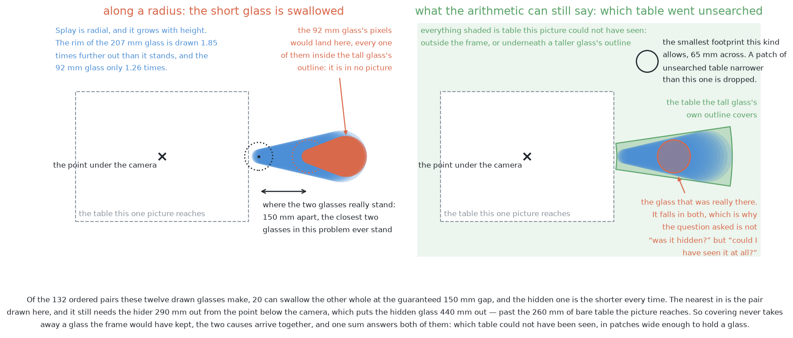
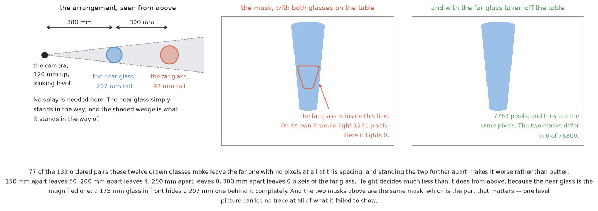

# Solution 4 — learned doubt steers the next picture

*Hybrid, with the model as a ranker. The fixed sweep happens first. Then a
learned estimate of how unsure each object is decides which extra picture is
worth taking, from candidate poses the geometry has already filtered.*

> **The cell is described once, in [the cell](../../the-cell.md)** — the layout,
> the two places the camera works from, from the top and from the side, all four
> sensors, and the words this project uses them with. What follows is only what
> is specific to this solution.

## Introduction

This document explains how a trained model can be given a useful job in this
cell without ever being allowed to make a decision that matters. The problem it
addresses is that the arm cannot look everywhere, because every extra viewpoint
costs seconds, so something has to choose which extra picture is worth taking.
The idea here is to let the geometry decide which places the camera is *allowed*
to stand, and to let a learned number decide only the *order* in which the
allowed places are tried. By the end you will understand what a doubt number is,
the one case it has to catch and usually does not, why the doubt has to be a
list of measurements rather than a single number from the model, what this
method can and cannot do about a glass that appears in no picture at all, and
why the ordering of the steps is what limits the damage when the learned part is
wrong.

That last point is the heart of it. Everything in this design is arranged around
one failure, which is a model that is **confident and wrong**.

## The problem this solves

The situation is the same one the earlier solutions face. Four to six glasses
stand on the table, all of one known kind, upright and solid, never closer than
the smallest gap this problem promises between their centres. The arm has to say
which pixels belong to which glass, where each one stands, and how wide its
footprint is, and it has to say honestly which glasses it could not separate.

Three things get in the way, and they are different problems.

The first is that **two glasses can hide each other**. If the camera stands in
line with both, the near one covers part of the far one, so the picture no
longer holds the fact that would have separated them, and no amount of work on
that picture puts it back.

The second is that **a glass can be absent from a picture altogether**. Because
one kind spans a shot glass to a large tapered glass, a tall glass's outline can
be thrown outwards far enough to cover a short one completely, and then the
short glass produces no pixels at all. What this solution can do about that
case, and where it can do nothing, is [its own section
below](#when-the-glasses-are-completely-hidden).

The third is that **the camera can no longer stand wherever it likes**. It is
mounted on the wrist, so choosing where it stands means choosing where the whole
arm stands. A viewpoint has to clear the line of sight, the arm's own reach, and
the motion planner, all at once. With five glasses on the table, a glass can end
up with no usable viewpoint at all. [Solution
3](03-move-the-camera.md) works through that problem
in detail, and this solution keeps its whole structure.

The problem statement also names the failure to watch hardest, and it is worth
keeping in view for the rest of this document: **two real glasses reported as
one**. A glass split into two looks wrong immediately, because both halves are
too small to be glasses. A merged pair looks like one large glass, and
everything downstream believes it. That is exactly the case where a perception
step is confident and wrong, which is why nothing learned is allowed to decide
anything here.

## The main idea

The main idea is a division of labour, and the division is chosen so that the
learned part cannot do harm.

The geometry stays in charge of where the camera is **allowed** to stand. A
place to stand has to be reachable, it has to have a clear line of sight, and
the planner has to accept a path to it. All three of those are arithmetic or
nearly so, and all three run first.

A learned number then does the smaller job of saying which of the survivors is
worth the seconds. That number estimates how much doubt a look would remove. It
can never let in a pose the arithmetic rejected, and it can never declare an
object settled.


Notice in that picture that the count of candidates only ever falls. The learned
stage takes the survivors and hands back the same survivors in a different
order. That is what makes this a hybrid rather than a learned system, and it is
what guarantees that a wrong prediction costs **one wasted look** rather than a
wrong answer.

Because the whole design rests on the learned number, the next several sections
are about that number: what it is, what it has to catch, how it can be obtained,
and what has to be true of it before it is allowed to steer an arm.

## What a doubt number is

**Uncertainty** is a second number returned beside an answer, saying how far to
trust the first number.

Its shape depends on what the model was asked. For a **detection**, which is a
rectangle drawn round an object, the doubt is one number for the whole
rectangle. For a **segmentation**, which is a yes-or-no label at every pixel,
the doubt is one number per pixel, so the doubt is itself a picture the same
size as the original.

Three questions have to be asked of such a number before it is allowed to spend
arm time, and the next three sections are those questions.

### The one case it has to catch


There are three cases, and they are not equally important.

The first case is **confident and right**. Two masks over two glasses, with low
doubt. There is nothing to spend a look on, and the loop correctly spends
nothing.

The second case is **unsure and right**. Here the loop spends a look it did not
need. That costs seconds of arm time rather than correctness, and seconds are
the cheaper currency, so this case is a nuisance rather than a danger.

The third case is **confident and wrong**. One mask lying over two glasses, or a
mask covering only part of one glass, with low doubt attached. Nothing is
flagged, no look is taken, and the run reports a glass that is not where it says
it is.

Look at the third panel of that picture. The doubt is low and the answer is
wrong, and the bar looks exactly like the bar in the first panel, where the
answer was right. **A doubt number is only worth having if it catches the third
case**, and every method described later is best at the second case and worst at
the third.

Worse, in that third case the model's uncertainty is often *genuinely* low, and
it is worth understanding why, because the reason is not a flaw in the model.
The mask really is a perfectly good mask — of two glasses, or of part of one.
The model was asked which pixels are glass, and it answered that correctly.
Nothing in that question has any opinion about how many glasses there are, or
about how much of one glass you happen to be looking at.

So the doubt has to come from somewhere that does have an opinion about those
things, and in this cell that somewhere is the geometry: the circle fitted to
the footprint, and how much of that circle the points actually cover.

### Wrong is not the same as unusual


The second question separates two ideas that are constantly confused, and the
confusion matters because one of them is much easier to get than the other.

**Novelty detection** is high when the input looks unlike the training data.
**Error-awareness** is high when the answer is wrong, whatever the input looked
like. The loop wants the second, and the second is far harder.

Read the left-hand column of that picture. Both of those cells hold ordinary,
familiar-looking inputs. One answer is right and one is wrong, and no amount of
novelty detection tells them apart, because nothing about the input was unusual.
The two ideas coincide only where an unusual input also produces a wrong answer,
which is the corner most published work is scored on.

In this cell, every picture comes out of one simulator, through one camera, with
one kind of glass. So the unusual-input column is nearly empty, and novelty
detection buys almost nothing here. It starts buying a great deal at [problem
4](../../problem-4/problem.md), where the kind is no longer known, and where a
badly calibrated model is most confident precisely about the shape it has never
seen.

### Two kinds of not knowing

The third question asks whether another picture could even help, and there are
two established words for the answer.

**Aleatoric** doubt is noise in the measurement itself, and another picture will
not remove it. A genuinely blurred edge stays ambiguous however many times you
photograph it.

**Epistemic** doubt is the model not knowing, and a different picture can remove
it.

Only epistemic doubt justifies moving the arm, and this is the sentence that
makes the whole loop sensible rather than superstitious. A hidden glass is
epistemic almost by definition: the fact that would settle it exists in the
world, and it is simply not in a picture taken from in line with its neighbour.

## Five ways to get a doubt number

Having established what the number has to do, here are the practical ways to
obtain one. They differ far more in what they cost to train than in what they
cost to run.


The first is **predictive entropy**, which measures how spread out the model's
per-pixel probability is. Entropy is worth reading as a shape rather than as a
formula: it is largest when the model is exactly torn between its two answers,
and it falls away towards zero as the model becomes sure of either one. So a
large value means "no idea" and a small one means "sure". It costs one pass
through the network and no extra training, which is why almost everyone reaches
for it first. Its weakness is the one that matters here, because these outputs
are systematically overconfident ([Guo and
colleagues](https://arxiv.org/abs/1706.04599)), so a confidently wrong answer
comes back with confidently *low* entropy, which is exactly the third panel
above.

The second is **Monte Carlo dropout**. Dropout is a training trick that switches
off random parts of a network so that it does not lean too heavily on any one
part. The trick here is to leave it switched on when the model is *used*, run
the same picture several times, and read the spread of the answers ([Gal and
Ghahramani](https://arxiv.org/abs/1506.02142), with [Bayesian
SegNet](https://arxiv.org/abs/1511.02680) as the per-pixel version). It needs
several passes rather than one, and no extra training at all.

The third is **ensembles**. Train several copies of the network from different
random starts, and then read their disagreement. Where the copies agree, the
answer came from the data; where they disagree, it came from the random start.
[Deep ensembles](https://arxiv.org/abs/1612.01474) win most published
comparisons, and they multiply the training cost by however many copies you
train.

The fourth is **evidential and Bayesian deep learning**, where the network
predicts a distribution *over* probabilities rather than a single probability,
so one pass returns both the answer and how much evidence stands behind it
([Sensoy and colleagues](https://arxiv.org/abs/1806.01768), and [Amini and
colleagues](https://arxiv.org/abs/1910.02600) for continuous outputs). The cost
is a less familiar training objective, and the evidence strength then needs its
own calibration check.

The fifth needs **no model at all**, and for that reason it is the one to build
first. Segment both pictures of a station, project each onto the table, and
measure how far apart the two of them put the same glass. The two views should
agree to within the noise in a depth reading, so a disagreement several times
larger than that is not noise. It is a sign that one of the two views was
looking at something other than a whole glass. This costs nothing, because both
pictures are already paid for.

The comparison between these is easier than it looks, because of the cost
imbalance in this cell. Even a method that needs several passes through the
network is still thousands of times cheaper than one movement of the arm. So on
a machine with no dedicated graphics card, the choice between them is about
**training cost**, and not about what happens while the run is going.

## Calibration: what makes the number mean anything

A doubt number can behave correctly and still be useless, and calibration is the
property that separates the two.

A doubt number is **calibrated** when its claims come true about as often as it
says they will. If it says it is sure, it should usually be right. If it says it
is unsure, it should be wrong a fair share of the time. Anything else, and a
threshold placed on that number is a threshold on nothing in particular.


The gap between the curve and the dashed diagonal is the thing to look at. Where
the model claims to be almost certain and is in fact right only about two thirds
of the time, the loop is being talked out of exactly the looks it most needed.

Checking calibration is straightforward here, because the simulator knows what
it spawned. Run the pipeline over a few hundred spawned arrangements, sort every
prediction into bins by the confidence it claimed, and plot claimed against
observed. A curve below the diagonal is overconfident, which is both the usual
direction and the dangerous one. The single summary number is the average gap
between claim and outcome, weighted by how many predictions fell in each bin,
and that weighting matters because nearly all predictions claim high confidence.

The repair is cheap and standard. It is called **temperature scaling**, and it
divides the model's raw scores by one single number before they are turned into
probabilities, with that number fitted on data the model never trained on. It
does not make a wrong answer right. It makes the model's *claim* about that
answer honest, which is all the loop needs.

Until that plot exists for this cell, the doubt number is a rule of thumb that
happens to live in a weights file. That is an argument for measuring it rather
than an argument against fitting it, and the simulator makes the labels free.

## Why the doubt has to be a list

We now have everything needed to explain the most important design decision in
this solution, which is that the doubt is **several measurements rather than one
number**.

Start with the obvious design and see it fail. Suppose the score the model is
trained to predict is the expected drop in the model's own uncertainty. If the
perception step is confidently wrong, then there is no uncertainty to drop, so
every candidate scores near zero, and the ordering carries no information at all
— in exactly the case where the ordering was needed.

The repair is to make the doubt a list of measurements that come from different
places, and then to have the learned part predict how far that whole list would
fall. The list has five entries in this solution.

The first entry is the model's own doubt, as the average per-pixel entropy over
the group's mask. The second is pure geometry, owing nothing to the model: the
residual of the fitted circle, and whether its width is inside the range this
kind of glass can be. The third is also geometry, and it is the entry that
catches the case the model is blind to: how much of the circle the points
actually span, and how many points there are against how many a footprint that
size should give. The fourth is the model-free disagreement between the
station's two views, which is already paid for.

The fifth entry is different in kind from the other four, and it has to be there
because of the difficulty this problem added. **It is the unsearched area** —
how much table could not have been seen, in patches large enough to hold the
smallest glass of the kind, as computed by [solution
2](02-cluster-on-the-table.md)'s blind-region arithmetic. Why that entry is
necessary, what it buys and what it does not, is the subject of [when the
glasses are completely hidden](#when-the-glasses-are-completely-hidden) below.

Two properties of that list matter more than its contents.

The first is that a group is doubtful if **any one** of the entries fires. They
are combined with *or* rather than with *and*, so a silent model cannot suppress
a geometric complaint. If they were averaged into one number, a confident model
could quietly drown out the geometry.

The second is that where the model's own doubt is real it will dominate the
list, and where the model is confidently wrong the geometric entries still have
something to say, so the score still orders the candidates sensibly. **Making a
model's own confidence the sole currency of doubt is the mistake.** The geometry
has to be in the currency too.

### What the model is trained on, and where that comes from

The training data is free, which is the practical reason this is buildable at
all. Spawn an arrangement in the simulator. Run the survey. Note which groups
are doubtful and by how much. Pick a candidate pose, render the view from it,
run the geometry again, and measure how far the doubt actually fell. That gives
one training example — the state and the pose going in, the measured drop coming
out — with no arm moving and nobody labelling anything. A few thousand of them
is an overnight job.

## How the concepts fit together

Now the pieces can be put in order. The whole method is one loop, and the loop
only ever runs on objects the survey could not settle.

```mermaid
flowchart TD
    E1["survey from the top: cover the zone, assume nothing"] --> E2["mask, then points in the room, then flattened onto the table"]
    E2 --> E3["group the dots, fit a circle to each group"]
    E3 --> N1["build the doubt list: the entropy, the fit, the arc, the two views, the unsearched area"]
    N1 --> D{"is anything doubtful, and is there budget left?"}
    D -->|"no"| E5["report each glass, and whatever stayed doubtful"]
    D -->|"yes"| N3["list a fine ring of candidate poses round the worst one"]
    N3 --> E6["veto: reach, then line of sight, then can the arm hold the pose"]
    E6 -->|"nothing survives"| E5
    E6 -->|"survivors"| N4["rank them by the predicted drop in the doubt list"]
    L2["the model: one pass per survivor"] --> N4
    N4 --> E7["move to the best pose, then take several pictures"]
    E7 --> E2
    style E1 fill:#e4eef9,stroke:#4c8fd6,color:#22272e
    style E2 fill:#e4eef9,stroke:#4c8fd6,color:#22272e
    style E5 fill:#e4eef9,stroke:#4c8fd6,color:#22272e
    style E6 fill:#e4eef9,stroke:#4c8fd6,color:#22272e
    style E7 fill:#e4eef9,stroke:#4c8fd6,color:#22272e
    style E3 fill:#e8f3ec,stroke:#5aa469,color:#22272e
    style N1 fill:#e8f3ec,stroke:#5aa469,color:#22272e
    style N3 fill:#e8f3ec,stroke:#5aa469,color:#22272e
    style N4 fill:#e8f3ec,stroke:#5aa469,color:#22272e
    style D fill:#e8f3ec,stroke:#5aa469,color:#22272e
    style L2 fill:#eef0f2,stroke:#8b949e,color:#22272e
```

Green marks what this solution adds, blue marks work the project already does,
and grey marks the learned model.

Three things about that flow are worth saying in words, because they are the
substance of the design.

The first is that **the survey comes first and is not learned**. A method that
chooses its own viewpoints needs some belief about the world to choose the first
one from, and before the first picture there is none. So the survey spreads a
few stations over the zone from the top, overlapping them enough that a glass
cut off at the edge of one picture is well inside another, and takes two
pictures at each station a short slide apart. The slide is wide enough that a
glass visibly shifts between the two, which is what measures its height, and
narrow enough that both pictures still catch the same glasses.

The second is that **the extra looks are taken from the side**, with the camera
down low, standing back at the measuring standoff, looking level at the doubtful
object. That reuses the same standoff geometry the shape measurement needs, so a
look taken to settle a doubt is not wasted even when the doubt turns out to be
nothing, because it also serves the next step. Being level is the part that
matters, because level is the view in which two glasses standing apart on the
table either separate or fail to.

The third is that the last step is **a re-measure rather than a patch**. When
the new pictures come back, the grouping and the circle fitting run again over
everything, so a look aimed at one object can change the answer for an object it
was not aimed at.

Finally, notice where the learned step sits. The two steps that generate and
veto candidates are geometry, and they hold all the power to refuse. The learned
step only reorders a list the geometry has already approved. The model cannot
propose a pose, cannot re-admit one the geometry rejected, and cannot declare an
object resolved. **That is why a wrong prediction costs one wasted look rather
than a wrong answer.**

There is also a consequence worth noting about the camera being on the wrist.
Moving it costs seconds, while one more picture from where it already stands
costs milliseconds. That single imbalance drives the whole design, and the rule
it gives is short: **take more pictures from each place you go, and go to fewer
places.**

## The loop, and why it must have a budget


Follow the right-hand edge of that picture. There are three ways out of the
loop, and one of them is simply running out of time.

The loop itself is old. Bajcsy's *Active Perception* (Proceedings of the IEEE,
1988) made the argument that a camera which can move is not the same instrument
as one that cannot, and Connolly's *The Determination of Next Best Views* (ICRA,
1985) named the step that follows from it: given what has been seen, decide
which viewpoint comes next. This solution keeps that shape and changes only what
"next best" is scored on.

### The classical score, and why it is not used here

It is worth knowing the textbook score, because dismissing it without
understanding it would be a mistake.

The textbook score is **information gain over an occupancy map**. You cut the
room into cubes, store a probability of occupancy for each cube, and score a
candidate pose by how much of the map's total uncertainty that picture would
resolve (Moravec and Elfes, ICRA 1985, with OctoMap as the standard
implementation).

It is affordable here. The glass zone is small and the glasses are short, so a
grid fine enough to be useful comes to a few hundred thousand cubes. One
candidate casts one ray per pixel of the picture, and each ray crosses a few
tens of cubes, so that is a few million cube visits per candidate, which is
milliseconds of work. The whole ring of candidates still finishes well inside a
second, and the motion planner already keeps an occupancy map, so the structure
exists whether or not this solution is built on top of it.

It is not used because **it answers a different question**. Occupancy
uncertainty asks *where is the room unmapped*. The question here is *have I seen
enough of this glass*, and a badly seen glass sits on a perfectly well-mapped
table. So a volume-based score would happily send the arm to look at the empty
half of the table. What survives from the idea is its shape: score a candidate
by the doubt it would remove.

### The budget, which is the exit condition


The budget is easiest to reason about in the right unit, and the natural unit is
one station's worth of arm motion: one plan, one movement, one settle. That
absolute figure has to be measured rather than asserted, so both panels of that
picture are drawn in units of it.

In those units the survey is three units. With a small cap on the extra looks,
the worst case comes to a little over twice the survey, which fits a run meant
to take tens of seconds. Letting every object take its full allowance of looks
would come to about five times the survey, which does not fit at all.

That gives **two caps rather than one**, and both are needed for different
reasons. A **per-object cap** stops a single hopeless object eating everything.
A **run-wide cap** stops several moderately doubtful objects between them eating
everything.

The right-hand panel shows why both are needed. One object resolves on its first
look and gives the rest of its allowance back. Another object — one lying in
line with every pose the geometry left available — never resolves, and without
the per-object cap it would take the whole run's budget, with each look scoring
well and none of them helping.

When a cap fires, the object is reported as unresolved together with its reason.
That is a result and not a failure, because the problem statement asks for
exactly this list.

### What the loop costs in computation, which is nothing

It is worth adding up the computation, because the answer settles an argument
that otherwise recurs.

Per doubtful object, the loop does one square root per candidate direction for
the reach test, one line-against-circle test per candidate and neighbour for the
sight lines, one inverse-kinematics query at milliseconds each for whatever
survives those, and one pass of a small network per remaining candidate. Even
the full volume-based score, casting a ray per pixel through a grid of hundreds
of thousands of cubes, would be milliseconds.

Measured against the cost of one arm movement in seconds, every bit of that is
free. So **the thing to economise on is the number of times the arm moves, and
not the arithmetic.** A design that saves computation by taking one more look
has the trade exactly backwards.

## When the glasses are completely hidden

The difficulty this section is about was named near the start of this document:
a glass can be absent from a picture altogether. Everything since then has been
about doubt attached to something the camera found. This section is about the
case where the camera found nothing, and that case breaks the connection between
the two.

Start from where a doubt number comes from. A doubt number is produced from
something the model was shown. A glass that contributed no pixels was not shown.
There is no mask of it, no group of points, no fitted circle and no entropy over
anything. Four of the five entries in the doubt list are measurements of a
group, so all four stay silent. The loop then spends its whole budget improving
measurements of glasses it can already see, while an entirely unseen glass goes
unmentioned. It would be busy and useless in exactly the case that matters most.

So if the run is to hold any doubt at all about a glass it never saw, that doubt
cannot be attached to a detection. It has to be attached to a **place**: a patch
of table, carrying a statement about what could have been standing on it. That
is what the fifth entry in the doubt list is, and it is why the list has one
entry that is not about any object.

A doubt attached to a place cannot be worked out from the picture alone, and it
is worth being exact about what else has to be fed in. The first thing is where
the camera stood and how high, because without that nothing about the picture
can be turned back into positions on the table. The second is the height and
width of every glass that *was* found, because each of those is what hides the
table behind it. The third is the edge of the frame, which is a fact about the
lens rather than about the table. The fourth is the smallest footprint this kind
of glass can have, which comes from the problem statement and not from any
camera. None of those four is in the pixels, and a model shown only pixels
cannot supply any of them.

The two ways a glass ends up contributing nothing are different failures with
different cures, and the rest of this section takes them one at a time.

### When the camera is looking straight down

This is the survey view: the camera 450 mm above the table, pointed straight
down. The mechanism here is splay, and it is worth restating in the form this
case needs.

A slice of a standing glass at height *z* is nearer the lens than the table is,
so it is drawn as though it had been scaled about the point directly below the
camera by *H* / (*H* − *z*), where *H* is the camera's height. The point
directly below the camera is called the nadir. At *H* = 450 mm a slice 225 mm
up has a
factor of exactly 2, so the rim of a 225 mm glass is drawn twice as far out from
the nadir as the glass really stands, and twice as wide. Every part of the glass
moves directly away from the nadir, which is why the effect is radial rather
than in some fixed direction.

That outward throw is what lets one glass's outline reach over a neighbour. A
short glass standing beyond a tall one is thrown outwards hardly at all, while
the tall one is thrown a long way, so the tall one's outline can sweep over it.
When the tall glass's splayed outline contains the whole of the short glass's,
the short glass contributes no pixels at all. What comes back is one patch, and
it is one patch of an entirely ordinary glass: the group fits a circle at the
tall glass's own width, which is a legal width for the kind, with a small
residual and dots round most of it. The model's own doubt about it is low, and
correctly so, because the mask really is a good mask of the tall glass.

Three things have to be true at once for this to happen, and they are worth
separating. The two glasses have to stand close together. They have to differ a
lot in height, which is why this problem widened the kind's range. And they have
to lie the right way round: splay is radial, so a pair lying along a radius from
the nadir can hide and the same pair lying across a radius cannot. Of the 132
ordered pairs that twelve glasses drawn from this kind's range make, twenty can
swallow the other whole at the guaranteed 150 mm gap, and in every one of the
twenty the hidden glass is the shorter one.



There is a measured limit to this, and it changes the question worth asking. The
nearest-in pair of the twenty still needs the hider to stand 290 mm from the
nadir, which puts the hidden glass 440 mm out. One survey picture reaches only
260 mm of bare table sideways, and a glass of the shortest size this kind allows
is thrown past that edge once it stands more than 208 mm from the nadir. So the
hidden glass is off the edge of the picture as well as underneath its
neighbour's outline. The two causes arrive together, and neither the picture nor
any model can separate them. The honest question is therefore not "was it
hidden?" but "**could I have seen it at all?**"

That question is arithmetic, which is the whole reason this case is handled at
all. Splay is exact, the glasses that were found have known positions, widths
and heights, and the frame edge is known from the lens. So the table each found
glass hides is computable, the ring outside the frame is computable, and what
comes out is a short list of patches, each one wide enough to hold the smallest
glass of the kind. That list is [solution
2](02-cluster-on-the-table.md)'s blind-region arithmetic, and it is the fifth
entry in the doubt list. Nothing in it is learned, and nothing in it needs to
be.

Once that entry is in the list, what the loop is choosing between changes. With
only the first four entries, every candidate pose was a view of a **glass**.
With the fifth, some candidates are views of a **place** instead, and the two
are not compared on the same footing: a view of a place can only reduce the
unsearched area, and a view of a glass can only reduce the doubt about that
glass. So the learned score has to predict a drop in a list whose entries are
not interchangeable, and the honest way to handle that is to let the score
decide the order *within* each kind of request and let a written rule decide how
the budget is split *between* them. A model is a poor place to put a judgement
about which kind of failure matters more, because that judgement belongs to
whoever reads the report.

What the arithmetic cannot do is say whether a patch is worth the seconds. It
reports possibility and the loop needs likelihood, and every scene produces some
unsearched patches because every glass hides something behind it. Deciding which
of them probably has a glass in it is a different job, and it is the one [a
learned verifier over the places nobody could
see](05-is-anything-hiding-there.md) exists to do.

### When the camera is looking level

This is the measuring view: the camera 120 mm above the table, standing 380 mm
back from the glass and looking level at it. It is the view every extra look in
this solution is taken from, so a failure here is a failure of the loop itself
rather than of the survey.

The mechanism is plain line of sight, and no splay is needed for it. The near
glass simply stands between the lens and the far one, and its outline covers the
far one's. Standing the two further apart does not help, because the far glass
shrinks in the picture faster than it moves sideways in it. With a 207 mm glass
at the standoff and a 92 mm glass 300 mm behind it, the far glass would have lit
1231 pixels of the camera's 320 by 240 on its own, and it lights none. At the
guaranteed 150 mm gap fifty of its pixels survive, at 200 mm four survive, and
from about 250 mm apart none do. Of the same 132 ordered pairs, 77 leave the far
glass with no pixels at all at this spacing.



Height decides much less here than it does from above. The hidden glass is the
further one whatever its height, because the near glass is the magnified one: at
380 mm and 680 mm the near glass is drawn about 1.8 times larger than a glass of
the same size standing behind it. A 175 mm glass in front therefore hides a
207 mm one behind it completely, which never happens in the overhead case, where
the hidden glass is always the shorter one.

The difference that matters most between the two cases is what each leaves
behind in the picture. Looking straight down, the splay factor can be read back
out of the patch itself, so the picture carries a geometric hint that something
could be underneath, and the blind-region sum turns that hint into a number.
Looking level, there is nothing to read. The mask with both glasses standing
there and the mask with the far glass taken off the table are the same mask, to
the pixel: 7763 lit pixels either way, and a difference of 0 out of 76,800. A
level picture of one glass in line with another is a picture of one glass.

So nothing in the doubt list fires, and nothing can. Every defence against this
case is upstream of the look and is pure geometry. [Solution
3](03-move-the-camera.md) drops any candidate pose whose sight line crosses
another group's fitted footprint circle, and the ordering in [the worked
example](#a-worked-example) below prefers poses square across the line joining a
doubtful glass and its neighbour. Both of those work on *fitted* circles, which
is one of the two holes this solution's own list of limits names: a circle
fitted to a sliver of a glass is too small and in the wrong place, so it fails
to block the sight lines it should have blocked.

The learned part does contribute something here, and it is worth stating exactly
what, because it is easy to claim more. The score is trained on what actually
happened when the arm went to each pose, so poses that look down the line
joining two glasses are trained towards a low score by every arrangement in
which they wasted a look. That is a preference learned across thousands of
scenes, and it is not a detection in the scene in front of it. On any single
run, a look taken from a blocked direction comes back, the doubt list does not
fall, and nothing says why. The loop has spent a look and learned nothing from
it. What follows is the per-object cap, and then the object reported as
unresolved with its reason attached, which the problem statement asks for. When
no candidate pose survives the geometric veto at all, that is a fact about where
the glasses stand rather than a perception failure, and it goes to [problem
3](../../problem-3/problem.md).

The two cases are worth holding side by side, because what this solution can do
about each follows from what each leaves behind. Read the table a row at a time:
each row asks one question of both cases.

| | looking straight down | looking level |
| --- | --- | --- |
| what makes it happen | one glass's outline is thrown outwards over another | one glass stands in front of another |
| what it needs | the two close together, differing a lot in height, and lying along a radius | only that the camera, the near glass and the far glass are in line |
| which glass goes missing | the shorter one, every time | the further one, whatever its height |
| does one picture carry a hint | **yes** — splay is exact, so the table behind each found glass is computable | **no** — the mask is identical to a mask of one glass |
| what this solution does | counts the unsearched patches as the fifth doubt entry, and can send a look to a place | nothing during the run; the geometric veto has to prevent it beforehand |
| what it hands on | which patch is likely to hold a glass, to [solution 5](05-is-anything-hiding-there.md) | an unresolved object, to the report and to [problem 3](../../problem-3/problem.md) |

So the honest summary is this. **This solution handles the overhead case only
partly, and the level case not at all.** It handles the overhead case to the
point of knowing that a place went unsearched and being able to spend a look
there, and every bit of that comes from arithmetic rather than from the model.
It cannot handle the level case during a run, because the picture that would
have to raise the alarm is the picture the glass is missing from, and the only
signal it ever produces is a look that changed nothing. What stands between the
loop and that failure is the geometry that chooses where to stand, and the two
caps that stop a hopeless object eating the budget.

## A worked example

This example follows one object through the method. It is described in terms of
what happens rather than what is measured, and its purpose is to show the one
case where the learned ordering beats the printed rule.

The survey has finished. There is one group on the table for each glass, and one
more besides.

Most of the groups fit footprint circles comfortably inside the range this kind
of glass is allowed, with plenty of dots spread all the way round the circle.
Those groups are settled, and nothing further happens to them.

One group is the interesting one, and it is worth being precise about why,
because the obvious story is the wrong one. It is **not a merge**. Two glasses
at the closest spacing this problem allows still have a strip of bare table
between them several times wider than the grouping distance, so they come back
as two groups and not one. Inside this problem's spacing rule, clustering on the
table does not merge two glasses.

What actually goes wrong is that **one glass is barely seen at all**. The second
glass of a pair stands almost directly behind the first, from every one of the
survey stations, so only a sliver of its footprint ever reaches the camera.

Three things then come back about that group, and the first of them is the trap.

Its fitted circle is **inside** the allowed range. That is the trap, because the
range check is the one arithmetic test that decides whether an object is
resolved, and it has nothing to complain about — a sliver of a circle can be
fitted by a circle of a perfectly ordinary size.

Its dots span only a **narrow arc** of that circle, where a glass seen properly
gives dots round most of it. A narrow arc is what a glass seen through a gap
looks like.

And it holds **far fewer dots** than a footprint of that size should give at
that distance. The expected count is arithmetic, because it follows from how
much table one pixel covers, so the shortfall is measurable rather than a
feeling.

Meanwhile the model's own doubt about this group is **low**. Its mask is a
perfectly good mask, crisply drawn, with confident pixels. It is just a mask of
a third of a glass, and nothing about a mask says how much of an object it
covers.

So **the geometry flagged it and the model would have said nothing.** That is
the single most important sentence in this document, and it is why the doubt
entries are combined with *or* rather than averaged.

### Filtering the candidates

The ring of candidate directions is now cut down, cheapest test first.

**Reach** goes first. Picture two circles drawn on the table around the arm's
base: an inner one the camera must not come inside, and an outer one it must not
go beyond. The candidate directions pointing back towards the base put the
camera inside the inner circle, folded over itself. The ones pointing away from
the base put it outside the outer circle, stretched straight. What survives is a
band of directions running roughly *across* the line from the base to the
object, and on a fine ring that band still holds a good number of candidates.
Reach alone removes over half of them, at one square root each.

**Line of sight** goes second. A third glass stands off to one side, and the
sight lines that would pass through its fitted circle are dropped. It is worth
seeing why this is a real removal rather than a pedantic one: from those
directions the third glass would sit in the frame *on top of* the target,
covering a good part of the width of the picture, so the mask would once again
be a mask of two things.

**Whether the arm can hold the pose** goes third. For each survivor, the
question is whether any set of joint angles exists that puts the hand there at
all, and one or two of them turn out to have none.

What reaches the learned score is a handful of candidates, every one of them
genuinely worth visiting. That is the whole point of the ordering: the expensive
stage is handed a short list.

### The ordering, which is where the model earns its place


The bar chart is ordered the way the printed rule takes the candidates, and the
very first bar it takes is zero. That is the case this whole solution exists to
make.

Here is what the geometry could not know. The glass hiding our target stands
close beside it, and the line joining the two runs off at an angle to the line
from the arm's base. Both glasses look perfectly settled in their own right, so
**no line-of-sight test fires**: that test asks whether a sight line crosses
another object's fitted circle, and from most of these directions it does not.
What the test never asks is whether the target will end up *behind* its
neighbour at the moment the shutter opens.

Think about what governs that. Two glasses separate in the picture by an amount
that depends on the angle between the camera's direction and the line joining
the pair. Stand square across that line, and they separate as much as they
possibly can. Stand along it, and they separate not at all, because one is dead
behind the other. In between, the separation falls off smoothly, like the sine
of the angle you have turned away from square. And the two only truly come apart
once that separation exceeds their two half-widths added together.

So the candidates fall into three groups.

| where the camera stands | do the two glasses come apart? |
| --- | --- |
| square across the joining line, or nearly so | **yes**, clearly |
| part-way round from square | **just barely** |
| along the joining line, or nearly so | **no** — one sits inside the other |

That is the same answer solution 3's arithmetic gives from the other direction,
where a neighbour blocks a wedge of directions round the joining line and the
wedge grows as the neighbour gets closer or wider. The two arguments agree
exactly, which is a good sign that neither of them is wrong.

**The printed rule gets this badly wrong.** Every survivor has a clear line of
sight, because the filter saw to that, so the rule has nothing left to separate
them and falls through to its tiebreak, which is to prefer the pose that asks
the least of the arm's reach. And the pose that asks least of the reach is the
one nearest the object along the line from the base — which here is almost
exactly along the line joining the two glasses. So the rule's first pick is the
one direction that looks straight down the pair, and the look reproduces the
original problem exactly. Its second pick is the next one round, which is still
inside the neighbour's wedge. **Both of the object's looks are spent and nothing
is resolved.**

**The learned score gets it right**, and orders the candidates roughly by how
nearly square they are to the joining line. Its first pick is one of the square
ones. Between the two square candidates it prefers the one that keeps the arm
less extended, which means less stretch, less wobble at the wrist, and less
distance to travel. Nobody told the model either of those things. Both came out
of training on what actually happened when the arm went to each pose.

The model's ordering is the illustrative part of this example. The reasoning
about when two glasses come apart is not illustrative at all, because it is what
the camera would really see, and you can check it with a ruler and a piece of
paper.

### What the look buys

Plan, move, settle — seconds, and this is the only real cost in the whole
method. Then several pictures along the slide rather than only two, because the
arm is already standing there and a picture costs almost nothing.

The target is now seen through most of a circle instead of a narrow arc, with
the dot count to match, and its circle fits at a width comfortably inside the
kind's range. Every one of the three complaints that flagged it has gone quiet,
and one look has been spent out of the run's budget.

## The counter-argument, which is the honest part

This document would be dishonest without the following section, because the
example above can be answered without any model at all.

What the model learned to prefer is viewpoints across the line joining a
doubtful object and whatever is hiding it. That preference can simply be written
down:

> Take the doubtful object and its nearest neighbour. Sort the surviving
> candidates by how nearly square they are to the line joining the two.

That is four lines of arithmetic, with no data, no weights file and no training
run, and on this example it picks the same viewpoint. This is why the overview
describes this solution as *the richest version of moving the camera* rather
than as something to build first. With one known kind of glass, the thing that
makes a look pay off is one nameable quantity, and **a nameable quantity should
be named rather than fitted**.

Fitting earns its keep when there is no single quantity to name: when the kind
is unknown, when the allowed range of footprint widths is the union of several
kinds, and when whether a look pays off depends on shape as well as on geometry.
That is [problem 4](../../problem-4/problem.md), and not this one.

There is also a close neighbour worth mentioning. Predicting *whether the answer
changes* is a more direct target than predicting how far the doubt falls, and
that is what the "learn which viewpoints pay off" solution does. The difference
is small but real: a continuous doubt also tells the loop whether to look at all
and when to stop, whereas a did-it-change classifier can only rank poses.

## Where the ideas come from

This solution joins two bodies of work. One is about making a model say how sure
it is, and the other is about deciding what to measure next. The second is much
older than the first.

### Uncertainty quantification in deep learning

A network trained the usual way outputs a number between zero and one, and it
will happily report near-certainty about an input unlike anything it has ever
seen. Making that number mean something is a field in itself, with three
practical families. Monte Carlo dropout is the cheapest to adopt and has the
weakest guarantees (Gal and Ghahramani,
[arXiv:1506.02142](https://arxiv.org/abs/1506.02142)). Deep ensembles are
consistently the strongest and the most expensive, since they multiply training
cost (Lakshminarayanan and colleagues,
[arXiv:1612.01474](https://arxiv.org/abs/1612.01474)). Evidential and Bayesian
methods have the network output the parameters of a distribution rather than a
single point, which needs one pass at the cost of a less familiar objective
(Sensoy and colleagues, [arXiv:1806.01768](https://arxiv.org/abs/1806.01768)).

These are used anywhere being wrong is expensive and saying "I do not know" is
cheap, such as medical imaging, self-driving, industrial inspection, and active
learning, where the doubt is what picks the next thing to label. They are rarely
right for cases where the model is wrong in a way it cannot represent, because
every method here measures *disagreement between plausible models*, so a mistake
they all share is invisible. None of them reliably detects "my training data did
not contain this situation at all".

For more, see [uncertainty
quantification](https://en.wikipedia.org/wiki/Uncertainty_quantification) and
[ensemble learning](https://en.wikipedia.org/wiki/Ensemble_learning).

### Aleatoric and epistemic uncertainty

The distinction between noise in the data and the model not knowing is what
makes this solution's loop sensible rather than superstitious, and Kendall and
Gal ([arXiv:1703.04977](https://arxiv.org/abs/1703.04977)) is the standard
treatment.

It is used for deciding *what to do* about doubt: epistemic doubt says gather
more, while aleatoric doubt says the measurement will not improve, so either
accept it or change the sensor. The two are rarely separable cleanly in
practice, because the split depends on the model and they are easy to confuse —
which is why the guards here never let the model decide anything on its own.

### Calibration

A model is calibrated when the things it calls likely happen about as often as
it says they will. Modern networks are badly overconfident by default, and the
standard fix is temperature scaling with one single number fitted on held-out
data (Guo and colleagues, [arXiv:1706.04599](https://arxiv.org/abs/1706.04599)).

Calibration matters for any system that acts on a probability rather than simply
taking the highest-scoring answer, which covers triage, abstention,
risk-weighted decisions, and exactly the budget-spending this solution does. It
is rarely optional: if nothing downstream reads the number as a probability then
calibration does not matter, but the moment a threshold appears, it does.

For more, see [Platt scaling](https://en.wikipedia.org/wiki/Platt_scaling).

### Active learning and information gain

The general principle is older than the vision problem. Given a budget, spend it
on the measurement that most reduces what you do not know. In machine learning
this is **active learning**, where the model picks which example to have
labelled. In robotics it is view planning, where it picks where to stand. Both
score candidates by how much uncertainty they expect to remove.

It is used wherever measurements are expensive and there are many to choose
from, such as labelling budgets, designing scientific experiments, and robot
exploration. It is rarely right for cheap measurements, because if another
picture costs milliseconds you should take several and skip the reasoning —
which is precisely why this cell's *pictures* are taken freely and only its
*movements* are planned.

For more, see Settles, [Active Learning Literature
Survey](https://burrsettles.com/pub/settles.activelearning.pdf), and [active
learning](https://en.wikipedia.org/wiki/Active_learning_%28machine_learning%29).

## Where it is strong and where it breaks

The strengths of this solution come from where the learned part is allowed to
sit.

Arm time goes where the doubt is, and that decision is made during the run
rather than written down in advance. The solution also **degrades to something
that works**: without the weights file, the geometric filter still returns
reachable, unblocked poses that the arm can hold, and sorting those by the
printed rule is exactly [move the
camera](03-move-the-camera.md). Failure is bounded,
because a bad ordering costs one wasted look and nothing else, the two caps
bound the total waste, and neither the arm's safety nor the test that decides an
object is resolved depends on the model at all. The labels are free, because the
simulator knows exactly what it spawned. And the looks are reusable, because the
candidate poses reuse the same standoff geometry the shape measurement needs.

The weaknesses divide into one about value and several about limits.

The one about value is the counter-argument above: **the ordering may be good
enough already.** The doubt here is one question asked a few times, and the
square-to-the-neighbour rule picks the same pose in four lines of arithmetic.

The limits are these. A confidently wrong model is invisible to itself, because
a mask covering a third of a glass has low entropy everywhere, so only the
geometry catches it and the model may never declare an object resolved. There
are two holes the geometry cannot close either: sight lines are tested against
*fitted* circles, so a circle fitted to a sliver hides its own problem, and an
object that no viewpoint can resolve pulls look after look until the per-object
cap fires. When no candidate survives at all, that is a fact about where the
glasses stand rather than a perception failure, and it goes to [problem
3](../../problem-3/problem.md). Real glassware breaks the whole thing, because a
depth camera returns no usable surface for transparent glass. And the solution
is unproven until the calibration plot has been drawn, which argues for building
the filter now and fitting the model later.

## Where it sits among the other solutions

This solution is the richest version of moving the camera, and it shares its
skeleton with three others. Solution 3 generates candidates, filters them with
arithmetic, and orders the survivors with a printed rule. This solution keeps
the first two steps exactly and replaces the third with a learned estimate of
how much doubt a look would remove. Solution 6 keeps them too and replaces the
third with a learned prediction of whether the answer would change.

So the useful way to read these four together is that they agree completely
about what is *allowed* and differ only about what is *preferred*. That is not
an accident of how they were written. It is the property that makes a learned
component safe to add to a machine that moves.
