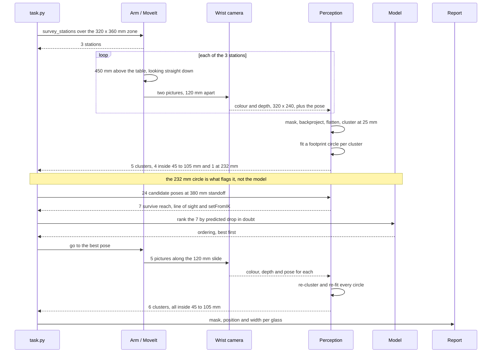
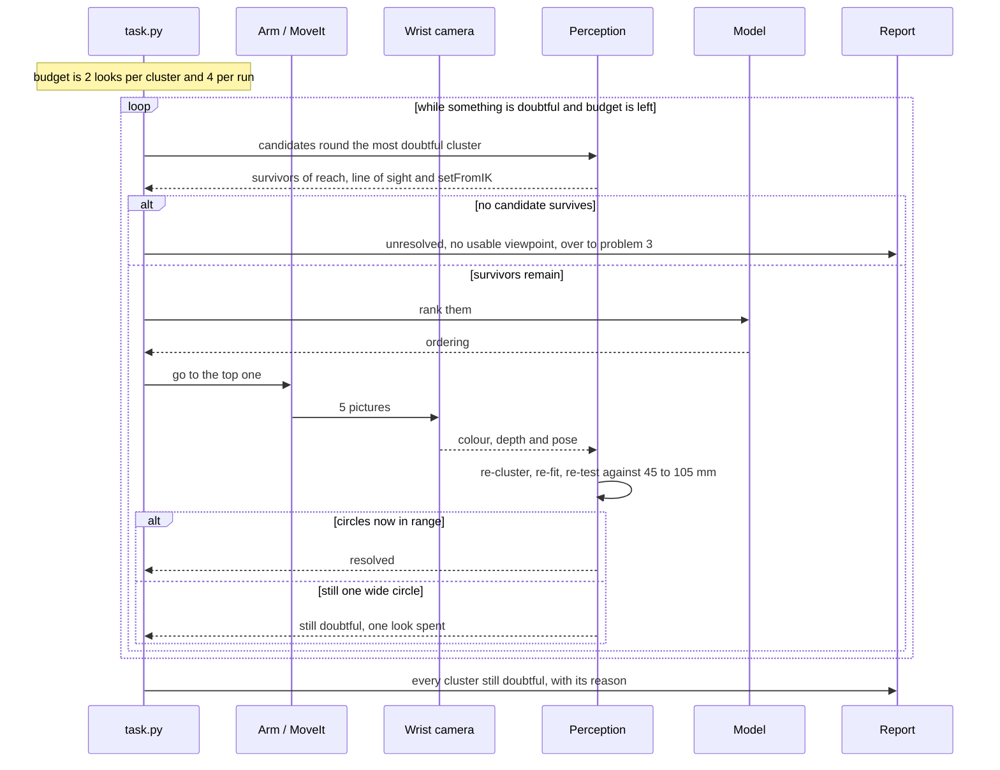

# Solution 4 — learned doubt steers the next picture

*Hybrid, with the model as a ranker. The fixed sweep happens first. Then a
learned estimate of how unsure each object is decides which extra picture is
worth taking, from candidate poses the geometry has already filtered.*

## In one paragraph

The arm cannot look everywhere, so it has to choose. This solution leaves the
geometry in charge of where the camera may stand — reachable, unoccluded,
plannable — and gives a learned number the smaller job of saying which survivor
is worth the seconds. The number estimates how much doubt a look would remove.
It never admits a pose the arithmetic rejected, and never decides that a cluster
is settled. That ordering is what makes this a hybrid, and what caps the damage
when the estimate is wrong — which is the failure the design is arranged around.

## The problem this solves

Four to six glasses stand on the table, all of one kind, the kind known, at
least 150 mm apart, upright and opaque. The arm has to say which pixels belong
to which glass, where each one stands, and how wide its footprint is. It also
has to say, honestly, which glasses it could not separate.

Two things get in the way, and they are different problems.

**Two glasses far apart on the table can land on top of each other in a
picture.** If the camera is in line with both, the near one covers part of the
far one and the grouping step returns a single object. The projection has thrown
away the fact that would have separated them — which pixels were near, which
were far — and no amount of work on that picture puts it back.

**The camera can no longer stand wherever it likes.** It is on the wrist, so
choosing where it stands means choosing where the whole arm stands. A viewpoint
has to clear the line of sight, the arm's own reach and the planner, all at
once. With five glasses on the table, a glass can end up with no usable
viewpoint at all.

[`problem.md`](../problem.md) names the failure to watch hardest: a **merge**, two
real glasses reported as one. A split glass looks wrong immediately. A merged
pair looks like one large glass, and everything downstream believes it. A merge
is precisely the case where a perception step is *confident and wrong*, which is
why nothing learned is allowed to decide anything in this design.

## How it works, end to end

Take the pictures you always take. Work out what is settled and what is not. For
anything not settled, ask where you would have to look for it to become clear,
go and look there, and work it out again. Stop when nothing is doubtful or when
the budget is spent.

### The setup

The table top is at 750 mm and the arm is bolted to the near edge, reaching out
along +x. The glasses stand in a zone 320 x 360 mm (`GLASS_ZONE` in
`rack/layout.py`): four to six of them, one known kind, at least 150 mm apart,
65 to 230 mm tall, footprints 45 to 105 mm across. The rack is on the far side
of the table, out of the back of every survey picture.

The camera is **on the wrist**. It is a 320 x 240 RGB-D sensor with a 60-degree
horizontal field of view. Moving it means moving the whole arm, so a viewpoint
costs seconds and a picture costs milliseconds. That single asymmetry drives the
whole design: take more pictures from each place you go, and go to fewer places.

Known before the run: the table plane, the arm's comfortable reach (300 to
780 mm out from the base), the lens, and the kind — and therefore the 45 to
105 mm footprint range every glass on this table must fall inside. Not known:
how many glasses, where they stand, and which pixels are which.

### The pictures

**The survey comes first, and it is not learned.** An adaptive method needs a
belief to choose its first viewpoint, and before the first picture there is
none. `survey_stations` spreads three stations over the glass zone with 35 per
cent overlap, so a glass cut off at the edge of one picture is well inside
another. At each station the camera sits **450 mm above the table top, looking
straight down**, and takes **two pictures 120 mm apart** — a sideways slide,
wide enough that a glass visibly shifts between the two and narrow enough that
both pictures catch the same glasses. One picture covers about 520 x 390 mm of
table.

**Extra looks come second, and there are at most four.** They are taken from
**380 mm back from the doubtful cluster, level, 120 mm above the table** — the
same standoff geometry problem 1 uses for its side-on measurement, so a look
taken to resolve a merge is not wasted if it also serves that. Level is the
direction that matters here: it is the view in which two glasses standing apart
on the table separate, or fail to.

### What each picture captures

Four things come back from one shutter:

- **Colour**, 320 x 240 pixels.
- **Depth**, aligned, same 320 x 240, valid from 0.05 to 3.0 m.
- **A mask** of the pixels standing above the table plane, from
  `detect.standing_on_the_table`. It says *glass, not table*. It has no opinion
  about how many glasses.
- **The pose** of the camera at the moment of the shutter, from the arm's own
  forward kinematics.

The lens is fx = fy = 277.1 pixels. At the 450 mm survey height one pixel
therefore covers 450 / 277.1 = **1.6 mm** of table, and at the 380 mm standoff
380 / 277.1 = **1.4 mm**. Those two numbers turn every pixel argument below into
a millimetre argument.

### What is interpreted, and how


Note that the numbers only ever fall. The learned stage takes seven candidates
and returns the same seven in a different order.

The chain, in order, naming the operation at each step:

1. **Mask.** Pixels above the table plane.
2. **Backproject.** Every masked pixel, with its depth and the recorded pose,
   becomes a point in the room in millimetres from the arm's base.
3. **Flatten.** Drop the height. A glass is a footprint on a known plane.
4. **Cluster by distance**, at 25 mm, over the points from every picture at
   once. This is where glasses become objects — on the table, not in a picture.
5. **Fit a circle** to each cluster's footprint: centre, diameter, residual.
6. **Accept or reject** each circle against the kind's 45 to 105 mm range.
   **This is the step that decides whether a cluster is resolved, and it is
   arithmetic.** A 232 mm circle is rejected whatever any model says about it.
7. **Score the doubt** per cluster, as a small vector, not one number: the mean
   per-pixel entropy over its mask (the model's own doubt), the circle-fit
   residual against the range (geometric doubt, which owes nothing to the
   model), and the disagreement between the station's two views (model-free, and
   already paid for). A cluster is doubtful if **any one** of the three fires.
   They are ORed, not ANDed, so a silent model cannot suppress a geometric
   complaint.
8. **Generate** 24 candidate poses round the most doubtful cluster, at
   15-degree spacing, 380 mm back.
9. **Veto**, cheapest test first: **reach** (the camera has to land between 300
   and 780 mm from the base — one square root each), **line of sight** (reject
   any sight line passing through another cluster's fitted circle — one
   line-circle test per pair), then **inverse kinematics** (MoveIt 2's
   `setFromIK`, milliseconds each).
10. **Rank** the survivors with the learned score, by how far it predicts the
    doubt vector would fall. One forward pass of a small network each.
11. **Move**, settle, and take five pictures along the 120 mm slide rather than
    two, because the arm is already there.
12. **Back to step 2**, with the new points added. It is a re-measure, not a
    patch: clustering and circle fitting run again over everything, so a look
    can change the answer for a cluster it was not aimed at.

Steps 8 and 9 are geometry and they hold the veto. Step 10 is the only learned
step, and all it does is reorder a list the geometry has already approved. The
model cannot propose a pose, cannot re-admit one the geometry rejected, and
cannot declare a cluster resolved. **That is why a wrong prediction costs one
wasted look rather than a wrong answer.**

### What comes out

Per glass: a **mask** (which pixels in which picture), a **position** on the
table in millimetres from the arm's base, and a **rough footprint width** in
millimetres. Alongside it, a list of the clusters still doubtful when the budget
ran out, each with the reason — out-of-range circle, no candidate viewpoint, or
cap reached.

Both go to the report. The resolved glasses are what problem 1's step 2
measures, from the standoff poses this solution has already proved reachable.
The doubtful list is the input to [problem 3](../../problem-3/problem.md), whose
job is to move a glass that cannot be separated where it stands.

## The sequence

The normal path: the three-station survey, one cluster that fails the circle
test, one extra look, and the answer.



The interesting path: the loop itself, where a bad ordering costs a look and the
two caps are the only way the loop can be made to stop.



## In pseudocode


**Legend.** Green is new code written for this solution; blue is code the
project already has; grey is a third-party library.

```text
stations = survey_stations(GLASS_ZONE, footprint)      # have  · work_cell.arm.dimensions
for eye in each_station_slid_by(stations, 0.12):       # have  · work_cell.task
    rgb, depth, pose = arm.look_down_from(eye, 0.45)   # have  · work_cell.task
    mask = detect.standing_on_the_table(depth, pose)   # have  · work_cell.glasses.detect
    points += backproject(depth, mask, pose, K)        # have  · work_cell.glasses.perception

looks_left = 4                                         # NEW   · whole-run cap
spent = Counter()                                      # NEW   · per-cluster cap, max 2
while looks_left > 0:                                  # NEW   · ~50 lines
    groups = cluster_by_distance(points[:, :2], 25.0)  # NEW   · numpy
    for g in groups:                                   # NEW
        g.centre, g.width, g.rms = fit_circle(g)       # NEW   · numpy.linalg.lstsq
        g.doubt = (entropy(g), g.rms, views_differ(g)) # NEW   · torch + numpy
    g = worst(groups, kind.accepts, spent)             # NEW   · work_cell.glasses.spec
    if g is None:                                      # NEW   · nothing doubtful left
        break
    poses = ring(g.centre, back=0.38, count=24)        # NEW   · numpy
    poses = [p for p in poses if reaches(p)]           # have  · work_cell.arm.dimensions
    poses = [p for p in poses if sight_clear(p, g)]    # have  · work_cell.task
    poses = [p for p in poses if arm.set_from_ik(p)]   # have  · moveit2
    if not poses:                                      # NEW
        report.doubtful(g, "no usable viewpoint")      # have  · work_cell.report
        spent[g.id] = 2                                # NEW   · stop retrying it
        continue
    best = max(poses, key=model.predicted_drop)        # NEW   · torch
    points += arm.photograph_from(best, shots=5)       # have  · work_cell.task
    spent[g.id] += 1                                   # NEW
    looks_left -= 1                                    # NEW
report.glasses(groups)                                 # have  · work_cell.report
```

The libraries, and whether adding one is a decision:

| Library | Used for | Licence | In the pixi environment? |
| --- | --- | --- | --- |
| [NumPy](https://numpy.org/) | backprojection, clustering, circle fits | BSD-3-Clause | yes |
| [OpenCV](https://opencv.org/) | masks, connected components, ellipse fit | Apache-2.0 from 4.5 | yes |
| Matplotlib | the calibration plot | BSD-style | yes |
| [MoveIt 2](https://moveit.ai/) | `setFromIK` for the plannability veto | BSD-3-Clause | yes, already a dependency |
| [Gazebo](https://gazebosim.org/) | every training example | Apache-2.0 | yes, already running |
| [PyTorch](https://github.com/pytorch/pytorch) | the segmenter and the scoring network | BSD-3-Clause | **no** |
| [OctoMap](https://octomap.github.io/) | occupancy map, only if a volumetric score is ever built | core BSD-3-Clause, extensions differ | **no** |
| [TorchUncertainty](https://github.com/ENSTA-U2IS-AI/torch-uncertainty), [Laplace](https://github.com/aleximmer/Laplace) | packaged uncertainty methods, optional | permissive, but read the file | **no** |

PyTorch is the real addition. Everything else on the list is either already
there or optional, and the geometric half of this solution needs none of it.

## A worked example

The survey has finished. There are five clusters on the table.

Four of them fit footprint circles of 71, 74, 76 and 78 mm — all inside the
kind's 45 to 105 mm range, so all four are settled.

The fifth fits a circle of **232 mm**. No glass of this kind is that wide. Its
centre is at x = 0.40 m, y = −0.35 m, which is
sqrt(0.40² + 0.35²) = **532 mm** from the arm's base; call it 530.

The mean per-pixel entropy over that cluster's mask is **0.06 bits** — the
segmenter is confident. The geometric check is what flags the cluster; the model
would have said nothing. Budget for the cluster: two looks.

### Filtering the 24 candidates

Write θ for the angle between the standoff direction and the line running
outward from the arm's base through the cluster. The camera lands 380 mm from
the cluster along that direction, so its distance from the base is

    sqrt(530² + 380² + 2 · 530 · 380 · cos θ)
    = sqrt(425,300 + 402,800 · cos θ)   mm

**Reach.** The 780 mm ceiling needs 425,300 + 402,800 cos θ ≤ 608,400, so
cos θ ≤ 0.455 and θ ≥ **63 degrees**. The 300 mm floor needs
425,300 + 402,800 cos θ ≥ 90,000, so cos θ ≥ −0.832 and θ ≤ **146 degrees**. Of
the 24 directions, those falling in that band are 75, 90, 105, 120 and 135
degrees, on either side. **Ten survive; 14 are out of reach.**

**Line of sight.** A neighbouring cluster sits to one side, and the sight lines
at −120 and −135 degrees pass through its fitted circle. Concretely: the
neighbour would be 480 mm from the camera, and its 105 mm footprint spans
105 × 277.1 / 480 = **61 pixels** of the 320 across, sitting on top of the
target. **Eight left.**

**Plannability.** `setFromIK` fails on +135 degrees. **Seven are scored.**

### The ordering


The bar chart is ordered the way the printed rule takes the candidates, and the
first bar it takes is zero.

Here is what the geometry could not know. The 232 mm cluster is two glasses of
78 and 74 mm footprint, standing 155 mm apart, and the line joining them runs at
120 degrees to the outward line from the base. Both are inside **one** fitted
circle, so no line-of-sight test has anything to test against.

How far apart the two land in a picture taken from angle θ is the separation
seen edge-on, converted to pixels:

    155 mm × (277.1 / 380 mm per pixel) × |sin(θ − 120°)|
    = 113 px × |sin(θ − 120°)|

They stop touching only when that exceeds the sum of their half-widths in
pixels:

    (39 + 37) mm × 277.1 / 380 = 55 px

| θ | camera, from base | the two glasses land | does the look work? |
| --- | --- | --- | --- |
| +75° | 728 mm | 80 px | yes |
| +90° | 652 mm | 57 px | just |
| +105° | 567 mm | 29 px | no |
| +120° | 473 mm | 0 px | no — dead in line |
| −75° | 728 mm | 29 px | no |
| −90° | 652 mm | 57 px | just |
| −105° | 567 mm | 80 px | yes |

**The printed rule.** Every survivor has a clear line of sight, because the
filter saw to that, so the rule falls through to its tiebreak: prefer least
reach. That orders them +120, +105, −105, +90, −90, +75, −75. Its first pick,
+120, is the one direction that looks straight along the line joining the two
glasses, and the look reproduces the merge exactly. Its second, +105, puts them
29 pixels apart, still inside a single silhouette. **Both of the cluster's looks
are spent and nothing is resolved.**

**The learned score.** It orders them −105, +75, +90, −90, +105, −75, +120, and
takes −105 first. The two candidates at 80 pixels tie on separation, and the
tiebreak goes to −105 because the camera sits 567 mm from the base rather than
728: less extension, less wobble, less distance to travel. Nobody told the model
that; it came out of training on what happened when the arm went there.

The model's ordering is the illustrative part. The pixel arithmetic in the table
is not: it is what the camera would see.

### The look itself

Plan, move, settle — seconds, and the only real cost. Then five pictures along
the 120 mm slide rather than two. The cluster resolves into two circles, 78 and
74 mm, centres 155 mm apart, both inside the kind's range. One look spent of
four.

### The counter-argument, which is the honest part

What the model learned to prefer is viewpoints across the long axis of the
doubtful cluster. That can be written down:

> Fit an ellipse to the doubtful cluster's footprint points. Take its long axis.
> Sort the surviving candidates by how nearly perpendicular they are to it.

Four lines of arithmetic, no data, no weights file, no training run — and on
this example it picks the same viewpoint. That is why the overview marks this
solution *the richest version of moving the camera* rather than something to
build first. With one known kind, the thing that makes a look pay off is one
nameable quantity, and a nameable quantity should be named rather than fitted.

Fitting earns its keep when there is no single quantity to name: when the kind
is unknown, the allowed footprint range is the union of several, and whether a
look pays off depends on shape as well as geometry. That is
[problem 4](../../problem-4/problem.md), not this one.

## What the doubt number is, and what it is worth

Uncertainty is a second number returned beside the answer, saying how far to
trust the first. For a **detection** — a rectangle round an object — it is one
number for the rectangle. For a **segmentation** — a yes-or-no label per pixel —
it is one number per pixel, so the doubt is itself a picture. Three questions
have to be asked of such a number before it is allowed to steer an arm.

### It has to catch the case where the answer is confident and wrong


Look at the third panel. The doubt is low and the answer is wrong, and the bar
looks exactly like the bar in the first panel, where the answer was right.

- **Confident and right.** Two masks, two glasses, low doubt. Nothing to spend a
  look on.
- **Unsure and right.** The loop spends a look it did not need. That costs
  seconds of arm time, not correctness, and seconds are the cheaper currency.
- **Confident and wrong.** One mask over two glasses, low doubt. Nothing is
  flagged, no look is taken, and the run reports one 232 mm glass.

A doubt number is only worth having if it catches the third case, and every
method below is best at the second and worst at the third. Worse, over a merged
mask the uncertainty is often *genuinely* low: the mask is a perfectly good mask
— of two glasses. The model was asked which pixels are glass and got that right.
Nothing in that question has an opinion about how many glasses there are. The
doubt has to come from somewhere that does, and here that is the footprint
circle.

### Wrong is not the same as unusual


Read the left-hand column. Both cells have ordinary, familiar-looking inputs;
one answer is right and one is wrong, and no amount of novelty detection tells
them apart.

**Novelty**, or out-of-distribution detection, is high when the input looks
unlike the training data. **Error-awareness** is high when the answer is wrong,
whatever the input looked like. The loop wants the second, and it is much harder
to get. The two coincide only where an unusual input also produces a wrong
answer, which is the corner most papers are scored on.

Here every picture comes out of one simulator, through one camera, with one kind
of glass, so the unusual-input column is nearly empty and novelty detection buys
almost nothing. It starts buying a great deal at
[problem 4](../../problem-4/problem.md), where the kind is no longer known and a
badly calibrated model is most confident precisely on the shape it has never
seen.

**Aleatoric** doubt is noise in the measurement and another picture will not
remove it. **Epistemic** doubt is the model not knowing, and a different picture
can. Only epistemic doubt justifies moving the arm, and a merge is epistemic
almost by definition: the fact that separates the two glasses exists, it is just
not in a picture taken in line with both.

### Five ways to get the number


Read the last column. On this machine the differences at inference time are
almost irrelevant; the differences in training cost are not.

- **Predictive entropy.** How spread out the per-pixel softmax is. For a
  two-class choice the entropy in bits is `-(p log2 p + (1-p) log2 (1-p))`: one
  full bit at p = 0.5, 0.47 bits at p = 0.9, 0.14 bits at p = 0.98. One forward
  pass, no extra training, and what almost everyone uses first. Its weakness is
  that softmax outputs are systematically overconfident ([Guo and
  colleagues](https://arxiv.org/abs/1706.04599)), so a confidently wrong answer
  comes back with confidently low entropy — the third panel above.
- **Monte Carlo dropout.** Leave dropout switched on when the model is used, run
  the same picture ten times, and read the spread ([Gal and
  Ghahramani](https://arxiv.org/abs/1506.02142); [Bayesian
  SegNet](https://arxiv.org/abs/1511.02680) is the per-pixel version). Ten
  forward passes, no extra training.
- **Ensembles.** Five copies of the network trained from different seeds; where
  they agree the answer came from the data, where they disagree it came from the
  seed. [Deep ensembles](https://arxiv.org/abs/1612.01474) win most published
  comparisons and multiply the training cost by five.
- **Evidential and Bayesian deep learning.** Predict a distribution *over*
  probabilities, so one pass returns both the answer and how much evidence
  stands behind it ([Sensoy and
  colleagues](https://arxiv.org/abs/1806.01768); [Amini and
  colleagues](https://arxiv.org/abs/1910.02600) for regression). The cost is a
  new loss, and the evidence strength needs its own calibration check.
- **Disagreement between the station's two views.** No model at all. Segment
  both pictures, project each onto the table, and measure how far apart they put
  the same glass. At 1.6 mm per pixel, a disagreement of more than a few
  millimetres is not depth noise. It costs nothing, because both pictures are
  already paid for.

Ten forward passes are still thousands of times cheaper than one arm move, so on
a machine with no NVIDIA card this is a training-cost choice, not an inference
one. [PyTorch](https://github.com/pytorch/pytorch) (BSD-3-Clause) runs a small
segmenter on a 320 x 240 picture in a few milliseconds through its CPU or Metal
path; exactly how few has to be measured.
[TorchUncertainty](https://github.com/ENSTA-U2IS-AI/torch-uncertainty) and
[Laplace](https://github.com/aleximmer/Laplace) package several of these methods
so you do not implement them yourself; both look permissively licensed, but the
licence file should be read rather than taken on trust.

### Calibration, which is what makes the number mean something


The gap between the red curve and the dashed diagonal is the thing to look at:
where the model says 95 and is right 72, the loop is being talked out of exactly
the looks it most needed.

A doubt number is calibrated when its claims are true on average: of the cases
where it claims 90 per cent confidence, about 90 per cent should be right. Run
the pipeline over a few hundred spawned arrangements, bin every prediction by
the confidence it claimed, and plot claimed against observed, scored against the
simulator's own record. A curve below the diagonal is overconfident, which is
the usual direction and the dangerous one. The summary number is the average
gap, weighted by how many predictions fell in each bin — expected calibration
error. The weighting matters, because nearly all predictions claim high
confidence.

The cheap repair is **temperature scaling**: divide the raw scores by one
number before the softmax, fitted on held-out data in seconds. It does not make
a wrong answer right. It makes the model's claim about that answer honest, which
is all the loop needs.

Until that plot exists for this cell, the doubt number is a heuristic that
happens to live in a weights file. That is an argument for measuring it, not
against fitting it, and the simulator makes the labels free.

### What the model is actually trained to predict

The obvious target is the expected drop in the model's own uncertainty. Taken
alone it has a hole in it: if the perception step is confidently wrong there is
no uncertainty to drop, every candidate scores near zero, and the ordering
carries no information — in exactly the case where it is needed.

The repair is the doubt *vector* of step 7 above. The learned part predicts how
far that whole vector would fall if the camera went to a given pose. Where the
model's own doubt is real, it dominates. Where the model is confidently wrong,
the geometric component still has something to say and the score still orders
sensibly. Making a model's own confidence the sole currency of doubt is the
mistake; the geometry has to be in the currency too.

**Training data is free.** Spawn an arrangement in
[Gazebo](https://gazebosim.org/) (Apache-2.0, already running). Run the survey.
Note which clusters are doubtful and by how much. Pick a candidate pose, render
the view from it, run the geometry again, and measure how far the doubt actually
fell. State and pose in, measured drop out: one training example, with no arm
moving and nobody labelling anything. A few thousand of them is an overnight
job.

One honest note on the neighbour. Predicting *whether the answer changes* — did
this cluster become two in-range circles — is a more direct target, and that is
the "learn which viewpoints pay off" solution. The difference is small: a
continuous doubt also tells the loop whether to look at all and when to stop,
where a does-it-change classifier only ranks poses.

## The feedback loop


Follow the right-hand edge: there are three ways out, and one of them is simply
running out of time.

The loop is old. Ruzena Bajcsy's *Active Perception* (Proceedings of the IEEE,
1988) made the argument that a camera which can move is not the same instrument
as one that cannot, and Connolly's *The Determination of Next Best Views* (ICRA,
1985) named the step that follows from it: given what has been seen, which
viewpoint next. This solution keeps that shape and changes what "next best" is
scored on.

### The classical score, and why it is not used

The textbook score is **information gain over an occupancy map** — cut the room
into cubes, store a probability of occupancy per cube, and score a candidate by
how much of the map's total entropy it would resolve (Moravec and Elfes, ICRA
1985; [OctoMap](https://octomap.github.io/) is the standard implementation, core
library BSD-3-Clause, with differently licensed extensions alongside it).

It is affordable here. The glass zone is 320 x 360 mm and the glasses are at
most 230 mm tall, so at 5 mm cubes that is 64 x 72 x 46, about **212,000
cubes**; one candidate casts one ray per pixel, **76,800 rays**, each crossing a
few tens of cubes. A few million cube visits is milliseconds, and two dozen
candidates still well under a second. MoveIt 2 already maintains an occupancy
map, so the structure exists whether or not this solution is built.

It is not used because it answers a different question. Occupancy entropy asks
*where is the room unmapped*. The question here is *is this one glass or two*,
and both readings of a merged pair produce a perfectly well-mapped table. The
volumetric score would happily send the arm to look at the empty half of the
table. What survives from it is the shape of the idea: score a candidate by the
doubt it would remove.

### The budget, which is the exit condition


The left panel is in units of one station's worth of arm motion, because the
absolute number has to be measured rather than asserted.

Write *t* for one plan, move and settle — one station's worth of arm motion,
timed from the survey routine as it actually runs rather than guessed here. The
survey is **3t**. With the cap of four extra looks the worst case is **7t**, a
bit more than twice the survey. Six clusters taking two looks each would be
**15t**, five times the survey, which does not fit a run meant to take tens of
seconds.

Hence two caps, not one:

- **Two looks per cluster.** Stops a single hopeless cluster eating everything.
- **Four looks per run.** Stops six moderately doubtful clusters between them
  eating everything.

The right panel shows why both are needed. One cluster resolves on its first
look and gives the rest back. Another — a pair lying in line with every pose the
geometry left — never resolves, and without the per-cluster cap it would take
all four, each look scoring well and none of them helping.

When a cap fires, the cluster is reported as unresolved with its reason. That is
a result, not a failure: [`problem.md`](../problem.md) asks for exactly this
list.

### What the loop costs in computation, which is nothing

Per doubtful cluster: 24 square roots for the reach test, about a hundred
line-circle tests for the sight lines, ten `setFromIK` calls at milliseconds
each, and seven forward passes of a small network. Even the full volumetric
score — 76,800 rays over 212,000 cubes — would be milliseconds. Against *t*,
measured in seconds, all of it is free. **The thing to economise on is the
number of times the arm moves, not the arithmetic.** A design that saves
computation by taking one more look has the trade exactly backwards.

## What it needs

**Data.** None from outside. Every example comes from Gazebo, generated
unattended.

**Hardware.** The Apple Silicon Mac the project already runs on. No NVIDIA card
and no CUDA at any point. Training is an overnight job for a small network;
inference is milliseconds, and how many should be measured before the numbers
above are relied on.

**Time.** The geometric filter is needed whether or not the model is built, so
it is not a cost of this solution. On top of it: a day or so to wire up the
example generator, an overnight training run, and the calibration measurement —
the part most likely to be skipped, and the part that decides whether any of it
was worth doing.

## Where it is strong and where it breaks

**Strong**

- **Arm time goes where the doubt is**, decided during the run.
- **It degrades to something that works.** Without the weights, the geometric
  filter still returns reachable, unoccluded, plannable poses — sorted by the
  printed rule, that is
  [move the camera](solution-overview.md#solution-3--move-the-camera).
- **Bounded failure.** A bad ordering costs one look; the caps — two per
  cluster, four per run — bound the total. Neither arm safety nor the merge test
  depends on the model.
- **Free labels.** The simulator knows what it spawned.
- **Reusable looks.** Candidates reuse problem 1's 380 mm standoff geometry.

**Breaks**

- **The ordering was good enough already.** The doubt is one binary question —
  one glass or two — asked five times, and the ellipse-axis rule picks the same
  pose in four lines of arithmetic.
- **A confidently wrong model is invisible to itself.** A merged mask has low
  entropy everywhere; only the circle fit catches it, so the model may never
  declare a cluster resolved.
- **Two holes geometry cannot close.** Sight lines test against fitted circles,
  so one wide circle hides its own occlusion; and a cluster no viewpoint can
  resolve pulls look after look until the per-cluster cap fires.
- **No candidate survives** is a fact about where the glasses stand, not a
  perception failure — over to [problem 3](../../problem-3/problem.md).
- **Real glassware.** A depth camera returns no usable surface for transparent
  glass.
- **Unproven until the calibration plot is drawn.** Build the filter now, fit
  the model later.
## The general methods behind this

This solution joins two literatures: one about making a model say how sure it
is, and one about deciding what to measure next. Both are general, and the
second is much older than the first.

### Uncertainty quantification in deep learning — a model that reports its own doubt

A network trained the usual way outputs a number between 0 and 1 and will emit
0.99 on an input unlike anything it has seen. Making that number mean something
is a field in itself. The three practical families:

**Monte Carlo dropout** — leave dropout switched on at inference, run the same
input several times, and read the spread (Gal and Ghahramani,
[arXiv:1506.02142](https://arxiv.org/abs/1506.02142)). Cheapest to adopt,
weakest guarantees.

**Deep ensembles** — train several models from different initialisations and
read their disagreement (Lakshminarayanan et al.,
[arXiv:1612.01474](https://arxiv.org/abs/1612.01474)). Consistently the
strongest of the three, and the most expensive, since it multiplies training
cost.

**Evidential and Bayesian methods** — have the network output the parameters of
a distribution rather than a point (Sensoy et al.,
[arXiv:1806.01768](https://arxiv.org/abs/1806.01768)). One forward pass, at the
cost of a less familiar loss.

- **Mostly used for** anything where being wrong is expensive and abstaining is
  cheap: medical imaging, autonomous driving, industrial inspection, and active
  learning, where the doubt is what selects the next thing to label.
- **Rarely right for** settings where the model is wrong in ways it cannot
  represent. Every method here measures *disagreement among plausible models*,
  so a systematic error shared by all of them is invisible. None of it detects
  "my training data did not contain this situation at all" reliably.
- **More:** [uncertainty quantification](https://en.wikipedia.org/wiki/Uncertainty_quantification);
  [ensemble learning](https://en.wikipedia.org/wiki/Ensemble_learning).

### Aleatoric and epistemic uncertainty — two different kinds of not knowing

**Aleatoric** uncertainty is in the data and does not shrink with more of it:
a blurred edge is genuinely ambiguous. **Epistemic** uncertainty is in the
model and does shrink: a shape it has not seen enough of. Only the second is a
reason to go and look again — and the distinction is what makes this solution's
loop sensible rather than superstitious (Kendall and Gal,
[arXiv:1703.04977](https://arxiv.org/abs/1703.04977)).

- **Mostly used for** deciding *what to do* about doubt: epistemic doubt says
  gather more, aleatoric doubt says the measurement will not improve and you
  should abstain or change the sensor.
- **Rarely separable cleanly** in practice. The decomposition is model-relative
  and the two are easy to confuse, which is why the guard below never lets the
  model decide anything on its own.

### Calibration — making a probability mean what it says

A model is **calibrated** when things it calls 90 per cent likely happen 90 per
cent of the time. Modern networks are badly overconfident by default, and the
standard fix is **temperature scaling**: one parameter fitted on held-out data
(Guo et al., [arXiv:1706.04599](https://arxiv.org/abs/1706.04599)). Without it,
a threshold on a confidence is a threshold on an arbitrary number.

- **Mostly used for** any system that acts on a probability rather than an
  argmax — triage, abstention, risk-weighted decisions, and exactly the
  budget-spending this solution does.
- **Rarely optional.** If nothing downstream reads the number as a probability,
  calibration does not matter; the moment a threshold appears, it does.
- **More:** [Platt scaling](https://en.wikipedia.org/wiki/Platt_scaling);
  scikit-learn's [calibration guide](https://scikit-learn.org/stable/modules/calibration.html).

### Active learning and information gain — choosing the most informative next measurement

The general principle is older than the vision problem: given a budget, spend it
on the measurement that most reduces what you do not know. In machine learning
this is **active learning**, where the model picks which example to have
labelled; in robotics it is view planning, where it picks where to stand. Both
score candidates by expected reduction in uncertainty.

- **Mostly used for** settings where measurements are expensive and plentiful in
  choice: labelling budgets, scientific experiment design, robot exploration.
- **Rarely right for** cheap measurements. If another picture costs
  milliseconds, take several and skip the reasoning — which is precisely why
  this cell's *pictures* are taken freely and only its *moves* are planned.
- **More:** Settles,
  [Active Learning Literature Survey](https://burrsettles.com/pub/settles.activelearning.pdf);
  [active learning](https://en.wikipedia.org/wiki/Active_learning_%28machine_learning%29).
